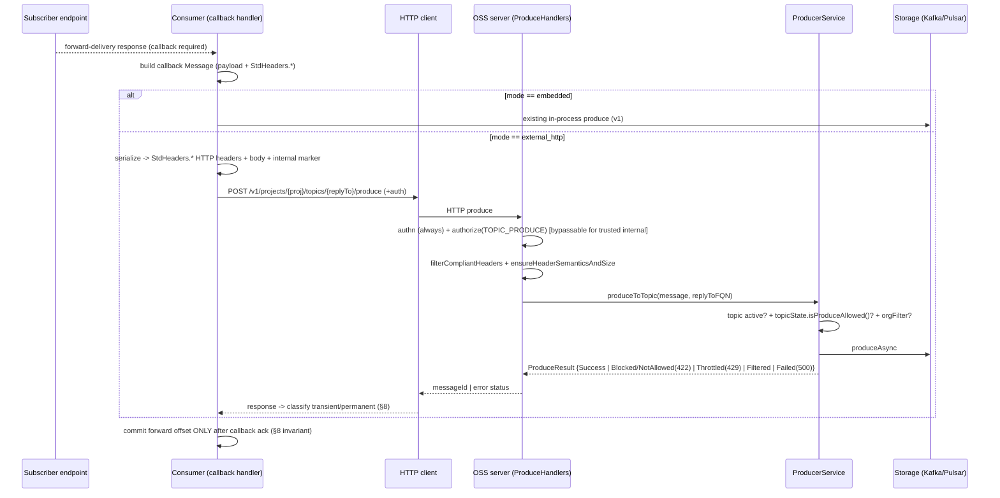

# Grooming (OSS variant): Callback produce as an external HTTP call to the OSS produce endpoint

> This is the **OSS-targeted** rewrite of the oncall grooming doc *"Callback produce as an external HTTP call to producer-api (v1/v2 topic flag)"*.
> The consumer-side intent is unchanged (route callback produce over HTTP, gated by a per-topic flag). What changes is the **target stack**: oncall's standalone `producer-api` with its `X_RESTBUS_*` envelope and chained guardrail handlers does **not** exist in OSS. OSS produce is a single handler on the server verticle, the message is natively headers+body, and the guardrails are a per-region topic-state gate plus an org/NFR filter inside `ProducerService`. Sections below are remapped to the **actual OSS code**.

| Field | Value |
|-------|--------|
| **Feature** | Route the consumer's **callback produce** through an HTTP call to the **OSS produce endpoint**, instead of an embedded/in-process producer. |
| **Why** | Decouple the consumer from an embedded produce stack; all consumer produce flows (callback, RQ, SQ, DLQ) go over HTTP to the OSS server. |
| **Gate** | Per-topic flag in topic metadata (`VaradhiTopic` properties): `embedded` (current) vs `external_http` (this feature). |
| **Precedent** | OSS already ingests produce as `headers + body` over HTTP and rebuilds the `Message` server-side (`ProduceHandlers.buildMessageToProduce`). The callback path reuses this same surface. |
| **Status** | Grooming |
| **Scope (this doc)** | Callback flow against the **OSS produce stack**. Cross-references the topic-failover orchestration docs for the produce-gate coupling. |

---

## 0. OSS deltas vs the oncall doc (read this first)

| Oncall assumption | OSS reality | Source |
|-------------------|-------------|--------|
| Standalone `producer-api` module, route `POST /topics/:t/messages` | Produce is a single route on the **server/web verticle**: `POST /v1/projects/:project/topics/:topic/produce` | `web/.../v1/producer/ProduceHandlers.java:96` |
| Message rebuilt via `MessageProduceHelper.constructMessage` (proto re-derivation) | Message is **natively** `headers + body`: `new SimpleMessage(payload, compliantHeaders)` — no proto round-trip | `ProduceHandlers.java:204-212` |
| `X_RESTBUS_*` header envelope | **Config-driven `StdHeaders`** (`msgId`, `groupId`, `replyTo`, `httpUri`, …) with `allowedPrefix` filtering | `entities/.../StdHeaders.java`, `ProduceHandlers.filterCompliantHeaders:223` |
| Guardrail **handler chain**: `AuthenticationHandler`, `AuthorizationHandler`, `BlockedProducerHandler`, `MirrorTopicHandler`, `NfrMessageHandler`, `CapacityPlanHandler`, `RequestBodyHandler` | Guardrails are: route-level `.authorize(TOPIC_PRODUCE)` + **two checks inside `ProducerService`** (per-region topic-state gate, org/NFR filter) + body-size in a validator | `ProduceHandlers.java:100`, `ProducerService.produceToValidTopic:207-228` |
| `BypassableHandler` + `X_RESTBUS_INTERNAL_PRODUCE` marker | **No such mechanism** — would be net-new; and the topic-state gate should **not** be bypassed (see §7) | — |
| `SystemTokenJWTClaimsValidator` system-token | OSS authn is pluggable (`UserHeader` / `Custom` / `Anonymous`) — no drop-in system token | `web/.../authn/*`, `web/.../configurators/AuthnConfigurator.java` |
| Mirror-topic / NFR-drop / capacity-plan handlers | No mirror concept. NFR analogue = `applyOrgFilter` → `ProduceStatus.Filtered`. No separate capacity handler; throttling surfaces as `ProduceStatus.Throttled` | `ProducerService.applyOrgFilter:296-316` |

**Net:** the highest-risk part of the oncall doc (lossy header round-trip, §6 there) **largely disappears** in OSS, because the message *is* headers+body. The new work concentrates in three places: (a) header-name parity with `StdHeaders`, (b) a narrow, auth-gated bypass for authz/org-filter (NOT topic-state), and (c) treating the OSS per-region topic-state gate as a **transient** failure during failover.

---

## 1. Problem statement / motivation

Today the consumer produces the callback message to the `replyTo` topic using an embedded/in-process producer. We want all consumer produce to go over HTTP to the OSS produce endpoint and retire the embedded stack. Callback is one of four internal-produce flows (callback, RQ, SQ, DLQ); if it stays embedded, the consumer must keep the whole embedded produce library resident for one flow.

**Proposed callback path (v2 / `external_http`):**

```
consumer callback handler (v2 branch)
  └─ build HTTP POST  {ossServer}/v1/projects/{project}/topics/{replyTo}/produce
       body = subscriber response payload
       headers = StdHeaders.* (msgId, groupId, replyTo*, httpUri/method, …) + trusted-internal marker
  └─ auth header per OSS deployment authn
       └─ HTTP client → ProduceHandlers.produce → ProducerService.produceToTopic → storage
```

**OSS produce ingestion (the target chain):**

```96:101:varadhi/web/src/main/java/com/flipkart/varadhi/web/v1/producer/ProduceHandlers.java
                RouteDefinition.post(Constants.MethodNames.PRODUCE, API_NAME, "/topics/:topic/produce")
                               .hasBody()
                               .nonBlocking()
                               .metricsEnabled()
                               .authorize(ResourceAction.TOPIC_PRODUCE)
                               .build(this::getHierarchies, this::produce)
```

```204:212:varadhi/web/src/main/java/com/flipkart/varadhi/web/v1/producer/ProduceHandlers.java
    Message buildMessageToProduce(byte[] payload, MultiMap headers, String producerIdentity, boolean isQueue) {
        Multimap<String, String> compliantHeaders = filterCompliantHeaders(headers);
        Message message = new SimpleMessage(payload, compliantHeaders);
        MessageRequestValidator.ensureHeaderSemanticsAndSize(msgConfig, message, isQueue);
        compliantHeaders.put(StdHeaders.get().produceRegion().value(), produceRegion);
        compliantHeaders.put(StdHeaders.get().producerIdentity().value(), producerIdentity);
        compliantHeaders.put(StdHeaders.get().produceTimestamp().value(), Long.toString(System.currentTimeMillis()));
        return message;
    }
```

---

## 2. The v1/v2 flag in topic metadata

- Stored on `VaradhiTopic` properties (the reply-to topic = the produce target). New key (proposed): `callback_produce_mode` ∈ {`embedded` (default), `external_http`}.
- The consumer already resolves the reply-to topic before producing the callback, so the branch reads the property off the already-fetched topic — no extra lookup.
- Propagation is via the topic resource cache; a flag flip is **not atomic** across consumer pods. Benign for a produce *target* (both modes write the same topic), but rollback/forward reasoning must allow mixed mode.

---

## 3. End-to-end flow



---

## 4. Impacted APIs

### 4.1 HTTP surface (OSS)

| API | File | Impact |
|-----|------|--------|
| `POST /v1/projects/:project/topics/:topic/produce` | `web/.../v1/producer/ProduceHandlers.java:96` | **New caller** (consumer callback). Existing handler; full produce path applies. |
| Topic create/update | `web/.../v1/admin/TopicHandlers*` | Must accept/propagate `callback_produce_mode` in `VaradhiTopic` properties. |

> OSS has a single `/produce` route (no separate `/queues/...`). Queue vs topic header semantics are decided by `isQueue` (topic category lookup), not a different route — `ProduceHandlers.java:76-82`.

### 4.2 Consumer internal (Java) — unchanged in shape from the oncall doc

The branch point (embedded vs `external_http`), the HTTP client, the auth-token fetch, the offset-commit-after-ack coupling, and the new transient/permanent retry wrapper all remain consumer-side work. Only the **target URL, header names, and auth scheme** change to OSS conventions.

### 4.3 OSS server-side produce checks (what actually gates the callback)

| Check | Where | Behavior for callback |
|-------|-------|------------------------|
| Authentication | authn handler (`UserHeader`/`Custom`/`Anonymous`) | Always enforced (per §7). |
| Authorization | route `.authorize(ResourceAction.TOPIC_PRODUCE)` | `PRODUCE` on reply-to topic; **candidate for trusted-internal bypass** (§7). |
| Required/ID headers + size | `MessageRequestValidator.ensureHeaderSemanticsAndSize` | Required `StdHeaders` present, id-header size, `maxRequestSize` (5 MB, `conf/configuration.yml:90`). |
| Topic exists & active | `ProducerService.produceToTopic:185` | `ResourceNotFoundException` if missing/inactive. |
| **Per-region produce gate** | `ProducerService.produceToValidTopic:214` → `internalTopic.getTopicState().isProduceAllowed()` | **Failover-critical.** Blocked region ⇒ `Blocked/NotAllowed` ⇒ 422. **Do NOT bypass** (§7). |
| Org / NFR filter | `ProducerService.applyOrgFilter:220,296` | Match ⇒ `ProduceStatus.Filtered` (message dropped, success-ish). OSS analogue of oncall NFR-drop. |
| Status → HTTP | `ProduceHandlers.getHttpStatusForProduceStatus:182` | `Blocked/NotAllowed→422`, `Throttled→429`, `Failed→500`, success→messageId. |

### 4.4 Core / model + config

| Item | File | Change |
|------|------|--------|
| New property key | topic constants | `callback_produce_mode`. |
| Header parity | `entities/.../StdHeaders.java` | Consumer must emit OSS `StdHeaders` names; only `allowedPrefix` headers survive `filterCompliantHeaders`. |
| Size limits | `core/.../config/MessageConfiguration.java`, `conf/configuration.yml` | `maxRequestSize=5242880` (5 MB), `maxIdHeaderSize`. |
| Trusted-internal identity + bypass | new (web/produce) | §7 — narrow, auth-gated bypass for authz + org-filter only. |

---

## 5. Message → header parity (much smaller risk than oncall)

Because OSS messages are `SimpleMessage(payload, headers)`, there is **no proto field re-derivation**. The only requirement is that every callback field the consumer needs is emitted as a `StdHeaders`-named HTTP header and survives `filterCompliantHeaders` (kept only if it matches `allowedPrefix`).

| Callback field | OSS carrier (`StdHeaders`) | Note |
|----------------|----------------------------|------|
| message id | `StdHeaders.msgId()` | **required** (validated size; required-header check) |
| group id (grouped topics) | `StdHeaders.groupId()` | **required if grouped/queue**; size-validated |
| reply-to routing | `StdHeaders.replyTo()`, `replyToHttpUri()`, `replyToHttpMethod()` | emit only what the downstream needs; strip to prevent loops |
| http uri / method | `StdHeaders.httpUri()`, `httpMethod()` | required for queue-style targets |
| content type | `StdHeaders.httpContentType()` | — |
| callback codes | `StdHeaders.callbackCodes()` | — |
| body | HTTP body | subject to `maxRequestSize` (5 MB) |
| produce region / identity / timestamp | set **server-side** in `buildMessageToProduce` | do **not** send; server overwrites |

**Two new HTTP-layer limits (same as oncall):**
- **Body > `maxRequestSize` (5 MB) → 400/permanent.** `MessageRequestValidator:26`.
- **Headers > server max header size → 431 before handlers.** Vert.x `HttpServerOptions` (global). OSS callback headers are far leaner than oncall's `X_RESTBUS_*` set, so risk is lower — but **verify the configured max header size** (open question §10).

> **Action item:** confirm the consumer emits header **names exactly matching the deployment's `StdHeaders` config** and that they fall under `allowedPrefix` — otherwise they are silently dropped by `filterCompliantHeaders` (no error, just missing fields → possible 400 on required-header check).

---

## 6. Auth & guardrail-bypass design (OSS)

**Goal (same intent as oncall D4):** trusted internal callback produce should not be rejected by policy guardrails that the embedded path never enforced — **except** authentication, which stays on, **and except the per-region topic-state gate**, which must stay on (it is the failover mechanism).

### What may be bypassed for trusted internal callback
- **Authorization** (`TOPIC_PRODUCE`) — internal system identity, not an end-user ACL.
- **Org / NFR filter** (`applyOrgFilter`) — optional; decide whether callbacks should be NFR-filterable.

### What must NOT be bypassed
- **Authentication** — always verify identity.
- **Per-region topic-state gate** (`topicState.isProduceAllowed()`) — this is exactly how failover blocks produce on a region; bypassing it would break cross-stack failover correctness. A `Blocked/NotAllowed` (422) during failover must reach the consumer and be retried as **transient** (§8).
- **Size limits** — `maxRequestSize` / header size are correctness/DoS limits.

### OSS implementation shape (net-new; no handler chain to decorate)
OSS has no `BypassableHandler`/marker. Two clean options:

1. **Identity-scoped skip at the produce path:** thread a `trustedInternal` boolean (resolved from the authenticated subject against an allow-list) into `produce`/`ProducerService`, and skip **authz + org-filter** only when true. Keep authn and topic-state unconditional.
2. **Separate internal produce route** mounted with authn but without `.authorize(TOPIC_PRODUCE)`, reachable only by allow-listed internal identities (network + authn gated), delegating to the same `ProducerService`.

**Security linchpin (same as oncall):** trust must key off the **authenticated subject**, never a client-supplied header alone. Confirm the authn handler sets the identity (`ctx.getIdentityOrDefault()`, used at `ProduceHandlers.java:150`) from verified credentials and that no client header can spoof it.

---

## 7. Retry & durability design (OSS-mapped)

Axis is **transient vs permanent**, via a non-blocking retry executor on the consumer.

| Class | OSS examples | Action |
|-------|--------------|--------|
| **Transient** | `429` (`Throttled`), **`422` from per-region topic-state gate during failover** (`Blocked`/`NotAllowed`), `5xx`, connection reset/refused, timeout | Backoff-retry. The 422-during-failover case is the key OSS-specific addition — it clears when the region is reactivated. |
| **Permanent / poison** | `400` (missing required `StdHeaders`, oversized body), `431` (oversized headers), `401`/`403` (auth) | Fail fast → durable poison path. Never retry-loop. |

> **OSS-specific caution:** `422 Blocked/NotAllowed` is **transient during failover** but could be **permanent** if the topic is administratively blocked. Disambiguate via the `ProduceResult.getFailureReason()` / `ProduceStatus` message, or treat all 422 as transient-with-bound + alert (safer for at-least-once). `ProduceStatus.Filtered` (org/NFR drop) returns success with no write — treat as **delivered** (do not retry).

### Invariants (unchanged, these are what preserve at-least-once)
1. **Commit-after-ack:** do not advance the forward offset until the callback produce is acked (success).
2. **Permanent failures → durable poison path**, never silent drop.

### Duplicates
At-least-once contract; OSS does not dedup on message id. Ambiguous timeout over a successful write → duplicate callback. Acceptance test = "downstream correct when the same callback arrives twice", not "zero duplicates".

---

## 8. Risks (OSS-mapped)

| # | Risk | Status |
|---|------|--------|
| R1 | HTTP produce can fail/timeout where embedded didn't → need retry wrapper. | Mitigated by bounded non-blocking retry + commit-after-ack. |
| R2 | **Per-region topic-state gate (422) during failover** blocks callbacks. | **By design** — must be retried as transient (§7). This is the cross-stack failover coupling. |
| R3 | Header-name mismatch with `StdHeaders`/`allowedPrefix` → silently dropped headers → 400. | **Open — top OSS correctness risk.** Action item §5. |
| R4 | Body > 5 MB (`maxRequestSize`) / headers > server max → 400 / 431. | Open — confirm header-size config. |
| R5 | Trusted-internal bypass for authz/org-filter must be auth-gated; topic-state must NOT be bypassed. | Open (build work) — §6. |
| R6 | No system-token primitive in OSS authn. | Open — build on deployment authn. |
| R7 | Duplicate callbacks on ambiguous timeout. | Accepted (at-least-once). |
| R8 | `ProduceStatus.Filtered` (org/NFR) silently drops callback. | Decide whether callbacks should be NFR-filterable; if not, bypass org-filter for trusted internal (§6). |
| R9 | Flag flip non-atomic across pods. | Accepted — benign for a produce target. |
| R10 | Observability: produce metrics move to OSS server; consumer dashboards blind for callbacks. | Open — add OSS callback produce dashboards. |

---

## 9. Rollout

1. Ship consumer `external_http` branch + OSS trusted-internal bypass (authz/org-filter only), default `callback_produce_mode=embedded` (no behavior change).
2. Pre-reqs: register internal identity in allow-list; provision consumer auth token for OSS authn; confirm authn cannot be spoofed; confirm `StdHeaders` name parity + `allowedPrefix`; confirm max header size; size OSS server for callback volume.
3. Sequence: migrate DLQ/SQ first to bake the HTTP produce path + retry wrapper; callback last.
4. Enable on one low-volume, unsecured, non-failover-active reply-to topic.
5. Watch: callback success rate, duplicate rate (bounded), forward lag, OSS 5xx/timeout, **422-during-failover** rate, poison-path volume, `Filtered` count.
6. Expand topic-by-topic. Rollback = flip property to `embedded` (no restart).

---

## 10. Open questions

- [ ] **`StdHeaders` name + `allowedPrefix` parity** between consumer emit and OSS config (R3 — highest).
- [ ] OSS server **max header size** (Vert.x `HttpServerOptions`) — is 431 reachable for callback headers?
- [ ] Authn: can a client spoof the identity used at `ProduceHandlers.java:150`? (bypass linchpin)
- [ ] Should callback produce be **NFR/org-filterable** (`applyOrgFilter`), or bypassed for trusted internal?
- [ ] 422 disambiguation: failover-transient vs admin-blocked — read `ProduceStatus`/reason or treat all 422 as bounded-transient?
- [ ] Cross-region reply-to during failover: which region's OSS endpoint does the consumer target? (ties to the topic-failover orchestration docs)
- [ ] Poison-path destination for permanent callback failures.

---

## 11. Acceptance criteria

- [ ] `callback_produce_mode=embedded` default; existing flows unchanged.
- [ ] With `external_http`, callback is produced via `POST .../topics/{replyTo}/produce` with field-for-field parity (header names = `StdHeaders`).
- [ ] **Commit-after-ack** invariant verified by kill-test.
- [ ] **Poison path** invariant: 400/431/401/403 → durable poison, never retry-loop.
- [ ] **Failover transient:** 422 from the per-region topic-state gate is retried (not poisoned) and succeeds after region reactivation.
- [ ] **Security:** trusted-internal bypass applies only for an allow-listed authenticated subject; a forged marker without it does NOT bypass authz/org-filter.
- [ ] Authn + topic-state gate are never bypassed.
- [ ] Downstream reply-to consumer correct when the same callback arrives twice.
- [ ] Flag flip v1↔v2 at runtime, no restart; rollback verified.
- [ ] OSS callback produce dashboards (volume, latency, 422-failover, poison, Filtered).

---

## 12. Test plan

| Case | Inject | Expected |
|------|--------|----------|
| T1 | `external_http`, unsecured topic, 2xx subscriber response | callback produced via OSS `/produce`; stored message parity |
| T2 | Secured reply-to topic | OSS authn succeeds; missing/invalid token → 401 → poison/escalate |
| T3 | Forged trusted-internal marker, untrusted subject | authz/org-filter still apply (security test) |
| T4 | Trusted internal produce, org/NFR filter would match | per decision: delivered (bypassed) or `Filtered` (not bypassed) |
| T5 | Reply-to topic region in failover (`isProduceAllowed()==false`) | 422 → classified **transient** → retried → succeeds after reactivation |
| T6 | Body > 5 MB | 400 → permanent → poison path |
| T7 | Headers > server max | 431 → permanent → poison path |
| T8 | Grouped reply-to topic | `groupId` header present; produce succeeds; order preserved |
| T9 | Consumer killed between forward 2xx and callback ack | callback redelivered on restart; forward not double-committed |
| T10 | Same callback twice | downstream remains correct |
| T11 | Flag flip v2→v1 mid-traffic | clean switch, no loss |

---

## 13. References (OSS)

- Produce route + message build: `web/src/main/java/com/flipkart/varadhi/web/v1/producer/ProduceHandlers.java` (`:96` route, `:137` produce, `:182` status map, `:204` build, `:223` header filter)
- Produce gate + org filter: `producer/src/main/java/com/flipkart/varadhi/produce/ProducerService.java` (`:182` produceToTopic, `:207-228` gate, `:296` applyOrgFilter)
- Produce result/status: `producer/.../produce/ProduceResult.java`, `entities/.../ProduceStatus.java`, `entities/.../TopicState.java`
- Headers: `entities/src/main/java/com/flipkart/varadhi/entities/StdHeaders.java`, `core/.../config/MessageConfiguration.java`
- Validation/limits: `web/.../MessageRequestValidator.java`, `conf/configuration.yml:90` (`maxRequestSize`)
- Auth: `web/.../authn/*`, `web/.../authz/AuthorizationHandlerBuilder.java`, `web/.../configurators/AuthnConfigurator.java`, `AuthzConfigurator.java`
- Failover coupling: `producer/.../produce/failover/ControllerFailoverClient.java`, `docs/topic-failover-parallel-orchestration-grooming.md`, `docs/topic-failover-lld.md`
