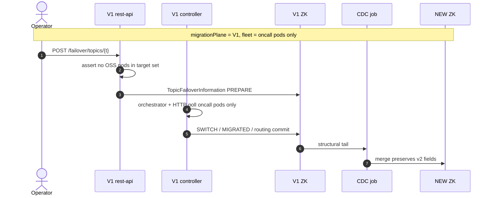
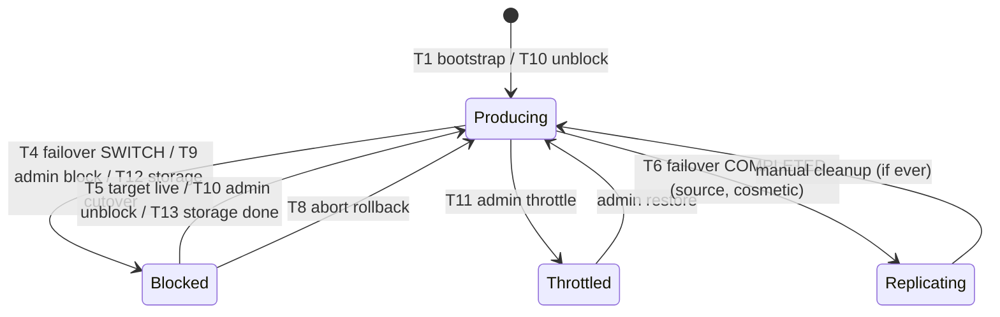

# CDC × OSS v2 — Runtime Field Ownership Grooming

> Grooming / VIP doc for live metadata migration (OLD Protobuf ZK → NEW JSON ZK).
> Defines which entity fields are **CDC-owned** (mirrored from OLD) vs **v2-governed** (owned by OSS runtime: failover, storage migration, admin block/throttle).
> **Status: groomed — pending implementation** in OSS entities + oncall CDC converter.

| Field | Value |
|-------|-------|
| Status | Groomed — pending implementation |
| Depends on | Parent CDC grooming doc (Hybrid bootstrap + Curator tail, per-entity MySQL checkpoint) |
| Components touched | `entities` (OSS), oncall `cdc-converter` + `cdc-writer` (shaded Curator 5.x), controller CDC job |
| Primary decision | **CDC must not read or write v2-governed fields**; tail updates use structural merge + preserve v2 state |

---

## 0. Executive summary

During the multi-day live migration window, **production writes continue on OLD** while a per-zone CDC job tails OLD ZK and applies transforms to NEW ZK. OSS v2 concurrently mutates some of the same entities for **runtime concerns** that do not exist on OLD (topic failover produce gate, storage-topic migration `produceIndex`, subscription IQ routing).

If CDC blindly overwrites the full transformed model on every tail event, it will **clobber v2 runtime state** — e.g. reset `topicState` from `Blocked` back to `Producing` during an in-flight failover, or rewind `produceIndex` after a storage migration.

**Decision:** Classify every persisted field as **CDC-owned**, **v2-governed**, or **bootstrap-only**. The CDC apply path uses a **merge policy**:

| Operation | CDC-owned fields | v2-governed fields |
|-----------|------------------|-------------------|
| **Create** (no NEW node) | Set from OLD transform | OSS defaults (`Producing`, `produceIndex=0`, …) |
| **Update** (NEW exists) | Overwrite from OLD transform | **Preserve** current NEW value — CDC does not read OLD for these |
| **Delete** | Delete NEW node | N/A |

This is orthogonal to checkpoint dedup and write-avoidance (`.equals()` skip): even when CDC *would* write, v2 fields are merged from NEW, not OLD.

**See also:** §2 (seven alternative approaches), §3 (full scenario catalogue for when each field changes).

---

## 1. Problem statement

### 1.1 Why this matters

| Scenario | Without merge policy | With merge policy |
|----------|---------------------|-------------------|
| Topic failover SWITCH sets `topicState=Blocked` on NEW | OLD tail still shows `Producing` → CDC overwrites → **produce gate broken** | CDC updates structural fields only; `topicState` stays `Blocked` |
| Storage migration advances `produceIndex` on NEW | OLD ProtoTopic still points at old segment → CDC rewinds index → **wrong broker topic** | `produceIndex` preserved on NEW |
| Admin blocks topic on NEW (`Blocked`) | OLD has no block concept → CDC resets to `Producing` | `topicState` preserved |
| CDC tail replays after checkpoint gap | Idempotent structural sync; runtime state untouched | Safe |

### 1.2 Relationship to checkpoint design

The CDC grooming doc rejected **embedding checkpoint metadata inside OSS entities** (`sourceMtime` on `VaradhiTopic`) because:

- `JsonMapper` / Jackson defaults make unknown fields risky on the hot read path.
- Pollutes domain models with migration-only data.

**v2-governed fields are the same class of problem in reverse:** runtime fields on OSS entities must not be driven by OLD Protobuf semantics. The fix is **field-level ownership + merge at apply time**, not a separate ZK subtree for each field.

Checkpoint remains in MySQL (`cdc_checkpoint` table). v2-governed values live only in NEW ZK entity JSON.

### 1.3 Per-topic migration plane (V1 vs V2 ownership)

During coexistence, **each topic** is on exactly one **migration plane**. The plane decides **which stack owns operational control** (failover, storage migration, admin block, routing commits) — not “V1 governs everything until global cutover.”

```java
/** Which stack owns live operations for this topic during migration. */
enum TopicMigrationPlane {
    V1,   // Oncall: OLD ZK is admin source of truth; V1 orchestrates failover
    V2    // OSS: NEW ZK is admin source of truth; V2 orchestrates failover
}
```

Stored on **V1 app-ZK** (not V2, not inside ProtoTopic):

```text
/varadhi/app/migration/topic-plane/{topicName}  →  "V1" | "V2"   (default: V1 if absent)
```

CDC excludes `/migration/**` from bootstrap/tail.

#### Core rule — single owner per topic

| Topic plane | Who handles failover | Who handles storage migration | Admin CRUD source of truth | CDC role |
|-------------|---------------------|------------------------------|---------------------------|----------|
| **V1** | **V1 controller** (`FailoverOrchestrator`) | **V1** | **OLD ZK** (oncall) | Tail OLD → NEW; structural sync; **merge preserves** any v2 fields already on NEW |
| **V2** | **V2 controller** (`TopicFailoverOpExecutor`) | **V2** | **NEW ZK** (OSS) | Tail OLD for lagging structural drift only; **never drives** `topicState` / indices; optional **CDC pause** per topic after cutover |

**Invariant:** For a given `topicFqn`, exactly one controller may CAS transition state, commit routing, and flip `topicState` on NEW.

#### Request routing

```text
POST /v1/projects/:p/topics/:t/failover
        │
        ▼
   MigrationRegistry.getPlane(topicFqn)
        │
        ├─ plane = V1  →  V1 Web/API → V1 FailoverOrchestrator (oncall ZK, oncall pods only)
        │
        └─ plane = V2  →  V1 rest-api **proxies** to V2 **public** failover API (or operator calls V2 directly)
                          V1 controller does not orchestrate
```

Same routing for **storage migration**, **admin block/throttle**, and **capacity edits** after plane is set.

#### V1-plane topic — failover (V1-only fleet)

V1 owns orchestration **unchanged** when the participating pod fleet is **oncall-only**. V2 is not involved in the transition.

**Hard rule (no V2 hacks):** If OSS pods are registered for this topic, **V1-plane failover is rejected** at rest-api pre-flight with `409` — *"Topic has OSS pods; flip migration plane to V2 before failover."* Operators must cut over metadata plane **before** failover when the fleet is on OSS.



OSS pods may still **serve produce** on V1-plane topics (reading NEW via CDC) but **do not participate in V1 failover choreography**. Cutover plane to V2 before running failover on an OSS fleet.

#### V2-plane topic — native V2 path

V2 owns end-to-end control. No V1 orchestrator involvement.

```mermaid
sequenceDiagram
    autonumber
    actor Op as Operator
    participant V2C as V2 controller
    participant NEW as NEW ZK
    participant V2P as V2 pods
    participant CDC as CDC job
    participant V1ZK as V1 ZK

    Note over Op,CDC: migrationPlane = V2

    Op->>V2C: POST /failover (V2 API only)
    V2C->>NEW: TransitionObject + TopicStore CAS (topicState, routing)
    V2C->>V2P: FailoverStageEvent (bus broadcast)
    V2P->>V2P: TopicProduceTransitionService
    V2P->>V2C: push ack

    Note over V1ZK,CDC: OLD may still receive mirror/replica writes
    V1ZK->>CDC: optional tail (structural only)
    CDC->>NEW: merge / preserve v2 fields; or skip topic if CDC paused post-cutover
```

V1 `ProduceFailoverService` **must reject** failover requests for V2-plane topics (409 + pointer to V2 API).

#### Plane flip (per-topic cutover)

Atomic cutover checklist for `V1 → V2`:

| Step | Action |
|------|--------|
| 1 | CDC bootstrap complete for topic; NEW entity exists |
| 2 | No in-flight V1 failover (`topicFailoverPath` absent) |
| 3 | Produce/consume traffic validated on NEW metadata |
| 4 | CAS `topic-plane/{name}` = `V2` on **V1 app-ZK** | Single authoritative flip |
| 5 | V1 admin API returns 409 for structural edits on this topic (or read-only) |
| 6 | Enable V2 failover orchestrator for this topic |

Rollback `V2 → V1` requires aborting in-flight V2 transitions and reversing step 4 — document in runbook (open question Q7).

#### CDC × plane interaction

| Plane | CDC tails OLD? | v2 field policy | Failover writer |
|-------|----------------|-----------------|-----------------|
| V1 | Yes | Merge preserve (§5.4) | V1 only (oncall fleet) |
| V2 | Optional (drift only) | V2 only; CDC never sets `topicState` | V2 public failover API |

#### Relation to `orchestratedBy`

`TopicMigrationPlane` is **stable ownership** (which stack owns the topic). `orchestratedBy` / in-flight transition is **ephemeral** (who is running a failover *right now*):

```text
migrationPlane = V1  +  no active transition  →  V1 may accept new failover
migrationPlane = V2  +  TransitionObject exists  →  V2 orchestrator in progress
```

Do not conflate plane with transition stage.

---

## 2. Alternative approaches

The recommended fix is **§5.4 `CdcMergePolicy` at apply time** (preserve v2 fields from NEW on every tail update). Six other viable patterns were considered. None eliminate the ownership problem — they relocate it.

### 2.1 Comparison matrix

| ID | Approach | Mechanism | Pros | Cons | Verdict |
|----|----------|-----------|------|------|---------|
| **A** | **Merge at apply (chosen)** | CDC reads NEW → merges v2 fields → CAS write | Single entity JSON; minimal OSS surface; works with existing `ZKMetaStore` | Per-entity merge boilerplate; `.equals()` must use merged model | **Primary** |
| **B** | **Split ZK subtree** | CDC writes `/varadhi/entities/...` (config only); OSS writes `/varadhi/runtime/topics/{fqn}` (`topicState`, indices) | Clean separation; CDC never touches runtime path | Pods read two ZNodes + join; cache invalidation twice; migration cleanup of extra subtree | Viable if merge becomes unwieldy |
| **C** | **Split entity types** | `VaradhiTopicConfig` (CDC) + `VaradhiTopicRuntime` (OSS) as two L1 entities | Type-safe; CDC converter emits config-only DTO | Refactor every reader (`TopicCache`, `ProducerService`); two CAS paths per logical change | High cost for migration window |
| **D** | **CDC patch DTO** | Converter emits `CdcTopicPatch` (structural fields only); writer applies patch to existing entity | Converter cannot accidentally set v2 fields | Still needs merge logic in writer; patch semantics per field (replace vs merge maps) | Good complement to **A** (Option C in §5.4) |
| **E** | **Operational freeze** | Block failover, storage migration, admin block on NEW until CDC cutover | Zero merge code | Unacceptable for multi-day window; defeats parallel v2 rollout | **Rejected** |
| **F** | **CDC cooperative pause** | CDC skips entity while `TransitionObject` / `TopicFailover` exists for that FQN | Simple guard; no merge for in-flight ops | Race: tail event arrives after transition deleted but before final state stable; doesn't cover admin block | **Supplement only** — not sufficient alone |
| **G** | **Shadow + promote** | CDC writes `/varadhi/migration/shadow/...`; promotion job diffs shadow vs live, preserves v2 | Easy rollback; audit trail | Extra ZK churn; promotion job is another merge implementation | Overkill for metadata volume |

### 2.2 When to escalate from A → B or C

| Signal | Action |
|--------|--------|
| v2-governed field count grows beyond ~5 per entity | Consider **B** (runtime subtree) |
| Multiple writers need different CAS frequencies | **C** (split entities) — runtime updates don't bump config version |
| Merge bugs in production | Short-term: **F** (pause CDC per FQN during transitions) + fix merge |
| Post-migration steady state | Collapse **B**/**C** back into single entity if split was used |

### 2.3 Hybrid supplement: cooperative pause (F)

Optional belt-and-suspenders on top of merge:

```text
if (transitionStore.exists(topicFqn) || topicFailoverStore.exists(topicFqn)) {
    defer(event);  // re-queue with backoff, or skip until transition terminal
}
```

Use only for **high-risk windows** (SWITCH barrier), not as the sole strategy — admin block and post-transition `Replicating` are not covered.

### 2.4 Why not map OLD flags into v2 fields

OLD `ProtoTopicV2` carries per-zone produce/replicate semantics. Mapping them into `topicState` on tail would:

1. **Fight failover** — OLD never learns about OSS SWITCH; would continuously push `Producing`.
2. **Conflate concerns** — OLD replicate mirror ≠ OSS `Replicating` cosmetic state.
3. **Break single-writer rule** — two sources of truth for the same field.

If OLD admin block exists, expose via **OSS admin API on NEW**, not CDC tail.

---

## 3. Scenarios where v2 fields change

These tables define **who writes each field** and **what CDC must do** when a tail event arrives mid-scenario. "OLD ZK changes?" indicates whether the CDC job will receive a corresponding event from OLD.

### 3.1 `topicState` (`VaradhiTopic` — target model)

`TopicState` values: `Producing`, `Blocked`, `Throttled`, `Replicating` (see `TopicState.java`). Producer gate: `isProduceAllowed()` — only `Producing` allows produce.

| # | Scenario | Writer | Transition | `topicState` change | OLD ZK changes? | CDC on tail |
|---|----------|--------|------------|---------------------|-----------------|-------------|
| T1 | **Bootstrap create** | CDC converter | — | → `Producing` (default) | Yes (`NODE_CREATED`) | Set default on create |
| T2 | **Steady produce** | — | — | stays `Producing` | Maybe (unrelated structural edit) | **Preserve** `Producing` |
| T3 | **Topic failover PREPARE** | Controller / pods (warm only) | `PREPARE` | unchanged (`Producing`) | No | **Preserve** |
| T4 | **Topic failover SWITCH** | Controller `TopicStore` CAS (tracked) | `SWITCH` | → `Blocked` on source region gate* | No | **Preserve** `Blocked` |
| T5 | **Topic failover post-SWITCH** | Pods observe version ≥ N+1 | `SWITCH` ack | target `Producing`; source still `Blocked` | No | **Preserve** |
| T6 | **Topic failover COMPLETED** | Controller (untracked) | `COMPLETED` | source → `Replicating` (cosmetic) | No | **Preserve** `Replicating` |
| T7 | **Topic failover ABORT (pre-SWITCH)** | — | `ABORTED` | unchanged | No | **Preserve** |
| T8 | **Topic failover ABORT (post-SWITCH)** | Controller rollback (tracked) | `ABORTED` | restore pre-failover states | No | **Preserve** rollback snapshot |
| T9 | **Admin block topic** | OSS admin API / `VaradhiTopicService` | — | → `Blocked` | No† | **Preserve** `Blocked` |
| T10 | **Admin unblock topic** | OSS admin API | — | → `Producing` | No† | **Preserve** `Producing` |
| T11 | **Admin throttle topic** | OSS admin / capacity policy | — | → `Throttled` | No† | **Preserve** `Throttled` |
| T12 | **Storage migration cutover** | `STORAGE` transition (future) | `SWITCH`-like | → `Blocked` during cutover window | Maybe‡ | **Preserve** `Blocked` |
| T13 | **Storage migration complete** | `STORAGE` transition | `COMPLETED` | → `Producing` | Maybe‡ | **Preserve** |
| T14 | **CDC tail after any above** | CDC job | — | must not revert | Often yes (structural) | **Merge** — structural from OLD, `topicState` from NEW |

\* Target model may use `regionConfigs.produceAllowed` per region instead of a single `topicState`; same CDC rule applies — **v2-governed, preserve on update**.

† Unless OLD has a separate admin block path that mutates ProtoTopic — converter must **not** map it to `topicState`.

‡ OLD storage migration may update `activeStorageTopicId` / segment layout (CDC-owned structural fields) **without** updating any OSS `topicState` — merge still required.

**Current code note:** Today `topicState` lives on `SegmentedStorageTopic` (per-region). `ProducerService` gates on `internalTopic.getTopicState()`. Migration to topic-wide `VaradhiTopic.topicState` (PR #318 direction) collapses T4–T8 to a single field; CDC rule unchanged.



### 3.2 `produceIndex` (`SegmentedStorageTopic` / `InternalCompositeSubscription`)

Selects which slot in `storageTopics[]` / `storageSubscriptions[]` is active for **produce**. Per `topic-failover-grooming-final.md`, **topic failover does not change `produceIndex`** — region routing uses `internalTopics` map keys.

| # | Scenario | Entity | Writer | `produceIndex` change | OLD ZK changes? | CDC on tail |
|---|----------|--------|--------|-------------------------|-----------------|-------------|
| P1 | **Bootstrap create** | `SegmentedStorageTopic` | CDC converter | → index of OLD active segment (usually `0`) | Yes | Set once on create |
| P2 | **Bootstrap create** | `InternalCompositeSubscription` (IQ/RQ/DLQ) | CDC converter | → OLD retry-target index | Yes | Set once on create |
| P3 | **Steady state** | both | — | stays `0` (typical) | Rare | **Preserve** |
| P4 | **Storage segment growth** | `SegmentedStorageTopic` | OSS `STORAGE` migration orchestrator | → new slot (e.g. `0` → `1`) | Yes — new segment in Proto | **Preserve** NEW index; update `storageTopics[]` from OLD |
| P5 | **Partition / IQ target flip** | `InternalCompositeSubscription` | OSS subscription migration | → new `storageSubscriptions[]` slot | Yes | **Preserve** NEW index |
| P6 | **Topic failover** | `SegmentedStorageTopic` | — | **unchanged** | No | **Preserve** |
| P7 | **CDC tail (structural only)** | both | CDC | must not rewind index | Yes | **Merge** — array layout from OLD, index from NEW |
| P8 | **Controller / pod restart** | both | — | read from ZK* | No | N/A |

\* If `produceIndex` remains `@JsonIgnore`, restart resets to `0` — **P4/P5 require persisting `produceIndex`** before storage migration goes live on NEW. See Q1 in §10.

**Interaction with CDC-owned fields:** When P4 fires, OLD tail delivers updated `storageTopics[]` (CDC-owned) **and** may still point at old active segment in Proto. CDC must:

1. Apply new `storageTopics[]` from OLD.
2. **Preserve** `produceIndex` from NEW (pointing at new active segment).
3. Never derive `produceIndex` from OLD `activeStorageTopicId` on update — that field tracks layout, not OSS runtime routing.

### 3.3 `consumeIndex` (`InternalCompositeSubscription`)

Selects which `storageSubscriptions[]` slot consumers read from. Consumer-side failover is a future workstream; field exists today.

| # | Scenario | Writer | `consumeIndex` change | OLD ZK changes? | CDC on tail |
|---|----------|--------|------------------------|-----------------|-------------|
| C1 | **Bootstrap create** | CDC converter | → `0` | Yes | Set default on create |
| C2 | **Steady consume** | — | stays `0` | Rare | **Preserve** |
| C3 | **Consume-zone failover** (future) | OSS consumer orchestrator | → new slot | Maybe | **Preserve** NEW |
| C4 | **Shard / storage subscription migration** | OSS | → new slot | Yes | **Preserve** NEW |
| C5 | **CDC tail** | CDC | must not rewind | Yes | **Preserve** |

### 3.4 Cross-field scenarios (CDC + v2 overlap)

| # | Scenario | Fields involved | Risk without merge | Expected outcome |
|---|----------|-----------------|--------------------|------------------|
| X1 | Failover SWITCH + OLD capacity update | `topicState` + `capacity` | Blocked reverted to Producing | `topicState=Blocked`, capacity updated |
| X2 | Storage migration + OLD segment layout change | `produceIndex` + `storageTopics[]` | Index rewound to OLD active segment | New array from OLD, index from NEW |
| X3 | Admin block + OLD topic metadata edit | `topicState` + `grouped`/`tags` | Block removed | `Blocked` preserved, structural updated |
| X4 | CDC restart mid-failover | checkpoint + `topicState` | Redundant tail replay | mzxid dedup + merge → no clobber |
| X5 | NEW topic created on OLD after bootstrap started | all defaults | Race: OSS default vs OLD create | Create path sets defaults; first tail wins CAS |
| X6 | Topic deleted on OLD | entire entity | NEW orphan or stale runtime | CDC delete removes NEW node (v2 state gone with entity) |

### 3.5 Scenario → implementation checklist

| Scenario IDs | Merge policy must | Test required |
|--------------|-------------------|---------------|
| T4, T9, T12 | Preserve `topicState` on structural update | O-07 integration |
| T6 | Preserve `Replicating` (cosmetic) | Converter test |
| P4, P7 | Preserve `produceIndex` when `storageTopics[]` changes | C-04 |
| P6 | Confirm failover docs: no `produceIndex` change | Documentation only |
| X1–X4 | `merged.equals(existing)` uses merged model | Unit test per entity |
| C3 (future) | Preserve `consumeIndex` | Add when consumer failover lands |

---

## 4. Field taxonomy

Three buckets:

```
┌─────────────────────────────────────────────────────────────────┐
│  CDC-owned        Mirrors OLD durable config (name, capacity,   │
│                   grouping, callback config, storage layout, …)   │
├─────────────────────────────────────────────────────────────────┤
│  Bootstrap-only   Set once from OLD on CREATE; preserved on       │
│                   UPDATE (CDC ignores OLD for these afterward)    │
├─────────────────────────────────────────────────────────────────┤
│  v2-governed      Never sourced from OLD; OSS services +         │
│                   failover / migration orchestration only         │
└─────────────────────────────────────────────────────────────────┘
```

### 4.1 `VaradhiTopic`

| Field | Bucket | CDC behaviour | v2 owner |
|-------|--------|---------------|----------|
| `name`, `version` | CDC-owned / CAS | From OLD; version via CAS | CDC bump on structural change; v2 bump on failover SWITCH |
| `grouped`, `capacity`, `nfrFilterName`, `topicCategory` | CDC-owned | From OLD / capacity_plan_topics | — |
| `internalTopics` (map keys + `StorageTopic` ids/names) | CDC-owned | From OLD ProtoTopicV2 per zone | — |
| `status` (lifecycle) | CDC-owned | From OLD active/deleted | — |
| `replicationRegions`, `produceRegions`, `failoverRegion`, `tags` | v2-governed (when added) | Default on create; **preserve on update** | OSS admin + failover controller |
| **`topicState`** | **v2-governed** | Default `Producing` on create; **preserve on update** | Failover SWITCH (`withTopicState`), admin block/throttle APIs |
| `rateLimiterMode`, `perRegionQuotaWeights`, `messageSizeProfile` | v2-governed / OSS-only | Default; preserve | OSS services |

**Note on `topicState` placement:** OSS target model keeps a **single topic-wide** `topicState` on `VaradhiTopic` (not per-region). OLD had `topicState` on the storage composite / topic proto. CDC **must not map** OLD produce/replicate flags into `topicState` on tail — only OSS failover and admin paths write it.

### 4.2 `SegmentedStorageTopic`

| Field | Bucket | CDC behaviour | v2 owner |
|-------|--------|---------------|----------|
| `storageTopics[]`, `activeStorageTopicId` | CDC-owned | From OLD segment layout | — |
| **`produceIndex`** | **Bootstrap-only → v2-governed** | On **create**: set from OLD active segment index (usually `0`). On **update**: **preserve NEW** | Storage-topic migration orchestration |
| **`topicState`** (if still present on class) | **Remove / ignore** | Do not serialize from OLD; strip on convert | **Deprecated** — use `VaradhiTopic.topicState` only |

**Action for OSS:** Remove `topicState` from `SegmentedStorageTopic` (TODO already in code). CDC converter must not emit it. Existing ZK blobs with `topicState` on nested internal topics: `@JsonIgnoreProperties(ignoreUnknown = true)` on `VaradhiTopic` / `SegmentedStorageTopic` during migration window.

`produceIndex` is `@JsonIgnore` today (not persisted). **Decision required:** if storage migration must persist `produceIndex`, promote it to a persisted v2-governed field; CDC still preserves on update. If it stays `@JsonIgnore`, it is purely in-memory default `0` — CDC only matters at converter layout time.

### 4.3 `InternalCompositeSubscription` (IQ / RQ / DLQ)

| Field | Bucket | CDC behaviour | v2 owner |
|-------|--------|---------------|----------|
| `storageSubscriptions[]` | CDC-owned | From OLD | — |
| **`produceIndex`** | **Bootstrap-only → v2-governed** | Create: map from OLD; Update: preserve | Topic failover IQ flip (`produceIndexByRegion` when added) |
| **`consumeIndex`** | **v2-governed** | Default `0` on create; preserve on update | Consumer-side failover (future) |

### 4.4 Entities with no v2-governed runtime fields (today)

| Entity | CDC |
|--------|-----|
| `Org`, `Team`, `Project` | Fully CDC-owned |
| `VaradhiSubscription` (main) | Structural CDC-owned; shard ops / consume state are separate |
| `Region` | CDC-owned from global ZK |

---

## 5. Target OSS model changes

### 5.1 Entity markers (recommended)

Add a package-private annotation used by CDC merge tests and documentation — **not** Jackson-visible:

```java
/** Field is owned by OSS v2 runtime; CDC apply must preserve NEW value on update. */
@Target(ElementType.FIELD)
@Retention(RetentionPolicy.RUNTIME)
@interface V2Governed {}
```

Apply to:

- `VaradhiTopic.topicState`
- `InternalCompositeSubscription.consumeIndex`
- Future: `produceIndexByRegion`, `regionConfigs`, …

`produceIndex` on `SegmentedStorageTopic` / `InternalCompositeSubscription`: `@BootstrapOnly` or document as v2-governed after first write.

### 5.2 `VaradhiTopic` — `topicState` + `withTopicState`

Align with producer-side failover (PR #318):

```java
private final TopicState topicState;  // default Producing

public VaradhiTopic withTopicState(TopicState state) { ... }  // new snapshot for SWITCH
```

- Persisted in NEW ZK JSON (failover gate reads it from `TopicCache`).
- **Not** in OLD ProtoTopicV2 → CDC converter never sets it from source.

### 5.3 `SegmentedStorageTopic` — strip runtime state

```java
// REMOVE:
@Setter private TopicState topicState;

// KEEP:
@JsonIgnore private final int produceIndex;  // or persist if storage migration requires
```

### 5.4 `CdcMergePolicy` (OSS `entities` or `metastore-zk` test fixture)

Single merge entry point used by shaded `CdcZkWriter`:

```java
public final class CdcMergePolicy {

    /**
     * @param incoming  fully transformed entity from OLD (may contain defaults for v2 fields)
     * @param existing  current NEW entity, or null on create
     */
    public static <T extends MetaStoreEntity> T merge(T incoming, T existing) {
        if (existing == null) {
            return incoming;  // defaults already applied in converter
        }
        return mergePreservingV2Fields(incoming, existing);
    }
}
```

Implementation options (pick one in implementation PR):

| Option | Pros | Cons |
|--------|------|------|
| **A. Explicit per-type merge methods** | Clear, debuggable | Boilerplate per entity |
| **B. Reflection on `@V2Governed`** | DRY | Fragile with records/final fields |
| **C. Converter builds `CdcOwnedPatch` DTO** | Cleanest separation | Larger converter refactor |

**Recommendation:** Option A for Phase 1 (`VaradhiTopic`, `VaradhiSubscription`, `Queue`); expand as needed.

### 5.5 Write avoidance interaction

Existing CDC optimisation:

> Read NEW → `incoming.equals(existing)` → skip write

With merge policy, equality check must use **merged** model:

```text
merged = CdcMergePolicy.merge(incoming, existing)
if (merged.equals(existing)) skip write
else CAS write(merged)
```

Otherwise a tail event that only differs in v2 fields incorrectly skips a needed structural update.

---

## 6. Oncall CDC converter changes

### 6.1 Per-entity converter rules

**`ProtoTopicV2` → `VaradhiTopic`**

| OLD signal | NEW field | Rule |
|------------|-----------|------|
| name, grouped, project, … | structural | Map normally |
| mirror=true | — | **Skip entire topic** (non-authoritative replica) |
| OLD per-zone produce/replicate flags | `topicState` | **Do not map** — leave default `Producing` |
| active segment / storage id | `internalTopics`, `storageTopics[]` | Map normally |
| active segment index | `produceIndex` | Set on **create only** in converter; merge preserves later |

**`ProtoSubscription` → `VaradhiSubscription`**

| OLD signal | NEW field | Rule |
|------------|-----------|------|
| consume zone / IQ layout | structural | Map normally |
| retry/DLQ produce target index | `produceIndex` | Bootstrap-only |

### 6.2 Converter must not read v2-governed fields from OLD

Add explicit deny-list in converter review checklist:

```text
NEVER map from OLD → NEW:
  - topicState (any source)
  - consumeIndex (except default 0)
  - regionConfigs / produceRegions / failoverRegion
  - transition / failover operation pointers
```

### 6.3 Tail event handling pseudocode

```java
void applyTopic(OldEvent event) {
    VaradhiTopic incoming = topicConverter.convert(event.data());
    VaradhiTopic existing = newReader.get(topicZnode(incoming.getName()));

    if (event.isDelete()) {
        newWriter.deleteIfExists(topicZnode(incoming.getName()));
        return;
    }

    VaradhiTopic merged = CdcMergePolicy.merge(incoming, existing);
    if (existing != null && merged.equals(existing)) {
        return;  // write avoidance
    }
    newWriter.createOrUpdate(merged, checkpointVersion(existing));
    checkpointStore.upsert(event.source(), event.path(), event.mzxid(), ...);
}
```

---

## 7. Oncall vs OSS work breakdown

### 7.1 OSS (varadhi / NEW)

| ID | Task | Size |
|----|------|------|
| O-01 | Finalize `topicState` on `VaradhiTopic`; remove from `SegmentedStorageTopic` | S |
| O-02 | `VaradhiTopic.withTopicState()` for failover snapshots | S |
| O-03 | `@V2Governed` annotation + document field list in this doc | S |
| O-04 | `CdcMergePolicy` + unit tests per entity | M |
| O-05 | `@JsonIgnoreProperties(ignoreUnknown = true)` on entities receiving CDC + legacy blobs | S |
| O-06 | Decide `produceIndex` persistence (`@JsonIgnore` vs persisted v2 field) | S — **decision** |
| O-07 | Integration test: simulate CDC update during `topicState=Blocked` → gate stays blocked | M |

### 7.2 Oncall (OLD controller CDC job)

| ID | Task | Size |
|----|------|------|
| C-01 | `TopicConverter`: stop mapping OLD replicate/produce flags → `topicState` | S |
| C-02 | Apply `CdcMergePolicy` in `CdcZkWriter` before every create/update | M |
| C-03 | Converter tests: fixture ProtoTopic with `replicating=true` → NEW `topicState` still `Producing` | S |
| C-04 | Converter tests: tail update does not change `produceIndex` when NEW differs | S |
| C-05 | Shaded `cdc-writer` module (Curator 5.8 / ZK 3.9) — per CDC grooming §7 | L |
| C-06 | MySQL `cdc_checkpoint` table + per-entity mzxid dedup | M |

### 7.3 Joint validation (pre-cutover)

| Check | Pass criteria |
|-------|---------------|
| Failover drill on NEW while CDC tail running | `topicState` not reverted within 5 min tail lag |
| Storage migration drill | `produceIndex` not reverted |
| CDC restart after checkpoint | v2 fields identical before/after for unchanged entities |
| Entity count + sample `.equals()` | Structural parity OLD vs NEW |

---

## 8. Sequence — failover under live CDC

```mermaid
sequenceDiagram
    participant OLD as OLD ZK
    participant CDC as CDC Job (oncall)
    participant NEW as NEW ZK
    participant OSS as OSS Controller / Pods

    Note over OLD,OSS: Steady state — topic Producing on both sides

    OSS->>NEW: SWITCH snapshot (topicState=Blocked, version=N+1)
    NEW-->>OSS: TopicCache fan-out
    OSS->>OSS: ProducerService gates produce

    OLD->>CDC: NODE_CHANGED (Proto still "producing")
    CDC->>CDC: convert → incoming.topicState=Producing (default)
    CDC->>NEW: read existing (topicState=Blocked)
    CDC->>CDC: merge → preserve topicState=Blocked
    CDC->>NEW: CAS update (structural only, if changed)

    Note over CDC,NEW: v2 gate intact; CDC may update unrelated structural fields
```

---

## 9. Open questions

| # | Question | Suggestion |
|---|----------|------------|
| Q1 | Should `produceIndex` be persisted in ZK or stay `@JsonIgnore`? | Persist if storage migration must survive restart; else default `0` is enough for Phase 1 |
| Q2 | Does OLD ProtoTopic carry an explicit "blocked/throttled" flag to map to anything? | If yes, map to **separate OSS admin API**, not CDC tail — OLD block may not align with NEW semantics |
| Q3 | Cross-zone CDC idempotency for same topic name | Already handled — mirror topics skipped; one authoritative zone per topic |
| Q4 | `CdcMergePolicy` in OSS jar vs shaded duplicate in oncall | Single source in OSS `entities` module, depended on by shaded writer — avoid two implementations |
| Q5 | Subscription `consumeIndex` when consumer failover lands | Already v2-governed; CDC preserve on update — see §3.3 C3 |
| Q6 | Cooperative CDC pause during transitions? | Optional supplement (§2.3 **F**); merge policy remains primary |
| Q7 | Rollback `migrationPlane` V2→V1 with in-flight V2 failover? | Abort V2 transition first; CAS `topic-plane/{name}` back to V1 on app-ZK; runbook required |

---

## 12. Brief migration grooming (API + data flow)

### Decisions

| # | Decision |
|---|----------|
| D1 | **Plane on V1 ZK** sibling node — not MySQL, not in ProtoTopic, not on NEW |
| D2 | **V1-only glue** — plane read, 409 guard, proxy to V2 **public** REST |
| D3 | **No V2 migration APIs** — no internal failover bridge, no passive controller |
| D4 | **No hybrid failover** — V1 plane + OSS pods → **409**; flip plane first |
| D5 | **CDC merge** — structural from OLD; `topicState` / indices v2-only |

### API flow

```text
POST /failover/topics/{t}  (V1 rest-api)
    │
    ├─ read V1 ZK .../topic-plane/{t}
    │
    ├─ plane=V1 + OSS pods on topic ──► 409
    ├─ plane=V1 + oncall pods only ───► V1 ZK failover (unchanged)
    └─ plane=V2 ────────────────────► HTTP → V2 POST /v1/projects/:p/topics/:t/failover
                                         (adapt JSON both ways)
```

V2-plane direct (optional): operator calls V2 public URL; V1 ZK plane is ops bookkeeping only.

### Data flow — topic moves V1 → V2 (region / stack cutover)

```text
Phase 1  CDC bootstrap + tail
         OLD ZK (Proto) ──CDC──► NEW ZK (VaradhiTopic JSON)
         merge preserves v2 fields if any early writes

Phase 2  Traffic shift (optional before plane flip)
         Produce/consume → OSS pods (read NEW via TopicCache)
         Admin + failover still V1 plane / OLD ZK

Phase 3  Plane flip (ops)
         V1 ZK: topic-plane/{t} = "V2"
         After this: admin CRUD on NEW; V1 OLD topic edits → 409

Phase 4  Failover / region change on V2
         V2 REST → V2 controller → NEW ZK (routing + topicState)
         CDC may still tail OLD structural drift; never overwrites topicState
```

| Data | During V1 plane | After plane = V2 |
|------|-----------------|------------------|
| Topic config (name, grouped, capacity, `internalTopics[]`) | **OLD ZK** source; CDC → NEW | **NEW ZK** source; CDC optional drift sync |
| Active produce **region** | V1 failover commits `activeProduceZone` on OLD → CDC copies layout | V2 failover updates `internalTopics` / region on **NEW** |
| `topicState`, `produceIndex` | V2-only on NEW; CDC merge preserves | **V2 orchestrator** only |
| Failover coordination | V1 ZK `topicFailoverPath` | NEW `TransitionObject` + bus |
| Plane marker | V1 ZK `topic-plane` = V1 | V1 ZK `topic-plane` = V2 |
| Checkpoint (`cdc_checkpoint`) | MySQL per entity mzxid | same until migration done |

### V1 work (oncall)

- Read plane ZNode in `TopicFailoverResource`
- `409` if plane=V1 && OSS pods registered for topic
- `V2FailoverPublicApiClient` + DTO adapter for plane=V2
- Cutover script: CAS plane ZNode; CDC path filter excludes `/migration/**`

### V2 work (OSS)

- Public failover REST + native orchestrator (product — no migration code)
- `CdcMergePolicy` + `topicState` on `VaradhiTopic`
- Shaded CDC writer (separate track)

---

## 13. Summary

| Principle | Action |
|-----------|--------|
| **topicState is v2-only** | OSS failover + admin; CDC default `Producing` on create; never overwrite on tail |
| **produceIndex is v2 after bootstrap** | CDC may initialize from OLD once; storage migration / IQ failover own updates |
| **CDC merge, not full replace** | `CdcMergePolicy.merge(incoming, existing)` on every tail apply |
| **No checkpoint in entity JSON** | Checkpoint stays in MySQL; v2 fields stay in entity JSON legitimately |
| **Remove SegmentedStorageTopic.topicState** | Single source of truth on `VaradhiTopic` |
| **Per-topic migration plane** | V1 topic → V1 owns failover/migration; V2 topic → V2 owns; see §1.3 |

This doc should be linked from the main CDC grooming doc (§3.1 Hybrid) as **§3.1.1 OSS v2 field merge policy**. See also **§2** (alternative approaches) and **§3** (change scenarios).

---

## 14. References

- CDC Hybrid approach (bootstrap + Curator tail, per-entity checkpoint) — parent grooming
- `docs/topic-failover-grooming-final.md` — `produceIndex` vs region routing
- `docs/TOPIC_MODEL_STRUCTURE.md` — current entity layout
- OSS PR #318 — producer-side `topicState` gate + `withTopicState`
- `docs/topic-failover-parallel-orchestration-grooming.md` — Part II per-topic plane + coexistence bridges
