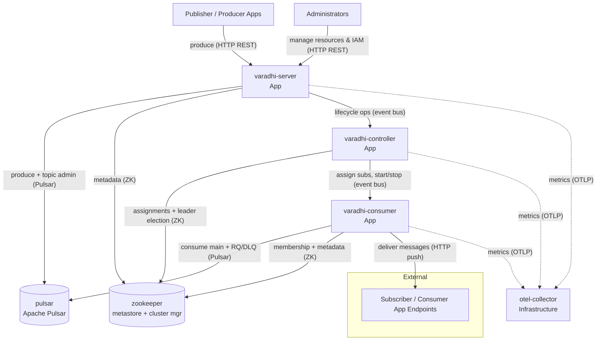

# Varadhi — Container View

> Team-facing, inside-out view of Varadhi's deployable units and how they connect. For the outside-in view (actors, external boundary), see [System Context](./system-context.md). This document stops at the container level — it does **not** describe classes, methods, or component internals.

## Overview

Varadhi is built and shipped as a **single application image**. What a running process *does* is decided by configuration: `member.roles` selects one or more of `Server`, `Controller`, and `Consumer`. The default configuration runs all three roles in one process (a "lean" / single-node deployment, convenient for local dev), while the Helm charts deploy them as **separate units** — which is how the intended production topology splits responsibilities.

This view models the three roles as three distinct App containers — **varadhi-server**, **varadhi-controller**, and **varadhi-consumer** — because they scale, deploy, and fail independently in the target topology, even though they share one codebase and image.

The three app containers form a **Vert.x cluster**. They communicate with each other over the **Vert.x clustered event bus** (send/request semantics), and **ZooKeeper serves as the cluster manager** that handles node discovery and event-bus coordination. ZooKeeper plays a second role too: it is the **metadata store** for all Varadhi entities (orgs, teams, projects, topics, subscriptions, role bindings, assignments). **Apache Pulsar** is the messaging substrate — it durably stores messages and is what producers write to and consumers read from. Both Pulsar and ZooKeeper are pluggable behind SPIs; these are their default implementations.

At runtime: producers hit **varadhi-server** to publish; the server writes to **pulsar**. **varadhi-controller** assigns subscriptions to consumers and orchestrates their lifecycle. **varadhi-consumer** reads from **pulsar** and pushes each message over HTTP to the subscriber application endpoint configured on the subscription (an external system — see L1). Metrics from all three roles flow out via OTLP to **otel-collector**.

## Container Summary

| Container | Kind | Tech | Purpose |
|---|---|---|---|
| varadhi-server | App | Java 21 / Vert.x (shared `varadhi` image, `roles:[Server]`) | Hosts the control-plane REST API and the produce REST API; writes messages to the messaging stack |
| varadhi-controller | App | Java 21 / Vert.x (shared image, `roles:[Controller]`) | Cluster brain: assigns subscriptions to consumers and orchestrates subscription/topic lifecycle operations; leader-elected |
| varadhi-consumer | App | Java 21 / Vert.x (shared image, `roles:[Consumer]`) | Delivery worker fleet: consumes from the messaging stack and pushes messages over HTTP to subscriber endpoints; manages retries, DLQ, and ordering |
| pulsar | Infrastructure | Apache Pulsar 3.3.x | Messaging-stack SPI default: durable message storage and delivery substrate |
| zookeeper | Infrastructure | Apache ZooKeeper 3.9.x | Dual role: metadata store (metastore SPI default) **and** Vert.x cluster manager (node discovery + event-bus coordination) |
| otel-collector | Infrastructure | OpenTelemetry Collector | Receives OTLP metrics/traces from the app containers; exposes a Prometheus scrape endpoint |

Prometheus and Grafana sit downstream of otel-collector for storage and visualization; they are described under [References](#references) and omitted from the diagram to keep it focused.

## Containers

### varadhi-server

**Kind**: App
**Tech**: Java 21 / Vert.x. Shared `varadhi` image run with `member.roles:[Server]`.
**Purpose**: The front door. Hosts two HTTP-facing surfaces on the same server: the **control-plane REST API** (manage orgs, teams, projects, topics, subscriptions, IAM role bindings, regions) and the **produce REST API** (`POST .../topics/{topic}/produce`). On produce, it validates message headers, applies authn/authz, and writes the message to the messaging stack. Subscription/topic lifecycle actions that require cluster coordination are delegated to the controller. (L1 notes this server can optionally be split into a control-plane-only and a produce-only server; today it is modeled as one container.)

**Relationships**:
| Communicates With | Protocol | Direction | Purpose |
|---|---|---|---|
| pulsar | Pulsar client (binary 6650) + admin (HTTP 8080) | writes / calls | Produce messages; provision/manage storage topics |
| zookeeper | ZK / Curator | reads / writes | Control-plane metadata; cluster membership |
| varadhi-controller | Vert.x clustered event bus | calls (send/request) | Delegate subscription/topic lifecycle operations |
| otel-collector | OTLP/HTTP (4318) | writes | Export metrics / traces |

**Gotchas**:
- Message **header names are configurable** per deployment (`messageConfiguration.headers`); the produce contract depends on the deployed convention, not hardcoded names.
- Authentication is pluggable and differs by environment: the default handler is header-based, while the OpenAPI spec models JWT. Don't assume one mechanism.
- Per-topic **capacity policy** (throughput/QPS) enforces guard rails at produce time — throttling here is expected behavior, not necessarily a fault.

---

### varadhi-controller

**Kind**: App
**Tech**: Java 21 / Vert.x. Shared `varadhi` image run with `member.roles:[Controller]`. Helm deploys it with **no service** (`service: null`) — it is not part of the request-serving path.
**Purpose**: The cluster's coordination brain. It assigns subscriptions to consumer nodes, tracks consumer membership, and orchestrates subscription/topic lifecycle operations (start/stop, retries of operations). It is leader-elected and carries **no produce/consume data-path traffic** — it operates over the cluster event bus and metadata store only.

**Relationships**:
| Communicates With | Protocol | Direction | Purpose |
|---|---|---|---|
| zookeeper | ZK / Curator | reads / writes | Assignments + metadata; cluster manager (membership, leader election) |
| varadhi-consumer | Vert.x clustered event bus (send/request) | calls | Assign subscriptions; start/stop; operational commands |
| varadhi-server | Vert.x clustered event bus | called-by | Receive lifecycle operations triggered via the control plane |
| otel-collector | OTLP/HTTP (4318) | writes | Export metrics / traces |

**Gotchas**:
- Authentication is disabled on the controller deployment (`authenticationEnabled: false`) since it serves no external API — it relies on cluster-internal trust. Don't expose it like the server.
- Operational throughput is bounded by `operationsConfig` (e.g. `maxConcurrentOps`, retry backoff) — controller work is intentionally rate-limited.

---

### varadhi-consumer

**Kind**: App
**Tech**: Java 21 / Vert.x. Shared `varadhi` image run with `member.roles:[Consumer]`.
**Purpose**: The delivery worker fleet. Each consumer node owns the subscriptions assigned to it by the controller, reads messages from the messaging stack (main topic plus retry/DLQ topics), and **pushes** each message over HTTP to the subscriber endpoint configured on the subscription. It enforces the subscription's RetryPolicy and ConsumptionPolicy: non-2xx responses move messages to Retry Queues or the Dead Letter Queue, and for grouped subscriptions it preserves per-GroupId ordering across failures.

**Relationships**:
| Communicates With | Protocol | Direction | Purpose |
|---|---|---|---|
| pulsar | Pulsar client (binary 6650) | reads | Consume from main + retry/DLQ topics |
| varadhi-controller | Vert.x clustered event bus (send/request) | called-by | Receive subscription assignments + lifecycle commands |
| zookeeper | ZK / Curator | reads | Cluster membership; metadata lookups |
| subscriber application endpoints (external) | HTTP/1.1, HTTP/2 (push) | calls | Deliver messages; queue request/response callbacks |
| otel-collector | OTLP/HTTP (4318) | writes | Export metrics / traces |

**Gotchas**:
- Delivery is **at-least-once** — subscriber endpoints must be idempotent.
- Ordering is enforced **per GroupId, not per partition**; different groups may be delivered concurrently and out of relative order (differs from Kafka per-partition ordering, closer to Pulsar key-shared).
- A subscription filter is evaluated **only on the first delivery attempt**; retried/dead-lettered messages are not re-filtered.

---

### pulsar

**Kind**: Infrastructure
**Tech**: Apache Pulsar 3.3.x (standalone in local/dev compose; geo-replicated cluster in the intended production topology).
**Purpose**: The messaging substrate behind the messaging-stack SPI. It durably stores produced messages and is the source consumers read from. Varadhi also provisions per-topic storage topics (and retry/DLQ topics) on it. Apache Kafka support is on the roadmap as an alternative SPI implementation; Pulsar is the only shipped implementation today.

**Relationships**:
| Communicates With | Protocol | Direction | Purpose |
|---|---|---|---|
| varadhi-server | Pulsar client + admin | called-by | Message produce; storage-topic provisioning |
| varadhi-consumer | Pulsar client | called-by | Message consume |

**Gotchas**:
- A Varadhi "topic" is not 1:1 with a single Pulsar topic — Varadhi maps it to internal/segmented storage topics (plus retry/DLQ topics). Treat Pulsar topic names as Varadhi-managed, not user-facing.

---

### zookeeper

**Kind**: Infrastructure
**Tech**: Apache ZooKeeper 3.9.x (standalone in compose; StatefulSet in `setup/helm/zookeeper`).
**Purpose**: Serves two distinct functions for Varadhi. (1) **Metadata store** (metastore SPI default): persists JSON-formatted Varadhi entities — orgs, teams, projects, topics, subscriptions, role bindings, and consumer assignments. (2) **Vert.x cluster manager**: backs node discovery, membership, and clustered-event-bus coordination for the three app roles.

**Relationships**:
| Communicates With | Protocol | Direction | Purpose |
|---|---|---|---|
| varadhi-server | ZK / Curator | called-by | Metadata read/write; membership |
| varadhi-controller | ZK / Curator | called-by | Assignments + metadata; leader election |
| varadhi-consumer | ZK / Curator | called-by | Membership; metadata lookups |

**Gotchas**:
- ZooKeeper is a **shared dependency for two concerns** (metadata + clustering). Its availability affects both control-plane operations and intra-cluster coordination — a larger blast radius than a plain config store.
- The intended topology uses a **global** ZK for global metadata, with a possible **region-local** ZK for region-local cluster management — not yet finalized.

---

### otel-collector

**Kind**: Infrastructure (observability)
**Tech**: OpenTelemetry Collector.
**Purpose**: Central metrics/trace sink for the app containers. Receives OTLP over HTTP (port 4318) from server/controller/consumer and exposes a Prometheus-format scrape endpoint (port 8889). Decouples the application from specific monitoring backends.

**Relationships**:
| Communicates With | Protocol | Direction | Purpose |
|---|---|---|---|
| varadhi-server / controller / consumer | OTLP/HTTP (4318) | called-by | Receive metrics / traces |
| prometheus | HTTP scrape (8889) | called-by | Expose metrics for scraping |

---

## Container Diagram

> All three app containers share one image and form a Vert.x cluster (ZooKeeper as cluster manager); they can also co-deploy as a single process in lean mode. Prometheus/Grafana sit downstream of otel-collector and are omitted here — see [References](#references).

## Internal Concepts

### Member roles & lean vs split deployment
A Varadhi process assumes one or more `member.roles` (`Server`, `Controller`, `Consumer`). Lean/local runs enable all three in one process; the intended production topology runs them as separate deployments (and fleets). The same image and codebase serve all roles.

### Clustered event bus & cluster manager
Inter-role communication uses the Vert.x clustered event bus (send = fire-and-track, request = await response). Membership and transport coordination are provided by a ZooKeeper-backed cluster manager — i.e. ZooKeeper is the Vert.x cluster manager, distinct from its metadata-store role.

### ZooKeeper's dual role
ZooKeeper is both the **metastore** (persisted Varadhi entities) and the **cluster manager** (membership/coordination). This is worth calling out because the two concerns are often separate systems elsewhere.

### Storage topic vs Varadhi topic
A user-facing Varadhi topic maps to one or more internal **storage topics** on the messaging stack (segmented for scaling), plus retry and DLQ topics. The mapping is managed by Varadhi; consumers and producers interact with the Varadhi topic, not the raw storage topics.

### Assignment
The controller computes and persists **assignments** (which consumer node owns which subscription) and pushes lifecycle commands to consumers over the event bus. Assignments live in the metastore.

## References

- [System Context (L1)](./system-context.md) — external boundary, actors, public contracts
- [OpenAPI spec](./api.yaml) · [Swagger UI](https://flipkart-incubator.github.io/varadhi/) — control-plane + produce APIs
- [Varadhi Wiki](https://github.com/flipkart-incubator/varadhi/wiki) — [Main Concepts](https://github.com/flipkart-incubator/varadhi/wiki/Main-Concepts), [Try Locally](https://github.com/flipkart-incubator/varadhi/wiki/Try-Locally), [Metrics](https://github.com/flipkart-incubator/varadhi/wiki/Varadhi-Metrics-Documentation)
- Deployment artifacts: [`setup/helm/varadhi`](../setup/helm/varadhi) (server & controller charts), [`setup/helm/zookeeper`](../setup/helm/zookeeper) (ZK StatefulSet), [`setup/docker/compose.yml`](../setup/docker/compose.yml) (local stack incl. Pulsar, ZK), [`setup/docker/prometheus-compose.yml`](../setup/docker/prometheus-compose.yml) (Prometheus + Grafana)
