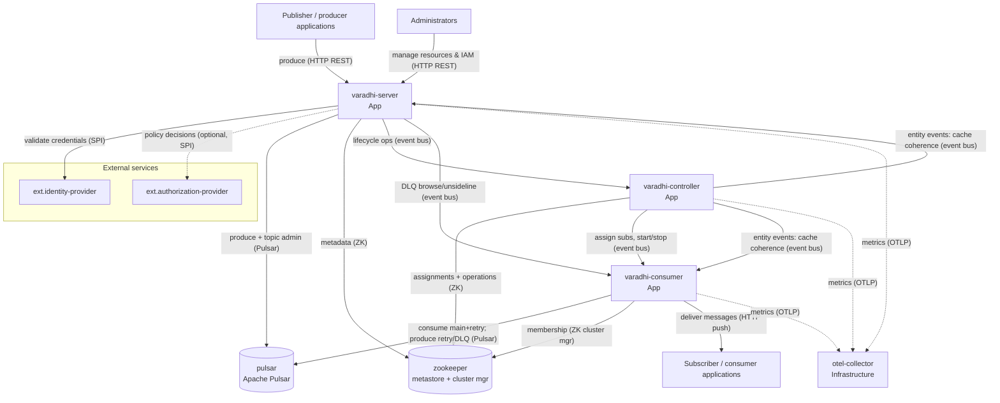

# Varadhi — Container View

## Overview

Actors, external boundaries, and public contracts are in [System Context](./system-context.md). Messaging and tenancy concepts: [Main Concepts](https://github.com/flipkart-incubator/varadhi/wiki/Main-Concepts).

Varadhi ships as a **single application image**; `member.roles` selects `Server`, `Controller`, and/or `Consumer`. Default configuration runs all three in one process (lean deployment); Helm deploys them as **separate units**.

This view models those roles as three App containers — **varadhi-server**, **varadhi-controller**, and **varadhi-consumer** — because they scale, deploy, and fail independently when split, despite one codebase and image.

The three app containers form a **Vert.x cluster** on the **clustered event bus**. **zookeeper** is the cluster-manager SPI (discovery, event-bus coordination) and the metastore SPI default (control-plane entity persistence). **pulsar** is the messaging-stack SPI default (durable storage); both backends are pluggable ([Capabilities](./system-context.md#capabilities)). **varadhi-controller** coordinates assignments and subscription lifecycle over the event bus and metastore; it does not carry produce/consume data-path traffic. All three roles export metrics via OTLP to **otel-collector** (see [Metrics Documentation](https://github.com/flipkart-incubator/varadhi/wiki/Varadhi-Metrics-Documentation)). Prometheus and Grafana sit downstream — omitted from the [container diagram](#container-diagram), listed under [References](#references).

## Container Summary

| Container | Kind | Tech | Purpose |
|---|---|---|---|
| varadhi-server | App | Java 25 / Vert.x (shared `varadhi` image, `roles:[Server]`) | Hosts the control-plane REST API and the produce REST API; writes messages to the messaging stack |
| varadhi-controller | App | Java 25 / Vert.x (shared image, `roles:[Controller]`) | Cluster brain: assigns subscriptions to consumers and orchestrates subscription/topic lifecycle operations |
| varadhi-consumer | App | Java 25 / Vert.x (shared image, `roles:[Consumer]`) | Delivery worker fleet: consumes from the messaging stack and pushes messages over HTTP to subscriber endpoints; manages retries and DLQ on the ungrouped delivery path |
| pulsar | Infrastructure | Apache Pulsar 3.3.x | Messaging-stack SPI default: durable message storage and delivery substrate |
| zookeeper | Infrastructure | Apache ZooKeeper 3.9.x | Dual role: metadata store (metastore SPI default) **and** Vert.x cluster manager (node discovery + event bus coordination) |
| otel-collector | Infrastructure | OpenTelemetry Collector | Receives OTLP metrics/traces from the app containers; exposes a Prometheus scrape endpoint |

## Containers

### varadhi-server

**Kind**: App
**Tech**: Java 25 / Vert.x. Shared `varadhi` image run with `member.roles:[Server]`.
**Purpose**: The front door. Hosts two HTTP-facing surfaces on the same server: the **control-plane REST API** (manage orgs, teams, projects, topics, subscriptions, IAM role bindings, regions) and the **produce REST API** (`POST .../topics/{topic}/produce`). On produce, it validates message headers, applies authn/authz, and writes the message to the messaging stack. Subscription/topic lifecycle actions that require cluster coordination are delegated to the controller.

**Relationships**:

| Communicates With | Direction | Protocol | Purpose |
|---|---|---|---|
| actor.producer | called-by | HTTP REST | Produce messages via the produce API |
| actor.administrator | called-by | HTTP REST | Manage resources and IAM via the control-plane REST API |
| pulsar | calls | Pulsar client (binary 6650) + admin (HTTP 8080) | Produce messages; provision/manage storage topics |
| zookeeper | calls | ZK / Curator | Control-plane metadata read/write; cluster membership |
| ext.identity-provider | calls | method-call (pluggable SPI) | Validate credentials on control-plane and produce requests |
| ext.authorization-provider | calls | method-call (pluggable SPI, optional) | RBAC/policy decisions when a custom external provider is configured |
| varadhi-controller | calls | Vert.x clustered event bus | Delegate subscription/topic lifecycle operations (send/request) |
| varadhi-consumer | calls | Vert.x clustered event bus | DLQ browse/unsideline — fan out to consumer shards (request) |
| varadhi-controller | called-by | Vert.x clustered event bus | Receive entity-change events (cache-coherence refresh) |
| otel-collector | calls | OTLP/HTTP (4318) | Export metrics / traces |

**Deployment Topology**: Horizontally scalable HTTP ingress; Helm deploys it as a separate Deployment with a Service. Replica count and sizing: [`setup/helm/varadhi`](../setup/helm/varadhi) ([`local.server.values.yaml`](../setup/helm/varadhi/values/local.server.values.yaml)).

**Development**: [Try Locally](https://github.com/flipkart-incubator/varadhi/wiki/Try-Locally) · [`setup/docker/compose.yml`](../setup/docker/compose.yml) (lean or split `server` profile) · [CONTRIBUTING.md](../CONTRIBUTING.md).

**Key Config**: `member.roles` (must include `Server`); `messageConfiguration.headers` (produce header contract); `authenticationEnabled` and auth-provider SPI (pluggable authn); `metricsExporterOptions.otlp.url` (OTLP sink). Source of truth: [`conf/configuration.yml`](../conf/configuration.yml) and Helm [`app-configmap.yaml`](../setup/helm/varadhi/templates/app-configmap.yaml).

**Gotchas**:
- Message **header names are configurable** per deployment (`messageConfiguration.headers`); the produce contract depends on the deployed convention, not hardcoded names.
- Authentication is pluggable and differs by environment: the default handler is header-based, while the OpenAPI spec models JWT. Don't assume one mechanism.
- Per-topic **capacity policy** (throughput/QPS) enforces guard rails at produce time — throttling here is expected behavior, not necessarily a fault.

---

### varadhi-controller

**Kind**: App
**Tech**: Java 25 / Vert.x. Shared `varadhi` image run with `member.roles:[Controller]`. Helm deploys it with **no service** (`service: null`) — it is not part of the request-serving path.
**Purpose**: The cluster's coordination brain. It assigns subscriptions to consumer nodes, tracks consumer membership, and orchestrates subscription/topic lifecycle operations (start/stop, retries of operations). It carries **no produce/consume data-path traffic** — it operates over the cluster event bus and metadata store only. It is also the cluster-wide distributor of metastore entity-change events (`concept.entity-change-event`).

**Relationships**:

| Communicates With | Direction | Protocol | Purpose |
|---|---|---|---|
| zookeeper | calls | ZK / Curator | Assignments + operations + metadata read/write; cluster manager (membership) |
| varadhi-consumer | calls | Vert.x clustered event bus | Assign subscriptions; start/stop; operational commands (send/request) |
| varadhi-server, varadhi-consumer | calls | Vert.x clustered event bus | Fan out entity-change events to all nodes (cache coherence; request) |
| varadhi-server | called-by | Vert.x clustered event bus | Receive lifecycle operations triggered via the control plane |
| otel-collector | calls | OTLP/HTTP (4318) | Export metrics / traces |

**Deployment Topology**: Singleton coordination process — run a single active instance (no leader election). Helm deploys with `service: null` (not on the request path). Layout: [`setup/helm/varadhi`](../setup/helm/varadhi) ([`local.controller.values.yaml`](../setup/helm/varadhi/values/local.controller.values.yaml)).

**Development**: [Try Locally](https://github.com/flipkart-incubator/varadhi/wiki/Try-Locally) · [`setup/docker/compose.yml`](../setup/docker/compose.yml) · [CONTRIBUTING.md](../CONTRIBUTING.md).

**Key Config**: `member.roles` (must include `Controller`); `operationsConfig` (subscription-operation concurrency and retry backoff); `authenticationEnabled` (disabled on controller deployments). Source of truth: [`conf/configuration.yml`](../conf/configuration.yml).

**Gotchas**:
- Authentication is disabled on the controller deployment (`authenticationEnabled: false`) since it serves no external API — it relies on cluster-internal trust. Don't expose it like the server.
- Operational throughput is bounded by `operationsConfig` (e.g. `maxConcurrentOps`, retry backoff) — controller work is intentionally rate-limited.
- **No leader election yet**: a controller assumes leadership on start (handover unimplemented). Run a single active controller — concurrent controllers risk split-brain coordination.

---

### varadhi-consumer

**Kind**: App
**Tech**: Java 25 / Vert.x. Shared `varadhi` image run with `member.roles:[Consumer]`.
**Purpose**: The delivery worker fleet. Each consumer node owns the subscriptions (`concept.subscription`) assigned to it by the controller (see `concept.assignment`), reads messages from the messaging stack (main + retry topics), produces failed messages to retry/DLQ topics, and **pushes** each message over HTTP to the subscriber endpoint configured on the subscription. It enforces the subscription's RetryPolicy and ConsumptionPolicy on the **ungrouped** delivery path: non-2xx responses move messages to the `concept.retry-queue` or `concept.dead-letter-queue`.

**Relationships**:

| Communicates With | Direction | Protocol | Purpose |
|---|---|---|---|
| pulsar | calls | Pulsar client (binary 6650) | Consume from main + retry topics; produce failed messages to retry/DLQ topics |
| varadhi-controller | called-by | Vert.x clustered event bus | Receive subscription assignments + lifecycle commands; entity-change events (cache-coherence refresh; send/request) |
| varadhi-server | called-by | Vert.x clustered event bus | DLQ browse/unsideline requests (request) |
| zookeeper | calls | ZK / Curator (via cluster manager) | Cluster membership read (no direct metastore access — shard metadata arrives via controller commands) |
| actor.subscriber | calls | HTTP/1.1, HTTP/2 (push) | Deliver messages to each subscription's configured HTTP endpoint; queue request/response callbacks |
| otel-collector | calls | OTLP/HTTP (4318) | Export metrics / traces |

**Deployment Topology**: Horizontally scalable worker fleet; scales delivery capacity independently when deployed with `member.roles: [Consumer]` (shared image, separate Helm Deployment from server/controller). Layout: [`setup/helm/varadhi`](../setup/helm/varadhi).

**Development**: [Try Locally](https://github.com/flipkart-incubator/varadhi/wiki/Try-Locally) · [`setup/docker/compose.yml`](../setup/docker/compose.yml) (lean mode runs Consumer with other roles) · [CONTRIBUTING.md](../CONTRIBUTING.md).

**Key Config**: `member.roles` (must include `Consumer`); `metricsExporterOptions.otlp.url` (OTLP sink). Per-subscription delivery behaviour (`RetryPolicy`, `ConsumptionPolicy`) is resource metadata, not process config. Source of truth: [`conf/configuration.yml`](../conf/configuration.yml).

**Gotchas**:
- Delivery is **at-least-once** — subscriber endpoints must be idempotent.
- **Grouped ordering is not live on the consumer path** — `concept.grouping` metadata and produce-side partition routing exist, but the consumer connect path rejects grouped subscriptions today. See [Known Limitations](./system-context.md#known-limitations) and `concept.grouping` in [system-context.md](./system-context.md).
- A subscription `concept.filter` is evaluated **only on the first delivery attempt**; retried/dead-lettered messages are not re-filtered.

---

### pulsar

**Kind**: Infrastructure
**Tech**: Apache Pulsar 3.3.x (standalone in local/dev compose; clustered per [`setup/helm/varadhi`](../setup/helm/varadhi) deployment).
**Purpose**: The messaging substrate behind the messaging-stack SPI. It durably stores produced messages and is the source consumers read from. Varadhi provisions per-topic storage topics (and retry/DLQ topics) on it. Pulsar is the shipped messaging-stack SPI implementation.

**Relationships**:

| Communicates With | Direction | Protocol | Purpose |
|---|---|---|---|
| varadhi-server | called-by | Pulsar client + admin | Message produce; storage-topic provisioning |
| varadhi-consumer | called-by | Pulsar client | Message consume (main + retry); produce to retry/DLQ |

**Deployment Topology**: Standalone broker in local/dev [`setup/docker/compose.yml`](../setup/docker/compose.yml); clustered broker layout is deployment-specific. Connection and provisioning: Helm [`messaging-configmap.yaml`](../setup/helm/varadhi/templates/messaging-configmap.yaml) · [`_messaging-pulsar.tpl`](../setup/helm/varadhi/templates/_messaging-pulsar.tpl).

**Key Config**: `messagingStackOptions` (`providerClassName`, `configFile` → `messaging.yml`). Source of truth: [`conf/configuration.yml`](../conf/configuration.yml) · [`conf/messaging.yml`](../conf/messaging.yml).

**Gotchas**:
- A Varadhi "topic" is not 1:1 with a single Pulsar topic — Varadhi maps it to internal/segmented storage topics (plus retry/DLQ topics). Treat Pulsar topic names as Varadhi-managed, not user-facing.
- Apache Kafka is not a shipped messaging-stack SPI alternative; see [Known Limitations](./system-context.md#known-limitations).

---

### zookeeper

**Kind**: Infrastructure
**Tech**: Apache ZooKeeper 3.9.x (standalone in compose; StatefulSet in `setup/helm/zookeeper`).
**Purpose**: Serves two distinct functions for Varadhi. (1) **Metadata store** (metastore SPI default): persists JSON-formatted Varadhi entities — orgs, teams, projects, topics, subscriptions, role bindings, and consumer assignments. (2) **Vert.x cluster manager**: backs node discovery, membership, and clustered-event bus coordination for the three app roles.

**Relationships**:

| Communicates With | Direction | Protocol | Purpose |
|---|---|---|---|
| varadhi-server | called-by | ZK / Curator | Metadata read/write; membership |
| varadhi-controller | called-by | ZK / Curator | Assignments, operations + metadata; membership (cluster manager) |
| varadhi-consumer | called-by | ZK / Curator | Cluster membership only (no direct metastore access) |

**Deployment Topology**: Standalone ensemble in [`setup/docker/compose.yml`](../setup/docker/compose.yml); production uses a StatefulSet per [`setup/helm/zookeeper`](../setup/helm/zookeeper).

**Key Config**: `metaStoreOptions` (metastore SPI) and `zookeeperOptions` (cluster-manager connection). Source of truth: [`conf/configuration.yml`](../conf/configuration.yml) · [`conf/metastore.yml`](../conf/metastore.yml) · Helm [`metastore-configmap.yaml`](../setup/helm/varadhi/templates/metastore-configmap.yaml).

**Gotchas**:
- ZooKeeper is a **shared dependency for two concerns** (metadata + clustering). Its availability affects both control-plane operations and intra-cluster coordination — a larger blast radius than a plain config store.
- Multi-region deployments may use a **global** ZK for global metadata and **region-local** ZK for region-local cluster management — [TODO: document global vs region-local ZK topology for multi-region deployments].

---

### otel-collector

**Kind**: Infrastructure
**Tech**: OpenTelemetry Collector.
**Purpose**: Central observability sink for the app containers. Receives OTLP over HTTP (port 4318) from server/controller/consumer and exposes a Prometheus-format scrape endpoint (port 8889). Decouples the application from specific monitoring backends.

**Relationships**:

| Communicates With | Direction | Protocol | Purpose |
|---|---|---|---|
| varadhi-server | called-by | OTLP/HTTP (4318) | Receive metrics / traces |
| varadhi-controller | called-by | OTLP/HTTP (4318) | Receive metrics / traces |
| varadhi-consumer | called-by | OTLP/HTTP (4318) | Receive metrics / traces |

**Deployment Topology**: Sidecar to the local observability stack in [`setup/docker/prometheus-compose.yml`](../setup/docker/prometheus-compose.yml); production collector layout is deployment-specific.

**Key Config**: App containers set `metricsExporterOptions` (`exporter`, `otlp.url`) to reach this sink; collector pipeline config lives in prometheus-compose.

---

## Container Diagram

## Internal Concepts

### concept.storage-topic — Storage Topic
A user-facing `concept.topic` maps to one or more internal **storage topics** on the messaging stack (segmented for scaling), plus retry and DLQ topics. The mapping is managed by Varadhi; producers and consumers interact with the Varadhi `concept.topic`, not the raw storage topics.

### concept.assignment — Assignment
Which consumer node owns which `concept.subscription`. The controller computes and persists assignments and pushes lifecycle commands to consumers over the event bus; assignments live in the metastore.

### concept.entity-change-event — Entity Change Event
A metastore change to a Varadhi entity (`concept.topic`, `concept.subscription`, `concept.project`, `concept.org`, regions) that the controller fans out to **all** app nodes over the event bus so each refreshes its in-process resource cache. An event is treated as applied only once every node acknowledges it.

## References

- [System Context (L1)](./system-context.md) — external boundary, actors, public contracts
- [OpenAPI spec](./api.yaml) · [Swagger UI](https://flipkart-incubator.github.io/varadhi/) — control-plane + produce APIs
- [Varadhi Wiki](https://github.com/flipkart-incubator/varadhi/wiki) — [Main Concepts](https://github.com/flipkart-incubator/varadhi/wiki/Main-Concepts), [Try Locally](https://github.com/flipkart-incubator/varadhi/wiki/Try-Locally), [Metrics](https://github.com/flipkart-incubator/varadhi/wiki/Varadhi-Metrics-Documentation)
- Deployment artifacts: [`setup/helm/varadhi`](../setup/helm/varadhi) (server & controller charts), [`setup/helm/zookeeper`](../setup/helm/zookeeper) (ZK StatefulSet), [`setup/docker/compose.yml`](../setup/docker/compose.yml) (local stack incl. Pulsar, ZK), [`setup/docker/prometheus-compose.yml`](../setup/docker/prometheus-compose.yml) (Prometheus + Grafana)
