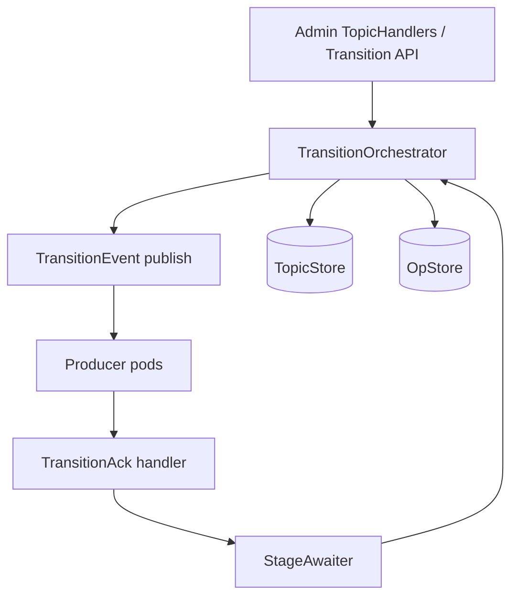
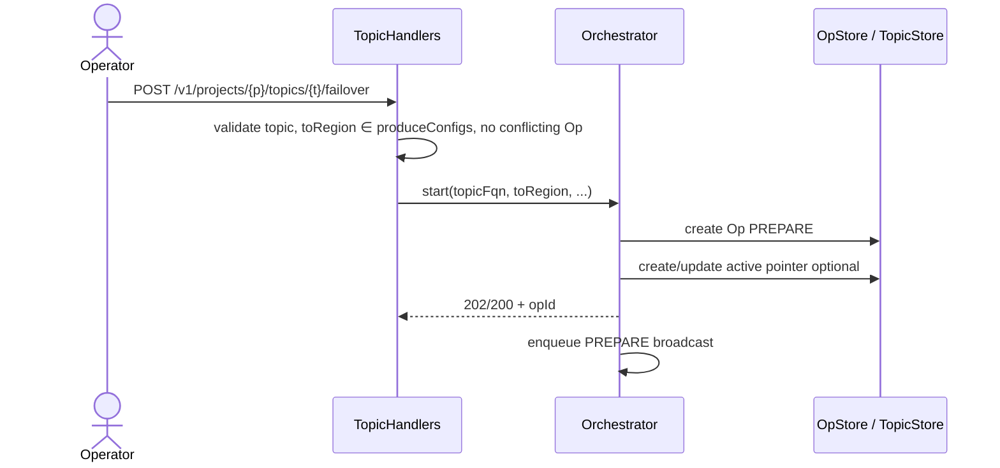
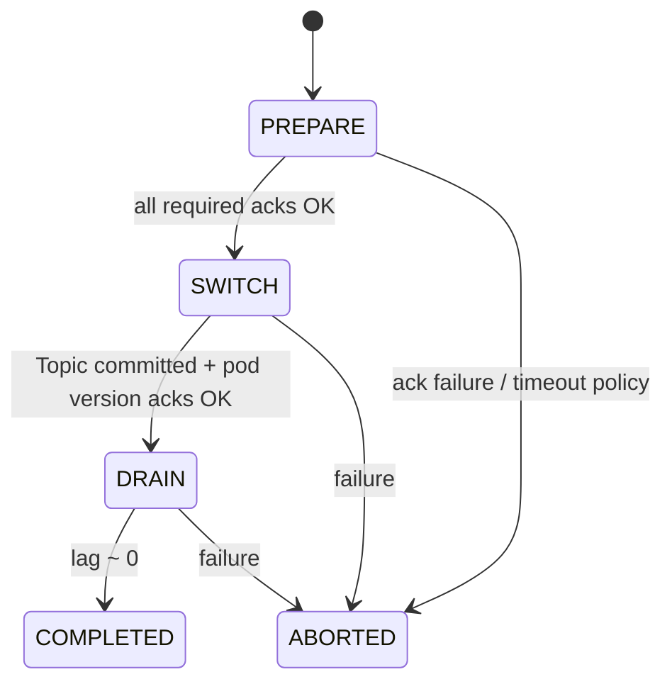
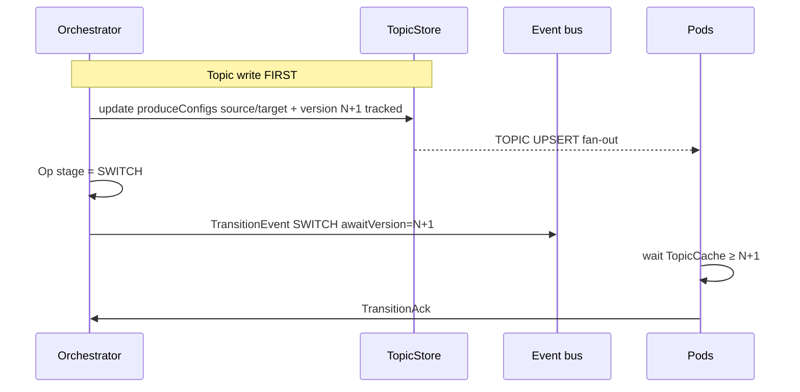
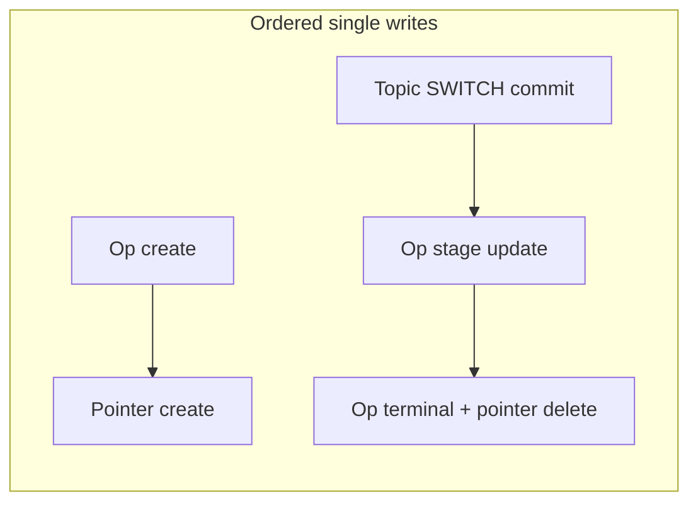

# Controller-side failover changes

| Field | Value |
|-------|-------|
| Owner area | `controller`, admin Topic APIs, OpStore / TopicStore SPIs |
| Parent | [VaradhiTopicFailoverFeature.md](./VaradhiTopicFailoverFeature.md) |
| Pair | [ProduceFailover.md](./ProduceFailover.md) |

---

## Goal

Controller (leader) must:

1. Accept **manual** failover requests and create a durable Op.
2. Drive **PREPARE → SWITCH → DRAIN → COMPLETED/ABORTED** with per-stage pod barriers.
3. Commit **Topic** `produceConfigs` at SWITCH (SSOT) with safe write ordering.
4. Reconcile after crashes without ZK multi-entity transactions.

---

## 1. Components

| Piece | Responsibility |
|-------|----------------|
| Admin API | Validate `toRegion`; start Op; return quickly |
| Orchestrator | Stage advances, Topic commit, publish events |
| StageAwaiter | `(opId, stage)` membership + ack dedupe by hostname; timeout → resend |
| TopicStore | Tracked Topic updates (UPSERT fan-out to TopicCache) |
| OpStore | Durable Op + optional pointer/index for “active failover by topic” |

---

## 2. Start failover (manual)

Validation (minimum):

- Topic exists and is active.
- `toRegion` registered in `produceConfigs` (or allowed by policy).
- No in-flight non-terminal transition for the same topic.
- Optional: CRUD guard — reject conflicting topic updates while Op active.

---

## 3. Stage orchestration

### PREPARE

1. Snapshot membership (server pods that should ack — policy TBD: all servers vs produce-capable).
2. Publish `TransitionEvent(PREPARE, target=Region(toRegion), awaitVersion?)`.
3. Await acks; record `participation` per host for later gates if needed.
4. On success → SWITCH. On hard failure → ABORTED.

### SWITCH (correctness-critical)

**Topic produceConfigs commit (typical):**

| Region | After SWITCH |
|--------|----------------|
| Source | `Blocked` or `Fenced`→then Blocked; often `failOverRegion=target` while draining |
| Target | `Producing`, `failOverRegion` empty |

Exact intermediate fencing policy is an implementation detail; pods must never require Op state to route.

**Ordering:** Topic tracked write **before** Op stage flip **before** / with SWITCH broadcast. Crash after Topic, before Op ⇒ resume SWITCH idempotently (Topic already correct).

### DRAIN

- **Controller-only** — do not broadcast `DRAIN` to pods.
- Poll source-broker replication / lag until safe.
- Then COMPLETED.

### COMPLETED / ABORTED

- Mark Op terminal; delete active pointer; optional cosmetic Topic tweaks.
- Optionally broadcast terminal stage so pods clear sticky participation.

---

## 4. Barriers and acks

| Rule | Detail |
|------|--------|
| Barrier key | `(opId, stage)` |
| Dedupe | `hostname` |
| Success | `errorMsg` null/blank |
| Failure | non-blank `errorMsg` → fail-fast or retry policy |
| Participation | Echoed every ack; decided on pod at PREPARE |
| Timeout | Resend `TransitionEvent` to missing hosts; escalate to ABORTED per policy |

Ack ingress: existing controller route pattern (`MessageExchange.send` → handler → orchestrator).

---

## 5. Persistence model (no multi-txn)

| Decision | Choice |
|----------|--------|
| ZK `multi()` Topic+Op | **Not used** |
| Consistency | Eventual + **idempotent stages** + **startup reconciler** |
| Module boundary | Controller uses `OpStore` / `TopicStore` SPIs only — no direct `ZKMetaStore` |

Reconciler responsibilities:

- Rebuild missing pointer from active Ops.
- Resume non-terminal Ops (re-enter current stage safely).
- GC terminal Ops with lingering pointers.

---

## 6. Admin API (sketch)

| Method | Path | Role |
|--------|------|------|
| POST | `/v1/projects/:project/topics/:topic/failover` | Start manual failover |
| GET | `/v1/projects/:project/topics/:topic/failover` | Current / last status |
| GET | `/v1/admin/failovers/active` | Cluster-wide active Ops (ops) |

Request must name `toRegion` (and authz). Response returns `opId` + current stage.

---

## 7. Metrics (controller)

| Metric | Notes |
|--------|-------|
| `topic.transition.ack.received` | type, stage |
| `topic.transition.ack.processed` | type, stage |
| `topic.transition.ack.delivery.failed` | processing failure |

---

## 8. Work checklist

- [ ] Op entity + OpStore SPI (create / update / list active)
- [ ] Optional per-topic pointer/index for bootstrap
- [ ] Orchestrator state machine + idempotent stage entry
- [ ] StageAwaiter (membership, timeout, resend)
- [ ] Publish `TransitionEvent` / handle `TransitionAck`
- [ ] SWITCH Topic `produceConfigs` commit via TopicStore (tracked)
- [ ] DRAIN lag polling
- [ ] Startup reconciler
- [ ] Admin REST + authz
- [ ] CRUD guards while Op active
- [ ] Controller metrics

---

## 9. Acceptance

- Manual failover completes PREPARE → SWITCH → DRAIN → COMPLETED with Topic version observed on all participating pods.
- Kill controller after Topic SWITCH commit: resume does not regress produce routing.
- Failed PREPARE / SWITCH can ABORT without leaving Topic in an undefined split-brain policy (documented rollback: Topic-first restore when needed).
- Pods never need OpStore on the produce hot path.
