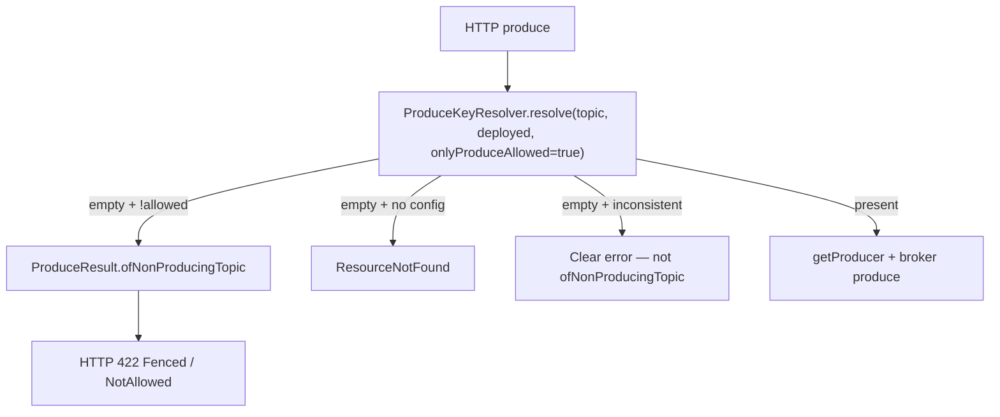
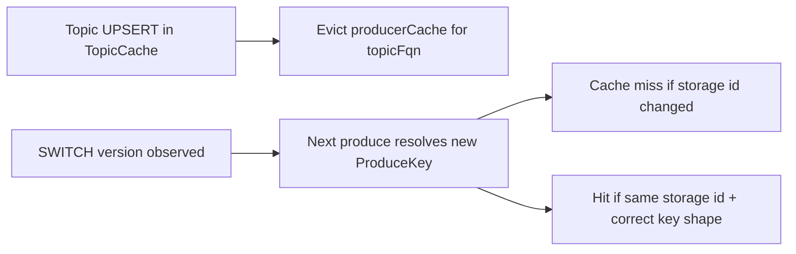
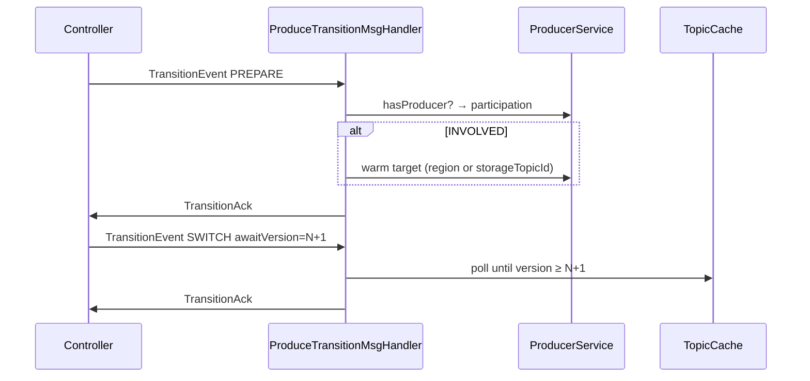

# Produce-side failover changes

| Field | Value |
|-------|-------|
| Owner area | `entities` (produce contracts), `producer`, produce HTTP handlers, server verticle wiring |
| Parent | [VaradhiTopicFailoverFeature.md](./VaradhiTopicFailoverFeature.md) |
| Pair | [ControllerFailover.md](./ControllerFailover.md) |

---

## Goal

Producer pods must:

1. **Gate** produce on the deployed region’s `TopicState`.
2. **Route** via `failOverRegion` using `ProduceKeyResolver`.
3. **Participate** in transitions (PREPARE warm, SWITCH version wait) and ack without breaking barriers.

---

## 1. Entity / routing contracts (produce-facing)

```text
ProduceConfig(state, failOverRegion?)
ProduceKey(topicFqn, produceRegion, storageTopicId)
ProduceKeyResolver.resolve(topic, region [, onlyProduceAllowed])
```



| Case | Behavior |
|------|----------|
| `Blocked` | NotAllowed → 422 |
| `Fenced` | Fenced → 422 (retry after transition) |
| Missing region in `produceConfigs` | 404 |
| Storage null / FO target missing while still `Producing` | Must **not** call `ofNonProducingTopic(Producing)` (throws) |

Ungated `resolve(topic, region)` (no produce-allowed check) is for PREPARE / cache warm while fenced.

---

## 2. Steady-state `ProducerService`

### Checklist

- [ ] HTTP path calls `ProduceKeyResolver.resolve(topic, deployed, true)`
- [ ] Empty-resolve branches: gate vs missing vs inconsistent (see table above)
- [ ] Load storage segment from shared `segmentedStorageTopic` by resolved `storageTopicId`
- [ ] HTTP mapping: `Fenced` \| `NotAllowed` → 422

### Producer cache

| Concern | Contract |
|---------|----------|
| Routing tuple | `ProduceKey(topicFqn, produceRegion, storageTopicId)` |
| Cache identity | Prefer **`(topicFqn, storageTopicId)`** — `produceRegion` is routing/metrics context, not broker identity |
| After Topic UPSERT | Evict keys for that topic (or equivalent) so SWITCH does not keep a stale producer |

Including `produceRegion` in the Caffeine key duplicates producers for the same storage segment across failover — avoid.



---

## 3. Transition handler (pod)

Register `ProduceTransitionMsgHandler` on the cluster broadcast bus (see feature doc §7).



| Stage | Pod work |
|-------|----------|
| PREPARE | Sticky `INVOLVED` / `NOT_INVOLVED` via `hasProducer`. INVOLVED: warm typed `target`. Optional version wait if `awaitVersion`. Ack. |
| SWITCH | Wait TopicCache ≥ `topicVersionToAwait`. Produce path re-reads Topic. Ack. |
| PENDING / COMPLETED / ABORTED | Ack when broadcast; clear sticky participation on terminal. |
| DRAIN | Controller-only — no pod work. |

**Storage migration PREPARE:** warm **explicit** `storageTopicId` from event target. Do **not** use `ProduceKeyResolver` alone (it uses active `produceIndex`).

**Topic failover PREPARE:** warm producer for target **region** (still same shared storage segment id in the remodel).

---

## 4. Version wait

- Fixed poll interval up to `podVersionWaitMs` (not exponential backoff).
- Config: `ProducerOptions.transitionVersionWaitMs` / `transitionPollIntervalMs` (names may vary).
- Probe empty ⇒ retry; probe exception ⇒ abort (surface as error ack, not version timeout).

---

## 5. Metrics (pod)

| Metric | Notes |
|--------|-------|
| `topic.transition.stage.received` | tags: type, stage |
| `topic.transition.stage.acked` | tags: type, stage, success, participation |
| `topic.transition.ack.send.failed` | best-effort ack send |
| `topic.transition.participation` | gauge; set PREPARE, clear terminal |
| `topic.transition.version_waits.in_flight` | gauge |

Avoid per-topic tags (cardinality). Topic id stays in logs.

---

## 6. Acceptance

- Blocked region → NotAllowed; Fenced → Fenced; after SWITCH Topic version, produce follows new `produceConfigs`.
- INVOLVED pods pre-warm so SWITCH does not cold-start the target producer.
- NOT_INVOLVED pods still ack so barriers complete.
- Failover does not thrash duplicate Caffeine entries for the same storage segment.
- Topic UPSERT during/after SWITCH does not leave indefinite stale producers.
