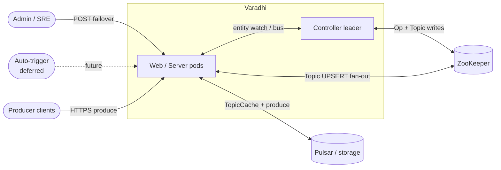
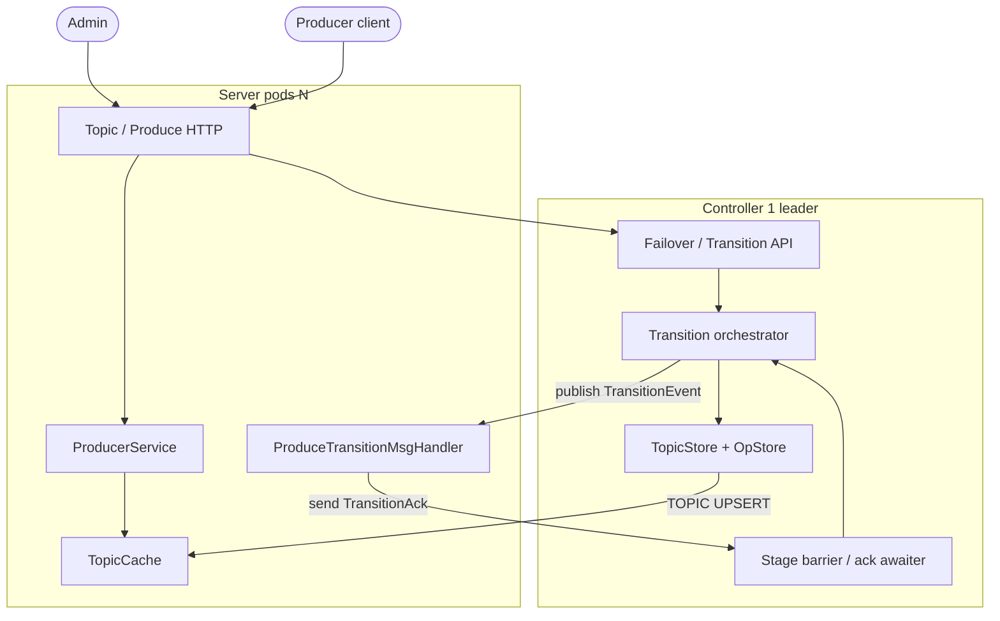
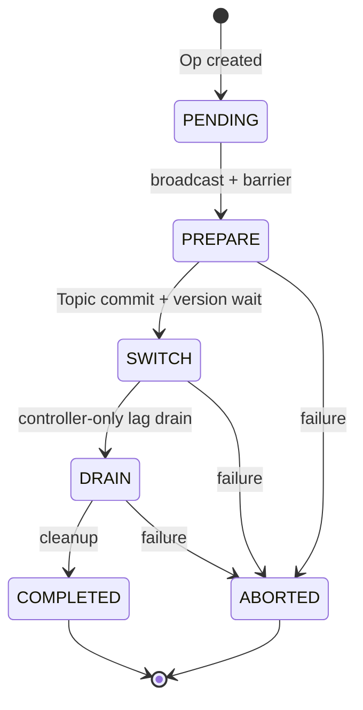
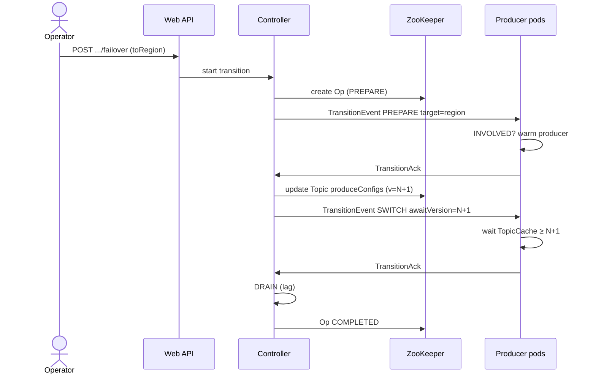

# Varadhi Topic Failover Feature

| Field | Value |
|-------|-------|
| Status | Grooming |
| Scope | Move produce authority for a topic across regions (manual first; auto later) |
| Companion tasks | [ProduceFailover.md](./ProduceFailover.md), [ControllerFailover.md](./ControllerFailover.md) |

---

## 1. Intent

A Varadhi topic can span multiple regions. Operators (and later automation) must be able to:

1. Know **which region is authoritative for produce** for a topic.
2. **Move** that authority to another region (maintenance or regional degradation).
3. Have **all producer pods** observe the change without redeploy, with bounded client disruption.

OSS delivers this with:

- **Topic entity as produce SSOT** — pods gate/route from `VaradhiTopic` in TopicCache.
- **Op as orchestration bookkeeping** — stages, barriers, retries; not on the hot produce path.
- **One stage protocol** shared by topic failover and storage-topic migration.

**Approach 1 (this grooming):** manual failover via admin API + controller orchestration.  
**Approach 2 (deferred):** automatic trigger on region health.

---

## 2. System context



No new external systems. Clients keep the same produce API; during transition they may see `Fenced` / `NotAllowed` in the body (HTTP 422).

---

## 3. Containers and channels



| Channel | Direction | Payload |
|---------|-----------|---------|
| Admin REST | Admin → Web → Controller | Start / query failover |
| Bus publish | Controller → pods | `TransitionEvent` |
| Bus send | Pod → controller | `TransitionAck` |
| Metastore | Controller → ZK → fan-out | `VaradhiTopic` version bump (SWITCH) |

---

## 4. Topic model (produce SSOT)

```text
VaradhiTopic
  segmentedStorageTopic : SegmentedStorageTopic?     // shared across regions
  autoFailover          : boolean
  produceConfigs        : Map<RegionName, ProduceConfig>

ProduceConfig
  state          : TopicState   // Producing | Fenced | Blocked
  failOverRegion : Optional<RegionName>  // empty ⇒ produce in this region
```

| Concern | Rule |
|---------|------|
| Region membership | Key in `produceConfigs` |
| Gate (HTTP produce) | `produceConfigs[deployed].state.isProduceAllowed()` |
| Route | `failOverRegion.orElse(deployed)` → `ProduceKey.produceRegion` |
| Storage | Shared `segmentedStorageTopic`; failover does not create per-region storage maps |
| Resolver | `ProduceKeyResolver` — not routing methods on the entity |

`TopicState`:

| State | Produce allowed | Client `ProduceStatus` |
|-------|-----------------|----------------------|
| Producing | yes | Success (broker path) |
| Fenced | no | Fenced (retry after transition) |
| Blocked | no | NotAllowed |

---

## 5. Stage machine

Same machine for `TOPIC_FAILOVER` and `STORAGE_MIGRATION`. Only PREPARE `target` differs.



| Stage | Broadcast to pods? | Pod role | Controller role |
|-------|--------------------|----------|-----------------|
| PREPARE | yes | Warm target if INVOLVED; ack | Collect acks |
| SWITCH | yes | Wait TopicCache ≥ `topicVersionToAwait`; ack | Commit Topic **first**, then broadcast |
| DRAIN | **no** | — | Poll source replication lag |
| COMPLETED / ABORTED | optional | Clear sticky participation; ack | Persist Op terminal; GC pointer |

**Critical ordering at SWITCH:** write **Topic** (tracked UPSERT → version N+1) **before** flipping Op stage / pinging pods. Pods switch only when they see the Topic version — never from Op alone.

---

## 6. End-to-end manual failover



Participation (producer pods), decided at PREPARE and sticky for the op:

- **INVOLVED** — pod already has a producer for the topic; runs warm / participant work.
- **NOT_INVOLVED** — still acks success so the barrier can complete.

---

## 7. Wire contract (summary)

**Controller → pods:** publish `TransitionEvent`  
(`opId`, `topicFqn`, `transitionType`, `stage`, `awaitVersion`, `topicVersionToAwait`, `target`)

**Pods → controller:** send `TransitionAck`  
(`opId`, `stage`, `hostname`, echoed ids, `participation`, `errorMsg`)

- `errorMsg` null/blank ⇒ success; non-blank ⇒ failure.
- Barrier key: `(opId, stage)`; dedupe by `hostname`.

`target` on PREPARE:

- Failover: `{ "@targetType": "region", "region": "..." }`
- Storage migration: `{ "@targetType": "storageTopic", "storageTopicId": N }`

---

## 8. Consistency decisions (groomed)

| Decision | Choice |
|----------|--------|
| Topic + Op atomic multi-txn | **Dropped** — ordered single writes + startup reconciler |
| Long CRUD lock for whole failover | **No** — lock-free; guard conflicting CRUD while Op active |
| Produce SSOT | **Topic entity**; Op is bookkeeping |

Write order reminders:

1. Create: Op first, then pointer/index.  
2. SWITCH: Topic first, then Op stage.  
3. Terminal: Op + delete pointer (any order; reconcile orphans).

---

## 9. Delivery phases

| Phase | What | Doc |
|-------|------|-----|
| P0 | Entity remodel + produce routing | [ProduceFailover.md](./ProduceFailover.md) |
| P1 | Pod transition handler + bus | [ProduceFailover.md](./ProduceFailover.md) |
| P2 | Controller orchestrator + barriers | [ControllerFailover.md](./ControllerFailover.md) |
| P3 | Admin REST | [ControllerFailover.md](./ControllerFailover.md) |
| P4 | Auto-trigger | Deferred |

---

## 10. Non-goals (v1)

- Consumer automatic “follow producer” region.
- Auto-failover monitors.
- Using `ResourceEventProcessor` as the stage coordination channel (stages use transition bus; Topic UPSERT remains normal entity fan-out).
