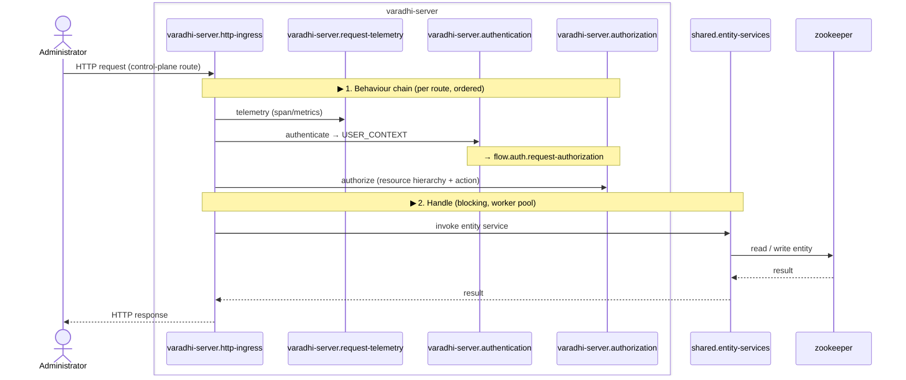
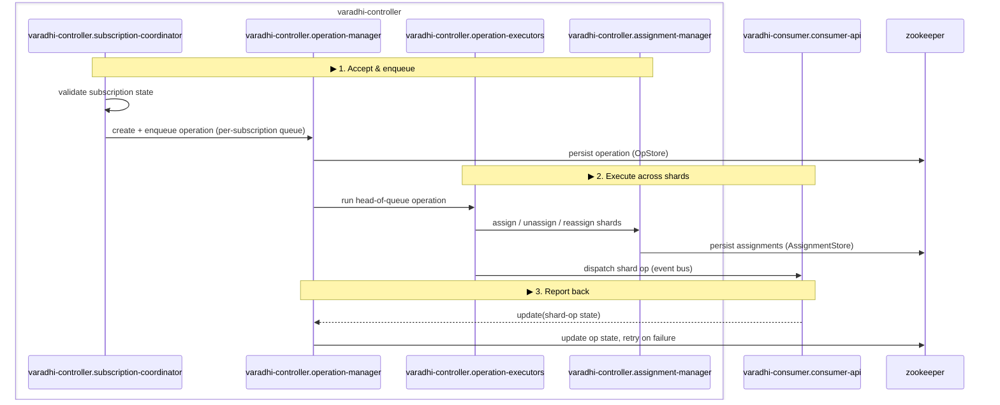
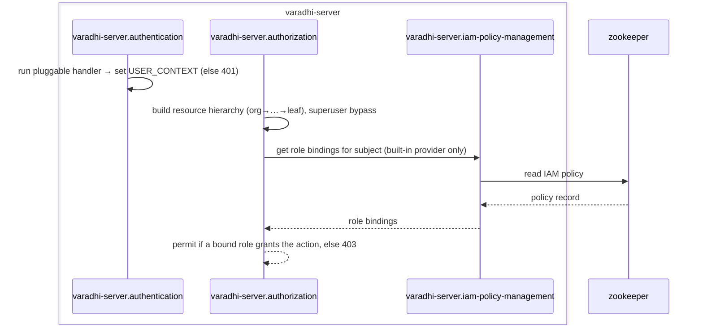
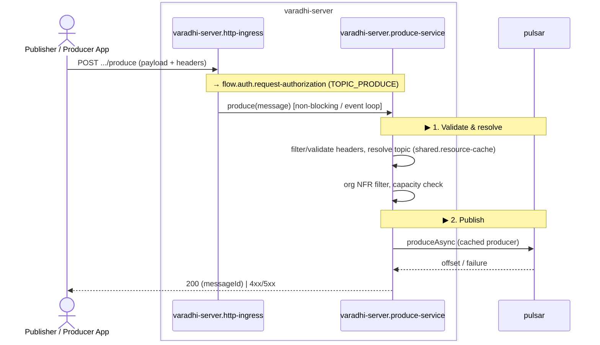
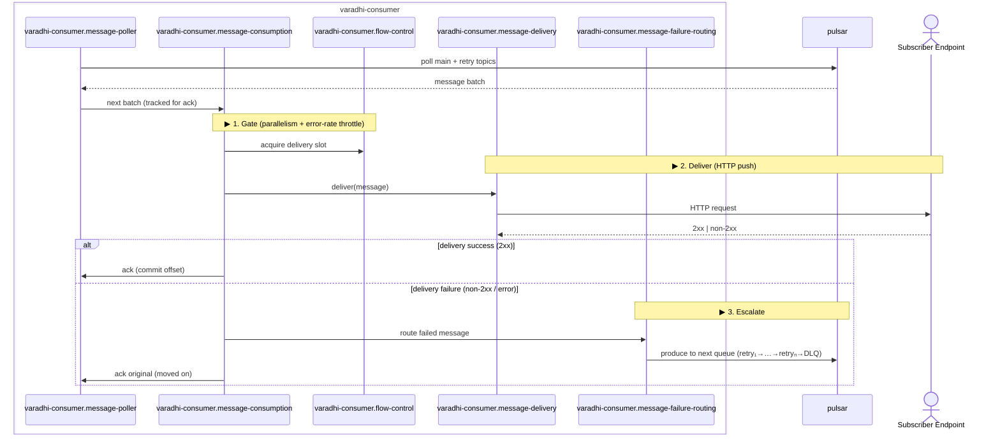
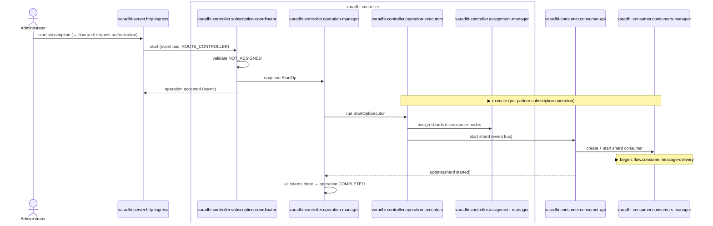
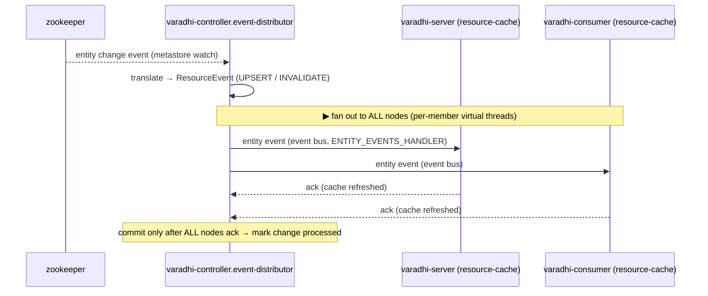
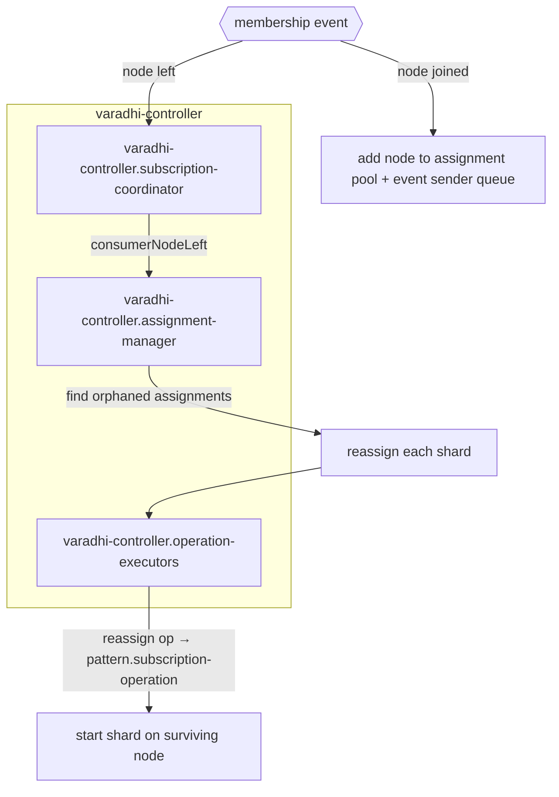
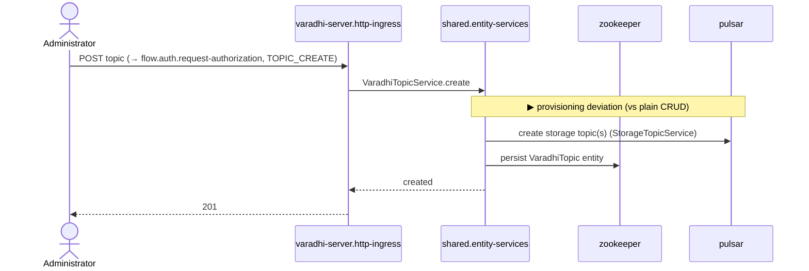
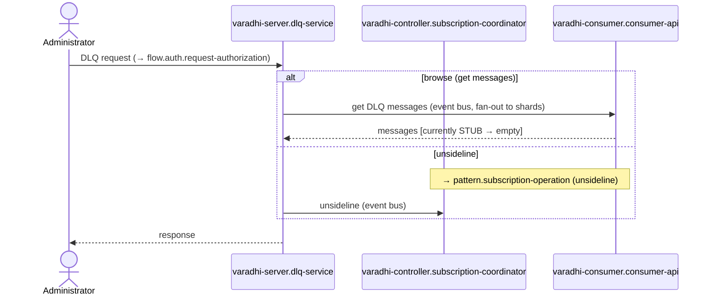

# Varadhi — Flows

> Behavioral view: how work moves through Varadhi's containers and components in response to triggers. The structural complement to [System Context](./system-context.md) (L1), [Containers](./containers.md) (L2), and the per-container component docs (L3). Flows reference components by their `container.component` names — they don't re-describe what those components are.
>
> **Pattern-first**: the bulk of the API surface (admin CRUD, subscription operations) is captured as **patterns**; only flows that deviate or are architecturally central are documented individually.

## Flow Patterns

### pattern.control-plane-request — Control-Plane Request Handling

**Path**: client → `varadhi-server.request-telemetry` → `varadhi-server.authentication` → `varadhi-server.authorization` → `varadhi-server.http-ingress` (resource handler) → `shared.entity-services` → `shared.backend-spi` (ZooKeeper)
**Applies to**: all control-plane CRUD/reads exposed by `varadhi-server.http-ingress` — orgs, teams, projects, regions, topics, subscriptions, queues, and IAM policies.
**Variations**: the handler, the `shared.entity-services` service, and the metastore entity differ per resource. **Reads** stop at the metastore; **create/delete** of topics/subscriptions/queues additionally provision on the messaging stack (see `flow.admin.create-topic`). The authn+authz sub-path is identical for every route → `flow.auth.request-authorization`.

**Notes**: control-plane handlers run **blocking on the Vert.x worker pool** (`http-ingress`); the behaviour-chain order (authn → hierarchy → authz) is architecturally significant. `authorization` reads role bindings via `iam-policy-management` only when the built-in provider is configured.

---

### pattern.subscription-operation — Controller Subscription Operation

**Path**: trigger → `varadhi-controller.subscription-coordinator` (validate) → `varadhi-controller.operation-manager` (persist + enqueue, serialized per subscription) → `varadhi-controller.operation-executors` (assign via `assignment-manager`, dispatch shard op to consumers) → `varadhi-consumer.consumer-api` (apply) → consumer reports back (`update`) → `operation-manager` advances state, retries on failure
**Applies to**: `start`, `stop`, `unsideline`, and `reassign` subscription operations.
**Variations**: **start** assigns shards then starts them on consumers; **stop** stops then unassigns; **reassign** moves one shard to another node (triggered internally by `flow.rebalance.consumer-membership-change`); **unsideline** triggers DLQ reprocessing on the owning consumers. Trigger differs — server cluster-RPC for start/stop/unsideline; internal membership for reassign.

**Notes**: operations are **serialized per subscription** (ordering key) and run in parallel across subscriptions (`operation-manager` thread pool). A newer operation preempts a pending retry of an older one. A persist failure on the failure path can block that subscription's queue head — see `operation-manager` runtime characteristics in L3.

---

## Flows

### flow.auth.request-authorization — Request Authentication & Authorization

**Trigger**: any authenticated `varadhi-server` route (control-plane and produce)
**Purpose**: establish caller identity and enforce RBAC before a handler runs. Documented once; referenced by `pattern.control-plane-request` and `flow.produce.message-to-topic`.
**Containers**: varadhi-server (+ zookeeper for role bindings)

#### Failure Paths

| Condition | Component | Result | Notes |
|---|---|---|---|
| No user context established | `varadhi-server.authentication` | 401 | Fail-closed |
| No bound role grants the action | `varadhi-server.authorization` | 403 | Missing policy → empty roles → deny |
| Authz metastore connection down | `varadhi-server.authorization` | request fails | Authz uses its own metastore connection (L3) |

#### Notes
- With a custom/external authz provider, `iam-policy-management` is not wired and role bindings live outside Varadhi (the IAM read step is provider-specific).

---

### flow.produce.message-to-topic — Produce a Message

**Trigger**: HTTP `POST /v1/projects/:project/topics/:topic/produce`
**Purpose**: accept a message from a publisher and durably persist it to the messaging stack for later delivery.
**Containers**: varadhi-server, pulsar
**Pattern**: deviates from `pattern.control-plane-request` — same auth, but a non-blocking handler with no metastore write.

#### Side Effects

| Side Effect | Component | Condition |
|---|---|---|
| Publish message to storage topic | `varadhi-server.produce-service` | produce allowed + not filtered |
| Producer cached (Caffeine) | `varadhi-server.produce-service` | first produce to a storage topic |
| Produce metrics emitted | `varadhi-server.produce-service` | always (to otel-collector) |

#### Failure Paths

| Condition | Component | Result | Notes |
|---|---|---|---|
| Topic missing / inactive | `varadhi-server.produce-service` | 404 / 422 | `ResourceNotFoundException` |
| Produce blocked / not allowed | `varadhi-server.produce-service` | 422 | topic state gate |
| Over capacity | `varadhi-server.produce-service` | 429 | throttle is expected behaviour |
| Org NFR filter matches | `varadhi-server.produce-service` | 200, message dropped | treated as delivered for bookkeeping |
| Pulsar publish fails | `varadhi-server.produce-service` | 500 | |

#### Runtime Characteristics
- **Performance shape**: the hot path; the only **non-blocking / event-loop** route — blocking work here stalls the event loop.
- **Eventually consistent**: topic/project/org lookups come from `shared.resource-cache`, refreshed via `flow.cache.entity-event-propagation`; a just-created topic may briefly 404 until the cache catches up.
- **What blocks**: produce availability depends on Pulsar; the producer is cached with an access-based TTL.

---

### flow.consume.message-delivery — Consume & Deliver

**Trigger**: per-shard consumption loop for an assigned, running subscription
**Purpose**: read messages from the messaging stack and push them to the subscription's HTTP endpoint, escalating failures through retry/DLQ.
**Containers**: varadhi-consumer, pulsar, subscriber endpoint (external)

#### Side Effects

| Side Effect | Component | Condition |
|---|---|---|
| Consume + ack from Pulsar | `varadhi-consumer.message-poller` | each iteration |
| HTTP push to endpoint | `varadhi-consumer.message-delivery` | per message |
| Produce to retry/DLQ topic | `varadhi-consumer.message-failure-routing` | on delivery failure |
| Consumption metrics | `varadhi-consumer.telemetry` | always |

#### Failure Paths

| Condition | Component | Result | Notes |
|---|---|---|---|
| Endpoint returns non-2xx | `varadhi-consumer.message-delivery` | message → next internal queue | Main→Retry(1..N)→DeadLetter |
| Retry attempts exhausted | `varadhi-consumer.message-failure-routing` | message → DLQ | terminal |
| High delivery error rate | `varadhi-consumer.flow-control` | delivery throttled | designed brownout, not a fault |
| Failure-path produce slow/failing | `varadhi-consumer.message-failure-routing` | in-flight backs up → consumption slows | backpressure |

#### Runtime Characteristics
- **What blocks**: all shard processing on a node runs on a **single `execution-context` thread** — a blocking/slow task stalls every shard on that node.
- **Performance shape**: bounded by `flow-control` parallelism and `maxInFlightMessages` backpressure; retry topics are consumed with a fixed delay.
- **Delivery guarantee**: **at-least-once** — endpoints must be idempotent. Per-GroupId ordering is **not** active (grouped consumption is unwired).

---

### flow.subscription.start — Start a Subscription

**Trigger**: HTTP subscription-start (control-plane) → controller
**Purpose**: bring a subscription's shards online — assign them to consumer nodes and start consumption. The canonical instance of `pattern.subscription-operation`.
**Containers**: varadhi-server, varadhi-controller, varadhi-consumer
**Pattern**: `pattern.subscription-operation` (start variation)

#### Side Effects

| Side Effect | Component | Condition |
|---|---|---|
| Persist + advance operation | `varadhi-controller.operation-manager` | always (OpStore) |
| Create/persist assignments | `varadhi-controller.assignment-manager` | unassigned shards |
| Start shard consumer | `varadhi-consumer.consumers-manager` | per assigned shard |

#### Failure Paths

| Condition | Component | Result | Notes |
|---|---|---|---|
| Subscription already assigned | `varadhi-controller.subscription-coordinator` | rejected | `InvalidOperationForResourceException` |
| No capacity / no consumer nodes | `varadhi-controller.assignment-manager` | shards unassigned | op may fail/retry |
| Shard start dispatch fails | `varadhi-controller.operation-executors` | shard-op failed → op retry | per `RetryPolicy` |

#### Runtime Characteristics
- **What blocks**: operations for the same subscription are **serialized** (`operation-manager` ordering key); a stuck op (e.g. failure-path persist error) blocks that subscription's queue.
- **Eventually consistent**: acceptance is async — the HTTP caller gets an operation handle; shards come online as executors complete. Subscription state is assembled by querying consumers.
- `stop`, `unsideline`, `reassign` follow the same pattern; only the executor and assign/unassign direction differ.

---

### flow.cache.entity-event-propagation — Entity-Change Cache Coherence

**Trigger**: metastore entity change (ZooKeeper watch) on a topic/subscription/project/org/region
**Purpose**: keep every node's in-process `shared.resource-cache` consistent with the metastore after a control-plane change.
**Containers**: varadhi-controller (source), varadhi-server + varadhi-consumer (all nodes)

#### Side Effects

| Side Effect | Component | Condition |
|---|---|---|
| Register metastore watch | `varadhi-controller.event-distributor` | controller start |
| Fan out entity event to all nodes | `varadhi-controller.event-distributor` | per metastore change |
| Refresh local resource cache | `shared.resource-cache` (each node) | on event receipt |

#### Failure Paths

| Condition | Component | Result | Notes |
|---|---|---|---|
| A node is slow/unreachable | `varadhi-controller.event-distributor` | event completion delayed | per-node retry (Failsafe) |
| A node leaves mid-event | `varadhi-controller.event-distributor` | removed as participant | unblocks the event |

#### Runtime Characteristics
- **What blocks**: an event commits (and the source change is marked processed) **only after every participating node acknowledges** it — a stuck node delays that event's completion.
- **Eventually consistent**: this is the propagation mechanism behind `shared.resource-cache` staleness; produce/admin reads on other nodes see a change only after this completes.
- **Performance shape**: per-member virtual-thread senders + a single committer; fan-out is concurrent across nodes.

---

### flow.rebalance.consumer-membership-change — Consumer Join/Leave Rebalance

**Trigger**: cluster membership change — a consumer node joins or leaves
**Purpose**: keep shard ownership valid as the consumer fleet changes — reassign a departed node's shards to surviving nodes.
**Containers**: varadhi-controller, varadhi-consumer

#### Side Effects

| Side Effect | Component | Condition |
|---|---|---|
| Remove node + free capacity | `varadhi-controller.assignment-manager` | node left |
| Enqueue reassign operation per orphaned shard | `varadhi-controller.subscription-coordinator` | node left with assignments |
| Add node to pool + event-sender queue | `varadhi-controller.assignment-manager` / `event-distributor` | node joined |

#### Failure Paths

| Condition | Component | Result | Notes |
|---|---|---|---|
| No surviving node with capacity | `varadhi-controller.assignment-manager` | shard stays unassigned | until capacity frees |
| Reassign op fails | `varadhi-controller.operation-manager` | retried | per `RetryPolicy` |

#### Runtime Characteristics
- **What blocks**: reassignment runs through `pattern.subscription-operation`, so per-subscription serialization applies; assignment mutations are single-threaded in `assignment-manager`.
- **Performance shape**: rebalance cost scales with the departed node's shard count; each orphaned shard is an independent reassign operation.
- **Note**: there is **no leader election** — a single active controller is assumed, so rebalance is driven by that one controller (see memory / L2).

---

### flow.admin.create-topic — Create a Topic (with provisioning)

**Trigger**: HTTP `POST /v1/projects/:project/topics`
**Purpose**: the create variation of `pattern.control-plane-request` — it both writes metadata **and** provisions backing storage on the messaging stack.
**Containers**: varadhi-server, zookeeper, pulsar
**Pattern**: `pattern.control-plane-request` + a provisioning deviation

#### Side Effects

| Side Effect | Component | Condition |
|---|---|---|
| Provision storage topic(s) on Pulsar | `shared.entity-services` (via `shared.backend-spi` messaging) | topic/queue create |
| Persist entity in metastore | `shared.entity-services` | always |

#### Notes
- This is the part `pattern.control-plane-request` abstracts over: **reads** and non-messaging entities (org/team/project/region) skip the Pulsar step; topic/subscription/queue **create/delete** include it. Subscription create additionally provisions retry/DLQ storage subscriptions.
- The new entity becomes visible on other nodes via `flow.cache.entity-event-propagation`.

---

### flow.dlq.browse-unsideline — DLQ Browse / Unsideline

**Trigger**: HTTP DLQ routes (`/v1/projects/:project/subscriptions/:sub/dlt...`)
**Purpose**: inspect dead-lettered messages (browse) and re-drive them through delivery (unsideline).
**Containers**: varadhi-server, varadhi-controller, varadhi-consumer

#### Failure Paths

| Condition | Component | Result | Notes |
|---|---|---|---|
| Browse get-messages | `varadhi-consumer.consumer-api` | empty result | **stubbed** consumer-side (returns empty) |
| Unsideline | `varadhi-controller` | no-op | `unsideline` is a stub today |

#### Notes
- Partially implemented: the direct `varadhi-server → varadhi-consumer` browse edge exists, but `consumer-api` DLQ get-messages and `unsideline` are **stubs** (see memory / L3). Document reflects current behavior, not the intended end state.

