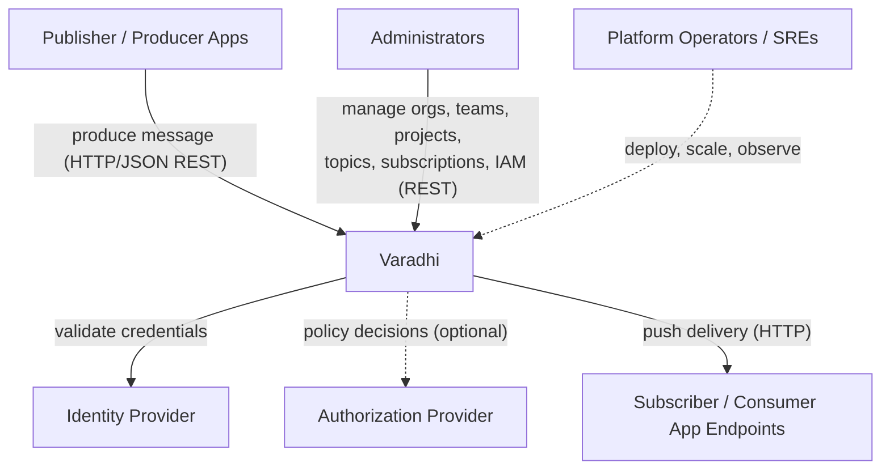

# Varadhi

## Overview

See: [Varadhi Wiki — Home](https://github.com/flipkart-incubator/varadhi/wiki) and [Main Concepts](https://github.com/flipkart-incubator/varadhi/wiki/Main-Concepts) for system purpose, messaging model (pub/sub, point-to-point, push delivery, failure handling), tenancy, and integration guides.

Varadhi is the open-source distribution of a **RESTBus** — async messaging where producers and consumers integrate over **HTTP only** (produce API in, push delivery out). It is the open-source release of a platform that has been Flipkart's backbone for async REST communication between microservices for roughly ten years.

Read [Known Limitations](#known-limitations) before production use — the OSS distribution is pre-production and its APIs remain in Draft.

## Owners

Flipkart-incubated open-source project: [`flipkart-incubator/varadhi`](https://github.com/flipkart-incubator/varadhi).

- **Maintainer contacts:** sahil.chachan@flipkart.com, k.dhruv@flipkart.com
- **Bugs / feedback / feature requests:** [GitHub Issues](https://github.com/flipkart-incubator/varadhi/issues)
- **Contributing:** [CONTRIBUTING.md](../CONTRIBUTING.md)

There is no published internal oncall/escalation for the OSS distribution; operators who deploy Varadhi own its operation in their environment.

## Users & Actors

### actor.producer — Publisher / Producer Applications
**Type**: machine
**Relationship**: Inbound caller — produces messages to a topic or queue over the HTTP produce API.
**Reference**: [Produce REST API](#produce-rest-api) · [`docs/api.yaml`](./api.yaml) · [Message Configurability](https://github.com/flipkart-incubator/varadhi/wiki/Message-Configurability)

### actor.subscriber — Subscriber / Consumer Applications
**Type**: machine
**Relationship**: Outbound push recipient — exposes an HTTP endpoint that Varadhi pushes delivered messages to (push-based delivery, not pull). For queues, may receive request/response callbacks. Each subscription carries its own endpoint URL; there is no single named external service.
**Reference**: [Push delivery contract](#push-delivery-contract-varadhi--subscriber-endpoint) · [Message Configurability](https://github.com/flipkart-incubator/varadhi/wiki/Message-Configurability) · [Effective Failure Handling](https://blog.flipkart.tech/effective-failure-handling-in-flipkarts-message-bus-436c36be76cc)

### actor.administrator — Administrators
**Type**: human
**Relationship**: Inbound caller — manages the resource hierarchy and resources (orgs, teams, projects, topics, subscriptions, IAM role bindings) via the control-plane REST API.
**Reference**: [Control-plane REST API](#control-plane-rest-api) · [`docs/api.yaml`](./api.yaml) · [Tenancy Model](https://github.com/flipkart-incubator/varadhi/wiki/Tenancy-Model)

### actor.platform-operator — Platform Operators / SREs
**Type**: human
**Relationship**: Deploys and operates Varadhi and its backing infrastructure in their environment; manages regions, scaling, and observability. Not a single integration contract — each deployment owns its operational runbooks.
**Reference**: [Try Locally](https://github.com/flipkart-incubator/varadhi/wiki/Try-Locally) · [`setup/`](../setup) · [Metrics Documentation](https://github.com/flipkart-incubator/varadhi/wiki/Varadhi-Metrics-Documentation)

## Capabilities

See [Main Concepts](https://github.com/flipkart-incubator/varadhi/wiki/Main-Concepts) for detail on each capability below.

- **Pub/Sub messaging**
- **Point-to-Point queues**
- **Push delivery** (at-least-once)
- **Failure handling** (Retry Queues, Dead Letter Queues) — see also [Effective Failure Handling in Flipkart's Message Bus](https://blog.flipkart.tech/effective-failure-handling-in-flipkarts-message-bus-436c36be76cc)
- **Server-side filtering** (topics/subscriptions only; not queues)
- **Multi-tenancy** (Org → Team → Project, RBAC/IAM) — [Tenancy Model](https://github.com/flipkart-incubator/varadhi/wiki/Tenancy-Model)
- **Pluggable backends** — messaging and metadata storage behind SPIs; deployable backends in [Container View](./containers.md)
- **Observability** (metrics, distributed tracing) — [Metrics Documentation](https://github.com/flipkart-incubator/varadhi/wiki/Varadhi-Metrics-Documentation)

## System Boundary

### In Scope
- HTTP message ingestion (produce) with authentication, authorization, and configurable header validation.
- Topic-based pub/sub and point-to-point queue delivery (with optional callbacks).
- Push delivery to consumer HTTP endpoints with at-least-once semantics.
- Retry Queues and Dead Letter Queues for soft/hard delivery failures.
- Server-side, header-based message filtering.
- Multi-tenant resource hierarchy and RBAC/IAM administration.
- Pluggable messaging and metadata backends (see [Container View](./containers.md)).
- Region, replication, and failover settings on topics and subscriptions (control-plane API).

### Out of Scope
- Message payload transformation or enrichment (payload is treated as opaque bytes).
- Schema registry / schema validation.
- Exactly-once delivery and message deduplication.
- Scheduled / delayed delivery and message replay.
- Encryption at rest, masking/data-protection.
- Consumer offset management exposed to clients (delivery is push-based and managed by Varadhi).

## External Dependencies

### External Services

#### ext.identity-provider — Identity Provider
**Relationship**: depends-on (authentication)
**Purpose**: Validates credentials on control-plane and produce API requests. Authentication is pluggable per deployment; the default handler is header-based and the OpenAPI spec models JWT bearer auth.
**Reference**: [`docs/api.yaml`](./api.yaml) (security schemes); pluggable contract [AuthenticationHandlerProvider](/web-spi/src/main/java/com/flipkart/varadhi/web/spi/authn/AuthenticationHandlerProvider.java). [TODO: link deployment-specific identity-provider docs when finalized.]

#### ext.authorization-provider — Authorization Provider
**Relationship**: depends-on (authorization, optional)
**Purpose**: RBAC / policy decisions when a deployment uses an external provider instead of Varadhi's built-in `DefaultAuthorizationProvider`. When configured, IAM role bindings are managed outside Varadhi.
**Reference**: Pluggable contract [AuthorizationProvider](/web-spi/src/main/java/com/flipkart/varadhi/web/spi/authz/AuthorizationProvider.java). [TODO: link deployment-specific authorization-provider docs when configured.]

### Shared Resources

| Resource | Type | Relationship | Purpose |
|---|---|---|---|
| [TODO: document cross-team shared topics, buckets, or databases — none identified in repo artifacts] | | | |

### Gateway / Network

| System | Purpose |
|---|---|
| [TODO: document API gateway, load balancer, or CDN for your deployment — not prescribed by the OSS distribution] | |

## Public Concepts

Canonical reference: [Main Concepts](https://github.com/flipkart-incubator/varadhi/wiki/Main-Concepts), [Tenancy Model](https://github.com/flipkart-incubator/varadhi/wiki/Tenancy-Model), [Message Configurability](https://github.com/flipkart-incubator/varadhi/wiki/Message-Configurability), [Message Ordering](https://github.com/flipkart-incubator/varadhi/wiki/Message-Ordering).

### concept.message — Message
A two-part entity: an opaque **payload** (raw bytes — Varadhi attaches no semantics) and **metadata** carried as HTTP request **headers** that tell Varadhi how to handle it.
- *Gotcha:* header names are **configurable per deployment** (e.g. `X_MESSAGE_ID`, `X_GROUP_ID`). Don't hardcode names; confirm the target deployment's convention. A Message ID header is required; Group ID is required only for grouped topics.

### concept.topic — Topic
A named stream of messages, identified globally as `{project}/{topic}`. Supports pub/sub and broadcast. Has a `grouped` flag and a capacity policy (throughput/QPS guard rails).

### concept.subscription — Subscription
A named, **push-based** consumer of a topic, identified as `{project}/{subscription}`. Defines the delivery endpoint, RetryPolicy, ConsumptionPolicy, optional filter, and delivery mode. A topic can have many independent subscriptions.

### concept.queue — Queue
A topic + auto-created subscription pair for **point-to-point** delivery; each message carries its destination endpoint. Optional **callback** enables request/response. Users cannot create subscriptions on a queue. Queues do **not** support filtering.

### concept.retry-queue — Retry Queue
Destination for retriable (soft) delivery failures; messages are re-attempted from here per the subscription's RetryPolicy.

### concept.dead-letter-queue — Dead Letter Queue
Destination for non-retriable (hard) delivery failures; messages land here for explicit, operator/consumer-initiated redelivery (managed via the control-plane API).

### concept.filter — Filter
A condition over message headers, evaluated on the **first** delivery attempt only; non-matching messages are treated as delivered for bookkeeping. Topic/subscription only.

### concept.grouping — Grouping / Ordering
**GroupId** is an optional message header. Grouped topics require it; produce routes messages by GroupId.

### concept.org — Org
Top of the resource hierarchy (Org → Team → Project); the tenancy/isolation root under which teams and projects live.

### concept.team — Team
A grouping within an Org that owns one or more Projects.

### concept.project — Project
The unit that messaging resources (topics/subscriptions/queues) live under. Project names are globally unique per deployment; a resource's project association is immutable.

## Public Contracts

### Control-plane REST API
**Type**: REST (HTTP/JSON, OpenAPI 3.0.0)
**Reference**: [Swagger UI](https://flipkart-incubator.github.io/varadhi/) · [`docs/api.yaml`](./api.yaml) — orgs, teams, projects, topics, subscriptions, IAM role bindings, regions, DLQ message management. Authenticated (security schemes in spec; pluggable via `ext.identity-provider`) with RBAC authorization.
**Availability**: [TODO: no published SLA/SLO; APIs are in Draft.]
**Consistency**: [TODO: document read/write consistency guarantees for control-plane operations.]
**Performance**: [TODO: no published latency or rate-limit SLA.]

### Produce REST API
**Type**: REST (HTTP/JSON)
**Reference**: `POST /v1/projects/{project}/topics/{topic}/produce` in [`docs/api.yaml`](./api.yaml); message headers per [Message Configurability](https://github.com/flipkart-incubator/varadhi/wiki/Message-Configurability). HTTP/1.1 and HTTP/2 (ALPN).
**Availability**: [TODO: no published SLA/SLO.]
**Consistency**: At-least-once message persistence.
**Performance**: Per-topic capacity policy enforces throughput and QPS limits; request-size limits apply per deployment configuration. [TODO: no published global produce SLA.]

### Push delivery contract (Varadhi → subscriber endpoint)
**Type**: Outbound HTTP request to the subscription's configured endpoint URL.
**Reference**: Delivery semantics and propagated headers in [Message Configurability](https://github.com/flipkart-incubator/varadhi/wiki/Message-Configurability); failure routing in [Effective Failure Handling](https://blog.flipkart.tech/effective-failure-handling-in-flipkarts-message-bus-436c36be76cc). Queues may use an optional callback URL for request/response.
**Availability**: [TODO: no published delivery-availability SLA.]
**Consistency**: At-least-once delivery; non-2xx subscriber responses are delivery failures routed to Retry Queue or DLQ per the subscription's policy.
**Performance**: Governed by the subscription's ConsumptionPolicy (parallelism and latency preferences). [TODO: no published end-to-end delivery-latency SLA.]

## Operational Context

Varadhi runs as one or more region-scoped installations. Deployment artifacts live under [`setup/`](../setup) (Docker, Helm); quick-start: [Try Locally](https://github.com/flipkart-incubator/varadhi/wiki/Try-Locally). For deployable units, backing infrastructure, and how they connect, see [Container View](./containers.md). For metrics and tracing, see [Metrics Documentation](https://github.com/flipkart-incubator/varadhi/wiki/Varadhi-Metrics-Documentation).

[TODO: document deployment regions, availability targets, and SLAs/SLOs once finalized.]

## Known Limitations

Things to know before integrating:

- **Pre-production / WIP** — open-source distribution is work-in-progress; APIs are in *Draft* and may change; not yet productionized; no finalized SLAs.
- **At-least-once only** — no exactly-once or deduplication; consumers must be idempotent.
- **Grouped topics / ordering** — topics expose a `grouped` flag and accept GroupId at produce time; push delivery does not preserve per-GroupId order today and the consumer grouped delivery path is not wired. When ordering ships, it is intended per-GroupId (not per-partition), without relative order across different GroupIds. See [Message Ordering](https://github.com/flipkart-incubator/varadhi/wiki/Message-Ordering).
- **Multi-region replication and failover** — region, replication, and failover settings exist in the control plane; full orchestration is not complete.
- **Push-only delivery** — consumers must expose an HTTP endpoint; there is no client pull/poll API.
- **Configurable header names** — message header names are deployment-specific; integrators must confirm the target deployment's convention.
- **Single messaging/metastore implementation** — Apache Pulsar and ZooKeeper are the shipped defaults; Apache Kafka is not available yet.
- **Pluggable auth not finalized** — default authentication is header-based; the OpenAPI spec models JWT; production identity integration is deployment-specific.
- **Not available today** — schema validation, message replay, scheduled/delayed delivery, payload transformation, encryption at rest, and data masking. See [Roadmap](https://github.com/flipkart-incubator/varadhi/wiki/Roadmap).
- **Queues don't support filtering**. The exact feature of filtering in queues is yet to be decided.

## System Context Diagram

