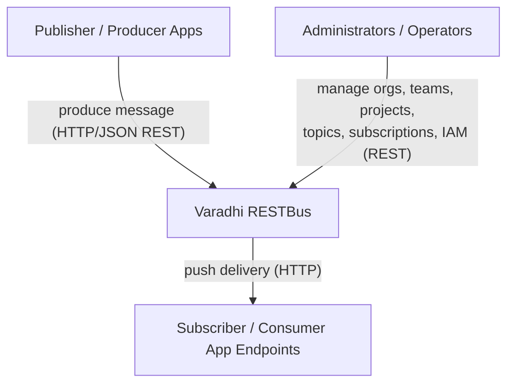

# Varadhi (RESTBus)

> **Status:** Open-source, work-in-progress. APIs are in *Draft*; the system is not yet productionized and SLAs are not finalized. This document describes Varadhi from the **outside-in** — what it is, what it offers, and how to integrate with it.

## Overview

See: [Varadhi Wiki — Home](https://github.com/flipkart-incubator/varadhi/wiki) and [Main Concepts](https://github.com/flipkart-incubator/varadhi/wiki/Main-Concepts).

Varadhi is a multi-tenant **message bus with a REST/HTTP interface** ("RESTBus"). It takes an application's HTTP API stack and turns it into service-bus-driven, queue/pub-sub, message-oriented endpoints — the communication between Varadhi and applications stays over HTTP. Senders produce messages over HTTP; Varadhi durably persists them and **pushes** them to consumer application endpoints, handling ordering and failure recovery centrally so applications don't have to.

It supports both **Publish/Subscribe** (topics with one or more independent subscriptions) and **Point-to-Point** (queues, with optional request/response callbacks). Varadhi is the open-source version of a system that has run inside Flipkart for ~10 years as the backbone of async REST communication between microservices.

## Owners

Flipkart-incubated open-source project: [`flipkart-incubator/varadhi`](https://github.com/flipkart-incubator/varadhi).

- **Maintainer contacts:** sahil.chachan@flipkart.com, k.dhruv@flipkart.com
- **Bugs / feedback / feature requests:** [GitHub Issues](https://github.com/flipkart-incubator/varadhi/issues)
- **Contributing:** [CONTRIBUTING.md](../CONTRIBUTING.md)

There is no published internal oncall/escalation for the OSS distribution; operators who deploy Varadhi own its operation in their environment.

## Users & Actors

| Actor | Interaction |
|---|---|
| **Publisher / producer applications** | Produce messages to a topic or queue over the HTTP produce API. |
| **Subscriber / consumer applications** | Expose an HTTP endpoint that Varadhi **pushes** delivered messages to (push-based delivery, not pull). For queues, may receive request/response callbacks. |
| **Administrators** | Manage the resource hierarchy and resources (orgs, teams, projects, topics, subscriptions, IAM role bindings) via the control-plane REST API. |
| **Platform operators / SREs** | Deploy and operate Varadhi and its backing infrastructure; manage regions, scaling, and observability. |

## Capabilities

What Varadhi provides to its consumers (see [Main Concepts](https://github.com/flipkart-incubator/varadhi/wiki/Main-Concepts) for detail):

- **Pub/Sub messaging** — produce to a topic; one or more independent subscriptions each receive the full message stream (broadcast / choreography).
- **Point-to-Point queues** — each message carries its destination endpoint; optional callback enables async request/response and orchestration patterns.
- **Push delivery with at-least-once guarantee** — Varadhi delivers messages to the subscription's configured HTTP endpoint and tracks success/failure.
- **Failure handling** — retriable (soft) failures go to **Retry Queues** (configurable RetryPolicy, up to 3 retries); non-retriable (hard) failures go to **Dead Letter Queues** for later, explicit redelivery. See [Effective Failure Handling in Flipkart's Message Bus](https://blog.flipkart.tech/effective-failure-handling-in-flipkarts-message-bus-436c36be76cc).
- **Message ordering / grouping** — optional per-topic/subscription ordered delivery at **GroupId** granularity, preserved across retries and dead-lettering. See [Message Ordering](https://github.com/flipkart-incubator/varadhi/wiki/Message-Ordering).
- **Server-side filtering** — subscriptions can filter on message headers so consumers receive only messages of interest (topics/subscriptions only, not queues).
- **Multi-tenancy** — hierarchical Org → Team → Project isolation with RBAC/IAM. See [Tenancy Model](https://github.com/flipkart-incubator/varadhi/wiki/Tenancy-Model).
- **Pluggable backends** — messaging stack and metadata store are behind SPIs (Apache Pulsar and ZooKeeper are the default implementations).
- **Observability** — Micrometer metrics exported via OpenTelemetry (OTLP), plus distributed tracing. See [Metrics Documentation](https://github.com/flipkart-incubator/varadhi/wiki/Varadhi-Metrics-Documentation).

## System Boundary

### In Scope
- HTTP message ingestion (produce) with authentication, authorization, and configurable header validation.
- Topic-based pub/sub and point-to-point queue delivery (with optional callbacks).
- Push delivery to consumer HTTP endpoints with at-least-once semantics.
- Retry Queues and Dead Letter Queues for soft/hard delivery failures.
- Ordered (grouped) delivery at GroupId granularity.
- Server-side, header-based message filtering.
- Multi-tenant resource hierarchy and RBAC/IAM administration.
- Storage-backend and metastore abstraction (Pulsar / ZooKeeper defaults).
- Multi-region replication and failover orchestration (partly implemented / in progress).

### Out of Scope
- Message payload transformation or enrichment (payload is treated as opaque bytes).
- Schema registry / schema validation *(roadmap)*.
- Exactly-once delivery and message deduplication *(roadmap)*.
- Scheduled / delayed delivery and message replay *(roadmap)*.
- Encryption at rest, masking/data-protection *(roadmap)*.
- Consumer offset management exposed to clients (delivery is push-based and managed by Varadhi).

See the [Roadmap](https://github.com/flipkart-incubator/varadhi/wiki/Roadmap) for planned features.

## External Dependencies

### Services
| System | Relationship | Purpose |
|---|---|---|
| Subscriber / consumer application endpoints | delivers-to (push) | Varadhi pushes messages over HTTP to the endpoint configured on each subscription; for queues, the per-message destination (and optional callback target). |

### Backing Infrastructure (deployment prerequisites)
These are deployed **for** Varadhi and operated as part of it (not external integrations). They are documented here and under [Operational Context](#operational-context), and intentionally **excluded from the outside-in diagram**.

| Resource | Type | Relationship | Purpose |
|---|---|---|---|
| Apache Pulsar | Message broker (messaging-stack SPI default) | persists / delivers | Durable message storage and delivery substrate; geo-replicated across regions in the intended topology. Apache Kafka support is on the roadmap. |
| ZooKeeper | Coordination / metadata store (metastore SPI default) | reads / writes | Stores Varadhi metadata (orgs, teams, projects, topics, subscriptions, role bindings, assignments). |

### Platform / Observability
Listed for operators; **not shown in the diagram** to keep the outside-in view focused.

| System | Purpose |
|---|---|
| OpenTelemetry collector → Prometheus / Grafana | Receives OTLP metrics/traces for monitoring and visualization. |
| Identity provider / token issuer | Issues/validates credentials for API authentication. The default handler is header-based (`UserHeaderAuthenticationHandler`); the OpenAPI spec models JWT bearer auth. Authentication is pluggable; the production mechanism is not finalized. |

## Public Concepts

Canonical reference: [Main Concepts](https://github.com/flipkart-incubator/varadhi/wiki/Main-Concepts) and [Tenancy Model](https://github.com/flipkart-incubator/varadhi/wiki/Tenanacy-Model).

### Message
A two-part entity: an opaque **payload** (raw bytes — Varadhi attaches no semantics) and **metadata** carried as HTTP request **headers** that tell Varadhi how to handle it. See [Message Configurability](https://github.com/flipkart-incubator/varadhi/wiki/Message-Configurability).
- *Gotcha:* header names are **configurable per deployment** (e.g. `X_MESSAGE_ID`, `X_GROUP_ID`). Don't hardcode names; confirm the target deployment's convention. A Message ID header is required; Group ID is required only for grouped topics.

### Topic
A named stream of messages, identified globally as `{project}/{topic}`. Supports pub/sub and broadcast. Has a `grouped` flag (ordering) and a capacity policy (throughput/QPS guard rails).

### Subscription
A named, **push-based** consumer of a topic, identified as `{project}/{subscription}`. Defines the delivery endpoint, RetryPolicy, ConsumptionPolicy, optional filter, and ordered/unordered delivery. A topic can have many independent subscriptions.

### Queue
A topic + auto-created subscription pair for **point-to-point** delivery; each message carries its destination endpoint. Optional **callback** enables request/response. Users cannot create subscriptions on a queue. Queues do **not** support filtering.

### Retry Queue / Dead Letter Queue
Internal destinations for failed deliveries: retriable failures are re-attempted from Retry Queues; hard failures land in the DLQ for explicit, operator/consumer-initiated redelivery.

### Filter
A condition over message headers, evaluated on the **first** delivery attempt only; non-matching messages are treated as delivered for bookkeeping. Topic/subscription only.

### Grouping / Ordering
Ordering is enforced per **GroupId** (not per partition). Messages of the same GroupId are delivered in produce order, even across retries/DLQ; different GroupIds may be delivered concurrently and out of relative order. See [Message Ordering](https://github.com/flipkart-incubator/varadhi/wiki/Message-Ordering).

### Org / Team / Project (resource hierarchy)
Org → Team → Project; messaging resources (topics/subscriptions/queues) live under a Project. Project names are globally unique per deployment; a resource's project association is immutable. See [Tenancy Model](https://github.com/flipkart-incubator/varadhi/wiki/Tenanacy-Model).

## Public Contracts

### Control-plane REST API
**Type**: REST (HTTP/JSON, OpenAPI 3.0.0)
**Reference**: [Swagger UI](https://flipkart-incubator.github.io/varadhi/) · spec at [`docs/api.yaml`](./api.yaml)
**Scope**: Manage tenants/orgs, teams, projects, topics, subscriptions (CRUD + state), IAM role bindings, regions, and DLT message management.
**Auth**: Authenticated (JWT in spec / pluggable handler) + RBAC authorization.
**Availability / Consistency / Performance**: [TODO: no published SLA/SLO; APIs are in Draft.]

### Produce REST API
**Type**: REST (HTTP/JSON) — `POST /v1/projects/{project}/topics/{topic}/produce`
**Reference**: [`docs/api.yaml`](./api.yaml); message headers in [Message Configurability](https://github.com/flipkart-incubator/varadhi/wiki/Message-Configurability).
**Consistency**: At-least-once persistence/delivery (MVP). Ordered delivery available for grouped topics (GroupId granularity).
**Performance**: Per-topic capacity policy enforces guard rails (config defaults: ~400 KBps throughput, ~100 QPS, read fan-out 2; max request size 5 MB). [TODO: no published global SLA.]
**Protocols**: HTTP/1.1 and HTTP/2 (ALPN). gRPC and alternate protocols are on the roadmap.

### Push delivery contract (Varadhi → subscriber endpoint)
**Type**: Outbound HTTP request to the subscription's configured endpoint.
**Behavior**: Varadhi delivers the message payload and propagates configured headers (e.g. message id, produce identity/region/timestamp). Non-2xx responses are treated as delivery failures and routed to Retry Queue / DLQ per policy. For queues, an optional callback delivers a response back to the publisher.
**Consistency**: At-least-once (consumers should be idempotent). Ordering preserved per GroupId for grouped subscriptions, including across failures.
**Performance**: Governed by the subscription's ConsumptionPolicy (latency/parallelism/failure-recovery preferences). [TODO: no published delivery-latency SLA.]

## Operational Context

> **Not yet productionized.** SLAs/SLOs are **not finalized**. The topology below is the *intended* design and may change.

**Backing infrastructure (per deployment):**
- A **global ZooKeeper** for globally-relevant metadata (orgs, teams, projects, topics, subscriptions).
- A **messaging stack** behind an SPI; the default implementation uses **Apache Pulsar, geo-replicated across regions**.

**Per-region Varadhi deployments** (component roles configured via `member.roles`):
- **Web server** — control-plane APIs + produce-message API. Optionally split into a pure control-plane web server and a separate produce-only web server.
- **Controller** — region-local cluster/assignment management. (Likely needs a region-local ZooKeeper as well — not finalized.)
- **Consumer worker fleet** — delivers messages to subscriber endpoints; handles retries/DLQ.

**Regions & failover:** Varadhi is region-aware (`deployedRegion`); topics can carry replication/produce regions and failover configuration. Multi-region replication and failover orchestration are partly implemented / in progress.

**Deployment artifacts:** Docker images and Helm charts under [`setup/`](../setup) (separate server and controller deployments). Local quick-start: [Try Locally](https://github.com/flipkart-incubator/varadhi/wiki/Try-Locally).

**Observability:** Metrics via Micrometer → OpenTelemetry (OTLP) → Prometheus/Grafana; tracing enabled. See [Metrics Documentation](https://github.com/flipkart-incubator/varadhi/wiki/Varadhi-Metrics-Documentation).

[TODO: deployment regions, availability targets, and SLAs/SLOs to be documented once finalized.]

## Known Limitations

Things to know before integrating:

- **Pre-production / WIP** — APIs are in *Draft* and may change; not yet running in production; no finalized SLAs.
- **At-least-once only** — no exactly-once or deduplication today; consumers must be idempotent.
- **Ordering is per-GroupId**, not per-partition — relative order *across* different GroupIds is not guaranteed (differs from Kafka per-partition ordering; closer to Pulsar key-shared).
- **Push-only delivery** — consumers must expose an HTTP endpoint; there is no client pull/poll API.
- **Configurable header names** — message header names are deployment-specific; integrators must confirm the target deployment's convention.
- **Single backend implementation today** — Apache Pulsar (messaging) and ZooKeeper (metastore) are the only shipped implementations; Kafka is on the roadmap.
- **No schema validation, replay, scheduled/delayed delivery, or payload transformation** *(roadmap)*.
- **Queues don't support filtering**; filters are evaluated only on first delivery attempt.

## System Context Diagram

> Backing infrastructure (Apache Pulsar, ZooKeeper), observability (OpenTelemetry/Prometheus/Grafana), and the identity provider are intentionally omitted from this outside-in diagram; see [External Dependencies](#external-dependencies) and [Operational Context](#operational-context).
