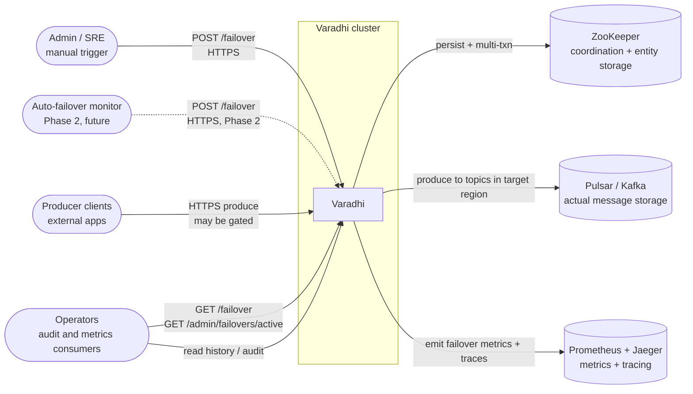
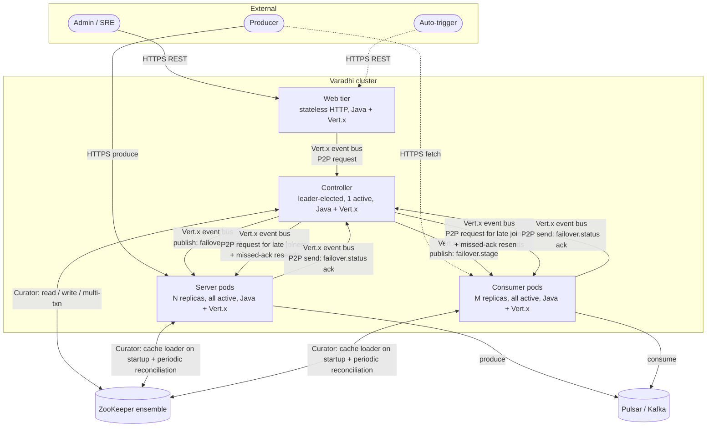
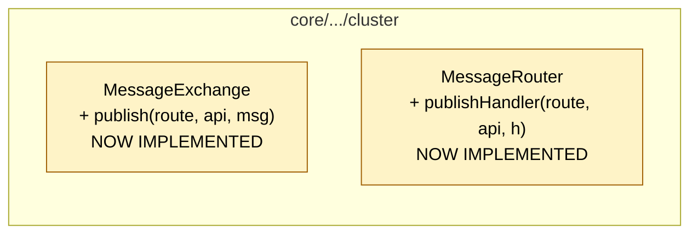
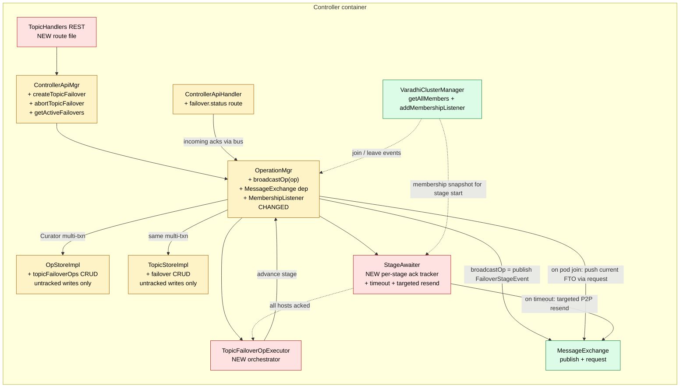
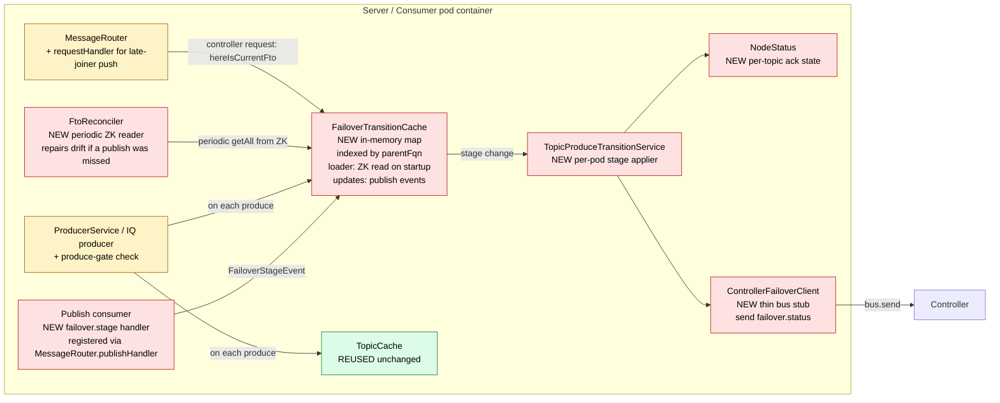
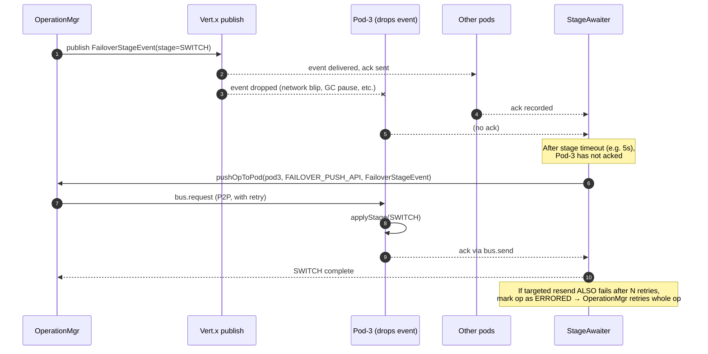

# Topic Failover — C4 Design (Hybrid: FTO L2 + Operation, broadcast via OperationMgr + publish)

> **Status:** Proposal for grooming
> **Audience:** Varadhi OSS reviewers, contributors building the topic-failover feature
> **Scope:** End-to-end design for the topic-failover workflow, structured by the C4 architecture model (System Context → Containers → Components → Code). Self-contained — no prior reading required.
> **Replaces:** `topic-failover-modeling-decision.md` (variant Op-1, broadcast-the-op-via-REP). This document supersedes it with a cleaner separation of concerns and a publish-based broadcast.

---
    
## 1. TL;DR

Topic failover is modeled as **two cooperating entities** and **one new broadcast capability on `OperationMgr`**:

1. **`FailoverTransitionObject` (FTO)** — a small **L2 entity** nested under the parent (`Topic` or `Subscription` in ZK). Persists the active failover for tracking and for pod-restart bootstrap. Written untracked (no event sentinel). Single-record per parent.
2. **`TopicFailoverOperation` (Op)** — a **rich Operation entity** in `OpStore`, untracked, holding the full workflow record: `OpData`, per-attempt `OpResult` history, per-pod ack snapshots, retry counters. Driven by `OperationMgr`.
3. **`OperationMgr.broadcastOp(...)`** — a **new general-purpose capability** that publishes op-derived events to all pods over the Vert.x clustered event bus (`MessageExchange.publish`). Each op type opts in by declaring a broadcast payload. Failover is the first user.

The two entities are linked: the FTO's `operationId` points to the Op. Stage transitions update both atomically via a Curator multi-txn, then `OperationMgr` publishes a small `FailoverStageEvent` derived from the FTO. Pods receive the event, update an in-memory `FailoverTransitionCache`, and ack back via P2P bus. A controller-side `StageAwaiter` reconciles acks against the membership snapshot and re-sends to any pod that didn't ack within the timeout.

The FTO deletes itself on `COMPLETED` / `ABORTED`; the Op persists forever (subject to retention) as the audit record.

This design:
- gives every pod the failover state on a hot path with **one cache lookup**,
- gives operators **full history per topic** plus retry, ordering, executor lifecycle for free via `OperationMgr`,
- preserves the L2 lifecycle property (failover cannot exist without its parent),
- generalises cleanly to **subscription failover** later — the same L2 sits nested under `Subscription`,
- and decouples op-state propagation from ZK-watch broadcast, so `OperationMgr` becomes the canonical broadcast entry point for any future op type that opts in.

---

## 2. Decision summary

| Concern | Choice |
|---|---|
| Where does the broadcast-visible state live? | `FailoverTransitionObject` — L2 entity, nested under Topic / Subscription |
| Where does the workflow record live? | `TopicFailoverOperation` — Op in `OpStore`, untracked |
| How are pods notified of stage changes? | **Vert.x event-bus `publish` driven by `OperationMgr`** (one published event per stage transition) |
| How do pods ack a stage? | P2P cluster bus: `MessageExchange.send(controller, "failover.status", …)` |
| How do pods bootstrap on startup / restart? | `FailoverTransitionCache` loader reads FTO znodes from ZK — no controller RPC needed |
| How do new pods get current state mid-failover? | Controller-side `MembershipListener` — on pod join, push current FTO state via P2P `MessageExchange.request` |
| How are missed publishes recovered? | `StageAwaiter` per-pod timeout → targeted P2P resend of the same event to the missing pod |
| What enforces atomic Op + FTO updates? | Curator multi-txn (same primitive used at Phase-5 commit) |
| What enforces single in-flight failover per topic? | `OperationMgr` per-key (`orderingKey = "Topic_" + fqn`) queue |
| What enforces retry / backoff? | `OperationMgr.enqueueRetryIfFailed` + `RetryPolicy` |
| What enforces lifecycle (no orphan failover if topic is deleted)? | L2 nesting + explicit guard in `ControllerApiMgr.deleteTopic` |
| New ZK subtrees introduced? | Two: `…/Topic/{fqn}/Failover` (L2) and `…/TopicFailoverOperation/{fqn}/{opId}` (Op) |
| New broadcast mechanism introduced? | **Yes (small):** `MessageExchange.publish` and `MessageRouter.publishHandler` are enabled (currently throw `UnsupportedOperationException`). Two ~5-line method bodies. |
| `DefaultMetaStoreChangeListener` changes? | **None** — FTO writes are untracked, no listener branch needed |
| `ResourceType` enum changes? | **None** — broadcast is on the bus, not via REP |
| REP usage for failover? | **None** — REP continues to handle existing entity broadcasts (Topic, Org, etc.) unchanged |

---

## 3. Glossary

| Term | Meaning |
|---|---|
| **FTO** | `FailoverTransitionObject` — the L2 entity persisted in ZK. Thin: `parentFqn`, `parentKind`, `operationId`, `startTime`, `currentStage`. Used for tracking and pod-restart bootstrap. |
| **Op** | `TopicFailoverOperation` — the rich operation record in `OpStore`. Audit + retry + orchestration source of truth. |
| **L1 entity** | First-class entity with its own `ResourceType` and per-pod cache (e.g. `Topic`, `Subscription`). |
| **L2 entity** | Child entity nested under an L1 in ZK (e.g. `OrgFilters` under `Org`). |
| **OpStore** | Separate SPI from `MetaStore`; both wrap the same `ZKMetaStore`. Hosts operational records. |
| **publish** | Vert.x event-bus fire-and-forget fan-out via `MessageExchange.publish`. All registered consumers on the address receive a copy. No reply, no per-consumer ack, no retry. |
| **REP** | `ResourceEventProcessor` — OSS's reliable broadcast pipeline for entity events. **Not used by failover in this design**; still used by `Topic`, `Subscription`, `Org`. |
| **StageAwaiter** | New controller-side in-memory component. Per `(opId, stage)` tracks expected hosts (from membership snapshot) and received acks. On timeout, targets a P2P resend to missing hosts. |
| **Phase 5 commit** | The atomic stage where the topic's `regionConfigs` flips to the target. Uses Curator multi-txn. |
| **Stage** | A position in the failover state machine: `PREPARE → SWITCH → MIGRATED → COMPLETED` (with `ABORTED` as terminal failure). |

---

## 4. C4 Level 1 — System Context

The actors and external systems that interact with the failover feature.



**What this level says about the failover feature:**

- **No new actors, no new external systems.** Failover is internal coordination.
- **Admin / SRE** gains one new REST verb (`POST .../failover`) and one new query (`GET .../failover`, `GET .../admin/failovers/active`).
- **Producer clients** experience produce gating during a failover (block / drain semantics depending on stage), but the contract — "HTTPS produce, get back a status" — is unchanged.
- All interactions with **ZooKeeper** and **storage** are over the same channels Varadhi uses today.

**Decision implication:** the entire design lives inside the system boundary. There is no L1 trade-off to make.

---

## 5. C4 Level 2 — Containers

The deployable processes inside the Varadhi cluster, and the channels between them used by failover.



**What this level says:**

- **No new containers.** Failover uses the existing Web + Controller + Server + Consumer + ZK + Pulsar/Kafka topology.
- **No new channels.** All flows already exist on the Vert.x event bus and Curator. The new uses are:
  - **Cluster bus publish** — one address (`cluster.failover.stage`) consumed by every pod; the publish capability itself is the new primitive (existing `send` and `request` were already there).
  - **Cluster bus P2P request** for the targeted resend / late-joiner push paths — uses the existing `request` primitive.
  - **Cluster bus P2P send** for pod-to-controller acks — uses the existing `send` primitive.
  - **ZK reads** on pod startup — uses the existing Curator integration; the new bit is which znode subtree is being read (FTO).
- **REP is unaffected** — it continues to power `Topic`, `Subscription`, and `Org` broadcasts. Failover sits on its own publish channel.

**Decision implication:** failover is a Level-3 (component) design problem. Level 2 changes are limited to enabling a single existing-but-unimplemented primitive (`publish`).

---

## 6. C4 Level 3 — Components

This is where the design lives. Inside the Controller, inside each Server / Consumer pod, and inside the OSS event-bus core.

### 6.1 OSS core — the prerequisite



Both methods currently throw `UnsupportedOperationException`. This design enables them as a small precursor — about 5 lines of body in each. This unlocks publish for failover and for any future best-effort broadcast use case.

```java
// MessageExchange
public void publish(String routeName, String apiName, ClusterMessage msg) {
    String apiPath = getPath(routeName, apiName, RouteMethod.PUBLISH);
    vertxEventBus.publish(apiPath, JsonMapper.jsonSerialize(msg), deliveryOptions);
}

// MessageRouter
public void publishHandler(String routeName, String apiName, MsgHandler handler) {
    String apiPath = getApiPath(routeName, apiName, RouteMethod.PUBLISH);
    vertxEventBus.consumer(apiPath, message -> {
        ClusterMessage msg = JsonMapper.jsonDeserialize((String) message.body(), ClusterMessage.class);
        try { handler.handle(msg); }
        catch (Exception e) { log.error("publish handler({}, {}) error: {}", apiPath, msg.getId(), e.getMessage()); }
    });
}
```

### 6.2 Controller — component view



**Controller-side footprint:**
- **3 new components**: `TopicHandlers`, `TopicFailoverOpExecutor`, `StageAwaiter`
- **5 components extended in place**: `ControllerApiMgr`, `OperationMgr` (gains `broadcastOp` + membership listener + `MessageExchange` dep), `OpStoreImpl`, `TopicStoreImpl`, `ControllerApiHandler`
- **2 components reused untouched**: `MessageExchange`, `VaradhiClusterManager`

### 6.3 Pod (Server / Consumer) — component view



**Pod-side footprint:**
- **6 new components**: `Publish consumer` (handler registration), `FailoverTransitionCache`, `TopicProduceTransitionService`, `NodeStatus`, `ControllerFailoverClient`, `FtoReconciler`
- **2 components extended in place**: `ProducerService` (one cache lookup), `MessageRouter` (one new request handler for late-joiner push)
- **1 component reused untouched**: `TopicCache`

### 6.4 What the component view reveals

- **No `TopicCache` refactor.** The new `FailoverTransitionCache` is a separate sidecar, populated by (a) ZK reads on startup and reconciliation, and (b) publish events for live updates. Every existing `topicCache.get(fqn)` call site continues to work unchanged.
- **No `DefaultMetaStoreChangeListener` change.** FTO writes are untracked — no event sentinel, no listener branch.
- **No `ResourceType` change.** Broadcast is on the bus, not via REP.
- **REP is untouched.** It continues to handle existing entity broadcasts.
- **`OperationMgr` gets one new public method** (`broadcastOp`) and one new dependency (`MessageExchange`) and registers a `MembershipListener` for late-joiner push. This is the centralisation of broadcast for operations.
- **The orchestrator (`TopicFailoverOpExecutor`)** is the only meaningful new business-logic component. Everything else is wiring or small utilities.
- **`StageAwaiter` carries the safety net** — per-pod ack tracking, timeout detection, targeted resend. Without it, a dropped publish would leave a pod in the wrong stage indefinitely. With it, fire-and-forget publish becomes "publish + reconcile."

---

## 7. C4 Level 4 — Code

### 7.1 REST API surface

| Method | Route | Body / Query | Behavior |
|---|---|---|---|
| `POST` | `/v1/projects/:project/topics/:topic/failover` | `TopicFailoverRequest { toRegion, waitForReplicationLagToClear, skipValidation }` | Validates request, calls controller via `ControllerApiMgr.createTopicFailover`; returns `TopicFailoverTransition` snapshot (state = `PREPARE`). Idempotent on `requestId` for client-supplied retries. |
| `GET` | `/v1/projects/:project/topics/:topic/failover` | — | Returns current `TopicFailoverTransition`; `404` if no active FTO exists for this topic. |
| `POST` | `/v1/projects/:project/topics/:topic/failover/abort` | — | Honored only **before Phase 5** (i.e. stage ∈ {`PREPARE`, `SWITCH`}). After Phase 5 the failover is already committed and abort is a no-op (`409 Conflict`). Returns the updated transition. |
| `GET` | `/v1/admin/failovers/active` | — | Admin-only. Lists all non-terminal `TopicFailoverTransition`s across all topics. Backed by `getAllActiveFailovers()` over the FTO subtree. |

### 7.2 Request / response DTOs

```java
// Request body for POST .../failover
public record TopicFailoverRequest(
    String  toRegion,                          // target region — required
    boolean waitForReplicationLagToClear,      // hold at SWITCH until lag < threshold
    boolean skipValidation                     // operator override for pre-flight checks
) {}

// Response DTO — denormalised snapshot derived from FTO + Op
public record TopicFailoverTransition(
    String                            topicFqn,
    String                            operationId,
    long                              startTime,
    long                              endTime,        // 0 if still running
    ProduceTransitionData.State       currentStage,   // PREPARE | SWITCH | MIGRATED | COMPLETED | ABORTED
    Operation.State                   opState,        // IN_PROGRESS | COMPLETED | ERRORED
    String                            errorMsg,       // populated on ERRORED / ABORTED
    String                            requestedBy,
    Map<String, PodAckSnapshot>       perPodAcks,     // host -> latest ack for currentStage
    List<StageSnapshot>               stageHistory    // chronological completed stages
) {
    public static TopicFailoverTransition from(FailoverTransitionObject fto, TopicFailoverOperation op) { ... }
}
```

### 7.3 Entity definitions

```java
// L2 — thin, persisted in ZK, ephemeral (deleted on COMPLETED/ABORTED).
// Written untracked (no event sentinel). Source of truth for pod-restart bootstrap.
public class FailoverTransitionObject extends MetaStoreEntity {
    private String                            parentFqn;     // topic fqn or subscription fqn
    private ParentKind                        parentKind;    // TOPIC | SUBSCRIPTION
    private String                            operationId;   // → OpStore lookup
    private long                              startTime;
    private ProduceTransitionData.State       currentStage;  // snapshot of Op's currentStage

    public enum ParentKind { TOPIC, SUBSCRIPTION }
}

// Op — rich, untracked, durable forever (subject to retention policy).
public class TopicFailoverOperation extends MetaStoreEntity implements OrderedOperation {
    private final String         requestedBy;
    private final long           startTime;
    private       long           endTime;
    private final OpData         data;             // immutable input
    private final List<OpResult> results;          // results[0] = latest attempt

    @JsonIgnore @Override public String getId()              { return data.operationId; }
    @JsonIgnore @Override public String getOrderingKey()     { return "Topic_" + data.topicFqn; }
    @JsonIgnore @Override public Operation.State getState()  { return results.get(0).state; }
    @JsonIgnore @Override public boolean isDone()            { return results.get(0).isDone(); }

    @Data
    public static class OpData {
        private String       operationId;            // UUID — the znode key
        private String       topicFqn;
        private TriggerKind  triggerKind;            // MANUAL | AUTO
        private String       requestId;              // client idempotency token
        private RegionConfig previousRegionConfig;   // snapshot at op creation
        private RegionConfig targetRegionConfig;     // desired at MIGRATED
        private boolean      waitForReplicationLagToClear;
        private boolean      skipValidation;
    }

    @Data
    public static class OpResult {
        private long                                  startTime;
        private long                                  endTime;
        private int                                   retryAttempt;
        private Operation.State                       state;                    // IN_PROGRESS | COMPLETED | ERRORED
        private String                                errorMsg;
        private ProduceTransitionData.State           currentStage;
        private Map<String, PodAckSnapshot>           podAcksForCurrentStage;
        private List<StageSnapshot>                   stageHistory;
    }
}
```

**Two state-like fields with deliberately distinct scopes:**
- `OpResult.state` (`Operation.State`) — operation-level outcome of this attempt; what `OperationMgr` reads for retry / queue decisions.
- `OpResult.currentStage` (`ProduceTransitionData.State`) — workflow-level position within the attempt; what pods enforce on the produce gate. The FTO's `currentStage` is a denormalised snapshot of this value.

### 7.4 Broadcast payload

What's actually published on the bus — small, op-type-specific:

```java
// What OperationMgr.broadcastOp emits for a TopicFailoverOperation
public record FailoverStageEvent(
    String                            opType,        // "topic_failover"
    String                            opId,
    String                            parentFqn,     // topic fqn
    FailoverTransitionObject.ParentKind parentKind,  // TOPIC | SUBSCRIPTION
    ProduceTransitionData.State       currentStage,
    long                              fenceVersion   // monotonic per (opId); pods drop stale
) {}
```

`fenceVersion` is incremented on every multi-txn update so pods can deduplicate / discard stale publishes (e.g. if a targeted resend races with a publish).

### 7.5 ZK schema

```text
/varadhi/
├── entities/
│   ├── Topic/{topicFqn}                                ← VaradhiTopic (unchanged)
│   │   └── Failover                                    ← L2 FTO (NEW, nested, single-record, UNTRACKED)
│   ├── Subscription/{subFqn}                           ← VaradhiSubscription (unchanged)
│   │   └── Failover                                    ← L2 FTO (NEW, future: sub failover)
│   ├── TopicFailoverOperation/                         ← Op subtree (NEW)
│   │   └── {topicFqn}/
│   │       ├── {opId-uuid-1}                           ← historical (isDone=true)
│   │       ├── {opId-uuid-2}                           ← historical (isDone=true)
│   │       └── {opId-uuid-3}                           ← active (isDone=false)
│   └── …
└── events/                                             ← NOT used for failover
    └── …                                               ← REP entity events for Topic, Org, etc.
```

**Why this layout:**
- **FTO under the parent's subtree** mirrors `OrgFilters` under `Org` exactly. Lifecycle is structural — deleting a topic cascades the FTO automatically.
- **Op in a flat subtree keyed by `topicFqn → opId`** mirrors `SubscriptionOperation`'s layout, enabling efficient `getAllForTopic(fqn)` history queries.
- **No event sentinel for FTO** — writes are untracked because we don't want a ZK-watch-driven broadcast. The bus publish is the broadcast channel.

### 7.6 Enum additions

```java
// MetaStoreEntityType — add ONE value (for persistence identification only)
TOPIC_FAILOVER("topic_failover")    // covers both Topic and Subscription nested FTOs
```

**`ResourceType` is NOT modified.** Broadcast is on the bus, not via REP, so the broadcast-eligible-resource enum stays clean.

### 7.7 Storage SPI additions

```java
// TopicStore SPI — add FTO CRUD (mirror of OrgStore's filter methods)
public interface TopicStore {
    // ... existing methods unchanged ...
    FailoverTransitionObject getFailover(String topicFqn);
    void createFailover(String topicFqn, FailoverTransitionObject fto);
    void updateFailover(String topicFqn, FailoverTransitionObject fto);
    void deleteFailover(String topicFqn);
    List<FailoverTransitionObject> getAllActiveFailovers();   // for /admin/failovers/active and pod cache loader
}

// OpStore SPI — add topic-failover op CRUD
public interface OpStore {
    // ... existing methods unchanged ...
    void createTopicFailoverOp(TopicFailoverOperation op);
    TopicFailoverOperation getTopicFailoverOp(String opId);
    void updateTopicFailoverOp(TopicFailoverOperation op);
    List<TopicFailoverOperation> getActiveTopicFailoverOps(String topicFqn);
    List<TopicFailoverOperation> getAllTopicFailoverOps(String topicFqn);   // history
}
```

All `TopicStore` and `OpStore` writes for failover use the **untracked** path on `ZKMetaStore` — no event sentinels are created.

### 7.8 `OperationMgr.broadcastOp` — the new general-purpose capability

```java
public class OperationMgr {
    // existing fields ...
    private final MessageExchange       exchange;     // NEW dependency
    private final VaradhiClusterManager clusterMgr;   // NEW dependency

    public static final String CLUSTER_ROUTE     = "cluster";          // broadcast route
    public static final String FAILOVER_API      = "failover.stage";   // publish address
    public static final String FAILOVER_PUSH_API = "failover.stage.push";  // P2P for late joiners + resend

    /**
     * Publish a derived broadcast event for an op to all pods.
     * Fire-and-forget at the bus level; the orchestrator + StageAwaiter
     * are responsible for reconciling acks and handling missing pods.
     */
    public <E> void broadcastOp(String apiName, E payload) {
        ClusterMessage msg = ClusterMessage.of(payload);
        exchange.publish(CLUSTER_ROUTE, apiName, msg);
    }

    /**
     * Targeted P2P resend to a specific pod that did not ack the latest stage.
     * Called by StageAwaiter on timeout, and by the membership listener on pod join.
     */
    public <E> CompletableFuture<Void> pushOpToPod(String hostname, String apiName, E payload) {
        ClusterMessage msg = ClusterMessage.of(payload);
        return exchange.request(hostname, apiName, msg).thenApply(r -> null);
    }

    @PostConstruct
    void registerMembershipListener() {
        clusterMgr.addMembershipListener(new MembershipListener() {
            @Override
            public CompletableFuture<Void> joined(MemberInfo m) {
                // For every active op type that opts into broadcast, push current state to the new pod.
                opRegistry.forEachBroadcastable(op ->
                    pushOpToPod(m.hostname(), op.getBroadcastApi(), op.buildBroadcastPayload()));
                return CompletableFuture.completedFuture(null);
            }

            @Override
            public CompletableFuture<Void> left(String hostname) {
                stageAwaiterRegistry.forEach(aw -> aw.markHostGone(hostname));
                return CompletableFuture.completedFuture(null);
            }
        });
    }
}
```

The orchestrator's stage transition helper builds the multi-txn, then calls `broadcastOp`:

```java
public void advanceStage(TopicFailoverOperation op, ProduceTransitionData.State newStage) {
    op.getResults().get(0).setCurrentStage(newStage);
    op.bumpFenceVersion();
    FailoverTransitionObject fto = ftoFor(op, newStage);

    zkMetaStore.multi(
        zkMetaStore.opUntracked(opPath(op),   op.serialize()),
        zkMetaStore.opUntracked(ftoPath(fto), fto.serialize())
    );
    operationMgr.broadcastOp(FAILOVER_API, FailoverStageEvent.from(fto, op.getFenceVersion()));
    stageAwaiter.expect(op.getId(), newStage, clusterMgr.getAllMembers());
}
```

**Why this is the right place for the capability:** `OperationMgr` already owns the op lifecycle, knows the membership, and is the natural single entry point for "do something cluster-wide for this op." Any future op type that wants cluster-wide visibility opts in by calling `broadcastOp`.

---

## 8. End-to-end flows

### 8.1 Happy path — full failover, single attempt

```mermaid
sequenceDiagram
    autonumber
    actor Admin
    participant REST as Web<br/>TopicHandlers
    participant CAM as Controller<br/>ControllerApiMgr
    participant OPM as OperationMgr
    participant ORC as TopicFailoverOpExecutor
    participant ZK as ZooKeeper<br/>(Op + FTO, untracked)
    participant BUS as Vert.x event bus<br/>(publish)
    participant POD as Pods
    participant AWA as StageAwaiter

    Admin->>REST: POST /failover {toRegion}
    REST->>CAM: createTopicFailover(req)
    CAM->>OPM: enqueue(op, executor)
    OPM->>ZK: multi-txn:<br/>create Op (untracked)<br/>create FTO (untracked, stage=PREPARE)
    OPM->>AWA: expect(opId, PREPARE, members)
    OPM->>BUS: publish FailoverStageEvent(stage=PREPARE)
    BUS-->>POD: every consumer receives event
    POD->>POD: FailoverTransitionCache.put(fto)<br/>TopicProduceTransitionService.applyStage(PREPARE)<br/>(produce gate enters pre-warm mode)
    POD->>CAM: bus.send failover.status {opId, host, stage=PREPARE, ok}
    CAM->>OPM: updateTopicFailoverOp(ack)
    OPM->>AWA: recordAck(opId, PREPARE, host)
    AWA-->>ORC: PREPARE complete (all hosts acked)
    REST-->>Admin: 200 TopicFailoverTransition{stage=PREPARE}

    Note over ORC: Advance: PREPARE → SWITCH
    ORC->>OPM: advanceStage(SWITCH)
    OPM->>ZK: multi-txn: update Op + FTO (stage=SWITCH, fenceVersion++)
    OPM->>AWA: expect(opId, SWITCH, members)
    OPM->>BUS: publish FailoverStageEvent(stage=SWITCH)
    BUS-->>POD: event
    POD->>POD: applyStage(SWITCH) — produce now drain-only
    POD->>CAM: bus.send failover.status
    AWA-->>ORC: SWITCH complete

    Note over ORC: Phase 5 commit — MIGRATED
    ORC->>OPM: advanceStage(MIGRATED)
    OPM->>ZK: multi-txn:<br/>update Op (stage=MIGRATED, fenceVersion++)<br/>update FTO (stage=MIGRATED)<br/>update Topic (regionConfigs=target, TRACKED)
    OPM->>BUS: publish FailoverStageEvent(stage=MIGRATED)
    Note over ZK: Topic update IS tracked → REP broadcasts new topic config<br/>(existing pipeline, unchanged)
    BUS-->>POD: failover event<br/>(plus topic config event via REP, separately)
    POD->>POD: produce routing flips to target region<br/>applyStage(MIGRATED)
    POD->>CAM: bus.send failover.status
    AWA-->>ORC: MIGRATED complete

    Note over ORC: Cleanup — COMPLETED
    ORC->>OPM: complete(op)
    OPM->>ZK: multi-txn:<br/>update Op (isDone=true, endTime, final history)<br/>DELETE FTO (untracked)
    OPM->>BUS: publish FailoverStageEvent(stage=COMPLETED, ftoDeleted=true)
    POD->>POD: evict FTO from cache; produce gate fully unblocked
    OPM->>OPM: dequeue orderingKey (next failover, if any, runs)
```

### 8.2 Pod missed a publish — recovery via `StageAwaiter`



### 8.3 New pod joins mid-failover (scale-out)

```mermaid
sequenceDiagram
    autonumber
    participant POD_NEW as New pod (starting)
    participant ZK as ZooKeeper
    participant CLM as VaradhiClusterManager
    participant OPM as OperationMgr (on controller)

    POD_NEW->>POD_NEW: process starts
    POD_NEW->>ZK: FailoverTransitionCache loader<br/>read /entities/*/Failover
    ZK-->>POD_NEW: all currently active FTOs
    POD_NEW->>POD_NEW: populate cache; applyStage for each
    POD_NEW->>CLM: register membership (joined)

    Note over CLM,OPM: Controller observes the join
    CLM->>OPM: joined(podNewHostname)
    OPM->>OPM: for each active op, build current FailoverStageEvent
    OPM->>POD_NEW: pushOpToPod(podNewHostname, FAILOVER_PUSH_API, event)
    POD_NEW->>POD_NEW: idempotent applyStage (already in correct stage from bootstrap)
    POD_NEW->>OPM: bus.send failover.status (ack)
    OPM->>StageAwaiter: addExpectedHost(podNew), recordAck(podNew)
```

Belt-and-braces: the new pod is bootstrapped twice — once from ZK on startup (proactive), and once from the controller's membership-listener push (reactive). Both paths are idempotent. Either alone would correctly bring the pod to the right state.

### 8.4 Pod restart mid-failover

```mermaid
sequenceDiagram
    autonumber
    participant POD as Pod (restarting)
    participant ZK as ZooKeeper

    POD->>POD: process starts
    POD->>ZK: FailoverTransitionCache loader<br/>read /entities/*/Failover
    ZK-->>POD: current FTOs
    POD->>POD: populate cache; applyStage for each<br/>register publish consumer
    POD->>POD: produce gate enforces stage on first produce

    Note over POD: No controller RPC required — ZK is the source of truth.<br/>Next publish flows in normally; membership listener may also push.
```

### 8.5 Periodic reconciliation (drift repair)

Every pod runs an `FtoReconciler` on a low-frequency timer (e.g. every 30s):

```text
for each FTO znode in /entities/*/Failover:
    if not in local cache OR cache.fenceVersion < znode.fenceVersion:
        update cache; applyStage if currentStage changed
for each entry in local cache that no longer exists in ZK:
    evict; applyStage(COMPLETED or ABORTED based on op state)
```

This is the long-tail safety net: if a publish was dropped AND the targeted resend also failed AND the op wasn't retried, periodic reconciliation eventually brings the pod back in sync from ZK (which is always correct).

---

## 9. Failure modes and recovery

| Failure | Behavior | Recovery |
|---|---|---|
| Pod drops a single publish | `StageAwaiter` detects no ack within timeout, triggers targeted P2P `request` resend (with retry) | Automatic; first resend usually succeeds |
| Targeted resend also fails (pod truly unreachable) | After N retries, `StageAwaiter` marks the op as `ERRORED` | `OperationMgr` retries the whole op per `RetryPolicy` |
| Pod restart mid-failover | Cache loader reads FTO from ZK on startup | Free; no controller RPC needed |
| New pod joins mid-failover (scale-out) | Both: (a) cache loader reads FTO from ZK, (b) controller membership listener pushes via P2P | Double-bootstrap, both idempotent |
| Controller leader fails over mid-failover | New leader scans `OpStore.getActiveTopicFailoverOps()`, rehydrates `OperationMgr` queue, resumes orchestrator from `currentStage`. Re-publishes current event for each active op to re-sync all pods. | Pods that were already in the correct stage no-op (idempotent applyStage); others advance |
| Long-tail drift (publish dropped, resend missed) | `FtoReconciler` periodic ZK read catches drift within 30s | Pod self-heals from ZK |
| Topic delete requested mid-failover | `ControllerApiMgr.deleteTopic` checks for active FTO; rejects with `409 Conflict` referencing the active opId | Operator must abort failover first |
| ZK partition / loss | All Varadhi operations halt | When ZK returns, controller re-reads OpStore + FTO state; pods reconcile from ZK |
| Phase 5 multi-txn fails (Topic version skew, etc.) | Curator rejects the txn atomically — no partial commit possible | Orchestrator catches, marks op `ERRORED`, retries via `OperationMgr` |
| Publish handler throws on a pod | Caught and logged in `MessageRouter.publishHandler`; pod stays at old stage | `StageAwaiter` timeout → targeted resend (which goes through `requestHandler`, not the broken publish handler) |
| Membership listener race (pod joined but not yet receiving publishes) | Targeted push is in flight; pod's startup ZK read covers gap | No-op if pod already applied correct stage |

---

## 10. Trade-offs we accept

| Cost | Mitigation |
|---|---|
| `publish` is fire-and-forget — sender doesn't know which pods received | `StageAwaiter` reconciles per-pod acks against membership snapshot; targeted P2P resend for stragglers |
| New pods joining mid-failover are not automatically caught up by publish | Controller-side `MembershipListener` on `OperationMgr` pushes via P2P; pod startup ZK read also bootstraps |
| Drift possible between ZK FTO and pod in-memory cache if publishes drop silently | `FtoReconciler` periodic ZK read (every 30s) repairs drift |
| Looser coupling between persistence and broadcast (orchestrator must remember to publish after every multi-txn) | Single helper (`advanceStage`) is the only writer. Unit test asserts no other caller updates the Op/FTO without also calling `broadcastOp`. |
| Multi-txn discipline on every stage transition (Op + FTO must be updated together) | Same helper enforces both writes in one txn. Same pattern already used at Phase 5. |
| FTO's `currentStage` is a denormalised snapshot of Op's stage | Documented as a snapshot; only written via the multi-txn helper. Drift is structurally impossible if the helper is the only writer. |
| Completed Ops accumulate in ZK | Background retention task deletes Ops with `isDone()` older than configurable threshold (default 30 days). |
| `getAllActive` cluster-wide costs O(active-failovers) via FTO subtree scan | Acceptable for admin endpoint and pod cache loader |
| Topic delete must explicitly check for active failover | One guard in `ControllerApiMgr.deleteTopic`. Two lines. |
| Two state-like fields (`OpResult.state` vs `OpResult.currentStage`) with overlapping values like `COMPLETED` | Always reference fully-qualified in code (`Operation.State.COMPLETED` vs `ProduceTransitionData.State.COMPLETED`). Inline Javadoc on both. |
| Enabling `publish` in OSS is a new mechanism (was previously `UnsupportedOperationException`) | ~10 lines total across `MessageExchange` and `MessageRouter`. Unlocks publish for future best-effort broadcasts too. Done as a small precursor PR. |

---

## 11. Patterns: established vs new

To make the precedent footprint concrete:

| Pattern | Precedent in OSS | This design follows it? |
|---|---|---|
| L2 entity nested under L1 | `OrgFilters` under `Org` | **Yes** — FTO under Topic / Subscription |
| Untracked persistence in L2/Op tree | `SubscriptionOperation` in OpStore | **Yes** — FTO and Op both untracked |
| Operation entity in OpStore, driven by OperationMgr | `SubscriptionOperation`, `ShardOperation` | **Yes** — `TopicFailoverOperation` |
| Multi-txn for atomic "Op + Resource" updates | Phase 5 commit | **Yes** — applied to every stage transition |
| Per-pod in-memory cache loaded from ZK | Existing entity caches (TopicCache, etc.) | **Yes** — `FailoverTransitionCache` follows the same loader pattern |
| P2P bus reply pattern (pod → controller status) | `ShardOperation` status updates | **Yes** — `ControllerFailoverClient.reportStatus` |
| Per-pod controller-driven RPC via `MessageExchange.request` | `StartOpExecutor` push pattern | **Yes** — `OperationMgr.pushOpToPod` for resend + late-joiner push |
| `MembershipListener` on `VaradhiClusterManager` | `ResourceEventProcessor` | **Yes** — `OperationMgr` registers one for late-joiner push |
| Vert.x event-bus `publish` | **None — first use in OSS** | **Yes — small new precedent** (10 lines to enable in `MessageExchange`/`MessageRouter`) |
| Generic `OperationMgr.broadcastOp` capability | None | **Yes — first user is failover** |
| Broadcasting an Op via REP entity-event pipeline | None | **No — we deliberately avoid this** |
| Tracked writes through `OpStore` | None | **No — OpStore stays untracked everywhere** |
| Adding an Op or operational type to `ResourceType` | None | **No — `ResourceType` is untouched** |
| New branch in `DefaultMetaStoreChangeListener` | None | **No — listener is untouched** |

**The one new precedent introduced**: enabling `MessageExchange.publish` + `MessageRouter.publishHandler` and adding `OperationMgr.broadcastOp` as a general capability. Both are small, both are bounded, both unlock future best-effort use cases beyond failover.

**Precedents explicitly avoided**: broadcasting an Op via REP, tracked writes through OpStore, polluting `ResourceType` with operational types, listener-side awareness of operations.

---

## 12. Open questions for grooming

1. **Retention policy default.** 30 days for completed Ops? Configurable per-topic? Never auto-delete (operator-managed)?
2. **Topic delete with completed-only Ops.** Should topic delete cascade-delete the historical failover Op subtree (lose history), keep them as orphans, or archive them?
3. **`requestId` idempotency window.** How long do we look back for a duplicate `requestId` on a topic — only against the active FTO, or against the last N completed Ops too?
4. **Subscription failover Phase 2.** When subscription failover is added, does it reuse `TopicFailoverOperation` (renamed to `FailoverOperation`) parameterised by `parentKind`, or does it get a parallel `SubscriptionFailoverOperation` Op type?
5. **`waitForReplicationLagToClear` semantics.** How is lag measured? Per-region or per-broker? What's the timeout if lag never clears?
6. **`skipValidation` scope.** Which validations does it actually skip? Region existence? Health checks? Replication-lag check? Should be enumerated explicitly in the API doc.
7. **`StageAwaiter` timeout default.** Per-stage SLA? Default value (suggested: 5s)? Number of targeted resend retries before marking op `ERRORED` (suggested: 3)?
8. **`FtoReconciler` cadence.** Default 30s reasonable? Configurable per-pod? Skip if no active failovers?
9. **Publish address namespace.** `cluster.failover.stage.publish` — should we standardise an OSS-wide `cluster.*.publish` namespace for future broadcasts?
10. **Should `broadcastOp` be available to other op types now, or only to failover for Phase 1?** I.e. do we restrict it to failover by registry, or expose it generally and document the §11 criterion (hot-path consultation required)?

---

## 13. Decision

Adopt the **Hybrid (FTO L2 + Op) with publish-driven broadcast via `OperationMgr`** model. Specifically:

- **Precursor PR** — enable `MessageExchange.publish` and `MessageRouter.publishHandler` (≈10 LoC).
- New L2 entity `FailoverTransitionObject` (`MetaStoreEntityType.TOPIC_FAILOVER`), nested at `/varadhi/entities/{Topic|Subscription}/{parentFqn}/Failover`, with a `ParentKind` discriminator. Persisted untracked (no event sentinel).
- New Op entity `TopicFailoverOperation extends MetaStoreEntity implements OrderedOperation`, persisted in `OpStore` at `/varadhi/entities/TopicFailoverOperation/{topicFqn}/{opId}`, untracked.
- New `TopicFailoverOpExecutor` plugged into `OperationMgr` (retry, ordering, executor lifecycle for free).
- Atomic Op + FTO writes via Curator multi-txn (untracked + untracked) — single helper, single caller.
- New `OperationMgr.broadcastOp(api, payload)` capability — publishes via `MessageExchange.publish` to a cluster-wide address.
- New `OperationMgr` membership listener — on pod join, push current FTO state via `MessageExchange.request` (P2P).
- New `StageAwaiter` — per-stage host ack tracking, timeout, targeted P2P resend, failure escalation to op-level retry.
- Pod-side: `FailoverTransitionCache` (loaded from ZK on startup, updated by publish handler, drift-repaired by `FtoReconciler`), `TopicProduceTransitionService`, `NodeStatus`, `ControllerFailoverClient` (sends `failover.status` acks).
- REST surface as in §7.1: `POST /failover`, `GET /failover`, `POST /failover/abort`, `GET /admin/failovers/active`.
- Topic delete explicitly rejects when an active failover exists; completed Ops retained per retention policy.
- **No changes** to `DefaultMetaStoreChangeListener`, `ResourceType`, or `ResourceEventProcessor`.

This buys us audit history, retry semantics, per-topic serialisation, executor lifecycle, lifecycle coupling, hot-path readability, and a clean broadcast abstraction — in exchange for enabling one previously-unimplemented OSS primitive (`publish`) and accepting the discipline of multi-txn + broadcast as a single helper-enforced step.
