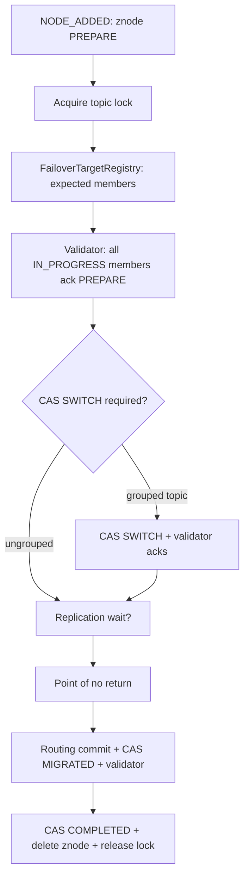
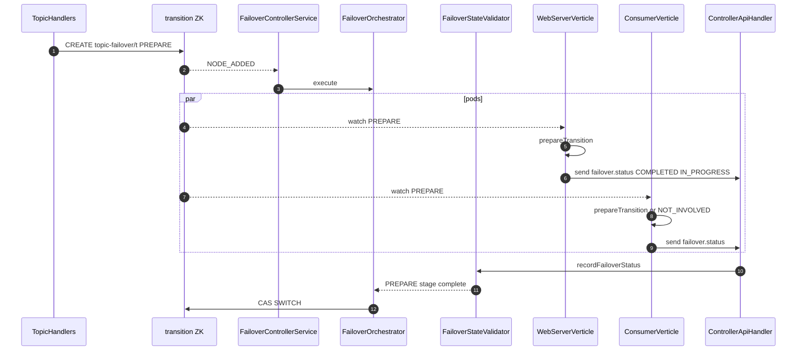

# Topic failover — OSS controller design (produce path)

| Field | Value |
|-------|-------|
| **Audience** | OSS Varadhi implementers |
| **Status** | Design spec for Phase 1 build |
| **Parent doc** | [`topic-failover-grooming.md`](topic-failover-grooming.md) (data model §3, producer §4) |
| **Reference port** | Oncall (`/Users/bandeep.kataria/Desktop/oncall`) — behavior validated in production; OSS adapts wire and packages |
| **OSS repo** | `varadhi/` under `/Users/bandeep.kataria/Desktop/oss` |

---

## 0. OSS design decision (summary)

| Concern | OSS choice |
|---------|------------|
| **Failover start** | Create a persistent ZK znode at `/varadhi/transitions/topic-failover/{topicFqn}` with `ProduceTransitionData.State = PREPARE` |
| **Stage signal (forward)** | Controller CAS-updates that znode (`PREPARE` → `SWITCH` → `MIGRATED` → `COMPLETED` / `ABORTED`) |
| **Who listens** | **Server** pods (`WebServerVerticle`) and **Consumer** pods (`ConsumerVerticle`) — both host produce paths (main topic vs IQ) |
| **Pod local work** | `TopicProduceTransitionService` (port from oncall) — pre-warm, block, resume, `NodeStatus` |
| **Stage complete (return)** | Pods **push** `FailoverTransitionStatusResponse` via existing `MessageExchange.send(ROUTE_CONTROLLER, "failover.status", …)` — same pattern as `ShardOpResponse` / `"update"` |
| **Stage gating** | `FailoverOrchestrator` + `FailoverStateValidator` on controller — waits until all **IN_PROGRESS** members ack before next CAS |
| **Routing commit** | At MIGRATED: `topicStore` + `subscriptionStore` updates (`regionConfigs`, IQ `produceIndexByRegion`) — see parent §3 |
| **Routine entity fan-out** | Existing `ResourceEventProcessor` — **not** used to coordinate failover stages |

**Not building for Phase 1:** per-stage `failover.prepare` / `failover.switch` P2P commands (parent doc Approach A).

---

## 1. End-to-end flow (OSS)

```text
Operator / auto-trigger
        │
        ▼
┌───────────────────┐     CREATE znode      ┌────────────────────────────────────┐
│ Web API           │ ───────────────────►  │ ZK: /varadhi/transitions/          │
│ TopicHandlers     │     PREPARE           │     topic-failover/{topicFqn}      │
└───────────────────┘                       └──────────────┬─────────────────────┘
                                                             │
              ┌──────────────────────────────────────────────┼──────────────────────────┐
              │ watch (CuratorCache)                         │ watch                    │ watch
              ▼                                              ▼                          ▼
     WebServerVerticle                               WebServerVerticle            ConsumerVerticle
     TopicProduceTransitionService                   (other Server members)       (IQ producers)
              │                                              │                          │
              │  local: prepare / block / resume             │                          │
              │                                              │                          │
              └──────────────────────┬───────────────────────┴──────────────────────────┘
                                     │ send failover.status (ResponseMessage path)
                                     ▼
                            ┌────────────────────┐
                            │ ControllerVerticle │
                            │ FailoverOrchestrator│◄── CAS next state when validator OK
                            │ FailoverStateValidator
                            └────────────────────┘
```

| Step | Component | Action |
|------|-----------|--------|
| 1 | `TopicHandlers` | Validate; `TopicFailoverStore.add(PREPARE)`; return 200 immediately |
| 2 | `FailoverControllerService` | `NODE_ADDED` on transition path → enqueue orchestration |
| 3 | Server + Consumer pods | ZK watch → `TopicProduceTransitionService.processEvent()` |
| 4 | Each participating pod | `ControllerFailoverClient.reportStatus(...)` after local work for current ZK state |
| 5 | `FailoverStateValidator` | Track acks per `(topicFqn, state, memberId)`; fail-fast on `ERRORED` / `FAILED` |
| 6 | `FailoverOrchestrator` | CAS next state; repeat until `COMPLETED` + delete znode |
| 7 | Orchestrator Phase 5 | `VaradhiTopicService` / `subscriptionStore` routing commit + CAS `MIGRATED` |

---

## 2. Two legs in OSS terms

### 2.1 Forward leg — ZK (not `ClusterMessage`)

Failover stages are **not** sent as `exchange.send(member, "failover.prepare", …)`.

| Item | OSS detail |
|------|------------|
| **Path** | `/varadhi/transitions/topic-failover/{topicFqn}` (new; not under `/varadhi/entities`) |
| **Store** | `TopicFailoverStore` in `metastore-zk` (new), separate from `ZKMetaStore` entity cache |
| **Watch** | Dedicated `CuratorCache` per role verticle, or shared helper `TransitionZkCache` |
| **Payload** | `TopicFailoverTransition` record (JSON or protobuf — match oncall fields) |

Why a separate ZK subtree: keeps transition coordination out of `VaradhiTopic` entity versioning and avoids `ResourceEventProcessor` treating each stage CAS as a full TOPIC UPSERT.

### 2.2 Return leg — `MessageExchange.send` (like shard ops)

Mirror **`ControllerConsumerClient.update`** → **`ControllerFailoverClient.reportStatus`**:

```java
// core/.../cluster/controller/ControllerFailoverClient.java  (NEW)
public CompletableFuture<Void> reportStatus(FailoverTransitionStatusResponse response) {
    return exchange.send(ROUTE_CONTROLLER, "failover.status", ClusterMessage.of(response));
}
```

Controller registration (extend `ControllerVerticle.setupApiHandlers`):

```java
messageRouter.sendHandler(ROUTE_CONTROLLER, "failover.status", handler::failoverStatus);
```

```java
// controller/.../ControllerApiHandler.java  (NEW method)
public void failoverStatus(ClusterMessage message) {
    FailoverTransitionStatusResponse r = message.getData(FailoverTransitionStatusResponse.class);
    controllerMgr.recordFailoverStatus(r).exceptionally(t -> {
        log.error("failover.status failed for {}: {}", r, t.getMessage());
        return null;
    });
}
```

**Oncall difference:** oncall **polls** HTTP `TopicProducerInfo`. OSS **push** avoids a new admin HTTP surface and reuses the same Vert.x bus pattern as subscription shard updates.

---

## 3. Wire contracts (OSS types to add)

### 3.1 ZK payload — `TopicFailoverTransition`

```java
// entities/.../cluster/TopicFailoverTransition.java  (NEW)
public record TopicFailoverTransition(
    String topicFqn,
    RegionName targetRegion,
    ProduceTransitionData.State state,
    boolean waitForReplicationLagToClear,
    AbortRequest abortRequest,   // optional
    int zkVersion                // transient, for CAS
) implements ProduceTransitionData { ... }
```

States: `PREPARE`, `SWITCH`, `MIGRATED`, `COMPLETED`, `ABORTED` (parent doc §5.4.1).

### 3.2 Pod → controller — `FailoverTransitionStatusResponse`

```java
// core/.../cluster/failover/FailoverTransitionStatusResponse.java  (NEW)
public record FailoverTransitionStatusResponse(
    String topicFqn,
    String memberId,                          // Varadhi member / host id
    MemberRole role,                          // SERVER | CONSUMER
    ProduceTransitionData.State reportedState, // must match ZK state pod finished
    TopicProduceTransitionContext.NodeStatus nodeStatus,
    Operation.State outcome,                  // COMPLETED | ERRORED (mirror ShardOperation.State usage)
    String errorMsg
) {}
```

Pod sends **after** `TopicProduceTransitionService` finishes handling the ZK state (success or failure).

#### 3.2.1 What each field means (and how it relates to the produce matrix)

Three **orthogonal** dimensions in one message:

| Field | Who owns truth | Meaning |
|-------|----------------|---------|
| `reportedState` | **Cluster** (ZK / controller) | “I have **finished applying** this global stage locally.” Must equal the controller’s **current** stage when the ack is accepted. |
| `nodeStatus` | **This pod** | “**Am I participating** in the failover on this JVM?” Drives produce allow/deny together with ZK state — see matrix below. |
| `outcome` | **This pod’s last step** | “Did **this ack’s work** succeed?” `COMPLETED` = step ok; `ERRORED` = step failed (like `ShardOperation` ack). **Not** the same as ZK `COMPLETED` / `ABORTED`. |

```text
         Cluster timeline (ZK)          Pod-local role              Result of this ack
         ─────────────────────          ──────────────              ───────────────────
reportedState: PREPARE | SWITCH | …     nodeStatus: NOT_INVOLVED     outcome: COMPLETED | ERRORED
               (one value)                    | IN_PROGRESS |
                                            FAILED | ERRORED
```

**Produce matrix** (parent doc §4.7.1) uses only **`reportedState` (as ZK state) + `nodeStatus`**. It does **not** use `outcome`; produce is gated while the transition znode exists.

| ZK state (`reportedState` while active) | `nodeStatus` | Produce on **existing** | Produce on **new** (target) |
|----------------------------------------|--------------|---------------------------|-----------------------------|
| `PREPARE`, `SWITCH`, `MIGRATED` | `NOT_INVOLVED` | N/A | **NO** |
| `COMPLETED`, `ABORTED` | `NOT_INVOLVED` | N/A | **YES** |
| `PREPARE`, `MIGRATED` | `IN_PROGRESS` | **YES** | **NO** |
| `SWITCH` | `IN_PROGRESS` | **NO** | **NO** |
| `COMPLETED`, `ABORTED` | `IN_PROGRESS` | **YES** | **YES** |
| *any* | `ERRORED` | **NO** | **NO** |
| `PREPARE`, `MIGRATED` | `FAILED` | **YES** | **NO** |
| `SWITCH` | `FAILED` | **NO** | **NO** |
| `COMPLETED`, `ABORTED` | `FAILED` | **YES** | **YES** |

**How the controller uses each field**

| Field | `FailoverStateValidator` | `FailoverOrchestrator` |
|-------|--------------------------|-------------------------|
| `reportedState` | Must match **current** stage; ignore stale acks (e.g. PREPARE ack after cluster already on SWITCH). | Advances ZK only when all **expected** members acked for **this** state. |
| `nodeStatus` | Only members in **expected set** (typically those that will be `IN_PROGRESS`) must ack to complete a stage. `NOT_INVOLVED` pods are not in the gate set. | If participating pod reports `FAILED` / `ERRORED` with bad `outcome`, abort policy applies. |
| `outcome` | `ERRORED` → fail stage / abort failover. `COMPLETED` → counts toward “all members ready.” | Same — does not advance on partial `ERRORED`. |

**Example acks (cluster at ZK `PREPARE`)**

| Pod | `reportedState` | `nodeStatus` | `outcome` | Controller | Produce here (matrix) |
|-----|-----------------|--------------|-----------|------------|------------------------|
| Server A (has topic producer) | `PREPARE` | `IN_PROGRESS` | `COMPLETED` | Counts toward stage done | Existing **YES**, new **NO** |
| Server B (no producer for topic) | `PREPARE` | `NOT_INVOLVED` | `COMPLETED` | Not in gate set | New **NO** (topic unavailable) |
| Server C (error building target) | `PREPARE` | `FAILED` | `ERRORED` | Abort failover | Existing **YES**, new **NO** (until terminal) |

**Example at ZK `SWITCH` (participating pod)**

| `reportedState` | `nodeStatus` | `outcome` | Produce |
|-----------------|--------------|-----------|---------|
| `SWITCH` | `IN_PROGRESS` | `COMPLETED` | **NO** / **NO** (blocked) |
| `SWITCH` | `IN_PROGRESS` | `ERRORED` | **NO** / **NO** + controller abort |

**Naming collision to avoid**

| Name | Scope |
|------|--------|
| `ProduceTransitionData.State.COMPLETED` | **Cluster** terminal — failover finished on ZK |
| `Operation.State.COMPLETED` in `outcome` | **This pod** finished the current **step** successfully |

Do not set `reportedState = COMPLETED` on a per-stage status ack; stage acks use `PREPARE` / `SWITCH` / `MIGRATED`. Cluster `COMPLETED` is written only by the controller when tearing down the znode.

### 3.3 REST — start failover

```http
POST /v1/projects/{project}/topics/{topic}/failover
Content-Type: application/json

{
  "toRegion": "hyd",
  "waitForReplicationLagToClear": true,
  "skipValidation": false
}
```

Response: `TopicFailoverTransition` snapshot (`state=PREPARE`, `zkVersion`, …).

Other routes: `GET …/failover`, `POST …/failover/abort` — see §12.

---

## 4. OSS deployment roles

From `VaradhiApplication.getComponentVerticles`:

| `MemberRole` | Verticle | Failover responsibilities |
|--------------|----------|---------------------------|
| **Controller** | `ControllerVerticle` | ZK listener on transition path; `FailoverOrchestrator`; `FailoverStateValidator`; REST via cluster request from Web |
| **Server** | `WebServerVerticle` | Watch transition ZK; run `TopicProduceTransitionService` for **main topic** produce; `reportStatus` |
| **Consumer** | `ConsumerVerticle` | Same watch + service for **IQ** (RQ/DLQ) producers on assigned shards |

A single JVM may run multiple roles; each role verticle that produces must register the transition listener and status client.

---

## 5. Controller components (OSS modules)

### 5.1 New / extended packages

| Module | Class | Responsibility |
|--------|-------|----------------|
| `metastore-zk` | `TopicFailoverStore` | CRUD + CAS on `/varadhi/transitions/topic-failover/*` |
| `metastore-zk` | `TransitionZkCache` | `CuratorCache` + listener adapter (pattern: `ZKMetaStore` event cache) |
| `entities` | `TopicFailoverTransition`, `ProduceTransitionData` | ZK + API payload |
| `core` | `FailoverTransitionStatusResponse`, `ControllerFailoverClient` | Return leg |
| `controller` | `FailoverControllerService` | ZK `NODE_*` → orchestrator worker pool (oncall `ProduceFailoverService`) |
| `controller` | `FailoverOrchestrator` | Phase machine §6 |
| `controller` | `FailoverStateValidator` | Await status acks per stage (replaces oncall HTTP poll) |
| `controller` | `FailoverTargetRegistry` | Map topic → expected `memberId`s (Server fleet + Consumers with IQ on topic) |
| `controller` | `ControllerApiMgr.recordFailoverStatus` | Merge ack into validator |
| `producer` | `TopicProduceTransitionService` | Port from oncall |
| `producer` | `ProduceTransitionListener` | ZK bytes → enqueue event |
| `web` | `TopicHandlers` | REST create / get / abort |

### 5.2 Reuse as-is (no change to semantics)

| Existing OSS | Use |
|--------------|-----|
| `MessageExchange.send` | Pod status return leg |
| `ControllerVerticle` + `MessageRouter.sendHandler` | Register `failover.status` |
| `ControllerApiHandler.update` pattern | Model `failoverStatus` handler |
| `OperationMgr` / `OpStore` | **Optional** audit parent op only (§11) |
| `ResourceEventProcessor` | Post-commit entity propagation only |
| `VaradhiTopicService` | Validated routing writes at MIGRATED |
| `AssignmentManager` | Discover Consumer members for IQ failover targets |

### 5.3 Prerequisites (other grooming work)

| Prerequisite | Doc |
|--------------|-----|
| `VaradhiTopic.regionConfigs`, `RegionConfig` | Parent §3 |
| `InternalCompositeSubscription.produceIndexByRegion` | Parent §3.8 |
| `TopicProduceTransitionContext` + produce matrix | Parent §4.7 |
| Producer pre-warm / `ProducerCacheKey` with region | Parent §4 |

Controller work can start in parallel once ZK store + transition types exist; routing commit needs data model landed.

---

## 6. `FailoverOrchestrator` — stage guide (OSS)

Runs on `FailoverControllerService` worker pool (do not block REST or Vert.x event loop).



| Phase | ZK write | Validator expects |
|-------|----------|-------------------|
| PREPARE | Already at create | Each target member: `reportedState=PREPARE`, `nodeStatus=IN_PROGRESS`, `outcome=COMPLETED` |
| SWITCH | CAS `SWITCH` | `reportedState=SWITCH`, produce blocked locally |
| MIGRATED | Routing commit + CAS `MIGRATED` | Active region = target; `reportedState=MIGRATED` |
| Done | Delete znode | Pods get `NODE_REMOVED` → `completeTransition()` |

**`NOT_INVOLVED` members:** must still ack PREPARE with `nodeStatus=NOT_INVOLVED` so controller knows they are intentionally excluded from gates — or registry excludes them and they do not block stage completion (product choice: recommend **exclude from expected set** if `NOT_INVOLVED`, same as oncall validator).

**Abort:** `TopicFailoverStore.requestAbort` → `NODE_UPDATED` → orchestrator checks between phases; before routing commit → `ABORTED` + delete znode.

---

## 7. Pod-side (Server + Consumer)

### 7.1 Startup wiring

**`WebServerVerticle.start`** (and **`ConsumerVerticle.start`**):

```text
1. TopicFailoverStore / TransitionZkCache from CoreServices or metastore provider
2. TopicProduceTransitionService(producerFactory, topicCache, …)
3. transitionZkCache.addListener(ProduceTransitionListener → enqueueEvent)
4. ControllerFailoverClient(messageExchange)
5. topicProduceTransitionService.startAsync()
```

### 7.2 Per ZK event

```text
ProduceTransitionListener
  → TopicProduceTransitionEvent(data, NEW|UPDATE|REMOVED)
  → TopicProduceTransitionService.processEvent()
       PREPARE  → prepareTransition(targetRegion)
       SWITCH   → block produce (shouldBlockProduce)
       MIGRATED → refresh topic from metastore; resume target producer
       REMOVED  → completeTransition()
  → controllerFailoverClient.reportStatus(FailoverTransitionStatusResponse)
```

### 7.3 Produce hot path

Unchanged from parent §4.7: consult `activeProduceTransition.get(topicFqn)` before `ProducerService` produce.

---

## 8. `FailoverStateValidator` (OSS — ack-based)

### 8.1 State held on controller

```java
// Per active failover (topicFqn):
Map<ProduceTransitionData.State, Map<String, FailoverTransitionStatusResponse>> acksByState;
Set<String> expectedMembers;  // from FailoverTargetRegistry at PREPARE start
```

### 8.2 `recordFailoverStatus(response)`

```text
1. Validate topic has active orchestration
2. Validate reportedState == current orchestrator state (ignore stale)
3. Put ack for memberId
4. If any outcome == ERRORED → fail failover
5. If |acks| == |expectedMembers| and all COMPLETED → complete waiting future
```

### 8.3 `awaitStageComplete(state, timeout)`

Called by orchestrator after CAS write; returns `CompletableFuture` completed by step 5 or timed out → `ABORTED`.

### 8.4 Target discovery — `FailoverTargetRegistry`

| Member | Include when |
|--------|----------------|
| All **Server** cluster members | Always (main topic produce may exist on any Server; refine later with topic-placement index if added) |
| **Consumer** members | Own a shard of a subscription on this topic whose IQ `produceIndexByRegion` will change |

Initial Phase 1: conservative — all Servers + all Consumers with assignment on topic (parent grooming `FailoverTargetSelector` logic).

---

## 9. Sequence — PREPARE with OSS push ack



---

## 10. ZK layout

```text
/varadhi/
  entities/          # existing ZKMetaStore / VaradhiTopic, SubOp, …
  transitions/       # NEW — coordination only
    topic-failover/
      {topicFqn}     # persistent; deleted on success
```

Add `ZNodeKind` or separate config key `topicFailoverTransitionPath` in controller / metastore config YAML.

**CAS:** use Curator `setData` with version; on `BadVersionException` reload and retry (`FailoverStateUpdater` port).

---

## 11. Optional: `OpStore` audit record

OSS may add a lightweight **`TopicFailoverOperation`** in `OpStore` for operator GET and `requeueInProgressOperations` — **without** `TopicPodOperation` children.

| Source of truth | Purpose |
|-----------------|---------|
| ZK transition znode | Stage execution |
| `TopicFailoverOperation` | Audit trail, correlation id, `requestedBy`, timestamps |

If both exist, orchestrator keys off **ZK**; op record updated when transition reaches terminal state.

---

## 12. REST surface (OSS)

Mount on `web/.../v1/admin/TopicHandlers.java`:

| Method | Handler | Backend |
|--------|---------|---------|
| `POST …/failover` | `initiateFailover` | `TopicFailoverStore.add(PREPARE)` |
| `GET …/failover` | `getFailover` | `TopicFailoverStore.get` |
| `POST …/failover/abort` | `abortFailover` | `TopicFailoverStore.requestAbort` |

Web → controller path for start (optional): mirror subscription flow via `ControllerRestClient.request(ROUTE_CONTROLLER, "failover.start", …)` if validation must run only on leader; otherwise Web can write ZK directly if it shares Curator access (prefer **leader-only write** via controller request to avoid split-brain).

**Recommended:** `VaradhiTopicService.requestFailover(...)` → `ControllerRestClient` → controller creates znode (same as `startSubscription`).

---

## 13. Bootstrap — `ControllerApiMgr`

Add `ControllerSubsystem` bootstrap (parent grooming §5.3):

```text
ControllerVerticle.onLeaderElected
  → controllerApiMgr.bootstrap(ctx)
       → FailoverControllerService.start(transitionZkCache, topicStore, …)
```

Do not register failover only inside `initializeEventSystem` without bootstrap hook — keeps ordering explicit.

---

## 14. Implementation stories (OSS)

| ID | Story | Module |
|----|-------|--------|
| OSS-C01 | `TopicFailoverTransition` + `ProduceTransitionData.State` | `entities` |
| OSS-C02 | `TopicFailoverStore` + ZK path + CAS | `metastore-zk` |
| OSS-C03 | `TransitionZkCache` + listener | `metastore-zk` |
| OSS-C04 | `FailoverTransitionStatusResponse` + `ControllerFailoverClient` | `core` |
| OSS-C05 | `TopicProduceTransitionService` + listener | `producer` |
| OSS-C06 | Wire Server: `WebServerVerticle` + status send | `web` / `server` |
| OSS-C07 | Wire Consumer: `ConsumerVerticle` + IQ produce path | `consumer` |
| OSS-C08 | `FailoverStateValidator` + `FailoverTargetRegistry` | `controller` |
| OSS-C09 | `FailoverOrchestrator` | `controller` |
| OSS-C10 | `FailoverControllerService` + ZK listener | `controller` |
| OSS-C11 | `ControllerApiHandler.failoverStatus` + `ControllerVerticle` registration | `controller` |
| OSS-C12 | `VaradhiTopicService.requestFailover` + REST | `web`, `core` |
| OSS-C13 | Routing commit in orchestrator (regionConfigs + IQ) | `controller`, `entities` |
| OSS-C14 | Tests: ZK CAS, ack aggregation, one happy-path integration | `controller`, `producer` |

---

## 15. Failure, restart, metrics

| Scenario | OSS behavior |
|----------|----------------|
| Pod miss status send | Validator timeout → `ABORTED` |
| Controller restart | Reload non-terminal znodes; resume orchestrator at persisted `state` or abort `state > PREPARE` (config flag) |
| Pod restart | `TopicProduceTransitionService` bootstrap: `TopicFailoverStore.listActive()` + re-enqueue |
| Stale status | Ignore if `reportedState != currentState` |
| Duplicate start | 409 if znode exists and not terminal |

Metrics (Micrometer): `varadhi_failover_transition_state`, `varadhi_failover_stage_duration_ms`, `varadhi_failover_member_ack_late_total`.

---

## 16. Oncall reference (porting guide)

Use oncall for **logic**, OSS for **wire**:

| Oncall | OSS equivalent |
|--------|----------------|
| `TopicFailoverDataService` | `TopicFailoverStore` |
| `ProducerZkCache` + `ProduceTransitionListener` | `TransitionZkCache` |
| `TopicProduceTransitionService` | Port with minimal API changes |
| `ProduceFailoverService` | `FailoverControllerService` |
| `FailoverOrchestrator` | Port phase logic |
| `ProducerStateValidator` (HTTP poll) | `FailoverStateValidator` (ack map) |
| `TopicProducerInfo` HTTP | `FailoverTransitionStatusResponse` send |
| `TopicFailoverResource` | `TopicHandlers` + `VaradhiTopicService` |

Oncall file index: parent doc Appendix B.

---

## 17. Open questions

1. Web writes ZK directly vs controller-only create via `failover.start` request?
2. Expected member set: all Servers vs topic-placed Servers only?
3. `NOT_INVOLVED` Consumer: required ack or excluded from registry?
4. OpStore audit op in Phase 1 or Phase 1.1?
5. JSON vs protobuf for transition znode (protobuf if oncall compatibility needed)?

---

## 18. Cross-references

| Topic | Location |
|-------|----------|
| Data model | [`topic-failover-grooming.md` §3](topic-failover-grooming.md) |
| Producer matrix | [§4.7](topic-failover-grooming.md) |
| Wire alternatives A/B | [§5.5](topic-failover-grooming.md) |
| LLD sketch | [`topic-failover-produce-lld.md`](topic-failover-produce-lld.md) |
