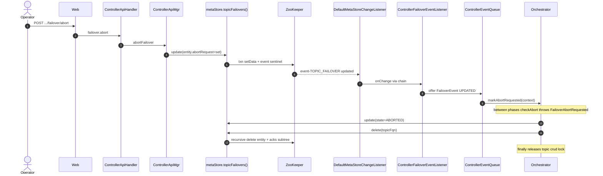
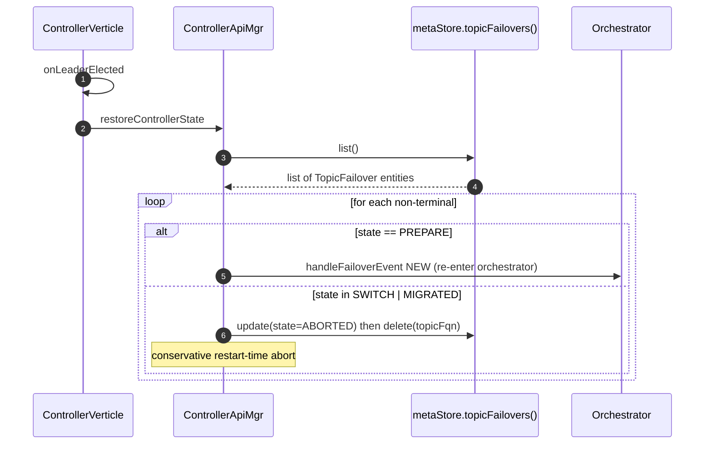

# Topic Failover (Produce Path) — Grooming Doc

> Self-contained design for **manual and auto topic failover** on the produce path in OSS Varadhi. Implementation style: **`TopicFailover` as a first-class L1 metastore entity** that reuses the existing entity-event broadcast pipeline (`DefaultMetaStoreChangeListener` → `ResourceEventProcessor` → per-pod `ResourceEventDispatcher` → `ResourceReadCache`), plus a controller-side orchestrator and per-host ack child znodes. Approach validated by the oncall production codebase; this document maps it onto the OSS Varadhi entity-event substrate (`varadhi/` under this workspace).

| Field | Value |
|-------|-------|
| Status | Ready for grooming |
| Scope | Produce path only (consumer-side / follow-the-producer is a separate workstream) |
| Phases | Phase 1: data model + producer rewiring + manual failover via REST. Phase 2: auto-failover trigger. |
| Components touched | `entities`, `metastore-zk`, `core`, `controller`, `producer`, `consumer`, `web`, `server` |

---

## 1. Goals and non-goals

### 1.1 Goals

1. Allow operators to fail over a topic's **active produce region** from region A to region B without dropping messages.
2. Block produce only for a **bounded** cutover window (during the SWITCH stage), not for the entire transition.
3. Make the orchestration **restart-resilient** — controller restart resumes or safely aborts in-flight transitions.
4. Apply the same coordination machinery to **main-topic** producers (Server pods) and **Retry/DLQ (IQ)** producers (Consumer pods).
5. Surface per-pod progress so operators can see exactly which pod is lagging.

### 1.2 Non-goals (Phase 1)

- Consumer-side region failover (changing where shards are consumed from).
- Auto-failover triggers (`Region.status`, error-rate thresholds) — Phase 2.
- Global / multi-region controller. Phase 1 is per-region.
- A new generic `ClusterJob` framework. Failover uses its own dedicated artifacts.

---

## 2. Terminology

| Term | Meaning |
|------|---------|
| **Region** | Deployment region (e.g. `ch`, `hyd`). Same as oncall "zone". |
| **`regionConfigs`** | New per-region map on `VaradhiTopic`: `Map<RegionName, RegionConfig>`. Carries `produceAllowed` (the only field failover writes) and `failOverRegion` (Phase 2 preference; Phase 1 unused). "Is this region replicated?" is **not** stored — it is derived from `internalTopics.containsKey(region)` (see §4.1.1). |
| **`produceIndex`** | **Existing** `int` field on `SegmentedStorageTopic` and `InternalCompositeSubscription` — picks which slot inside `storageTopics[]` / `storageSubscriptions[]` is the active produce slot. **Unchanged by failover** (region routing is done one level up; see §4.5). |
| **`internalTopics` (region routing)** | **Existing** `Map<String /*region*/, SegmentedStorageTopic>` on `VaradhiTopic`. This map is the only thing that needs region keys — `getProduceTopicForRegion(localRegion)` is how a pod picks the right `SegmentedStorageTopic`. |
| **`TopicFailover` (L1 entity)** | First-class metastore entity that drives a single topic's failover. Persisted at `/varadhi/entities/TopicFailover/{topicFqn}` via `metaStore.topicFailovers()`. Event sentinel at `/varadhi/events/event-TOPIC_FAILOVER-{topicFqn}-{seq}` triggers the existing entity-event broadcast pipeline. |
| **Ack subpath** | `/varadhi/entities/TopicFailover/{topicFqn}/acks/{hostname}` — per-host child znodes carrying `NodeStatus` JSON; written by pods, watched by `TopicFailoverAcksWatcher` on the controller. |
| **`ProduceTransitionData.State`** | The cluster-wide stage of the transition (a field on the `TopicFailover` entity). Values: `PREPARE`, `SWITCH`, `MIGRATED`, `COMPLETED`, `ABORTED`. |
| **`NodeStatus`** | This pod's local participation status (payload of the ack child znode): `NOT_INVOLVED`, `IN_PROGRESS`, `FAILED`, `ERRORED`. |
| **Orchestrator** | `TopicFailoverOrchestrator` — leader-controller component that guides stages; advances by `metaStore.topicFailovers().update(...)`. |
| **Acks watcher** | `TopicFailoverAcksWatcher` — `CuratorCache` scoped to the per-failover acks subpath; signals stage completion to the orchestrator (replaces in-memory `StateValidator`). |
| **Target set** | The members the orchestrator waits for in a given stage (typically all Servers + Consumers that own shards on the topic). |

---

## 3. Architecture at a glance

`TopicFailover` is modelled as a **first-class metastore entity (L1)** — same tier as `Topic`, `Subscription`, `Project`. Writes go through `metaStore.topicFailovers().{create,update,delete}(...)` which uses the existing `ZKMetaStore.updateTrackedZNodeWithData(...)` path. That single primitive gives us, for free:

- **Durability**: data lives at `/varadhi/entities/TopicFailover/<topic>` with CAS by ZK version.
- **Atomicity** with the event sentinel under `/varadhi/events/event-TOPIC_FAILOVER-<topic>-<seq>` (single Curator transaction).
- **Cluster-wide broadcast** via the existing `DefaultMetaStoreChangeListener` → `ResourceEventProcessor` → `MessageExchange.request` → per-pod `ResourceEventDispatcher` pipeline.
- **Per-pod local view** via `ResourceReadCache<TopicFailover>` registered in `ResourceReadCacheRegistry`.

The system still has **three planes**:

1. **Control plane** (Web + Controller leader) — receives the failover request, drives stage transitions by writing the L1 entity.
2. **Coordination plane** (ZooKeeper) — durable record of the current stage plus per-pod ack child znodes.
3. **Data plane** (Server + Consumer pods) — produce traffic; reacts to stage changes received via the existing entity-event bus pipeline, then writes ack child znodes back.

Two arrow styles encode the **two communication legs**:

- **Solid arrows** = direct calls (REST, bus request/send, ZK reads/writes).
- **Dotted arrows** = asynchronous notifications (Curator watches, bus deliveries, ack-completes-future signals).

```mermaid
flowchart TB
    Op(["Operator<br/>or Phase-2 auto trigger"]):::trigger

    subgraph CTRL_PLANE["① CONTROL PLANE"]
      direction TB

      subgraph Web["Web pod"]
        direction TB
        TH["TopicHandlers<br/>POST .../failover"]
        VTS["VaradhiTopicService"]
        CRC["ControllerRestClient"]
        TH --> VTS --> CRC
      end

      subgraph Leader["Leader Controller pod"]
        direction TB
        CH["ControllerApiHandler<br/>(bus inbox: failover.start<br/>+ failover.abort + failover.status)"]
        CAM["ControllerApiMgr"]
        TFStore["metaStore.topicFailovers()<br/>(L1 entity store)"]

        subgraph EventChain["entity-event chain (Curator cache thread)"]
          direction LR
          DEFL["DefaultMetaStoreChangeListener<br/>(case TOPIC_FAILOVER)"]
          CHN["ChainedResourceEventListener"]
          REP["ResourceEventProcessor<br/>(broadcast leg)"]
          CFL["ControllerFailoverEventListener<br/>(orchestrator leg)"]
          DEFL --> CHN
          CHN --> REP
          CHN --> CFL
        end

        EVQ["ControllerEventQueue"]
        ORC{{"TopicFailoverOrchestrator<br/>runs on Failover-* pool"}}

        subgraph Helpers["orchestrator helpers"]
          direction LR
          CMT["RoutingCommitter<br/>atomic flip"]
          VAL["TopicFailoverStateValidator<br/>(in-memory StageWaiter per fqn)"]
        end

        CH --> CAM
        CAM --> TFStore
        CAM -->|"recordFailoverStatus<br/>(on failover.status)"| VAL
        CFL --> EVQ
        EVQ -->|dispatch new / abort| ORC
        ORC -->|"update(stage) via L1 store"| TFStore
        ORC --> CMT
        ORC -->|"awaitStage(fqn, stage, targets)"| VAL
      end

      CRC -->|"exchange.request<br/>failover.start"| CH
    end

    ZK[("② ZooKeeper<br/>/varadhi/entities/TopicFailover/&#123;fqn&#125;<br/>+ /events/event-TOPIC_FAILOVER-*")]:::store

    subgraph DATA_PLANE["③ DATA PLANE"]
      direction LR

      subgraph Pod1["Server pod #1"]
        direction TB
        D1["ResourceEventDispatcher"]
        C1["TopicFailoverCache<br/>(ResourceReadCache)"]
        S1["TopicProduceTransitionService"]
        CFC1["ControllerFailoverClient"]
        PR1["ProducerService<br/>(matrix gate)"]
        D1 --> C1 --> S1 --> CFC1
        S1 --> PR1
      end

      subgraph Pod2["Server pod #N"]
        direction TB
        D2["ResourceEventDispatcher"]
        C2["TopicFailoverCache<br/>(ResourceReadCache)"]
        S2["TopicProduceTransitionService"]
        CFC2["ControllerFailoverClient"]
        PR2["ProducerService<br/>(matrix gate)"]
        D2 --> C2 --> S2 --> CFC2
        S2 --> PR2
      end

      subgraph Pod3["Consumer pod (IQ)"]
        direction TB
        D3["ResourceEventDispatcher"]
        C3["TopicFailoverCache<br/>(ResourceReadCache)"]
        S3["TopicProduceTransitionService"]
        CFC3["ControllerFailoverClient"]
        PR3["IQ ProducerService<br/>(matrix gate)"]
        D3 --> C3 --> S3 --> CFC3
        S3 --> PR3
      end
    end

    %% trigger
    Op ==>|"manual: REST"| TH
    Op -. "auto: in-controller<br/>trigger calls CAM" .-> CAM

    %% forward leg: controller write → ZK → event chain
    TFStore ==>|"updateTrackedZNodeWithData<br/>(entity + event sentinel in one txn)"| ZK
    CMT ==>|"txn: topic.regionConfigs<br/>+ failover MIGRATED"| ZK
    ZK -.->|"event-TOPIC_FAILOVER-* znode<br/>(CuratorCache forCreates)"| DEFL

    %% broadcast leg: controller → bus → pods
    REP ==>|"messageExchange.request<br/>ENTITY_EVENTS_HANDLER"| D1
    REP ==>|"messageExchange.request<br/>ENTITY_EVENTS_HANDLER"| D2
    REP ==>|"messageExchange.request<br/>ENTITY_EVENTS_HANDLER"| D3

    %% return leg: pods push status acks over the bus
    CFC1 ==>|"exchange.send<br/>failover.status<br/>FailoverTransitionStatus"| CH
    CFC2 ==>|"exchange.send<br/>failover.status<br/>FailoverTransitionStatus"| CH
    CFC3 ==>|"exchange.send<br/>failover.status<br/>FailoverTransitionStatus"| CH

    %% validator → orchestrator
    VAL -. "stage future<br/>completes" .-> ORC

    classDef trigger fill:#fde68a,stroke:#92400e,color:#000
    classDef store   fill:#fef3c7,stroke:#b45309,color:#000,stroke-width:2px
    classDef web     fill:#fae8ff,stroke:#a21caf,color:#000
    classDef leader  fill:#dbeafe,stroke:#1d4ed8,color:#000
    classDef pod     fill:#dcfce7,stroke:#15803d,color:#000

    class TH,VTS,CRC web
    class CH,CAM,TFStore,DEFL,CHN,REP,CFL,EVQ,ORC,CMT,VAL leader
    class D1,D2,D3,C1,C2,C3,S1,S2,S3,CFC1,CFC2,CFC3,PR1,PR2,PR3 pod

    style CTRL_PLANE fill:#f8fafc,stroke:#475569,color:#000
    style DATA_PLANE fill:#f0fdf4,stroke:#15803d,color:#000
    style Web   fill:#fdf4ff,stroke:#a21caf,color:#000
    style Leader fill:#eff6ff,stroke:#1d4ed8,color:#000
    style Helpers fill:#eef2ff,stroke:#4338ca,color:#000
    style EventChain fill:#eef2ff,stroke:#4338ca,color:#000
    style Pod1 fill:#f0fdf4,stroke:#15803d,color:#000
    style Pod2 fill:#f0fdf4,stroke:#15803d,color:#000
    style Pod3 fill:#f0fdf4,stroke:#15803d,color:#000
```



### Reading the diagram in six steps

| # | What happens | Components |
|---|--------------|------------|
| 1 | Operator (or Phase-2 auto trigger) requests a failover | `TopicHandlers` → `VaradhiTopicService` → `ControllerRestClient` → (bus) → `ControllerApiHandler` → `ControllerApiMgr` |
| 2 | `ControllerApiMgr` validates, takes the topic CRUD lock, and writes the L1 entity: `metaStore.topicFailovers().create(failover)` (stage = `PREPARE`). REST returns the op id. | `ControllerApiMgr` → `metaStore.topicFailovers()` → `ZKMetaStore.updateTrackedZNodeWithData(...)` |
| 3 | ZK transaction atomically creates the entity znode and the event sentinel. The controller leader's `CuratorCache` on `/varadhi/events` fires, `DefaultMetaStoreChangeListener` converts to `ResourceEvent<TopicFailover>` and hands it to the **chain**. | `ZK` → `CuratorCache` → `DefaultMetaStoreChangeListener` → `ChainedResourceEventListener` |
| 4 | Chain splits in two: the **broadcast leg** (`ResourceEventProcessor`) fans the event to every pod's `ResourceEventDispatcher` over the cluster bus; the **orchestrator leg** (`ControllerFailoverEventListener`) enqueues into `ControllerEventQueue` so a worker thread picks up the orchestrator. | `ChainedResourceEventListener` → `ResourceEventProcessor` + `ControllerFailoverEventListener` → `ControllerEventQueue` |
| 5 | On each pod, the dispatcher updates `TopicFailoverCache`, then `TopicProduceTransitionService` runs the stage-specific local work (pre-warm producers, block, unblock, etc.) and writes a per-host **ack znode** at `/varadhi/entities/TopicFailover/<topic>/acks/<host>`. | `ResourceEventDispatcher` → `TopicFailoverCache.onChange` → `TopicProduceTransitionService` → `ProducerService` + ack znode write |
| 6 | The controller's `TopicFailoverAcksWatcher` (a `CuratorCache` scoped to the acks subpath) notifies the orchestrator when the expected ack set is reached. The orchestrator advances the stage by calling `metaStore.topicFailovers().update(...)` — which re-enters the same chain at step 3 for the next stage. Phase-5 commit goes through `RoutingCommitter` in a single ZK transaction that updates topic `regionConfigs` and the failover stage atomically. | `TopicFailoverAcksWatcher` → `Orchestrator` → `metaStore.topicFailovers().update` (next stage) or `RoutingCommitter` (Phase 5) |

Two communication legs:

| Leg | Mechanism | Why |
|-----|-----------|-----|
| **Forward — stage signal** | Controller writes the L1 entity once; the existing entity-event pipeline (`DefaultMetaStoreChangeListener` → `ResourceEventProcessor` → bus → `ResourceEventDispatcher`) broadcasts to every pod and updates `TopicFailoverCache` everywhere | Reuses the proven entity-event substrate — no new broadcaster, no new pod-side watcher, no new bus route, no new cache type |
| **Return — stage complete** | Pod writes a small per-host child znode at `/varadhi/entities/TopicFailover/<topic>/acks/<host>` with `NodeStatus` JSON; controller's `TopicFailoverAcksWatcher` (`CuratorCache`) signals the orchestrator when the participant set is fully acked | Durable and restart-safe — a pod restart re-applies its ack write naturally; a controller restart re-reads existing ack children from ZK with no in-memory state to recover |

### What this design replaces from the legacy "transitions znode" design

| Component in earlier Approach-C draft | Status in L1 design | Reason |
|---|---|---|
| `TopicFailoverService` (creates / aborts a raw znode under `/varadhi/transitions/topic-failover/`) | **Removed** | Folded into one line in `ControllerApiMgr`: `metaStore.topicFailovers().create(...)` |
| `TopicFailoverZkWatcher` (controller-side `CuratorCache` on the transitions root) | **Removed** | Reuses the existing entity-event listener chain on `/varadhi/events/*` |
| `TopicFailoverBroadcaster` (per-stage fan-out, clone of `ResourceEventProcessor`) | **Removed** | The existing `ResourceEventProcessor` handles fan-out for any L1 `ResourceType`, including `TOPIC_FAILOVER` |
| `TransitionZkCache` + `TopicProduceTransitionListener` (per-pod direct ZK watch on transitions) | **Removed** | Replaced by the existing per-pod `ResourceEventDispatcher` routing to `TopicFailoverCache.onChange` |
| `StateValidator` (in-memory ack collector with cluster-bus replies) | **Removed** | Replaced by `TopicFailoverAcksWatcher` over ZK ack child znodes |
| Bus message `FailoverTransitionAck` (push from pod to controller) | **Removed** | Replaced by per-host ZK ack child znodes — uniform substrate, no in-memory state to lose |
| `ChainedResourceEventListener` (multiplexer over `ResourceEventListener<T>`) | **New (small)** | Lets the same metastore event drive both the broadcaster and the orchestrator leg |
| `ControllerFailoverEventListener` (filters `TOPIC_FAILOVER` and enqueues to `ControllerEventQueue`) | **New (small)** | Bridge from the entity-event chain to the orchestrator |
| `TopicFailoverAcksWatcher` (CuratorCache scoped to acks subpath) | **New (small)** | The only remaining bespoke ZK watcher; collects per-host completion acks for stage advancement |
| `TopicFailoverCache` = `ResourceReadCache<TopicFailover>` (registered in `ResourceReadCacheRegistry`) | **New (boilerplate)** | Same shape as `TopicCache`, `SubscriptionCache` — gives every pod a live in-memory view |

---

## 4. Data model changes (entities module)

### 4.1 `RegionConfig` (new)

`entities/src/main/java/com/flipkart/varadhi/entities/RegionConfig.java`

```java
@Value
@Builder(toBuilder = true)
public class RegionConfig {
    @Builder.Default boolean produceAllowed = true;
    // Default failover target for this region; nullable means "no preconfigured target".
    // Phase 1 (manual failover): unused — operator supplies toRegion in the REST request.
    // Phase 2 (auto-failover): consumed by the auto-trigger to decide the target region.
    String failOverRegion;
}
```

#### 4.1.1 Why no `isReplicated` flag (grooming feedback)

> **Feedback received:** *“Is `isReplicated` required, or can it be derived from anything?”*

It is **fully derivable**, so it is **not added**. The signal already exists in OSS today:

| Question | How to answer without `isReplicated` |
|----------|--------------------------------------|
| Does region R have a storage topic for this VaradhiTopic at all? | `varadhiTopic.getProduceTopicForRegion(R) != null` (i.e. `internalTopics.containsKey(R)`). `internalTopics` is the existing `Map<String /*region*/, SegmentedStorageTopic>` — see `entities/.../VaradhiTopic.java` line 18. |
| Is region R currently a valid failover target? | `internalTopics.containsKey(R)` **and** `R != currentSourceRegion`. The current source is whichever region has `regionConfigs[r].produceAllowed = true` today. |
| Is region R the active source right now? | `regionConfigs[R].produceAllowed == true`. (At most one region in this state in steady state — Phase 1 single-active model.) |
| Is region R a passive replica right now? | `internalTopics.containsKey(R)` **and** `regionConfigs[R].produceAllowed == false`. |

So `isReplicated` would always equal `internalTopics.containsKey(regionName)` — adding it as a field would create two sources of truth for the same fact and a class of bugs where the two diverge (e.g. forgetting to flip the flag when admin removes a region's storage topic, or vice-versa).

Cross-check: the oncall codebase also has no `isReplicated` field anywhere — confirming it has not been needed in production.

Implications for the rest of the doc:

- The failover validator's check *“is `toRegion` an eligible target?”* becomes `varadhiTopic.getProduceTopicForRegion(toRegion) != null && !toRegion.equals(fromRegion)`.
- The `TopicFailoverTargetRegistry` and pod-side allowance matrix don't need any change — neither was reading `isReplicated`.
- Backfill (§4.6) drops one default field per region.

### 4.2 `VaradhiTopic` — add region policy

Add (alongside existing `internalTopics`, kept for backward read):

```java
private Map<String, RegionConfig> regionConfigs;   // keyed by region name
private boolean                   autoFailover;     // Phase 2 trigger gate
```

Versioning rule: any update to `regionConfigs` or `autoFailover` bumps `version` so `ResourceReadCache` propagates.

### 4.3 `SegmentedStorageTopic` — no change (grooming feedback)

> **Feedback received:** *“`Map<String, producerIdx>` is not required — it could only be a `produceIdx` field.”*

Earlier drafts proposed adding `Map<String /*region*/, Integer> produceIndexByRegion` to `SegmentedStorageTopic`. That addition is **dropped**: it duplicates region routing that already exists at a higher level.

Why no change is needed (grounded in the current code):

| Layer | Where region routing actually happens |
|-------|---------------------------------------|
| `VaradhiTopic.internalTopics: Map<String /*region*/, SegmentedStorageTopic>` | **This is the region map.** `VaradhiTopic.getProduceTopicForRegion(localRegion)` returns the right `SegmentedStorageTopic` for the pod's region. (See `entities/.../VaradhiTopic.java` lines 18, 160-161 and the call site in `producer/.../ProducerService.java` line 208.) |
| `SegmentedStorageTopic.produceIndex: int` | **Not a region pointer.** Picks which slot inside that one region's `storageTopics[]` is the produce slot. Today always `0`; reserved for future partition-growth scenarios (per the class javadoc: *“adding additional storage topics … without affecting ordering”*). |

Consequence for failover: failover does **not** touch `SegmentedStorageTopic` at all. The class stays exactly as it is today:

```java
private final StorageTopic[] storageTopics;
private final int            activeStorageTopicId;
private final int            produceIndex;            // unchanged, plain int
private       TopicState     topicState;

@JsonIgnore
public StorageTopic getTopicToProduce() {            // unchanged
    return storageTopics[produceIndex];
}
```

Stories F-02 (extending `SegmentedStorageTopic`) and the related backfill work in F-01 are **removed** from §13.

### 4.4 `InternalCompositeSubscription` — no change (grooming feedback)

Same reasoning. Each `InternalCompositeSubscription` is constructed per-region at subscription-creation time (`VaradhiSubscriptionFactory.getInternalSub(...)` builds the composite from the local-region storage topic and calls `InternalCompositeSubscription.of(ss, queueType)` with a single-slot array — see `core/.../VaradhiSubscriptionFactory.java` lines 353-385). The consumer that produces to RQ / DLQ in region B uses **region B's own composite**, not a cross-region slot inside region A's composite.

So the class stays as is:

```java
private final InternalQueueType queueType;
private StorageSubscription<? extends StorageTopic>[] storageSubscriptions;
private int produceIndex;        // unchanged, plain int
private int consumeIndex;

@JsonIgnore
public StorageTopic getTopicForProduce() {           // unchanged signature
    if (queueType.getCategory() == InternalQueueCategory.MAIN) {
        throw new IllegalArgumentException("Main Subscription does not have a topic to produce");
    }
    return storageSubscriptions[produceIndex].getStorageTopic();
}
```

Story F-03 is **removed** from §13.

### 4.5 What failover actually changes on entities

Net entity diff for the whole failover feature is two L1 entities — a small **policy field** on `VaradhiTopic`, and a brand-new **`TopicFailover` L1 entity** that drives the coordination:

| Entity | What failover writes | What failover does NOT write |
|--------|----------------------|-----------------------------|
| `VaradhiTopic` | `regionConfigs[fromRegion].produceAllowed = false` and `regionConfigs[toRegion].produceAllowed = true` (Phase 5 commit). Version bumps so `ResourceReadCache<VaradhiTopic>` propagates. | `internalTopics`, `regionConfigs[*].failOverRegion` (unless explicitly changed by an admin). No `isReplicated` field exists — see §4.1.1. |
| `TopicFailover` (new L1 entity, §4.7) | The transition state machine, advanced through `metaStore.topicFailovers().update(...)`. Every update goes through `ZKMetaStore.updateTrackedZNodeWithData(...)`, which creates an event sentinel atomically and triggers the existing entity-event broadcast pipeline (see §3). Version bumps so `ResourceReadCache<TopicFailover>` propagates on every pod. | The `acks/` subtree under the failover znode — those are written by **pods**, not the controller (see §4.8). |
| `SegmentedStorageTopic` | nothing | `produceIndex` (kept for partition-growth) |
| `VaradhiSubscription` / `InternalCompositeSubscription` | nothing | `produceIndex`, `consumeIndex` |

So the pod-side produce path becomes:

```text
1. pod looks up its own region's SegmentedStorageTopic
   internalTopic = varadhiTopic.getProduceTopicForRegion(localRegion)        // existing

2. policy gate: is region allowed to produce right now? (reads VaradhiTopic L1 cache)
   if (!varadhiTopic.regionConfigs.get(localRegion).produceAllowed) reject

3. failover stage gate: does an in-flight TopicFailover currently disallow produce?
   failover = topicFailoverCache.getLatest(topic.getName())                  // L1 read cache
   ctx      = transitionService.getContext(topic.getName())                  // pod-local NodeStatus
   if (failover != null && !ProduceAllowanceMatrix.check(failover.state(),
                                                         ctx.nodeStatus(),
                                                         ProducingOn.EXISTING).allowed())
       reject

4. pick storage topic and produce (unchanged)
   storageTopic = internalTopic.getTopicToProduce()                          // existing
```

Step 2 alone is what makes a failover stick after Phase 5; step 3 is what holds produce during the SWITCH window of an in-flight transition. Both reads are pure in-memory lookups against the per-pod `ResourceReadCache`s — no ZK calls on the produce hot path. Neither needs a per-region map inside `SegmentedStorageTopic`.

### 4.6 Backfill

Net backfill list shrinks to one item:

- Old `VaradhiTopic` without `regionConfigs`: deserializer builds `{ r: RegionConfig(produceAllowed=true, failOverRegion=null) for r in internalTopics.keySet() }`. (Existing regions are inferred from `internalTopics`, which is the source of truth for "this topic has a storage topic in region r" — see §4.1.1.)

Backfill happens on read; rewrite to ZK on the first `update()` only (so version goes up exactly once per entity).

No backfill is needed for `SegmentedStorageTopic`, `InternalCompositeSubscription`, or `TopicFailover` (the latter is a brand-new entity type that simply does not exist on legacy data).

### 4.7 `TopicFailover` (new L1 entity)

`entities/src/main/java/com/flipkart/varadhi/entities/TopicFailover.java` — extends `MetaStoreEntity` (gets `name` + CAS `version` for free, same as `VaradhiTopic`, `VaradhiSubscription`, `Project`).

```java
@Getter
public class TopicFailover extends MetaStoreEntity {

    private final String  fromRegion;
    private final String  toRegion;
    private final boolean waitForReplicationLagToClear;
    private final String  requestedBy;
    private final long    startTimeMs;

    @Setter
    private ProduceTransitionData.State state;     // PREPARE | SWITCH | MIGRATED | COMPLETED | ABORTED
    @Setter
    private AbortRequest                abortRequest;   // nullable; set on abort

    public TopicFailover(@JsonProperty("name") String topicFqn, /* + others */) {
        super(topicFqn, /* initialVersion */ 0);
        ...
    }
}
```

Cross-cutting wiring this adds (covered in §8 and the §3 diagram):

| Hook | What |
|------|------|
| `MetaStoreEntityType.TOPIC_FAILOVER` | New enum value; consumed by `DefaultMetaStoreChangeListener.onEvent` |
| `ResourceType.TOPIC_FAILOVER` | New enum value; consumed by `ResourceEventDispatcher` to route to the right listener |
| `Resource.EntityResource` `@JsonSubTypes` | New entry mapping `TOPIC_FAILOVER` to `TopicFailover.class` so the entity rides the existing `ResourceEvent<Resource>` envelope |
| `MetaStore.topicFailovers()` | New typed sub-store; `VaradhiMetaStore` (zk impl) returns a `TopicFailoverStoreImpl` backed by `ZKMetaStore.{createTrackedZNodeWithData, updateTrackedZNodeWithData, getZNodeDataAsPojo, deleteZNode, listChildren}` |
| `ResourceReadCacheRegistry.register(ResourceType.TOPIC_FAILOVER, ...)` on every pod | Hands the dispatcher a `ResourceReadCache<TopicFailover>` (henceforth `TopicFailoverCache`) |

The data model surface for failover is exactly:

- one `RegionConfig` value type (§4.1),
- one new `regionConfigs` field on `VaradhiTopic` (§4.2),
- one new L1 entity `TopicFailover` (this section),

plus a small new sub-package for the state enum and ack-note shape (§5).

### 4.8 Ack subpath under the `TopicFailover` znode

When a pod has applied a stage locally, it writes a per-host child znode under the failover entity. This is the return-leg substrate that replaces the bus-based status push of earlier drafts.

```text
/varadhi/entities/TopicFailover/{topicFqn}/
                                acks/
                                  {hostname-1}     ← persistent; body = AckNote JSON
                                  {hostname-2}
                                  ...
```

`AckNote` (lives next to `TopicFailover`):

```java
@Value
@Builder
public class AckNote {
    String                                       hostname;
    ComponentKind                                role;          // Server | Consumer
    ProduceTransitionData.State                  reportedStage; // which stage this ack is for
    TopicProduceTransitionContext.NodeStatus     nodeStatus;
    Operation.State                              outcome;       // COMPLETED | ERRORED
    String                                       errorMsg;      // nullable
    long                                         appliedAtMs;
}
```

Lifecycle:

- The ack subpath is **created lazily** by `TopicFailoverStore` when the entity is created (the same way `OpStoreImpl.ensureEntityTypePathExists()` pre-creates `/varadhi/entities/SubOperation` and `/varadhi/entities/ShardOperation`).
- Pods write `acks/<hostname>` via `setData()` (idempotent — first write creates, subsequent writes update with the latest stage; we never have two notes for the same hostname).
- The controller's `TopicFailoverAcksWatcher` is a `CuratorCache` scoped to the per-failover `acks/` subpath, instantiated when the orchestrator starts a stage and closed when the stage completes.
- The whole subtree is **deleted as part of `metaStore.topicFailovers().delete(topicFqn)`** at the end of the failover (a single `transactionalDelete` of the entity znode + all `acks/*` children — same primitive as `ZKMetaStore.deleteZNode` extended to recursive delete; pattern already used elsewhere).

This is the **only bespoke ZK structure** the failover feature adds beyond what the L1 entity gives for free.

---

## 5. Failover state model

### 5.1 Where the state lives

Earlier drafts had a stand-alone `TopicFailoverTransition` JSON payload stored in a custom znode. In the L1 design that payload **is** the entity — the `TopicFailover` class from §4.7. There is no separate "transition payload": the orchestrator advances stages by calling `metaStore.topicFailovers().update(entity)`, and ZK CAS by version is provided by the `MetaStoreEntity` superclass (the `version` field).

What was a `transition.state` enum on the payload is now a `state` field on the `TopicFailover` entity (see the class snippet in §4.7). What was an `AbortRequest` nested type is now a nullable `abortRequest` field on the entity. Everything else (`fromRegion`, `toRegion`, `requestedBy`, `startTimeMs`, `waitForReplicationLagToClear`) is also a field on the entity.

### 5.2 `ProduceTransitionData.State`

`entities/src/main/java/com/flipkart/varadhi/entities/transitions/ProduceTransitionData.java`

```java
public interface ProduceTransitionData {
    enum State {
        PREPARE,    // pods pre-warm target-region producer; traffic still on source
        SWITCH,     // pods block all new produce while pointer flips
        MIGRATED,   // pods resume produce on target; old producer drains
        COMPLETED,  // terminal success
        ABORTED;    // terminal failure / honored abort

        public boolean isTerminal()       { return this == COMPLETED || this == ABORTED; }
        public boolean isProduceBlocked() { return this == SWITCH;    }
    }
    String getTopicFqn();      // implemented by TopicFailover (returns the entity name)
    State  getState();         // implemented by TopicFailover (returns the entity field)
}
```

`TopicFailover implements ProduceTransitionData` so that the orchestrator, the broadcaster, and the matrix gate can all consume the same lightweight interface and stay decoupled from `MetaStoreEntity` plumbing.

The state machine:

```text
PREPARE ──acks complete──▶ SWITCH ──acks complete──▶ [replication wait?] ──▶ MIGRATED ──acks complete──▶ COMPLETED
                                                                                                              │
                                                                                                  delete entity ▼

(any non-terminal) ──failure or honored abort──▶ ABORTED ──▶ delete entity
```

"Acks complete" is now defined by **`TopicFailoverAcksWatcher`** observing the ack subpath (§4.8 / §8.5), not by a push receiver. Every stage transition is a `metaStore.topicFailovers().update(...)`, which rides the existing entity-event broadcast pipeline (§3 / §8) so every pod is notified.

### 5.3 Pod-local context — `TopicProduceTransitionContext`

`core/src/main/java/com/flipkart/varadhi/core/transitions/TopicProduceTransitionContext.java`

The per-pod in-memory bookkeeping that the pod-side service holds while a failover is in flight. It joins the cluster-wide stage (read from `TopicFailoverCache`) with the pod's local participation status. Same shape as before — only the reference type changes:

```java
public record TopicProduceTransitionContext(
    TopicFailover failover,        // L1 entity snapshot from TopicFailoverCache
    NodeStatus    nodeStatus
) {
    public enum NodeStatus {
        NOT_INVOLVED,  // not a target on this pod (no producer for this topic on this JVM)
        IN_PROGRESS,   // participating; controller waits for this pod's ack znode
        FAILED,        // local handler threw on the current stage
        ERRORED        // unexpected/repeated failure; produce stays blocked
    }
}
```

The `NodeStatus` value is also the body of the pod's ack znode (`AckNote.nodeStatus`, see §4.8): the pod publishes its local status both into its own context and into the per-host child znode, so the controller can read it without an in-memory RPC.

### 5.4 Produce allowance matrix (gates `ProducerService.produceToValidTopic`)

| `TopicFailover.state` (from cache) | `NodeStatus` (pod-local) | Produce on **existing** producer | Produce on **new** (target) producer |
|------------------------------------|--------------------------|----------------------------------|--------------------------------------|
| `PREPARE`, `SWITCH`, `MIGRATED`    | `NOT_INVOLVED`           | N/A                              | **NO**                               |
| `COMPLETED`, `ABORTED`             | `NOT_INVOLVED`           | N/A                              | **YES**                              |
| `PREPARE`, `MIGRATED`              | `IN_PROGRESS`            | **YES**                          | **NO**                               |
| `SWITCH`                           | `IN_PROGRESS`            | **NO**                           | **NO**                               |
| `COMPLETED`, `ABORTED`             | `IN_PROGRESS`            | **YES**                          | **YES**                              |
| *any*                              | `ERRORED`                | **NO**                           | **NO**                               |
| `PREPARE`, `MIGRATED`              | `FAILED`                 | **YES**                          | **NO**                               |
| `SWITCH`                           | `FAILED`                 | **NO**                           | **NO**                               |
| `COMPLETED`, `ABORTED`             | `FAILED`                 | **YES**                          | **YES**                              |

Notes:

- **`NOT_INVOLVED`** means "I do not have/need a producer for this topic on this JVM." Controller does not wait for it; locally we reject produce to the target producer until the failover entity is deleted (which the dispatcher will surface as `EventType.INVALIDATE` on the cache).
- Only **SWITCH** blocks produce globally for participating pods.
- The matrix is a **pure function** evaluated on the produce hot path; both inputs come from in-memory state (`TopicFailoverCache.getLatest(topic)` and the per-pod `TopicProduceTransitionService.getContext(topic).nodeStatus()`). No ZK or bus call.

---

## 6. ZooKeeper layout

Failover adds **no custom ZK roots**. It piggybacks on the existing entity-event substrate; the only new node kinds are a normal L1 entity znode (managed by `TopicFailoverStore` → `ZKMetaStore.updateTrackedZNodeWithData(...)`) and a small ack subtree.

```text
/varadhi/
  entities/
    Topic/                                  # existing
    Subscription/                           # existing
    Project/                                # existing
    SubOperation/                           # existing (OpStore)
    ShardOperation/                         # existing (OpStore)
    TopicFailover/                          # NEW — L1 entity
      {topicFqn}                            # persistent; entity JSON; CAS by version
        acks/                               # persistent; lazily created on entity create
          {hostname-1}                      # persistent; body = AckNote JSON (§4.8)
          {hostname-2}
          ...
  events/                                   # existing
    event-TOPIC-foo-0001                    # existing flavour
    event-SUBSCRIPTION-bar-0002             # existing flavour
    event-TOPIC_FAILOVER-foo-0003           # NEW flavour, same mechanism
    ...
```

Properties (each one inherited from the existing tracked-write path, not invented for failover):

| Path | Created by | Lifecycle | Triggers |
|------|------------|-----------|----------|
| `/varadhi/entities/TopicFailover/{topicFqn}` | `ZKMetaStore.createTrackedZNodeWithData(..., TOPIC_FAILOVER)` — atomic Curator txn with the event sentinel | Created at `metaStore.topicFailovers().create(...)`; updated at every stage advance via `update(...)`; deleted at terminal (`COMPLETED` / `ABORTED`) via `metaStore.topicFailovers().delete(topicFqn)` | Each create / update / delete posts a `/varadhi/events/event-TOPIC_FAILOVER-{topicFqn}-{seq}` znode in the **same transaction** — picked up by `DefaultMetaStoreChangeListener` (controller leader's Curator cache on the events root) which then drives both the broadcast pipeline and the orchestrator chain (§3 / §8) |
| `/varadhi/entities/TopicFailover/{topicFqn}/acks/` | Pre-created by `TopicFailoverStore.create(...)` so child writes never need `creatingParentsIfNeeded` | Subtree deleted when the parent entity is deleted at terminal | — (parent znode) |
| `/varadhi/entities/TopicFailover/{topicFqn}/acks/{hostname}` | Pod-side `TopicProduceTransitionService` after applying a stage locally | `setData()` overwrite per hostname (one note per host); subtree GC'd at terminal | Picked up by the controller's `TopicFailoverAcksWatcher` (`CuratorCache` scoped to this subpath, instantiated per active failover) — fires `onChange` for the orchestrator's stage-completion gate |
| `/varadhi/events/event-TOPIC_FAILOVER-*` | Same Curator txn as the entity write (above) | Deleted by `DefaultMetaStoreChangeListener` after every participant has acked the broadcast (existing committer logic) | The existing `ResourceEventProcessor` broadcast pipeline; not specific to failover |

No new YAML knobs are introduced for ZK paths. The entity path comes from the existing `ZNode.ofEntityType(MetaStoreEntityType.TOPIC_FAILOVER)` derivation (same code path as `Topic`, `Subscription`, etc.); the ack subpath is built by `ZNode.ofTopicFailoverAcks(topicFqn)`, which composes the entity path + `/acks`. The only new constant is the `MetaStoreEntityType.TOPIC_FAILOVER` enum entry (see §4.7).

CAS: every entity update goes through `ZKMetaStore.updateTrackedZNodeWithData(...)` which uses `setData().withVersion(dataObject.getVersion())` — the same `BadVersionException` → `InvalidOperationForResourceException` handling that topic / subscription updates already use today. `TopicFailoverStore.update(...)` wraps this with a small retry that re-reads and re-applies (encapsulating what was previously `TopicFailoverStateUpdater`).

---

## 7. Producer side (Server and Consumer)

Both **Server** (main-topic produce) and **Consumer** (IQ produce) verticles need:

1. A `ResourceReadCache<TopicFailover>` (called `TopicFailoverCache`) wired into the existing per-pod `ResourceEventDispatcher` for `ResourceType.TOPIC_FAILOVER`.
2. A pod-side `TopicProduceTransitionService` that reacts to cache change events, runs stage-specific local work, and **writes an ack znode** under the failover entity (§4.8).
3. A small chained side-effect listener so cache.onChange also triggers the transition service.

No pod-side `CuratorCache` on a custom path. No pod-side `MessageRouter` route for failover. No pod-side bus client to the controller. Everything pods do flows through the existing entity-event substrate plus ZK ack writes.

### 7.1 Wiring on pod start — one place, three components

`producer/src/main/java/com/flipkart/varadhi/produce/failover/TopicFailoverWiring.java` (helper invoked from `WebServerVerticle` / `ConsumerVerticle` after `MessageExchange` and `ResourceReadCacheRegistry` are constructed):

```java
public static void wire(
    Vertx vertx,
    MemberInfo memberInfo,
    VaradhiClusterManager clusterManager,
    ResourceReadCacheRegistry cacheRegistry,
    CuratorFramework zkCurator,
    MetaStore metaStore,
    ProducerService producerService,
    ProducerFactory producerFactory
) {
    // 1. Per-pod cache for the new L1 entity.
    ResourceReadCache<TopicFailover> failoverCache =
        ResourceReadCache.create(ResourceType.TOPIC_FAILOVER, metaStore.topicFailovers()::list);

    // 2. Pod-side service that does the actual stage-specific work + writes ack znodes.
    TopicProduceTransitionService transitionSvc = new TopicProduceTransitionService(
        memberInfo,
        producerFactory,
        producerService,
        cacheRegistry.getCache(ResourceType.TOPIC),
        new TopicFailoverAckWriter(zkCurator)        // wraps setData() on acks/{hostname}
    );

    // 3. Register a chained listener so the dispatcher fans cache + transitionSvc.
    cacheRegistry.register(
        ResourceType.TOPIC_FAILOVER,
        ChainedResourceEventListener.of(failoverCache, transitionSvc::onChange)
    );

    // 4. Hook up the cluster-bus dispatcher (existing call) — it now also routes TOPIC_FAILOVER.
    ResourceEventDispatcher.bindToClusterEntityEvents(vertx, memberInfo, clusterManager, cacheRegistry);

    // 5. Bootstrap: hydrate any in-flight failovers we missed while the pod was down.
    metaStore.topicFailovers().list().forEach(transitionSvc::hydrateFromCache);
}
```

Key change vs. earlier drafts: the cache **is** the watcher. The dispatcher already delivers `EventType.UPSERT` (create / update) and `EventType.INVALIDATE` (delete) events for every L1 entity; failover gets it for free. `cacheRegistry.register(...)` accepts a chained listener so the cache update and the transition service both observe the same event — see the new `ChainedResourceEventListener` documented in §8.1.

### 7.2 `TopicProduceTransitionService`

`producer/src/main/java/com/flipkart/varadhi/produce/failover/TopicProduceTransitionService.java`

Single-threaded queue processor per pod (`ConcurrentHashMap<String /*topicFqn*/, TopicProduceTransitionContext> activeTransitions`). Driven by `onChange(ResourceEvent<TopicFailover>)` from the dispatcher:

```text
onChange(event):
  topicFqn = event.resourceName()

  if event.operation == INVALIDATE:          // entity deleted ⇒ failover ended
    completeTransition(topicFqn)             // clear context, drop pre-warm producer if any
    return

  failover = event.resource().getEntity()    // L1 entity snapshot
  ctx      = activeTransitions.get(topicFqn)
  switch failover.state:
    case PREPARE:
      if pod has a producer for this topic OR will need one for toRegion:
        prepareTransition(failover.toRegion)   // pre-warm target Producer
        nodeStatus = IN_PROGRESS
      else:
        nodeStatus = NOT_INVOLVED

    case SWITCH:
      // matrix already blocks produce on observation of state=SWITCH; context-only update
      apply(failover, SWITCH)

    case MIGRATED:
      refreshTopicCache(topicFqn)            // pull latest VaradhiTopic; regionConfigs flipped
      resumeOnTarget(topicFqn, failover.toRegion)
      apply(failover, MIGRATED)

    case COMPLETED | ABORTED:
      completeTransition(topicFqn)           // cleanup; old producer drains in background

  // Return leg — write our ack znode for this stage
  ackWriter.write(topicFqn, AckNote.builder()
      .hostname(memberInfo.hostname())
      .role(memberInfo.primaryRole())
      .reportedStage(failover.state)
      .nodeStatus(nodeStatus)
      .outcome(localOutcome)                 // COMPLETED on happy path; ERRORED on throw
      .errorMsg(maybeErr)
      .appliedAtMs(System.currentTimeMillis())
      .build());
```

Properties:

- **Idempotent**: the handler always reads the latest entity from the event payload (the dispatcher's `ResourceEventDispatcher.convertResource(...)` already deserialises the incoming `ResourceEvent<TopicFailover>` from JSON). Replays produce the same end state.
- **Hot-path safe**: `apply(...)` updates only an in-memory `ConcurrentHashMap`; produce continues to read `getContext(topicFqn)` lock-free.
- **Ack writes use `setData()`, not `create()`**, so re-running a stage (e.g. after a pod restart picks up the entity from `TopicFailoverCache.list()`) is a no-op overwrite — the controller's `TopicFailoverAcksWatcher` sees the same ack content for the same stage and counts it once.

The service also exposes `shouldBlockProduce(topicFqn)` — a sugar wrapper around `ProduceAllowanceMatrix.check(...)` used by `ProducerService`.

### 7.3 `ProducerService` hot path

`producer/.../ProducerService.produceToValidTopic` gains a gate at the top:

```java
TopicProduceTransitionContext ctx = transitionService.getContext(topic.getName());
if (ctx != null) {
    ProduceAllowance allow = ProduceAllowanceMatrix.check(
        ctx.failover().getState(),
        ctx.nodeStatus(),
        ProducingOn.EXISTING                 // current request always hits the existing slot
    );
    if (!allow.allowed()) {
        return CompletableFuture.completedFuture(
            ProduceResult.ofUnavailable(message.getMessageId(), allow.reason()));
    }
}
```

For pre-warmed target producers, the resolution stays in the **outer region map**: `varadhiTopic.getProduceTopicForRegion(targetRegion).getTopicToProduce()`. There is no per-region index inside `SegmentedStorageTopic` — see §4.3 / §4.5 for why a single `produceIndex` plus the existing `internalTopics` region map is sufficient.

### 7.4 Bootstrap on pod start — why it's needed even with the cache

> *"Why is this required if the cache subscribes to live changes anyway?"*

Two reasons, both already handled by step (5) in §7.1:

1. **Catch-up after downtime.** A pod that was restarted while a failover was mid-flight needs to observe the **current** stage immediately on boot. The cluster-bus broadcast only carries *new* events; entity state for events that were processed while this pod was offline lives only in ZK. `metaStore.topicFailovers().list()` (which under the hood does `ZKMetaStore.listChildren(ZNode.ofEntityType(TOPIC_FAILOVER))` + per-child `getZNodeDataAsPojo(...)`) pulls every in-flight failover, and `transitionSvc.hydrateFromCache(failover)` runs the same `onChange` handler as if a live event had arrived. This is the L1 analog of the legacy `store.listAll().forEach(svc::initializeFromZk)` pattern.
2. **Re-emit pod's ack on restart.** If the pod had already applied the current stage before its restart, the ack znode `acks/<hostname>` is still in ZK from the previous JVM — but the controller may have advanced to a later stage in the meantime. Re-running `onChange` after hydration produces a fresh ack note with the **current** `reportedStage`, which the `TopicFailoverAcksWatcher` accepts (the watcher gates on `reportedStage == orchestrator's expected stage`; stale notes are ignored, see §8.5).

Without (1) a restarted Server pod would only resume produce-gating once the **next** stage was broadcast — which means a `SWITCH` stage observed by every other pod could still be served by this pod until it received `MIGRATED`. Hydration closes that window.

`ResourceReadCache.create(...)` already does the equivalent of (1) for its own internal map (it backfills from `metaStore.topicFailovers()::list` and then subscribes to live changes via the dispatcher). The reason we keep an *explicit* hydrate call is that the cache's backfill only updates the cache — it does **not** invoke `onChange` on chained listeners, so `TopicProduceTransitionService` would otherwise miss the in-flight failover. The explicit `hydrateFromCache(...)` call after wiring fires the transition service handler once per backlog entry, restoring the pod-local context and re-emitting the ack.

---

## 8. Controller side

This is the heart of the doc. Every component is named, and the call chain `REST → controller → orchestrator → pods → ack znodes → orchestrator` is specified.

The whole controller side now stands on three substrates:

1. The **L1 entity store** (`metaStore.topicFailovers()`) — durable, CAS-versioned, atomic with event sentinel.
2. The **existing entity-event broadcast pipeline** — `DefaultMetaStoreChangeListener` → `ChainedResourceEventListener` → `[ResourceEventProcessor + ControllerFailoverEventListener]` — handles both pod-side fan-out and orchestrator triggering, from a single ZK write.
3. **Per-host ack child znodes** under the failover entity, watched by `TopicFailoverAcksWatcher` — replaces the legacy in-memory `StateValidator` and the cluster-bus `failover.status` route.

### 8.1 Component map (controller module)

| Class | Package | New / existing | Role |
|-------|---------|----------------|------|
| `ControllerApiHandler` | `controller` | extended | Vert.x handler; adds `failoverStart` (request) and `failoverAbort` (request). **No `failoverStatus`** — that route is deleted in the L1 design (acks land in ZK). |
| `ControllerApiMgr` | `controller` | extended | Business entry; for failover it acquires the topic CRUD lock, validates, then writes the L1 entity via `metaStore.topicFailovers().create(...)` (no separate `TopicFailoverService`). |
| `TopicFailoverStore` | `metastore-zk.db` | new | Thin typed sub-store implementing `TopicFailoverStoreApi`; backed by `ZKMetaStore.{createTrackedZNodeWithData, updateTrackedZNodeWithData, getZNodeDataAsPojo, listChildren, deleteZNode, transactionalUpdate}`. Adds `writeAck(topicFqn, AckNote)` and `listAcks(topicFqn)` for the ack subpath. Includes a small retry-on-CAS-conflict wrapper around `update(...)` (encapsulates what was previously a separate `TopicFailoverStateUpdater`). |
| `ChainedResourceEventListener<T>` | `core.cluster.events` | new (small) | Multiplexer over `ResourceEventListener<T>`; lets one `MetaStoreEventListener` drive multiple downstream listeners. Used both controller-side (`processor + controllerFailoverEventListener`) and pod-side (`cache + transitionService`). |
| `ControllerFailoverEventListener` | `controller.failover` | new | `ResourceEventListener<Resource>` that filters `ResourceType.TOPIC_FAILOVER` and enqueues a typed `FailoverEvent` into `ControllerEventQueue`. Runs on the Curator cache thread; constant time. |
| `ControllerEventQueue` | `controller.failover` | new | Single-threaded dispatcher with a worker pool; pulls `FailoverEvent`s and submits `orchestrator.execute(ctx)` onto a `Failover-N` thread. One queue per controller leader. |
| `TopicFailoverOrchestrator` | `controller.failover` | new | Six-phase stage machine; runs per-topic on the worker pool. Advances stages by calling `metaStore.topicFailovers().update(...)`; waits on per-stage `TopicFailoverAcksWatcher`. |
| `TopicFailoverAcksWatcher` | `controller.failover` | new | `CuratorCache` scoped to the per-failover `acks/` subpath; signals stage completion to the orchestrator when `acks/*` matches the expected target set for the current stage. Replaces the old in-memory `StateValidator` and the `failover.status` bus route. |
| `TopicFailoverTargetRegistry` | `controller.failover` | new | Computes the target member set per stage (`Server` ∪ `Consumer pods hosting shards on this topic`). |
| `TopicFailoverRoutingCommitter` | `controller.failover` | new | Phase-5 atomic flip: one Curator transaction updating `VaradhiTopic.regionConfigs` and CAS-setting failover stage to `MIGRATED`, both via tracked writes so event sentinels are posted for both. |
| `TopicFailoverConfig` | `controller.config` | new | Worker-pool sizes, per-stage timeouts, retry counts. |

**Removed vs. earlier drafts:** `TopicFailoverService`, `TopicFailoverStateUpdater`, `TopicFailoverZkWatcher`, `TopicFailoverStateValidator`, `TopicFailoverBroadcaster` — all collapsed into existing OSS substrates (`ZKMetaStore`, `ResourceEventProcessor`, ack subpath watcher) per §3.

### 8.2 Wire types

| Class | Package | Role |
|-------|---------|------|
| `TopicFailover` | `entities` | The L1 entity itself (§4.7). Doubles as the broadcast payload — it rides inside `ResourceEvent<Resource>` over the existing entity-event bus, no separate envelope. |
| `AckNote` | `entities.failover` | JSON payload of a per-host ack child znode (§4.8). |
| `TopicFailoverRequest` | `core.failover` | Web → controller request payload (`toRegion`, `waitForReplicationLagToClear`, `skipValidation`). |
| `FailoverEvent` | `controller.failover` | Internal envelope `{kind: NEW | UPDATED | INVALIDATED, topicFqn, snapshot}` used between `ControllerFailoverEventListener` and `ControllerEventQueue`. |

**Deleted vs. earlier drafts:** `ControllerFailoverClient`, `FailoverTransitionStatus`, `FailoverTransitionAck`, `TopicFailoverTransition` (the standalone JSON payload — the L1 entity replaces it). The pod→controller bus route `failover.status` and its handler are deleted; acks now live in ZK (§4.8).

`AckNote` (recap from §4.8, full shape):

```java
@Value
@Builder
public class AckNote {
    String                                       hostname;
    ComponentKind                                role;            // Server | Consumer
    ProduceTransitionData.State                  reportedStage;   // which stage this ack is for
    TopicProduceTransitionContext.NodeStatus     nodeStatus;
    Operation.State                              outcome;         // COMPLETED | ERRORED
    String                                       errorMsg;        // nullable
    long                                         appliedAtMs;
}
```

Field semantics:

- `reportedStage`: which **cluster** stage the pod just finished applying locally. Stale notes (mismatch with the orchestrator's expected stage) are ignored by `TopicFailoverAcksWatcher`.
- `nodeStatus`: this pod's **local participation**. Drives the produce matrix and tells the watcher whether this host counts toward stage completion (`NOT_INVOLVED` hosts are removed from the expected set).
- `outcome`: whether **this ack's local work** succeeded (`COMPLETED`) or failed (`ERRORED`) — same convention as `ShardOpResponse.state`. Not to be confused with the cluster-terminal `ProduceTransitionData.State.COMPLETED`.

### 8.3 Detailed call chain — who calls the orchestrator

#### 8.3.1 REST `POST .../failover` to L1 entity write

```text
1. Web pod
   - TopicHandlers.failover(routingContext)
       parses TopicFailoverRequest { toRegion, waitForReplicationLagToClear, skipValidation }
   - VaradhiTopicService.requestFailover(topicFqn, request, requestedBy)
       validates topic exists, not mirror, target region valid in regionConfigs,
       no concurrent failover, optional replication-lag pre-check
   - ControllerRestClient.requestFailover(topicFqn, request, requestedBy)
       exchange.request(ROUTE_CONTROLLER, "failover.start",
                        ClusterMessage.of(TopicFailoverRequest))

2. Leader controller (Vert.x request handler)
   - ControllerApiHandler.failoverStart(ClusterMessage msg)
       → ControllerApiMgr.requestTopicFailover(req)

3. ControllerApiMgr.requestTopicFailover (still on the bus handler thread; fast)
   - topicCrudLockManager.acquire(topicFqn) //check ?
   - builds TopicFailover entity (state = PREPARE, version = 0)
   - metaStore.topicFailovers().create(failover)
       → ZKMetaStore.createTrackedZNodeWithData(znode, entity, TOPIC_FAILOVER)
       → ONE Curator transaction creates both:
           /varadhi/entities/TopicFailover/{topicFqn}            (entity JSON)
           /varadhi/events/event-TOPIC_FAILOVER-{topicFqn}-NNNN  (event sentinel)
       → (in the same handler) pre-creates the acks/ subpath child znode
   - returns a TopicFailover snapshot to the caller

   (REST thread returns 200 here — orchestrator has not started yet)
```

The web pod thread never blocks on stage completion. The orchestrator is started by the entity-event chain in the next subsection, not by REST. There is no `TopicFailoverService` — `ControllerApiMgr` writes the entity itself.

#### 8.3.2 Entity event triggers the orchestrator (via the existing chain)

```text
4. ZK delivers the event sentinel znode created in step 3 to the controller leader's
   CuratorCache on /varadhi/events  (this is the existing eventCache inside ZKMetaStore;
   no new watcher).

5. ZKMetaStore.processEventZNode → MetaStoreEventListener.onEvent(...)
       → DefaultMetaStoreChangeListener.onEvent(MetaStoreChangeEvent event)
           case TOPIC_FAILOVER → fetches metaStore.topicFailovers().get(topicFqn)
                              → builds ResourceEvent<TopicFailover>(UPSERT, ...)
                              → listener.onChange(event)         // listener is the chain

6. ChainedResourceEventListener fans the same event to both downstream listeners:
       a) ResourceEventProcessor.onChange(event)
              → handle(...) → enqueues per-member EventWrappers → EventSender
                 vthreads call messageExchange.request(host, ENTITY_EVENTS_HANDLER, msg)
                 for every pod, including the controller's own pod.
                 (This is the broadcast leg — it informs pods to react and update
                 their TopicFailoverCache.)
       b) ControllerFailoverEventListener.onChange(event)
              → filters resourceType == TOPIC_FAILOVER
              → wraps as FailoverEvent and offers to ControllerEventQueue.

7. ControllerEventQueue (single-threaded dispatcher) takes from the queue:
   - if NEW (entity just created, snapshot.state == PREPARE):
       if activeFailovers.containsKey(fqn): log dup, ignore
       activeFailovers.put(fqn, new FailoverContext(snapshot))
       workerPool.execute(() -> orchestrator.execute(context))
   - if UPDATED (entity was updated by the orchestrator itself OR by an abort writer):
       if snapshot.abortRequest != null and not in terminal stage:
           activeFailovers.get(fqn).markAbortRequested()
       // (orchestrator self-updates do not enqueue extra work — the worker is already
       // running the next phase; the cache update is enough.)
   - if INVALIDATED (entity deleted at terminal):
       activeFailovers.remove(fqn)
```

So the orchestrator is invoked by the **controller-internal event chain** that consumes the same metastore events every other L1 entity uses. The same chain handles:

- Brand-new failovers (REST or Phase-2 auto).
- In-flight failovers visible at controller startup (bootstrap re-reads them via `metaStore.topicFailovers().list()`; see §8.7).
- Aborts (UPDATED entity with `abortRequest` set).
- Terminal cleanup (INVALIDATED).

This means there is **exactly one** entry to the orchestrator across REST, auto-trigger, and restart paths — the chain.

#### 8.3.3 Orchestrator drives the stages

```text
8. TopicFailoverOrchestrator.execute(FailoverContext ctx)        [Failover-N worker thread]
   try:
     phase1_loadTopic(ctx)                          // crud lock was acquired in §8.3.1 step 3
     phase2_runPrepare(ctx)
     phase3_runSwitchIfGrouped(ctx)
     phase4_waitForReplicationIfRequired(ctx)
     phase5_commitRoutingAndMigrate(ctx)            // point of no return
     phase6_completeAndCleanup(ctx)
   catch FailoverAbortRequested e:
     abort(ctx, e.reason)
   catch Throwable t:
     fail(ctx, t)
   finally:
     crudLockManager.releaseQuietly(topicFqn)       // single release site
     activeFailovers.remove(ctx.fqn)
```

Each phase that needs the fleet to react uses the same shape:

```text
phaseN(ctx):
  // forward leg: persist the new stage as an L1 update; this re-enters
  // the same chain in §8.3.2 with kind=UPDATED and triggers the broadcast.
  store.update(ctx.failover.toBuilder().state(nextStage).build())

  // return leg: open a per-stage AcksWatcher and wait for matching ack znodes
  ctx.openAcksWatcher(nextStage, targetRegistry.targetsFor(ctx))
     .awaitOrTimeout(stageTimeoutMs)

  checkAbort(ctx, pastPointOfNoReturn = false)
```

The store update triggers pod-side reactions via the bus broadcast (and updates every pod's `TopicFailoverCache`). Pods do local stage work, then write per-host ack child znodes under the failover entity. The `TopicFailoverAcksWatcher` releases the per-stage future when the expected ack set is satisfied.

#### 8.3.4 Pod ack lands in ZK and is observed by the controller

```text
9.  Producer pod
   - ResourceEventDispatcher.processEvent(ClusterMessage)
       → ChainedResourceEventListener.onChange(typedEvent)
         a) TopicFailoverCache.onChange(typedEvent)       (cache updated; pure in-memory)
         b) TopicProduceTransitionService.onChange(typedEvent)
               → runs stage-specific local work (prepare / block / resume / cleanup)
               → ackWriter.write(topicFqn, AckNote{ reportedStage, nodeStatus, outcome, ... })
                     ⇒ ZKMetaStore.setData on
                       /varadhi/entities/TopicFailover/{topicFqn}/acks/{hostname}

10. Leader controller
   - TopicFailoverAcksWatcher (a CuratorCache scoped to acks/{topicFqn}) fires
       on every child create / update under that subpath.
   - onChange(ackNote) checks:
       drop if ackNote.reportedStage != orchestrator's expected stage for this fqn
       on outcome == ERRORED   → completeStageExceptionally(StageFailed(errorMsg)) → orchestrator aborts
       on nodeStatus == NOT_INVOLVED → remove host from expected set, mark received
       else                         → mark host received
       if received.keySet().containsAll(expected): completeStage(null)
```

No bus message from pod to controller. No new pod-side cluster route. The acks travel through ZK and are observed by an existing OSS primitive (`CuratorCache`).

### 8.4 Phase-by-phase detail

#### Phase 1 — Load topic

- The topic CRUD lock was already acquired in §8.3.1 step 3, before the L1 entity was written, so no concurrent topic edit can race the start of failover. The lock is held until `finally` in §8.3.3.
- Load `VaradhiTopic` via the existing `topicStore.get(topicFqn)` and cache it in `FailoverContext` for later phases (avoids re-reads).

#### Phase 2 — PREPARE

```text
store.update(ctx.failover.withState(PREPARE))            // already PREPARE at create; no-op CAS keeps the path uniform
ctx.openAcksWatcher(PREPARE, targets).awaitOrTimeout(stageTimeoutMs)
```

Targets:

- All **Server** members (we cannot cheaply prove a Server has no producer for this topic without an index; conservative default is "all Servers"; refine later).
- All **Consumer** members whose assignments include shards of subscriptions on this topic (queryable via `AssignmentManager.getAllAssignments()` + `SubscriptionStore.getSubscriptionsForTopic`).

A member that writes `AckNote.nodeStatus == NOT_INVOLVED` is **removed from the expected set** by the watcher (saves us from waiting on members that do not host the topic).

#### Phase 3 — SWITCH (grouped topics only)

```text
if topic.isGrouped():
  store.update(ctx.failover.withState(SWITCH))
  ctx.openAcksWatcher(SWITCH, targets).awaitOrTimeout(...)
```

Pods see `state == SWITCH` via their `TopicFailoverCache` (delivered by the broadcast) → matrix blocks produce. The watcher advances when every `IN_PROGRESS` member has written an `AckNote` with `reportedStage == SWITCH` and `outcome == COMPLETED`.

Ungrouped topics skip SWITCH (oncall convention): tail-end overlap with both regions is acceptable because there is no per-key ordering guarantee.

#### Phase 4 — Replication wait (optional)

If `waitForReplicationLagToClear` and topic is grouped, poll messaging-stack lag stats. Abort on lag increase. This is a self-contained module (`ReplicationLagValidator`); can be stubbed in Phase 1 if the messaging backend lacks the API.

#### Phase 5 — Routing commit + MIGRATED (point of no return)

`TopicFailoverRoutingCommitter.commit(ctx)` performs the data-plane flip in **one Curator transaction**:

1. `ZKMetaStore.transactionalUpdate(...)` that writes:
   - `setData` on `/varadhi/entities/Topic/{topicFqn}` — flips `regionConfigs[fromRegion].produceAllowed = false`, `regionConfigs[toRegion].produceAllowed = true`. Version bumps so `ResourceReadCache<VaradhiTopic>` propagates the new policy.
   - `setData` on `/varadhi/entities/TopicFailover/{topicFqn}` — `state = MIGRATED`. Version bumps so `TopicFailoverCache` propagates the new stage.
   - `create` two event sentinel znodes (one per tracked entity), so both broadcasts fire from the same atomic txn.

Both updates either succeed together or fail together. There is no window in which one entity is at a new version and the other isn't.

> **Subscription / IQ updates are intentionally NOT in this step** (grooming feedback, §4.4). Each `InternalCompositeSubscription` is per-region; the consumer in the target region uses its own local RQ / DLQ composite. There is no cross-region index to flip.

Then `ctx.openAcksWatcher(MIGRATED, targets).awaitOrTimeout(stageTimeoutMs)`.

After this point, an abort cannot un-flip the data plane; if abort lands here, mark `failover.abortRequest.notHonoredReason` and run to `COMPLETED`.

#### Phase 6 — COMPLETED + cleanup

```text
store.update(ctx.failover.withState(COMPLETED))      // broadcast informs pods (cache → COMPLETED)
metaStore.topicFailovers().delete(topicFqn)          // deletes entity + acks subtree atomically
                                                     // pods get INVALIDATE → TopicProduceTransitionService.completeTransition(fqn)
// crud lock released by the finally in §8.3.3
```

#### Abort path

- Abort honored when `abortRequest != null` and we have not yet started Phase 5.
- `TopicFailoverOrchestrator.abort(ctx, reason)`:
  - `store.update(ctx.failover.withState(ABORTED))` — broadcast informs pods (cache → ABORTED → matrix re-allows produce on the source).
  - `metaStore.topicFailovers().delete(topicFqn)` — entity + ack subtree gone; pods get `INVALIDATE` → `completeTransition`, drop pre-warm producer.
  - `finally` in §8.3.3 releases the lock and removes from `activeFailovers`.

### 8.5 `TopicFailoverAcksWatcher` — ZK-native ack collection

Replaces the in-memory `StateValidator` + bus push handler with a small `CuratorCache` scoped to a single failover's `acks/` subpath. One watcher instance per active failover, owned by the orchestrator's `FailoverContext`.

```java
public final class TopicFailoverAcksWatcher implements AutoCloseable {

    private final CuratorCache acksCache;
    private final String       topicFqn;

    // Mutable, single-thread-confined (worker thread + Curator cache thread,
    // coordinated by a small ReentrantLock):
    private ProduceTransitionData.State expectedStage;
    private Set<String>                 expectedHosts;          // hostnames
    private Set<String>                 receivedHosts;
    private CompletableFuture<Void>     stageFuture;

    public TopicFailoverAcksWatcher(CuratorFramework zkCurator, String topicFqn) {
        this.topicFqn  = topicFqn;
        this.acksCache = CuratorCache.build(zkCurator, ZNode.ofTopicFailoverAcks(topicFqn).getPath());
        acksCache.listenable().addListener(CuratorCacheListener.builder()
            .forCreatesAndChanges((oldData, newData) -> onAck(parse(newData)))
            .build());
    }

    /** Open a new stage gate. Returns a future that completes when every expected host has acked. */
    public CompletableFuture<Void> openStage(ProduceTransitionData.State stage, Set<String> targets) {
        lock.lockAndRun(() -> {
            this.expectedStage = stage;
            this.expectedHosts = new HashSet<>(targets);
            this.receivedHosts = new HashSet<>();
            this.stageFuture   = new CompletableFuture<>();
            // Re-scan existing children for late-bound acks already present in ZK
            acksCache.stream().forEach(d -> onAck(parse(d)));
        });
        return stageFuture;
    }

    private void onAck(AckNote note) {
        lock.lockAndRun(() -> {
            if (stageFuture == null || stageFuture.isDone())          return;     // no stage open
            if (note.reportedStage() != expectedStage)                return;     // stale
            if (note.outcome() == Operation.State.ERRORED) {
                stageFuture.completeExceptionally(new StageFailed(topicFqn, note.errorMsg()));
                return;
            }
            if (note.nodeStatus() == NodeStatus.NOT_INVOLVED) {
                expectedHosts.remove(note.hostname());
            } else {
                receivedHosts.add(note.hostname());
            }
            if (receivedHosts.containsAll(expectedHosts)) {
                stageFuture.complete(null);
            }
        });
    }

    @Override public void close() { acksCache.close(); }
}
```

Properties:

- **Restart-safe by construction.** Acks live in ZK; if the controller restarts, the new leader reads the existing entity, opens a fresh watcher, and the initial cache scan replays any acks already present.
- **`Failsafe`-friendly timeout.** Phase code wraps `openStage(stage, targets)` with `orTimeout(stageTimeoutMs, ms)`; timeout completes the future exceptionally so the orchestrator aborts.
- **No global in-memory state.** One small set + one future per active failover. Closed at the end of each stage (the orchestrator builds a fresh watcher per stage, or reuses the same instance via `openStage` for each next stage — both equivalent).
- **`NOT_INVOLVED` is sticky for the failover lifetime.** Once a host announces it isn't a participant, the orchestrator removes it from the expected set for **all subsequent stages of this failover** (cached on the `FailoverContext`).

### 8.6 `TopicFailoverTargetRegistry`

```java
public Set<String> targetHostnames(FailoverContext ctx) {
    Set<String> targets = new HashSet<>();
    // 1. Server pods
    clusterManager.getAllMembers().forEach(m -> {
        if (m.hasRole(ComponentKind.Server)) targets.add(m.hostname());
    });
    // 2. Consumer pods owning shards of subscriptions on this topic
    subscriptionStore.getByTopic(ctx.topicFqn()).forEach(sub -> {
        assignmentManager.getSubAssignments(sub.getName()).forEach(a ->
            targets.add(a.getConsumerId())
        );
    });
    return targets;
}
```

Phase 1 simplification: include all Servers regardless of topic placement (Varadhi today does not have a topic→Server placement index). If/when one lands, this method can become precise. Hostnames returned here line up with the `AckNote.hostname` written by pods, so the watcher matches by simple string equality.

### 8.7 Bootstrap on leader election

`ControllerVerticle.onLeaderElected` already calls `restoreControllerState`. Extend it:

```java
private void restoreControllerState(ControllerApiMgr mgr, List<String> consumerIds) {
    removeUnavailableConsumers(mgr, consumerIds);
    requeueInProgressOperations(mgr);
    requeueInProgressFailovers(mgr);           // NEW
}

private void requeueInProgressFailovers(ControllerApiMgr mgr) {
    metaStore.topicFailovers().list().forEach(t -> {
        if (t.getState().isTerminal()) return;
        if (t.getState() == PREPARE) {
            mgr.handleFailoverEvent(new FailoverEvent(NEW, t));    // re-enter orchestrator
        } else {
            // Conservative: abort anything past PREPARE on restart.
            // Simpler and safer than reconstructing per-pod ack state.
            mgr.abortFailover(t.getName(), "Controller restarted in stage " + t.getState());
        }
    });
}
```

Pods independently reconstruct their pod-local context from `metaStore.topicFailovers().list()` plus re-emitted ack notes on their own startup (see §7.4). Aborted failovers reach pods as `INVALIDATE` events on `TopicFailoverCache`, which causes `TopicProduceTransitionService` to clear pre-warm producers and resume normal produce.

### 8.8 Register the handlers

Extend `ControllerVerticle.setupApiHandlers`:

```java
messageRouter.requestHandler(ROUTE_CONTROLLER, "failover.start", handler::failoverStart);
messageRouter.requestHandler(ROUTE_CONTROLLER, "failover.abort", handler::failoverAbort);
// NO failover.status handler — acks travel through ZK.
```

The failover-specific entity-event chain itself is wired during `ResourceEventProcessor.create(...)` by passing a `ChainedResourceEventListener` instead of the bare `processor`:

```java
ControllerFailoverEventListener cfl = new ControllerFailoverEventListener(controllerEventQueue);
metaStore.registerEventListener(
    new DefaultMetaStoreChangeListener(
        metaStore,
        ChainedResourceEventListener.of(processor, cfl)
    )
);
```

No new cluster routes are added beyond `failover.start` / `failover.abort` (and these only because we need controller-side validation + lock-holding; an admin could in principle write the L1 entity directly, but routing through the leader keeps the validation contract centralized).

### 8.9 Why L1 entity (vs. earlier "broadcast vs ZK-watch" debate)

Earlier drafts compared three forward-leg options:

- **A — ZK-watch-only** with a bespoke `TopicFailoverZkWatcher` and an in-memory `StateValidator` push receiver.
- **B — Broadcast-only** with a clone of `ResourceEventProcessor` (`TopicFailoverBroadcaster`) and ack-on-reply.
- **C — Hybrid** combining both.

All three were *workable*, all three duplicated machinery that already exists in OSS. Modelling `TopicFailover` as an **L1 metastore entity** makes that comparison moot — we get every desirable property from the existing entity-event substrate, without writing any of those classes:

| Concern | A — ZK only | B — broadcast only | C — hybrid | **D — L1 entity (this design)** |
|---------|-------------|--------------------|------------|----------------------------------|
| Stage propagation latency (target → all pods) | High (custom watch + per-pod parse) | Low (bus only) | Low (bus first) | **Low** — same bus path as topic/sub updates |
| Per-pod ack collection | Custom push receiver | Future-from-reply | Future-from-reply | **ZK ack child znodes** via `TopicFailoverAcksWatcher` (`CuratorCache`) — restart-safe by construction |
| Durability of stage state | Strong (custom znode) | Strong (custom znode) | Strong | **Strong** — same `updateTrackedZNodeWithData` primitive as `Topic`, `Subscription` |
| Atomicity with a co-update (Phase 5 commit) | Two writers, two txns | Two writers, two txns | Two writers, two txns | **One Curator transaction** updates `VaradhiTopic` + `TopicFailover` + two event sentinels |
| Late-joining pod sees current stage | Yes (Curator cache replays) | Bootstrap-from-ZK required | Yes (Curator cache still active) | **Yes** — `TopicFailoverCache` is hydrated from `metaStore.topicFailovers().list()` on startup, identical to `TopicCache` |
| Pod restart mid-failover | Curator replays from ZK | Bootstrap-from-ZK required | Curator replays from ZK | **Same** — cache hydrate + ack re-emit (§7.4) |
| Failure modes | ZK down ⇒ orchestrator stalls | Bus partition ⇒ stage times out even if ZK healthy | Bus partition ⇒ falls back to ZK | **ZK down ⇒ orchestrator stalls** (same single dependency as all other entity work) |
| New classes added | `TopicFailoverZkWatcher`, `StateValidator`, `Listener`, `EventQueue`, `Store` (custom) | `TopicFailoverBroadcaster` (clone of `ResourceEventProcessor`), `EventQueue`, custom store | Both | **None of those.** Adds only: `TopicFailover` entity (§4.7), `AckNote` (§4.8), `TopicFailoverStore` (thin typed wrapper over `ZKMetaStore`), `ChainedResourceEventListener` (tiny multiplexer), `ControllerFailoverEventListener` (filter + enqueue), `TopicFailoverAcksWatcher` (one small `CuratorCache`), `ControllerEventQueue`, `Orchestrator`, `RoutingCommitter`, `TargetRegistry`, `Config` |
| Reuses existing OSS pattern | Partially | Strongly (mirrors processor 1:1) | Strongly | **Maximally** — uses `ZKMetaStore`, `DefaultMetaStoreChangeListener`, `ResourceEventProcessor`, `ResourceEventDispatcher`, `ResourceReadCache`, `ResourceReadCacheRegistry`, all unchanged |
| Risk of split-brain on stage view | None | Medium (bus drop ⇒ stale in-memory view) | None | **None** — single ZK truth + atomic CAS broadcasts |
| Operator mental model | New "transitions" tree to learn | New "transitions" tree + new bus route | Both | **None** — just another entity under `/varadhi/entities/`, listed and watched the same way as everything else |

The L1 design wins on every axis that mattered in the earlier comparison while shrinking the new-code footprint to mostly *wiring* (chained listener, ack subpath helper, watcher) rather than *infrastructure*.

> Concretely, this section replaces what previously needed `TopicFailoverService`, `TopicFailoverZkWatcher`, `TopicFailoverStateValidator`, `TopicFailoverStateUpdater`, `TopicFailoverBroadcaster`, `TopicProduceTransitionListener`, `TransitionZkCache`, the `failover.status` send route, and `ControllerFailoverClient` with the entity + a few small adapters listed in §8.1.

### 8.10 Who calls `onChange` in this design — end-to-end

Two `onChange` interfaces exist in OSS today, and the L1 failover design uses **both unchanged**. The only new caller is `ChainedResourceEventListener`, which fans a single `ResourceEvent` to multiple `ResourceEventListener`s on either side of the bus.

```text
  ZK (CuratorCache on /varadhi/events  — already used for Topic, Subscription, ...)
        │  child created: event-TOPIC_FAILOVER-{topicFqn}-{seq}
        ▼
  ZKMetaStore.processEventZNode (existing)
        │  fires MetaStoreChangeEvent via registered MetaStoreEventListener
        ▼
[CALL SITE 1]  DefaultMetaStoreChangeListener.onEvent(MetaStoreChangeEvent event)
               (controller/.../controller/DefaultMetaStoreChangeListener.java)
        │  case TOPIC_FAILOVER:
        │    reads metaStore.topicFailovers().get(topicFqn)
        │    builds ResourceEvent<TopicFailover>(UPSERT|INVALIDATE, ...)
        │
        ▼
[CALL SITE 2]  ChainedResourceEventListener.onChange(event)            ★ NEW (small)
        │  fans the same event to BOTH:
        │    a) ResourceEventProcessor.onChange(event)                   (controller-side broadcaster)
        │    b) ControllerFailoverEventListener.onChange(event)          (orchestrator gate)
        │
        ├────────────────────────────────────────────────────────────────────┐
        ▼ (a)                                                                ▼ (b)
[CALL SITE 3]  ResourceEventProcessor.onChange(event)              ControllerFailoverEventListener.onChange(event)
        │  enqueues EventWrappers into every member's queue           │  filter ResourceType == TOPIC_FAILOVER
        ▼                                                              │  controllerEventQueue.offer(new FailoverEvent(...))
        Per-member EventSender (virtual thread)                       ▼
        │  messageExchange.request(host, ENTITY_EVENTS_HANDLER, msg)   ControllerEventQueue worker
        ▼                                                              │  on NEW       → workerPool.execute(orchestrator::execute)
        -- crosses the cluster bus to each pod --                      │  on UPDATED   → context.markAbortRequestedIfPresent()
        ▼                                                              │  on INVALIDATE→ activeFailovers.remove(fqn)
        Vert.x consumer registered by MessageRouter.requestHandler
        at "<hostname>.entity-events.request"  (existing)
        │  hands the ClusterMessage to ResourceEventDispatcher::processEvent
        ▼
[CALL SITE 4]  ResourceEventDispatcher.processEvent(ClusterMessage)
        │  resolves listener by ResourceType from the listeners map
        │  (built from ResourceReadCacheRegistry — failover wiring registered a
        │   ChainedResourceEventListener for TOPIC_FAILOVER; see §7.1.)
        ▼
[CALL SITE 5]  ChainedResourceEventListener.onChange(event)            ★ NEW (small) — pod side
        │  fans the typed event to BOTH:
        │    a) TopicFailoverCache.onChange(event)             (updates in-memory cache; pure)
        │    b) TopicProduceTransitionService.onChange(event)  (stage-specific local work)
        ▼
[CALL SITE 6]  TopicProduceTransitionService.onChange(event)
        │  pre-warm / block / resume / cleanup, then:
        │  ackWriter.write(topicFqn, AckNote{ ... })
        │     ⇒ ZKMetaStore.setData on /varadhi/entities/TopicFailover/{fqn}/acks/{host}
        ▼
        ZK (per-host ack child znode)
        │  child created/changed under the per-failover acks/ subpath
        ▼
[CALL SITE 7]  TopicFailoverAcksWatcher.onAck(AckNote)                 ★ NEW (small) — controller side
        │  drops if reportedStage != orchestrator's expected stage
        │  on ERRORED                 → completes stageFuture exceptionally → orchestrator aborts
        │  on NOT_INVOLVED            → removes hostname from expected set
        │  on COMPLETED + IN_PROGRESS → marks hostname received
        │  if received ⊇ expected     → completes stageFuture(null)
        ▼
        Orchestrator worker thread (suspended in awaitOrTimeout) advances to the next phase.
```

#### 8.10.1 Two distinct `onChange` interfaces, three call sites that are actually new

| Interface | Method | Implementations | Who calls it | Lives where |
|-----------|--------|-----------------|--------------|-------------|
| `MetaStoreEventListener` | `onEvent(MetaStoreChangeEvent)` | `DefaultMetaStoreChangeListener` | `ZKMetaStore`'s internal watch fires it after detecting a metastore znode change. **Failover adds nothing here** — the existing listener already routes `TOPIC_FAILOVER` once we add the enum + entity mapping (§4.7). | Controller process only |
| `ResourceEventListener<T>` (controller side) | `onChange(ResourceEvent<? extends T>)` | `ResourceEventProcessor` (existing) and `ControllerFailoverEventListener` (new) | Both are downstream listeners of the new `ChainedResourceEventListener` that wraps them. The chain is what the `DefaultMetaStoreChangeListener` ultimately drives. | `core` (chain), `controller.failover` (new listener) |
| `ResourceEventListener<T>` (pod side) | `onChange(ResourceEvent<? extends T>)` | `TopicFailoverCache` (existing pattern, new instance) and `TopicProduceTransitionService` (new) | Both downstream of a per-pod `ChainedResourceEventListener` registered in `ResourceReadCacheRegistry` for `ResourceType.TOPIC_FAILOVER`. The chain is what `ResourceEventDispatcher.processEvent` resolves and calls. | `core` (chain), `producer` (transition service) |
| `TopicFailoverAcksWatcher.onAck(AckNote)` | n/a (`CuratorCache` listener; not a `ResourceEventListener`) | `TopicFailoverAcksWatcher` | Curator cache thread fires this when any child under the per-failover `acks/` subpath is created or updated by a pod. | `controller.failover` |

So when someone asks "who calls `onChange` for the failover path?" the precise answer is:

- **Controller, producer side of the broadcast:** `DefaultMetaStoreChangeListener.onEvent(...)` → `ChainedResourceEventListener.onChange(...)` → `ResourceEventProcessor.onChange(...)` **and** `ControllerFailoverEventListener.onChange(...)`. One ZK event drives both legs.
- **Pod, consumer side of the broadcast:** Vert.x consumer registered by `MessageRouter.requestHandler(host, ENTITY_EVENTS_HANDLER, dispatcher::processEvent)` → `ResourceEventDispatcher.processEvent(...)` → `ChainedResourceEventListener.onChange(...)` → `TopicFailoverCache.onChange(...)` **and** `TopicProduceTransitionService.onChange(...)`. The transition service writes the ack znode at the end.
- **Controller, return-leg observer:** `TopicFailoverAcksWatcher` is a `CuratorCache` listener (not a `ResourceEventListener`); it fires on every ack child znode write under a single failover.

#### 8.10.2 Quick reference — every callback that's actually involved

| Callback | Caller | Trigger | Purpose |
|----------|--------|---------|---------|
| `ChainedResourceEventListener.onChange(event)` | `DefaultMetaStoreChangeListener.onEvent` (controller) | Entity event sentinel under `/varadhi/events/` | Fans the failover entity event to broadcaster + orchestrator-enqueue legs |
| `ResourceEventProcessor.onChange(event)` | `ChainedResourceEventListener` (controller side) | Above | Per-member fan-out broadcast (existing pipeline; unchanged) |
| `ControllerFailoverEventListener.onChange(event)` | `ChainedResourceEventListener` (controller side) | Above | Filters `TOPIC_FAILOVER` and enqueues `FailoverEvent` to `ControllerEventQueue` |
| `ChainedResourceEventListener.onChange(event)` | `ResourceEventDispatcher.processEvent` (pod) | Cluster bus delivery from broadcast | Fans the typed event to cache + transition service legs |
| `TopicFailoverCache.onChange(event)` | `ChainedResourceEventListener` (pod side) | Above | Pure in-memory cache update (existing `ResourceReadCache` behaviour) |
| `TopicProduceTransitionService.onChange(event)` | `ChainedResourceEventListener` (pod side) | Above | Stage-specific local work + ack znode write |
| `TopicFailoverAcksWatcher.onAck(note)` | Curator cache on `acks/` subpath | Ack znode written by a pod | Gates stage completion future for the orchestrator |

This is the full set. There is no other place where `onChange` is invoked on the failover path; anything else is a transitive call through one of these rows.

---

## 9. Web entry — REST surface

Mount on `web/.../v1/admin/TopicHandlers.java`. Auth: reuse `TOPIC_UPDATE`.

| Method | Route | Body / Query | Behavior |
|--------|-------|--------------|----------|
| `POST` | `/v1/projects/:project/topics/:topic/failover` | `TopicFailoverRequest { toRegion, waitForReplicationLagToClear, skipValidation }` | Validates, calls controller; returns `TopicFailover` entity snapshot (`state = PREPARE`) |
| `GET`  | `/v1/projects/:project/topics/:topic/failover` | — | Returns current `TopicFailover` entity from `metaStore.topicFailovers().get(topicFqn)` (404 if none) |
| `POST` | `/v1/projects/:project/topics/:topic/failover/abort` | — | Honored only before Phase 5; sets `abortRequest` on the entity, returns updated snapshot |
| `GET`  | `/v1/admin/failovers/active` | — | Admin only; lists all non-terminal `TopicFailover` entities via `metaStore.topicFailovers().list()` |
| `GET`  | `/v1/admin/failovers/:topic/acks` | — | Admin only; lists the per-host ack notes under the failover entity (`metaStore.topicFailovers().listAcks(topicFqn)`) — handy for "which pod is lagging?" without shelling into ZK |

The synchronous response is intentionally minimal — the failover continues asynchronously. Operators poll `GET` for progress, or watch the ack list for per-pod state. All read endpoints serve directly from `metaStore.topicFailovers()` (no controller bus round-trip), so they work from any web pod.

---

## 10. Sequence diagrams

All three diagrams use the L1 entity flow: writes go through `metaStore.topicFailovers()`, broadcasts go through the existing entity-event pipeline, and acks land as per-host ZK child znodes observed by `TopicFailoverAcksWatcher`.

### 10.1 Manual failover (happy path)

```mermaid
sequenceDiagram
  autonumber
  actor Op as Operator
  participant Web as Web (TopicHandlers + VaradhiTopicService)
  participant CRC as ControllerRestClient
  participant CH as ControllerApiHandler
  participant CAM as ControllerApiMgr
  participant TFStore as metaStore.topicFailovers()
  participant ZK as ZooKeeper
  participant DEFL as DefaultMetaStoreChangeListener
  participant CHN as ChainedResourceEventListener
  participant REP as ResourceEventProcessor
  participant CFL as ControllerFailoverEventListener
  participant EVQ as ControllerEventQueue
  participant ORC as TopicFailoverOrchestrator
  participant AKW as TopicFailoverAcksWatcher
  participant CMT as TopicFailoverRoutingCommitter
  participant S as Server pod
  participant C as Consumer pod

  Op->>Web: POST .../failover toRegion=R2
  Web->>CRC: requestFailover
  CRC->>CH: exchange.request failover.start
  CH->>CAM: requestTopicFailover
  CAM->>TFStore: create(TopicFailover state=PREPARE)
  TFStore->>ZK: txn create entity + event sentinel + acks/ subpath
  TFStore-->>CAM: TopicFailover snapshot
  CAM-->>CH: ResponseMessage
  CH-->>CRC: ResponseMessage
  CRC-->>Web: 200 PREPARE
  Web-->>Op: 200

  ZK-->>DEFL: event-TOPIC_FAILOVER created
  DEFL->>CHN: onChange(ResourceEvent UPSERT)
  par broadcast leg
    CHN->>REP: onChange(event)
    REP->>S: messageExchange.request ENTITY_EVENTS_HANDLER
    REP->>C: messageExchange.request ENTITY_EVENTS_HANDLER
  and orchestrator leg
    CHN->>CFL: onChange(event)
    CFL->>EVQ: offer FailoverEvent NEW
    EVQ->>ORC: execute on Failover worker pool
  end

  par pods apply PREPARE
    S->>S: cache.onChange + transitionSvc prepareTransition IN_PROGRESS
    S->>ZK: setData acks/serverHost AckNote PREPARE COMPLETED
    C->>C: cache.onChange + transitionSvc prepareTransition IN_PROGRESS
    C->>ZK: setData acks/consumerHost AckNote PREPARE COMPLETED
  end

  ORC->>AKW: openStage PREPARE targets
  ZK-->>AKW: child created acks/*
  AKW-->>ORC: PREPARE complete

  ORC->>TFStore: update(state=SWITCH)
  TFStore->>ZK: txn setData entity + event sentinel
  ZK-->>DEFL: event-TOPIC_FAILOVER updated
  DEFL->>CHN: onChange(UPSERT)
  CHN->>REP: onChange
  REP->>S: deliver
  REP->>C: deliver
  S->>S: matrix blocks produce on SWITCH IN_PROGRESS
  C->>C: matrix blocks IQ produce
  S->>ZK: setData acks/serverHost AckNote SWITCH COMPLETED
  C->>ZK: setData acks/consumerHost AckNote SWITCH COMPLETED
  ZK-->>AKW: child changed acks/*
  AKW-->>ORC: SWITCH complete

  ORC->>CMT: commitRouting
  CMT->>ZK: ONE txn setData Topic regionConfigs + setData TopicFailover MIGRATED + 2 event sentinels
  ZK-->>DEFL: event-TOPIC and event-TOPIC_FAILOVER
  DEFL->>CHN: onChange(UPSERT) for each
  CHN->>REP: onChange
  REP->>S: deliver MIGRATED + new topic policy
  REP->>C: deliver MIGRATED + new topic policy
  S->>S: refresh TopicCache resume produce on R2
  C->>C: refresh IQ resume
  S->>ZK: setData acks/serverHost AckNote MIGRATED COMPLETED
  C->>ZK: setData acks/consumerHost AckNote MIGRATED COMPLETED
  AKW-->>ORC: MIGRATED complete

  ORC->>TFStore: update(state=COMPLETED) then delete(topicFqn)
  TFStore->>ZK: recursive delete entity + acks subtree + event sentinel
  ZK-->>DEFL: event-TOPIC_FAILOVER deleted
  DEFL->>CHN: onChange(INVALIDATE)
  CHN->>REP: onChange
  REP->>S: deliver INVALIDATE
  REP->>C: deliver INVALIDATE
  S->>S: cache invalidate + transitionSvc completeTransition
  C->>C: cache invalidate + transitionSvc completeTransition
```



### 10.2 Abort before point of no return



### 10.3 Controller restart



---

## 11. Restart, failure, and edge cases

| Case | Behavior |
|------|----------|
| Controller restart in PREPARE | `restoreControllerState` (§8.7) reads `metaStore.topicFailovers().list()`, sees `state=PREPARE`, and re-enters the orchestrator as `FailoverEvent NEW`. Pods are idempotent — `prepareTransition` for an existing target producer is a no-op; ack znodes are overwritten (same content) and the watcher counts them once. |
| Controller restart in SWITCH or MIGRATED | Conservative abort: `restoreControllerState` updates the entity to `ABORTED` and deletes it. Pods receive `INVALIDATE` on `TopicFailoverCache` and clear their pre-warm producer + matrix block. Operator re-runs failover from scratch. |
| Pod restart | On startup, `TopicFailoverWiring.wire(...)` registers the chained listener, then `metaStore.topicFailovers().list().forEach(transitionSvc::hydrateFromCache)` replays in-flight failovers through the same `onChange` handler. The handler writes a fresh `AckNote` for the current stage; the controller's `TopicFailoverAcksWatcher` matches it (same `reportedStage`) and the orchestrator unblocks. |
| ZK CAS conflict on entity update | `TopicFailoverStore.update(...)` catches `InvalidOperationForResourceException` (the OSS mapping of `BadVersionException`), re-reads the entity, re-applies the field change, retries up to `casMaxRetries` times. Same pattern as topic/subscription updates today. |
| Pod misses a bus delivery (transient network blip) | `ResourceEventProcessor` retries delivery per its `Failsafe` policy until success or member-left. Even if the bus drops the message entirely, the pod's `TopicFailoverCache` will be refreshed on its **next** event (subsequent stage update), and pod bootstrap (§7.4) covers restart cases. There is no permanent stale-state window across stages. |
| Pod misses an ack znode write (Curator client transient error) | Pod's `TopicProduceTransitionService` retries the write idempotently (same `setData` on the same path); on success the watcher fires once with the latest stage. |
| Stage timeout | `TopicFailoverAcksWatcher.openStage(...)` future is wrapped with `orTimeout(stageTimeoutMs)`; on timeout the orchestrator marks the entity `ABORTED`, deletes it, and pods clean up via `INVALIDATE`. |
| Pod reports `outcome=ERRORED` | Watcher completes the stage future exceptionally on the first ERRORED ack — orchestrator aborts without waiting for the other pods. |
| Duplicate failover request for same topic | `ControllerApiMgr.requestTopicFailover` first checks `metaStore.topicFailovers().get(topicFqn)`; if present and non-terminal, REST returns 409. |
| `regionConfigs` missing target region | `VaradhiTopicService.requestFailover` validates `internalTopics.containsKey(toRegion)` (§4.1.1); REST returns 400. |
| Late ack znode written after stage advance | `TopicFailoverAcksWatcher.onAck` drops notes whose `reportedStage != expectedStage`. The ack znode is overwritten on the next stage by the same pod, so there is no GC issue. |
| Stale ack znodes from a previous failover lifecycle | Cannot happen — the entire `acks/` subtree is recursively deleted with the entity at terminal. A new failover for the same topic starts with an empty `acks/` subpath. |

---

## 12. Configuration

Single controller-side `FailoverConfig`. **No new `metaStore.zookeeper.*` keys are added** — the failover entity lives under the existing `/varadhi/entities/` root managed by `ZKMetaStore` (the `MetaStoreEntityType.TOPIC_FAILOVER` enum adds itself).

```yaml
controller:
  failover:
    # Orchestrator worker pool that runs phases.
    workerThreadPoolSize: 4

    # Per-stage timeout: how long TopicFailoverAcksWatcher waits for the expected
    # ack set before completing the stage future exceptionally and aborting.
    perStageTimeoutMs:    60000

    # Optional replication-lag pre-check polling (Phase 4); ignored if the
    # messaging stack does not expose lag.
    prepareMaxRetries:    30

    # TopicFailoverStore retry on CAS conflicts (BadVersionException →
    # InvalidOperationForResourceException). Re-reads entity and re-applies.
    casMaxRetries:        5
    casRetryDelayMs:      50

    # Conservative restart policy (see §8.7): abort any failover found in
    # SWITCH or MIGRATED at leader election. PREPARE is resumed.
    abortInFlightOnRestart: true

    # Phase 1 simplification (see §8.6): include all Server pods regardless
    # of topic placement. Set false once a topic→Server placement index ships.
    targetRegistryIncludesAllServers: true

    # AcksWatcher housekeeping.
    acksWatcher:
      # Soft cap on the number of CuratorCaches a controller leader can hold
      # open concurrently (one per active failover). 1000 covers any realistic
      # operator workload; exceeded only if hundreds of failovers are launched
      # in parallel by Phase-2 auto-trigger gone wrong.
      maxConcurrentWatchers: 1000

      # Recursive deletion of the acks/ subtree at terminal is best-effort
      # idempotent; orphan acks would be cleaned up by the same delete on a
      # subsequent failover start anyway. This knob just caps how long we
      # wait for the recursive delete before logging and moving on.
      cleanupTimeoutMs: 5000
```

---

## 13. Story breakdown

Each row is one PR-sized unit. The L1 design removes the bespoke ZK-watcher / push-validator / broadcaster stories from earlier drafts; what is left is one entity, one ack subpath, one chained listener, plus the orchestrator + REST glue.

| ID | Story | Module |
|----|-------|--------|
| F-01 | `RegionConfig`; extend `VaradhiTopic` with `regionConfigs`, `autoFailover`; deserialization backfill | `entities` |
| F-02 | `TopicFailover` L1 entity (extends `MetaStoreEntity`); `ProduceTransitionData.State`; `AbortRequest`; `AckNote` JSON shape | `entities` |
| F-03 | `MetaStoreEntityType.TOPIC_FAILOVER` + `ResourceType.TOPIC_FAILOVER` + `Resource.EntityResource` `@JsonSubTypes` entry + `ZNode.ofTopicFailover(...)` / `ZNode.ofTopicFailoverAcks(...)` | `entities`, `spi`, `core` |
| F-04 | `MetaStore.topicFailovers()` API + `TopicFailoverStoreImpl` in `metastore-zk` (`create/update/get/list/delete` over `ZKMetaStore.{createTrackedZNodeWithData, updateTrackedZNodeWithData, listChildren, deleteZNode, transactionalUpdate}`; recursive delete of acks subtree at terminal; CAS retry wrapper) + `writeAck` / `listAcks` helpers | `core`, `metastore-zk` |
| F-05 | `ChainedResourceEventListener<T>` (multiplexer over `ResourceEventListener<T>`); used on both controller and pod sides | `core.cluster.events` |
| F-06 | `TopicProduceTransitionContext`, `ProduceAllowanceMatrix` util | `core` |
| F-07 | `TopicProduceTransitionService` + `TopicFailoverAckWriter`; ack writes idempotent (`setData`) | `producer` |
| F-08 | `TopicFailoverWiring.wire(...)` — registers `TopicFailoverCache` (`ResourceReadCache<TopicFailover>`), chained listener, dispatcher binding, bootstrap hydrate | `producer` |
| F-09 | Server pod start integration: invoke `TopicFailoverWiring.wire(...)` from `WebServerVerticle` | `web` / `server` |
| F-10 | Consumer pod start integration: invoke `TopicFailoverWiring.wire(...)` from `ConsumerVerticle` | `consumer` |
| F-11 | `ProducerService` produce-gate: `regionConfigs[localRegion].produceAllowed` + `ProduceAllowanceMatrix.check(state, nodeStatus, EXISTING)` | `producer` |
| F-12 | `TopicFailoverRequest` wire type; REST: `VaradhiTopicService.requestFailover` + `ControllerRestClient.requestFailover` + `TopicHandlers` routes (start / abort / get / list / acks) | `web`, `core` |
| F-13 | `ControllerApiHandler` adds `failoverStart` + `failoverAbort` request handlers; **no** `failoverStatus` send handler (acks are in ZK) | `controller` |
| F-14 | `ControllerApiMgr.requestTopicFailover` (lock + validate + `metaStore.topicFailovers().create(...)`); `ControllerApiMgr.abortFailover` (`update` with `abortRequest`) | `controller` |
| F-15 | `ControllerFailoverEventListener` (filter `TOPIC_FAILOVER`, enqueue `FailoverEvent`); register the chain inside `ResourceEventProcessor.create(...)` so `DefaultMetaStoreChangeListener` drives both legs | `controller.failover`, `controller` |
| F-16 | `ControllerEventQueue` (single-threaded dispatcher + `Failover-N` worker pool) | `controller.failover` |
| F-17 | `TopicFailoverAcksWatcher` (`CuratorCache` on `acks/` subpath; per-stage `openStage` future with replay of existing children; `Failsafe` timeout wrap) | `controller.failover` |
| F-18 | `TopicFailoverTargetRegistry` (Server members ∪ Consumer hosts owning shards on topic) | `controller.failover` |
| F-19 | `TopicFailoverOrchestrator` (six-phase machine; uses store + watcher + committer; single `finally` for lock release) | `controller.failover` |
| F-20 | `TopicFailoverRoutingCommitter` (one Curator txn: `VaradhiTopic` flip + `TopicFailover` `MIGRATED` + 2 event sentinels) | `controller.failover` |
| F-21 | `ControllerVerticle.requeueInProgressFailovers` on leader-elect | `controller` |
| F-22 | `TopicCrudLockManager` (or reuse existing distributed lock primitive) | `controller` |
| F-23 | Metrics: `varadhi_failover_active`, `varadhi_failover_stage_duration_ms`, `varadhi_failover_ack_late_total`, `varadhi_failover_terminal_total{outcome=...}`, `varadhi_failover_cache_lag_ms` | `controller`, `producer` |
| F-24 | `FailoverConfig` POJO + YAML binding | `controller.config` |
| F-25 | Tests — see §14 inventory | all touched modules |

Removed from earlier drafts (no longer needed in the L1 design): `TopicFailoverService`, `TopicFailoverStateUpdater`, `TopicFailoverZkWatcher`, `TopicFailoverStateValidator` push receiver + `failover.status` route + `ControllerFailoverClient`, `TopicFailoverBroadcaster`, `TopicProduceTransitionListener` + `TransitionZkCache`, `FailoverTransitionStatus` / `FailoverTransitionAck` wire types, `transitionsBasePath` YAML knob. Stories F-02 and F-03 from earlier drafts (`SegmentedStorageTopic`, `InternalCompositeSubscription` extensions) stay removed (§4.3 / §4.4).

---

## 14. Tests

### 14.1 Unit

- `ProduceAllowanceMatrix` — every cell of the §5.4 table (state × `NodeStatus` × `ProducingOn`).
- `TopicFailoverStoreImpl` —
  - `create` posts entity + event sentinel in one transaction; subsequent `get` returns the snapshot.
  - `update(...)` on `BadVersionException` re-reads and retries up to `casMaxRetries`; gives up with `InvalidOperationForResourceException` after.
  - `delete(topicFqn)` recursively removes entity + acks subtree.
  - `writeAck(topicFqn, AckNote)` is idempotent: two writes produce the same `acks/<host>` content.
  - `listAcks(topicFqn)` returns notes from the subpath; tolerates missing subpath as empty list.
- `ChainedResourceEventListener` — order-preserving fan-out; one downstream throw does not block the others; propagates exceptions on a join future.
- `ControllerFailoverEventListener` — only enqueues for `ResourceType.TOPIC_FAILOVER`; drops other types silently; produces the right `FailoverEvent.kind` for `UPSERT` (NEW or UPDATED depending on prior context) and `INVALIDATE`.
- `TopicFailoverAcksWatcher` —
  - Stage completes when every expected hostname has an ack matching `reportedStage` and `outcome=COMPLETED`.
  - `NOT_INVOLVED` hostnames are removed from the expected set and survive across stages of the same failover.
  - First `outcome=ERRORED` ack completes the stage future exceptionally with `StageFailed`.
  - Notes with `reportedStage != expectedStage` are dropped (stale).
  - `openStage` replays already-present children correctly (controller restart simulation).
  - `orTimeout` fires `StageTimeout` after the configured budget.
- `TopicFailoverOrchestrator` — each phase exercised with a fake store + fake watcher + fake committer + fake target registry; verifies the call order, abort handling, single-`finally` lock release, and `activeFailovers.remove` cleanup.
- `TopicProduceTransitionService` —
  - PREPARE / SWITCH / MIGRATED / COMPLETED handlers transition the local context and call `ackWriter` with the right `AckNote`.
  - `NOT_INVOLVED` path when the pod has no producer for the topic — emits `NodeStatus.NOT_INVOLVED` and does not pre-warm.
  - Idempotency: replaying the same `ResourceEvent` (e.g. after pod restart hydrate) yields the same end state and an idempotent ack write.
- `TopicFailoverRoutingCommitter` — composes one Curator transaction with two tracked `setData`s and two event sentinels; full rollback on any partial failure.
- `ControllerApiMgr.requestTopicFailover` — 409 on existing non-terminal entity; 400 on invalid `toRegion`; on success acquires the topic CRUD lock before the entity write.

### 14.2 Integration (`CuratorTestingServer` + in-JVM `MetaStore`)

- **Entity → broadcast plumbing.** Write a `TopicFailover` via `metaStore.topicFailovers().create(...)`; assert the entity-event chain fires `DefaultMetaStoreChangeListener.onEvent` exactly once, the chain delivers to both `ResourceEventProcessor` (asserted via a stub member) and `ControllerFailoverEventListener` (asserted via the queue).
- **Pod cache + transition service.** Stand up an in-JVM `ResourceEventDispatcher` with a chained listener wrapping a real `TopicFailoverCache` and a `TopicProduceTransitionService`; deliver a `ClusterMessage`; assert cache reflects the new state **and** the service wrote an `AckNote` matching the stage.
- **Acks watcher.** Pre-create `acks/<host-1>`, open a stage for `{host-1, host-2}`; assert the future does not complete; then create `acks/<host-2>` with the right `reportedStage`; assert completion.
- **Orchestrator E2E (in-process).** Create a failover entity for a synthetic topic with two stub pod handlers (one Server, one Consumer); the handlers' `onChange` writes acks back through `ZKMetaStore`; orchestrator runs PREPARE → SWITCH → MIGRATED → COMPLETED → entity deleted. Assert stage timings, ack znode lifecycle, final `regionConfigs` flip on the synthetic `VaradhiTopic`.
- **Phase 5 atomicity.** Use a fault-injecting `ZKMetaStore` to fail the transaction halfway; assert neither `VaradhiTopic` nor `TopicFailover` was updated and no event sentinel was posted.
- **Producer hot path.** With a real `ProducerService` + a simulated `TopicFailoverCache` carrying `state=SWITCH` and a context with `nodeStatus=IN_PROGRESS`, `produceToTopic` returns `Unavailable` per the matrix; flipping to `MIGRATED` resumes produce.

### 14.3 Cluster smoke

Single-JVM multi-role bootstrap with a mocked messaging stack:

1. Create topic with two regions, `produceAllowed=true` on source, target present in `internalTopics`.
2. Produce traffic in steady state through `ProducerService`.
3. `POST .../failover` to the target.
4. Assert the `TopicFailover` entity traverses PREPARE → SWITCH → MIGRATED → COMPLETED and is then deleted (`metaStore.topicFailovers().get(...)` 404).
5. Assert produce calls are `Unavailable` only during SWITCH on participating pods.
6. Assert `regionConfigs[fromRegion].produceAllowed == false` and `regionConfigs[toRegion].produceAllowed == true` after MIGRATED. **No assertions on `SegmentedStorageTopic` or `InternalCompositeSubscription` — they are untouched by failover (§4.3 / §4.4).**
7. Assert ack subtree under the failover entity is gone after COMPLETED.

### 14.4 Restart

- **Controller mid-PREPARE.** Kill the leader between phase 2 store update and ack collection; on restart, `restoreControllerState` re-enters PREPARE; pods re-emit acks; orchestrator completes.
- **Controller mid-SWITCH.** Kill the leader after the SWITCH store update; on restart, `restoreControllerState` updates the entity to ABORTED + deletes it; pods receive `INVALIDATE`, drop pre-warm producers; produce resumes on source.
- **Pod mid-PREPARE.** Kill a Server pod after pre-warm but before its ack znode write; on restart, `TopicFailoverWiring.wire` hydrates from `metaStore.topicFailovers().list()`; `TopicProduceTransitionService` re-applies and writes the ack; orchestrator advances.
- **ZK ack subtree resilience.** Manually delete an `acks/<host>` znode mid-stage; assert that the orchestrator stalls until the pod re-emits (via a retry timer or the next event) — gives operators a clean reproduction path for "which pod is lagging?" debugging.

---

## 15. Metrics and observability

| Metric | Type | Labels | Purpose |
|--------|------|--------|---------|
| `varadhi_failover_active` | gauge | — | Active `TopicFailover` entities (from `metaStore.topicFailovers().list().size()`) |
| `varadhi_failover_stage_duration_ms` | timer | `stage` | Wall time of each phase, measured on the orchestrator worker thread |
| `varadhi_failover_terminal_total` | counter | `outcome` (COMPLETED/ABORTED) | Throughput |
| `varadhi_failover_ack_late_total` | counter | `role` | Ack notes ignored by `TopicFailoverAcksWatcher` because `reportedStage != expectedStage` |
| `varadhi_failover_stage_timeout_total` | counter | `stage` | Stage timeouts from `orTimeout(stageTimeoutMs)` |
| `varadhi_failover_acks_watcher_open` | gauge | — | Number of `CuratorCache`s open in `TopicFailoverAcksWatcher` (≈ active failovers; should equal `varadhi_failover_active`) |
| `varadhi_failover_cache_lag_ms` | histogram | `role` | Pod-side: time between `ResourceEvent` `appliedAtMs` and `TopicFailoverCache.onChange` returning. Surfaces broadcast-pipeline lag affecting matrix latency. |
| `varadhi_failover_ack_write_latency_ms` | histogram | `role` | Pod-side: time `TopicFailoverAckWriter.write(...)` took to land an ack znode. Surfaces ZK write pressure as seen by the data plane. |
| `varadhi_failover_pod_node_status` | gauge | `topic`, `nodeStatus` | Pod-side: this pod's `NodeStatus` for each in-flight failover |

Logging:

- One INFO line per stage transition with `{ topicFqn, fromRegion, toRegion, state, durationMs }`, emitted by the orchestrator after each `store.update(...)`.
- One INFO line per pod ack with `{ topicFqn, hostname, reportedStage, outcome }`, emitted by `TopicFailoverAcksWatcher`.
- One WARN per dropped stale ack.
- One WARN per `Phase 4` (replication wait) lag spike.
- One ERROR per orchestrator abort with reason.

All log lines use the existing structured-logging pattern (one key=value pair per field), so they can be grepped per topic.

---

## 16. Phase 2 — auto-failover (preview only)

Phase 2 wires a `RegionFailoverTrigger` that calls **exactly** the same controller entry point as REST — `ControllerApiMgr.requestTopicFailover(...)` — so it writes the same `TopicFailover` L1 entity and rides the same broadcast + ack-watcher pipeline:

```text
RegionFailoverTrigger.evaluate()
  for each topic with autoFailover == true and current region degraded:
    cooldown + rate-limit guards
    -> ControllerApiMgr.requestTopicFailover(...)   // identical to REST path; writes TopicFailover entity
```

Triggers (two complementary signals):

1. `Region.status` change picked up by `DefaultMetaStoreChangeListener` (already wired for L1 entities).
2. Aggregated produce-error rate threshold breach per topic-region.

Nothing in §4–§14 changes for Phase 2 — the orchestrator, ack watcher, pods, store, and chain are all unchanged. The auto-trigger is a thin new component that fans into the existing entry point.

---

## 17. Risks and mitigations

| Risk | Mitigation |
|------|------------|
| All-Server target set scales linearly with fleet size | Acceptable for current fleet; precise target index is a future optimisation (see §18). `NOT_INVOLVED` pods are removed from the expected set on first ack. |
| Entity-event broadcast pipeline lag spikes during a heavy event burst | Existing `ResourceEventProcessor` already retries per-member delivery via `Failsafe`. Per-stage timeout (`perStageTimeoutMs`) caps blast radius — a stuck stage aborts and operator can retry. Surfaced via `varadhi_failover_cache_lag_ms`. |
| Stale `TopicFailover` entity left behind after a controller crash | `restoreControllerState` (§8.7) reads `metaStore.topicFailovers().list()` at leader-elect and either re-enters PREPARE or aborts later stages. |
| Stale ack znodes (`acks/<host>`) left behind | Cannot persist — the entire `acks/` subtree is recursively deleted with the entity at terminal. A new failover for the same topic starts with an empty subpath. |
| Pod processes a stale SWITCH event after orchestrator has advanced | `TopicFailoverAcksWatcher` drops notes whose `reportedStage` mismatches the expected stage; pod's local matrix is still safe (block-on-SWITCH is the conservative default). |
| `VaradhiTopic.regionConfigs` partial write before `TopicFailover` MIGRATED CAS | Both writes are in **one Curator transaction** in `TopicFailoverRoutingCommitter` (§8.4 Phase 5). Atomic by construction — both succeed or both fail. |
| Operator races two `POST /failover` for the same topic | `ControllerApiMgr.requestTopicFailover` checks `metaStore.topicFailovers().get(topicFqn)` before write; REST returns 409 if a non-terminal entity exists. ZK CAS on the entity prevents double-advance even if both reach `update` simultaneously. |
| `TopicFailoverCache` lag on a Server pod causes a "transient stale matrix" window | Bounded by the bus retry policy (existing `ResourceEventProcessor`). The matrix's conservative default — block on SWITCH — keeps correctness even if a pod sees SWITCH late. Hot-path metric `varadhi_failover_cache_lag_ms` surfaces it. |
| `ChainedResourceEventListener` partial failure | One downstream throw must not block the other (e.g. transition service write fails but cache update succeeded). The chain catches per-downstream and propagates aggregate failure on the join future; cache update is unconditional (lossless). |
| `TopicFailoverAcksWatcher` `CuratorCache` count grows under Phase-2 auto-trigger storm | Soft cap `acksWatcher.maxConcurrentWatchers` (§12). Phase 2 also has cooldown + rate-limit guards (§16). Beyond the cap, requests fail-fast — operator visibility via `varadhi_failover_acks_watcher_open` gauge. |

---

## 18. Open questions

1. **Topic→Server placement index** — should we add a real index to avoid waiting on every Server pod's ack? Out of scope here; reduces target set substantially when it lands, and the `TopicFailoverTargetRegistry` becomes precise (§8.6).
2. **`TopicCrudLockManager`** — is there an existing distributed lock primitive in OSS Varadhi, or does this need a small new module? If new, scope under `controller` (story F-22).
3. **Replication-lag SPI** — does the current `MessagingStackProvider` expose a way to read per-region replication lag? If not, Phase 1 ships with `waitForReplicationLagToClear` accepted but unsupported (phase 4 is a no-op).
4. **`NOT_INVOLVED` policy** — should `TopicFailoverAcksWatcher` require every non-participant to explicitly ack `NOT_INVOLVED` (safer), or treat absence within timeout as `NOT_INVOLVED` (faster)? Phase 1 leans **explicit** to match oncall convention.
5. **Abort UX after point of no return** — return 409 with `notHonoredReason` on the entity, or accept and explain in the response body? Either way the orchestrator runs to `COMPLETED` (§8.4 Phase 5).
6. **Pod-side cache↔transition-service ordering inside `ChainedResourceEventListener`** — confirm the cache update should always run before the transition service so the service can read the latest snapshot. The chain documented in §7 / §8 follows this order.

Removed from earlier drafts because they no longer apply:

- ~~`transitionsBasePath` path / config~~ — entity is under existing `/varadhi/entities/`.
- ~~Multi-store ZK transaction across `topicStore` and a separate `TopicFailoverStore`~~ — both go through the same `ZKMetaStore`, so the Phase-5 commit is one `transactionalUpdate(...)` call.
- ~~Pod-side `Curator` cache vs. broadcast trade-off~~ — superseded by the L1 entity event pipeline (§8.9).

---

## 19. Summary of who calls what

| Trigger | Calls | Then calls | Eventually invokes |
|---------|-------|------------|--------------------|
| Operator `POST /failover` | `TopicHandlers.failover` | `VaradhiTopicService.requestFailover` → `ControllerRestClient.requestFailover` (exchange.request) | `ControllerApiHandler.failoverStart` → `ControllerApiMgr.requestTopicFailover` → acquires CRUD lock → `metaStore.topicFailovers().create(...)` (atomic Curator txn: entity znode + event sentinel + `acks/` subpath) |
| ZK delivers `event-TOPIC_FAILOVER-*` sentinel | `ZKMetaStore` event cache → `DefaultMetaStoreChangeListener.onEvent` (case TOPIC_FAILOVER) | `ChainedResourceEventListener.onChange` | Two legs in parallel: (a) `ResourceEventProcessor.onChange` fans broadcast to every pod's `ResourceEventDispatcher`; (b) `ControllerFailoverEventListener` enqueues `FailoverEvent` to `ControllerEventQueue` → worker pool executes `TopicFailoverOrchestrator.execute` |
| Pod receives broadcast | `ResourceEventDispatcher.processEvent` | `ChainedResourceEventListener.onChange` | `TopicFailoverCache.onChange` (cache update) **and** `TopicProduceTransitionService.onChange` (stage work + `ackWriter.write` → ZK `acks/<host>`) |
| Orchestrator phase | `metaStore.topicFailovers().update(state=next)` (forward leg, re-enters the chain) + `TopicFailoverAcksWatcher.openStage(...)` (return leg) | Pods react via broadcast; pods write ack znodes | `TopicFailoverAcksWatcher` `CuratorCache` fires on each ack child; completes the stage future when expected ⊆ received |
| Phase 5 commit | `TopicFailoverRoutingCommitter.commit` | One Curator transaction: `setData` on `VaradhiTopic.regionConfigs` + `setData` on `TopicFailover.state=MIGRATED` + two tracked event sentinels | Pods receive **two** `ResourceEvent`s in lockstep — `Topic` update goes to `TopicCache`, `TopicFailover` update goes to `TopicFailoverCache`. Matrix re-enables produce on target. |
| Operator abort | `TopicHandlers.failoverAbort` | `ControllerRestClient` → `ControllerApiHandler.failoverAbort` → `ControllerApiMgr.abortFailover` | `metaStore.topicFailovers().update(entity.abortRequest=set)` → broadcast re-enters chain → orchestrator's between-phase `checkAbort` throws `FailoverAbortRequested` |
| Terminal cleanup | Orchestrator's `phase6_completeAndCleanup` or `abort(...)` | `metaStore.topicFailovers().delete(topicFqn)` (recursive: entity + acks subtree) | Pods receive `INVALIDATE` on `TopicFailoverCache` → `TopicProduceTransitionService.completeTransition(fqn)` drops pre-warm producer and clears local context |
| Controller restart | `ControllerVerticle.onLeaderElected` → `restoreControllerState` | `requeueInProgressFailovers` → `metaStore.topicFailovers().list()` | Same orchestrator entry point as REST (PREPARE resumed; later stages aborted) |
| Pod restart | `TopicFailoverWiring.wire(...)` → `metaStore.topicFailovers().list().forEach(transitionSvc::hydrateFromCache)` | Same `onChange` handler as live events | Re-applies stage locally and re-emits ack znode; orchestrator unblocks |
| Phase 2 auto trigger | `RegionFailoverTrigger.evaluate` | `ControllerApiMgr.requestTopicFailover` | Same as REST |

The orchestrator has **one** entry point regardless of how the failover was started — the `ControllerFailoverEventListener` leg of the entity-event chain. There is no parallel "REST → orchestrator" shortcut; REST writes the L1 entity and lets the chain trigger the orchestrator. This keeps a single gatekeeper and a single audit trail.

### 19.1 Note on grooming feedback addressed in this doc

Three pieces of feedback shaped the final design:

1. **`Map<RegionName, Integer> produceIndex` is not required.** Region routing already happens at `VaradhiTopic.internalTopics: Map<String, SegmentedStorageTopic>` (existing). `SegmentedStorageTopic.produceIndex` and `InternalCompositeSubscription.produceIndex` stay as plain `int` fields, unchanged by failover. The only entity field failover writes is `VaradhiTopic.regionConfigs[*].produceAllowed`. See §4.3 / §4.4 / §4.5.
2. **`isReplicated` is not required on `RegionConfig`.** It is fully derivable from `internalTopics.containsKey(region)` — see §4.1.1.
3. **Treat failover as an L1 metastore entity.** Earlier drafts considered three forward-leg transports (ZK-only, broadcast-only, hybrid). Modelling `TopicFailover` as a first-class L1 entity (§4.7) reuses the existing `ZKMetaStore` + `DefaultMetaStoreChangeListener` + `ResourceEventProcessor` + `ResourceEventDispatcher` + `ResourceReadCache` substrate end-to-end, and replaces the return-leg push receiver with per-host ack child znodes observed by a small `CuratorCache` (`TopicFailoverAcksWatcher`, §8.5). The §8.9 comparison table shows why this beats all three of the earlier options on latency, durability, atomicity, restart safety, and new-code surface.

Everything downstream in this document (§5–§19) is written against this L1-based design. There are no remaining "choose one of" branches.
