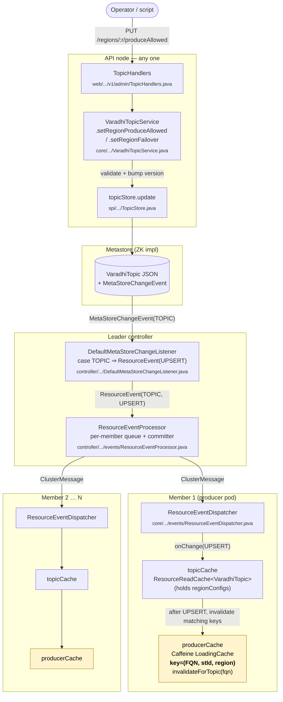
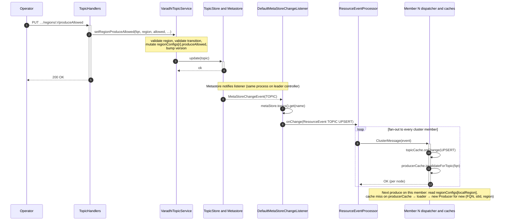
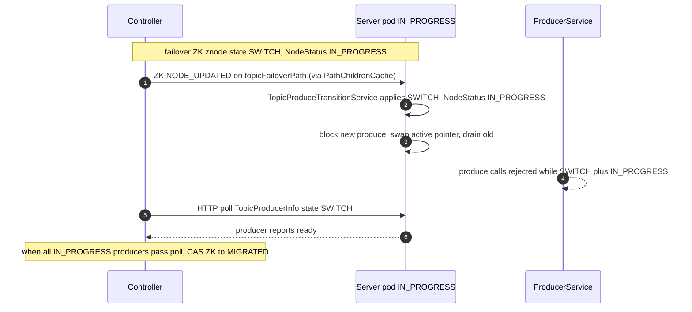
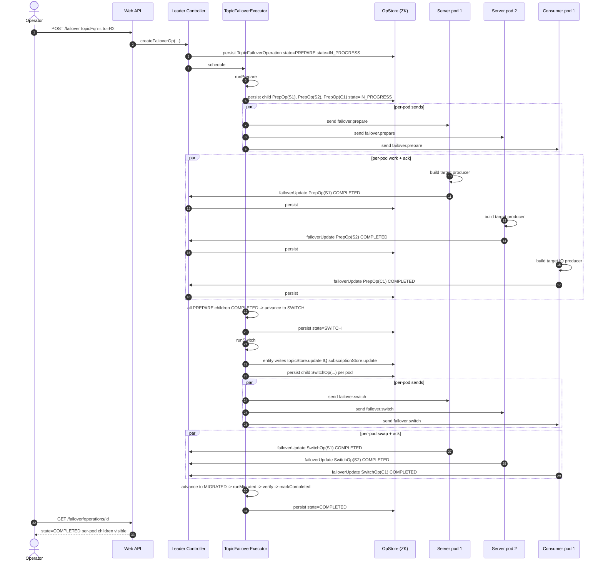
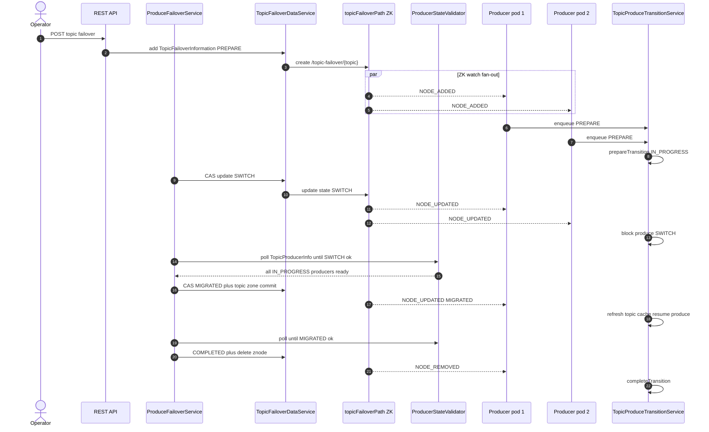

# TOPIC FAILOVER (PRODUCE PATH) — GROOMING DOC

> **Single source of truth** for topic failover grooming: data model, producer path, and wire-pattern options. **Controller orchestration:** [`topic-failover-controller.md`](topic-failover-controller.md) (oncall-proven ZK transition path). **Internal reference:** oncall project — Appendix B.
> Companion references: `docs/TOPIC_FAILOVER_MASTER_FOR_GOOGLE_DOCS.md`, `docs/topic-failover-produce-lld.md`.

| Field | Value |
|-------|-------|
| Status | Draft — ready for grooming; **wire approach undecided** (§5.5) |
| Scope | Produce path only (consumer follow-the-producer is Phase 3, out of scope) |
| Phasing | Phase 1: manual REST + producer cache rewiring + `TopicFailoverOperation` on `OperationMgr`/`OpStore`. Phase 2: auto-failover via `FailoverService`. Phase 3+: structural foundations + generic `ClusterJob` (Appendix A). |
| Audience | Implementers, reviewers, TPMs |
| Builds on | PR #307 (Region entity, RegionStatus, REGION listener hook) |

---

## 0. TL;DR

1. **`topicFailoverInfo` as a separate object is NOT required.** Failover policy lives on `VaradhiTopic` as **`Map<RegionName, RegionConfig> regionConfigs`** (+ `autoFailover`, `tags`). IQs use **`produceIndexByRegion`** on `InternalCompositeSubscription` (§3.8).
2. **No derived `ProduceRoutingCache` on producer pods.** Hot path reads `regionConfigs` from `topicCache`; `ProducerCacheKey` gains `region` for clean invalidation (§4).
3. **Failover is a produce transition** with states **`PREPARE` → `SWITCH` → `MIGRATED` → `COMPLETED`** or **`ABORTED`**. **Recommended controller:** ZK transition znode + orchestrator ([`topic-failover-controller.md`](topic-failover-controller.md)). Optional OpStore parent op for audit only.
4. **Wire pattern is an open decision — three approaches in §5.5** (controller doc recommends **C**):
   - **A — P2P:** per-pod `exchange.send` + `TopicPodOperation` children + `failover.update` acks (mirrors SubOp/ShardOp; no new primitives).
   - **B — EventBus broadcast:** one `exchange.publish` per stage + per-pod acks; requires implementing stubbed `MessageExchange.publish`.
   - **C — ZK transition path (OSS default, see controller doc):** create `/varadhi/transitions/topic-failover/{topic}`; **Server** + **Consumer** verticles watch and run `TopicProduceTransitionService`; pods **push** `failover.status` (`FailoverTransitionStatusResponse`) to controller; **`FailoverOrchestrator`** CAS-advances stages when **`FailoverStateValidator`** has acks. Routing entity writes at MIGRATED. Not `ResourceEventProcessor` stage fan-out.
   - Comparison matrix and discussion: **§5.5.6–5.5.7**. Confirm choice before J-* control-plane stories.
5. **Producer participation** — each Server pod holds a local `TopicProduceTransitionContext` (`ProduceTransitionData` + `NodeStatus`). Controller monitors only **`IN_PROGRESS`** pods; **`NOT_INVOLVED`** pods reject produce until the transition ends. Produce on existing vs new producer is gated by the matrix in **§4.7**.
6. **Fan-out targets include IQ producers** — Server pods (main topic) and Consumer pods (RQ/DLQ) (§5.4, §5.11 sequence).
7. **Restart-resilient** via `OpStore` + `requeueInProgressOperations` (§5.4.9).
8. **Phase-2 cooldowns** on leader-only `FailoverService`, not on the topic blob.
9. **`ControllerApiMgr.bootstrap()`** — single registration point for controller subsystems (§5.3).

> **Decision evolution.** May 14: stay event-based, no generic `ClusterJob`. May 16: adopt `TopicFailoverOperation` framework. Latest: document **three wire options** with flows and open questions (§5.5); implementation details for Option A remain in §5.4 as the reference shape until the team picks A / B / C / hybrid.

---

## 1. Decision: do we need a `topicFailoverInfo` object?

### 1.1 What "failover info" actually contains

Conceptually three buckets:

| Bucket | Example fields | Who reads | Who writes | Refresh path |
|--------|---------------|-----------|------------|--------------|
| **Policy / desired state** | `regionConfigs: Map<RegionName, RegionConfig>`, `autoFailover` | every producer pod, controller | REST handlers, controller job | TOPIC UPSERT |
| **Audit / history** | who flipped, when, before→after, reason, correlation id | ops dashboards, humans | REST handler / controller job | append-only log (out of band) |
| **Controller bookkeeping** | last-flip-ts per (topic, region), cooldown timers, in-flight flag, `lastFullyPropagatedAt(fqn, version)` | controller job only | controller job | in-process / controller store |

### 1.2 Recommendation (per bucket)

| Bucket | Where it lives | Rationale |
|--------|---------------|-----------|
| Policy | **Inline on `VaradhiTopic`** as `regionConfigs` + `autoFailover` | One version counter, one event, no second source of truth. Cheap on disk; cheap on the wire. `regionConfigs` is small (one entry per region — typically 2–5). |
| Audit | **Separate sink** (log, audit table, or `/varadhi/failover/history/...` ZK path) | High write churn, no producer cares. Do **not** bloat topic blob. |
| Bookkeeping | **Controller-local map** (`Map<RegionName, Instant>`, `Map<TopicFqn, Instant>`) | Leader-only, ephemeral, regenerated on leader restart from current topic + region state. |

### 1.3 So is a *named* `TopicFailoverPolicy` object useful?

**No** — `regionConfigs` itself *is* that grouping. The old four-flat-field proposal (`replicationRegions`, `produceRegions`, `failoverRegion`, `autoFailover`) collapses cleanly into:

- `regionConfigs[r].isReplicated` ⇒ replaces the implicit `replicationRegions` set.
- `regionConfigs[r].produceAllowed` ⇒ replaces the explicit `produceRegions` set.
- `regionConfigs[r].failOverRegion` ⇒ replaces the single global `failoverRegion` with a **per-region** standby (more flexible: each producing region can declare its own fallback).
- `autoFailover` stays as a top-level boolean on `VaradhiTopic`.

So we don't introduce a wrapper class for the wrapper class.

### 1.4 No secondary cache on producer pods

Earlier drafts proposed a derived `ProduceRoutingCache` to keep the hot path off the full `VaradhiTopic` blob. **That is no longer needed.** Reasons:

- `regionConfigs` is **O(numRegions)** and is part of `VaradhiTopic` itself, which is already in `topicCache` (the existing `ResourceReadCache<EntityResource<VaradhiTopic>>`).
- The hot path now reads exactly one entry — `topic.getRegionConfigs().get(localRegion)` — to answer "may I produce here?" and a second lookup on `topic.getStorageTopic().getProduceIndex().get(localRegion)` to find the storage topic. Both are `HashMap` gets on objects already resident in memory.
- Avoiding a derived cache removes one ordering-sensitive listener registration, one consistency window between two caches, and one component to test.

The only producer-side change is to put `region` into `ProducerCacheKey` so flips can invalidate cleanly (§4.2).

```
        +-----------------------------+
TOPIC   |  topicCache                 |   full VaradhiTopic
UPSERT->|  (ResourceReadCache)        |--+
        +-----------------------------+  |
                                         |  read directly on each produce
                                         v
                       +-----------------------------------+
                       |  produceToValidTopic()            |
                       |    rc = topic.regionConfigs[R]    |
                       |    if !rc.produceAllowed -> fail  |
                       |    idx = stt.produceIndex[R]      |
                       |    storage = stt.storageTopics[idx]|
                       +-----------------------------------+
                                         |
                                         v
                       +-----------------------------+
                       |  producerCache              |
                       |  key = (FQN, stId, region)  |
                       |  invalidateForTopic(fqn)    |
                       +-----------------------------+
```

---

## 2. End-to-end architecture (verified file map)

### 2.1 Mermaid view (renders in GitHub / IDE preview)



> Yellow boxes are the only behaviour change on the producer pod: `producerCache` gains
> `region` in its key and a `invalidateForTopic(fqn)` hook fired from the existing TOPIC
> UPSERT listener. Everything else (`topicCache`, dispatcher, fan-out, listener) already
> exists and is verified in the file paths shown.

### 2.2 ASCII view (Google-Docs / plain-text friendly)

```
                +-------------------------------------------------------+
 Operator/      |    Web API node (any one)                             |
 Script  ---->  |  TopicHandlers  (web/.../v1/admin/TopicHandlers.java) |
                |       |                                               |
                |       v                                               |
                |  VaradhiTopicService.setRegionProduceAllowed(...)     |
                |       |    (core/.../VaradhiTopicService.java)        |
                |       v                                               |
                |  topicStore.update(topic)  -- spi/.../TopicStore.java |
                +-------------------------------------------------------+
                                          |
                                          v
                +-------------------------------------------------------+
                |  Metastore  (ZK impl in metastore-zk/)                |
                |   - persists VaradhiTopic JSON                        |
                |   - fires MetaStoreChangeEvent                        |
                +-------------------------------------------------------+
                                          |
                                          v   (LEADER controller only)
                +-------------------------------------------------------+
                |  DefaultMetaStoreChangeListener                       |
                |     case TOPIC ->                                     |
                |       processUpsertEvent(TOPIC, name, topic, ...)     |
                |   -> ResourceEvent<TOPIC, UPSERT, topic, version>     |
                +-------------------------------------------------------+
                                          |
                                          v
                +-------------------------------------------------------+
                |  ResourceEventProcessor                               |
                |   fans out ClusterMessage to every member             |
                |   (per-member virtual-thread queue + committer)       |
                +-------------------------------------------------------+
                       |                       |                  |
                       v                       v                  v
              +-----------------+     +-----------------+   +-----------------+
              | Member A        |     | Member B        |   | Member N        |
              |  Dispatcher     |     |  Dispatcher     |   |  Dispatcher     |
              |   |             |     |   |             |   |   |             |
              |   v             |     |   v             |   |   v             |
              | topicCache      |     | topicCache      |   | topicCache      |
              | onChange(UPSERT)|     | onChange(UPSERT)|   | onChange(UPSERT)|
              |   |             |     |   |             |   |   |             |
              |   v   (NEW)     |     |   v             |   |   v             |
              | producerCache.  |     | ...same...      |   | ...same...      |
              | invalidate-     |     |                 |   |                 |
              |   ForTopic(fqn) |     |                 |   |                 |
              |                 |     |                 |   |                 |
              | next produce -> |     |                 |   |                 |
              |  read           |     |                 |   |                 |
              |  regionConfigs  |     |                 |   |                 |
              |  + produceIndex |     |                 |   |                 |
              |  from topicCache|     |                 |   |                 |
              +-----------------+     +-----------------+   +-----------------+
```

Key file pointers (all verified):

| Concern | File |
|---------|------|
| Topic entity | `entities/src/main/java/com/flipkart/varadhi/entities/VaradhiTopic.java` |
| Topic factory | `core/src/main/java/com/flipkart/varadhi/core/topic/VaradhiTopicFactory.java` |
| Topic service | `core/src/main/java/com/flipkart/varadhi/core/VaradhiTopicService.java` |
| Topic store SPI | `spi/src/main/java/com/flipkart/varadhi/spi/db/TopicStore.java` |
| Web handlers | `web/src/main/java/com/flipkart/varadhi/web/v1/admin/TopicHandlers.java` |
| Topic REST DTO | `entities/src/main/java/com/flipkart/varadhi/entities/web/TopicResource.java` |
| Resource cache | `core/src/main/java/com/flipkart/varadhi/core/ResourceReadCache.java` |
| Cache registry | `core/src/main/java/com/flipkart/varadhi/core/ResourceReadCacheRegistry.java` |
| Listener | `controller/src/main/java/com/flipkart/varadhi/controller/DefaultMetaStoreChangeListener.java` |
| Fan-out | `controller/src/main/java/com/flipkart/varadhi/controller/events/ResourceEventProcessor.java` |
| Dispatcher (per node) | `core/src/main/java/com/flipkart/varadhi/core/cluster/events/ResourceEventDispatcher.java` |
| Producer service | `producer/src/main/java/com/flipkart/varadhi/produce/ProducerService.java` |
| Producer options | `core/src/main/java/com/flipkart/varadhi/core/config/ProducerOptions.java` |
| Controller bootstrap | `controller/src/main/java/com/flipkart/varadhi/controller/ControllerVerticle.java` |
| Resource event | `core/src/main/java/com/flipkart/varadhi/core/cluster/events/ResourceEvent.java` |
| Event type enum | `core/src/main/java/com/flipkart/varadhi/core/cluster/events/EventType.java` |

---

## 3. Data model changes

This delivery introduces one new entity (`RegionConfig`), reshapes `SegmentedStorageTopic` to be regional-aware, and replaces the per-region `internalTopics` map on `VaradhiTopic` with a **single** `SegmentedStorageTopic` plus a per-region `regionConfigs` map. The old four-flat-field proposal is dropped.

### 3.1 Class tree (target)

```
AbstractTopic (interface)
└── String getName()

  StorageTopic (abstract)
    ├── int id
    ├── String name
    └── PulsarStorageTopic (concrete)
         └── int partitionCount

  SegmentedStorageTopic                       ← reshaped
    ├── StorageTopic[] storageTopics          // flat; one entry per (region, segment-rev)
    ├── int activeStorageTopicId              // legacy; superseded by produceIndex
    ├── Map<RegionName, int> produceIndex     // NEW — per-region pointer into storageTopics
    └── TopicState topicState

  VaradhiTopic (extends LifecycleEntity)      ← reshaped
    ├── boolean grouped
    ├── TopicCapacityPolicy capacity
    ├── String nfrFilterName
    ├── SegmentedStorageTopic storageTopic    // UPDATED — single, not Map<region, …>
    ├── Set<TopicTag> tags                    // NEW
    ├── boolean autoFailover                  // NEW
    └── Map<RegionName, RegionConfig> regionConfigs  // NEW

  RegionConfig (new value object)
    ├── boolean isReplicated   = false        // storage topic exists in this region
    ├── boolean produceAllowed = true         // produce is currently authoritative here
    └── RegionName failOverRegion             // per-region standby; nullable
```

Example payload:

```jsonc
"regionConfigs": {
  "CH":  { "isReplicated": true, "produceAllowed": true,  "failOverRegion": null },
  "HYD": { "isReplicated": true, "produceAllowed": false, "failOverRegion": null }
}
```

In this example, **CH is the currently producing region** and HYD is a replicated standby. To flip authority to HYD: set `CH.produceAllowed=false` and `HYD.produceAllowed=true` in one update. To multi-activate: set both to `true`.

### 3.2 `VaradhiTopic` — diff against today

Today (`VaradhiTopic.java`):

```java
private final Map<String, SegmentedStorageTopic> internalTopics;
private final boolean grouped;
private final TopicCapacityPolicy capacity;
private final String nfrFilterName;
private final TopicCategory topicCategory;
```

Proposed:

```java
private final SegmentedStorageTopic storageTopic;          // single; replaces internalTopics
private final boolean grouped;
private final TopicCapacityPolicy capacity;
private final String nfrFilterName;
private final TopicCategory topicCategory;
private final Set<TopicTag> tags;
private final boolean autoFailover;                        // default false
private final Map<RegionName, RegionConfig> regionConfigs;  // see §3.1
```

The existing helper `getProduceTopicForRegion(region)` is replaced by two cheap lookups in the producer hot path (no helper indirection needed):

```java
RegionConfig rc = topic.getRegionConfigs().get(region);
int idx          = topic.getStorageTopic().getProduceIndex().get(region);
StorageTopic st  = topic.getStorageTopic().getStorageTopics()[idx];
```

### 3.3 `SegmentedStorageTopic` — diff against today

Today (per-region, one segmented topic per `internalTopics[region]`):

```java
StorageTopic[] storageTopics;
int            activeStorageTopicId;
TopicState     topicState;
```

Proposed (single, per-region routing inline):

```java
StorageTopic[]           storageTopics;       // all replicas across regions
int                      activeStorageTopicId; // legacy — read produceIndex instead
Map<RegionName, Integer> produceIndex;        // NEW
TopicState               topicState;
```

> **Open question (§11):** how `produceIndex` composes with **segmentation** (the partition-growth use case that originally motivated `storageTopics[]`). One safe interpretation is that `storageTopics[]` holds one `StorageTopic` per region's currently-active segment, and segment rotation atomically updates both the array slot and `produceIndex[region]`. Cross-check with the team owning segmentation.

### 3.4 `RegionConfig` — new file

```java
package com.flipkart.varadhi.entities;

@Value @Builder(toBuilder = true)
public class RegionConfig {
    @Builder.Default boolean isReplicated   = false;
    @Builder.Default boolean produceAllowed = true;
    /** Per-region standby; nullable. */
    RegionName failOverRegion;
}
```

Derived views (no separate fields stored):

| Old name | New expression |
|----------|----------------|
| `replicationRegions` | `regionConfigs.entrySet().stream().filter(e -> e.getValue().isReplicated()).map(Entry::getKey).collect(toSet())` |
| `produceRegions`     | `regionConfigs.entrySet().stream().filter(e -> e.getValue().isProduceAllowed()).map(Entry::getKey).collect(toSet())` |
| global `failoverRegion` | not represented globally; ask `regionConfigs.get(r).getFailOverRegion()` per region |

### 3.5 `TopicResource` — accept the new shape on create/update

`TopicResource.java` is the Vert.x request DTO used by `TopicHandlers.create`. Add:

```java
private final Map<String, RegionConfigDto> regionConfigs;  // keyed by region name
private final boolean autoFailover;
private final Set<TopicTag> tags;
```

…and thread them through `toVaradhiTopic()`. `VaradhiTopicFactory` uses `regionConfigs` to build the single `SegmentedStorageTopic` (one `StorageTopic` per `isReplicated=true` region, with `produceIndex` populated for each `produceAllowed=true` region) and persists the rest.

### 3.6 Backfill / migration of existing topics

On read (in `VaradhiTopic` Jackson deserialisation or in the factory), if a stored blob still has `internalTopics`:

1. Build `storageTopic` by concatenating the value `SegmentedStorageTopic`s, preserving original `StorageTopic` ids.
2. Build `regionConfigs[r] = RegionConfig{isReplicated=true, produceAllowed=true, failOverRegion=null}` for each `r` in `internalTopics.keySet()`.
3. Build `produceIndex[r]` to point to the first storage-topic index that came from `internalTopics[r]`.
4. `autoFailover = false`, `tags = emptySet()`.

**Do not** rewrite stored blobs on read; rewrite on the first `update()` call so version goes up exactly once per topic.

### 3.7 Version discipline

Every `topicStore.update(topic)` that changes `regionConfigs` or `autoFailover` **must bump `version`**. `ResourceReadCache.onChange` ignores UPSERTs whose `event.version() <= existing.getVersion()`:

```java
// ResourceReadCache.onChange (existing)
if (existingResource == null || event.version() > existingResource.getVersion()) {
    return eventData;
}
```

Adding a `BaseResource.bumpVersion()` helper (or relying on the existing increment used by other updates) is sufficient; just make sure failover writers go through it.

### 3.8 IQ (RQ / DLQ) — same per-region shape on `InternalCompositeSubscription`

`SubscriptionUnitShard` (`entities/.../SubscriptionUnitShard.java`) carries a
`RetrySubscription` and a `deadLetterSubscription`. Both are backed by
`InternalCompositeSubscription` (`entities/.../InternalCompositeSubscription.java`),
which today selects the produce target with a single `int produceIndex`:

```java
// today
public class InternalCompositeSubscription {
    private final InternalQueueType queueType;
    private StorageSubscription<? extends StorageTopic>[] storageSubscriptions;
    private int produceIndex;        // index into storageSubscriptions[]
    private int consumeIndex;

    public StorageTopic getTopicForProduce() {
        return storageSubscriptions[produceIndex].getStorageTopic();
    }
}
```

For region-aware failover we lift `produceIndex` to a per-region map exactly the way
`SegmentedStorageTopic.produceIndex` is lifted (§3.3):

```java
// proposed
public class InternalCompositeSubscription {
    private final InternalQueueType queueType;
    private StorageSubscription<? extends StorageTopic>[] storageSubscriptions;
    private int produceIndex;                              // legacy — kept for back-compat
    private Map<RegionName, Integer> produceIndexByRegion;  // NEW — per-region pointer
    private int consumeIndex;

    public StorageTopic getTopicForProduce(RegionName region) {
        if (queueType.getCategory() == InternalQueueCategory.MAIN) {
            throw new IllegalArgumentException("Main has no produce topic");
        }
        Integer idx = produceIndexByRegion != null ? produceIndexByRegion.get(region) : null;
        if (idx == null) idx = produceIndex;       // legacy fallback
        return storageSubscriptions[idx].getStorageTopic();
    }
}
```

`RetrySubscription` carries an array of `InternalCompositeSubscription` (one per retry
attempt 1..N from `InternalQueueType.Retry`) — each gets the same lift independently.

Backfill on read: when the stored blob has `produceIndex` but no `produceIndexByRegion`,
the deserialiser populates `produceIndexByRegion = Map.of(deploymentRegion, produceIndex)`.
**Do not** rewrite stored blobs on read; rewrite on the first `update()` call.

Version discipline: every `subscriptionStore.update(sub)` that changes any
`produceIndexByRegion` bumps the subscription version (same discipline as §3.7).

---

## 4. Producer-side implementation

### 4.1 Today (verified from `ProducerService.java`)

```java
private record ProducerCacheKey(String varadhiTopicFQN, int storageTopicId) {}
private final LoadingCache<ProducerCacheKey, Producer<? extends Offset>> producerCache;
private final String produceRegion;          // JVM-fixed!

private Producer<?> loadProducerObject(...) {
    var topic = topicCache.get(key.varadhiTopicFQN).get();
    return producerFactory.newProducer(
        topic.getEntity().getProduceTopicForRegion(produceRegion).getTopic(key.storageTopicId),
        topic.getEntity().getCapacity()
    );
}

private CompletableFuture<ProduceResult> produceToValidTopic(VaradhiTopic topic, Message message) {
    SegmentedStorageTopic internalTopic = topic.getProduceTopicForRegion(produceRegion);
    ...
    return getProducer(topic.getName(), storageTopic).thenCompose(...);
}
```

Two problems:
1. `produceRegion` is fixed per JVM → no per-topic authority.
2. `ProducerCacheKey` has no region → a flip cannot evict cleanly even if we add per-topic selection.

### 4.2 Target

```java
private record ProducerCacheKey(String varadhiTopicFQN, int storageTopicId, String region) {}

private Producer<?> loadProducerObject(ProducerCacheKey key) {
    var topic = topicCache.get(key.varadhiTopicFQN).orElseThrow(...).getEntity();
    SegmentedStorageTopic stt = topic.getStorageTopic();
    Integer idx = stt.getProduceIndex().get(key.region);
    if (idx == null) {
        throw new ResourceNotFoundException(
            "Topic(%s) has no produceIndex entry for region(%s)".formatted(key.varadhiTopicFQN, key.region));
    }
    // storageTopicId is the per-segment id within the produce slot (today's behaviour).
    StorageTopic st = stt.getStorageTopics()[idx];        // region-correct slot
    return producerFactory.newProducer(st, topic.getCapacity());
}
```

…and `produceToValidTopic` becomes:

```java
String chosen = pickProduceRegion(topic, localRegion, opts);   // see 4.4
SegmentedStorageTopic stt = topic.getStorageTopic();
int idx = stt.getProduceIndex().get(chosen);
StorageTopic storageTopic = stt.getStorageTopics()[idx];
ProducerCacheKey key = new ProducerCacheKey(topic.getName(), storageTopic.getId(), chosen);
```

> No derived `ProduceRoutingCache`. The producer reads `regionConfigs` and `produceIndex`
> directly off the entity already held by `topicCache`. This was the proposed slim
> projection in earlier drafts; it is dropped in favour of the simpler model in §3.

### 4.3 (removed) `ProduceRoutingCache`

Earlier drafts proposed a derived `ProduceRoutingCache` that mirrored a slim subset of the
topic for the hot path. With `regionConfigs` lifted onto `VaradhiTopic` and `produceIndex`
lifted onto `SegmentedStorageTopic` (§3), the projection is **no longer required**: the
hot path performs two `HashMap.get` calls on the in-memory `VaradhiTopic` already cached
by `topicCache`. Removing this component eliminates a second listener, a second cache
consistency window, and ~120 lines of test surface.

### 4.4 `pickProduceRegion` (default local-only)

```java
String pickProduceRegion(VaradhiTopic topic, String localRegion, ProducerOptions opts) {
    var configs = topic.getRegionConfigs();
    RegionConfig local = configs.get(localRegion);

    // Fast path: local is allowed.
    if (local != null && local.isProduceAllowed()) return localRegion;

    // Local is not currently producing; try the local region's declared standby.
    if (local != null && local.getFailOverRegion() != null) {
        RegionConfig standby = configs.get(local.getFailOverRegion());
        if (standby != null && standby.isProduceAllowed()) {
            if (!opts.isCrossRegionProduce())
                throw new ProducerNotAvailableException(
                    "Local region %s is not produce-allowed; standby %s is in another region"
                        .formatted(localRegion, local.getFailOverRegion()));
            return local.getFailOverRegion();
        }
    }

    // Fall back to any produce-allowed region (only if cross-region is permitted).
    if (opts.isCrossRegionProduce()) {
        return configs.entrySet().stream()
            .filter(e -> e.getValue().isProduceAllowed())
            .map(Map.Entry::getKey)
            .sorted()
            .skip(Math.floorMod(topic.getName().hashCode(),
                  (int) configs.values().stream().filter(RegionConfig::isProduceAllowed).count()))
            .findFirst()
            .orElseThrow(() -> new ProducerNotAvailableException(
                "No produce-allowed region for topic " + topic.getName()));
    }

    throw new ProducerNotAvailableException(
        "Local region %s is not produce-allowed for topic %s and cross-region is disabled"
            .formatted(localRegion, topic.getName()));
}
```

### 4.5 `ProducerService.invalidateForTopic(fqn)`

```java
void invalidateForTopic(String fqn) {
    producerCache.asMap().keySet().removeIf(k -> k.varadhiTopicFQN().equals(fqn));
}
```

Use `removeIf` on the Caffeine view; cheap because the key set is bounded by (topics × regions × storage-topic-ids) on a single pod. **Do not** flush the entire cache. The invalidator is wired as a small additional callback on the existing `topicCache` listener (or, if the team prefers, as a separate `ResourceEventListener<EntityResource<VaradhiTopic>>` chained after the cache update — see §4.6 for ordering).

### 4.6 Producer-side sequence (manual flip)

#### Mermaid (sequence)



> **Ordering note:** The HTTP `200` may return as soon as `topicStore.update` completes; the
> metastore → listener → `ResourceEventProcessor` → member dispatch path can trail slightly
> behind the response. Producers must not assume the new `regionConfigs` is visible until
> the TOPIC UPSERT has been applied on **that** member (or until TTL expiry).

#### ASCII (Google-Docs / plain-text)

```
operator       TopicHandlers     VaradhiTopicSvc   topicStore   listener   processor   member-N
   |                |                  |               |           |          |           |
   |---PUT          |                  |               |           |          |           |
   | regions/:r/    |                  |               |           |          |           |
   | produceAllowed>|                  |               |           |          |           |
   |                |--setRegion------>|               |           |          |           |
   |                |  ProduceAllowed  |               |           |          |           |
   |                |                  |--validate---->|           |          |           |
   |                |                  |--update------>|           |          |           |
   |                |                  |<---ok---------|           |          |           |
   |                |                  |               |--ev TOPIC-->         |           |
   |                |                  |               |           |--enq->   |           |
   |                |                  |               |           |          |--cluster->|
   |                |                  |               |           |          |           |--Dispatcher.onChange
   |                |                  |               |           |          |           |    topicCache.update
   |                |                  |               |           |          |           |    producerCache.invalidateForTopic(fqn)
   |<--200----------|                  |               |           |          |           |
                                                                                ack       |
   .                                                                                      |
   (next produce on member-N: read regionConfigs[localRegion] from topicCache,
                              pick region, cache miss on producerCache -> loader -> new Producer)
```

### 4.7 `TopicProduceTransitionContext` and `NodeStatus` (producer ↔ controller)

While a failover is in flight, each **Server pod** (and Consumer pod for IQ produce, same pattern) carries a local view of the transition. The controller publishes authoritative transition state (ZK / `ProduceTransitionData`); the pod reports **whether it is participating** via `NodeStatus`.

```java
// core/.../TopicProduceTransitionContext.java
public record TopicProduceTransitionContext(
    ProduceTransitionData produceTransitionData,
    NodeStatus produceTransitionNodeStatus
) {
    public String getTopicName() {
        return produceTransitionData.getTopicName();
    }

    public enum NodeStatus {
        NOT_INVOLVED,   // not a migration target; topic unavailable for produce until transition ends
        IN_PROGRESS,    // participating; produce rules follow ZK state (matrix below)
        FAILED,         // could not apply a transition step; controller typically aborts migration
        ERRORED         // unexpected failure on a new event; produce blocked; controller may stop/continue
    }
}
```

| Concern | Source | Where |
|--------|--------|--------|
| **ZK / transition state** | `ProduceTransitionData.State` on the parent op (and mirrored on `ProduceTransitionData` written for pods) | Metastore + `TopicFailoverOperation` (§5.4) |
| **Pod participation** | `TopicProduceTransitionContext.produceTransitionNodeStatus` | In-memory on each producer pod; reported to controller on ack / heartbeat |
| **Produce gating** | Function of **both** columns below | `ProducerService.produceToValidTopic()` (or dedicated guard) |

#### 4.7.1 Produce allowance matrix

`NodeStatus` is used for **communication between producer nodes and the controller**. A producer may **opt out** of participating (`NOT_INVOLVED`). The controller **only monitors** pods in `IN_PROGRESS` for stage completion; it does not wait on `NOT_INVOLVED` pods to advance `PREPARE` / `SWITCH` / `MIGRATED`.

| ZK state (`ProduceTransitionData.State`) | Producer pod (`NodeStatus`) | Produce on **existing** producer | Produce on **new** (target) producer |
|----------------------------------------|------------------------------|----------------------------------|--------------------------------------|
| `PREPARE`, `SWITCH`, `MIGRATED` | `NOT_INVOLVED` | N/A | **NO** |
| `COMPLETED`, `ABORTED` | `NOT_INVOLVED` | N/A | **YES** |
| `PREPARE`, `MIGRATED` | `IN_PROGRESS` | **YES** | **NO** |
| `SWITCH` | `IN_PROGRESS` | **NO** | **NO** |
| `COMPLETED`, `ABORTED` | `IN_PROGRESS` | **YES** | **YES** |
| *any* | `ERRORED` | **NO** | **NO** |
| `PREPARE`, `MIGRATED` | `FAILED` | **YES** | **NO** |
| `SWITCH` | `FAILED` | **NO** | **NO** |
| `COMPLETED`, `ABORTED` | `FAILED` | **YES** | **YES** |

**Reading the matrix**

- **`NOT_INVOLVED`:** Migration is active for the topic on the cluster, but **this pod is not a target**. New produce calls are **rejected** (topic effectively unavailable here until `COMPLETED` or `ABORTED`). Controller does **not** include this pod in per-stage completion.
- **`IN_PROGRESS`:** Pod is participating. During **`SWITCH`**, **all** produce is blocked (`NO` / `NO`) — matches “block new produce while switching active pointer”. During **`PREPARE`** / **`MIGRATED`**, traffic stays on the **existing** producer only. After terminal ZK states, both paths are allowed.
- **`FAILED`:** Handler failed for the current transition step; produce is **not** globally blocked (existing producer may still accept per matrix). Controller **stops** the migration (parent → `ABORTED`) when a participating pod reports `FAILED`.
- **`ERRORED`:** Unexpected failure on a subsequent event; produce **blocked** until migration finishes. Controller policy: stop vs continue depends on current ZK state (treat as hard failure for `SWITCH`; may abort on `PREPARE` / `MIGRATED`).

#### 4.7.2 Producer hot path (sketch)

```text
on produce(topic):
  ctx = topicProduceTransitionContextCache.get(topicFqn)
  if ctx == null:
      normal produce path (no active transition)
  else:
      if !isProduceAllowed(ctx.produceTransitionData.state,
                           ctx.produceTransitionNodeStatus,
                           producingOnExistingVsNew):
          throw TopicUnavailableException / ProducerNotAvailableException
      else:
          existing produceToValidTopic() using regionConfigs + active producer pointer
```

`producingOnExistingVsNew` is true when the request is routed to the pre-migration producer slot vs the pre-warmed target slot (implementation detail of `ProducerCacheWarmer` / active pointer).

#### 4.7.3 Controller implications

- **`FailoverTargetSelector`** (§5.4): only pods that will be **`IN_PROGRESS`** are in the fan-out set. Pods that cannot participate should be classified **`NOT_INVOLVED`** locally when they learn of the transition (e.g. via broadcast) without being sent `PrepareData`.
- **Stage advancement:** aggregate acks only from **`IN_PROGRESS`** pods for the current `ProduceTransitionData.State`. A pod that flips to `FAILED` or `ERRORED` triggers `markAborted` / `ABORTED` per policy above.
- **Approach C (ZK transition path):** pods set `TopicProduceTransitionContext` when the failover ZK znode is added/updated (`ProduceTransitionListener` → `TopicProduceTransitionService`); produce gating uses the §4.7 matrix from ZK state + local `NodeStatus`. No per-stage `failover.prepare` RPC — participation is driven by the shared transition znode.

#### 4.7.4 Sequence — `SWITCH` on an participating Server pod



---

## 5. Controller-side implementation

> **OSS controller implementation spec:** [`topic-failover-controller.md`](topic-failover-controller.md)
>
> **OSS Phase 1:** failover start = ZK znode under `/varadhi/transitions/topic-failover/`; **Server** (`WebServerVerticle`) and **Consumer** pods watch and run `TopicProduceTransitionService`; pods **push** `failover.status` via `MessageExchange` (like `ShardOpResponse`); **`FailoverOrchestrator`** CAS-advances stages when **`FailoverStateValidator`** has all member acks. Oncall is a logic reference; return leg uses push not HTTP poll. Approach A (P2P per stage) remains optional in §5.5 below.

### 5.0 Quick pointer

| Need | Document |
|------|----------|
| OSS end-to-end (ZK + `failover.status` push) | [controller §0–§2, §9](topic-failover-controller.md) |
| Wire types + handler registration | [controller §3, §5, §8](topic-failover-controller.md) |
| Implementation stories OSS-C01–C14 | [controller §14](topic-failover-controller.md) |
| Producer `TopicProduceTransitionService` | Parent §4.7 |
| `regionConfigs` / IQ data model | Parent §3 |
| Oncall file map (full) | Parent Appendix B |

---

### 5.5 Wire communication — three approaches (OPEN DECISION)

> **Status: decision open.** All approaches share `ProduceTransitionData.State` and pod `TopicProduceTransitionContext` (§4.7). **Recommended:** **C** per [`topic-failover-controller.md`](topic-failover-controller.md). Pick before control-plane stories (§8 / controller §15).

| # | Approach | Forward leg | Return leg | New infra |
|---|---|---|---|---|
| **A** | **P2P** | `exchange.send(memberId, "failover.<verb>", …)` per pod per stage | `failover.update` per pod per stage | None |
| **B** | **Broadcast via EventBus** | `exchange.publish("failover.events", …)` once per stage; pods self-select | `failover.update` per acknowledging pod | Implement stubbed `MessageExchange.publish` + Hazelcast canary |
| **C** | **ZK transition path (oncall)** | CAS write on `{topicFailoverPath}/{topic}`; pods watch via `PathChildrenCache` | `ProducerStateValidator` HTTP poll of `TopicProducerInfo` | Transition ZK path + producer status API |

Approach C does **not** use `ResourceEventProcessor` for stage coordination. Entity writes for `regionConfigs` happen at routing commit (MIGRATED), not as the stage signal.

#### 5.5.1 What must happen on every failover (approach-agnostic)

This is the irreducible work. All three approaches do these things in the same order; they differ only in how steps 3 and 4 reach the pods.

##### Authoritative state changes (leader, persisted)

1. **Transition started** — Approach **C:** `TopicFailoverDataService.add(PREPARE)` on ZK ([controller §5.1](topic-failover-controller.md)). Approach **A:** `TopicFailoverOperation` in `OpStore`.
2. **Validation** — target region is replicated and produce-eligible per `RegionConfig`; not already on target.
3. **`VaradhiTopic.regionConfigs` rewritten** so that `produceAllowed` is true on the target region and false on the source. Version bumps.
4. **For every IQ** (`Retry` / `DLQ`) whose `produceIndexByRegion` currently points at the source region, **rewrite `produceIndexByRegion`** to point at the target region. Version bumps.
5. **`TopicFailoverOperation` advances** `state`: SWITCH → MIGRATED → COMPLETED`. Each transition is persisted.

(2)–(4) are entity writes and run on every approach. (5) is parent op bookkeeping and runs on every approach. **Steps 3 and 4 are the moments when the new world becomes visible to anyone reading state.**

##### Pod-side reactions

| Pod type | What it has to do | Whose entity it watches |
|---|---|---|
| **Server pod** | For every locally-cached producer on the topic, build the target-region producer; on SWITCH, swap the active producer reference and drain the old. | `VaradhiTopic` |
| **Consumer pod** | For every assigned shard, if the shard's RQ / DLQ subscription's `produceIndexByRegion` is changing, build the new IQ producer; on SWITCH, swap references and drain the old. | `InternalCompositeSubscription` (or `VaradhiSubscription` carrying IQs) |

The two pod types react to **different entities** but otherwise execute the same three steps:

- **PREPARE** — build new producer; keep both old and new live; route produces to old.
- **SWITCH** — atomically swap producer reference; route produces to new; old producer enters drain mode.
- **MIGRATED** — old producer fully drained and closed; only the new producer remains.

##### Pre-warming rationale

Pulsar producer construction touches the broker, builds the schema chain, allocates connections, and primes pooled sends. End-to-end this is tens to hundreds of milliseconds per producer per topic. A fleet flip that does this **cold** under produce traffic causes a multi-second produce-latency spike for the duration of the build storm. Pre-warming amortizes this across a controlled window before the cutover.

This is **why PREPARE exists as a distinct stage**, separate from SWITCH. Without pre-warming we could collapse to a single SWITCH stage.

##### Idempotency invariants (pod side)

These hold regardless of the wire approach:

1. **Cache-staleness guard.** Every incoming flip carries the leader's view of the topic version. If the pod's cached `VaradhiTopic.version` is older, the pod re-reads from the store and applies; if newer, it logs and no-ops.
2. **Already-applied check.** If the pod's effective producer region already matches the target, no-op.
3. **At-least-once tolerant.** PREPARE building an already-built producer is a no-op. SWITCH swapping to an already-active producer is a no-op. MIGRATED closing an already-closed drain is a no-op.

##### Restart-resilience invariant (leader side)

The parent `TopicFailoverOperation` lives in `OpStore`. On leader change / restart, the new leader scans `OpStore` for pending failover operations and resumes them from their persisted stage. This is exactly how `SubscriptionOperation` rehydrates today.

The **only thing** that differs across the three approaches is whether the resumed leader has to re-issue forward sends (A, B) or whether the entity is already self-describing for pods to converge (C).

---

#### 5.5.2 Shared building blocks

All three approaches reuse the same types and the same orchestration shell.

##### State model (`ProduceTransitionData.State`)

```text
ProduceTransitionData.State
  PREPARE     create new producer for target; start tracking (produce still on source)
  SWITCH      block new produce; switch active pointer (+ entity writes on leader)
  MIGRATED    resume produce on new target; drain old producer
  COMPLETED   transition successfully completed (terminal)
  ABORTED     transition aborted; revert to original state (terminal)
```

Parent op uses **`ProduceTransitionData.State`** end-to-end. Per-pod children (approach A) still use **`Operation.State`** for ack (`IN_PROGRESS` / `COMPLETED` / `ERRORED`). Parent `getState()` maps to `Operation.State` for OpMgr (§5.4.1).

What each transition state **means** is identical across A / B / C. What differs is **how** the leader drives pods during PREPARE / SWITCH / MIGRATED.

##### Parent operation

```text
TopicFailoverOperation : Operation
  id              String
  topicFqn        String
  fromRegion      String
  toRegion        String
  state           ProduceTransitionData.State
  errorMsg        String?            (set when ABORTED)
  startedAt       Instant
  updatedAt       Instant
  // ... approach-specific per-pod tracking (children list for A; ack map for B; nothing for C)
```

Persisted in `OpStore` keyed by id. Rehydrated on leader change. Same as `SubscriptionOperation` today.

##### REST surface (shared)

```text
POST /failover                       initiate
  body: { topicFqn, toRegion }
  returns: TopicFailoverOperation

GET  /failover/operations/{id}        inspect (stage, state, per-pod or per-stage progress)
POST /failover/operations/{id}/abort  best-effort abort (subject to current transition state)
```

The shape of the GET response varies (A has rich per-pod children, C has none), but the URL surface is the same.

##### Orchestration shell

`TopicFailoverExecutor` runs as an `OpTask` inside the existing `OperationMgr`. The executor body is a state machine over `ProduceTransitionData.State`. Each `ProduceTransitionData.State` invocation:

1. Drives the forward leg (A: per-pod send; B: single publish; C: entity write).
2. Awaits the completion condition (A/B: acks; C: nothing or a poll).
3. Advances `ProduceTransitionData.State`.

The shape of `TopicFailoverExecutor` is the same in all three approaches. Only the body of `run<Stage>()` differs.

---

#### 5.5.3 Approach A — P2P communication

> One RPC per pod per stage forward; one RPC per pod per stage back. Faithful clone of how `SubscriptionOperation` drives its `ShardOperation` children today.

##### Wire model

**Forward leg** — `MessageExchange.send(memberId, "failover.<verb>", payload)`.

| Transition state | Wire verb | Sent to |
|---|---|---|
| PREPARE | `failover.prepare` | every server pod hosting the topic; every consumer pod assigned a shard whose IQ is migrating |
| SWITCH | `failover.switch` | same set |
| MIGRATED | `failover.migrated` | same set |

**Return leg** — `ControllerClient.failoverUpdate(parentOpId, podOpId, state, errorMsg)` per pod per stage. Uses the existing controller-bound P2P route.

Same wire shape as `SubscriptionOperation → ShardOperation` today.

##### Target-set selection

Leader needs to know **which pods** to send to. A `FailoverTargetSelector` returns:

- **Server pods** to notify: all members hosting any producer for `topicFqn` (membership × topic-producer assignment).
- **Consumer pods** to notify: union of pods owning shards whose RQ / DLQ subscription's `produceIndexByRegion` is changing.

The selector is the only piece of code that doesn't already exist. It lives on the controller and reads from `VaradhiZkClusterManager` + the assignment manager.

##### Per-pod child operations

```text
TopicPodOperation : Operation
  id              String                    (parent_id + ":" + memberId + ":" + stage)
  parentOpId      String
  memberId        String
  podRole         SERVER | CONSUMER
  stage           Stage
  state           Operation.State
  payload         PrepareData | SwitchData | MigratedData
  errorMsg        String?
```

One child per pod per stage. Persisted in `OpStore`. Visible in GET response so operators can inspect per-pod progress.

##### Stage machine on the leader

```text
TopicFailoverExecutor.run(op)
  switch op.stage
    PREPARE   runPrepare(op)
    SWITCH    runSwitch(op)
    MIGRATED  runMigrated(op)

  runPrepare(op):
    1. targets = selector.computeTargets(op.topicFqn, op.toRegion)
    2. for each m in targets: create + persist TopicPodOperation(state=PREPARE)
    3. for each m: exchange.send(m, "failover.prepare", PrepareData(op.id, podOp.id, topicFqn, toRegion, topicVersion))
    4. wait on the children to reach terminal (COMPLETED / ERRORED) via OpStore updates from failoverUpdate
    5. if all COMPLETED: op.advanceTo(SWITCH); persist
       if any ERRORED:  op.markFail(...); persist

  runSwitch(op):
    1. entity writes — topicStore.update(...) with new regionConfigs; for each migrating IQ, subscriptionStore.update(...)
    2. targets = same set (or recomputed if membership shifted)
    3. for each m: create + persist TopicPodOperation(state=SWITCH)
    4. for each m: exchange.send(m, "failover.switch", SwitchData(op.id, podOp.id, topicFqn, toRegion, topicVersion))
    5. wait on children
    6. if all COMPLETED: op.advanceTo(MIGRATED); persist
       if any ERRORED:  op.markFail(...); persist  (abort path; SWITCH failures are serious — see §5.5.3 failure section)

  runMigrated(op):
    1. for each m: create + persist TopicPodOperation(state=MIGRATED)
    2. for each m: exchange.send(m, "failover.migrated", MigratedData(op.id, podOp.id, topicFqn))
    3. wait on children — VERIFY confirms in-flight count is 0 and old producer closed
    4. if all COMPLETED: op.advanceTo(COMPLETED); persist
       if any ERRORED:  op.markAborted(...); persist
```

##### Pod-side handler (abstract)

```text
FailoverPodHandler.onPrepare(PrepareData):
  validate version (staleness guard)
  if already-prepared: ack COMPLETED (idempotent)
  build target-region producer in pre-warm slot
  send controllerClient.failoverUpdate(parentOpId, podOpId, COMPLETED)
  on failure: send controllerClient.failoverUpdate(parentOpId, podOpId, ERRORED, errorMsg)

FailoverPodHandler.onSwitch(SwitchData):
  validate version
  if already-switched: ack COMPLETED
  atomic-swap active producer reference; mark old as draining
  send failoverUpdate COMPLETED

FailoverPodHandler.onMigrated(MigratedData):
  if old producer drained & closed: ack COMPLETED
  else: ack ERRORED (operator can decide to wait + retry)
```

##### Failure / retry / restart

- **Per-pod RPC failure.** `MessageExchange.send` future fails on undelivered (transient network, member-left, mailbox full). `OperationMgr`'s retry framework handles re-send up to the configured cap. After cap, the `TopicPodOperation` is marked `ERRORED`; the parent fails.
- **Pod handler exception.** Pod sends `failoverUpdate(..., ERRORED, msg)`. The child op transitions to `ERRORED`.
- **Leader restart mid-stage.** New leader rehydrates `TopicFailoverOperation` (`IN_PROGRESS`, `state = SWITCH`). Reads existing children for that stage; for `IN_PROGRESS` children, **re-sends** the stage's forward RPC. Pod handlers are idempotent (§5.5.3 pod handler), so re-send is safe. For terminal children, leaves them alone.
- **Membership change mid-stage.** A pod leaves: existing in-flight child is failed by RPC framework; if the pod is still hosting the topic per a fresh selector, retry creates a new child. A pod joins: it gets picked up at the next stage's target computation, or as a corrective action by an auto-failover sweep (Phase 2).
- **SWITCH errors are serious.** Unlike PREPARE failures (no observable effect), a SWITCH failure on a subset of pods means a **split-brain produce pattern** for a window. Mitigations: aggressive per-pod retry, alerting on partial SWITCH, optional abort that issues `failover.switch` back to the source region.

##### Sequence diagram — happy path



##### Pros / Cons / Open

**Pros**
- Verbatim reuse of in-production patterns (SubOp + ShardOp). Zero new primitives.
- Per-pod attribution out of the box — operator GET shows exactly which pod is stuck.
- Per-pod retry is a feature of the existing framework, not a thing we have to design.
- Forward delivery has an explicit success / failure signal per pod.
- Restart resilience: re-send-on-rehydrate + idempotent pod handlers = no extra work.

**Cons**
- ~3 × N RPCs forward + ~3 × N RPCs back per failover. (For fleet sizes Varadhi targets, this is negligible — tens of pods × 3 stages = ~100 RPCs.)
- `FailoverTargetSelector` is new code (~100 LOC) and depends on membership + assignment being readable from the leader at request time.
- `TopicPodOperation` is a new persisted entity (small) with its own `OpStore` accessors.
- 3 stages × 1 RPC verb = 3 wire verbs to register (`failover.prepare / switch / verify`).

**Open questions specific to A**
- Q-A1. Do we want 3 wire verbs, or 1 verb (`failover.exec`) with `stage` in the payload? Trade-off: 3 verbs make routing/metrics per stage cleaner; 1 verb halves the registration surface.
- Q-A2. Do we keep MIGRATED as an explicit per-pod RPC, or replace it with a leader-side poll (`exchange.request(m, "failover.status")` after a delay)? See §5.5.7 Q-X3.
- Q-A3. Selector input on a stale leader (just rehydrated): use the membership snapshot at re-send time, or the snapshot captured when the parent was created? (Suggestion: at re-send time — that's the correct fleet.)

---

#### 5.5.4 Approach B — Broadcast via EventBus

> One `publish` per stage; every pod has a handler on the shared route; pods self-select based on local cache state and ack individually. Leverages Vert.x clustered EventBus (which Varadhi already uses for `send` / `request`).

##### Wire model

**Forward leg** — `MessageExchange.publish("failover.events", stageName, StageEvent)`. One call per stage, fans out via Vert.x clustered EventBus (Hazelcast under the hood). Every node with a handler registered on the route receives a copy.

**Return leg** — same as A: `ControllerClient.failoverUpdate(parentOpId, memberId, stage, state, errorMsg)` per acknowledging pod.

```text
StageEvent
  parentOpId    String
  stage         Stage
  topicFqn      String
  fromRegion    String
  toRegion      String
  topicVersion  long             // staleness guard
  // for SWITCH only: subscriptionUpdates: list of IQ subscriptionFqn + new produceIndex
```

##### Required enablement

`MessageExchange.publish` is **stubbed today** (`core/.../cluster/MessageExchange.java:50` throws `UnsupportedOperationException`). Approach B requires:

1. Implement `publish` over `vertx.eventBus().publish(path, serializedMsg, deliveryOptions)`.
2. Add `MessageRouter.publishHandler(route, verb, handler)` that registers a Vert.x consumer on the path; deliver-locally semantics confirmed (consumer fires once per local handler per published message).
3. **Validate clustered EventBus propagation** on a canary — Hazelcast cluster gossip + EventBus binding is the integration we haven't exercised in prod yet for fan-out. (Send / request are P2P paths that exercise a different code path.)

Approximate effort: ~30 LOC implementation + clustered canary validation (~half-day investigation).

##### Pod-side self-selection

A published event reaches **every** pod. Each pod's handler decides whether the event is locally relevant:

```text
FailoverEventHandler.onStageEvent(StageEvent ev):
  staleness guard on topicVersion
  if ev.topicFqn in localProducerCache.keys() OR
     any-of-my-shards.iq.subscriptionFqn in ev.subscriptionUpdates:
        // relevant locally
        do PREPARE / SWITCH / VERIFY logic from §5.5.3.5
        controllerClient.failoverUpdate(parentOpId, this.memberId, stage, COMPLETED|ERRORED, msg)
  else:
        // not relevant: do not ack (silent)
```

This is the core simplification: **no selector on the leader**, because the pods filter themselves.

##### Leader-side ack tracking

The leader doesn't know in advance how many pods will respond. Two sub-options:

- **B1 — Bounded wait.** Leader emits the publish, starts a stage-scoped timer, accumulates acks in an in-memory `Map<MemberId, AckState>` until either (a) all known relevant pods (using the same selector logic as A but advisory) have acked or (b) timer expires. On expiry, fail the stage.
- **B2 — Expected-set ack tracking.** Leader computes the expected set up front (same selector as A) and writes it into the parent op. Each ack matches against expected; stage advances when all-expected acked; stage fails when timer expires with shortfall.

B2 is closer to A's guarantee; B1 is more "broadcast-natural" but riskier (silent miss = silent under-flip).

Either way, the ack map needs to survive leader restart **if** we want the post-restart leader to know which pods already acked vs which need re-publish. Options:

- **In-memory + rebuild.** On restart, leader re-publishes the stage. Pods that already applied no-op-ack via idempotency (§5.5.3.5 / §5.5.4.3). Cheap to implement; one extra round of work on restart.
- **Persisted ack map.** Store per-member ack into `OpStore` alongside the parent op. Survives restart; more writes during the operation.

Recommended start point: **in-memory + rebuild** for B (the idempotent re-publish is essentially free).

##### Stage machine on the leader

```text
TopicFailoverExecutor.runPrepare(op):
  1. expected = selector.computeTargets(...)        (if B2)
  2. exchange.publish("failover.events", "prepare", StageEvent(...))
  3. wait for acks (timer-bounded)
     - on each ack: ackMap.put(member, state); if all-expected COMPLETED: break
  4. if timed-out with shortfall: op.markFail(...)
     else: op.advanceTo(SWITCH); persist

runSwitch(op):
  1. entity writes (same as §5.5.3.4.runSwitch step 1)
  2. exchange.publish("failover.events", "switch", StageEvent(...))
  3. wait for acks
  4. on success: advanceTo(MIGRATED)

runMigrated(op):
  1. exchange.publish("failover.events", "verify", StageEvent(...))
  2. wait for acks
  3. markCompleted()
```

Note the **only** difference vs A is "N sends" replaced by "1 publish". Everything else (entity writes, stage advancement, abort handling) is identical.

##### Failure / retry / restart

- **Lost forward delivery.** Vert.x EventBus `publish` is **at-most-once**. A pod that is mid-restart or in a transient partition can miss the event silently. Leader detects via the ack-shortfall timer (B1 / B2). Retry = re-publish (idempotent on the pod side).
- **Lost return ack.** Same as A — pod fires `failoverUpdate`; if undelivered, controller doesn't know that pod is done; leader re-publishes; pod no-ops and re-acks.
- **Leader restart.** Re-publish the stage. Pods that already applied no-op and re-ack; pods that hadn't get the event for the first time.
- **Membership change.** Late joiner: gets the next round's publish; for the in-progress stage, leader's re-publish on partial-ack timer will reach the joiner. Departed pod: doesn't ack; leader times out; if the expected-set check still includes that pod, fails; if recomputed selector excludes it (because membership shrank), stage proceeds.
- **`MessageExchange.publish` itself misbehaves** (bug in our wiring of Vert.x publish). Mitigation: feature-flag at the executor level — if `publish` returns failure or canary indicates issues, fall back to A's per-pod `send`. This makes B/A coexist behind one switch.

##### Sequence diagram — happy path

```mermaid
sequenceDiagram
  autonumber
  actor Op as Operator
  participant Web as Web API
  participant L as Leader Controller
  participant FOX as TopicFailoverExecutor
  participant OS as OpStore (ZK)
  participant Bus as Vert.x EventBus
  participant S1 as Server pod 1
  participant S2 as Server pod 2
  participant C1 as Consumer pod 1
  participant S3 as Server pod 3 (no producer for topic)

  Op->>Web: POST /failover topicFqn=t to=R2
  Web->>L: createFailoverOp
  L->>OS: persist parent state=PREPARE state=IN_PROGRESS
  L->>FOX: schedule
  FOX->>FOX: runPrepare expected={S1,S2,C1}
  FOX->>Bus: publish failover.events prepare StageEvent
  par bus fan-out
    Bus->>S1: deliver
    Bus->>S2: deliver
    Bus->>C1: deliver
    Bus->>S3: deliver
  end
  par pod self-select + work
    S1->>S1: relevant, build target producer
    S1->>L: failoverUpdate S1 COMPLETED
    S2->>S2: relevant, build target producer
    S2->>L: failoverUpdate S2 COMPLETED
    C1->>C1: relevant, build target IQ producer
    C1->>L: failoverUpdate C1 COMPLETED
    S3->>S3: not relevant, silent
  end
  FOX->>FOX: ackMap matches expected -> advance to SWITCH
  FOX->>OS: persist state=SWITCH; entity writes topic + IQ subs
  FOX->>Bus: publish failover.events switch StageEvent
  par bus fan-out + ack
    Bus->>S1: deliver
    S1->>L: failoverUpdate S1 COMPLETED
    Bus->>S2: deliver
    S2->>L: failoverUpdate S2 COMPLETED
    Bus->>C1: deliver
    C1->>L: failoverUpdate C1 COMPLETED
    Bus->>S3: deliver  Note over S3: silent (not relevant)
  end
  FOX->>FOX: advance MIGRATED -> verify -> markCompleted
  FOX->>OS: persist state=COMPLETED
```

##### Pros / Cons / Open

**Pros**
- N → 1 forward sends per stage. Fleet growth doesn't grow forward fan-out cost.
- No leader-side target selector required for B1 (pods self-select). For B2, selector is advisory only.
- Membership shifts are absorbed more naturally — late joiners pick up next publish; departed pods just don't ack.
- Unlocks `publish` as a primitive for future use cases (fleet-wide cache invalidation, region-level events, config push) — pays the "wire it once" cost once.
- Operationally smaller blast radius per send — one bus publish vs N concurrent P2P sends.

**Cons**
- Need to implement `MessageExchange.publish` and validate Hazelcast clustered EventBus fan-out. This is **first production use of `publish` in Varadhi.** Canary required.
- Vert.x `publish` is at-most-once. A pod that misses is silently unacknowledged; leader can only detect via timeout. (Mitigated by retry / re-publish + idempotent pod handlers.)
- Per-pod ack tracking on leader still requires a map; it doesn't disappear. The "stateless leader" framing is wrong — only the **forward leg** is stateless.
- Per-pod observability for operators requires the ack map to be exposed in GET, which means we either persist it (extra writes) or accept that GET is in-memory-only and may be incomplete just after a leader change.
- Fan-out reaches pods that don't care (S3 in the diagram). At Varadhi's fleet scale this is negligible; at much larger scale it's wasteful.

**Open questions specific to B**
- Q-B1. B1 (silent self-select, no expected set) vs B2 (expected set with shortfall timeout) — which gives the right guarantees with the least leader state?
- Q-B2. Should ack map be persisted in `OpStore` (durable across restart) or in-memory (rebuild via re-publish)? Persist costs O(pods × stages) writes; in-memory adds one re-publish round on restart.
- Q-B3. Should the executor have a fallback to Approach A if `publish` reports delivery failure during the canary period? (Feature-flag pattern.)
- Q-B4. What's the right timeout for ack-shortfall? Needs to cover slow producer build (PREPARE) under load — tens of seconds, conservatively. Make it configurable.

---

#### 5.5.5 Approach C — ZK transition path (oncall reference)

> **Full detail:** [topic-failover-controller.md](topic-failover-controller.md) §1–§9. Summary below kept for wire comparison only.


> **Internal reference (oncall).** Production topic zone failover in the oncall codebase does **not** use `ResourceEventProcessor` / `VaradhiTopic` entity-event fan-out for stage coordination. It uses a **dedicated ZooKeeper subtree** (`topicFailoverPath`) holding serialized `TopicFailoverInformation` (`ProduceTransitionData`). The controller writes state transitions there; every producer pod watches the same path via `PathChildrenCache` and runs local logic in `TopicProduceTransitionService`. The controller advances stages only after **polling each participating producer** for `TopicProducerInfo` over HTTP/MXBean (`ProducerStateValidator`). See **Appendix B** for file paths.

##### What this is (and is not)

| Mechanism | Role in oncall failover |
|-----------|-------------------------|
| **`{topicFailoverPath}/{topicName}` znode** | Source of truth for `ProduceTransitionData.State` (`PREPARE` → `SWITCH` → `MIGRATED` → `COMPLETED` / `ABORTED`). Protobuf payload: `TopicFailoverInformation`. |
| **`ProduceTransitionListener` + `ProducerZkCache`** | Pod-side: `PathChildrenCache` on `topicFailoverPath` → deserialize bytes → enqueue `TopicProduceTransitionEvent`. |
| **`TopicProduceTransitionService`** | Pod-side state machine: pre-warm target producer (PREPARE), block produce (SWITCH), resume + refresh topic cache (MIGRATED), cleanup on NODE_REMOVED. Sets local `TopicProduceTransitionContext.NodeStatus`. |
| **`ProduceFailoverService` + `FailoverOrchestrator`** | Controller-side: watches same ZK path, CAS-updates transition state (`FailoverStateUpdater` / `TopicFailoverDataService`), validates fleet via `ProducerStateValidator`. |
| **`ProducerStateValidator`** | Return leg: parallel HTTP/MXBean fetch of `TopicProducerInfo` per registered producer/consumer app; retries until all **IN_PROGRESS** apps report the expected transition state. |
| **Topic entity / `regionConfigs`** | Updated at orchestrator commit (Phase 5 in oncall: zone switch + MIGRATED in one ZK transaction) — **after** producers have passed PREPARE/SWITCH gates. **Not** the propagation channel for PREPARE/SWITCH. |
| **`ResourceEventProcessor` / TOPIC UPSERT** | Still used for routine config propagation; **not** how failover stages are coordinated in oncall. |

ZK here is **durable transition state + watch-based broadcast to all pods**, not command RPC delivery (Gaurav’s distinction still holds: no per-pod command znodes).

##### Wire model

**Forward leg (all stages):** one CAS write (or create/delete) on `{topicFailoverPath}/{topicName}` per stage advance. Every pod with `ProducerZkCache.setTopicFailoverListener(...)` receives `NODE_ADDED` / `NODE_UPDATED` / `NODE_REMOVED` and enqueues work to `TopicProduceTransitionService`.

**Return leg:** controller **pull** — `ProducerStateValidator` polls `TopicProducerInfo` from each producer registration (and consumer apps that produce to retry/DLQ). Only apps where the pod reported **`NodeStatus.IN_PROGRESS`** are in the validation set; **`NOT_INVOLVED`** pods are ignored for stage gating (but locally reject produce until transition completes — §4.7).

**Entity writes (routing metadata):** separate from transition propagation. In oncall, `FailoverOrchestrator` commits active produce zone + transition `MIGRATED` atomically after SWITCH validation (and optional replication-lag wait). OSS equivalent: `topicStore.update(regionConfigs…)` + IQ `produceIndexByRegion` updates at the same orchestration point — still **not** a substitute for PREPARE/SWITCH signaling.

There is **no** `failover.prepare` / `failover.switch` P2P verb in oncall’s happy path. Approach A’s per-pod RPCs are an alternative design, not what oncall ships.

##### Stage machine on the leader (oncall-shaped; maps to §5.4 `TopicFailoverOperation`)

```text
REST POST /topic-failover → TopicFailoverDataService.add(PREPARE)
ProduceFailoverService picks up ZK event → FailoverOrchestrator:

  Phase 1: acquire topic CRUD lock
  Phase 2: FailoverStateUpdater → ZK state PREPARE
           ProducerStateValidator.awaitProducersCreated()  // all IN_PROGRESS producers built target
  Phase 3: (grouped topics) ZK state SWITCH
           ProducerStateValidator.awaitProducersBlocked() // SWITCH.isProduceBlocked()
  Phase 4: (optional) replication lag wait
  Phase 5: atomic ZK txn: topic active produce zone + transition MIGRATED
           ProducerStateValidator.awaitProducersMigrated()
  Phase 6: ZK state COMPLETED, delete transition znode (NODE_REMOVED → pods completeTransition)

Abort: AbortRequest on TopicFailoverInformation; honored before Phase 5; pods revert on ABORTED / znode delete.
```

OSS can keep the §5.4 `TopicFailoverOperation` shell for OpMgr/audit while using the same ZK transition path for coordination (hybrid: durable op record + oncall-style ZK broadcast).

##### Pod-side reaction (`TopicProduceTransitionService`)

```text
NODE_ADDED / NODE_UPDATED (state=PREPARE):
  if local producer exists for topic → prepareTransition(target region/storage)
       NodeStatus = IN_PROGRESS
  else → NodeStatus = NOT_INVOLVED

state=SWITCH (only if IN_PROGRESS):
  block new produce (shouldBlockProduce); drain/swap per transition type

state=MIGRATED:
  refresh topic ZK cache (topicsPathCache.rebuildNode); resume produce on target

NODE_REMOVED or state=COMPLETED/ABORTED:
  completeTransition — clear TopicProduceTransitionContext
```

Produce allow/deny follows `TransitionData.State.isProduceBlocked()` (only **SWITCH** blocks in oncall) plus §4.7 `NodeStatus` matrix.

##### OSS porting notes

| oncall component | OSS analogue / gap |
|------------------|-------------------|
| `ZookeeperConfiguration.topicFailoverPath` | New ZK path constant + `ProduceTransitionDataService` on controller REST |
| `ProducerZkCache` + `ProduceTransitionListener` | New `PathChildrenCache` on producer/server verticle (or extend existing ZK cache if one exists for producer pods) |
| `TopicProduceTransitionService` | Port/adapt; wire into `ProducerService` / `FailoverPodMgr` produce path |
| `ProduceFailoverService` | Port orchestration into `TopicFailoverExecutor` or standalone `ControllerSubsystem` |
| `ProducerInfoService` / `TopicProducerInfo` | New admin HTTP or reuse MXBean — required for return leg |
| `TopicFailoverOperation` + `TopicPodOperation` (A) | Optional if C chosen — op record for audit; children not needed for wire |

##### Failure / retry / restart

- **ZK CAS conflict:** `FailoverStateUpdater` retries with fresh version (oncall pattern).
- **Producer validation timeout:** `FailoverFailedException` → transition `ABORTED`, alert.
- **Pod misses ZK event:** mitigated by pod bootstrap reading all active failovers (`getAll` on startup) + `PathChildrenCache` rebuild; produce path checks `shouldBlockProduce`.
- **Controller restart:** oncall aborts incomplete failovers on bootstrap; OSS should mirror or reconcile via `requeueInProgressOperations` reading transition znode + op record.
- **Leader vs entity-event lag:** not applicable to stage coordination under C; entity refresh after MIGRATED uses topic cache rebuild (oncall) or subsequent TOPIC UPSERT (OSS).

##### Sequence diagram — happy path (oncall reference)



##### Pros / Cons / Open

**Pros**
- **Matches proven oncall behavior** — reviewers can diff OSS design against running code (Appendix B).
- **One write fans out to all pods** via ZK watches — no N× P2P sends per stage (unlike A).
- **Explicit stage gating** via producer status poll — controller does not advance on SWITCH until producers report ready (stricter than entity-event eventual consistency).
- **Clear separation:** transition znode = coordination; topic/subscription entity = routing metadata at commit.
- Reuses Curator `PathChildrenCache` pattern already in oncall `ProducerZkCache`; OSS can mirror without new Hazelcast `publish`.

**Cons**
- **New ZK subtree + protobuf contract** — not “free” reuse of TOPIC UPSERT alone.
- **Return leg is pull-based polling** — `ProducerStateValidator` load scales with fleet × stages; tuning retries/timeouts required.
- **Two persistence surfaces** if we also keep `TopicFailoverOperation` in OpStore — must keep ZK transition state and op record in sync (or drop per-pod children and use op record as audit-only).
- **ProducerInfo HTTP/MXBean surface** must exist on every producer/consumer role that participates — net-new on OSS if absent.
- Pod without a local producer becomes `NOT_INVOLVED` and **rejects produce** for the whole transition — by design in oncall; confirm acceptable for OSS topology.

**Open questions specific to C**
- Q-C1. OSS ZK path name and whether transition payload reuses `TopicFailoverInformation` proto from oncall or a Varadhi-namespaced equivalent.
- Q-C2. Keep `TopicFailoverOperation` in OpStore as audit/control plane while ZK drives execution, or ZK-only with REST reading transition znode?
- Q-C3. Port `ProducerInfoService` / `TopicProducerInfo` as-is vs integrate with future `FailoverPodApi.state` from Approach A.
- Q-C4. Consumer pods producing to IQ: same `TopicProduceTransitionService` on consumer verticle (oncall) — confirm OSS consumer deployment hosts this service.
- Q-C5. Bootstrap policy on controller restart: abort all in-flight (oncall) vs reconcile and resume (§5.4.9 preference).

---

#### 5.5.6 Comparison matrix

| Dimension | A — P2P | B — Broadcast (EventBus) | C — ZK transition path (oncall) |
|---|---|---|---|
| Forward fan-out cost | N sends per stage (3N total) | 1 publish per stage (3 total) | 1 ZK CAS write per stage; all pods watch same znode |
| Return ack cost | N acks per stage (failover.update) | ~N acks per stage (silent pods skip) | N HTTP/MXBean polls per stage (`ProducerStateValidator`) |
| New primitives | None | `MessageExchange.publish` (stub today) | Dedicated `topicFailoverPath` + `TopicFailoverInformation`; producer status API |
| Reuses existing in-prod pattern | Yes — SubOp+ShardOp (OSS) | Partial — return leg yes, forward leg new | Yes — **oncall production**; port to OSS |
| Per-pod attribution (operator GET) | Native (TopicPodOperation) | Requires ack map exposure | Via polled `TopicProducerInfo` + transition znode; optional OpStore audit |
| Per-pod retry | Native (OperationMgr) | Re-publish + idempotent handler | Re-poll with backoff; ZK CAS retry on conflict |
| Restart resilience | Re-send + idempotent handler | Re-publish + idempotent handler | Transition znode + op record reconcile; pod bootstrap reads all active failovers |
| Membership changes mid-stage | Explicit selector recompute on retry | Natural — joiners get next publish | New pod gets ZK cache event; validator discovers via producer registry |
| Definition of "stage done" | All children COMPLETED | Ack map matches expected (B2) / timer (B1) | All **IN_PROGRESS** producers pass `ProducerStateValidator` for that state |
| Definition of "failover done" | All MIGRATED children COMPLETED | Ack map for MIGRATED matches | COMPLETED + transition znode deleted; entity routing updated |
| Failure visibility | Highest (per-pod, per-stage) | Medium (per-pod via ack map) | High for participating producers (poll surface); NOT_INVOLVED pods invisible to validator |
| Required canary | None | Yes — Hazelcast clustered EventBus publish | ZK path + producer status endpoint on fleet |
| Net new persisted entities | `TopicPodOperation` | Optional ack map persistence | Transition znode (+ optional parent op without children) |
| Net new code (rough) | ~600 LOC (executor + child op + opStore + selector + handlers) | ~400 LOC (publish + ack map + executor) | ~800–1200 LOC port (listener, transition service, orchestrator, validator, data service) |
| Compounds for future use cases | No | Yes — `publish` primitive | Yes — same path for storage migration (`topicMigrationPath` in oncall) |
| Eventual consistency window for SWITCH | None (acks gate advance) | None (acks gate advance) | None for stage advance (poll gates); entity routing flip at MIGRATED commit |
| Operator UX | Rich per-pod GET (OpStore) | Rich per-pod GET (if ack map exposed) | Transition znode state + producer poll metrics; coarser unless OpStore children kept |
| Risk profile | Lowest for OSS today (pattern exists) | Medium — first prod `publish` | Medium — proven in oncall, new surfaces on OSS |

---

#### 5.5.7 Discussion points (open)

These are intentionally open. The answers depend on what the team values.

##### Approach selection

- **Q-X1. Which approach (A, B, C) — and on what criteria?**
  - If criterion = "match oncall / internal production behavior": **C** (ZK transition path).
  - If criterion = "reuse only OSS primitives already in tree": **A**.
  - If criterion = "invest in `publish` primitive for future broadcast use cases": **B**.
  - Are these the right criteria? Are there others (auditability, replay, regulatory) that should tip the call?

- **Q-X2. Is a hybrid in scope?** E.g., C for coordination + `TopicFailoverOperation` in OpStore for audit only (no `TopicPodOperation` children). Or C orchestration + A-style `failover.update` for richer GET. If we ship a hybrid, are we comfortable with two persistence surfaces?

##### Stage-level discussion

- **Q-X3. Is the MIGRATED stage worth keeping in Phase 1?**
  Arguments for: explicit operator-visible "fully done" signal.
  Arguments against: more code, more state, marginal value if SWITCH is reliable.

- **Q-X4. Is the PREPARE stage strictly necessary?**
  Pre-warming is a latency optimization, not a correctness requirement. If we skip PREPARE:
  - First produce post-SWITCH pays cold-build latency for connection + schema fetch.
  - Production traffic might spike a tail-latency metric for tens of seconds during fleet rebuild.
  - Bug surface shrinks (no pre-warm slot to manage; no staleness window between pre-warm and switch).
  Is the latency hit acceptable for Phase 1?

##### Approach-conditioned questions

- **Q-X5 (A-specific).** 3 wire verbs (`failover.prepare / switch / verify`) or 1 with stage in payload? (Routing cleanliness vs. registration surface.)
- **Q-X6 (B-specific).** Implement `publish` now (Phase 1 of failover) or wait until a second use case justifies it?
- **Q-X7 (B-specific).** Persist ack map in `OpStore` (durable, more writes) or in-memory (re-publish on restart, idempotent)?
- **Q-X8 (C-specific).** Port oncall `TopicFailoverInformation` proto as-is or redefine under OSS `ProduceTransitionData` package? Path naming in ZK?
- **Q-X9 (C-specific).** `ProducerInfoService` polling interval vs fleet size — acceptable load at peak? Fallback if producer admin port unreachable?

##### Phasing

- **Q-X10. Can we ship C in Phase 1 and add A or B later?**
  C and A are **different coordination models** (ZK watch + poll vs P2P ack). Picking C means porting oncall services, not a thin subset of A. Switching later is a rewrite of the executor wire leg, not a small add-on.

- **Q-X11. Will Phase 2 (auto-failover triggers, periodic sweep) need the per-pod visibility that A provides?**
  Auto-failover is going to look at fleet-wide produce error rates and decide to flip. It doesn't obviously need per-pod failover-operation visibility — it needs per-region produce telemetry. This suggests Phase 2 doesn't force a Phase 1 choice toward A.

##### Operability

- **Q-X12. What does the operator see during a failover for each approach?**
  - A: GET shows parent op + per-pod children per stage; clear "S2 errored" surface.
  - B: GET shows parent op + ack map (if exposed); similar to A if ack map is persisted.
  - C: GET shows transition znode state + last poll results from `ProducerStateValidator`; per-pod detail via `TopicProducerInfo` if exposed on admin API.
  Is the operator team OK without OpStore `TopicPodOperation` children?

- **Q-X13. What does abort look like for each approach?**
  - A / B: cancel pending children / acks; for SWITCH already-done, issue a counter-SWITCH back to the source region (per-pod or broadcast).
  - C: `AbortRequest` on `TopicFailoverInformation` (honored before zone commit in oncall); CAS to `ABORTED`, delete znode; pods run `completeTransition` on NODE_REMOVED.

##### Reviewer questions to surface

- Does the team want OSS failover to **match oncall** (→ C) or **match SubscriptionOperation wire** (→ A)?
- Is `ProducerInfoService` / per-pod transition status on the producer admin port acceptable operational overhead?

---

#### 5.5.8 Wire shapes at a glance


```text
                        Approach A (P2P)
   leader ──send──► pod1 ──ack──► leader
          ──send──► pod2 ──ack──► leader
          ──send──► pod3 ──ack──► leader     [per stage]

                        Approach B (EventBus broadcast)
   leader ──publish──► [bus] ──► pod1 ──ack──► leader
                              ──► pod2 ──ack──► leader
                              ──► pod3 ──ack──► leader   [per stage]
                              ──► pod4 (silent, not relevant)

                        Approach C (ZK transition path — oncall)
   each stage:  leader ──CAS write──► /topic-failover/{topic} ──watch──► all producer pods
                pods ──local──► TopicProduceTransitionService (pre-warm / block / resume)
                leader ──HTTP poll──► TopicProducerInfo per app until IN_PROGRESS fleet ready
   commit:      leader ──entity write──► regionConfigs / produceIndex (at MIGRATED, not stage fan-out)
```


### 5.11 Region-level vs global controller (future)

Deferred. Region controller does per-topic failover + metrics; global aggregates for region-wide decisions. See [controller doc §12](topic-failover-controller.md) for Phase 2 trigger convergence.

### 5.12 Auto-failover triggers (Phase 2)

See [topic-failover-controller.md §12](topic-failover-controller.md).

### 5.13 Known gaps

See [topic-failover-controller.md §13](topic-failover-controller.md).

### 5.14 Sequence — manual flip

**Recommended (ZK path):** [controller doc §9](topic-failover-controller.md).

**Alternative (Approach A P2P):** archived in git history of this file (§5.14 pre-split); use only if Approach A is chosen.

### 5.15–5.16

Phase 2 auto sequence and audit: [controller doc](topic-failover-controller.md) + parent §5.10 (audit) when added.

---

## 6. REST surface (Phase 1)

Mount on `TopicHandlers` (`web/.../v1/admin/TopicHandlers.java`); reuse `TOPIC_UPDATE` auth.

The new endpoints are **per-region** (operating on a single `regionConfigs[r]` entry) plus a small set of convenience and bulk operations. All writes go through `VaradhiTopicService` and trigger a single TOPIC UPSERT.

### 6.1 Per-region operations (primary surface)

| Method | Path | Body | Effect |
|--------|------|------|--------|
| `PUT` | `/v1/projects/:p/topics/:t/regions/:region/produceAllowed` | `{ allowed, skipValidation }` | Set `regionConfigs[region].produceAllowed`. |
| `PUT` | `/v1/projects/:p/topics/:t/regions/:region/failoverRegion` | `{ standby }` | Set `regionConfigs[region].failOverRegion`. |
| `DELETE` | `/v1/projects/:p/topics/:t/regions/:region/failoverRegion` | – | Clear `regionConfigs[region].failOverRegion`. |
| `PUT` | `/v1/projects/:p/topics/:t/regions/:region/replicated` | `{ replicated }` | Set `regionConfigs[region].isReplicated`. Out of scope for Phase 1 if storage-topic provisioning is not yet automatable; reject otherwise. |

### 6.2 Topic-level operations (operation-returning)

These routes **start a `TopicFailoverOperation`** (§5.4) and return the operation
record so operators can poll for completion. Same shape as `SubscriptionOperation`
returned from subscription `/start` today.

| Method | Path | Body | Returns |
|--------|------|------|---------|
| `POST` | `/v1/projects/:p/topics/:t/failover` | `{ to, skipValidation }` | `TopicFailoverOperation` JSON (`operationId`, `state=PREPARE`, `state=IN_PROGRESS`). Convenience for single-active flips: the SWITCH stage sets `regionConfigs[*].produceAllowed=false` and `regionConfigs[to].produceAllowed=true`, plus updates IQ `produceIndexByRegion` on every affected subscription. |
| `PUT`  | `/v1/projects/:p/topics/:t/regions/:region/produceAllowed` | `{ allowed, skipValidation }` | `TopicFailoverOperation` — internally maps the single-region update to a flip op. (Listed under §6.1 too for discoverability; the verb returns an op.) |
| `PUT`  | `/v1/projects/:p/topics/:t/regionConfigs` | `{ regionConfigs: { … } }` | Synchronous topic-blob update (does **not** start a failover op — no traffic flip in this verb). Bulk replace; heavier auth recommended; supports `skipValidation`. Use the operation routes above to actually move traffic. |
| `PUT`  | `/v1/projects/:p/topics/:t/autoFailover` | `{ enabled }` | Phase-2 readiness; default false. Synchronous topic-blob update. |
| `GET`  | `/v1/projects/:p/topics/:t/failover/operations/:opId` | – | Full `TopicFailoverOperation` JSON including embedded per-pod `TopicPodOperation[]` (state, errorMsg, startTime, endTime per pod). |
| `GET`  | `/v1/projects/:p/topics/:t/failover/operations` | `?limit&offset` | Recent failover ops for the topic. |
| `POST` | `/v1/projects/:p/topics/:t/failover/operations/:opId/abort` | – | Issues `AbortData` to all pods in the current transition state; sets parent to `ProduceTransitionData.State.ABORTED` (revert where possible). No-op if op is already terminal (`COMPLETED` or `ABORTED`); refused with 409 if op has already passed `SWITCH` (entity-flip is irreversible — see §11). |
| `GET`  | `/v1/projects/:p/topics/:t/failover/status` | – | Convenience view: derived `produceRegions`, per-region `failOverRegion` map, `autoFailover`, `lastFailoverOperationId` (latest op for this topic, may be null), plus a denormalised summary of that op's stage + per-pod counts (`completed / pending / failed`). For deep introspection, use `GET .../failover/operations/:opId`. |

### 6.3 Failure modes

| Condition | Status |
|-----------|--------|
| No region in `regionConfigs` has `produceAllowed=true` after the change (all-dark guard) | 400 |
| Target region missing from `regionConfigs` (or `isReplicated=false`) | 400 unless `skipValidation` |
| Target region unknown to `RegionService` or not produce-capable | 400 unless `skipValidation` |
| `failOverRegion` points to a region missing from `regionConfigs` or with `isReplicated=false` | 400 |
| Change is a no-op (computed `regionConfigs` equals stored) | 200 no-op (no event, no version bump) |
| Metastore write fails | 5xx, no event |
| Producer's local region has `produceAllowed=false` and `crossRegionProduce=false` | 5xx `ProducerNotAvailableException` |

---

## 7. Configuration

`ProducerOptions` (`core/.../config/ProducerOptions.java`) — add:

```java
@Builder.Default private boolean crossRegionProduce = false;
// existing: producerCacheTtlSeconds = 3600
```

`FailoverConfig` (Phase 2):

```yaml
controller:
  failover:
    enabled: true                        # off until Phase 2
    perRegionCooldownSec: 300
    perTopicCooldownSec: 600
    maxTopicsPerMinute: 50
    freezePath: /varadhi/failover/freeze
    failback:
      enabled: false
      perRegionFailbackCooldownSec: 1800
    priority:
      tagOrder: [HIGH_PRIORITY]
```

---

## 8. Story breakdown (grooming-friendly)

> **Backlog reflects the May 16 review:** failover is delivered as a
> `TopicFailoverOperation` + per-pod `TopicPodOperation` orchestration on the existing
> `OperationMgr` / `OpStore` framework (§5.4). Controller subsystems plug in via
> `ControllerApiMgr.bootstrap()`. The **generic** `ClusterJob` framework remains
> parked in **Appendix A**.

### Phase 1 — Data model + producer rewiring (data plane)

| ID | Story | Files | Effort |
|----|-------|-------|--------|
| F1-01 | Add `RegionConfig` (new file) + reshape `VaradhiTopic`: replace `internalTopics` with single `storageTopic`, add `regionConfigs`, `autoFailover`, `tags` (+ on-read backfill from legacy `internalTopics`) | `entities/.../RegionConfig.java` (new), `entities/.../VaradhiTopic.java`, tests | M |
| F1-02 | Reshape `SegmentedStorageTopic`: add `Map<RegionName, Integer> produceIndex` (legacy `activeStorageTopicId` kept for read-back) | `entities/.../SegmentedStorageTopic.java`, tests | S |
| F1-03 | Plumb new fields through `TopicResource` ⇄ `VaradhiTopicFactory`; factory builds the single `SegmentedStorageTopic` with one slot per `isReplicated=true` region and populates `produceIndex` for each `produceAllowed=true` region | `entities/.../TopicResource.java`, `core/.../VaradhiTopicFactory.java` | M |
| F1-04 | `VaradhiTopicService`: `setRegionProduceAllowed`, `setRegionFailover`, `clearRegionFailover`, `replaceRegionConfigs`, `setAutoFailover` — each validates and bumps version (sync; **does not** drive a failover op — those are job-routed under J-*) | `core/.../VaradhiTopicService.java` | M |
| F1-05 | Sync REST routes on `TopicHandlers` (§6.1 + the *non-operation* topic-level routes in §6.2: `PUT /regionConfigs`, `PUT /autoFailover`, `GET /failover/status`) | `web/.../TopicHandlers.java` | S |
| F1-06 | `ProducerCacheKey` includes `region`; `loadProducerObject` reads `storageTopic.produceIndex.get(region)` | `producer/.../ProducerService.java` | S |
| F1-07 | *(removed)* `ProduceRoutingCache` no longer needed — hot path reads `regionConfigs` and `produceIndex` directly from `topicCache` | – | – |
| F1-08 | `ProducerService.invalidateForTopic(fqn)` invoked from a small additional callback on the existing TOPIC listener AND from `FailoverPodMgr.applySwitch` (J-04) | `producer/.../ProducerService.java` | S |
| F1-09 | `pickProduceRegion(topic, localRegion, opts)` + `ProducerNotAvailableException` + `crossRegionProduce` flag — uses `regionConfigs` directly | `producer/.../ProducerService.java`, `core/.../ProducerOptions.java` | S |
| F1-16 | `TopicProduceTransitionContext` + `NodeStatus`; produce gating in `ProducerService` per §4.7 matrix; cache keyed by topic FQN, cleared on `COMPLETED` / `ABORTED` | `core/.../TopicProduceTransitionContext.java`, `producer/.../ProducerService.java` | M |
| **F1-10** | **`ControllerSubsystem` + `BootstrapContext` + `ControllerApiMgr.bootstrap()` invoked from `ControllerVerticle.onLeaderElected`** (no new subsystems wired yet beyond what exists; the failover ops framework is wired via J-08 below) | `controller/.../ControllerApiMgr.java`, `controller/.../ControllerVerticle.java`, `controller/.../bootstrap/*` | M |
| F1-13 | Topic IT (data-model only): create → blob update → produce sees new region via `pickProduceRegion`; per-region `failOverRegion` is honoured | `producer/src/test/...`, `web/src/test/...` | M |
| F1-14 | Operator runbook (manual flip, cross-region produce, restart-recovery, IQ topology, abort semantics) | `docs/` | S |
| F1-15 | (Optional) Typed `ResourceEventAck` payload on `ENTITY_EVENTS_HANDLER` — closes TODO at `ResourceEventProcessor.java:386` for non-failover TOPIC propagation observability. (a) New record `core/.../cluster/events/ResourceEventAck.java`; (b) `ResourceEventDispatcher.processEvent` returns `ResponseMessage.fromPayload(ack, …)` instead of `"OK"`; (c) `ResourceEventProcessor.sendEvent` returns `ResourceEventAck`; (d) `EventWrapper.markNodeComplete(host, ack)` accumulates `Map<String, ResourceEventAck>`. **Not on the failover critical path** — failover status comes from `opStore` per J-13. | `core/.../cluster/events/`, `controller/.../events/`, `controller/.../DefaultMetaStoreChangeListener.java` | M |

### Phase 1 — Failover controller ([`topic-failover-controller.md`](topic-failover-controller.md) §15; legacy §5.4 Approach A optional)

| ID | Story | Files | Effort |
|----|-------|-------|--------|
| J-01 | `TopicFailoverOperation`, `TopicPodOperation`, `ProduceTransitionData.State` enum, `FlipPayload`, `PodTarget` + `MetaStoreEntityType` additions | `entities/.../cluster/TopicFailoverOperation.java` (new), `entities/.../cluster/TopicPodOperation.java` (new), `entities/.../cluster/FlipPayload.java` (new), `entities/.../MetaStoreEntityType.java` | M |
| J-02 | `OpStore` interface extension + ZK impl + `ZNode` paths (`/varadhi/ops/failover/*`, `/varadhi/ops/failover-pod/*`, `/varadhi/ops/failover-pending/*`) | `spi/.../OpStore.java`, `metastore-zk/.../OpStoreImpl.java`, `metastore-zk/.../ZNode.java` | M |
| J-03 | `FailoverPodApi` + `FailoverPodClient` + `FailoverPodClientFactory` | `core/.../cluster/failover/*` (new) | S |
| J-04 | `FailoverPodMgr` + `FailoverPodHandler` + register pod handlers in Server & Consumer verticles on startup (mirror of `ConsumerVerticle.java:49–55`) | `producer/.../failover/*` (new), `web/.../VertxServerVerticle.java`, `consumer/.../ConsumerVerticle.java` | L |
| J-05 | `FailoverTargetSelector` — Server members from `clusterManager.getAllMembers().filter(role=Server)`; Consumer members from `AssignmentManager.getAllAssignments()` filtered by `subscriptionStore.getSubscriptionsForTopic(fqn)`; returns `PodTarget` list with per-pod `iqTargets`. Only **`IN_PROGRESS`** pods count toward stage completion; **`NOT_INVOLVED`** pods excluded (§4.7). | `controller/.../failover/FailoverTargetSelector.java` (new) | M |
| J-06 | `TopicFailoverExecutor` (multi-stage, reuse `OperationMgr`); add `OperationMgr.updateFailoverPodOp` (mirror of `updateShardOp`); add stage-advancement hook in `OperationMgr.processOpTaskForOpUpdate` | `controller/.../impl/opexecutors/TopicFailoverExecutor.java` (new), `controller/.../OperationMgr.java` | L |
| J-07 | `ControllerApiMgr.requestTopicFailover`, `failoverUpdate`, `retryFailoverOperation`, `getPendingFailoverOps` | `controller/.../ControllerApiMgr.java`, `controller/.../ControllerApiHandler.java` | M |
| J-08 | `ControllerVerticle` wires `failover.start` / `failover.status` / `failover.update` handlers; extend `requeueInProgressOperations` to include failover ops; wire `TopicFailoverExecutor` instantiation through `ControllerApiMgr.bootstrap()` (F1-10) | `controller/.../ControllerVerticle.java` | S |
| J-09 | `InternalCompositeSubscription.produceIndexByRegion` (lift single `int` to `Map<RegionName, Integer>`); backfill on read from existing `produceIndex`; no version bump on read-only backfill | `entities/.../InternalCompositeSubscription.java`, tests | M |
| J-10 | `IqProducerWarmer` — for each `(sub, shard)` in `iqTargets`, build pre-warm RQ + DLQ Producers from `InternalCompositeSubscription.getTopicForProduce(toRegion)`; commit does atomic-swap + drain | `consumer/.../failover/IqProducerWarmer.java` (new) | L |
| J-11 | `ProducerCacheWarmer` — pre-warm topic Producer from `topic.getStorageTopic().getProduceIndex().get(toRegion)`; commit fires `producerCache.invalidateForTopic(fqn)` + drains | `producer/.../failover/ProducerCacheWarmer.java` (new) | M |
| J-12 | `ControllerConsumerClient.failoverUpdate` method; `FailoverPodOpResponse` record | `core/.../cluster/controller/ControllerConsumerClient.java`, `core/.../subscription/FailoverPodOpResponse.java` (new) | S |
| J-13 | REST routes on `TopicHandlers` (operation-returning per §6.2): `POST /failover`, `GET /failover/operations/:id`, `GET /failover/operations`, `POST /failover/operations/:id/abort` | `web/.../v1/admin/TopicHandlers.java` | M |
| J-14 | `VaradhiTopicService.requestFailover` (mirror of `VaradhiSubscriptionService.start`); `ControllerRestClient.failoverStart` (mirror of `startSubscription`) | `core/.../VaradhiTopicService.java`, `core/.../cluster/controller/ControllerRestClient.java` | S |
| J-15 | Idempotency + version-gating in `FailoverPodMgr.prepare` / `.commit` (skip if `topicCache.version` already at or past `flip.expectedTopicVersion`); `StaleFailoverOpException` returned to controller and surfaced on parent op | `producer/.../failover/*`, `consumer/.../failover/*` | S |
| J-16 | `FailoverConfig` (drainTimeoutMs, maxPodAttempts, perStageTimeoutMs); metrics `varadhi_failover_op_*`, `varadhi_failover_pod_op_*`, `varadhi_failover_drain_ms`, `varadhi_failover_iq_flip_*` | `core/.../config/FailoverConfig.java` (new), metrics | S |
| J-17 | IT: create topic + subscription with RQ + DLQ → POST /failover → assert stages PREPARE → SWITCH → MIGRATED, per-pod ops, RQ/DLQ `produceIndexByRegion` flipped, producer cache evicted, old in-flight drained, GET /failover/operations/:id returns `state=COMPLETED state=MIGRATED` | `web/src/test/...`, `producer/src/test/...`, `consumer/src/test/...` | L |
| J-18 | IT: leader restart mid-SWITCH → on re-elect, `requeueInProgressOperations` rehydrates the parent (`state=SWITCH state=IN_PROGRESS`); executor reads existing SwitchOp children, re-sends stuck ones (or advances to MIGRATED if all already done), completes | controller IT | M |
| J-19 | Operator runbook (issue flip, inspect operationId, abort semantics, restart-recovery, mixed IQ topology) | `docs/` | S |

### Phase 2 — Auto failover (deferred)

| ID | Story | Files | Effort |
|----|-------|-------|--------|
| F2-01 | `TopicByRegionIndex` (built on leader-elect + TOPIC listener; lives inside `FailoverService`) | new | M |
| F2-02 | Wire REGION branch into `DefaultMetaStoreChangeListener` (after PR #307) | edit | S |
| F2-03 | `FailoverService` (leader-only `ControllerSubsystem`): listens to REGION UPSERT and threshold metrics; computes affected topics; for each, **submits one `TopicFailoverOperation`** via `VaradhiTopicService.requestFailover(..., "system:autofailover")` | new | L |
| F2-04 | Threshold aggregator: in-process produce-error-rate window per `(topic, region)`; trigger same `FailoverService` entry point on breach | new | M |
| F2-05 | Cooldowns / rate-limit / freeze flag inside `FailoverService` (keyed on `(topicFqn, region)`); all-dark guard at the controller (refuse any flip leaving every region with `produceAllowed=false`) | new | S |
| F2-06 | `FailoverConfig` Phase-2 extensions (cooldowns, thresholds, freeze flag); metrics + structured audit log lines | new | S |
| F2-07 | E2E: region status `PRODUCE_UNAVAILABLE` → topics evict (one `TopicFailoverOperation` per topic); threshold breach → topic evicts | tests | M |
| F2-08 | Failback flow (off by default) | new | M |

### Phase 3+ — Future structural work (post-failover)

| ID | Story | Notes | Effort |
|----|-------|-------|--------|
| F3-01 | Real leader election on `VaradhiClusterManager` (replaces "assume leadership" in `ControllerVerticle.start`) — see §5.7 | Hazelcast lock or ZK ephemeral | M |
| F3-02 | `MembershipListener` scaffold (default no-op + multiplex registry) — see §5.7 | Refactor existing two callers to use it | M |
| F3-03 | `PeriodicTaskRunner` primitive for the 30–60 s region-health sweep — see §5.7 | Standalone scheduler, not full job framework | M |
| F3-04 | Generic `ClusterJob` framework — see **Appendix A** | First user becomes `RegionHealthSweeperJob`, then storage migration | XL |
| F3-05 | Global controller (region-wide failover decisions) — see §5.5 | Aggregates `varadhi_failover_*` from regional controllers | XL |

---

## 9. Test plan

### 9.1 Unit

- `ResourceReadCache.onChange` ignores lower-version UPSERTs (already tested; reuse).
- `pickProduceRegion`: (a) local `produceAllowed=true` → local; (b) local `produceAllowed=false` + per-region `failOverRegion` allowed + `crossRegionProduce=true` → standby; (c) local `produceAllowed=false` + `crossRegionProduce=false` → `ProducerNotAvailableException`; (d) local missing from `regionConfigs` → exception; (e) multi-active → hashed pick is stable across calls for the same FQN.
- `TopicProduceTransitionContext` / produce matrix (§4.7): for each `(ProduceTransitionData.State, NodeStatus)` tuple, assert allow/deny on existing vs new producer; `SWITCH` + `IN_PROGRESS` rejects both; `NOT_INVOLVED` rejects during active migration; terminal ZK + `NOT_INVOLVED` allows produce on new path.
- `ProducerService.loadProducerObject`: builds the producer from `storageTopic.storageTopics[produceIndex[region]]`; missing `produceIndex` entry throws.
- `ProducerService.invalidateForTopic`: removes only keys with matching FQN; other topics' producer entries untouched.
- `VaradhiTopicService.setRegionProduceAllowed`: rejects unknown region, rejects `isReplicated=false` target, rejects all-dark transition, idempotent same-value is a 200 no-op (no version bump). Same suite for `setRegionFailover` / `clearRegionFailover` / `replaceRegionConfigs`.
- `VaradhiTopic` deserialisation: legacy blob with `internalTopics` is backfilled to `storageTopic` + `regionConfigs` (see §3.6) and round-trips correctly without rewriting the stored blob.
- `InternalCompositeSubscription` deserialisation: legacy blob with single `produceIndex` is backfilled to `produceIndexByRegion = { deploymentRegion → produceIndex }`; `getTopicForProduce(region)` returns the correct storage topic; missing entry falls back to legacy.
- `TopicFailoverOperation.update(List<TopicPodOperation>)` — same coverage as `SubscriptionOperation.update(List<ShardOperation>)`: all complete → COMPLETED; any failed → ERRORED with concatenated error message; partial → IN_PROGRESS.
- `TopicFailoverOperation.advanceTo(ProduceTransitionData.State)` — `PREPARE→SWITCH→MIGRATED→COMPLETED` when all pod children for the current state complete; `markAborted(reason)` sets `ABORTED`. Assert mapping to `Operation.State` for OpMgr (§5.4.1).
- `FailoverPodMgr.applySwitch` — idempotent when local topic version is already at or past `flip.expectedTopicVersion`; returns `StaleFailoverOpException` if pod's cached version is *higher* than expected (caller will fail the parent via `markFail`, outer state ERRORED).
- `FailoverTargetSelector.computeFor(...)` — for a topic with N Server members and M Consumer pods, where K of M own shards on this topic → returns N + K targets; CONSUMER targets have non-empty `iqTargets`; SERVER targets have empty `iqTargets`.
- `OpStore` ZK impl — round-trip for both `TopicFailoverOperation` and `TopicPodOperation`; `getPendingFailoverOps` returns only ops with `Operation.State == IN_PROGRESS` (same `!isDone()` filter as `getPendingSubOps`).
- `ResourceEventDispatcher.processEvent` (F1-15, optional): success path returns a `ResponseMessage` whose payload deserialises to `ResourceEventAck` with `state=APPLIED`, `appliedVersion = event.version()`, and a non-zero `appliedAtMs`. The `Skipped` and exception paths preserve today's behaviour (back-compat).
- `ResourceEventProcessor.sendEvent` (F1-15, optional): typed `ResourceEventAck` is propagated end-to-end; `EventWrapper.markNodeComplete(host, ack)` accumulates one entry per host; `isCompleteForAllNodes` semantics are unchanged.
- `ControllerApiMgr.bootstrap`: subsystems are invoked in registration order; one failing subsystem aborts bootstrap and reports which one.

### 9.2 Component / integration

- `POST /v1/.../failover` (or `PUT /regions/:r/produceAllowed`) → 200 with `operationId`, `state=PREPARE`, `state=IN_PROGRESS`. `GET /failover/operations/:id` then transitions `stage`: `PREPARE → SWITCH → MIGRATED` (outer `state` stays `IN_PROGRESS` until the final stage's children complete, then flips to `COMPLETED`) within `failover.perStageTimeoutMs * 3`.
- Flip with same value (idempotent) → 200 with a `state=COMPLETED state=MIGRATED` op whose per-pod children all ack no-op (every pod's `alreadyApplied` guard fires in `applySwitch`); assert no metastore write happened on the topic.
- Flip with invalid region → 400; no op created.
- All-dark guard: a flip that would set every region's `produceAllowed=false` is rejected with 400 even with `skipValidation`.
- Concurrent flips for the **same** topic are serialised by `OperationMgr` (single in-flight per `OrderingKey = "Failover_" + topicFqn`); concurrent flips for **different** topics run in parallel.
- A flip on a topic with subscriptions that have RQ + DLQ updates both the topic's `regionConfigs` AND every affected `InternalCompositeSubscription.produceIndexByRegion` inside the same `TopicFailoverOperation`. Consumer pods produce subsequent retries to the new region's RQ.
- `POST /failover/operations/:id/abort` issued mid-PREPARE reaches all pods, `discardPreWarm` runs on each, parent moves to `ABORTED`; topic `regionConfigs` is unchanged on disk.
- Concurrent produce while flipping: assert no `Producer` instance bound to the old region survives the COMMIT-stage invalidation.
- Pulsar IT (or fake `ProducerFactory`): after flip, `producerFactory.newProducer` is called with the storage topic indexed by `storageTopic.produceIndex[newRegion]`.

### 9.3 Cluster + restart

- Two-member cluster (1 Server + 1 Consumer + 1 leader-controller co-hosted) → `POST /failover` → both members ack each stage; per-pod ops all `COMPLETED`; parent ends `state=COMPLETED state=MIGRATED`.
- Mid-PREPARE leader restart → on re-elect, `requeueInProgressOperations` rehydrates the parent (`state=PREPARE state=IN_PROGRESS`); executor's `resumeStuck` re-emits stuck PrepareOps; pods' idempotent prepare is a no-op for those already pre-warmed; parent advances to `state=SWITCH`.
- Mid-SWITCH leader restart → parent op rehydrated at `state=SWITCH state=IN_PROGRESS`; topic and subscription stores already updated; resent SwitchOps short-circuit on `alreadyApplied` guard in `FailoverPodMgr.applySwitch`; parent advances to `state=MIGRATED`.
- Pod transient down during PREPARE → after `maxPodAttempts` retries, parent moves to `ABORTED`; topic `regionConfigs` unchanged on disk.
- Member joins mid-flip between PREPARE and SWITCH → new member is **not** in PREPARE targets but **is** in SWITCH targets (targets recomputed in `runSwitch`). It receives only the SwitchOp; its `FailoverPodMgr.applySwitch` reads new `regionConfigs` from `topicCache` (already updated via the side-effect entity UPSERT in SWITCH step 1) and applies normally.
- Member leaves mid-flip → `clusterManager.MembershipListener.left(memberId)` is observed by the controller; the pending pod op for that member is marked non-participant (mirror of `EventWrapper.markNodeAsNonParticipant`); parent aggregate proceeds without it.

---

## 10. Risks & mitigations

| Risk | Mitigation |
|------|-----------|
| Event lost between metastore and a node | `ResourceReadCache` version check + Caffeine `expireAfterAccess` TTL (default 3600s, lower for DR-sensitive sites). |
| Concurrent admin flips racing | Two layers: (a) `topicStore.update` is single-writer per ZK znode; (b) `OperationMgr` enforces a single in-flight `TopicFailoverOperation` per `OrderingKey = "Failover_" + topicFqn`, so a second flip waits until the first's `Operation.State` becomes `COMPLETED` or `ERRORED`. |
| Listener callback ordering | The producer-cache invalidator (`invalidateForTopic`) is fired from `FailoverPodMgr.applySwitch` **after** the entity UPSERT has been written and the pod's `topicCache` has already taken the new version — guaranteed by the executor ordering (entity write → fan-out SwitchOps). Pin with an integration test. |
| Stale SwitchOp reaches a pod after the entity event already applied | `FailoverPodMgr.applySwitch` idempotency guard (`alreadyApplied → ack COMPLETED no-op`). |
| Subscription metadata grows large with multi-region IQ `produceIndexByRegion` | Bounded by number of replication regions (typically 2–5) × number of retry levels (≤ 9) × number of shards. Same order-of-magnitude as today's `produceIndex` × regionCount. |
| Consumer pod's `IqProducerWarmer.commit` swaps RQ producer but drain is slow → blocks ack | `failover.podDrainTimeoutMs` bound (default 30s). On timeout: log, force-close old producer, ack `ERRORED`. Parent op marks `ERRORED`; operator inspects and retries. |
| ZK write fails mid-COMMIT (topic updated, some subscriptions not) | Per-subscription writes are logged into `OpResult.details` with a checkpoint; on resume, executor skips already-updated subscriptions (version-gated). |
| `produceIndexByRegion` migration breaks old consumers | Backfill on read (legacy `produceIndex` is the value for the deployment region); never rewrite on read; rewrite happens only on a subsequent failover op or admin write. |
| Mixed-version cluster during F1-15 rollout (typed `ResourceEventAck` payload — optional, *not on failover critical path*) | The handler change is on the **member** side; the leader's deserialiser must accept *both* old (`String "OK"`/`"Skipped"`) and new (`ResourceEventAck`) payloads during rollout. Recommended: leader does `try { getResponse(ResourceEventAck.class) } catch { fall back to getResponse(String.class) → synthesize ack with state=APPLIED, appliedAtMs=now, appliedVersion=event.version() }`. Drop the fallback once all members are upgraded. |
| Auto-failover storms (Phase 2) | `perRegionCooldown` + `maxTopicsPerMinute` + freeze flag — all inside `FailoverService`, not on topic. |
| Leader change during eviction (Phase 2) | Per-topic ops are idempotent (op record persisted, stage replayable); new leader rehydrates pending ops via `requeueInProgressOperations` and continues; cooldowns are best-effort. |
| Auto-flips clobber manual choice | `autoFailover` is per-topic and defaults to **false**; manual topics are immune. |
| Topic blob bloat | Audit and bookkeeping live **outside** the topic (see §1.2). `regionConfigs` is bounded by the number of regions per topic (typically 2–5) and replaces the legacy `internalTopics` map, so net on-disk size is comparable. |
| `produceIndex` vs segmentation interaction (open question §11) | `produceIndex` is a region→slot pointer; segmentation (`storageTopics` array growth) must atomically update the slot and the index together. Add tests that exercise segment growth across regions before turning autoFailover on. |
| Two controllers think they're leader (no real election today, §5.7) | Single-controller deployment is the current contract; flagged as a known gap with a fix path (`VaradhiClusterManager` leader-election API). |
| Membership listener divergence as new subsystems land (§5.7) | Adopt `MembershipListener` scaffold (F3-02) before adding the third subsystem. |

---

## 11. Open questions

17. **Wire approach (§5.5)** — Pick A (P2P), B (EventBus `publish`), C (ZK transition path / oncall reference), or hybrid (e.g. C coordination + OpStore audit-only) before J-* stories start.
18. **PREPARE required? (§5.5.7 Q-X4)** — Latency vs complexity; can Phase 1 skip PREPARE?
19. **MIGRATED vs early COMPLETED (§5.5.7 Q-X3)** — Under approach C (oncall), orchestrator waits for `ProducerStateValidator` at MIGRATED before COMPLETED; confirm OSS keeps same gate.
20. **Producer status API (§5.5.5 Q-C3)** — Port oncall `TopicProducerInfo` poll vs new `FailoverPodApi.state` if A primitives are partially reused.
21. **`MessageExchange.publish` canary (§5.5.4)** — Required if B is chosen; fallback to A?
22. **`NodeStatus` on Consumer pods (§4.7)** — Same produce matrix for IQ produce, or a reduced ruleset? *Suggestion: same `TopicProduceTransitionContext` per topic FQN on Consumer pods that own IQ producers.*
23. **`ERRORED` vs `FAILED` controller policy (§4.7)** — When a participating pod reports `ERRORED` mid-`PREPARE`, abort immediately or retry? `FAILED` is documented as stop migration; align `TopicFailoverExecutor` with §4.7 footnotes.

1. **`produceIndex` vs segmentation** (§3.3) — how does the per-region `produceIndex` compose with `storageTopics[]` growth used for partition-count increases? Confirm the array layout convention with the segmentation owner before F1-01 lands.
2. **Backfill ergonomics** (§3.6) — do we backfill on read inside `VaradhiTopic` (Jackson), inside `VaradhiTopicFactory`, or in a one-shot migration tool? Read-time backfill is simplest; tool-based is safer if any external consumers also read the JSON blob.
3. **Per-region vs global `failOverRegion`** (§3.1) — the new model gives each region its own standby. Is the operator UX clearer if we also expose a "default standby" at the topic level that fills in `null` per-region values? *(Suggestion: no — keep the model pure; surface a UI default if needed.)*
4. **Default for new topics** — single-active (`regionConfigs[deploymentRegion].produceAllowed=true`, others `false`) or multi-active (every replicated region produce-allowed)?
5. **`isReplicated=true` provisioning** (§6.1) — is storage-topic creation in a previously-unreplicated region in scope for Phase 1, or do we restrict `PUT /regions/:r/replicated` to read-only / reject for now?
6. **Replication-lag SPI** — block flip unless lag < X, or accept `skipValidation`?
7. **Audit storage** — log-only for Phase 1 (§5.10); revisit when Appendix A framework lands?
8. **(May 14 follow-up — Bandeep)** Why was the controller chosen as event-based rather than job-based originally? Do we have any record of the trade-off? Findings inform the Appendix A re-entry decision.
9. **(May 14 follow-up — Anil)** Threshold for "global declares region unavailable": exact `% topics evicted` and `error-rate` numbers (§5.5). Out of current scope, needed before Phase 3.
10. **(May 14 follow-up)** Bootstrap-on-`ControllerApiMgr` (F1-10) — should the existing `AssignmentManager`, `OperationMgr`, and `ResourceEventProcessor` init be **moved** into the new pattern in this delivery, or only **new** subsystems? *(Suggestion: only new ones for this delivery; refactor incrementally.)*
11. Periodic 30–60 s region-health sweep (§5.6 note) — does the team want this in Phase 2 (forces a `PeriodicTaskRunner` primitive) or Phase 3 (with the full job framework)?
12. **Pod role detection in `FailoverPodMgr`** (J-04) — does the same member ever host both Server and Consumer roles in production? If yes, the constructor takes BOTH warmers; if no, we can use two distinct verticles. Confirm with the platform team before picking the wiring shape.
13. **`InternalCompositeSubscription.produceIndexByRegion` shape** (J-09) — should we also add `consumeIndexByRegion` for symmetry (forward-compat with consumer-side failover) or only `produceIndexByRegion` for Phase 1? *Suggestion: produce only for Phase 1; consume failover is a separate workstream.*
14. **MIGRATED semantics in Phase 1** (§5.4.8) — `MIGRATED` means resume produce on new target; confirm drain is bounded inside `applySwitch` / pod handler before acking `MIGRATED`. *Suggestion: pod acks MIGRATED when active pointer is on target and old producer drain started (or completed per `drainTimeoutMs`).*
15. **Per-pod retries** — `RetryOpTask` exists on the parent op (`OperationMgr.java:271–289`) for re-execution after backoff. For per-pod retries inside a stage (a single pod NACKs PREPARE), do we use the same `RetryOpTask` keyed on the **child** op, or do we just let the parent op's retry chain handle it (re-execute whole stage, idempotent for already-acked pods)? *Suggestion: the latter — simpler, and idempotency makes the cost low.*
16. **Abort semantics past the SWITCH stage** — once `regionConfigs` is flipped, the operator-issued abort cannot un-flip the data plane. The abort endpoint refuses with 409 if the op has already advanced past `state=SWITCH`. Any "rollback" is a fresh `TopicFailoverOperation` flipping the other way. Should the UI / runbook surface this clearly? *Suggestion: yes — runbook entry in J-19.*

---

## 12. Glossary

| Term | Meaning |
|------|---------|
| **Policy** | The failover-relevant fields on `VaradhiTopic`: `regionConfigs` and `autoFailover`. |
| **`regionConfigs`** | `Map<RegionName, RegionConfig>` on `VaradhiTopic`. Replaces the old `internalTopics` map and the proposed flat `replicationRegions` / `produceRegions` / `failoverRegion` triad. |
| **`RegionConfig`** | Value object with `isReplicated`, `produceAllowed`, `failOverRegion`. One per region per topic. |
| **`produceIndex`** | `Map<RegionName, Integer>` on `SegmentedStorageTopic`. Per-region pointer into `storageTopics[]` selecting the storage topic to produce to. Supersedes `activeStorageTopicId`. |
| **Bookkeeping** | Controller-local, ephemeral state used to guard auto flips (cooldowns, rate-limit tokens, `lastFullyPropagatedAt`). |
| **TOPIC UPSERT** | The single event type that propagates *any* topic change cluster-wide, including failover. There is no separate "failover event". |
| **APIManager** | `ControllerApiMgr` in code; the leader-only object that owns controller-side subsystems. Phase 1 adds a `bootstrap()` entry point on it (§5.3). |
| **Region controller / Global controller** | Future split (§5.5). Region controller does per-topic failover + emits metrics. Global controller aggregates and decides region-wide failover. Phase 1/2 builds only the region-level layer. |
| **`TopicFailoverOperation`** | Parent op record persisted in `opStore`; one per requested topic flip. Mirrors `SubscriptionOperation`. Carries `OrderingKey = "Failover_" + topicFqn` so the framework serialises concurrent flips per topic. |
| **`TopicPodOperation`** | Per-pod child op (`PrepareData` / `SwitchData` / `MigratedData` / `AbortData`); one per (parent, target pod, stage). Uses `Operation.State { IN_PROGRESS, COMPLETED, ERRORED }` — identical to `ShardOperation`. |
| **`ProduceTransitionData.State`** | `PREPARE` (create target producer + track), `SWITCH` (block produce + flip pointer), `MIGRATED` (resume on target), `COMPLETED` (success), `ABORTED` (abort + revert). Persisted on parent `OpData.state`. See §5.4.1. |
| **`TopicProduceTransitionContext`** | Local record on each producer pod: `ProduceTransitionData` + `NodeStatus`. Drives produce allow/deny per §4.7 matrix. |
| **`NodeStatus`** | `NOT_INVOLVED` (reject produce; controller does not monitor), `IN_PROGRESS` (participating; matrix applies), `FAILED` (step failure; controller stops migration), `ERRORED` (produce blocked; controller stop/continue by ZK state). |
| **`Operation.State`** | Framework enum on `OpResult` (`IN_PROGRESS`, `COMPLETED`, `ERRORED`). On `TopicFailoverOperation`, **derived** from `ProduceTransitionData.State` for `OperationMgr` compatibility (§5.4.1). Per-pod children still use `Operation.State` directly. |
| **`FlipPayload`** | Small wire envelope carried on `PrepareData` / `SwitchData` / `MigratedData`. Has `expectedTopicVersion` for stale detection and `iqTargets` for Consumer-role IQ flips. |
| **`PodTarget`** | `(memberId, Role)` — what `FailoverTargetSelector` computes for fan-out. Role is SERVER (main-topic producer) or CONSUMER (RQ/DLQ producer). |
| **`FailoverPodApi`** | Per-pod RPC contract (`prepare` / `commit` / `abort` / `state`). Mirror of `ConsumerApi`. |
| **Wire approach A (P2P)** | Per-pod `exchange.send` + `TopicPodOperation` + `failover.update`; §5.5.3. |
| **Wire approach B (EventBus)** | `exchange.publish` per stage + pod acks; §5.5.4. |
| **Wire approach C (ZK transition path)** | Dedicated failover ZK znode + pod `PathChildrenCache` listeners + controller `ProducerStateValidator` poll; oncall reference §5.5.5, Appendix B. **Not** `ResourceEventProcessor` stage fan-out. |
| **`MessageExchange.publish`** | Broadcast primitive — **stubbed** today; required for approach B. |
| **`failover.update`** | Back-channel route on `ROUTE_CONTROLLER` for per-pod ack. Mirror of `update` for `ShardOp`s. |
| **`ProducerCacheWarmer`** | Server-side: builds the pre-warm Producer for the target region on PREPARE; on COMMIT calls `producerCache.invalidateForTopic(fqn)` + drains. |
| **`IqProducerWarmer`** | Consumer-side: for each `(subscription, shard)` in `iqTargets`, builds pre-warm RQ + DLQ Producers from `InternalCompositeSubscription.getTopicForProduce(toRegion)`; on COMMIT atomic-swaps + drains. |
| **IQ** | Internal Queue — `RetrySubscription` (per attempt) and `DeadLetterSubscription`. Each is an `InternalCompositeSubscription` with its own per-region `produceIndexByRegion`. |

---

## Appendix A — Generic `ClusterJob` framework (parked per May 14 review)

**Status:** **Deferred.** Not built in current delivery. Captured here as the agreed
future evolution so we can re-enter cleanly when one of the **re-entry triggers** below
fires.

### A.1 Why parked

Per the May 14 review (Anil + Bandeep): build the **failover policy** now using the
existing event pipeline; do not introduce a new orchestration primitive in the same
delivery. The structural ask the meeting did green-light — `ControllerApiMgr.bootstrap()`
in §5.3 — is sufficient to plug the framework in later without disturbing earlier code.

### A.2 Re-entry triggers (any one of these)

1. **First periodic / scheduled controller job** — e.g. the 30–60 s region-health sweep
   Anil flagged. A periodic task needs durable state for "did this run?" and per-run
   results; a job record is the natural home.
2. **First migration workstream that needs explicit per-pod ack history** — e.g. storage
   topic migration (Pulsar cluster move), NFR rollout, schema rollout. The §5.4
   `FailoverService` design relies on a single in-memory timestamp; that does not scale
   to multi-step migrations.
3. **Operator demand for richer failover audit / restart-resilient status** — beyond what
   §5.10 (structured logs + status endpoint) provides.
4. **Real leader election lands** (§5.7 known gap) — once two controllers might briefly
   coexist, idempotent durable job records become more valuable.

### A.3 Shape of the framework when revisited

Concept retained from the earlier draft, summarised:

- `ClusterJob<P>` record persisted in a `ClusterJobStore` (ZK path
  `/varadhi/jobs/{kind}/{id}`).
- `JobState`: `INITIATED → PLANNED → PROPAGATING → VERIFYING → COMPLETED / FAILED / ROLLED_BACK`.
- `JobHandler<P>` plug-in: `validate / apply / verify / rollback / cooldown`.
- `ClusterJobOrchestrator` registered as a `ControllerSubsystem` via
  `ControllerApiMgr.bootstrap()` (the exact pattern §5.3 introduces in Phase 1).
- `ClusterEventCallback` extension to `ResourceEvent` for per-member ack tracking —
  **additive**: keeps today's `Runnable committer`.
- Generic REST: `/v1/jobs/:id`, list, retry, abort.

### A.4 First user when revisited

`RegionHealthSweeperJob` (periodic, leader-only). Failover continues to use the §5.4
`FailoverService` until then; once the orchestrator exists, retrofitting `FailoverService`
to submit a `FAILOVER` job is mechanical (see F3-04).

### A.5 Why this stays out of scope today

- Build cost ≥ Phase 1 + Phase 2 combined.
- Forces design choices (durable callback contract, per-member ack semantics,
  retry-from-store) that are easier with at least one real periodic job in production.
- The May 14 review explicitly chose *focus on failover policy* as the priority.

---

## Appendix B — Oncall internal reference (topic produce failover)

**Project root:** `/Users/bandeep.kataria/Desktop/oncall`

**Purpose:** Production implementation of zone failover (produce path) that OSS Approach C should align with. This is **not** the OSS `varadhi` tree; it is the reference codebase the team asked to cite.

### B.1 Configuration

| Item | Location |
|------|----------|
| ZK path keys | `core/.../configs/ZookeeperConfiguration.java` — `topicFailoverPath`, `topicStorageMigrationPath` |
| Producer app wiring | `producer-api/.../ProducerApiApplication.java` — builds `TopicProduceTransitionDataServices`, registers listeners on `ProducerZkCache` |

### B.2 Data model

| Type | Location |
|------|----------|
| `ProduceTransitionData` / `TransitionData.State` | `core/.../ProduceTransitionData.java`, `core/.../TransitionData.java` |
| `TopicFailoverInformation` (ZK protobuf payload) | `core/.../TopicFailoverInformation.java` |
| `TopicProduceTransitionContext` + `NodeStatus` | `core/.../TopicProduceTransitionContext.java` |

### B.3 ZK persistence (controller writes)

| Type | Location |
|------|----------|
| `TopicFailoverDataService` | `core-data/.../TopicFailoverDataService.java` |
| `ProduceTransitionDataService` (CAS CRUD) | `core-data/.../ProduceTransitionDataService.java` |
| `TopicProduceTransitionDataServices` | `core-data/.../TopicProduceTransitionDataServices.java` |
| `FailoverStateUpdater` | `controller/.../FailoverStateUpdater.java` |

### B.4 Controller orchestration

| Type | Location |
|------|----------|
| `ProduceFailoverService` (ZK listener + worker pool) | `controller/.../listeners/ProduceFailoverService.java` |
| `FailoverOrchestrator` (PREPARE → SWITCH → MIGRATED → COMPLETED) | `controller/.../FailoverOrchestrator.java` |
| `ProducerStateValidator` (HTTP/MXBean poll return leg) | `controller/.../ProducerStateValidator.java` |
| REST entry | `rest-api/.../TopicFailoverResource.java` |

### B.5 Producer pod (ZK watch + local state machine)

| Type | Location |
|------|----------|
| `ProducerZkCache` (`PathChildrenCache` on failover path) | `producer-api/.../ProducerZkCache.java` |
| `ProduceTransitionListener` | `producer/.../listeners/ProduceTransitionListener.java` |
| `TopicProduceTransitionService` | `producer/.../TopicProduceTransitionService.java` |
| `ProducerInfoService` / `TopicProducerInfo` (status for controller poll) | `producer/.../ProducerInfoService.java`, `core/.../TopicProducerInfo.java` |

### B.6 End-to-end flow (summary)

1. Operator → `TopicFailoverResource` → `TopicFailoverDataService.add()` creates `{topicFailoverPath}/{topic}` with `state=PREPARE`.
2. `ProduceFailoverService` receives ZK event, runs `FailoverOrchestrator` on worker thread.
3. All producer pods: `ProduceTransitionListener` → `TopicProduceTransitionService.enqueueEvent` → pre-warm / set `NodeStatus`.
4. Controller CAS-advances ZK state; after each advance, `ProducerStateValidator` polls until participating producers match.
5. At zone commit: atomic update of topic active zone + `MIGRATED` (orchestrator Phase 5).
6. `COMPLETED` + delete transition znode → pods `completeTransition` on `NODE_REMOVED`.

**Explicit non-path for failover stages:** `ResourceEventProcessor` / `VaradhiTopic` entity-event RPC fan-out (routine TOPIC UPSERT still applies for metadata, separate from transition coordination).
