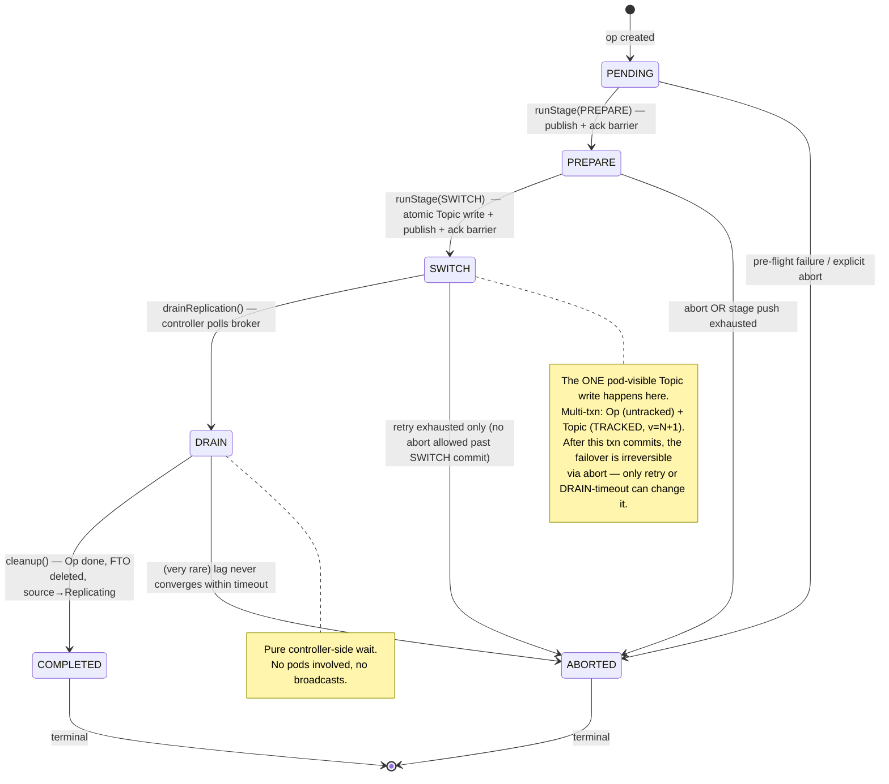
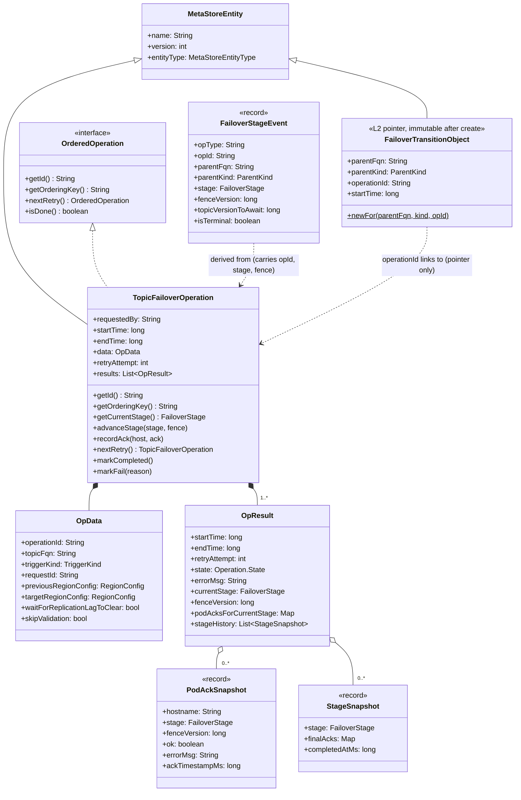
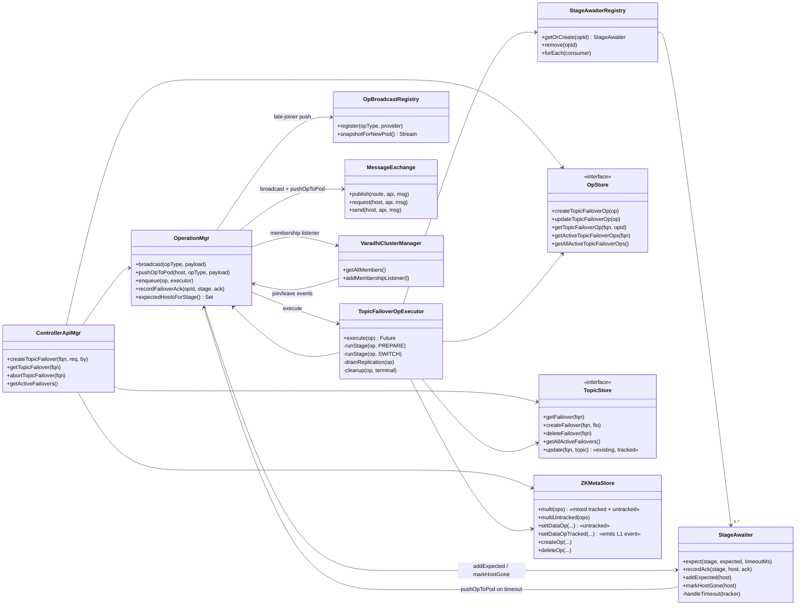
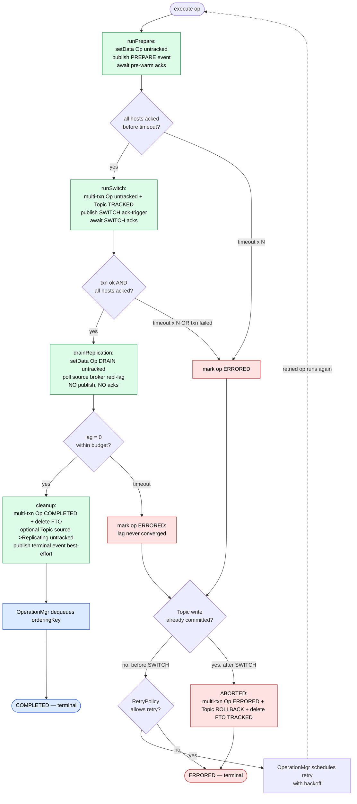
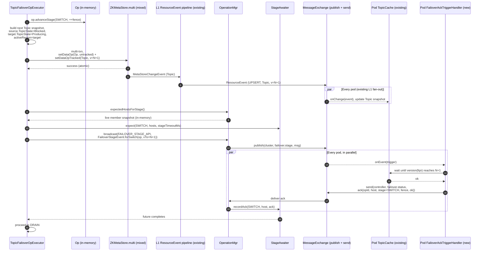
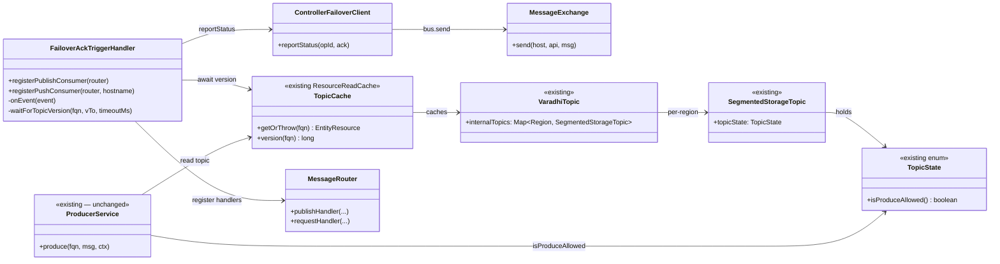
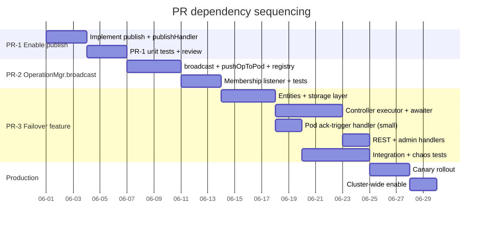

# Topic Failover — Low Level Design (LLD)

> **Status:** Implementation spec for grooming + Phase-1 build
> **Audience:** Engineers implementing the topic-failover feature in OSS Varadhi
> **Parent doc:** [`topic-failover-c4-design.md`](topic-failover-c4-design.md) — read first for the C4-level rationale and trade-offs
> **Scope:** This document specifies every new and modified class, method signature, ZK path, configuration key, retry policy, threading rule, and test case needed to implement the design. It does **not** re-justify the architectural choices — see the parent doc for that.

---

## 1. Implementation overview

### 1.1 Design summary

> *"Failover is a single `OrderedOperation` (like `SubscriptionOperation`) whose orchestrator mutates per-region `TopicState` at one point — `SWITCH`. The existing `TopicCache` + L1 `ResourceEventProcessor` pipeline + `ProducerService` gate already handle the pod-side propagation. The only new wire trick is `OperationMgr.broadcast`-ing a small `FailoverStageEvent` so the orchestrator knows when all pods have applied each stage."*

That sentence describes the full pod-side design. The pod adds **~60 LOC** total. Everything else is controller-side orchestration that reuses existing OSS primitives (`OperationMgr` queue, `StageAwaiter` barrier, Curator multi-txn for atomicity).

### 1.2 What's new vs. reused

| Concern | Mechanism | New? |
|---|---|---|
| Persist the orchestration intent + history | `TopicFailoverOperation` in `OpStore` | NEW entity |
| Per-parent active-failover index | `FailoverTransitionObject` (FTO) under `Topic/.../Failover` — **pointer only**, written twice in its lifetime | NEW entity |
| Pod-side state holding the produce-gate | Per-region `SegmentedStorageTopic.topicState` on `VaradhiTopic` | **Existing** |
| Pod-side cache | `TopicCache` (existing `ResourceReadCache<VaradhiTopic>`) | **Existing** |
| Pod-side produce gate | `ProducerService` already checks `internalTopic.getTopicState().isProduceAllowed()` | **Existing** |
| Controller → pods, state propagation | Tracked Topic write → L1 `ResourceEventProcessor` pipeline | **Existing** |
| Controller → pods, barrier trigger | `OperationMgr.broadcast(opType, payload)` → Vert.x `publish` | NEW capability |
| Pod-side trigger handler | `FailoverAckTriggerHandler` (~30 LOC) | NEW |
| Pod → controller, ack | P2P via `MessageExchange.send` | **Existing** primitive |
| Per-stage barrier on controller | `StageAwaiter` (in-memory, per active op) | NEW |
| Membership-aware late-joiner / leaver handling | `MembershipListener` + `OpBroadcastRegistry` | NEW |

### 1.3 Stage model

```
PREPARE   → publish-only event, pods pre-warm, ack             (no Topic write)
SWITCH    → ONE tracked Topic write + ack-trigger, pods ack    (the only pod-visible state flip)
DRAIN     → controller polls source broker replication lag     (no pod involvement at all)
COMPLETED → cleanup: mark Op done, delete FTO                  (no pod-visible change)
ABORTED   → terminal-failure: rollback Topic to previous, mark Op ERRORED, delete FTO
```

There is exactly **one** tracked Topic write per failover (at `SWITCH`), which flips both `source.TopicState` (→ `Blocked`) and `target.TopicState` (→ `Producing`) and any routing config (`activeRegion`) in a single atomic transaction.

### 1.4 PR sequencing

Three independent change-sets, sequenced as separate PRs for reviewability:

| PR | Title | Scope | Approx. LoC |
|---|---|---|---|
| **PR-1** | Enable `publish` in OSS cluster layer | Implement `MessageExchange.publish` and `MessageRouter.publishHandler`; unit tests | ~80 (incl. tests) |
| **PR-2** | `OperationMgr.broadcast` capability | Add `OpBroadcastRegistry`, `broadcast`, `pushOpToPod`, membership listener; unit tests | ~250 |
| **PR-3** | Topic failover feature | All failover-specific code: entities, store, executor, awaiter, REST, pod-side ack-trigger handler | ~1,800 |

PR-1 and PR-2 are independently useful (future best-effort broadcasts can reuse them). PR-3 depends on both.

---

## 2. Package / module layout

All packages relative to `com.flipkart.varadhi`.

```text
core/
├── cluster/
│   ├── MessageExchange.java                          [MODIFIED — publish impl]
│   ├── MessageRouter.java                            [MODIFIED — publishHandler impl]
│   └── broadcast/                                    [NEW package]
│       ├── BroadcastableOp.java                      [NEW interface]
│       └── OpBroadcastRegistry.java                  [NEW class]

entities/
├── cluster/
│   ├── TopicFailoverOperation.java                   [NEW — Op carrying currentStage, fenceVersion, stageHistory]
│   └── FailoverStageEvent.java                       [NEW — unified broadcast payload]
└── failover/                                         [NEW package]
    ├── FailoverTransitionObject.java                 [NEW — L2 entity, pointer only]
    ├── FailoverStage.java                            [NEW enum — PENDING/PREPARE/SWITCH/DRAIN/COMPLETED/ABORTED]
    ├── PodAckSnapshot.java                           [NEW value]
    ├── StageSnapshot.java                            [NEW value — per-stage history entry]
    └── TriggerKind.java                              [NEW enum — MANUAL | AUTO]

spi/
└── db/
    ├── TopicStore.java                               [MODIFIED — failover CRUD]
    └── OpStore.java                                  [MODIFIED — topicFailoverOps CRUD]

metastore-zk/
└── db/
    ├── ZNode.java                                    [MODIFIED — TOPIC_FAILOVER, TOPIC_FAILOVER_OP kinds]
    ├── ZKMetaStore.java                              [MODIFIED — multi() helper for tracked+untracked mix]
    ├── TopicStoreImpl.java                           [MODIFIED — failover CRUD impl]
    └── OpStoreImpl.java                              [MODIFIED — topicFailoverOps CRUD impl]

controller/
├── OperationMgr.java                                 [MODIFIED — broadcast, pushOpToPod, membership listener]
├── ControllerApiMgr.java                             [MODIFIED — createTopicFailover, abort, getActive]
├── ControllerApiHandler.java                         [MODIFIED — failover.status route]
├── stage/                                            [NEW package]
│   ├── StageAwaiter.java                             [NEW]
│   ├── StageAwaiterRegistry.java                     [NEW]
│   └── PerStageAckTracker.java                       [NEW inner data structure]
└── impl/opexecutors/
    └── TopicFailoverOpExecutor.java                  [NEW — runs PREPARE/SWITCH/DRAIN/COMPLETED]

server/  (and consumer/)
├── failover/                                         [NEW package — tiny: ~60 LOC total]
│   ├── FailoverAckTriggerHandler.java                [NEW — publish consumer + ack sender]
│   └── ControllerFailoverClient.java                 [NEW — thin send stub]
└── ProducerService.java                              [UNCHANGED — existing TopicState gate suffices]

web/
└── v1/admin/
    ├── TopicFailoverHandlers.java                    [NEW REST routes]
    └── AdminFailoverHandlers.java                    [NEW — /admin/failovers/active]

entities/web/
├── TopicFailoverRequest.java                         [NEW DTO]
└── TopicFailoverTransition.java                      [NEW response DTO]
```

---

## 3. Configuration

All new config keys, with defaults and grouping. Lives in `ControllerConfig` (existing) or in a new `FailoverConfig` nested record.

```yaml
controller:
  operationMgr:
    maxConcurrentOps: 32              # existing
  failover:
    stageTimeoutMs: 5000              # NEW — StageAwaiter per-stage ack timeout (PREPARE, SWITCH)
    pushRetryMaxAttempts: 3           # NEW — targeted resend retries before op ERRORED
    pushRetryBackoffMs: 500           # NEW — fixed backoff between push retries
    drainPollIntervalMs: 2000         # NEW — interval between source-broker lag polls during DRAIN
    drainTimeoutMs: 300000            # NEW — 5min max wait for source replication lag to reach 0
    requestIdLookbackWindowMs: 600000 # NEW — 10min idempotency window for requestId
    retentionDays: 30                 # NEW — completed Op retention
    retentionSweepIntervalMs: 3600000 # NEW — 1h background sweep
  failoverRetryPolicy:
    maxAttempts: 3                    # NEW — op-level retry budget (RetryPolicy)
    backoffSeconds: [10, 30, 120]     # NEW — per-attempt backoff schedule

pod:
  failover:
    podSwitchWaitMs: 5000             # NEW — max time FailoverAckTriggerHandler waits for TopicCache to reach topicVersionToAwait at SWITCH
    podPollIntervalMs: 25             # NEW — sleep between TopicCache version polls (typical L1 propagation is sub-100ms)

publish:
  cluster:
    deliveryTimeoutMs: 2000           # NEW — Vert.x DeliveryOptions for publish
```

Loaded as:

```java
@Data @NoArgsConstructor
public class FailoverConfig {
    private long stageTimeoutMs                 = 5_000;
    private int  pushRetryMaxAttempts           = 3;
    private long pushRetryBackoffMs             = 500;
    private long requestIdLookbackWindowMs      = 600_000;
    private int  retentionDays                  = 30;
    private long retentionSweepIntervalMs       = 3_600_000;
}
```

---

## 4. Domain entities — full class definitions

### 4.1 `FailoverStage` enum

```java
package com.flipkart.varadhi.entities.failover;

public enum FailoverStage {
    PENDING,     // op created but no stage applied yet (transient)
    PREPARE,     // pods pre-warm target connections; no Topic write
    SWITCH,      // ONE atomic Topic write flips source.TopicState→Blocked,
                 // target.TopicState→Producing, activeRegion→target.
                 // Past this stage, abort is rejected (409).
    DRAIN,       // controller polls source-broker replication lag until 0.
                 // No pod involvement, no broadcast, no Topic write.
    COMPLETED,   // terminal-success: Op marked done, FTO deleted, source set to Replicating (untracked).
    ABORTED;     // terminal-failure: rollback Topic to previous regionConfigs, mark Op ERRORED, delete FTO.

    public boolean isTerminal()   { return this == COMPLETED || this == ABORTED; }
    public boolean isPreCommit()  { return this == PENDING || this == PREPARE; }
    public boolean isAbortable()  { return this == PENDING || this == PREPARE; }
    public boolean requiresAck()  { return this == PREPARE || this == SWITCH; }
}
```

**State machine:**



### 4.2 `FailoverTransitionObject` (L2 entity — pointer only)

The FTO is **immutable after creation** and serves three purposes only:

1. **Discoverability** — `Topic/{fqn}/Failover` exists iff there's an active failover (O(1) ZK check; no OpStore scan needed).
2. **Topic-delete guard** — controller rejects topic delete when FTO exists.
3. **Admin / leader-rehydration anchor** — `GET /failover` and "list all active failovers" walk FTOs → linked Ops.

It carries no stage or fence — those live on the Op. **Written exactly twice in its lifetime**: at Phase 0 (create) and at terminal cleanup (delete). Never updated.

```java
package com.flipkart.varadhi.entities.failover;

import com.flipkart.varadhi.entities.MetaStoreEntity;
import com.flipkart.varadhi.entities.MetaStoreEntityType;
import com.fasterxml.jackson.annotation.JsonCreator;
import lombok.Getter;
import lombok.EqualsAndHashCode;

@Getter
@EqualsAndHashCode(callSuper = true)
public final class FailoverTransitionObject extends MetaStoreEntity {

    public enum ParentKind { TOPIC, SUBSCRIPTION }

    private final String     parentFqn;
    private final ParentKind parentKind;
    private final String     operationId;     // back-pointer to the rich Op in OpStore
    private final long       startTime;

    @JsonCreator
    FailoverTransitionObject(
        String parentFqn, int version, ParentKind parentKind,
        String operationId, long startTime
    ) {
        super(parentFqn, version, MetaStoreEntityType.TOPIC_FAILOVER);
        this.parentFqn   = parentFqn;
        this.parentKind  = parentKind;
        this.operationId = operationId;
        this.startTime   = startTime;
    }

    public static FailoverTransitionObject newFor(
        String parentFqn, ParentKind parentKind, String opId
    ) {
        return new FailoverTransitionObject(
            parentFqn, 0, parentKind, opId, System.currentTimeMillis()
        );
    }
}
```

> **Why no `currentStage` / `fenceVersion` on FTO?** Stage progression lives on the Op (`TopicFailoverOperation.currentStage`, `fenceVersion`). The FTO is a pure index. Keeping these fields off FTO means:
> - No per-stage FTO write (multi-txn at SWITCH only writes Op + Topic, not FTO).
> - No conceptual "two sources of truth for stage."
> - FTO updates are limited to create / delete, simplifying versioning.

### 4.3 `TopicFailoverOperation` (Op entity)

Modeled directly after `SubscriptionOperation`. Same `MetaStoreEntity` + `OrderedOperation` shape.

**The Op is the single source of truth for failover stage state** — `currentStage`, `fenceVersion`, and per-stage history all live here (inside `OpResult`). The FTO carries no stage data; it's a discovery pointer only.

For a topic, this is a **single Op with no child sub-ops** — every pod does the same work for each stage, so there's no per-shard / per-pod unit that justifies a child `Operation` znode. Per-pod ack tracking is done in-memory by `StageAwaiter`, not persisted as child ops. (Subscription failover, where each shard is independent work on a specific consumer pod, would naturally use the existing `SubscriptionOperation` + `ShardOperation` parent/child pattern — see §16.)

```java
package com.flipkart.varadhi.entities.cluster;

@Getter
@EqualsAndHashCode(callSuper = true)
public class TopicFailoverOperation extends MetaStoreEntity implements OrderedOperation {

    private final String         requestedBy;
    private final long           startTime;
    private long                 endTime;
    private final OpData         data;             // immutable input
    private final int            retryAttempt;
    private final List<OpResult> results;          // results[0] = latest attempt; index = retry depth

    @JsonCreator
    TopicFailoverOperation(/* same shape as SubscriptionOperation */) { ... }

    /** Factory — used by ControllerApiMgr.createTopicFailover. */
    public static TopicFailoverOperation create(
        String topicFqn, RegionConfig from, RegionConfig to,
        TriggerKind kind, String requestId, String requestedBy,
        boolean waitForLag, boolean skipValidation
    ) {
        OpData d = new OpData(
            UUID.randomUUID().toString(), topicFqn, kind, requestId,
            from, to, waitForLag, skipValidation
        );
        return new TopicFailoverOperation(d, requestedBy);
    }

    @JsonIgnore @Override public String          getId()           { return data.getOperationId(); }
    @JsonIgnore @Override public String          getOrderingKey()  { return "Topic_" + data.getTopicFqn(); }
    @JsonIgnore @Override public Operation.State getState()        { return results.get(0).state; }
    @JsonIgnore @Override public String          getErrorMsg()     { return results.get(0).errorMsg; }
    @JsonIgnore @Override public boolean         isDone()          { return results.get(0).isDone(); }
    @JsonIgnore @Override public boolean         hasFailed()       { return results.get(0).hasFailed(); }
    @JsonIgnore public FailoverStage             getCurrentStage() { return results.get(0).currentStage; }

    @Override public void markFail(String reason)  { results.get(0).markFail(reason); endTime = now(); }
    @Override public void markCompleted()          { results.get(0).markCompleted();  endTime = now(); }

    @Override public TopicFailoverOperation nextRetry() { /* prepend OpResult, return new instance */ }

    public void advanceStage(FailoverStage s, long fence) { results.get(0).advanceStage(s, fence); }
    public void recordAck(String host, PodAckSnapshot ack) { results.get(0).recordAck(host, ack); }

    // ---- OpData : the immutable input ----
    @Data @AllArgsConstructor @NoArgsConstructor
    public static class OpData {
        private String       operationId;
        private String       topicFqn;
        private TriggerKind  triggerKind;
        private String       requestId;
        private RegionConfig previousRegionConfig;
        private RegionConfig targetRegionConfig;
        private boolean      waitForReplicationLagToClear;
        private boolean      skipValidation;
    }

    // ---- OpResult : per-attempt mutable outcome ----
    @Data
    public static class OpResult {
        private long                                  startTime;
        private long                                  endTime;
        private int                                   retryAttempt;
        private Operation.State                       state;             // IN_PROGRESS | COMPLETED | ERRORED
        private String                                errorMsg;
        private FailoverStage                         currentStage;
        private long                                  fenceVersion;
        private Map<String, PodAckSnapshot>           podAcksForCurrentStage;
        private List<StageSnapshot>                   stageHistory;

        public static OpResult of(int retry) { ... }
        public boolean isDone()    { return state == COMPLETED || state == ERRORED; }
        public boolean hasFailed() { return state == ERRORED; }

        void advanceStage(FailoverStage s, long fence) {
            if (currentStage != null && currentStage != FailoverStage.PENDING) {
                stageHistory.add(new StageSnapshot(currentStage, podAcksForCurrentStage, System.currentTimeMillis()));
            }
            currentStage = s;
            fenceVersion = fence;
            podAcksForCurrentStage = new HashMap<>();
        }
        void recordAck(String host, PodAckSnapshot ack) { podAcksForCurrentStage.put(host, ack); }
        void markFail(String r)   { state = ERRORED;   errorMsg = r; endTime = System.currentTimeMillis(); }
        void markCompleted()      { state = COMPLETED;               endTime = System.currentTimeMillis(); }
    }
}
```

### 4.4 Supporting value types

```java
public record PodAckSnapshot(
    String          hostname,
    FailoverStage   stage,
    long            fenceVersion,
    boolean         ok,
    String          errorMsg,
    long            ackTimestampMs
) {}

public record StageSnapshot(
    FailoverStage                   stage,
    Map<String, PodAckSnapshot>     finalAcks,
    long                            completedAtMs
) {}

public enum TriggerKind { MANUAL, AUTO }
```

### 4.5 Broadcast payload — `FailoverStageEvent`

Unified event type for all publish-driven stages. Carries the optional `topicVersionToAwait` field — non-zero only for stages that flip Topic state (today: `SWITCH`). The pod handler waits for `TopicCache` to reach that version before acking; for `PREPARE` (no Topic write), `topicVersionToAwait = 0` and the handler acks immediately after running its local pre-warm action.

```java
package com.flipkart.varadhi.entities.cluster;

public record FailoverStageEvent(
    String                                opType,                 // "topic_failover"
    String                                opId,                   // back-pointer to the Op
    String                                parentFqn,
    FailoverTransitionObject.ParentKind   parentKind,
    FailoverStage                         stage,                  // PREPARE | SWITCH | (terminal cleanup)
    long                                  fenceVersion,           // monotonic per op; pods dedupe / ignore stale
    long                                  topicVersionToAwait,    // 0 = no wait (e.g., PREPARE); >0 = wait for TopicCache version
    boolean                               isTerminal              // true on COMPLETED / ABORTED cleanup publish
) {
    /** Standard non-terminal event for a stage that doesn't depend on a Topic version. */
    public static FailoverStageEvent forPrepare(TopicFailoverOperation op) {
        return new FailoverStageEvent(
            "topic_failover", op.getId(),
            op.getData().getTopicFqn(), FailoverTransitionObject.ParentKind.TOPIC,
            FailoverStage.PREPARE, op.getCurrentFenceVersion(),
            0L, false
        );
    }

    /** SWITCH event — pods must wait for the Topic version that committed alongside the Op. */
    public static FailoverStageEvent forSwitch(TopicFailoverOperation op, long topicVersionToAwait) {
        return new FailoverStageEvent(
            "topic_failover", op.getId(),
            op.getData().getTopicFqn(), FailoverTransitionObject.ParentKind.TOPIC,
            FailoverStage.SWITCH, op.getCurrentFenceVersion(),
            topicVersionToAwait, false
        );
    }

    /** Terminal cleanup publish — pods need no produce-gate action; this is purely best-effort cache eviction. */
    public static FailoverStageEvent forTerminal(TopicFailoverOperation op, FailoverStage terminal) {
        return new FailoverStageEvent(
            "topic_failover", op.getId(),
            op.getData().getTopicFqn(), FailoverTransitionObject.ParentKind.TOPIC,
            terminal, op.getCurrentFenceVersion() + 1,
            0L, true
        );
    }
}
```

> **Note: `DRAIN` does not publish.** It's a controller-only wait on source broker replication lag. No pod involvement, no broadcast.

### 4.6 REST DTOs

```java
package com.flipkart.varadhi.entities.web;

public record TopicFailoverRequest(
    @NotBlank String  toRegion,
    boolean           waitForReplicationLagToClear,
    boolean           skipValidation,
    @Nullable String  requestId        // client-supplied idempotency token; server generates if null
) {}

public record TopicFailoverTransition(
    String                            topicFqn,
    String                            operationId,
    long                              startTime,
    long                              endTime,            // 0 if running
    FailoverStage                     currentStage,
    Operation.State                   opState,
    String                            errorMsg,           // populated on ERRORED / ABORTED
    String                            requestedBy,
    Map<String, PodAckSnapshot>       perPodAcks,
    List<StageSnapshot>               stageHistory,
    int                               retryAttempt
) {
    public static TopicFailoverTransition from(
        FailoverTransitionObject fto, TopicFailoverOperation op
    ) {
        var r0 = op.getResults().get(0);
        return new TopicFailoverTransition(
            op.getData().getTopicFqn(), op.getId(),
            op.getStartTime(), op.getEndTime(),
            r0.getCurrentStage(), r0.getState(), r0.getErrorMsg(),
            op.getRequestedBy(), r0.getPodAcksForCurrentStage(),
            r0.getStageHistory(), op.getRetryAttempt()
        );
    }
    public static TopicFailoverTransition fromTerminalOp(TopicFailoverOperation op) {
        // FTO may already be deleted; return a snapshot derived from Op only.
    }
}
```

### 4.7 Entity relationships at a glance



---

## 5. Storage layer

### 5.1 `ZNode` additions

```java
// ZNode.java additions
public static final ZNodeKind TOPIC_FAILOVER     = new ZNodeKind("Failover", "Topic/%s/Failover", false);
public static final ZNodeKind SUB_FAILOVER       = new ZNodeKind("Failover", "Subscription/%s/Failover", false);
public static final ZNodeKind TOPIC_FAILOVER_OP  = new ZNodeKind("TopicFailoverOperation", "TopicFailoverOperation/%s/%s", false);

public static ZNode ofTopicFailover(String topicFqn) {
    return new ZNode("Failover", TOPIC_FAILOVER.kind(),
        TOPIC_FAILOVER.resolvePath(ENTITIES_BASE_PATH, topicFqn));
}
public static ZNode ofSubFailover(String subFqn) {
    return new ZNode("Failover", SUB_FAILOVER.kind(),
        SUB_FAILOVER.resolvePath(ENTITIES_BASE_PATH, subFqn));
}
public static ZNode ofTopicFailoverOp(String topicFqn, String opId) {
    return new ZNode(opId, TOPIC_FAILOVER_OP.kind(),
        TOPIC_FAILOVER_OP.resolvePath(ENTITIES_BASE_PATH, topicFqn, opId));
}
```

### 5.2 `TopicStore` SPI additions

FTO is immutable after creation, so the SPI only needs create / delete / read. Topic writes use the **existing** tracked-update API (`update(topicFqn, topic)`) — that's what triggers the L1 `ResourceEventProcessor` pipeline.

```java
public interface TopicStore {
    // ... existing methods unchanged (incl. tracked update(topicFqn, topic)) ...

    /** Returns null if no active failover for this topic. */
    FailoverTransitionObject getFailover(String topicFqn);

    boolean failoverExists(String topicFqn);

    void createFailover(String topicFqn, FailoverTransitionObject fto);

    void deleteFailover(String topicFqn);

    /** Cluster-wide scan for /admin/failovers/active and leader-election rehydration. */
    List<FailoverTransitionObject> getAllActiveFailovers();
}
```

Implementation in `TopicStoreImpl`:

```java
@Override
public FailoverTransitionObject getFailover(String topicFqn) {
    ZNode node = ZNode.ofTopicFailover(topicFqn);
    if (!zkMetaStore.zkPathExists(node)) return null;
    return zkMetaStore.getZNodeDataAsPojo(node, FailoverTransitionObject.class);
}

@Override
public void createFailover(String topicFqn, FailoverTransitionObject fto) {
    ZNode node = ZNode.ofTopicFailover(topicFqn);
    zkMetaStore.createZNodeWithData(node, fto);   // UNTRACKED — no event sentinel
}

@Override
public void deleteFailover(String topicFqn) {
    ZNode node = ZNode.ofTopicFailover(topicFqn);
    zkMetaStore.deleteZNode(node);                 // UNTRACKED
}

@Override
public List<FailoverTransitionObject> getAllActiveFailovers() {
    // Scan all topics, return those with a Failover child znode.
    // Could be optimised later via an indexed subtree if needed.
    return listAllTopicFqns().stream()
        .map(this::getFailover)
        .filter(Objects::nonNull)
        .toList();
}
```

> **Why no `updateFailover`?** The FTO is immutable after `createFailover`. Stage progression lives on the `TopicFailoverOperation`, not the FTO. Eliminating the update path also removes a class of "stale-FTO" bugs and shrinks the multi-txn at SWITCH (Op + Topic only, no FTO).

### 5.3 `OpStore` SPI additions

```java
public interface OpStore {
    // ... existing methods unchanged ...

    void createTopicFailoverOp(TopicFailoverOperation op);
    TopicFailoverOperation getTopicFailoverOp(String topicFqn, String opId);
    void updateTopicFailoverOp(TopicFailoverOperation op);

    List<TopicFailoverOperation> getActiveTopicFailoverOps(String topicFqn);
    List<TopicFailoverOperation> getAllTopicFailoverOps(String topicFqn);   // history (active + completed)
    List<TopicFailoverOperation> getAllActiveTopicFailoverOps();            // cluster-wide; for leader rehydration
}
```

All writes go through `zkMetaStore.createZNodeWithData` / `updateZNodeWithData` / `deleteZNode` — **never** the tracked variants. This matches the existing `SubscriptionOperation` behavior.

### 5.4 `ZKMetaStore` multi-txn helper

The orchestrator uses Curator multi-txn at three distinct moments in a failover; each needs a different mix of tracked vs. untracked CuratorOps. The helper exposes both flavors so the caller controls L1 emission per-op.

```java
public class ZKMetaStore {
    // ... existing fields ...

    /** Atomically apply N operations. Any op may be tracked (emits event sentinel) or untracked. */
    public void multi(List<CuratorOp> ops) {
        try {
            curator.transaction().forOperations(ops);
        } catch (Exception e) {
            throw new MetaStoreException("Multi-txn failed: " + e.getMessage(), e);
        }
    }

    /** Convenience for the common "all untracked" case (e.g., Phase 0 create, cleanup). */
    public void multiUntracked(List<CuratorOp> ops) { multi(ops); }

    // --- Untracked op builders (no L1 emission) ---
    public CuratorOp setDataOp(ZNode node, Object data) {
        byte[] bytes = JsonMapper.jsonSerializeAsBytes(data);
        return curator.transactionOp().setData().forPath(node.getPath(), bytes);
    }
    public CuratorOp createOp(ZNode node, Object data) { ... }
    public CuratorOp deleteOp(ZNode node)               { ... }

    // --- Tracked op builders (emit event sentinel, drive L1 ResourceEventProcessor) ---
    public CuratorOp setDataOpTracked(ZNode node, Object data) {
        // emits the same sentinel as updateTrackedZNodeWithData but composes in a multi-txn
        ...
    }
}
```

**Where each combination is used in the failover flow:**

| Moment | CuratorOps | Why |
|---|---|---|
| **Phase 0 create** | `createOp(FTO)` + `createOp(Op)` | All untracked; FTO and Op are private state |
| **PREPARE advance** | `setDataOp(Op)` | Single untracked write; no Topic write |
| **SWITCH commit** | `setDataOp(Op)` + **`setDataOpTracked(Topic)`** | Op untracked + Topic tracked → triggers L1 propagation to every pod's `TopicCache` |
| **DRAIN advance** | `setDataOp(Op)` | Single untracked write; controller-only stage |
| **COMPLETED cleanup** | `setDataOp(Op, state=COMPLETED)` + `deleteOp(FTO)` (+ optional `setDataOp(Topic, source→Replicating)` untracked) | All untracked; pods don't need to react |
| **ABORTED rollback** | `setDataOp(Op, state=ERRORED)` + `setDataOpTracked(Topic, rollback)` + `deleteOp(FTO)` | Op untracked + Topic tracked rollback + FTO delete |

Used by the orchestrator (§7.2 below).

---

## 6. Core: enable `publish` (PR-1)

### 6.1 `MessageExchange.publish` implementation

```java
public void publish(String routeName, String apiName, ClusterMessage msg) {
    String apiPath = getPath(routeName, apiName, RouteMethod.PUBLISH);
    try {
        vertxEventBus.publish(apiPath, JsonMapper.jsonSerialize(msg), deliveryOptions);
        log.debug("publish({}, {}) sent.", apiPath, msg.getId());
    } catch (Exception e) {
        log.error("publish({}, {}) failed at send: {}", apiPath, msg.getId(), e.getMessage());
        throw new VaradhiException("publish failed: " + e.getMessage(), e);
    }
}
```

### 6.2 `MessageRouter.publishHandler` implementation

```java
public void publishHandler(String routeName, String apiName, MsgHandler handler) {
    String apiPath = getApiPath(routeName, apiName, RouteMethod.PUBLISH);
    vertxEventBus.consumer(apiPath, message -> {
        ClusterMessage msg = JsonMapper.jsonDeserialize((String) message.body(), ClusterMessage.class);
        log.debug("publish handler({}, {}) received.", apiPath, msg.getId());
        try {
            handler.handle(msg);
        } catch (Exception e) {
            log.error("publish handler({}, {}) error: {}", apiPath, msg.getId(), e.getMessage());
        }
        // No reply — publish is fire-and-forget by design.
    });
}
```

### 6.3 `RouteMethod` enum addition

```java
public enum RouteMethod { SEND, REQUEST, PUBLISH }
```

### 6.4 PR-1 tests

```java
class MessageExchangePublishTest {
    @Test void publishReachesAllConsumers() {
        // 3 consumers on same address; publish once; verify all receive.
    }
    @Test void publishWithNoConsumersDoesNotThrow() {
        // publish before any consumer registers; no error.
    }
    @Test void publishHandlerExceptionIsCaughtAndLogged() {
        // consumer throws; verify other consumers still receive; no propagation to publisher.
    }
    @Test void publishHandlerReceivesPayloadAcrossNodes() {
        // 2-node clustered Vert.x test; publish from node A; verify consumer on node B receives.
    }
}
```

---

## 7. Controller layer

### 7.0 Component dependency map



### 7.1 `OperationMgr` extensions (PR-2)

Two new dependencies on the constructor:

```java
public OperationMgr(
    int maxConcurrentOps,
    OpStore opStore,
    RetryPolicy retryPolicy,
    MessageExchange exchange,                   // NEW
    VaradhiClusterManager clusterManager,       // NEW
    OpBroadcastRegistry broadcastRegistry       // NEW
) {
    // existing init ...
    this.exchange          = exchange;
    this.clusterManager    = clusterManager;
    this.broadcastRegistry = broadcastRegistry;
    registerMembershipListener();
}
```

New public methods:

```java
public static final String CLUSTER_ROUTE          = "cluster";
public static final String FAILOVER_STAGE_API     = "failover.stage";          // publish
public static final String FAILOVER_PUSH_API      = "failover.stage.push";     // P2P request

/**
 * Publish-fan-out for any broadcastable op. Fire-and-forget.
 * <p>
 * Note: this does NOT broadcast the Op object itself — it broadcasts an
 * op-stamped event payload (e.g. {@link FailoverStageEvent}). The Op stays
 * in OpStore; only the event reaches the pods. Pods that miss the publish
 * are detected by {@link StageAwaiter} (missing ack) and recovered via
 * targeted P2P resend ({@link #pushOpToPod}).
 */
public <E> void broadcast(String apiName, E payload) {
    try {
        exchange.publish(CLUSTER_ROUTE, apiName, ClusterMessage.of(payload));
    } catch (Exception e) {
        log.error("broadcast({}) failed: {}", apiName, e.getMessage());
        // Do NOT throw — the orchestrator's StageAwaiter will detect missing acks
        // and trigger targeted resends via pushOpToPod.
    }
}

/** Targeted P2P resend (used by StageAwaiter on ack-timeout and membership-listener on pod join). */
public <E> CompletableFuture<Void> pushOpToPod(String hostname, String apiName, E payload) {
    return exchange.request(hostname, apiName, ClusterMessage.of(payload))
                   .thenApply(resp -> null);
}

/**
 * In-memory snapshot of currently-live members, maintained by the
 * MembershipListener (no per-call cluster round trip). Used by the
 * orchestrator to seed the StageAwaiter's expected set.
 */
public Set<String> expectedHostsForStage() {
    return Set.copyOf(liveMembers);
}
```

`OpBroadcastRegistry` — a small registry so any op type can opt into late-joiner push:

```java
package com.flipkart.varadhi.core.cluster.broadcast;

public class OpBroadcastRegistry {
    private final Map<String, BroadcastableOpProvider> providers = new ConcurrentHashMap<>();

    public void register(String opType, BroadcastableOpProvider provider) {
        providers.put(opType, provider);
    }

    /** For each registered op type, supply the current snapshots to push. */
    public Stream<Push> snapshotForNewPod() {
        return providers.entrySet().stream()
            .flatMap(e -> e.getValue().currentActive().stream()
                .map(payload -> new Push(e.getKey(), payload)));
    }

    public record Push(String apiName, Object payload) {}

    public interface BroadcastableOpProvider {
        Collection<?> currentActive();      // implementation reads from store
    }
}
```

Membership listener registration — maintains live-member set, drives late-joiner push, and mutates `StageAwaiter` expected sets on join/leave:

```java
private final Set<String> liveMembers = ConcurrentHashMap.newKeySet();

private void registerMembershipListener() {
    // Seed from current cluster snapshot.
    clusterManager.getAllMembers().toCompletableFuture().join()
        .forEach(m -> liveMembers.add(m.hostname()));

    clusterManager.addMembershipListener(new MembershipListener() {
        @Override public CompletableFuture<Void> joined(MemberInfo m) {
            liveMembers.add(m.hostname());

            // (a) Mutate every active StageAwaiter's expected set to include the new host.
            //     The orchestrator must wait for this host on the current stage too.
            stageAwaiterRegistry.forEach(aw -> aw.addExpected(m.hostname()));

            // (b) Late-joiner push: for every active broadcastable op, P2P-resend the
            //     current event to the new pod so it can apply state and ack.
            broadcastRegistry.snapshotForNewPod().forEach(push ->
                pushOpToPod(m.hostname(), push.apiName(), push.payload())
                    .exceptionally(t -> { log.warn("late-joiner push to {} failed: {}", m.hostname(), t.getMessage()); return null; }));

            return CompletableFuture.completedFuture(null);
        }

        @Override public CompletableFuture<Void> left(String hostname) {
            liveMembers.remove(hostname);
            stageAwaiterRegistry.forEach(aw -> aw.markHostGone(hostname));
            return CompletableFuture.completedFuture(null);
        }
    });
}
```

`stageAwaiterRegistry` is a thin singleton holding all live `StageAwaiter`s so the membership listener can notify all of them on pod join/leave.

### 7.2 `TopicFailoverOpExecutor`

**execute() control flow:**



**Detailed sequence of the SWITCH stage** (the only Topic-changing stage):



```java
package com.flipkart.varadhi.controller.impl.opexecutors;

@Slf4j
public class TopicFailoverOpExecutor implements OpExecutor<OrderedOperation> {

    private final OpStore                     opStore;
    private final TopicStore                  topicStore;
    private final ZKMetaStore                 zkMetaStore;
    private final OperationMgr                operationMgr;
    private final StageAwaiterRegistry        awaiterRegistry;
    private final FailoverConfig              config;
    private final VaradhiTopicService         topicService;
    private final ReplicationLagPoller        lagPoller;            // SPI; reads source broker

    @Override
    public CompletableFuture<Void> execute(OrderedOperation op) {
        TopicFailoverOperation fo = (TopicFailoverOperation) op;
        return runPrepare(fo)
            .thenCompose(v -> runSwitch(fo))
            .thenCompose(v -> drainReplication(fo))
            .thenCompose(v -> cleanup(fo, FailoverStage.COMPLETED))
            .exceptionally(t -> { handleFailure(fo, t); return null; });
    }

    // ---------------------------------------------------------------
    // PREPARE: pure publish-only; pods pre-warm; await acks.
    // No Topic write.
    // ---------------------------------------------------------------
    private CompletableFuture<Void> runPrepare(TopicFailoverOperation op) {
        log.info("Failover op {} entering PREPARE", op.getId());

        op.advanceStage(FailoverStage.PREPARE, op.getCurrentFenceVersion() + 1);
        zkMetaStore.multiUntracked(List.of(
            zkMetaStore.setDataOp(opZnode(op), op)
        ));

        Set<String> expected = operationMgr.expectedHostsForStage();
        StageAwaiter awaiter = awaiterRegistry.getOrCreate(op.getId());
        CompletableFuture<Void> done = awaiter.expect(
            FailoverStage.PREPARE, expected, config.getStageTimeoutMs());

        operationMgr.broadcast(
            OperationMgr.FAILOVER_STAGE_API,
            FailoverStageEvent.forPrepare(op));

        return done;
    }

    // ---------------------------------------------------------------
    // SWITCH: the ONE Topic-changing stage. Atomic multi-txn:
    //   - Op (untracked)
    //   - Topic (TRACKED → L1 propagates new TopicState + activeRegion)
    // After commit, broadcast ack-trigger and await pod acks.
    // ---------------------------------------------------------------
    private CompletableFuture<Void> runSwitch(TopicFailoverOperation op) {
        log.info("Failover op {} entering SWITCH", op.getId());

        op.advanceStage(FailoverStage.SWITCH, op.getCurrentFenceVersion() + 1);

        VaradhiTopic next = buildSwitchedTopic(op);   // source→Blocked, target→Producing, activeRegion→target
        long expectedTopicVersion = topicStore.get(next.getName()).getVersion() + 1;

        zkMetaStore.multi(List.of(
            zkMetaStore.setDataOp(opZnode(op), op),                                 // untracked
            zkMetaStore.setDataOpTracked(ZNode.ofTopic(next.getName()), next,
                                         MetaStoreEntityType.TOPIC)                 // TRACKED → L1
        ));

        Set<String> expected = operationMgr.expectedHostsForStage();
        StageAwaiter awaiter = awaiterRegistry.getOrCreate(op.getId());
        CompletableFuture<Void> done = awaiter.expect(
            FailoverStage.SWITCH, expected, config.getStageTimeoutMs());

        operationMgr.broadcast(
            OperationMgr.FAILOVER_STAGE_API,
            FailoverStageEvent.forSwitch(op, expectedTopicVersion));

        return done;
    }

    // ---------------------------------------------------------------
    // DRAIN: controller-only wait on source-broker replication lag.
    // No publish, no acks. Polled at configurable interval up to budget.
    // ---------------------------------------------------------------
    private CompletableFuture<Void> drainReplication(TopicFailoverOperation op) {
        log.info("Failover op {} entering DRAIN", op.getId());
        op.advanceStage(FailoverStage.DRAIN, op.getCurrentFenceVersion() + 1);
        zkMetaStore.multiUntracked(List.of(zkMetaStore.setDataOp(opZnode(op), op)));

        return lagPoller.awaitZero(
            op.getData().getTopicFqn(),
            op.getData().getPreviousRegionConfig().getName(),
            config.getDrainPollIntervalMs(),
            config.getDrainTimeoutMs()
        );
    }

    // ---------------------------------------------------------------
    // Cleanup: terminal multi-txn. No ack barrier; pods don't need
    // to do anything (source-state change is semantically equivalent
    // — both Blocked and Replicating block produce).
    // ---------------------------------------------------------------
    private CompletableFuture<Void> cleanup(TopicFailoverOperation op, FailoverStage terminal) {
        op.markCompleted();
        op.advanceStage(terminal, op.getCurrentFenceVersion() + 1);

        List<CuratorOp> ops = new ArrayList<>();
        ops.add(zkMetaStore.setDataOp(opZnode(op), op));                            // untracked
        ops.add(zkMetaStore.deleteOp(ZNode.ofTopicFailover(op.getData().getTopicFqn()))); // untracked

        // Optional: write source.TopicState = Replicating untracked.
        // No L1 emit needed — produceAllowed is the same as Blocked, pods don't care.
        // Tracked here would be wasteful (extra version bump).
        VaradhiTopic clean = buildPostSwitchTopic(op);
        if (clean != null) {
            ops.add(zkMetaStore.setDataOp(ZNode.ofTopic(clean.getName()), clean));  // untracked
        }

        zkMetaStore.multi(ops);

        // Best-effort terminal publish — informational only; pods have no op-local
        // state to evict (they only hold TopicState via TopicCache, which is already correct).
        // Safe to fail; the L1 pipeline guarantees correct TopicState regardless.
        try {
            operationMgr.broadcast(
                OperationMgr.FAILOVER_STAGE_API,
                FailoverStageEvent.forTerminal(op, terminal));
        } catch (Exception ignore) { /* best-effort */ }

        awaiterRegistry.remove(op.getId());
        return CompletableFuture.completedFuture(null);
    }

    // ---------------------------------------------------------------
    // Failure handling. Distinguishes pre-SWITCH (retry-safe) from
    // post-SWITCH (must rollback Topic to be safe).
    // ---------------------------------------------------------------
    private void handleFailure(TopicFailoverOperation op, Throwable t) {
        log.error("Failover op {} failed at stage {}: {}",
            op.getId(), op.getCurrentStage(), t.getMessage());

        FailoverStage stageAtFailure = op.getCurrentStage();
        if (stageAtFailure == FailoverStage.PREPARE || stageAtFailure == FailoverStage.PENDING) {
            // Pre-SWITCH: no Topic write committed; just mark Op ERRORED.
            // OperationMgr will schedule a retry per its RetryPolicy.
            op.markFail(t.getMessage());
            zkMetaStore.multiUntracked(List.of(zkMetaStore.setDataOp(opZnode(op), op)));
        } else {
            // Post-SWITCH: Topic was already flipped. Roll it back atomically.
            rollbackTopicAndAbort(op, t);
        }
        awaiterRegistry.remove(op.getId());
    }

    private void rollbackTopicAndAbort(TopicFailoverOperation op, Throwable t) {
        op.markFail(t.getMessage());
        op.advanceStage(FailoverStage.ABORTED, op.getCurrentFenceVersion() + 1);

        VaradhiTopic rollback = buildRollbackTopic(op);  // restore previousRegionConfig + TopicState
        zkMetaStore.multi(List.of(
            zkMetaStore.setDataOp(opZnode(op), op),                                 // untracked
            zkMetaStore.setDataOpTracked(ZNode.ofTopic(rollback.getName()), rollback,
                                         MetaStoreEntityType.TOPIC),                // TRACKED — pods see restore
            zkMetaStore.deleteOp(ZNode.ofTopicFailover(op.getData().getTopicFqn())) // untracked
        ));

        // Best-effort terminal publish so any pod-side op tracking is cleared.
        try {
            operationMgr.broadcast(
                OperationMgr.FAILOVER_STAGE_API,
                FailoverStageEvent.forTerminal(op, FailoverStage.ABORTED));
        } catch (Exception ignore) { /* best-effort */ }
    }

    // ---------------------------------------------------------------
    // Helpers
    // ---------------------------------------------------------------
    private ZNode opZnode(TopicFailoverOperation op) {
        return ZNode.ofTopicFailoverOp(op.getData().getTopicFqn(), op.getId());
    }

    private VaradhiTopic buildSwitchedTopic(TopicFailoverOperation op) {
        VaradhiTopic current = topicService.get(op.getData().getTopicFqn());
        // Mutate per-region TopicState + activeRegion. Implementation reads previous/target
        // from op.data and produces a new immutable VaradhiTopic instance.
        ...
    }

    private VaradhiTopic buildPostSwitchTopic(TopicFailoverOperation op) { ... }
    private VaradhiTopic buildRollbackTopic(TopicFailoverOperation op)   { ... }
}
```

> **Phase-5 invariant:** there is exactly **one** tracked Topic write per successful failover (in `runSwitch`). Cleanup writes Topic untracked because the only state change there (source from `Blocked` to `Replicating`) is functionally indistinguishable to pods (`produceAllowed=false` in both). On ABORT, the rollback Topic write IS tracked so pods see the restore.

### 7.3 `StageAwaiter`

Per-op-id in-memory tracker for the current stage. One `StageAwaiter` per active op; held in `StageAwaiterRegistry` keyed by `opId`.

**Internal state machine:**

```mermaid
stateDiagram-v2
    [*] --> IDLE : new StageAwaiter(opId)
    IDLE --> AWAITING : expect(stage, hosts, timeoutMs)
    AWAITING --> AWAITING : recordAck(host) — not yet all hosts
    AWAITING --> COMPLETED : recordAck — all expected hosts acked
    AWAITING --> RESENDING : stageTimeoutMs elapsed,<br/>some hosts still missing
    RESENDING --> AWAITING : pushOpToPod fired<br/>for each missing host
    AWAITING --> ERRORED : pushAttempt > pushRetryMaxAttempts
    AWAITING --> AWAITING : markHostGone(h)<br/>— may auto-complete if remaining acked
    COMPLETED --> IDLE : next expect() call
    ERRORED --> [*] : op marked ERRORED;<br/>OperationMgr retry path begins
```



```java
@Slf4j
public class StageAwaiter {
    private final String                  opId;
    private final OperationMgr            operationMgr;
    private final ScheduledExecutorService scheduler;
    private final FailoverConfig          config;

    private volatile PerStageAckTracker  current;     // for the in-flight stage

    public synchronized CompletableFuture<Void> expect(
        FailoverStage stage, Set<String> expected, long timeoutMs
    ) {
        if (current != null && !current.future.isDone()) {
            log.warn("expect({}) called while {} still active for op {}; overriding.",
                stage, current.stage, opId);
            current.future.completeExceptionally(new IllegalStateException("superseded"));
        }
        PerStageAckTracker tracker = new PerStageAckTracker(stage, expected);
        current = tracker;
        scheduleTimeout(tracker, timeoutMs);
        return tracker.future;
    }

    public synchronized void recordAck(FailoverStage stage, String host, PodAckSnapshot ack) {
        if (current == null || current.stage != stage) {
            log.warn("ack for stale stage {} (current={}) on op {}; ignoring.",
                stage, current == null ? "<none>" : current.stage, opId);
            return;
        }
        current.acks.put(host, ack);
        if (current.acks.keySet().containsAll(current.expected)) {
            current.future.complete(null);
        }
    }

    public synchronized void markHostGone(String hostname) {
        if (current == null) return;
        current.expected.remove(hostname);
        // If now satisfied, complete.
        if (current.acks.keySet().containsAll(current.expected)) {
            current.future.complete(null);
        }
    }

    /**
     * Called by MembershipListener.joined: a new pod joined mid-stage and must
     * be added to the expected set so the awaiter doesn't complete prematurely.
     * OperationMgr will also fire a P2P pushOpToPod so the new pod gets the
     * event without waiting for the next publish.
     */
    public synchronized void addExpected(String hostname) {
        if (current == null) return;
        if (current.expected.add(hostname)) {
            log.info("op {} stage {}: added late-joiner {} to expected set",
                opId, current.stage, hostname);
        }
    }

    private void scheduleTimeout(PerStageAckTracker tracker, long timeoutMs) {
        scheduler.schedule(() -> handleTimeout(tracker), timeoutMs, TimeUnit.MILLISECONDS);
    }

    private void handleTimeout(PerStageAckTracker tracker) {
        if (tracker.future.isDone()) return;
        Set<String> missing = new HashSet<>(tracker.expected);
        missing.removeAll(tracker.acks.keySet());
        log.warn("Stage {} for op {} timed out; {} hosts missing: {}",
            tracker.stage, opId, missing.size(), missing);
        tracker.pushAttempt++;
        if (tracker.pushAttempt > config.getPushRetryMaxAttempts()) {
            tracker.future.completeExceptionally(
                new FailoverStageException(tracker.stage,
                    new TimeoutException("hosts did not ack: " + missing)));
            return;
        }
        // Targeted P2P resend.
        FailoverStageEvent ev = buildEventForOp(opId, tracker.stage);
        missing.forEach(host -> operationMgr.pushOpToPod(host, OperationMgr.FAILOVER_PUSH_API, ev)
            .exceptionally(t -> { log.warn("resend to {} failed: {}", host, t.getMessage()); return null; }));
        // Schedule another timeout window for next attempt.
        scheduleTimeout(tracker, config.getStageTimeoutMs());
    }

    static class PerStageAckTracker {
        final FailoverStage              stage;
        final Set<String>                expected;
        final Map<String, PodAckSnapshot> acks      = new ConcurrentHashMap<>();
        final CompletableFuture<Void>    future    = new CompletableFuture<>();
        int                              pushAttempt = 0;
    }
}
```

### 7.4 `ControllerApiMgr` additions

```java
public TopicFailoverTransition createTopicFailover(
    String topicFqn, TopicFailoverRequest req, String requestedBy
) {
    validateRequest(topicFqn, req);                          // §10.1
    checkIdempotency(topicFqn, req.requestId());             // §10.2

    VaradhiTopic topic = topicStore.get(topicFqn);
    RegionConfig from = topic.activeRegionConfig();
    RegionConfig to   = topic.regionConfig(req.toRegion());

    TopicFailoverOperation op = TopicFailoverOperation.create(
        topicFqn, from, to,
        TriggerKind.MANUAL,
        req.requestId() != null ? req.requestId() : UUID.randomUUID().toString(),
        requestedBy,
        req.waitForReplicationLagToClear(),
        req.skipValidation()
    );
    FailoverTransitionObject fto =
        FailoverTransitionObject.newFor(topicFqn, ParentKind.TOPIC, op.getId());

    // Atomic create: Op + FTO in one txn.
    zkMetaStore.multiUntracked(List.of(
        zkMetaStore.createOp(ZNode.ofTopicFailoverOp(topicFqn, op.getId()), op),
        zkMetaStore.createOp(ZNode.ofTopicFailover(topicFqn), fto)
    ));

    operationMgr.enqueueTopicFailoverOp(op, opExecutorFactory.failover(op));
    // No initial publish — TopicFailoverOpExecutor.runPrepare emits the first event itself.

    return TopicFailoverTransition.from(fto, op);
}

public TopicFailoverTransition getTopicFailover(String topicFqn) {
    FailoverTransitionObject fto = topicStore.getFailover(topicFqn);
    if (fto == null) throw new ResourceNotFoundException("no active failover for " + topicFqn);
    TopicFailoverOperation op = opStore.getTopicFailoverOp(topicFqn, fto.getOperationId());
    return TopicFailoverTransition.from(fto, op);
}

public TopicFailoverTransition abortTopicFailover(String topicFqn) {
    FailoverTransitionObject fto = topicStore.getFailover(topicFqn);
    if (fto == null) throw new ResourceNotFoundException("no active failover for " + topicFqn);
    TopicFailoverOperation op = opStore.getTopicFailoverOp(topicFqn, fto.getOperationId());

    // Abort is only honored before the SWITCH txn commits. After SWITCH, the Topic
    // has already been flipped tracked — pods are already on the target — so the
    // only recovery paths are retry-to-completion or post-failure rollback (handled
    // by the executor on stage failure, not by abort).
    if (!op.getCurrentStage().isAbortable()) {
        throw new InvalidOperationForResourceException(
            "failover already at stage " + op.getCurrentStage() + "; abort no longer allowed");
    }
    operationMgr.requestAbort(fto.getOperationId());        // signals the executor's stage future
    return TopicFailoverTransition.from(fto, op);
}

public List<TopicFailoverTransition> getActiveFailovers() {
    return topicStore.getAllActiveFailovers().stream()
        .map(fto -> {
            TopicFailoverOperation op =
                opStore.getTopicFailoverOp(fto.getParentFqn(), fto.getOperationId());
            return TopicFailoverTransition.from(fto, op);
        })
        .toList();
}
```

### 7.5 `ControllerApiHandler` route addition

```java
public class ControllerApiHandler {
    public CompletableFuture<ResponseMessage> failoverStatus(ClusterMessage msg) {
        FailoverStatusUpdate update = msg.getRequest(FailoverStatusUpdate.class);
        try {
            operationMgr.recordFailoverAck(
                update.opId(), update.stage(),
                new PodAckSnapshot(update.hostname(), update.stage(), update.fenceVersion(),
                    update.ok(), update.errorMsg(), System.currentTimeMillis())
            );
            return CompletableFuture.completedFuture(msg.getResponseMessage(new SimpleAck("recorded")));
        } catch (Exception e) {
            log.error("failover.status handler error: {}", e.getMessage());
            return CompletableFuture.completedFuture(msg.getResponseMessage(e));
        }
    }
}

// Registration in ControllerVerticle.setupApiHandlers():
messageRouter.requestHandler(ROUTE_CONTROLLER, "failover.status", handler::failoverStatus);
```

### 7.6 Topic delete guard

```java
// In VaradhiTopicService.delete or ControllerApiMgr.deleteTopic:
public void deleteTopic(String topicFqn) {
    if (topicStore.failoverExists(topicFqn)) {
        FailoverTransitionObject active = topicStore.getFailover(topicFqn);
        TopicFailoverOperation op = opStore.getTopicFailoverOp(topicFqn, active.getOperationId());
        throw new InvalidOperationForResourceException(
            "Cannot delete topic " + topicFqn + " — active failover op " + active.getOperationId() +
            " in stage " + op.getCurrentStage() + ". Abort or wait for completion."
        );
    }
    // ... existing delete logic ...
}
```

> The guard uses the FTO purely as an "active-failover present?" index — the actual stage is read off the Op via the back-pointer. This is the only direct use of FTO outside the orchestrator and admin endpoints.

### 7.7 Leader election rehydration

When a controller becomes leader (`ControllerVerticle.onLeaderElected`):

```java
public void onLeaderElected() {
    // ... existing rehydration ...

    // Rehydrate failover ops by walking OpStore (single source of truth for stage).
    List<TopicFailoverOperation> active = opStore.getAllActiveTopicFailoverOps();
    for (TopicFailoverOperation op : active) {
        operationMgr.enqueueTopicFailoverOp(op, opExecutorFactory.failover(op));

        // Re-publish current stage to re-sync pods (idempotent on pod side via fenceVersion).
        // For SWITCH, also include the topicVersionToAwait so pods can confirm they're on the
        // post-SWITCH Topic snapshot. Pods that already saw the original publish are no-ops.
        if (op.getCurrentStage() == FailoverStage.SWITCH) {
            long topicVersion = topicStore.get(op.getData().getTopicFqn()).getVersion();
            operationMgr.broadcast(
                OperationMgr.FAILOVER_STAGE_API,
                FailoverStageEvent.forSwitch(op, topicVersion));
        } else if (op.getCurrentStage() == FailoverStage.PREPARE) {
            operationMgr.broadcast(
                OperationMgr.FAILOVER_STAGE_API,
                FailoverStageEvent.forPrepare(op));
        }
        // DRAIN / COMPLETED / ABORTED: no re-publish; DRAIN is controller-only,
        // terminal stages have no pod-visible work pending.
    }
}
```

> **OpBroadcastRegistry rehydration:** the registry's `BroadcastableOpProvider` for `topic_failover` reads from `OpStore.getAllActiveTopicFailoverOps()` so the late-joiner push (`OperationMgr.MembershipListener.joined`) automatically picks up the rehydrated ops without any extra wiring.

---

## 8. Pod layer

> **The pod side is intentionally tiny.** The existing `TopicCache` (a `ResourceReadCache<VaradhiTopic>`) already carries per-region `TopicState` and `ProducerService` already gates produce on `internalTopic.getTopicState().isProduceAllowed()`. Failover reuses both unchanged. The pod adds **only** the ack-trigger handler and a thin client to send the ack back.

### 8.0 Component map (post-simplification)

| Component | Status | Purpose |
|---|---|---|
| `FailoverAckTriggerHandler` | **NEW ~30 LOC** | Subscribes to `failover.stage` (publish) and `failover.stage.push` (P2P request). For PREPARE: runs local pre-warm and acks. For SWITCH: waits for TopicCache to reach `topicVersionToAwait`, then acks. |
| `ControllerFailoverClient` | **NEW ~25 LOC** | Thin `MessageExchange.send` stub that posts `FailoverStatusUpdate` to the controller. |
| `TopicCache` (`ResourceReadCache<EntityResource<VaradhiTopic>>`) | **Existing, unchanged** | Already updated by L1 `ResourceEventProcessor` on tracked Topic writes. |
| `ProducerService` | **Existing, unchanged** | Already checks `internalTopic.getTopicState().isProduceAllowed()` and short-circuits with `ProduceResult.ofNonProducingTopic(...)`. |
| ~~`FailoverTransitionCache`~~ | **Removed** | TopicCache + per-region `TopicState` does the job. |
| ~~`FailoverTransitionCacheLoader`~~ | **Removed** | TopicCache preload already loads `TopicState` on startup. |
| ~~`FailoverPublishHandler`~~ | **Replaced** by `FailoverAckTriggerHandler` (same role, different payload semantics). |
| ~~`FailoverPushHandler`~~ | **Folded** into `FailoverAckTriggerHandler` (one class, two registrations). |
| ~~`TopicProduceTransitionService`~~ | **Removed** | Stage-driven gate now lives on `TopicState` itself. |
| ~~`NodeStatus`~~ | **Removed** | No per-topic pod-side state holder needed. |
| ~~`FtoReconciler`~~ | **Removed** | Existing TopicCache reconciliation handles drift. |

**Total new pod-side LOC: ~60 (incl. tests this is the surface area).**

### 8.0.1 Component dependency map



### 8.1 `FailoverAckTriggerHandler`

Single class that subscribes to both the publish topic (broadcast) and the per-host P2P request topic (late-joiner / resend). Both routes share `onEvent`. The class is fully stateless — the only "memory" it relies on is the existing `TopicCache` version monotonicity.

```java
package com.flipkart.varadhi.server.failover;

import com.flipkart.varadhi.core.ResourceReadCache;
import com.flipkart.varadhi.core.cluster.MessageRouter;
import com.flipkart.varadhi.entities.Resource.EntityResource;
import com.flipkart.varadhi.entities.VaradhiTopic;
import com.flipkart.varadhi.entities.cluster.FailoverStageEvent;
import com.flipkart.varadhi.entities.failover.FailoverStage;
import com.flipkart.varadhi.entities.failover.PodAckSnapshot;

@Slf4j
public class FailoverAckTriggerHandler {

    private final String                                       hostname;
    private final ResourceReadCache<EntityResource<VaradhiTopic>> topicCache;
    private final ControllerFailoverClient                     controllerClient;
    private final FailoverConfig                               config;
    private final BrokerWarmer                                 brokerWarmer;   // pre-warm SPI (existing)

    public void register(MessageRouter router) {
        router.publishHandler(OperationMgr.CLUSTER_ROUTE,
                              OperationMgr.FAILOVER_STAGE_API,
                              msg -> onEvent(decode(msg)));
        router.requestHandler(hostname,
                              OperationMgr.FAILOVER_PUSH_API,
                              msg -> { onEvent(decode(msg)); return Future.succeededFuture(); });
    }

    private void onEvent(FailoverStageEvent ev) {
        if (ev.isTerminal()) {
            log.info("op {} reached terminal {}; no pod-side action required", ev.opId(), ev.stage());
            return;
        }
        long start = System.currentTimeMillis();
        try {
            switch (ev.stage()) {
                case PREPARE:
                    brokerWarmer.preWarmTarget(ev.parentFqn());
                    ackOk(ev, start);
                    break;
                case SWITCH:
                    boolean reached = waitForTopicVersion(
                        ev.parentFqn(), ev.topicVersionToAwait(),
                        config.getPodSwitchWaitMs());
                    if (!reached) {
                        ackFail(ev, start, "topic version " + ev.topicVersionToAwait()
                            + " not reached within " + config.getPodSwitchWaitMs() + "ms");
                        return;
                    }
                    ackOk(ev, start);
                    break;
                default:
                    log.debug("ignoring unexpected ack-requiring stage {} for op {}", ev.stage(), ev.opId());
            }
        } catch (Exception e) {
            ackFail(ev, start, e.getMessage());
        }
    }

    /**
     * Block (with bounded wait) until the local TopicCache observes the post-SWITCH version.
     * Uses the existing per-fqn version, populated by the L1 ResourceEventProcessor pipeline.
     */
    private boolean waitForTopicVersion(String fqn, long vTo, long timeoutMs) throws InterruptedException {
        long deadline = System.currentTimeMillis() + timeoutMs;
        while (System.currentTimeMillis() < deadline) {
            EntityResource<VaradhiTopic> entry = topicCache.get(fqn).orElse(null);
            if (entry != null && entry.getVersion() >= vTo) return true;
            // Spinning would be wasteful; sleep briefly. The L1 pipeline typically updates
            // within ms of the tracked Topic write.
            Thread.sleep(config.getPodPollIntervalMs());
        }
        return false;
    }

    private void ackOk(FailoverStageEvent ev, long startMs) {
        controllerClient.reportStatus(ev.opId(),
            new PodAckSnapshot(hostname, ev.stage(), ev.fenceVersion(),
                               true, null, System.currentTimeMillis()));
    }

    private void ackFail(FailoverStageEvent ev, long startMs, String err) {
        log.warn("op {} stage {} failed locally on {}: {}", ev.opId(), ev.stage(), hostname, err);
        controllerClient.reportStatus(ev.opId(),
            new PodAckSnapshot(hostname, ev.stage(), ev.fenceVersion(),
                               false, err, System.currentTimeMillis()));
    }
}
```

> **Why this class is enough on the pod side:**
> - For `SWITCH`, the *produce-gating* effect comes entirely from the existing L1 pipeline updating `TopicCache` → `internalTopic.topicState` flipping to `Blocked`/`Producing` → `ProducerService` gating produces. The handler's only job is to **observe** that the version has arrived and report back. It does not "apply" anything.
> - For `PREPARE`, no Topic write happens; the handler runs a small local pre-warm hook (e.g., open target broker connections so `SWITCH` is fast) and acks. If the pre-warm SPI is a no-op for a deployment, this stage trivially returns OK.
> - Idempotency: duplicate events for the same `(opId, stage)` are safe — the second invocation re-reads `TopicCache` (which is already past `vTo`), acks again. `StageAwaiter` dedupes per-host acks.

### 8.2 `ControllerFailoverClient`

```java
package com.flipkart.varadhi.server.failover;

public class ControllerFailoverClient {
    private final MessageExchange exchange;
    public static final String ROUTE_CONTROLLER = "controller";
    public static final String API_FAILOVER_STATUS = "failover.status";

    public CompletableFuture<Void> reportStatus(String opId, PodAckSnapshot ack) {
        FailoverStatusUpdate update = new FailoverStatusUpdate(
            opId, ack.hostname(), ack.stage(), ack.fenceVersion(),
            ack.ok(), ack.errorMsg()
        );
        return exchange.send(ROUTE_CONTROLLER, API_FAILOVER_STATUS, ClusterMessage.of(update));
    }
}

public record FailoverStatusUpdate(
    String opId, String hostname, FailoverStage stage,
    long fenceVersion, boolean ok, String errorMsg
) {}
```

### 8.3 `ProducerService` — unchanged

The existing produce gate already does the right thing for failover. No code changes required.

```java
// existing — for reference only, NO MODIFICATIONS in this PR
public CompletableFuture<ProduceResult> produceToTopic(Message msg, String topicFqn, Producer producer) {
    InternalCompositeTopic internalTopic =
        topicCache.getOrThrow(topicFqn).getEntity().getProduceTopicForRegion(produceRegion);

    if (!internalTopic.getTopicState().isProduceAllowed()) {
        return CompletableFuture.completedFuture(
            ProduceResult.ofNonProducingTopic(msg.getMessageId(), internalTopic.getTopicState()));
    }
    return producer.produceAsync(msg).handle(...);
}
```

After SWITCH commits, the L1 pipeline pushes the new `VaradhiTopic` snapshot to every pod. Inside that snapshot:
- `internalTopic(sourceRegion).topicState = Blocked` → `isProduceAllowed()` returns `false` → source-region produces fail-fast with `ofNonProducingTopic`.
- `internalTopic(targetRegion).topicState = Producing` → `isProduceAllowed()` returns `true` → target-region produces work.
- `activeRegion = targetRegion` → routing layer points new traffic at the target.

No new fields, no new branches in `ProducerService`. The entire produce-gate is "free" by reusing `TopicState`.

### 8.4 Bootstrap & reconciliation — none required

- **Cache bootstrap:** `TopicCache` already preloads on pod startup (existing `ResourceReadCache.preload`), so `TopicState` is correct before the first produce request.
- **Drift repair:** the L1 `ResourceEventProcessor` pipeline already has its own session-recovery path. Failover-state lives entirely inside the Topic snapshot, so it heals automatically with the same mechanism.
- **Stage tracking:** intentionally not held on the pod. If `StageAwaiter` thinks a pod missed an ack, it issues a `pushOpToPod` → `FailoverAckTriggerHandler.onEvent` → re-evaluation against the (now likely updated) `TopicCache` → ack.

### 8.5 (removed) — pre-simplification subsections

The following subsections from earlier drafts described pod-side components that the simplified design no longer needs:

- `FailoverTransitionCache` — replaced by reusing `TopicCache` + `TopicState`.
- `FailoverTransitionCacheLoader` — `TopicCache.preload` already runs on startup.
- `FailoverPublishHandler`, `FailoverPushHandler` — folded into the single `FailoverAckTriggerHandler` above.
- `TopicProduceTransitionService` — produce-gating now derives directly from per-region `TopicState`.
- `NodeStatus` — pod is stateless w.r.t. failover stages.
- `FtoReconciler` — the existing L1 pipeline self-heals; the failover-relevant state is in the Topic snapshot.

These names are kept here purely so engineers reading older review notes can map them to the current design.

<details><summary>(Archived) earlier drafts — for historical reference, click to expand</summary>

```text
The earlier draft introduced 8 pod-side classes (~600 LOC). The current design
collapses that surface area into ~60 LOC across 2 classes by reusing the
existing TopicCache + TopicState + ProducerService.
```

</details>


---

## 9. REST layer

```java
@Slf4j
public class TopicFailoverHandlers implements RouteProvider {
    private static final String API_NAME = "TOPIC_FAILOVER";

    private final ControllerApi               controllerApi;
    private final ResourceReadCache<Resource.EntityResource<Project>> projectCache;
    private final ResourceReadCache<Resource.EntityResource<VaradhiTopic>> topicCache;

    @Override
    public List<RouteDefinition> get() {
        return new SubRoutes(
            "/v1/projects/:project/topics/:topic/failover",
            List.of(
                RouteDefinition.post(CREATE, API_NAME, "")
                    .hasBody().bodyParser(this::parseBody)
                    .authorize(TOPIC_FAILOVER_TRIGGER)
                    .build(this::getHierarchies, this::create),
                RouteDefinition.get(GET, API_NAME, "")
                    .authorize(TOPIC_FAILOVER_GET)
                    .build(this::getHierarchies, this::get),
                RouteDefinition.post(ABORT, API_NAME, "/abort")
                    .authorize(TOPIC_FAILOVER_ABORT)
                    .build(this::getHierarchies, this::abort)
            )
        ).get();
    }

    public void create(RoutingContext ctx) {
        String fqn = topicFqnFromCtx(ctx);
        TopicFailoverRequest req = ctx.get(REQUEST_BODY);
        String requestedBy = ctx.getIdentityOrDefault();

        controllerApi.createTopicFailover(fqn, req, requestedBy)
            .thenAccept(transition -> ctx.endApi(transition))
            .exceptionally(t -> { ctx.endRequestWithError(t); return null; });
    }

    public void get(RoutingContext ctx) {
        String fqn = topicFqnFromCtx(ctx);
        controllerApi.getTopicFailover(fqn)
            .thenAccept(ctx::endApi)
            .exceptionally(t -> { ctx.endRequestWithError(t); return null; });
    }

    public void abort(RoutingContext ctx) {
        String fqn = topicFqnFromCtx(ctx);
        controllerApi.abortTopicFailover(fqn)
            .thenAccept(ctx::endApi)
            .exceptionally(t -> { ctx.endRequestWithError(t); return null; });
    }

    private void parseBody(RoutingContext ctx) {
        TopicFailoverRequest req = ctx.body().asValidatedPojo(TopicFailoverRequest.class);
        ctx.put(REQUEST_BODY, req);
    }
}

// Separate handler for admin/cluster-wide endpoint:
public class AdminFailoverHandlers implements RouteProvider {
    @Override public List<RouteDefinition> get() {
        return List.of(
            RouteDefinition.get(LIST, "ADMIN_FAILOVERS", "/v1/admin/failovers/active")
                .authorize(ADMIN_FAILOVER_LIST)
                .build(this::getHierarchies, this::listActive)
        );
    }
    public void listActive(RoutingContext ctx) {
        ctx.endApi(controllerApi.getActiveFailovers());
    }
}
```

---

## 10. Validation, idempotency, retry

### 10.1 Pre-flight validation rules (in `ControllerApiMgr.validateRequest`)

| Check | Skipped if `skipValidation=true`? | Error |
|---|---|---|
| `topic` exists | No | 404 NotFound |
| `topic.autoFailover` not in conflict (no AUTO trigger requesting MANUAL when AUTO is paused) | No | 409 Conflict |
| `toRegion` exists in `topic.regionConfigs` | No | 400 BadRequest |
| `toRegion` is not the current `activeRegion` | No | 400 BadRequest "already in this region" |
| `toRegion` health check (storage cluster reachable) | Yes | 503 ServiceUnavailable |
| Replication lag below threshold (if `waitForReplicationLagToClear=true` and `skipValidation=false`) | Yes | 412 PreconditionFailed |
| No active failover for this topic already | No | 409 Conflict |
| Topic not in deletion state | No | 409 Conflict |

### 10.2 Idempotency (`requestId`)

```java
private void checkIdempotency(String topicFqn, String requestId) {
    if (requestId == null) return;
    long cutoff = System.currentTimeMillis() - config.getRequestIdLookbackWindowMs();
    List<TopicFailoverOperation> recent = opStore.getAllTopicFailoverOps(topicFqn).stream()
        .filter(op -> op.getStartTime() >= cutoff)
        .toList();
    for (TopicFailoverOperation op : recent) {
        if (requestId.equals(op.getData().getRequestId())) {
            throw new DuplicateRequestException(
                "requestId " + requestId + " already used by op " + op.getId() +
                " in stage " + op.getCurrentStage());
        }
    }
}
```

### 10.3 RetryPolicy

```java
public class FailoverRetryPolicy implements RetryPolicy {
    private final int   maxAttempts;
    private final int[] backoffSeconds;

    @Override public boolean canRetry(OrderedOperation op) {
        return op.getRetryAttempt() < maxAttempts && retriableError(op);
    }

    @Override public int getRetryBackoffSeconds(OrderedOperation op) {
        int idx = Math.min(op.getRetryAttempt(), backoffSeconds.length - 1);
        return backoffSeconds[idx];
    }

    private boolean retriableError(OrderedOperation op) {
        String err = op.getErrorMsg();
        if (err == null) return true;
        return !err.contains("ABORTED")
            && !err.contains("BadVersionException")    // SWITCH multi-txn version skew — re-fetch and retry
            && !err.contains("InvalidRegion");
    }
}
```

---

## 11. Threading & concurrency

**Threading map across controller and pod processes:**

```mermaid
flowchart TB
    subgraph CTL["Controller process"]
        direction TB

        subgraph CTLEL["Vert.x event loop"]
            EL_REST["REST handler<br/>POST /failover"]
            EL_STATUS["failover.status<br/>request handler"]
            EL_MEMB["membership listener<br/>join / leave"]
        end

        subgraph CTLOPM["OpMgr-* fixed pool"]
            OPM_EXEC["TopicFailoverOpExecutor.execute<br/>runPrepare / runSwitch /<br/>drainReplication / cleanup"]
        end

        subgraph CTLSCHED["delayedScheduler<br/>single thread"]
            DS_RETRY["retry op scheduling"]
        end

        subgraph CTLAWA["StageAwaiter scheduler<br/>single thread, shared"]
            AWA_TIMEOUT["per-stage timeout<br/>+ targeted resend"]
        end

        subgraph CTLLAG["DRAIN-poller<br/>scheduled per active op"]
            DRAIN_POLL["lagPoller.awaitZero"]
        end

        OPM_COMPUTE["opTasks.compute<br/>(serialised per orderingKey)"]
    end

    subgraph POD["Server / Consumer pod process"]
        direction TB

        subgraph PODEL["Vert.x event loop"]
            PEL_PUB["FailoverAckTriggerHandler<br/>(publish + request consumer)"]
            PEL_ACK["ControllerFailoverClient.send<br/>(outgoing ack)"]
        end

        subgraph PODL1["Existing L1 pipeline<br/>(unchanged)"]
            L1_REP["ResourceEventProcessor<br/>→ TopicCache updates"]
        end

        subgraph PODPROD["Produce worker pool"]
            PROD_REQ["ProducerService.produce<br/>internalTopic.TopicState gate"]
        end

        AWAIT_VER["FailoverAckTrigger.waitForTopicVersion<br/>polled sleep (bounded)"]
    end

    EL_REST --> OPM_COMPUTE
    OPM_COMPUTE --> OPM_EXEC
    OPM_EXEC --> AWA_TIMEOUT : expect
    OPM_EXEC --> DRAIN_POLL : DRAIN stage
    EL_STATUS --> OPM_COMPUTE
    OPM_COMPUTE --> AWA_TIMEOUT : recordAck
    AWA_TIMEOUT --> DS_RETRY : on op ERRORED
    EL_MEMB --> AWA_TIMEOUT : addExpected / markHostGone

    PEL_PUB --> AWAIT_VER
    AWAIT_VER --> PEL_ACK
    L1_REP --> PROD_REQ : TopicState reads, lock-free

    classDef ctrl fill:#dbeafe,stroke:#1d4ed8,color:#000
    classDef pod fill:#dcfce7,stroke:#15803d,color:#000
    class CTL,CTLEL,CTLOPM,CTLSCHED,CTLAWA,CTLLAG,OPM_COMPUTE,OPM_EXEC,EL_REST,EL_STATUS,EL_MEMB,DS_RETRY,AWA_TIMEOUT,DRAIN_POLL ctrl
    class POD,PODEL,PODL1,PODPROD,PEL_PUB,PEL_ACK,L1_REP,PROD_REQ,AWAIT_VER pod
```

| Component | Thread | Notes |
|---|---|---|
| `OperationMgr.executor` | `OpMgr-*` fixed pool (`maxConcurrentOps`) | Runs `TopicFailoverOpExecutor.execute(...)` |
| `OperationMgr.delayedScheduler` | single-thread scheduled exec | Schedules retry tasks |
| `StageAwaiter.scheduler` | single-thread scheduled exec (shared across awaiters) | Schedules per-stage timeouts and targeted resends |
| `lagPoller` (DRAIN stage) | shared scheduled executor in controller | Polls source-broker replication lag at `drainPollIntervalMs` |
| `ControllerVerticle` event loop | Vert.x event loop | Receives `failover.status` acks; dispatches to `OperationMgr.recordFailoverAck` → right `StageAwaiter` |
| `OperationMgr.opTasks` mutations | inside `compute(...)` block | Serialised per `orderingKey`, just like `SubscriptionOperation` today |
| `StageAwaiter` mutations | synchronised on the awaiter instance | One awaiter per opId; rare contention |
| `OperationMgr.liveMembers` | concurrent set | Maintained by `MembershipListener` |
| `FailoverAckTriggerHandler.onEvent` | Vert.x event loop | Stateless; offloads `waitForTopicVersion` to executor blocking pool if needed |
| `waitForTopicVersion` | bounded sleep loop | Bounded by `podSwitchWaitMs`; typical L1 propagation is sub-100ms |
| `TopicCache` updates | L1 `ResourceEventProcessor` (existing) | Atomic snapshot swap; no failover-specific locking |
| `ProducerService.produce` | per-request worker / event loop | Reads `TopicState.isProduceAllowed()` via cache (lock-free) |

**Ordering guarantees**:
- **Per topic**: one in-flight failover. `OperationMgr.orderingKey = "Topic_" + fqn` queues concurrent requests behind the active one.
- **Per pod, per topic**: stage application is implicit in the Topic snapshot — pods just observe a new `TopicState`. No per-topic locking needed on the pod.
- **Across pods**: no global ordering required; each pod's `TopicCache` independently sees the new Topic version. `fenceVersion` on the ack-trigger event prevents stale-event acks from confusing the controller.

**Race conditions explicitly handled**:
- **Publish lost on a pod, push arrives later:** handler reruns `waitForTopicVersion`; `TopicCache` is already past the version; immediate ack.
- **Membership join racing with stage publish:** `MembershipListener.joined` adds host to awaiter's expected set AND fires P2P push to the new pod. If the new pod also received the publish, the push-driven re-evaluation is idempotent (`waitForTopicVersion` succeeds quickly).
- **Controller leader change mid-stage:** new leader rehydrates from `OpStore`, re-publishes the current stage event. Pods that already acked see no Topic change and re-ack (controller dedupes per host).
- **Pod misses SWITCH publish AND leaves before push:** awaiter's `markHostGone` removes it from expected set; if remaining acks satisfy the barrier, stage completes.
- **Concurrent failovers on different topics:** independent `orderingKey`s; `OperationMgr` runs them in parallel up to `maxConcurrentOps`.

---

## 12. Error handling

### 12.1 Exception hierarchy

```java
package com.flipkart.varadhi.common.exceptions;

// Existing: VaradhiException, ResourceNotFoundException, InvalidOperationForResourceException

// NEW:
public class FailoverException extends VaradhiException {
    public FailoverException(String msg)              { super(msg); }
    public FailoverException(String msg, Throwable t) { super(msg, t); }
}

public class FailoverStageException extends FailoverException {
    private final FailoverStage stage;
    public FailoverStageException(FailoverStage s, Throwable t) {
        super("Failover stage " + s + " failed: " + t.getMessage(), t);
        this.stage = s;
    }
}

public class DuplicateRequestException extends VaradhiException { ... }
```

> **No new produce-gate exception is needed.** When `TopicState.isProduceAllowed()` returns `false`, the existing `ProducerService` already returns `ProduceResult.ofNonProducingTopic(...)` — the standard error envelope translates to the appropriate response code via existing producer-error mapping.

### 12.2 REST error mapping

| Exception | HTTP status |
|---|---|
| `ResourceNotFoundException` | 404 |
| `DuplicateRequestException` | 409 |
| `InvalidOperationForResourceException` | 409 |
| `IllegalArgumentException` / Bean Validation | 400 |
| `FailoverException` | 500 (with `errorMsg`) |

### 12.3 Pod-side handler-throws containment

`MessageRouter.publishHandler` swallows handler exceptions and logs them. The publish path **must not** throw back to the publisher; that would block the Vert.x event loop on the consuming side. `FailoverAckTriggerHandler.onEvent` wraps its body in try/catch and emits a `false` ack on failure rather than propagating.

---

## 13. Metrics & observability

### 13.1 Counters / gauges (Micrometer)

```text
# Controller-side — op lifecycle
varadhi.failover.op.created.total{trigger=manual|auto, topic=$fqn}
varadhi.failover.op.completed.total{topic=$fqn, retry=$n}
varadhi.failover.op.aborted.total{topic=$fqn, reason}
varadhi.failover.op.failed.total{topic=$fqn, reason}

# Controller-side — stage progression
varadhi.failover.stage.entered.total{topic=$fqn, stage}             # PREPARE, SWITCH, DRAIN, COMPLETED, ABORTED
varadhi.failover.stage.duration.ms{topic=$fqn, stage}               (timer)
varadhi.failover.stage.acks.received.total{topic=$fqn, stage, host}
varadhi.failover.stage.timeout.total{topic=$fqn, stage}
varadhi.failover.stage.push.resend.total{topic=$fqn, stage, host}
varadhi.failover.stage.push.resend.failed.total{topic=$fqn, stage, host}

# DRAIN-specific (no acks; lag-driven)
varadhi.failover.drain.lag.bytes{topic=$fqn, region}                (gauge)
varadhi.failover.drain.lag.zero.duration.ms{topic=$fqn}             (timer — from DRAIN entered to lag=0)
varadhi.failover.drain.timeout.total{topic=$fqn}

# Broadcast plumbing
varadhi.failover.publish.sent.total{stage}
varadhi.failover.publish.dropped.estimate{stage}                    (gauge — derived from missing acks)

# Pod-side
varadhi.failover.pod.event.received.total{stage, source=publish|push}
varadhi.failover.pod.topic.version.wait.ms{stage}                   (timer — only meaningful for SWITCH)
varadhi.failover.pod.topic.version.wait.timeout.total{stage}
varadhi.failover.pod.ack.sent.total{stage, ok}
varadhi.failover.pod.ack.send.failed.total{stage}
```

> **Removed in simplification:** `varadhi.failover.cache.size`, `varadhi.failover.reconciler.*`, `varadhi.failover.bootstrap.*` — the pod no longer holds failover-specific cache or reconciliation state.

### 13.2 Traces

- Span: `failover.create` on REST handler — links to `failover.op.execute` on controller worker
- Span: `failover.stage.advance` per stage — child of `failover.op.execute`
- Span: `failover.publish` — child of `failover.stage.advance` (one per PREPARE / SWITCH; absent for DRAIN)
- Span: `failover.drain.poll` — periodic span during DRAIN (sampled to avoid spam)
- Span: `failover.ack.received` per pod — correlated by `opId` baggage
- Span: `failover.stage.push.resend` on awaiter timeout
- Pod-side span: `failover.pod.handle.event` with child `failover.pod.wait.topic.version` (SWITCH only)

### 13.3 Structured log fields

Every failover log line includes: `opId`, `topicFqn`, `currentStage`, `fenceVersion`, `retryAttempt`. Use `MDC` to thread these through the executor's worker.

---

## 14. Testing strategy

### 14.1 Unit tests

| Component | Test classes | Coverage |
|---|---|---|
| `FailoverTransitionObject` | `FailoverTransitionObjectTest` | construction, immutability, JSON round-trip |
| `TopicFailoverOperation` | `TopicFailoverOperationTest` | OpData/OpResult, `nextRetry`, stage history append, JSON round-trip |
| `FailoverStageEvent` | `FailoverStageEventTest` | builder factories (`forPrepare`/`forSwitch`/`forTerminal`), JSON round-trip |
| `StageAwaiter` | `StageAwaiterTest` | expect→ack flow, timeout→push retry, host-gone removal, **addExpected late-joiner**, supersession |
| `TopicFailoverOpExecutor` | `TopicFailoverOpExecutorTest` | mock OPM + awaiter; PREPARE happy path, SWITCH multi-txn shape, DRAIN lag-zero, ABORT rollback path, retry semantics |
| `FailoverAckTriggerHandler` | `FailoverAckTriggerHandlerTest` | PREPARE → pre-warm + ack; SWITCH → waitForTopicVersion → ack; terminal event ignored; idempotency on duplicate events |
| `ControllerFailoverClient` | `ControllerFailoverClientTest` | reportStatus serialisation, exchange.send invoked |
| `OperationMgr.broadcast` | `OperationMgrBroadcastTest` | publish path, push path, membership listener join (`addExpected` + late-joiner push) / leave (`markHostGone`) |

> **Removed unit tests (no longer needed):** `FailoverTransitionCacheTest`, `TopicProduceTransitionServiceTest`, `FtoReconcilerTest`, `FailoverTransitionCacheLoaderTest`, `NodeStatusTest`, `FailoverPublishHandlerTest`, `FailoverPushHandlerTest`.

### 14.2 Integration tests (Vert.x clustered)

| Scenario | Test |
|---|---|
| Single failover end-to-end happy path | `TopicFailoverE2EHappyPathIT` — 3 pods, full PREPARE → SWITCH → DRAIN → COMPLETED |
| Pod-side produce-gate via TopicState | `TopicFailoverProduceGateIT` — produce to source after SWITCH returns `ofNonProducingTopic` |
| Abort mid-PREPARE | `TopicFailoverAbortBeforeSwitchIT` |
| Abort after SWITCH (rejected) | `TopicFailoverAbortAfterSwitchIT` — expect 409 |
| Pod restart mid-failover | `TopicFailoverPodRestartIT` — kill pod, verify TopicCache rehydrate + correct post-restart gating |
| New pod joins mid-failover | `TopicFailoverPodJoinIT` — start with 2 pods, add 3rd at SWITCH; verify awaiter `addExpected` + push-driven ack |
| Controller leader change mid-failover | `TopicFailoverLeaderChangeIT` — verify Op rehydration + re-publish + ack convergence |
| Topic delete while active failover | `TopicFailoverDeleteGuardIT` — expect 409 with stage from Op |
| Concurrent failover requests on same topic | `TopicFailoverConcurrentIT` — verify queue serialisation via `orderingKey` |
| DRAIN lag never converges | `TopicFailoverDrainTimeoutIT` — verify abort + rollback Topic write |
| Multi-txn atomicity at SWITCH | `TopicFailoverSwitchAtomicityIT` — induce ZK transaction failure; verify Op + Topic either both updated or neither |
| Rollback on post-SWITCH failure | `TopicFailoverRollbackIT` — fail DRAIN; verify Topic rolled back via tracked write |

### 14.3 Chaos tests

| Fault injection | Expected behavior |
|---|---|
| Drop 50% of `failover.stage` publishes for one pod | `StageAwaiter` triggers targeted resend; failover completes |
| Drop 100% of publishes for one pod | `StageAwaiter` exhausts resends → op `ERRORED` → `OperationMgr` retries → eventually succeeds (or hits max attempts) |
| Inject 2s network partition between controller and one pod | Same as above with longer windows |
| Kill controller during SWITCH multi-txn | Verify Curator atomicity: either fully committed or fully rolled back; new leader rehydrates correctly via OpStore |
| Kill a pod during PREPARE | Awaiter notices via `markHostGone`; stage completes with remaining pods; restarted pod gets correct TopicCache snapshot on rejoin |
| Network flake on `failover.status` reply | `MessageExchange.send` future fails; `StageAwaiter` timeout → `pushOpToPod` retry; pod re-acks |
| L1 event delayed by 5s on one pod | Pod's `waitForTopicVersion` blocks until update arrives; acks late; awaiter still satisfied |

### 14.4 Property tests

- **Convergence:** for any sequence of (publish-drop, push, restart, leader-change, pod-join, pod-leave) events, the final TopicCache state on every live pod matches the latest committed Topic znode version. (Reuses L1 pipeline's convergence guarantees.)
- **SWITCH atomicity:** snapshot ZK after a random subset of multi-txn writes; either both Op and Topic are at the new version or neither is.
- **FTO write-count invariant:** for any failover lifecycle, there are at most 2 writes to the FTO znode (1 create + 1 delete).

---

## 15. Rollout plan

**PR sequencing (illustrative dates; substitute with real sprint dates):**



| Step | Action | Verification |
|---|---|---|
| **0** | Merge PR-1 (enable publish in core) | Existing E2E suites pass; new publish unit tests pass |
| **1** | Merge PR-2 (`OperationMgr.broadcast` + membership listener + `OpBroadcastRegistry`) | No failover yet, so just unit/integration tests; existing `OperationMgr` tests still pass (assert non-failover ops are unaffected) |
| **2** | Merge PR-3 entities + storage layer | DB layer tests; no traffic |
| **3** | Merge PR-3 controller side (executor, awaiter, ControllerApiMgr extensions) | Integration tests; controller-only behavior |
| **4** | Merge PR-3 pod side (single `FailoverAckTriggerHandler` + `ControllerFailoverClient`) | Deploy to one cluster with no traffic; verify handler registration, no errors |
| **5** | Merge PR-3 REST + admin handlers | API smoke test with auth + body validation |
| **6** | Enable for canary topics (feature-flag in `ControllerApiMgr.createTopicFailover`) | Operator manually triggers on a low-traffic topic; verify timings, metrics, audit |
| **7** | Enable cluster-wide | Monitor `varadhi.failover.*` metrics; alert on `stage.timeout.total > 0` for >5min |
| **8** | Retention sweep enabled | After 30 days, old completed ops start being deleted |

### Feature flag

`controller.failover.enabled` — defaults to `false` in initial deploy. REST handlers return 503 when disabled. Allows ship-then-enable.

---

## 16. Out of scope for Phase 1

- **Auto failover trigger** — Phase 2. The `TriggerKind.AUTO` enum value exists but no Phase-2 monitor exists yet.
- **Subscription failover** — Phase 3. `FailoverTransitionObject.ParentKind.SUBSCRIPTION` and `SUB_FAILOVER` ZNode kind exist but no subscription-specific executor.
- **Cross-topic batch failover** — Phase 4. Operators trigger per-topic for now.
- **Replication-lag clearance check** — initial implementation accepts the flag and queries broker metrics if `waitForReplicationLagToClear=true`; thresholds and per-broker logic are stubbed for now.

---

## 17. Open questions (resolve before PR-3 starts)

These map to the §12 questions in the C4 doc:

1. **Retention default**: confirmed at 30 days?
2. **Topic delete with completed ops**: cascade-delete the historical Op subtree, or keep as orphans? (Recommendation: keep — it's auditable history.)
3. **`requestId` lookback window**: confirmed at 10 minutes?
4. **`OperationMgr.broadcast` general availability vs failover-only**: expose generally (Phase 1 has only one user — failover — so practically gated by who calls it). The `OpBroadcastRegistry` keys by `opType` so other ops can opt in later without changes to the primitive.
5. **`StageAwaiter` default timeout**: 5s reasonable, or do we need it configurable per-topic? (Note: typical L1 propagation is sub-100ms, so 5s is generous.)
6. **Pod `podSwitchWaitMs`**: 5s default — should this be coupled to controller `stageTimeoutMs` so the pod doesn't ack-timeout before the controller does?
7. **DRAIN budget**: `drainTimeoutMs` default (suggest 5min) and `drainPollIntervalMs` (suggest 2s) — confirm with brokers team based on observed lag-clear times.
8. **Auth scopes**: confirm `TOPIC_FAILOVER_TRIGGER`, `TOPIC_FAILOVER_GET`, `TOPIC_FAILOVER_ABORT`, `ADMIN_FAILOVER_LIST` mapping in `ResourceAction` enum.

---

## 18. Appendix: file checklist

For a PR-3 reviewer, the new files to look for:

```
entities/failover/FailoverTransitionObject.java                   (pointer only)
entities/failover/FailoverStage.java                              (PENDING/PREPARE/SWITCH/DRAIN/COMPLETED/ABORTED)
entities/failover/PodAckSnapshot.java
entities/failover/StageSnapshot.java
entities/failover/TriggerKind.java
entities/cluster/TopicFailoverOperation.java                      (carries currentStage, fenceVersion, stageHistory)
entities/cluster/FailoverStageEvent.java                          (unified payload with topicVersionToAwait)
entities/web/TopicFailoverRequest.java
entities/web/TopicFailoverTransition.java

core/cluster/broadcast/OpBroadcastRegistry.java                   (PR-2)
core/cluster/broadcast/BroadcastableOp.java                        (PR-2)

controller/stage/StageAwaiter.java
controller/stage/StageAwaiterRegistry.java
controller/stage/PerStageAckTracker.java
controller/impl/opexecutors/TopicFailoverOpExecutor.java          (PREPARE/SWITCH/DRAIN/COMPLETED + rollback)
controller/lag/ReplicationLagPoller.java                          (SPI for DRAIN stage)

server/failover/FailoverAckTriggerHandler.java                    (NEW — ~30 LOC, sole pod-side stage handler)
server/failover/ControllerFailoverClient.java                     (NEW — thin send stub)
(same two classes under consumer/failover/ for consumer pods)

web/v1/admin/TopicFailoverHandlers.java
web/v1/admin/AdminFailoverHandlers.java
```

**Files removed in simplification** (do NOT add these — historical reference only):

```
server/failover/FailoverTransitionCache.java         — replaced by existing TopicCache + TopicState
server/failover/FailoverTransitionCacheLoader.java   — TopicCache.preload already runs on startup
server/failover/FailoverPublishHandler.java          — folded into FailoverAckTriggerHandler
server/failover/FailoverPushHandler.java             — folded into FailoverAckTriggerHandler
server/failover/TopicProduceTransitionService.java   — TopicState-driven produce gate is sufficient
server/failover/NodeStatus.java                      — pod is stateless w.r.t. stages
server/failover/FtoReconciler.java                   — L1 ResourceEventProcessor pipeline self-heals
```

Modified files:

```
core/cluster/MessageExchange.java                                  (PR-1 — publish impl)
core/cluster/MessageRouter.java                                    (PR-1 — publishHandler impl)
core/cluster/RouteMethod.java                                      (PR-1 — add PUBLISH)
controller/OperationMgr.java                                       (PR-2 — broadcast, pushOpToPod, membership listener, liveMembers)
controller/ControllerApiMgr.java                                   (createTopicFailover, abort, getActive)
controller/ControllerApiHandler.java                               (failover.status route)
controller/ControllerVerticle.java                                 (executor registration + leader rehydration hook)
spi/db/TopicStore.java                                             (createFailover, deleteFailover, getFailover, failoverExists, getAllActiveFailovers)
spi/db/OpStore.java                                                (topicFailoverOps CRUD)
metastore-zk/db/ZNode.java                                         (TOPIC_FAILOVER, SUB_FAILOVER, TOPIC_FAILOVER_OP kinds)
metastore-zk/db/ZKMetaStore.java                                   (multi() helper for mixed tracked/untracked; setDataOpTracked builder)
metastore-zk/db/TopicStoreImpl.java                                (failover CRUD impl)
metastore-zk/db/OpStoreImpl.java                                   (topicFailoverOps CRUD impl)
entities/MetaStoreEntityType.java                                  (TOPIC_FAILOVER, SUB_FAILOVER, TOPIC_FAILOVER_OP enum values)
server/ServerVerticle.java                                         (FailoverAckTriggerHandler registration)
consumer/ConsumerVerticle.java                                     (FailoverAckTriggerHandler registration — same class, separate verticle wiring)
```

> **ProducerService.java is NOT in the modified list** — the existing `internalTopic.getTopicState().isProduceAllowed()` check is exactly what failover needs.

Auth additions in `ResourceAction`:

```
TOPIC_FAILOVER_TRIGGER
TOPIC_FAILOVER_GET
TOPIC_FAILOVER_ABORT
ADMIN_FAILOVER_LIST
```
