# Topic Failover — Modeling Decision: Why an Operation (not L1, not L2)

> **Status:** Proposal for grooming
> **Audience:** Varadhi OSS reviewers, contributors evaluating the topic-failover feature
> **Scope:** This document argues for one specific way to model the topic-failover concept in ZooKeeper, on the cluster bus, and in pod memory. It is self-contained — no prior reading required.

---

## 1. TL;DR

We will model an in-flight (or historical) topic failover as a **`TopicFailoverOperation`**, persisted in `OpStore`, driven by `OperationMgr`, and broadcast to every pod through the existing entity-event pipeline.

We are **not** modeling it as:
- a new top-level `TopicFailover` L1 entity in `MetaStore`, nor
- a nullable `failover` sub-field bundled inside the `Topic` entity (L2, the `OrgFilters` pattern).

The Op model gives us, for free, three properties the other two models lack:
1. **Full history per topic** — every failover ever attempted is preserved as a queryable record.
2. **Retry, ordering, and executor lifecycle** — via `OperationMgr` and `RetryPolicy`, no new machinery.
3. **A clean lifecycle story** for the topic — failovers are not configuration; they are operations on a configuration.

It does cost us one new precedent: this is the first OSS Op type whose znode changes are wired into the entity-event broadcast pipeline. We argue below this cost is small and well-contained.

---

## 2. The question we are deciding

Topic failover is a multi-stage workflow that, when triggered for topic `T`:

1. Moves topic `T` from its current `regionConfigs` (source) to a new `regionConfigs` (target),
2. Coordinates an in-flight stage machine (`PREPARE` → `SWITCH` → `MIGRATED` → `COMPLETED`, with `ABORTED` as a terminal failure),
3. Requires every server / consumer pod in the cluster to acknowledge each stage before the next stage starts,
4. Atomically flips the topic's `regionConfigs` to the target at Phase 5 (MIGRATED).

The design question is: **where does the failover state live, and through what mechanism does the cluster learn about it?**

There are three candidate models in OSS, each with strong precedent:

| Model | Existing precedent | What "failover" becomes |
|---|---|---|
| **L1 entity** | `Topic`, `Subscription`, `Project`, `Org` | A new `TopicFailover` entity, peer to `Topic`, with its own `ResourceType`, own per-pod `ResourceReadCache`, own broadcast event |
| **L2 entity** (sub-field of a parent L1) | `OrgFilters` under `Org` | A new nullable `failover` field embedded in a `TopicDetails` composite; the parent `Topic` broadcast also carries failover data |
| **Operation** | `SubscriptionOperation`, `ShardOperation` | A new `TopicFailoverOperation`, stored in `OpStore`, driven by `OperationMgr`, identified by UUID, multi-record-per-topic |

We picked the third. The rest of this document explains why the first two were rejected and what the third actually looks like in code, ZK, and on the bus.

---

## 3. Background: what L1, L2, and Op actually mean in OSS

Concrete, code-level definitions — to anchor the rest of the discussion.

### 3.1 L1 entity (e.g. `Topic`, `Subscription`)

- Extends `MetaStoreEntity` (versioned for CAS).
- Has its own `MetaStoreEntityType` enum value (`TOPIC`).
- Has its own `ResourceType` enum value (`TOPIC`).
- Accessed via a dedicated sub-store on the main `MetaStore` SPI (`metaStore.topics()`).
- Lives at `/varadhi/entities/Topic/{name}` in ZK.
- Has a dedicated `case TOPIC ->` branch in `DefaultMetaStoreChangeListener` that reads the entity and emits a `ResourceEvent` for cluster-wide broadcast.
- Has its own per-pod `ResourceReadCache` (e.g. `TopicCache`).
- Lifecycle is independent — created/deleted on its own through REST handlers via a `*Service` class.

### 3.2 L2 entity (e.g. `OrgFilters` under `Org`)

- Extends `MetaStoreEntity` (versioned for CAS).
- Has its own `MetaStoreEntityType` enum value (`ORG_FILTER`).
- **Does NOT** have its own `ResourceType` — shares the parent's (`ResourceType.ORG`).
- **Does NOT** have its own sub-store — accessed via the parent's store: `metaStore.orgs().getFilter(...)`, `updateFilter(...)`, `createFilter(...)`.
- Lives at `/varadhi/entities/OrgFilter/{orgName}` (separate znode path, but logically owned by the parent).
- **Does NOT** have its own per-pod `ResourceReadCache` — bundled into the parent's composite cache (`OrgReadCache<OrgDetails>` where `OrgDetails` carries both `Org` + `OrgFilters`).
- `DefaultMetaStoreChangeListener` has a combined `case ORG, ORG_FILTER ->` branch that reads BOTH parent and child, builds the composite `OrgDetails`, and emits one `ResourceEvent` under the parent's `ResourceType.ORG`.
- Lifecycle is bound to the parent — child cannot exist without parent; parent delete cascades.

### 3.3 Operation (e.g. `SubscriptionOperation`)

- Extends `MetaStoreEntity` (versioned for CAS).
- Has its own `MetaStoreEntityType` enum value (`SUBSCRIPTION_OPERATION`).
- **Does NOT** have a `ResourceType` (no broadcast today).
- Accessed via `OpStore` — a separate SPI from `MetaStore`, but both are facades over the same underlying `ZKMetaStore`.
- Lives at `/varadhi/entities/SubOperation/{operationId}` (flat tree keyed by UUID).
- Identified by **UUID `operationId`**, NOT by the parent entity's name. The parent identifier (`subscriptionId`) lives inside `OpData`.
- **Not broadcast** today — no case in `DefaultMetaStoreChangeListener`. Status flows controller → pod via direct cluster-bus RPC.
- Multi-record-per-parent: many subscription ops accumulate over the subscription's lifetime; `getPendingSubOps()` filters by `!isDone()`.
- Driven by `OperationMgr` — per-orderingKey FIFO queue (`Deque<OpTask>`), executor service, retry policy, status update API.
- `OpData` is the immutable input payload (with polymorphic subclasses: `StartData`, `StopData`, `ReassignShardData`, `UnsidelineData`).
- `List<OpResult>` records per-attempt outcome (state, error, timing); each retry appends a new entry.

---

## 4. Why not L1

L1 is the most "obvious" choice and would work. We reject it because of three concrete weaknesses for this particular feature.

### 4.1 L1 loses history at the moment a failover ends

A pure L1 design has **at most one `TopicFailover` entity per topic at a time**. When the failover terminates (COMPLETED or ABORTED), the entity is deleted from `/varadhi/entities/TopicFailover/{fqn}` to clean up.

Once deleted, the answer to "did we ever failover topic X?" is **no longer in ZK**. The audit trail has to be reconstructed from logs, metrics, or a separate bespoke audit store.

For a recovery procedure that operators will retroactively investigate ("when did we last failover this topic, why, how long did it take, which pods were slow, did it succeed on the first try?"), losing the record is a significant operational gap.

The L1 model could be supplemented with a side-channel audit store (`/varadhi/audit/topic-failover/{fqn}/*`), but at that point we are reinventing roughly half of what `OpStore` already gives us.

### 4.2 Retry, queueing, and per-topic serialization have to be hand-rolled

L1 entities are created and updated directly by REST handlers via `*Service` classes (e.g. `VaradhiTopicService.create`). There is no shared machinery for:

- **Retry on transient failure.** If a failover fails because a pod misses its ack window or a transient bus error occurs, "try again with backoff" is a wheel we'd reinvent.
- **Per-topic serialization.** "At most one in-flight failover per topic" is enforced by checking entity existence before create. Acceptable, but each concurrent attempt has to be rejected explicitly — no natural queueing.
- **Executor lifecycle and threading.** The orchestrator's threading model (long-lived worker, suspended between stages, awaiting acks) has to be designed from scratch.

`OperationMgr` already implements all three concerns for `SubscriptionOperation`. Using L1 means duplicating those concerns for failover.

### 4.3 The lifecycle is operationally awkward

"Failover" is not a property of a topic the way `regionConfigs` or `autoFailover` are. It is a process — bounded in time, succeeded or failed, sometimes retried. Promoting it to a peer top-level entity reads as "this is configuration", which is misleading.

This is more philosophical, but reviewers will repeatedly ask "why does deleting the failover entity mean the failover is done?" The L1 model conflates "the state of the workflow" with "the existence of the workflow", which is exactly what an Operation type is designed to disambiguate.

### 4.4 What L1 does well (and why we considered it seriously)

- Cheapest possible `getAllActive` — a single `listChildren` of the dedicated tree.
- Simplest pod-side hot-path read (`topicFailoverCache.get(fqn)` returns the live state or null).
- Existing broadcast pipeline applies with zero new precedents.
- Lifecycle (no orphan failover when topic is deleted) needs only a small guard in `ControllerApiMgr.deleteTopic`.

L1 is the right choice **if** auditability and retry semantics are not requirements. For topic failover, they are.

---

## 5. Why not L2

L2 (the `OrgFilters` pattern, embedded inside `TopicDetails`) has one strong attribute and a number of weaker ones. The strong attribute — lifecycle coupling — is replicable in either L1 or Op with a small explicit guard, so it does not justify the costs.

### 5.1 L2's strong attribute: lifecycle bound to parent (by construction)

The failover entity cannot exist without the topic. Topic delete sweeps the failover. No orphan possible. This is the cleanest answer to "what happens if I delete a topic mid-failover".

It is also achievable in the Op model with explicit handling (see §7.5), so the property is not exclusive to L2.

### 5.2 L2 forces a refactor of every existing `topicCache` consumer

To use the `OrgFilters`/`Org` shape, the per-pod `TopicCache` would become a `TopicReadCache<TopicDetails>` where `TopicDetails extends Resource` wraps both `VaradhiTopic` and a nullable `TopicFailover`.

Every existing call site that does `topicCache.get(fqn)` today and expects a `VaradhiTopic` would now receive `TopicDetails` and have to unwrap. This blast radius — across `ProducerService`, `VaradhiTopicService`, and every test fixture — is wide and entirely unrelated to the failover feature itself.

Either we accept the refactor (large unrelated diff in the PR), or we keep a parallel "topic-only" view alongside the composite (which defeats the point of L2).

### 5.3 L2 amplifies broadcast traffic and creates listener noise

In L2:
- Every topic-CRUD event triggers a `ResourceEvent<TopicDetails>` broadcast carrying the **full composite** (topic + failover). For most topics most of the time, `failover` is `null` — bytes are wasted but small.
- Every failover stage transition triggers a `ResourceEvent<TopicDetails>` broadcast carrying the **full composite** including the parent topic. The parent topic is re-read from ZK and rebroadcast even though only the failover changed. For topics with many regions, this is 2–5× larger payload per event.
- Subscribers that care **only** about failover (the orchestrator-trigger leg, the produce gate) receive every topic-CRUD event too, and have to diff the composite to decide whether to act. Subscribers that care **only** about topic changes receive every failover stage update. Cross-pollination is inherent to the L2 shape.

In L1 or Op (with broadcast), these subscribers receive only the events they care about.

### 5.4 L2 makes "getAllActive" expensive

`metaStore.topics().getAll().stream().filter(td -> td.failover != null)` requires scanning every topic in the cluster to find the rare active failover. With L1 or Op, the dedicated tree (or filtered list) answers this in O(active-failovers).

### 5.5 The L2 precedent (`OrgFilters`) fits a different shape

`OrgFilters` is **almost always present** on every Org — the composite always has both fields. Failover is **almost always absent** on every Topic. Forcing a "0:1 most of the time" relationship into a model designed for "1:1 always" is awkward — most of the data carried by every composite broadcast is `null`.

### 5.6 What L2 does well

- Lifecycle coupling by construction (as discussed).
- One cache lookup instead of two on the produce hot path (negligible micro-optimization).
- Familiar pattern (`OrgFilters` is the existing reference).

Net: the single benefit is reproducible elsewhere; the costs are real and broad.

---

## 6. Why Operation — what we get

The Op route inherits a substantial amount of existing OSS machinery and matches the semantic shape of failover (a workflow, not a configuration).

### 6.1 Full historical audit trail for free

`TopicFailoverOperation` records are **never deleted** in normal operation (subject to retention policy). Every failover ever attempted on a topic is queryable as a discrete record under `/varadhi/entities/TopicFailoverOperation/{topicFqn}/{opId}`:

- When it started, when it ended, who triggered it.
- Every stage it traversed (via `OpResult.stageHistory`) with start/end timestamps and per-pod ack snapshots.
- Whether it was retried; how many attempts; what failed in each.
- Operation-level error messages, abort reasons.

This is precisely the questions operators ask after a recovery procedure. L1 and L2 force this to be reconstructed from logs.

### 6.2 Retry semantics inherited from `OperationMgr`

`OperationMgr.enqueueRetryIfFailed` + `RetryPolicy` + `RetryOpTask` already implements:
- Configurable max retry attempts.
- Exponential / fixed backoff between attempts.
- Cancellation of pending retries when a more recent operation supersedes them.
- Persisted retry state across controller restarts (each attempt is a new `OpResult` entry).

For failover this is genuinely useful — Phase 2 auto-failover will need exactly this kind of "retry with backoff if the target region is briefly unhealthy" behavior.

### 6.3 Per-topic serialization inherited from `OperationMgr`

`OrderedOperation.getOrderingKey() = "Topic_" + topicFqn` plugs into `OperationMgr.opTasks` — a per-key `Deque<OpTask>` that guarantees **at most one in-flight failover per topic** with no explicit existence checks. Concurrent attempts queue up behind the running one (or are rejected as duplicates by `opId` match).

With L1 or L2, the same guarantee requires explicit `TopicCrudLockManager` use or pre-create existence checks.

### 6.4 Executor lifecycle inherited from `OperationMgr`

The orchestrator is just an `OpExecutor<OrderedOperation>` (matching the existing `StartOpExecutor`, `StopOpExecutor`, `ReAssignOpExecutor` family). `OperationMgr` handles:
- Threading (executor service with named thread pool).
- Status update routing (`updateSubOp`-style API).
- Failure handling and persistence on uncaught exceptions.

We write only the failover-specific stage-transition logic.

### 6.5 Semantic clarity

"Failover is an operation on a topic, like start/stop is on a subscription" reads cleanly. It avoids the L1 ambiguity of "this configuration entity exists only when something is happening" and the L2 awkwardness of "this configuration field is mostly null".

### 6.6 What we give up by choosing Op (honestly)

| Concern | Cost |
|---|---|
| New precedent for broadcasting an Op | This is the first OSS Op type whose znode changes are wired into `DefaultMetaStoreChangeListener`. Adds one `case TOPIC_FAILOVER_OP ->` branch and one `ResourceType.TOPIC_FAILOVER_OP` enum value. Contained. |
| Historical records accumulate in ZK | Like `SubscriptionOperation` today, completed ops are never auto-purged. Need a retention policy (e.g. "delete ops older than 30 days with `isDone()`"). One new background task. |
| `getAllActive` cluster-wide is O(total historical ops) | Filtering for `!isDone()` requires scanning all op znodes. Acceptable for an admin endpoint; can be optimized later with an `active/` shortcut tree if needed. |
| Slight redundancy with L1 in variant Op-1 | `TopicFailoverOperation` is L1-shaped (broadcast, cache, own `ResourceType`) while living in `OpStore`. This is an honest cost — see §8. |

---

## 7. What it actually looks like

### 7.1 The entity

```java
public class TopicFailoverOperation extends MetaStoreEntity implements OrderedOperation {

    private final String         requestedBy;
    private final long           startTime;
    private       long           endTime;
    private final OpData         data;             // immutable input
    private final int            retryAttempt;
    private final List<OpResult> results;          // results[0] = latest attempt

    @JsonIgnore @Override public String getId()              { return data.operationId; }
    @JsonIgnore @Override public String getOrderingKey()     { return "Topic_" + data.topicFqn; }
    @JsonIgnore @Override public Operation.State getState()  { return results.get(0).state; }
    @JsonIgnore @Override public boolean isDone()            { return results.get(0).isDone(); }
    @JsonIgnore public ProduceTransitionData.State getCurrentStage() {
        return results.get(0).currentStage;
    }

    // ---- WHAT we are trying to do (immutable input) ----
    @Data
    public static class OpData {
        private String       operationId;            // UUID — the znode key
        private String       topicFqn;
        private TriggerKind  triggerKind;            // MANUAL | AUTO
        private String       requestId;              // idempotency token from REST client
        private RegionConfig previousRegionConfig;   // snapshot at creation
        private RegionConfig targetRegionConfig;     // desired at MIGRATED
    }

    // ---- HOW this attempt is going (one per try) ----
    @Data
    public static class OpResult {
        private long                                  startTime;
        private long                                  endTime;
        private int                                   retryAttempt;
        private Operation.State                       state;                    // IN_PROGRESS | COMPLETED | ERRORED
        private String                                errorMsg;
        private ProduceTransitionData.State           currentStage;             // PENDING | PREPARE | SWITCH | MIGRATED | COMPLETED | ABORTED
        private Map<String, PodAckSnapshot>           podAcksForCurrentStage;   // host -> latest ack
        private List<StageSnapshot>                   stageHistory;             // chronological completed stages within this attempt
    }
}
```

Two state-like fields with deliberately distinct scopes:
- `OpResult.state` (`Operation.State`) — operation-level outcome of this attempt; what `OperationMgr` reads for retry/queue decisions.
- `OpResult.currentStage` (`ProduceTransitionData.State`) — workflow-level position within the attempt; what the orchestrator advances and what pods enforce on the produce gate.

### 7.2 ZK layout (nested by topic FQN)

```text
/varadhi/
├── entities/
│   ├── Topic/{topicFqn}                              ← VaradhiTopic with autoFailover + regionConfigs
│   ├── Subscription/{subscriptionFqn}
│   └── TopicFailoverOperation/
│       └── {topicFqn}/
│           ├── {opId-uuid-1}                        ← historical (isDone=true)
│           ├── {opId-uuid-2}                        ← historical (isDone=true)
│           └── {opId-uuid-3}                        ← active   (isDone=false, currentStage=SWITCH)
└── events/
    ├── event-TOPIC-{fqn}-N                          ← drives broadcast of topic changes
    └── event-TOPIC_FAILOVER_OP-{opId}-N             ← drives broadcast of op changes
```

`getAllForTopic` is a `listChildren("/varadhi/entities/TopicFailoverOperation/{topicFqn}")` — O(failovers-on-this-topic).

### 7.3 What lives on the Topic vs. in the Op

| Field | Lives on | Why |
|---|---|---|
| `autoFailover: boolean` policy flag | **Topic** | Steady-state config; read by produce gate; broadcast with topic |
| `failoverPolicy: { thresholds, ... }` | **Topic** | Policy, not execution |
| `regionConfigs: Map<region, RegionConfig>` | **Topic** | Live topology; always reflects current truth |
| `previousRegionConfig` snapshot | **Op** (`OpData`) | Only relevant during a failover |
| `targetRegionConfig` | **Op** (`OpData`) | Only relevant during a failover |
| `currentStage` | **Op** (`OpResult`) | The whole point of the op |
| Per-pod ack progress | **Op** (`OpResult`) | Bound to the workflow's current attempt |
| Stage history | **Op** (`OpResult.stageHistory`) | Audit trail |
| `requestedBy`, `startTime`, `endTime`, retry results | **Op** | Audit |

Mental model: **Topic answers "what is this topic now?"; Op answers "what is happening to / has happened to this topic?".**

### 7.4 Architecture

```mermaid
flowchart LR
    Admin([Admin / Auto-trigger])

    subgraph CTL["Controller leader"]
        REST["REST handler"]
        CAM["ControllerApiMgr"]
        OPM["OperationMgr<br/>per-topic queue"]
        ORC["TopicFailoverOpExecutor<br/>(orchestrator)"]
        VAL["StageAwaiter<br/>in-memory ack futures"]
        CH["ControllerApiHandler<br/>route: failover.status"]
        LSN["DefaultMetaStoreChangeListener<br/>case TOPIC_FAILOVER_OP"]
        REP["ResourceEventProcessor<br/>cluster broadcast"]
    end

    subgraph ZK["ZooKeeper"]
        direction TB
        OPS["/entities/TopicFailoverOperation/<br/>{topicFqn}/{opId}"]
        TOP["/entities/Topic/{topicFqn}"]
        EVT["/events/event-TOPIC_FAILOVER_OP-N"]
    end

    subgraph POD["Each server / consumer pod"]
        DISP["ResourceEventDispatcher"]
        AOC["ActiveFailoverOpCache<br/>(indexed by topicFqn)"]
        SVC["TopicProduceTransitionService"]
        CFC["ControllerFailoverClient<br/>(bus stub)"]
        PRD["ProducerService<br/>(produce gate)"]
    end

    Admin -->|trigger failover| REST
    REST --> CAM --> OPM --> ORC
    ORC -->|each stage transition| OPM
    OPM -->|create / update op| OPS
    ORC -.->|Phase 5: atomic Curator txn<br/>updates op + topic together| TOP

    OPS -.->|znode change fires watch| LSN
    TOP -.->|znode change fires watch| LSN
    LSN -->|ResourceEvent UPSERT| REP
    REP -->|ClusterMessage| DISP
    EVT -.-> LSN

    DISP --> AOC --> SVC
    AOC --> PRD
    SVC --> CFC -->|bus.send failover.status| CH
    CH --> OPM --> VAL
    VAL -.->|future completes when all hosts ack| ORC

    classDef ctrl fill:#dbeafe,stroke:#1d4ed8,color:#000
    classDef zk fill:#fef3c7,stroke:#a16207,color:#000
    classDef pod fill:#dcfce7,stroke:#15803d,color:#000
    class REST,CAM,OPM,ORC,VAL,CH,LSN,REP ctrl
    class OPS,TOP,EVT zk
    class DISP,AOC,SVC,CFC,PRD pod
```



### 7.5 Topic-delete lifecycle protection (the L2 property, kept)

To preserve the "failover doesn't exist without the topic" guarantee that L2 gives for free, `ControllerApiMgr.deleteTopic` does one extra check and one extra cleanup:

```text
deleteTopic(topicFqn):
    if opStore.getActiveTopicFailoverOps(topicFqn).isNotEmpty():
        reject with 409 Conflict — "topic has active failover op {opId}"
    proceed with topic delete
    optionally cascade: recursively delete /varadhi/entities/TopicFailoverOperation/{topicFqn}
            (keep history) OR archive elsewhere (depends on retention policy)
```

This is two lines of code and preserves the lifecycle property without needing L2's structural coupling.

### 7.6 End-to-end flow (one full failover, happy path)

```mermaid
sequenceDiagram
    autonumber
    actor Admin
    participant REST as REST
    participant CAM as ControllerApiMgr
    participant OPM as OperationMgr
    participant ORC as Orchestrator<br/>(TopicFailoverOpExecutor)
    participant OPS as OpStore (ZK)
    participant TOP as TopicStore (ZK)
    participant BRD as Entity-event<br/>broadcast
    participant POD as Pods
    participant VAL as StageAwaiter

    Admin->>REST: POST /v1/admin/failovers/{topic}
    REST->>CAM: createTopicFailover(topicFqn, target, requestId)
    CAM->>OPM: createAndEnqueue(op, executor)
    OPM->>OPS: createTopicFailoverOp(op)
    OPS-->>BRD: znode create — ResourceEvent UPSERT
    BRD-->>POD: ClusterMessage (op enters active cache)

    loop For each stage: PREPARE → SWITCH → MIGRATED → COMPLETED
        ORC->>OPM: advance currentStage
        alt Stage is MIGRATED (Phase 5 commit)
            OPM->>OPS: Curator multi-txn:<br/>setData op (stage=MIGRATED)<br/>setData topic (regionConfigs=target)<br/>create event sentinel
            OPS-->>BRD: TWO ResourceEvents (Topic + Op)
        else Stage is PREPARE / SWITCH / COMPLETED
            OPM->>OPS: updateTopicFailoverOp(op)
            OPS-->>BRD: ResourceEvent UPSERT
        end
        BRD-->>POD: ClusterMessage(op)
        POD->>POD: ActiveFailoverOpCache.put<br/>TopicProduceTransitionService.applyStage<br/>(produce gate now enforces new stage)
        POD->>CAM: bus.send failover.status<br/>FailoverTransitionStatus per host
        CAM->>OPM: updateTopicFailoverOp(ack)
        OPM->>VAL: stageAwaiter.recordAck(host)
        VAL-->>ORC: stage future completes when all hosts ack
    end

    ORC->>OPM: mark op COMPLETED, isDone = true
    OPM->>OPS: updateTopicFailoverOp(op)<br/>append final StageSnapshot
    OPS-->>BRD: ResourceEvent UPSERT (isDone)
    BRD-->>POD: cache evicts from active map; transition context cleared
    OPM->>OPM: dequeue orderingKey (next failover, if any, runs)
```

---

## 8. The "L1-shaped Operation" precedent — honestly

Variant Op-1 (broadcast) makes `TopicFailoverOperation` L1-shaped in everything except its storage namespace:

| L1 attribute | Pure L1 (`Topic`) | `TopicFailoverOperation` (Op-1) |
|---|---|---|
| Extends `MetaStoreEntity` | yes | yes |
| Own `MetaStoreEntityType` | yes | yes |
| Own `ResourceType` | yes | yes |
| Own sub-store | yes (`metaStore.topics()`) | yes (`opStore.topicFailoverOps()`) |
| Own per-pod `ResourceReadCache` | yes (`TopicCache`) | yes (`ActiveFailoverOpCache`) |
| Own `DefaultMetaStoreChangeListener` branch | yes | yes |
| Broadcast via `ResourceEventProcessor` | yes | yes |

Three things are genuinely different from a pure L1:
1. **Store SPI:** `OpStore` rather than `MetaStore` — cosmetic; both wrap `ZKMetaStore`.
2. **Cardinality:** many records per topic (keyed by UUID), not one per topic name.
3. **Driver:** `OperationMgr` (queue, retry, executor) rather than direct REST → service writes.

This is the new precedent the feature introduces. We argue it is worth it because items 2 and 3 — multi-record-per-topic and `OperationMgr` integration — are exactly what gives us the audit trail and retry semantics that L1/L2 cannot provide.

An alternative simplification was considered: make failover a pure L1 entity in `MetaStore` (not `OpStore`) with multi-record-per-topic semantics, and reimplement the `OperationMgr` machinery for it. We reject this because reimplementing `OperationMgr` (or generalising it to work outside `OpStore`) is significantly more code than adding one broadcast branch.

### 8.1 Bounding the precedent — the rule we adopt going forward

To prevent this from becoming a slippery slope ("if failover ops are broadcast, why not subscription ops?"), we explicitly document the rule that scopes when an Op type should be wired into the entity-event broadcast pipeline:

> **An Op type is broadcast via `ResourceEventProcessor` if and only if every pod must consult its state on a hot path. Controller-internal ops continue to use direct bus RPC (the existing `SubscriptionOperation` / `ShardOperation` pattern).**

Applied to the existing OSS op types:

| Op type | Hot-path requirement on every pod? | Should be broadcast? |
|---|---|---|
| `TopicFailoverOperation` | **Yes** — produce gate on every server pod consults the current stage on every produce call | **Yes** — broadcast (this feature) |
| `SubscriptionOperation` | No — only the controller (orchestrator) and the consumer pods holding the affected shards care | **No** — stays as today, direct RPC |
| `ShardOperation` | No — same as above | **No** — stays as today, direct RPC |

With this rule in place, the precedent does not cascade into a blanket "ops are broadcast" policy. It establishes a runtime criterion ("hot-path need") that any future Op type must demonstrate to qualify for broadcast. The separation between configuration (always broadcast) and operations (broadcast only when hot-path-required) is preserved and sharpened, not blurred.

---

## 9. Trade-offs we accept

| Cost | Mitigation |
|---|---|
| First Op type to be broadcast — sets a small new precedent | Bounded by the rule in §8.1: an Op is broadcast only when every pod must consult it on a hot path. Future Op types qualify only if they meet that runtime criterion. Contained to one `case` in `DefaultMetaStoreChangeListener` and one `ResourceType` enum value. |
| Completed ops accumulate in ZK forever by default | New retention policy: a background task deletes ops with `isDone()` older than a configurable threshold (default 30 days). |
| `getAllActive` cluster-wide costs O(historical ops) | Acceptable for an admin endpoint. Optimisable later with an `active/` shortcut tree if needed. |
| Two state-like fields (`OpResult.state` vs `OpResult.currentStage`) with overlapping values like `COMPLETED` | Naming convention in code (always fully-qualified: `Operation.State.COMPLETED` vs `ProduceTransitionData.State.COMPLETED`) plus inline javadoc. |
| Topic delete must explicitly check for active failover ops (no structural cascade) | One guard in `ControllerApiMgr.deleteTopic` — see §7.5. |

---

## 10. Comparison summary

| Axis | L1 | L2 | **Op (chosen)** |
|---|---|---|---|
| Lifecycle coupling with topic | Manual guard | Implicit | Manual guard |
| At-most-one in-flight per topic | Runtime check | Data-model invariant | `OperationMgr` per-key queue (free) |
| Pod hot-path read | 2 cache lookups | 1 cache lookup | 1 cache lookup |
| Pod restart hydration | Cache loader from ZK | Same | Same (cache loader from `OpStore`) |
| Disruption to existing code | Purely additive | Refactors every `topicCache.get` caller | Purely additive |
| Audit / history | None | None | **Full per-attempt history** |
| Retry semantics | DIY | DIY | **Free, via `OperationMgr` + `RetryPolicy`** |
| Per-topic ordering | DIY | DIY | **Free, via `OperationMgr` orderingKey** |
| `getAllActive` cluster-wide | O(active) — direct | O(all topics) — scan | O(historical) — scan-and-filter |
| `getAllForTopic` (history) | Not supported | Not supported | **First-class** |
| New OSS precedents introduced | One new L1 entity | One new L2 entity | One Op type also broadcast |

---

## 11. Open questions for grooming

1. **Retention policy default.** 30 days for completed ops? Configurable per-topic? Never auto-delete (operator-managed)?
2. **Topic delete behaviour with completed-only ops.** Should topic delete cascade-delete the historical failover ops subtree (lose history), keep them as orphans, or archive them somewhere?
3. **Phase 2 auto-failover.** When the auto-trigger creates a `TopicFailoverOperation`, does it use the same Op shape (same `OpData`), differentiated only by `triggerKind = AUTO`? (Recommended: yes.)
4. **`requestId` idempotency window.** How long do we look back for a duplicate `requestId` on a topic — only against active ops, or against the last N completed ops too?
5. **Bootstrap behaviour on controller leader election.** On leader change, the new leader scans `opStore.getActiveTopicFailoverOps()`, rehydrates the orchestrator state, and rebroadcasts (entity-event pipeline already does this for free). Do we want any explicit nudge to pods, or rely on the cache being already in sync?

---

## 12. Decision

Adopt the **Operation** model (variant Op-1, broadcast). Specifically:

- New `TopicFailoverOperation extends MetaStoreEntity implements OrderedOperation` with `OpData` (immutable input) and `List<OpResult>` (per-attempt outcome including the failover stage machine and per-pod acks).
- Persisted in `OpStore` at `/varadhi/entities/TopicFailoverOperation/{topicFqn}/{opId}` (nested-by-FQN layout).
- Driven by a new `TopicFailoverOpExecutor` plugged into `OperationMgr` (gets retry, ordering, executor lifecycle for free).
- Broadcast via the existing entity-event pipeline (new `ResourceType.TOPIC_FAILOVER_OP`, new branch in `DefaultMetaStoreChangeListener`, new per-pod `ActiveFailoverOpCache`).
- Per-stage pod acks flow back to the controller via the cluster bus (`failover.status` route → `OperationMgr.updateTopicFailoverOp` → in-memory `StageAwaiter`).
- Topic delete explicitly rejects when an active failover op exists for the topic; completed ops are retained per the retention policy.

This buys us audit history, retry semantics, per-topic serialization, and executor lifecycle without rebuilding any of them, in exchange for one small new precedent (broadcasting an Op type).
