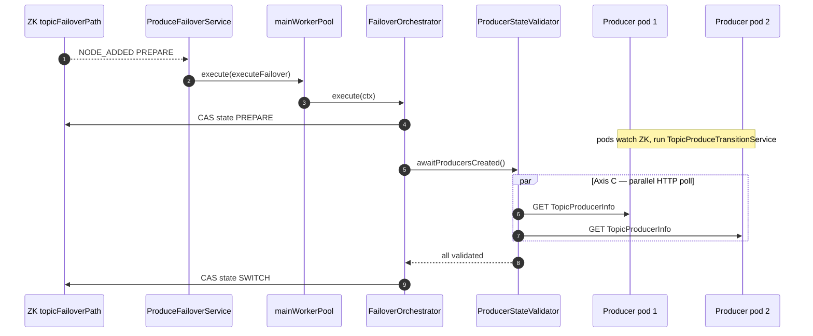
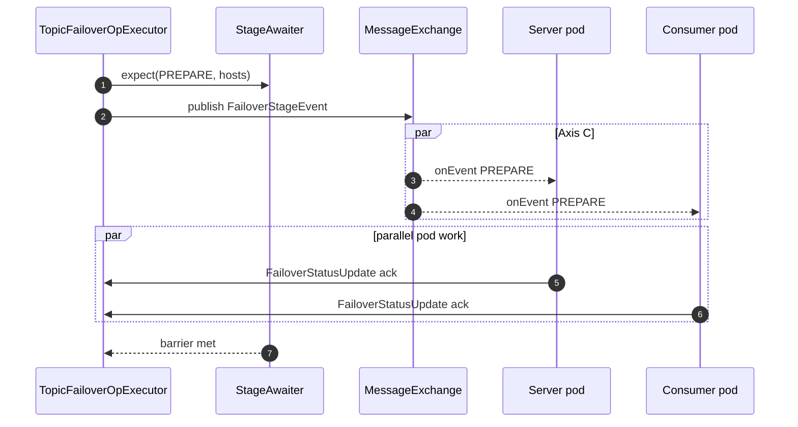
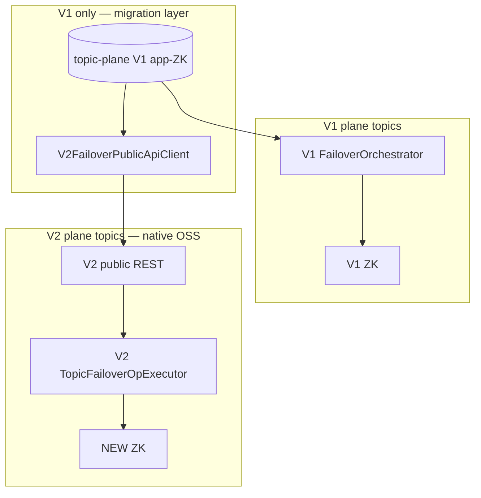
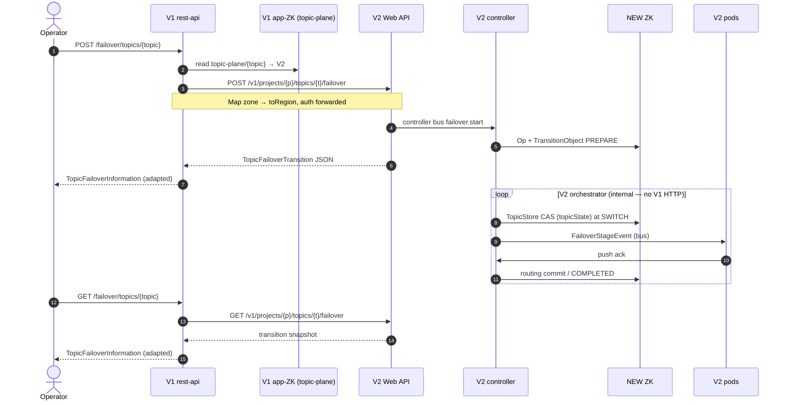
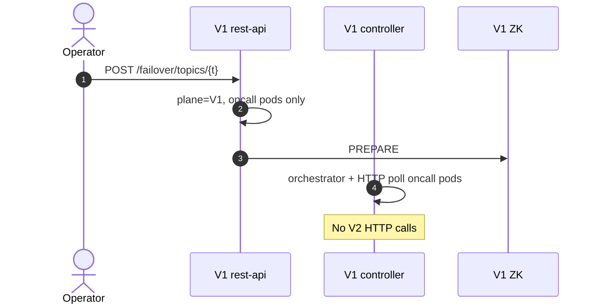

```mermaid
flowchart TB
    subgraph v1oncall [V1 Oncall]
        ZK1[ZK childEvent] --> Q1[TopicFailoverEventService queues]
        Q1 --> MT1[ProduceFailoverService main thread]
        MT1 --> WP1[mainWorkerPool N threads]
        WP1 --> ORC1[FailoverOrchestrator per topic]
        ORC1 --> VAL1[ProducerStateValidator parallel HTTP]
    end

    subgraph v2oss [V2 OSS target]
        TRG2[REST / auto-trigger] --> OPM2[OperationMgr pool]
        OPM2 --> EX2[TopicFailoverOpExecutor per topic]
        EX2 --> PUB2[broadcast + StageAwaiter]
        PUB2 --> ACK2[push acks from all pods]
    end
```

# Topic Failover — Parallel Orchestration Grooming (Oncall → OSS)

> Grooming doc for **how to orchestrate topic failover in parallel** in production (**V1 = oncall**)
> and how OSS (**V2**) should achieve the same parallelism guarantees with OSS-native wire and
> substrates. Use this when porting `ProduceFailoverService` behaviour or reviewing OSS controller
> design for region-eviction scale.

| Field | Value |
|-------|-------|
| Status | Ready for grooming |
| Audience | Engineers porting oncall failover logic into OSS Varadhi |
| V1 reference | Oncall repo — `controller/.../listeners/ProduceFailoverService.java`, `FailoverOrchestrator.java`, `ProducerStateValidator.java` |
| V2 parent docs | [`topic-failover-transition-lld.md`](topic-failover-transition-lld.md), [`topic-failover-controller.md`](topic-failover-controller.md), [`topic-failover-grooming-final.md`](topic-failover-grooming-final.md) |
| Scope | Produce-path topic failover; **Part II** covers oncall→OSS **coexistence** during migration |
| Related | Part I = parallel orchestration in each stack; Part II = **V1 governs, V2 participates** |

---

## 1. What “V1” and “V2” mean

| | **V1 — Oncall (production)** | **V2 — OSS Varadhi** |
|---|------------------------------|----------------------|
| **Codebase** | Internal oncall (`/oncall`) | OSS `varadhi/` under this workspace |
| **Stage signal (forward leg)** | CAS on dedicated ZK subtree `topicFailoverPath/{topic}`; pods watch via `PathChildrenCache` | **Target:** same ZK transition subtree *or* L1 `TopicFailover` entity update *or* `OperationMgr.broadcast(FailoverStageEvent)` — see §8 |
| **Stage complete (return leg)** | Controller **polls** each producer/consumer over HTTP (`ProducerStateValidator` → `TopicProducerInfo`) | Controller **receives push** acks (`FailoverStatusUpdate` / ZK ack child znodes) — no HTTP poll surface |
| **Orchestrator** | `FailoverOrchestrator.execute(FailoverContext)` on worker thread | `TopicFailoverOpExecutor` via `OperationMgr` *or* `TopicFailoverOrchestrator` on dedicated pool |
| **Routing commit** | Atomic ZK txn: `activeProduceZone` + transition `MIGRATED` | `TopicStore` tracked write (`regionConfigs` / `TopicState`) at SWITCH; cosmetic cleanup after |
| **Pod local work** | `TopicProduceTransitionService` (same logic to port) | Same service, wired on Server + Consumer verticles |

**Porting principle:** reuse oncall **stage machine + produce matrix**; replace oncall **return leg (HTTP poll)** with OSS **push ack** or **ZK ack children**; reuse oncall **parallelism shape** (single coordinator thread + worker pool + per-topic context map).

---

## 2. Goals

1. **Many topics fail over concurrently** — region degradation must not serialize globally.
2. **Exactly one active failover per topic** — duplicate REST / auto-trigger for the same topic is rejected.
3. **All targeted pods validate in parallel per stage** — controller waits for a **barrier**, not sequential pod visits.
4. **Bounded blast radius** — worker pool size, queue depth, and (Phase 2) rate limits cap controller load.
5. **OSS matches oncall parallelism semantics** even when wire primitives differ.

---

## 3. Non-goals (Part I — single-stack)

- Parallel **stages** on one topic (`PREPARE` before `SWITCH` always).
- **Two orchestrators fighting for the same topic** (Part II allows both stacks online, but **one governor per topic**).
- Consumer follow-the-producer failover (separate workstream).

> **Part II exception:** during migration, each topic is on **V1 or V2 plane**; see §14 and §17. **No V2 structural hacks.**

---

## 4. Four parallelism axes (shared vocabulary)

```text
Axis A — Cross-topic
  Topic-A orchestrator  ||  Topic-B orchestrator  ||  Topic-C orchestrator

Axis B — Coordinator vs workers (per controller)
  ZK/event dequeue thread (single)  →  dispatches to worker pool (parallel)

Axis C — Fleet validation (per topic, per stage)
  Pod-1  ||  Pod-2  ||  ...  ||  Pod-N   (all ack / validate concurrently)

Axis D — Region batch (Phase 2 auto-failover)
  for topic in candidates: start failover   (many topics, rate-limited)
```



---

## 5. V1 — Oncall parallel orchestration (reference)

### 5.1 Architecture (as shipped)

```text
ZK PathChildrenCache (topicFailoverPath/*)
        │
        ▼
ProduceFailoverService.childEvent()  ──►  TopicFailoverEventService.distributeEvent()
        │                                      ├─► failoverEventQueue      → ProduceFailoverService
        │                                      └─► failoverTrackerQueue    → ProduceFailoverTrackerService
        ▼
Main thread (single): eventQueue.take() → handleNodeAdded/Updated/Removed
        │
        │  NODE_ADDED (PREPARE): validate → activeFailOvers.put(topic, ctx)
        ▼
mainWorkerPool.execute(() → orchestrator.execute(ctx))     ← Axis A + B
        │
        ▼
FailoverOrchestrator (per topic, on worker thread)
  Phase 1: CRUD lock
  Phase 2: ZK PREPARE  →  ProducerStateValidator.awaitProducersCreated()   ← Axis C
  Phase 3: ZK SWITCH   →  ProducerStateValidator.awaitProducersBlocked()
  Phase 4: replication lag (optional)
  Phase 5: atomic ZK: activeProduceZone + MIGRATED
  Phase 6: COMPLETED, delete znode
```

Key classes (oncall):

| Component | Parallelism role |
|-----------|------------------|
| `ProduceFailoverService` | Single dequeue thread; dispatches to `mainWorkerPool` |
| `mainWorkerPool` | `workerThreadPoolSize` (default **3**); one `execute()` per topic failover |
| `activeFailOvers` | `ConcurrentHashMap<String, FailoverContext>` — one in-flight per topic |
| `ProducerStateValidator` | `producerInfoFetchThreadPoolSize` (default **10**); parallel HTTP fetch + fail-fast `AbortState` |
| `TopicFailoverEventService` | Fan-out to orchestrator queue + tracker queue (two consumers, same event) |
| `FailoverOrchestrator` | Sequential phases; parallel only inside validator |

### 5.2 Cross-topic parallelism (Axis A)

From `ProduceFailoverService` javadoc and implementation:

- **Default pool:** `workerThreadPoolSize = 3` — at most three topic failovers execute orchestrator phases concurrently.
- **Queue:** bounded by `workerThreadPoolSize × workerQueueSizeMultiplier` (default multiplier **10** → queue 30).
- **Saturation:** `RejectedExecutionException` → abort with `"Worker pool saturated, too many concurrent failovers"`.
- **Per-topic guard:** `activeFailOvers.containsKey(topic)` → duplicate `NODE_ADDED` ignored (TODO: abort in oncall).

```java
// oncall: ProduceFailoverService.handleNodeAdded (conceptual)
activeFailOvers.put(topic, ctx);
mainWorkerPool.execute(() -> executeFailover(ctx));  // parallel across topics
```

### 5.3 Fleet parallelism (Axis C) — HTTP poll

Oncall does **not** wait for pods sequentially. `ProducerStateValidator.validateAllProducersInParallel`:

1. Builds one `CompletableFuture` per registered producer **and** consumer app instance.
2. Fetches `TopicProducerInfo` over HTTP in parallel on `validationPool`.
3. Uses shared `AbortState` for **fail-fast** — first failure cancels sibling fetches.
4. `CompletableFuture.allOf(...)` gates stage advancement.

This is the oncall equivalent of OSS `StageAwaiter` — barrier after parallel pod work — but implemented as **active poll** instead of **passive push**.

### 5.4 Event distribution parallelism

`TopicFailoverEventService.distributeEvent` adds the same ZK event to **two** unbounded queues atomically (orchestrator + IQ tracker). Each consumer has its own single-threaded loop — orchestration and subscription-side tracking proceed **in parallel** without shared mutable event state (tracker gets a **copy** of `TopicFailoverInformation`).

### 5.5 Bootstrap / restart policy (oncall)

On controller start, `ProduceFailoverService.bootstrap()`:

- Aborts all failovers with `state > PREPARE` (`"Service restarted"`).
- Re-dispatches `PREPARE`-only failovers via `handleNodeAdded`.

OSS may choose **resume** instead of abort (see `topic-failover-transition-lld.md` §11 reconciler) — grooming decision, not a parallelism change.

### 5.6 Oncall sequence — one stage, parallelism highlighted



### 5.7 Oncall config defaults (parallelism-relevant)

| Key | Default | Effect |
|-----|---------|--------|
| `workerThreadPoolSize` | 3 | Max concurrent `FailoverOrchestrator.execute` |
| `workerQueueSizeMultiplier` | 10 | Bounded queue before reject |
| `producerInfoFetchThreadPoolSize` | 10 | Parallel HTTP validation |
| `producerInfoFetchMaxRetries` | 10 | Per-instance retry before stage fails |

---

## 6. V2 — OSS parallel orchestration (target)

OSS should preserve oncall’s **three-layer parallelism**:

```text
Layer 1 — Single coordinator thread     (dequeue / leadership logic)
Layer 2 — Worker pool per topic         (cross-topic parallel orchestrators)
Layer 3 — Parallel fleet barrier        (all pods ack concurrently)
```

Wire and storage differ; semantics must not.

### 6.1 Recommended OSS shape (converged target)

Aligns `topic-failover-transition-lld.md` orchestration with oncall’s pool + per-topic map:

```text
REST / Phase-2 trigger
        │
        ▼
ControllerApiMgr.create Op + TransitionObject
        │
        ▼
OperationMgr.enqueue(op)                    ← Layer 1: ordered dispatch
        │
        ▼
OpMgr executor pool (maxConcurrentOps)      ← Layer 2: Axis A
  TopicFailoverOpExecutor.execute(op)       one thread per distinct topicFqn
        │
        per stage:
          stageAwaiter.expect(hosts)
          broadcast(FailoverStageEvent)     ← forward leg (ZK or publish)
          await barrier                     ← Layer 3: Axis C (push, not poll)
```

| Oncall (V1) | OSS (V2) equivalent |
|-------------|---------------------|
| `ProduceFailoverService` main thread | `OperationMgr` dispatch + reconciler on leader elect |
| `mainWorkerPool` | `OperationMgr` `OpMgr-*` pool (`maxConcurrentOps`, default 32) |
| `activeFailOvers` | `orderingKey = "TopicFailover_" + fqn` + `TransitionStore.create` uniqueness |
| `ProducerStateValidator` parallel HTTP | `StageAwaiter` + `FailoverAckTriggerHandler` push acks |
| ZK `topicFailoverPath` CAS | ZK transition znode CAS **or** `TransitionObject` update **or** L1 entity update |
| `TopicFailoverEventService` dual queue | Optional: separate tracker for IQ/subscription follow (Phase 2) |

### 6.2 Cross-topic parallelism (Axis A) in OSS

From `topic-failover-lld.md` §11:

- **Different topics:** independent `orderingKey`s → `OperationMgr` runs executors in parallel up to `maxConcurrentOps`.
- **Same topic:** serialized by ordering key; second `TransitionStore.create` fails `NodeExists` (409).
- **Pool saturation:** ops wait in `OperationMgr` queue (unlike oncall’s immediate abort on reject) — consider explicit timeout or metric on queue depth.

**Grooming default:** start with `maxConcurrentOps: 32` (OSS existing controller default). For parity with oncall’s conservative default of 3, use a **dedicated sub-cap** `failover.maxConcurrentOps: 8` if sharing the pool with subscription ops causes starvation — open item §10.

### 6.3 Fleet parallelism (Axis C) in OSS — push barrier

Replace oncall HTTP poll with:

```text
onEvent(FailoverStageEvent):
  PREPARE → warm target; ack
  SWITCH  → wait TopicCache.version >= vTo; ack

Controller: StageAwaiter.recordAck until expected ⊆ received
```

- All pods handle `publish` **concurrently** on Vert.x event loops.
- `resendAfterMs` → targeted `pushOpToPod` to missing hosts only (oncall has implicit retry via `producerInfoFetchMaxRetries`).
- `fenceVersion` / stale `reportedState` dropped (same role as oncall ignoring stale producer state).

**No `ProducerInfoService` in OSS** — pods push outcome after local `TopicProduceTransitionService` finishes.

### 6.4 Dual-leg overlap (Axis B variant)

Within one OSS stage:

1. `expect(stage, hosts)` registers barrier.
2. `broadcast(stageEvent)` — async fleet fan-out.
3. `await()` — worker thread blocks until acks or timeout.

Broadcast and pod work overlap in time; same as oncall writing ZK then polling while pods are already reacting to the watch.

### 6.5 Phase 2 region batch (Axis D)

Oncall pattern (region eviction flips many topics):

```text
TopicFailoverService / RegionFailoverListener (leader-only)
  candidates = topics in degraded region with autoFailover
  apply perTopicCooldown + maxTopicsPerMinute
  for each: create transition / Op → enqueue orchestrator
```

Parallelism is **many topics each getting their own worker slot**, not one mega-orchestrator. Rate limits prevent exceeding Layer 2 pool + ZK write storm.

| Guard | Oncall | OSS (proposed) |
|-------|--------|----------------|
| Per-topic cooldown | yes (config) | `failover.perTopicCooldownMs` |
| Global rate | yes | `failover.maxTopicsPerMinute` |
| Pool cap | `workerThreadPoolSize` | `maxConcurrentOps` or `failover.maxConcurrentOps` |
| Kill switch | freeze / job disable | `controller.failover.enabled` + ZK freeze node |

### 6.6 OSS sequence — one stage (push ack)



---

## 7. Side-by-side summary

| Concern | V1 Oncall | V2 OSS (target) |
|---------|-----------|-----------------|
| Cross-topic pool | `mainWorkerPool` (default 3) | `OperationMgr` pool (default 32) |
| Per-topic exclusivity | `activeFailOvers` map | ordering key + `TransitionStore` create |
| Coordinator thread | single `eventQueue.take()` loop | `OperationMgr` + leader reconciler |
| Forward leg | ZK CAS on `topicFailoverPath` | ZK CAS **or** L1 entity **or** `broadcast` |
| Return leg | parallel HTTP poll | parallel **push** acks (`StageAwaiter`) |
| Fail-fast on pod error | `AbortState` in validator | `outcome=ERRORED` → stage fail / abort |
| Pool saturated | abort failover immediately | queue (unless reject policy added) |
| Restart in-flight | abort if state > PREPARE | resume from `TransitionObject.stage` (proposed) |
| IQ / subscription tracking | `ProduceFailoverTrackerService` parallel queue | Phase 2 — mirror with second listener or op kind |
| Metrics | `activeFailOvers.size()`, state counts | `varadhi.failover.op.active`, stage pending acks |

---

## 8. OSS wire options (same parallelism, different forward leg)

All three OSS designs below support **identical Layer 2 + Layer 3 parallelism**; only the forward leg differs:

| Option | Forward leg | Return leg | Closest to oncall |
|--------|-------------|------------|-------------------|
| **C — ZK transition path** | CAS on `/varadhi/transitions/topic-failover/{fqn}` | push `failover.status` | **Yes** — same watch model as oncall |
| **L1 entity** | `TopicFailover` update → `ResourceEventProcessor` | ZK `acks/{host}` children | Partial — replaces HTTP with ZK acks |
| **Op + broadcast** | `FailoverStageEvent` publish | push `FailoverStatusUpdate` | No ZK watch on pods for stages |

**Grooming recommendation:** implement **parallel orchestration once** on `OperationMgr` + `StageAwaiter`; plug forward leg per chosen option. Do not fork pool / barrier logic per wire variant.

---

## 9. Shared invariants (porting checklist)

| # | Invariant | Oncall | OSS |
|---|-----------|--------|-----|
| I1 | One active failover per topic | `activeFailOvers` + ZK path uniqueness | `TransitionStore.create` / transition znode |
| I2 | Stages strictly ordered | `FailoverOrchestrator` phases | `TopicFailoverOpExecutor` stages |
| I3 | Fleet barrier before next stage | `ProducerStateValidator.allOf` | `StageAwaiter.await` |
| I4 | Produce routing from topic snapshot | `activeProduceZone` at Phase 5 | tracked `TopicStore` write at SWITCH |
| I5 | `NOT_INVOLVED` pods excluded from gate | validator skips non-participants | `expectedHosts` / target registry |
| I6 | Fail-fast on participating pod failure | `AbortState` | ERRORED ack → abort policy |
| I7 | Cross-topic work is independent | separate `FailoverContext` per topic | separate op + executor slot |

---

## 10. Grooming decisions (proposed)

| ID | Decision |
|----|----------|
| P1 | OSS **must** support cross-topic parallel orchestration — port oncall worker-pool **semantics**, not necessarily default size 3. |
| P2 | OSS **must not** poll producer HTTP for stage acks — use push (`topic-failover-controller.md` §2.2). |
| P3 | Per-topic serialization uses **ordering key + atomic create**, mirroring oncall `activeFailOvers`. |
| P4 | Phase 2 batch failover uses **rate limits + pool cap**, same shape as oncall region jobs. |
| P5 | Pool saturation policy: **queue with metric** (OSS default) vs **fail-fast abort** (oncall) — document operator-visible behaviour; align with oncall if auto-trigger can starve the pool. |
| P6 | Restart policy: OSS **resume** from `TransitionObject` (differs from oncall abort) — acceptable if reconciler re-publishes stage events. |
| P7 | Optional dedicated `failover.maxConcurrentOps` sub-cap if sharing `OperationMgr` with subscription ops. |

---

## 11. Work breakdown

### 11.1 Parallelism plumbing (OSS)

- [ ] `TopicFailoverOpExecutor` + `StageAwaiter` with parallel `broadcast` + barrier (replaces `ProducerStateValidator`).
- [ ] `orderingKey = "TopicFailover_" + fqn` in `OperationMgr`.
- [ ] `TransitionStore.create` / transition znode — `NodeExists` → 409.
- [ ] Metrics: `varadhi.failover.op.active`, `varadhi.failover.executor.queue.depth`, `varadhi.failover.stage.acks.pending`.
- [ ] Integration test: **N topics failover concurrently** (N ≥ `min(8, pool size)`); assert no cross-topic interference.

### 11.2 Port from oncall (logic, not wire)

- [ ] `TopicProduceTransitionService` + produce matrix (`topic-failover-grooming.md` §4.7).
- [ ] `FailoverOrchestrator` phase ordering (PREPARE → SWITCH → lag → commit → COMPLETED).
- [ ] `FailoverContext` abort flag between phases (`requestAbort` on ZK abort CAS).
- [ ] `NOT_INVOLVED` / target registry semantics from `ProducerStateValidator`.

### 11.3 Phase 2

- [ ] `TopicFailoverService` leader-only batch loop with cooldown + `maxTopicsPerMinute`.
- [ ] Optional `ProduceFailoverTrackerService` analogue for IQ subscription follow.

---

## 12. Open questions

1. **Pool size:** OSS default 32 vs oncall 3 — validate against controller CPU and ZK write rate in staging.
2. **Saturation behaviour:** queue (OSS) vs abort (oncall) when pool + queue full?
3. **Dedicated failover pool** vs shared `OperationMgr`?
4. **Forward leg pick:** ZK transition path (closest to oncall) vs Op+broadcast only?
5. **Restart:** resume (OSS) vs abort post-PREPARE (oncall) — operator runbook impact?

---

## 13. Summary (Part I)

**V1 (oncall)** achieves parallel failover with a **single event thread** dispatching to a **small worker pool** (default 3), a **`ConcurrentHashMap` of active contexts**, and **parallel HTTP validation** across all producer/consumer instances per stage. **V2 (OSS)** should keep that **three-layer model** and replace only the return leg: **push acks + `StageAwaiter`** instead of `ProducerStateValidator` poll, with **`OperationMgr`** as the worker pool and **`TransitionObject`** (or ZK transition znode) as the per-topic lock. Region-scale parallelism is **many independent topic orchestrators**, throttled by pool size and rate limits — same in both systems.

---

# Part II — Coexistence: per-topic migration plane

During oncall → OSS migration, topics coexist on **two planes**. **V1-plane topics** are owned by oncall (OLD ZK admin, V1 failover). **V2-plane topics** are owned by OSS (NEW ZK admin, V2 failover). Exactly one plane per topic — no global “V1 governs all until cutover.”

See also: `cdc-v2-runtime-fields-grooming.md` §1.3 for CDC × plane rules.

---

## 14. Governance model — `TopicMigrationPlane`

Every topic carries **which stack owns live operations** (failover, storage migration, admin writes):

```java
enum TopicMigrationPlane {
    V1,   // Oncall: OLD ZK source of truth; V1 FailoverOrchestrator
    V2    // OSS: NEW ZK source of truth; V2 TopicFailoverOpExecutor
}
```

Persist in **V1 app-ZK** (`/varadhi/app/migration/topic-plane/{topicName}` → `"V1"` | `"V2"`, default V1 if absent) — V2 has **zero** migration awareness.

**Ephemeral** in-flight state uses separate markers (`TransitionObject` on V2, `topicFailoverPath` on V1) — do not confuse with plane.

| Rule | Detail |
|------|--------|
| **Single owner** | `plane = V1` → only V1 orchestrates (oncall ZK + oncall pods). `plane = V2` → only V2 orchestrates via **public** REST. |
| **No hybrid orchestration** | V1 **must not** drive OSS pods during V1-plane failover. If OSS pods exist → reject failover until plane = V2. |
| **V1 adaptation only** | Plane registry, HTTP proxy, DTO mapping — all in **oncall**. No V2 internal/migration endpoints. |
| **Cutover** | CAS plane ZNode on V1 app-ZK when CDC bootstrap + validation complete. |
| **Parallelism** | V1 pool for V1-plane; V2 `OperationMgr` for V2-plane — independent. |



### 14.1 ~~V1-plane topic with mixed pods (bridge mode)~~ — **rejected**

Earlier drafts proposed V1 calling V2 internal APIs (`apply-stage`, `TopicProducerInfo` poll, passive controller). **Rejected:** that adds migration-only structure to V2.

**Replacement:** strict fleet/plane ordering — see §17.

### 14.2 V2-plane topic — no V1 involvement

V2 controller runs full Part I stack. V1 rest-api may **proxy** operator calls to V2 **public** API (V1-side adapter only).

---

## 15. ~~Approach A — REST bridge~~ — **rejected (V2 structural hacks)**

Earlier drafts required V2 to expose `/v1/internal/failover/*`, passive controller mode, and `TopicProducerInfo` HTTP poll — **all rejected**. V1 adapts to V2 **public product APIs** only (§17). **No hybrid V1-orchestrated failover with OSS pods.**

---


## 16. Alternative approaches (historical — all rejected for V2)

| ID | Approach | Why rejected |
|----|----------|--------------|
| A/C | V1 calls V2 `/internal/failover/*` | Migration-only V2 surface |
| B | OSS pods watch V1 ZK | Dual ZK wiring in V2 |
| E | Sidecar on OSS pods | Extra ops component on V2 fleet |
| G | Dual metadata write | V2 write path for V1 orchestration |

**Chosen:** **D — strangler per topic** — flip `migrationPlane` in V1 MySQL; V1 proxies to V2 **public** API; no hybrid fleet.

---

## 17. V2 native compatibility contract (no V2 migration hacks)

**Principle:** V2 ships **only product APIs and behaviour** it would need post-migration. **All** plane routing, HTTP proxy, DTO mapping, and fleet guards live in **oncall (V1)**.

### 17.1 What V2 exposes (native — build anyway)

These are **not** migration shims; they are the permanent OSS surface.

| # | Surface | Route / mechanism | Used when |
|---|---------|-------------------|-----------|
| V2-1 | **Topic failover create** | `POST /v1/projects/:p/topics/:t/failover` | V2-plane topic; operator or **V1 proxy** |
| V2-2 | **Failover status** | `GET /v1/projects/:p/topics/:t/failover` | Status poll |
| V2-3 | **Failover abort** | `POST /v1/projects/:p/topics/:t/failover/abort` | Pre-SWITCH abort |
| V2-4 | **Active failovers (admin)** | `GET /v1/admin/failovers/active` | V1 `getAll()` merge for V2-plane topics |
| V2-5 | **Topic read** | `GET /v1/projects/:p/topics/:t` | Validation, routing inspection |
| V2-6 | **Produce** | `POST /v1/projects/:p/topics/:t/messages` | Data plane; gates on `topicState` from NEW ZK |
| V2-7 | **Entity metastore** | NEW ZK `/varadhi/entities/...` | `VaradhiTopic`, `TopicFailover` L1 — internal to V2 |
| V2-8 | **Pod coordination** | Vert.x bus + push acks / ZK ack children | **Internal to V2** — V1 never calls |

See `topic-failover-transition-lld.md` §4 for REST shapes.

### 17.2 What V2 does **not** expose (explicit non-goals)

| Rejected | Reason |
|----------|--------|
| `/v1/internal/failover/apply-stage` | V1-driven orchestration on V2 |
| `/v1/internal/failover/stage-ready` | Passive controller for V1 poll |
| `/v1/internal/producers/.../producer-info` | Oncall HTTP poll pattern; OSS uses push acks |
| `/v1/internal/topics/.../migration` | Migration registry belongs on **V1** |
| Passive controller mode | V2 always runs full orchestrator for its topics |
| Watching V1 ZK for failover stages | Dual-ensemble hack in V2 |
| `TopicProducerInfo`-compatible DTO | Oncall-only contract |

### 17.3 Operational rule — fleet × plane (replaces bridges)

| Plane | Pod fleet | Failover |
|-------|-----------|----------|
| **V1** | Oncall producer-api / consumer only | V1 orchestrator **unchanged** |
| **V1** | **Any OSS pod registered for topic** | **Reject** at rest-api: `409` — *flip plane to V2 first* |
| **V2** | OSS pods | V2 public failover API (direct or via V1 proxy) |

OSS pods may **produce/consume** on V1-plane topics (metadata via CDC → NEW ZK) but **cannot** participate in V1 failover choreography. **Cutover order:** metadata plane flip → then failover on OSS fleet.

### 17.4 V1-only changes (oncall repo)

#### A. Migration plane ZNode (V1 app-ZK)

```text
/varadhi/app/migration/topic-plane/{topicName}  →  "V1" | "V2"   (default: V1 if absent)
```

Ops tooling / cutover script CAS-writes here. CDC excludes `/migration/**` from bootstrap/tail. V2 never reads it.

#### B. `V2FailoverPublicApiClient` (V1 rest-api)

HTTP client to V2 **public** web base URL (same routes operators would call):

| V1 handler | V2-plane action |
|------------|-----------------|
| `TopicFailoverResource.createTopicFailover` | `POST /v1/projects/{p}/topics/{t}/failover` + map request/response |
| `get` | `GET .../failover` |
| `requestAbort` | `POST .../failover/abort` |
| `getAll` | Merge V1 ZK list + `GET /v1/admin/failovers/active` |

DTO adapter in V1 only:

| Oncall | V2 | V1 adapter |
|--------|-----|------------|
| `FailoverRequest.zone` | `TopicFailoverRequest.toRegion` | map field names |
| `TopicFailoverInformation.State` | `TransitionObject.currentStage` | map enum values |
| topic name | project + topic FQN | split/join per naming rules |

#### C. V1-plane pre-flight guards

```java
// TopicFailoverResource.createTopicFailover — before existing logic
if (migrationPlaneService.getPlane(topicName) == V2) {
    return v2FailoverPublicApiClient.create(...);
}
if (podRegistry.hasOssPodsForTopic(topicName)) {
    throw new ConflictException("OSS pods on topic; set migration plane to V2 before failover");
}
// existing V1 path — unchanged
```

#### D. V1 controller — **no changes** for OSS bridge

| Component | Change |
|-----------|--------|
| `FailoverOrchestrator` | **None** |
| `ProducerStateValidator` | **None** (oncall pods only) |
| `ProducerInfoService` | **None** |
| `ProduceFailoverService` | **None** |

#### E. V1 gateway (optional)

Block external produce to V2 server during **V1-plane** V1 ZK SWITCH — existing proxy pattern; V1-side only.

### 17.5 V2 work — product only (no migration code)

| Work item | Notes |
|-----------|-------|
| Failover REST (V2-1…V2-4) | Part I / transition LLD |
| `TopicFailoverOpExecutor` + push acks | Native OSS |
| `VaradhiTopic.topicState` + `CdcMergePolicy` | CDC doc — product behaviour, not V1 bridge |
| Entity CRUD guards during transition | Product |

**Zero** tasks for internal migration endpoints or passive mode.

### 17.6 Sequence — V2-plane via V1 proxy (V1 adapts)



### 17.7 Sequence — V1-plane (V2 not involved)



---

## 18. Grooming decisions — coexistence

| ID | Decision |
|----|----------|
| M1 | **`TopicMigrationPlane` on V1 app-ZK** (`topic-plane/{topic}`) — V2 has no migration awareness. |
| M2 | **V1 plane** → V1 orchestrates oncall fleet only; reject if OSS pods present. |
| M3 | **V2 plane** → V1 rest-api **proxies to V2 public failover API** (DTO adapter in V1). |
| M4 | **No V2 internal/migration endpoints** — rejected permanently for this migration. |
| M5 | **Cutover before failover** on OSS fleet — flip plane, then use V2-1…V2-4. |
| M6 | **CDC** tails OLD; `CdcMergePolicy` preserves v2 fields — product code on V2, not a V1 bridge. |

---

## 19. Open questions — coexistence

1. **Transparent proxy vs 409 redirect:** should V1 rest-api hide V2-plane from operators, or return `409` + V2 URL?
2. **Auth for V1→V2 public API:** reuse operator token, service account, or mTLS?
3. **DTO mapping:** single shared OpenAPI spec vs hand-maintained adapter in V1?
4. **Produce on V1-plane with OSS pods:** acceptable to defer failover until plane flip?
5. **Rollback:** V2→V1 plane flip requires no in-flight V2 transition — runbook.

---

## 20. Summary (full doc)

**Part I:** Parallel failover = cross-topic worker pool + parallel per-stage fleet barrier. Oncall uses HTTP poll; OSS native uses push acks.

**Part II (migration):** **V1-only adaptation.** Plane marker on V1 app-ZK (`topic-plane/{topic}`). V1-plane = oncall failover unchanged (oncall pods only). V2-plane = V1 proxies to V2 **public** failover REST. V2 ships **zero** migration-specific APIs. See `cdc-v2-runtime-fields-grooming.md` §1.3.

