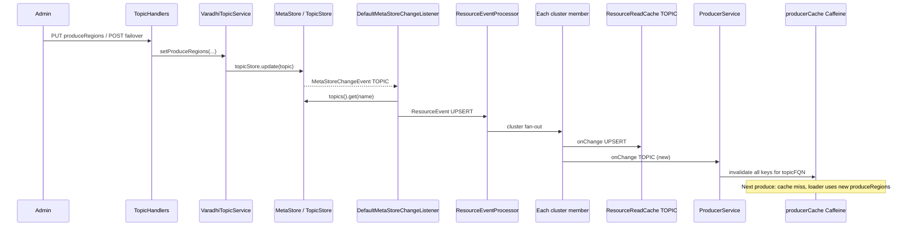

# Topic failover (produce path) — single design + LLD

> **Note:** For one **Google-Docs–friendly** file (no Mermaid, paste instructions, full design + grooming + LLD), use **[`TOPIC_FAILOVER_MASTER_FOR_GOOGLE_DOCS.md`](TOPIC_FAILOVER_MASTER_FOR_GOOGLE_DOCS.md)**. This file remains a Markdown-first LLD with diagrams. **Approach 2 (automated failover) is deferred** — current delivery is **Approach 1 (manual)** only; cache/event LLD here still applies.

> **Status:** Draft — extends [`topic-failover.md`](topic-failover.md) with OSS-specific low-level design.  
> **Scope:** Produce only (no consumer follow-the-producer).  
> **Audience:** Implementers reviewing cache, events, and observability.

---

## 1. Goals (recap)

- **Authoritative produce region** must come from topic metadata (`produceRegions` after PR #307 + failover work), not from a single JVM-wide `produceRegion` alone.
- After a failover (metadata flip), **every producer node** must stop using stale broker clients for the affected topic as soon as practicable.
- **Optional automation** (Approach 2 in `topic-failover.md`) uses the leader controller + `Region` status; this LLD still applies to how data-plane caches refresh.

---

## 2. Oncall vs OSS (produce slice)

| Concern | Internal (oncall) | OSS target |
|--------|---------------------|------------|
| Active produce authority | `activeProduceZone` | `produceRegions` (+ `failoverRegion` for standby) |
| Metadata store | `GlobalTopic` (ZK) | `VaradhiTopic` in metastore |
| Flip API | `PUT …/activeProduceZone/{zone}` | `PUT …/produceRegions`, `POST …/failover`, etc. |
| Producer cache key | Zone-aware (`ProducerKey`) | **Today:** `(topicFQN, storageTopicId)` — **Target:** include chosen `RegionName` |
| Cache refresh | Zone flip + invalidation | Metastore change → cluster event → caches |

---

## 3. Current OSS architecture (relevant classes)

### 3.1 Two layers of caching on the producer node

1. **`ResourceReadCache<…VaradhiTopic>` (`topicCache`)**  
   - In-memory `ConcurrentHashMap` of topic FQN → `EntityResource<VaradhiTopic>`.  
   - Implements `ResourceEventListener`: on `UPSERT`, merges by **version**; on `INVALIDATE`, removes entry.  
   - **Source:** [`ResourceReadCache.java`](../core/src/main/java/com/flipkart/varadhi/core/ResourceReadCache.java).

2. **`LoadingCache<ProducerCacheKey, Producer>` (`producerCache`)** — Caffeine  
   - Key **today:** `ProducerCacheKey(varadhiTopicFQN, storageTopicId)` only — **region is implicit** (the JVM’s `produceRegion` string passed into `loadProducerObject`).  
   - Loader calls `topicCache.get(fqn)` then `getProduceTopicForRegion(produceRegion)` and `producerFactory.newProducer(…)`.  
   - **TTL:** `ProducerOptions.producerCacheTtlSeconds` (default 3600), `expireAfterAccess`.  
   - **Source:** [`ProducerService.java`](../producer/src/main/java/com/flipkart/varadhi/produce/ProducerService.java).

3. **`produceRegion` (field on `ProducerService`)**  
   - Constant per JVM. **`produceToValidTopic` always uses `topic.getProduceTopicForRegion(produceRegion)`** — there is no per-topic active region yet.

### 3.2 How topic changes reach all nodes

High-level chain (today; still valid after failover APIs are added as long as `topicStore.update` fires metastore notifications):

```text
topicStore.update(VaradhiTopic)
    → MetaStore emits MetaStoreChangeEvent (TOPIC)
        → DefaultMetaStoreChangeListener.onEvent
            → metaStore.topics().get(name)  // load fresh entity
            → ResourceEvent(TOPIC, UPSERT, Resource.of(topic), version, committer)
                → ResourceEventProcessor.onChange
                    → fan-out ClusterMessage to every cluster member
                        → ResourceEventDispatcher.processEvent (on each node)
                            → topicCache.onChange(UPSERT)  // topic row updated
                            → (today) producerCache NOT notified
```

**Sources:**

- [`DefaultMetaStoreChangeListener.java`](../controller/src/main/java/com/flipkart/varadhi/controller/DefaultMetaStoreChangeListener.java) — TOPIC branch builds UPSERT with fresh entity from metastore.  
- [`ResourceEventProcessor.java`](../controller/src/main/java/com/flipkart/varadhi/controller/events/ResourceEventProcessor.java) — distributes to all members.  
- [`VaradhiApplication.java`](../server/src/main/java/com/flipkart/varadhi/VaradhiApplication.java) — `ResourceEventDispatcher.bindToClusterEntityEvents` registers caches as listeners.

**Implication:** After failover, **`topicCache` eventually holds new `produceRegions`** (assuming UPSERT carries full `VaradhiTopic`). **`producerCache` can remain wrong** until TTL expiry or explicit eviction, because the Caffeine key does not change when only the logical produce region changes.

---

## 4. Target behaviour (LLD — produce path)

### 4.1 Per-topic region resolution

Before loading or reusing a producer:

1. Read `VaradhiTopic` from `topicCache` (same as today).  
2. Compute `RegionName chosen = pickProduceRegion(topic.getProduceRegions(), localRegion, topic.getFailoverRegion(), config)`.  
   - Policy matches `topic-failover.md` §6.3.4 (local preferred; optional cross-region produce).  
3. Resolve `SegmentedStorageTopic internal = topic.getProduceTopicForRegion(chosen.name())` (or equivalent).  
4. Use `internal.getTopicToProduce()` / storage id for the **producer cache key**.

### 4.2 Producer cache key (target)

```text
ProducerCacheKey(varadhiTopicFQN, storageTopicId, RegionName chosenRegion)
```

**Why all three:**

- Same storage topic id might exist in multiple regions in a replicated setup; the **broker client** is tied to the **region’s** `SegmentedStorageTopic`.  
- After failover, `chosenRegion` changes → **natural cache miss** → new loader run → new `Producer` instance for the new broker.

**Alternative** (if you keep a two-part key): you **must** invalidate all keys for `(topicFQN, *)` on any TOPIC UPSERT that can change produce routing, because the key alone does not encode region.

**Recommendation:** Extend the key with `RegionName` **and** keep invalidation-by-topic (§4.3) so that in-flight races (old producer returned before topic cache applies UPSERT) are bounded.

### 4.3 Invalidation after failover (mandatory LLD)

**Trigger:** Any `ResourceEvent` for `ResourceType.TOPIC` where routing can change:

- `EventType.UPSERT` — always treat as potential routing change once `produceRegions` exists (cheapest: always invalidate producers for that FQN).  
- `EventType.INVALIDATE` — invalidate producers for that FQN (topic gone or force reload).

**Mechanism (choose one implementation; both are valid):**

| Option | Behaviour | Pros / cons |
|--------|-----------|-------------|
| **A — Register `ProducerService` as a `ResourceEventListener`** for `TOPIC` | On `onChange`, if `resourceType == TOPIC`, call `producerCache.asMap().keySet().removeIf(k -> k.varadhiTopicFQN().equals(name))` or a dedicated `invalidateProducersForTopic(String fqn)` | Explicit, immediate; works with current two-part key |
| **B — Region in cache key only** | Rely on new `chosenRegion` → miss old entries | Simpler loader; stale entries for **old** region remain until TTL — still recommend periodic eviction or **bounded** map cleanup for `(fqn, oldRegion)` |

**Project decision:** Prefer **A + region in key** (defence in depth).

**Implementation sketch:**

- Add `ProducerTopicInvalidator` or implement `ResourceEventListener<Resource.EntityResource<VaradhiTopic>>` on the producer verticle side **after** `ResourceEventDispatcher` constructs the typed event (same pattern as `ResourceReadCache`).  
- **Do not** clear entire `producerCache` on every event — only keys matching the topic FQN.

**Ordering / races:**

- Cluster delivers UPSERT; `topicCache.onChange` may run before or after producer invalidation depending on listener order.  
- **Safe order:** invalidate producer keys for FQN **first**, then allow next `getProducer` to load with fresh topic from `topicCache` (or invalidate immediately after topic cache update on the same thread if co-located).  
- If listeners are independent, **loader must always re-read** `topicCache` inside `loadProducerObject` (already true) and use **current** `chosenRegion` so a stale cached `Producer` is the only risk — eviction removes that risk.

### 4.4 `topicCache` and version

`ResourceReadCache` only applies UPSERT when `event.version() > existingResource.getVersion()`. Failover `topicStore.update` **must bump** `VaradhiTopic` / wrapper version consistently with other updates so out-of-order events do not regress the cache.

---

## 5. Where to track “failover stages”

The public design doc does **not** require a multi-step state machine persisted on the topic for **manual** failover: a single metastore write updates `produceRegions` (atomic from the client’s perspective).

Use these **layers** for observability and automation instead of overloading the topic entity:

| Layer | What to track | Purpose |
|-------|----------------|--------|
| **Ground truth** | `VaradhiTopic.produceRegions`, `failoverRegion`, `autoFailover` in metastore | Who may produce where |
| **Request / operation** | HTTP status + response body on `PUT …/produceRegions` / `POST …/failover` | Operator confirmation; idempotent retries |
| **Distributed propagation** | Existing `ResourceEventProcessor` / committer semantics | “All nodes applied UPSERT” — **optional** to expose as admin metric or log |
| **Approach 2 only** | Structured logs + metrics (`varadhi_failover_total{…}`) + optional ZK `/varadhi/failover/history/...` (per `topic-failover.md` §7.3.7) | Audit trail, replay, incident analysis |
| **Not required for MVP** | `FAILOVER_IN_PROGRESS` on topic | Avoid unless product needs partial multi-phase handoff; adds concurrency complexity |

**Controller job (auto failover) internal stages** (in-memory / per-leader only, not durable as “stage” on topic):

1. Received `Region` UPSERT → not produce-capable.  
2. Cooldown / freeze / rate-limit checks.  
3. For each topic: compute `nextProduceRegions` → call same `VaradhiTopicService.setProduceRegions` as manual path → metastore + UPSERT fan-out.  
4. Success/failure → metric + audit.

If a future UX needs **explicit** stages (e.g. “validating replication”), add a **separate** ephemeral resource or job record — do not block produce on a long-lived topic flag without careful design.

---

## 6. Sequence (LLD) — manual failover after implementation



---

## 7. Configuration knobs (LLD)

| Config | Role |
|--------|------|
| `ProducerOptions.producerCacheTtlSeconds` | Back-stop if event missed; **lower** in DR-sensitive deployments (`topic-failover.md` §6.4) |
| `producer.crossRegionProduce.enabled` (new) | Whether JVM may produce to a region outside its local deployment region |
| `controller.failover.*` (Approach 2) | Automation guards — see main failover doc |

---

## 8. Testing matrix (LLD-derived)

| Case | Assert |
|------|--------|
| UPSERT with new `produceRegions` | `topicCache` entry version matches; old `Producer` not used for new produces |
| UPSERT out-of-order (lower version) | `topicCache` unchanged; producer invalidation may still run — **prefer** version check in invalidation listener if tied to same event |
| INVALIDATE topic | Topic gone from `topicCache`; producer keys for FQN evicted |
| Concurrent produce during flip | No `Producer` for wrong region after invalidation + reload |
| No cluster nodes | `ResourceEventProcessor` logs warning; rely on TTL or next successful fan-out |

---

## 9. References

- [`topic-failover.md`](topic-failover.md) — product / control-plane design.  
- [`ProducerService.java`](../producer/src/main/java/com/flipkart/varadhi/produce/ProducerService.java) — current cache and produce path.  
- [`ResourceReadCache.java`](../core/src/main/java/com/flipkart/varadhi/core/ResourceReadCache.java) — topic cache merge rules.  
- [`DefaultMetaStoreChangeListener.java`](../controller/src/main/java/com/flipkart/varadhi/controller/DefaultMetaStoreChangeListener.java) — metastore → `ResourceEvent`.  
- [`ResourceEventProcessor.java`](../controller/src/main/java/com/flipkart/varadhi/controller/events/ResourceEventProcessor.java) — cross-node delivery.
