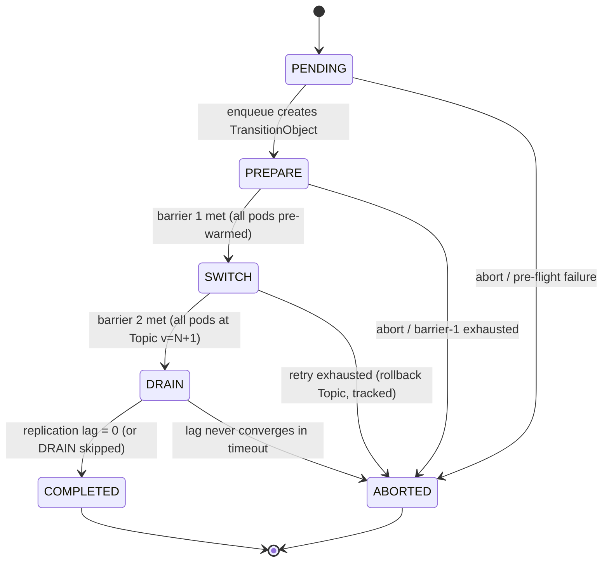
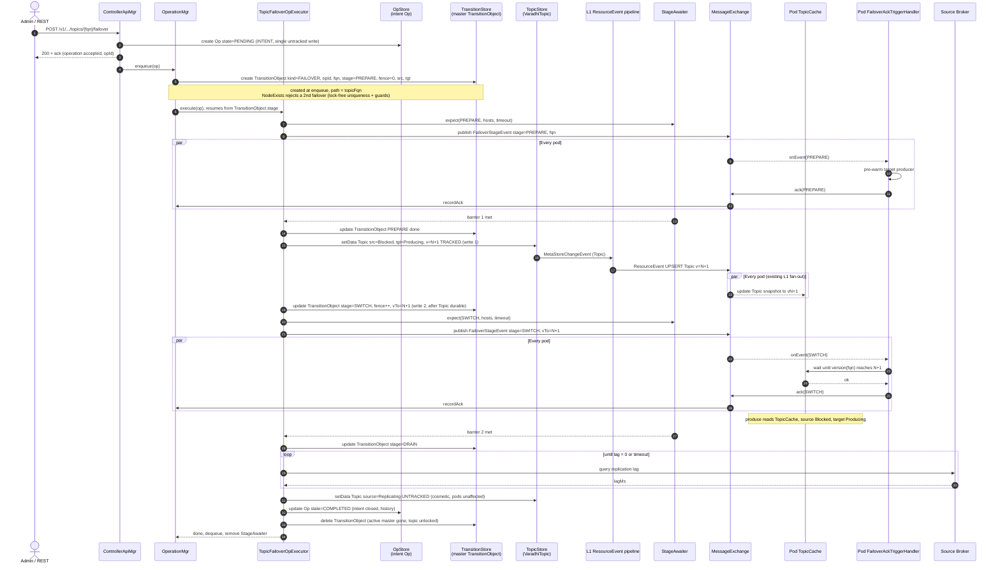

# Topic Failover — Transition-Object LLD

> Low-level design for the **revised** topic-failover model: a thin **intent Operation** plus a
> **`TransitionObject`** that acts as the master state machine during the transition.
> Refines `topic-failover-grooming-decisions.md` (D1 no-txn / D2 lock-free / D3 generic pointer)
> and **inverts** the earlier "Op is the source of truth" framing.

| Field | Value |
|-------|-------|
| Status | Groomed — pending implementation |
| Supersedes | `topic-failover-lld.md` (FTO + Op-as-truth), and D1/D3 framing of `topic-failover-grooming-decisions.md` |
| Components | `entities`, `spi`, `metastore-zk`, `controller`, `web` (pod side unchanged) |
| Key model shift | Op = **intent + history**; `TransitionObject` = **master state during transition** |

---

## 0. Design anchor (why this is safe)

Pods decide where to produce **only** from the `VaradhiTopic` version + per-region `TopicState` they
observe in their local `TopicCache`. They never read the failover Op or the `TransitionObject`.

Consequences that drive the whole LLD:
- The **Topic entity is the functional source of truth** for routing.
- The **`TransitionObject` is controller-only orchestration state** — recoverable, off the data path.
- We need **no held lock**, **no cross-entity transaction**, and **no pod-side dependency** on the
  `TransitionObject`. Correctness rests on *Topic-first write ordering* + a *version-gated pod barrier*.

---

## 1. Entities

```java
// INTENT — OpStore, keyed by opId, retained forever as a history record.
final class TopicFailoverOperation extends OrderedOperation {
    String  operationId;          // UUID
    String  topicFqn;             // ordering key = "TopicFailover_" + topicFqn
    String  requestedBy;
    String  sourceRegion, targetRegion;
    boolean waitForReplicationLagToClear;
    OpState state;                // PENDING -> RUNNING -> COMPLETED | ERRORED
    long    createdAt, endedAt;
}

// MASTER — TransitionStore, controller-only. NOT broadcast, NOT in any pod cache.
final class TransitionObject extends MetaStoreEntity {
    TransitionKind transitionKind;       // FAILOVER | STORAGE  (generic; failover only flips produce-gate)
    String         operationId;          // back-link to the intent Op
    // ---- master state during the transition ----
    FailoverStage  currentStage;         // PREPARE | SWITCH | DRAIN | COMPLETED | ABORTED
    long           fenceVersion;         // monotonic; stamped on every stage event + ack
    String         sourceRegion, targetRegion;
    long           topicVersionToAwait;  // set at SWITCH (= N+1); 0 otherwise
    List<StageSnapshot> stageHistory;    // per-stage acks, timing, outcome
}

enum TransitionKind { FAILOVER, STORAGE }   // operationKind on the TransitionObject
```

- `TransitionObject.name == topicFqn` → ZK create enforces **one active transition per topic**.
- `transitionKind` makes the object generic (re-usable for future storage transitions); for failover
  the only functional effect is flipping per-region produce-gate (`Producing` / `Blocked`).
- The Op carries intent + final outcome; the `TransitionObject` carries live stage state + history.

---

## 2. Visibility model — the load-bearing constraint

> **`TransitionObject` is never available in the pod `TopicCache`. No pod-side check may be based on it.**

| Data | Store | Tracked (L1 fan-out)? | Visible to pods? |
|------|-------|-----------------------|------------------|
| `VaradhiTopic` (per-region `TopicState`) | `TopicStore` | ✅ tracked → `TopicCache` | ✅ **only routing input** |
| `TransitionObject` (master) | `TransitionStore` | ❌ untracked, controller-only | ❌ never |
| `TopicFailoverOperation` (intent) | `OpStore` | ❌ untracked, controller-only | ❌ never |

Everything a pod needs for a stage is **self-contained in the `FailoverStageEvent`**
(`stage`, `fqn`, `fenceVersion`, `topicVersionToAwait`) plus what is already in `TopicCache`.
The produce gate uses only `TopicState.isProduceAllowed()`; the SWITCH wait uses only the
`TopicCache` version. This keeps pods fully decoupled from the control-plane master object.

---

## 3. Stores / SPIs

Controller talks to ZK **only via SPIs** (module-boundary rule in `.windsurf/rules/core-instructions.md`) —
no `ZKMetaStore` / `ZNode` in the controller, and **no `multi()`** on the failover path.

```java
interface TransitionStore {                       // NEW SPI; ZK-backed impl in metastore-zk
    void                   create(TransitionObject t);  // atomic create on path = fqn → NodeExists = uniqueness
    TransitionObject       get(String topicFqn);
    boolean                exists(String topicFqn);     // discovery + delete/update guard
    void                   update(TransitionObject t);  // optimistic version (CAS)
    void                   delete(String topicFqn);
    List<TransitionObject> listActive();                // admin + reconciler
}
```

`OpStore` keeps the intent Op via existing `OrderedOperation` plumbing
(`create / update / getActive...`). ZNode path: `TransitionObject` lives as a topic-scoped pointer
(child under the topic, or a dedicated flat dir keyed by FQN) — chosen at impl; either keeps O(1)
discovery and atomic-create uniqueness without mutating `VaradhiTopic`.

---

## 4. REST API

| Method | Route | Behavior |
|--------|-------|----------|
| POST | `/v1/projects/:p/topics/:t/failover` | create intent Op → **`200` + `opId`** → then `enqueue` (creates `TransitionObject`) |
| GET  | `/v1/projects/:p/topics/:t/failover` | snapshot from `TransitionStore.get` (404 if none) |
| POST | `/v1/projects/:p/topics/:t/failover/abort` | honored only while `currentStage.isAbortable()` (PENDING / PREPARE) |
| GET  | `/v1/admin/failovers/active` | `TransitionStore.listActive()` |

`200` means **"failover requested and durably recorded"**, not "transition started".

---

## 5. CRUD guards (lock-free, no held lock)

- **DELETE topic** → reject if `TransitionStore.exists(fqn)` (active transition).
- **UPDATE topic** → reject if `TransitionStore.exists(fqn)` (active transition).
- **Second failover** → `TransitionStore.create` fails with `NodeExists`.
- **Concurrent topic edit vs SWITCH** → optimistic version on the Topic write (`BadVersion` → stage re-reads/retries).
- **Per-topic serialization** → `OperationMgr` ordering key `"TopicFailover_" + fqn`.

No `InterProcessMutex`; coordination is entirely via atomic-create + ordering-key + optimistic version.

---

## 6. State machine (on the `TransitionObject`)



`isAbortable() = (stage == PENDING || stage == PREPARE)` — abort is rejected (409) once SWITCH commits.

---

## 7. Write ordering (single writes, no transaction)

| Moment | Writes, in order | Tracked? |
|--------|------------------|----------|
| create | OpStore: Op `PENDING` | untracked |
| enqueue | TransitionStore: create `TransitionObject` (`PREPARE`) | untracked |
| PREPARE done | TransitionStore: update | untracked |
| **SWITCH** | **1) TopicStore: Topic src=Blocked, tgt=Producing, v=N+1** → **2) TransitionStore: stage=SWITCH, vTo=N+1** | 1 = **tracked**, 2 = untracked |
| DRAIN | TransitionStore: update stage=DRAIN | untracked |
| COMPLETED | 1) Topic src=Replicating (cosmetic) → 2) Op `COMPLETED` → 3) delete `TransitionObject` | all untracked |
| ABORTED (post-partial-switch) | 1) Topic rollback (**tracked**) → 2) Op `ERRORED` → 3) delete `TransitionObject` | 1 = tracked |

**Sole ordering invariant:** at SWITCH and at ABORT-rollback, the **tracked Topic write precedes the
master update**, because pods converge on the Topic version — never on the master.

---

## 8. Stage barrier (`StageAwaiter`, controller-side)

Per stage the executor:
1. `expect(opId, stage, fenceVersion, liveHosts, timeoutMs, resendAfterMs, resendHook)`,
2. `broadcast(FailoverStageEvent)`,
3. `await` the barrier future.

Pods reply with `FailoverStatusUpdate{opId, host, stage, fenceVersion, ok}` → `recordAck` fills the
barrier; it completes when `ackedOk ⊇ expected`.

- **Fencing:** acks with a stale `fenceVersion` are ignored.
- **Resend:** on `resendAfterMs`, re-push the event to **missing hosts only**.
- **Membership:** a dead expected host is removed (`markHostGone`) so the barrier can't hang.
- **Timeout:** `stageAckTimeoutMs` exceeded → stage fails → abort/rollback (pre-SWITCH) or retry.

Barriers are the controller's *confirmation* mechanism; routing is the pods' *version-gated* mechanism.
A lost ack delays controller knowledge but never mis-routes traffic.

---

## 9. Pod side (unchanged module; no `TransitionObject` access)

```text
onEvent(FailoverStageEvent e):
    PREPARE  -> brokerWarmer.warm(e.fqn, target); ack(ok)
    SWITCH   -> wait until TopicCache.version(e.fqn) >= e.topicVersionToAwait; ack(ok)
    TERMINAL -> no-op; ack(ok)

// produce path unchanged:
ProducerService.produce(fqn) -> TopicCache lookup -> TopicState.isProduceAllowed()
```

The pod uses only `TopicCache` (version + `TopicState`) and the self-contained event. No control-plane
entity is read on the pod.

---

## 10. End-to-end sequence



---

## 11. Recovery / reconciler (eventual consistency)

On controller leadership-acquired:
1. Load non-terminal intent Ops from `OpStore`.
2. For each, ensure a `TransitionObject` exists — recreate it from the Op if the crash hit the
   create→enqueue window; then re-enqueue and **resume from `TransitionObject.currentStage`**.
3. Delete `TransitionObject`s whose Op is terminal or absent.

Because pods route off the Topic version and never off the master, any divergence between Op,
`TransitionObject`, and Topic converges silently — never visible as wrong produce routing.

---

## 12. Invariants

1. Exactly **one tracked Topic write** per successful failover (SWITCH); cleanup is cosmetic/untracked.
2. **Pods never read the `TransitionObject`** — decisions use `TopicCache` (version + `TopicState`) and
   the self-contained `FailoverStageEvent` only.
3. **No held lock:** uniqueness = atomic `TransitionObject` create; serialization = `OperationMgr`
   ordering key; topic-edit races = optimistic version.
4. **No cross-entity transaction:** correctness rests on Topic-first ordering + version-gated barrier.
5. Op = intent + history (retained); `TransitionObject` = master (deleted on terminal).

---

## 13. Open items for implementation

1. `TransitionObject` znode placement — child under the topic vs. flat dir keyed by FQN.
2. Is `transitionKind` needed on the `TransitionObject`, or derivable from the Op? (Keep for genericity.)
3. Exact guard error type / HTTP status (proposed: 409 Conflict).
4. Reconciler hook point on controller leadership acquisition.
5. Whether `STORAGE` transition reuses the same stages or a reduced subset.
