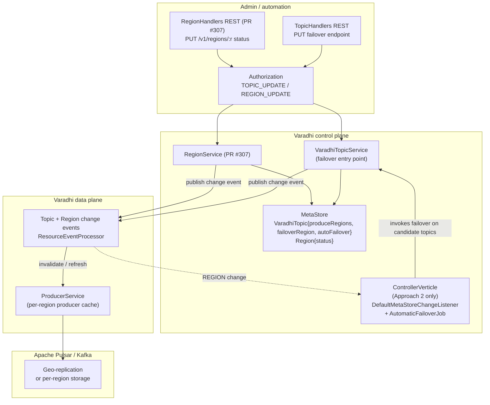
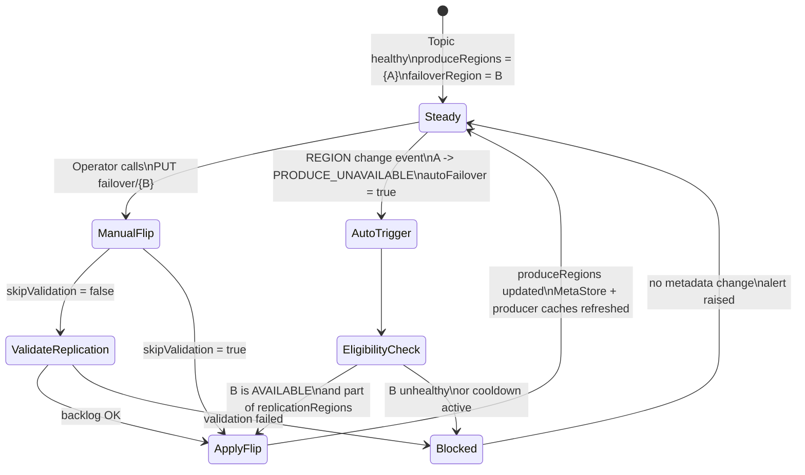
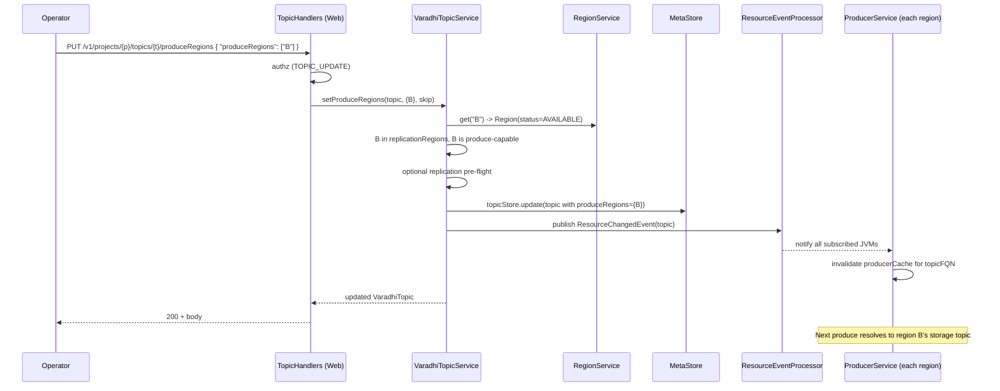
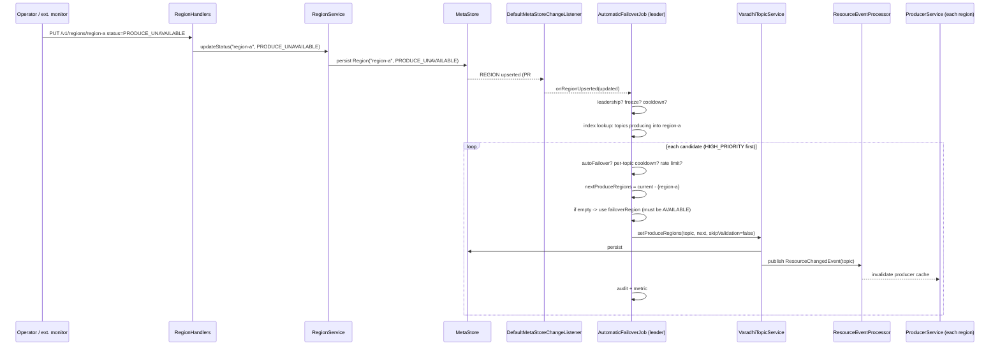

# Topic Failover — OSS Varadhi Design

> Status: Draft for review
> Scope: Bring the multi-region "topic failover" capability that exists in the internal (oncall) Varadhi codebase into OSS Varadhi (`flipkart-incubator/varadhi`).
> Audience: Varadhi maintainers and contributors.
> Builds on: PR [#307 — Adding region support](https://github.com/flipkart-incubator/varadhi/pull/307). All entity / status names below match that PR.

> **Current implementation scope:** Ship **Approach 1 only** — manual producer failover (REST + `produceRegions` + producer/cache behaviour). **Approach 2** (controller-driven automatic failover, `TopicFailoverService`, `AutomaticFailoverJob`, etc.) is **deferred**; §7 and related material remain as **future design**, not committed backlog for the first OSS delivery.

---

## 1. Problem statement

A Varadhi topic logically spans one or more regions. Today, OSS Varadhi assumes a **single deployment region** for every topic and bakes that region into the topic at create time. There is no first-class way to:

1. Ask "which region is currently authoritative for producing to topic `X`?"
2. Move that authority to another region (planned or due to a regional outage).
3. Make producers and (later) consumers reflect that change without a redeploy.

Internally (oncall), this concept exists end-to-end: a topic carries an `activeProduceZone`, an admin REST endpoint flips it after pre-flight Pulsar geo-replication checks, the producer cache is keyed by zone, and `GlobalTopic` metadata in ZooKeeper stores topology and a `FailoverType` (`MANUAL` / `AUTOMATIC`).

This document specifies how to bring that capability into OSS. **First OSS delivery:** Approach 1 (manual producer failover). **Approach 2** (controller-driven automatic failover) is specified for when automation is prioritized and is **deferred** for now. The rest of the doc covers both, with scope called out at the top.

---

## 2. Current state in OSS Varadhi

Pointers below are to OSS files (`/Users/bandeep.kataria/Desktop/oss/varadhi`).

### 2.1 Topic model

OSS already has multi-region scaffolding on the topic itself:

```16:23:/Users/bandeep.kataria/Desktop/oss/varadhi/entities/src/main/java/com/flipkart/varadhi/entities/VaradhiTopic.java
public class VaradhiTopic extends LifecycleEntity implements AbstractTopic {

    private final Map<String, SegmentedStorageTopic> internalTopics;
    private final boolean grouped;
    private final TopicCapacityPolicy capacity;
    private final String nfrFilterName;
    private final TopicCategory topicCategory;
```

```126:163:/Users/bandeep.kataria/Desktop/oss/varadhi/entities/src/main/java/com/flipkart/varadhi/entities/VaradhiTopic.java
    public void addInternalTopic(String region, SegmentedStorageTopic internalTopic) {
        this.internalTopics.put(region, internalTopic);
    }
    // ...
    public SegmentedStorageTopic getProduceTopicForRegion(String region) {
        return internalTopics.get(region);
    }
```

But the factory plants a **single** internal topic in `deploymentRegion`, with a TODO acknowledging that the regional/HA policy is missing:

```22:45:/Users/bandeep.kataria/Desktop/oss/varadhi/core/src/main/java/com/flipkart/varadhi/core/topic/VaradhiTopicFactory.java
    /**
     * TODO: This field is currently used to provide a default value for the primary region of the topic being created.
     * Ideally, this should be derived from the TopicResource as part of the Regional/HA/BCP-DR policy.
     * Since those policies are not yet available, the deploymentRegion is used as a global single primary
     * topic region as a temporary solution.
     */
    private final String deploymentRegion;
```

```70:80:/Users/bandeep.kataria/Desktop/oss/varadhi/core/src/main/java/com/flipkart/varadhi/core/topic/VaradhiTopicFactory.java
    private void planDeployment(Project project, VaradhiTopic varadhiTopic) {
        StorageTopic storageTopic = topicFactory.getTopic(
            0, varadhiTopic.getName(), project, varadhiTopic.getCapacity(), InternalQueueCategory.MAIN);

        varadhiTopic.addInternalTopic(deploymentRegion, SegmentedStorageTopic.of(storageTopic));
    }
```

### 2.2 Producer path

`ProducerService` already resolves the region authoritatively at **produce time**:

```140:158:/Users/bandeep.kataria/Desktop/oss/varadhi/producer/src/main/java/com/flipkart/varadhi/produce/ProducerService.java
    private Producer<? extends Offset> loadProducerObject(
        String produceRegion, ProducerFactory producerFactory, ProducerCacheKey key) {
        var topicMaybe = topicCache.get(key.varadhiTopicFQN);
        // ...
        return producerFactory.newProducer(
            topic.getEntity().getProduceTopicForRegion(produceRegion).getTopic(key.storageTopicId),
            topic.getEntity().getCapacity());
    }
```

```207:228:/Users/bandeep.kataria/Desktop/oss/varadhi/producer/src/main/java/com/flipkart/varadhi/produce/ProducerService.java
    private CompletableFuture<ProduceResult> produceToValidTopic(VaradhiTopic topic, Message message) {
        SegmentedStorageTopic internalTopic = topic.getProduceTopicForRegion(produceRegion);
        if (internalTopic == null) {
            throw new ResourceNotFoundException(String.format("Topic not found for region(%s).", produceRegion));
        }
        if (!internalTopic.getTopicState().isProduceAllowed()) {
            return CompletableFuture.completedFuture(
                ProduceResult.ofNonProducingTopic(message.getMessageId(), internalTopic.getTopicState()));
        }
        // ...
    }
```

Notes:

- `produceRegion` is a **constant per JVM**, injected at construction. Today there is no concept of "active region per topic" — every topic resolves to the same `produceRegion`.
- Producer cache key is `(topicFQN, storageTopicId)`. Region is implicit in the JVM.
- `TopicState` already gates produce per region (`isProduceAllowed`), giving us a natural place to mark a region "drained / blocked" without deleting metadata.

### 2.3 REST surface

`TopicHandlers` exposes only `GET / CREATE / DELETE / LIST / RESTORE`:

```72:95:/Users/bandeep.kataria/Desktop/oss/varadhi/web/src/main/java/com/flipkart/varadhi/web/v1/admin/TopicHandlers.java
    @Override
    public List<RouteDefinition> get() {
        return new SubRoutes(
            "/v1/projects/:project/topics",
            List.of(
                RouteDefinition.get(GET, API_NAME, "/:topic")
                               .authorize(TOPIC_GET).build(this::getHierarchies, this::get),
                RouteDefinition.post(CREATE, API_NAME, "")
                               .hasBody().bodyParser(this::setRequestBody)
                               .authorize(TOPIC_CREATE).build(this::getHierarchies, this::create),
                RouteDefinition.delete(DELETE, API_NAME, "/:topic")
                               .authorize(TOPIC_DELETE).build(this::getHierarchies, this::delete),
                RouteDefinition.get(LIST, API_NAME, "").authorize(TOPIC_LIST).build(this::getHierarchies, this::list),
                RouteDefinition.patch(RESTORE, API_NAME, "/:topic/restore")
                               .authorize(TOPIC_UPDATE).build(this::getHierarchies, this::restore)
            )).get();
    }
```

There is **no failover endpoint** today.

### 2.4 Controller

`ControllerVerticle` runs as a leader-elected coordinator and already manages:

- Membership of `Consumer` nodes (`MembershipListener.joined/left`).
- Subscription operations and assignments via `OperationMgr` and `AssignmentManager`.
- Resource event processing (`ResourceEventProcessor`).

It does **not** know anything about regions or topic failover today, but **PR #307 already adds a REGION hook** to `DefaultMetaStoreChangeListener` (see §2.6) — i.e. the controller will be informed when any `Region` resource is upserted or invalidated. That is the primary trigger we will use for Approach 2.

### 2.5 Reference: what oncall has that OSS does not

The internal (oncall) codebase has the same feature implemented around different abstractions: a `GlobalTopic` ZK record, an `activeProduceZone` field on the topic, a `FailoverType` enum (`MANUAL`/`AUTOMATIC`), an admin endpoint `PUT /topics/{t}/activeProduceZone/{zone}`, and producer caches keyed by zone. We borrow the **shape** of that solution but use OSS-native names from PR #307 throughout this document.

### 2.6 What PR #307 (in flight) is adding

PR #307 lands the multi-region **vocabulary** that this design depends on. Anything in this section is not yet on `master`, but is the contract this design assumes.

**New `Region` entity, persisted in ZK, with full CRUD at `/v1/regions`:**

```text
Region {                    // entities/.../Region.java
  RegionName name;          // value object, non-blank string
  RegionStatus status;      // see below
}

enum RegionStatus {
  AVAILABLE,                // produce + consume + msp all OK
  UNAVAILABLE,              // region is down for everything
  PRODUCE_UNAVAILABLE,      // cannot produce; consume still OK
  CONSUME_UNAVAILABLE,      // cannot consume; produce still OK
  MSP_UNAVAILABLE           // message-stack provider (broker) is unhealthy
}
```

Helpers `isAvailable() / isProduceAvailable() / isConsumeAvailable() / isMessageStackAvailable()` express the granularity. This means OSS Varadhi does **not** need its own region-health probe inside the controller — region health is **data**, administered through the Region API or by an external operator/automation.

**Topic model extensions (proposed in `docs/TOPIC_MODEL_STRUCTURE.md`):**

```text
VaradhiTopic {
  ...existing fields...
  Set<RegionName> replicationRegions;   // where storage topics will exist
  Set<RegionName> produceRegions;       // currently authoritative producers
  boolean         autoFailover;         // opt in to automatic flips
  RegionName      failoverRegion;       // standby target when produceRegion is evicted
  Set<TopicTag>   tags;                 // operational classification
}

Project {
  Set<RegionName> replicationRegions;   // mandatory; bounds topic-level set
}
```

Implications:

- `produceRegions` is a **set** — single-active and multi-active are both representable. "Failover" in the multi-active case is *removing* the unhealthy region from the set, not replacing it.
- `failoverRegion` is the **declared standby**: where to go when the only / a `produceRegion` becomes unsafe.
- `autoFailover: boolean` replaces what oncall calls `FailoverType` (`MANUAL`/`AUTOMATIC`).
- `Project.replicationRegions` constrains what regions a topic may use.

**Controller hook:**
PR #307 extends `DefaultMetaStoreChangeListener` to handle `REGION` upsert / invalidate. Any `Region.status` change fires this listener on the leader controller — the natural integration point for Approach 2.

**Authorization:**
PR #307 adds `REGION_CREATE / GET / LIST / DELETE` to `ResourceAction`, `ResourceType.REGION`, and a `RegionHierarchy` for IAM. Failover endpoints (added by this design) reuse `TOPIC_UPDATE`.

---

## 3. Capability summary — current vs. PR #307 vs. needed

| Capability | OSS today | After PR #307 | Still needed for failover |
|---|---|---|---|
| Topic carries multi-region map (`region -> SegmentedStorageTopic`) | Yes (`internalTopics`) | Same | Multiple entries actually populated |
| `Region` first-class entity with status | **No** | **Yes** (`Region`, `RegionStatus`, `/v1/regions` CRUD) | Used as input |
| `Project.replicationRegions` | **No** | **Yes** (proposed) | Used at create time |
| Topic has `produceRegions: Set<RegionName>` | **No** (single JVM `produceRegion`) | **Yes** (proposed) | Becomes the runtime authority |
| Topic has `failoverRegion: RegionName` | **No** | **Yes** (proposed) | Used as standby target |
| Topic has `autoFailover: boolean` | **No** | **Yes** (proposed) | Gate for Approach 2 |
| Topic has `tags: Set<TopicTag>` | **No** | **Yes** (e.g. `HIGH_PRIORITY`) | Optional priority for failover order |
| Storage topic has a per-region replicated counterpart (broker geo-replication) | Out of scope for OSS code; relies on broker | Same | Same |
| Producer resolves region per-topic (not per-JVM) | **No** | Not changed by PR #307 | **Yes** — this design |
| Producer cache keyed by region | **No** | Not changed | **Yes** — this design |
| Admin REST: `PUT` failover endpoint | **No** | Not added | **Yes** — this design |
| Pre-flight check for replication backlog before flip | **No** | Not added | Optional SPI extension |
| Controller listens to region status changes | **No** | **Yes** (`DefaultMetaStoreChangeListener` REGION hook) | Used by Approach 2 |
| Controller-driven automatic failover orchestration | **No** | Not added | **Yes** for Approach 2 |
| Subscription / consumer follow-the-producer | **No** | Not added | Phase 3 (out of scope) |

---

## 4. Component diagram (target)



The dotted edge into `ControllerVerticle` is **only consumed in Approach 2**. Note that **no dedicated health probe lives inside Varadhi** — `Region.status` is the single source of truth for region health and is administered through the Region API (by an operator or by external automation that can decide a region is `PRODUCE_UNAVAILABLE` / `UNAVAILABLE`).

---

## 5. State machine



---

## 6. Approach 1 — Producer-only failover (manual)

### 6.1 Goal

Operators (or a thin script outside Varadhi) mutate `VaradhiTopic.produceRegions` via a REST call. Varadhi:

1. Validates the request against the topic's `replicationRegions` and the registered `Region` entities (PR #307).
2. Persists the change in the metastore.
3. Ensures every producer JVM, in every region, picks up the change.

There is **no** automatic decision-making in Varadhi: `autoFailover` is ignored in this approach. Reads / consumers are not changed.

### 6.2 Why this approach

- Smallest blast radius. No new controller responsibility, no health-decision logic to tune.
- Matches what most production playbooks already do today (humans declare "we are failing over").
- Establishes the data model and producer behaviour that Approach 2 reuses.
- Mirrors the manual half of oncall's design (`FailoverType.MANUAL` → OSS's `autoFailover = false`).

### 6.3 Design

#### 6.3.1 Entity changes

PR #307's docs already propose the relevant fields on `VaradhiTopic`. For Approach 1 we *use* them and don't invent new ones:

```java
// entities/.../VaradhiTopic.java   (lands with PR #307 doc, this design implements them)
private Set<RegionName> replicationRegions; // immutable post-create; bounded by Project
private Set<RegionName> produceRegions;     // mutable; >=1 element; subset of replicationRegions
private RegionName     failoverRegion;      // standby; must be in replicationRegions, not in produceRegions
private boolean        autoFailover;        // unused in Approach 1
private Set<TopicTag>  tags;                // optional, not consulted in Approach 1
```

Behaviour for Approach 1:

- `getProduceTopicForRegion(region)` already exists. Producer logic uses `produceRegions` to decide *which* region to publish to (single-active = first/only element; multi-active addressed in §6.5).
- `addInternalTopic(...)` continues to be how `internalTopics` is populated — one entry per `replicationRegions` member, created at topic-create time by `VaradhiTopicFactory`.
- Serialization: new Set fields default to empty; for migration, treat empty `produceRegions` as `{ deploymentRegion }` so existing single-region topics keep working.

`VaradhiTopicFactory` (today hard-codes `deploymentRegion`) must be updated to read `replicationRegions` from `TopicResource` (or fall back to `Project.replicationRegions`), create one storage topic per region, and seed `produceRegions` from request.

#### 6.3.2 Service changes

Two new methods on `VaradhiTopicService`, both targeting the same set of fields. We expose two endpoints because the operator intent is different:

```java
/** Replace the active produce regions wholesale (typical failover). */
public VaradhiTopic setProduceRegions(
        String topicFqn, Set<RegionName> newProduceRegions, boolean skipValidation) {
    VaradhiTopic topic = get(topicFqn);
    validateNonEmpty(newProduceRegions);
    validateAllInReplicationRegions(topic, newProduceRegions);
    validateAllRegionsKnownAndProduceCapable(newProduceRegions);  // RegionService lookup
    if (!skipValidation) {
        validateReplicationReady(topic, newProduceRegions);
    }
    topic.setProduceRegions(newProduceRegions);
    topicStore.update(topic);
    publishTopicChanged(topic);
    return topic;
}

/** Set / clear the standby. */
public VaradhiTopic setFailoverRegion(String topicFqn, RegionName failover) {
    VaradhiTopic topic = get(topicFqn);
    if (failover != null) {
        validateRegionKnownAndProduceCapable(failover);
        validateInReplicationRegions(topic, failover);
        validateNotAlreadyActive(topic, failover);
    }
    topic.setFailoverRegion(failover);
    topicStore.update(topic);
    publishTopicChanged(topic);
    return topic;
}
```

Validation rules use `RegionService.get(name)` (PR #307). A region whose `RegionStatus` is `PRODUCE_UNAVAILABLE`, `MSP_UNAVAILABLE`, or `UNAVAILABLE` is rejected unless `skipValidation=true`. This protects the operator from flipping into a region that the org has already marked unhealthy.

`validateReplicationReady` is best-effort: until a `getReplicationLag(StorageTopic, RegionName)` SPI exists on `StorageTopicService`, this is a no-op and the operator must use `skipValidation=true` knowingly. Adding the SPI is recommended but not blocking.

All operations are idempotent: setting `produceRegions` to its current value returns 200 with no state change.

#### 6.3.3 REST surface

Add to `TopicHandlers`:

```java
RouteDefinition.put(UPDATE, API_NAME, "/:topic/produceRegions")
               .authorize(TOPIC_UPDATE)
               .body(SetProduceRegionsRequest.class)
               .build(this::getHierarchies, this::setProduceRegions),

RouteDefinition.put(UPDATE, API_NAME, "/:topic/failoverRegion/:region")
               .authorize(TOPIC_UPDATE)
               .build(this::getHierarchies, this::setFailoverRegion),

RouteDefinition.delete(UPDATE, API_NAME, "/:topic/failoverRegion")
               .authorize(TOPIC_UPDATE)
               .build(this::getHierarchies, this::clearFailoverRegion)
```

Body for the produce-regions update:

```java
public record SetProduceRegionsRequest(Set<RegionName> produceRegions, Boolean skipValidation) {}
```

For the common single-active-region failover, callers can also POST to a convenience endpoint:

```
POST /v1/projects/:p/topics/:t/failover
  body: { "to": "region-b", "skipValidation": false }
```

…which internally calls `setProduceRegions(topic, { "region-b" }, skipValidation)`. This matches the ergonomics of oncall's `PUT activeProduceZone/{zone}` without baking single-active into the API contract.

Authorization: all use `TOPIC_UPDATE`, gated to admin in line with the current `isVaradhiAdmin` check used for restore.

#### 6.3.4 Producer propagation

This is the part of OSS that needs the most actual work, because today region is JVM-wide.

Two changes:

1. **Per-topic region resolution**

```java
// produce/ProducerService.java
private CompletableFuture<ProduceResult> produceToValidTopic(VaradhiTopic topic, Message message) {
    Set<RegionName> active = topic.getProduceRegions();
    RegionName chosen = pickProduceRegion(active, localRegion);   // see below
    SegmentedStorageTopic internalTopic = topic.getProduceTopicForRegion(chosen);
    // ... existing logic
}
```

`pickProduceRegion` policy (configurable, defaults shown):

- If `active` contains the JVM's local region → use local (cheapest, default).
- Else if the JVM's local region is `PRODUCE_UNAVAILABLE` / not in `active` and `producer.crossRegionProduce.enabled = true` → pick any element of `active`, preferring the topic's `failoverRegion`, then by stable hash of topic FQN to spread load.
- Else reject with `ProducerNotAvailableException` (caller sees a 5xx and is expected to retry against another Varadhi region). This is the **default safe behavior** and matches §10 open question 3.

This keeps the JVM's `deploymentRegion` purely as a hint; the topic's `produceRegions` is the runtime authority.

2. **Region-aware producer cache key**

```java
private record ProducerCacheKey(String varadhiTopicFQN, int storageTopicId, RegionName region) {}
```

When the topic's `produceRegions` changes, the existing entries become stale rather than wrong (the storage topic still exists — replication continues). To avoid serving stale state during the race window between metastore update and cache miss:

- Subscribe `ProducerService` to topic-change events from `ResourceEventProcessor` (already in the codebase) and **invalidate by `varadhiTopicFQN`** on change. The existing `topicCache` already refreshes from the metastore; we attach a listener that, on every refresh, drops `producerCache` entries for that FQN.

#### 6.3.5 Sequence — manual failover



### 6.4 Failure modes & guards (Approach 1)

| Failure | Behaviour |
|---|---|
| New region not registered (no `Region` ZK node) | 400 from `RegionService.get` |
| New region's `RegionStatus` is not produce-capable | 400 unless `skipValidation=true`; consults `Region.isProduceAvailable()` |
| New region not in topic's `replicationRegions` | 400 — operator must first add the region (separate admin op, out of scope here) |
| `produceRegions` requested = current `produceRegions` | 200, no-op |
| Metastore write fails | 5xx, no producer cache invalidation, no event published |
| Event delivery fails to one region | That region's producers still serve the **old** set until cache TTL expiry (`ProducerOptions.producerCacheTtlSeconds`, default 60 minutes). Mitigation: keep TTL low for HA-critical deployments **or** make producer look up `produceRegions` from `topicCache` per-call (cheap; in-process) and key the cache by `(topic, storageTopicId, region)` so the *region* is the only thing that needs to flip |
| Producer JVM in old region cannot reach broker in new region | If `producer.crossRegionProduce.enabled=false` (default), producer fails with `ProducerNotAvailableException` and the client retries against another Varadhi region. If true, attempts cross-region write and surfaces `ProduceException` on broker connectivity failure. Either way no message is silently lost |
| Subscriber consumes from old region after flip | Out of scope here; see Phase 3 |

### 6.5 Caveat: cross-region produce connectivity

This design assumes that a producer JVM in region A, after a flip from A → B, *may* reach the Pulsar/Kafka cluster in region B via the configured `ProducerFactory`. Most deployments don't want that. Two modes, controlled per deployment by `producer.crossRegionProduce.enabled`:

- **Local-only (default)**: if `localRegion ∉ produceRegions`, reject with `ProducerNotAvailableException`. The Varadhi REST client (or the upstream LB) is expected to redirect producer traffic to a region whose JVMs do match `produceRegions`.
- **Strict cross-region**: allow the producer to talk to the active region's broker directly. Useful when you have only one Varadhi cluster but multiple broker regions.

Default is **local-only** because it preserves the strongest invariant (no surprising cross-region writes) and matches how oncall is operated today.

### 6.6 What this approach does not deliver

- No automatic decision: humans (or external automation calling `PUT /v1/regions/:r` and then `PUT topic/produceRegions`) still decide when to flip.
- No consumer / subscription changes — consumer side may temporarily lag if it was pointed at the old region.
- No reaction to `Region.status` changes; even if PR #307's RegionStatus turns `PRODUCE_UNAVAILABLE`, no topic is moved automatically.

### 6.7 Work breakdown (Approach 1, assuming PR #307 is merged)

1. `entities`: add `produceRegions`, `failoverRegion`, `autoFailover`, `tags` to `VaradhiTopic` (per `docs/TOPIC_MODEL_STRUCTURE.md` proposal in PR #307). JSON-migration safe defaults.
2. `entities`: extend `TopicResource` so create / update API accepts `replicationRegions`, `produceRegions`, `failoverRegion`, `autoFailover`, `tags`.
3. `core`: rewrite `VaradhiTopicFactory` to honour `replicationRegions` (instead of single `deploymentRegion`) and seed `internalTopics` with one entry per region, plus seed `produceRegions` from request.
4. `core`: extend `VaradhiTopicService` with `setProduceRegions`, `setFailoverRegion`, `clearFailoverRegion`, plus convenience `failover(topic, to)`. Cross-validates against `RegionService` and `Project.replicationRegions`.
5. `spi`: optional `StorageTopicService.getReplicationLag(StorageTopic, RegionName)` with a default `UnsupportedOperationException`; implement in `pulsar/`.
6. `web`: add the four routes from §6.3.3 to `TopicHandlers`.
7. `produce`: replace JVM-wide `produceRegion` with per-topic resolution from `produceRegions`; add `region` to `ProducerCacheKey`; subscribe to topic-change events to invalidate.
8. `produce`: implement `producer.crossRegionProduce.enabled` toggle in `ProducerOptions` (default `false`).
9. Tests:
   - `web/v1/admin/TopicHandlersTest`: authz + validation paths for the four routes.
   - `core/VaradhiTopicServiceTest`: idempotency, region-status validation, project-bounds validation, persistence.
   - `produce/ProducerServiceTests`: cache invalidation on topic change; cross-region rejection in local-only mode.
   - `pulsar` E2E: two Pulsar clusters in `setup/docker/compose.yml`, end-to-end flip.
10. Docs: this file + short operator runbook under `docs/`.

Estimated effort: ~1.5–2 dev-weeks including tests, *assuming PR #307 has merged first*. Otherwise budget another ~1 week to land the entity / region pieces from #307.

---

## 7. Approach 2 — Producer + Controller-driven failover job

**Status: DEFERRED — not in the first OSS delivery** (manual failover / Approach 1 only for now). This section is retained so automation can be picked up later without re-deriving the design.

This is Approach 1 **plus** automation in the controller. When implemented, it supports BCP/DR: a region's status flips to `PRODUCE_UNAVAILABLE` / `UNAVAILABLE` and Varadhi moves topics off it without operator intervention.

### 7.1 Goal

Use `VaradhiTopic.autoFailover` as the per-topic opt-in. For topics with `autoFailover = true`, a controller job:

1. Reacts to **`Region` upsert events** (already wired by PR #307 via `DefaultMetaStoreChangeListener`) when a region's `RegionStatus` becomes not-produce-capable.
2. For each affected topic, removes the unhealthy region from `produceRegions`. If the resulting set would be empty, falls back to `failoverRegion`. Calls the same `setProduceRegions` path Approach 1 exposes.
3. Records every flip (audit log + metric) and respects guard rails (cooldown, rate-limit, kill-switch).

The crucial design choice: **Varadhi does not probe broker health internally**. `Region.status` is the single source of truth, administered through `/v1/regions/:r` (PR #307) by an operator or by external automation. This keeps Varadhi out of the health-decision business and concentrates ambiguity at one well-known boundary.

### 7.2 Why this approach

- Removes the human from the critical path during real outages.
- Reuses everything from Approach 1; the controller only calls the same service method an operator would.
- Reuses PR #307's REGION change-listener hook — no new probe / scheduling / hysteresis code in Varadhi.
- Centralises decision-making in the leader-elected controller, avoiding "every JVM decides for itself" split-brain.

### 7.3 Additional design on top of Approach 1

#### 7.3.1 Entity dependencies

No *new* entity fields beyond what PR #307 already proposes. We *consume*:

- `VaradhiTopic.autoFailover` — the per-topic gate (replaces oncall's `FailoverType` enum).
- `VaradhiTopic.produceRegions` — what to mutate.
- `VaradhiTopic.failoverRegion` — the standby target.
- `VaradhiTopic.tags` — optional. Topics tagged `HIGH_PRIORITY` are processed first when the job has many topics to flip.
- `Region.status` — the trigger.

#### 7.3.2 Region status as the trigger

`DefaultMetaStoreChangeListener` (already extended by PR #307 for REGION) hands every `Region` upsert to the controller. We add one consumer:

```java
// controller/.../AutomaticFailoverJob.java
class AutomaticFailoverJob implements RegionChangeListener {
    @Override
    public void onRegionUpserted(Region updated) {
        // Only the leader controller acts; followers ignore.
        if (!leadership.isLeader()) return;
        if (kill.isFailoverFrozen()) return;

        boolean produceCapable = updated.isProduceAvailable();
        if (produceCapable) {
            // Healthy or recovered. Optional: trigger failback if configured.
            return;
        }
        if (!perRegionCooldown.tryAcquire(updated.getRegionName())) return;

        evictRegionFromProducingTopics(updated.getRegionName(), reason(updated.getStatus()));
    }
}
```

Because the trigger is a metastore upsert (not a periodic probe), there is no hysteresis loop inside Varadhi. Hysteresis lives in *whoever sets `Region.status`* — typically a small external service that integrates with the org's existing broker / network monitoring. This is by design: Varadhi already trusts ZK-backed metadata as ground truth, and `Region.status` is just one more piece of it.

#### 7.3.3 Eviction logic

```java
private void evictRegionFromProducingTopics(RegionName bad, String reason) {
    List<VaradhiTopic> candidates = topicCache.byProducingRegion(bad);   // see §7.3.4
    candidates.sort(highPriorityFirst);                                  // tag-aware

    int flipped = 0;
    for (VaradhiTopic t : candidates) {
        if (!t.isAutoFailover()) continue;
        if (!perTopicCooldown.tryAcquire(t.getName())) continue;
        if (flipped >= cfg.maxTopicsPerMinute) { reschedule(); break; }

        Set<RegionName> next = new HashSet<>(t.getProduceRegions());
        next.remove(bad);

        if (next.isEmpty()) {
            RegionName fb = t.getFailoverRegion();
            if (fb == null || !regionService.get(fb.value()).isProduceAvailable()) {
                audit.allDark(t, bad, fb, reason);
                continue;
            }
            next.add(fb);
        }

        try {
            varadhiTopicService.setProduceRegions(t.getName(), next, /*skipValidation*/ false);
            metrics.failover(t, bad, next, reason);
            audit.flipped(t, bad, next, reason);
            flipped++;
        } catch (Exception e) {
            metrics.failoverError(t, e);
            audit.failed(t, bad, next, reason, e);
        }
    }
}
```

Properties:

- Runs only on the **leader**, gated by the same leadership the rest of `ControllerVerticle` uses.
- Topic-by-topic; one bad topic does not block others.
- For multi-active topics (`|produceRegions| > 1`), the bad region is just removed — no replacement is added. For single-active topics, `failoverRegion` is the fallback. If neither holds, the topic enters an "all-dark" state and an alert is raised.
- `HIGH_PRIORITY` topics (PR #307's `TopicTag`) get scheduled first so the most critical traffic moves first.
- `perRegionCooldown` and `perTopicCooldown` cap thrash if `Region.status` itself flaps.
- `maxTopicsPerMinute` bounds the blast radius of a wrong status change.

#### 7.3.4 Indexing topics by producing region

The current `topicCache` is keyed by FQN. Add a secondary index:

```java
class TopicByRegionIndex implements ResourceChangeListener<VaradhiTopic> {
    private final Map<RegionName, Set<String>> byProducingRegion = new ConcurrentHashMap<>();
    public Set<VaradhiTopic> get(RegionName r) { ... }
    @Override public void onChange(EntityResource<VaradhiTopic> r) { rebuildEntry(r); }
}
```

Built incrementally from `ResourceEventProcessor` events; warm-loaded at controller startup by a `topicStore.list()`. This keeps the eviction loop O(topics in bad region) rather than O(all topics).

#### 7.3.5 Optional failback

When a region recovers (`Region.status` → `AVAILABLE`), the same listener can optionally re-add it to topics whose `produceRegions` was reduced because of *that* region. Failback is **off by default** because:

- Most ops teams prefer to observe a recovered region for a while before sending real traffic.
- The reduction history needs to be persisted (see audit, §7.3.7) to know which topics to re-expand.

If enabled (`failover.failback.enabled = true`), failback uses a longer cooldown (`perRegionFailbackCooldownSec`, default `30 min`).

#### 7.3.6 Split-brain safety

1. Controller leader election guarantees a single decision-maker.
2. Eviction refuses to drain a topic to empty unless `failoverRegion` is currently produce-capable (the "all-dark" guard).
3. Rate limit `maxTopicsPerMinute` prevents a wrong status change from rewriting half the cluster's metadata.
4. Per-region and per-topic cooldowns prevent flapping if `Region.status` flaps.
5. Kill-switch: ZK node `/varadhi/failover/freeze=true` instantly disables the job globally. This is the incident-response break-glass.

#### 7.3.7 Audit

Every flip writes one structured log line *and* one ZK history record under `/varadhi/failover/history/<topic>/<ts>` containing: timestamp, leader-controller node id, source `RegionStatus`, before/after `produceRegions`, reason, outcome. ZK is fine for low write rates; if churn becomes a concern, swap for a dedicated metastore table.

### 7.4 Sequence — automatic failover (PR #307 region model)



### 7.5 Failure modes & guards (Approach 2)

| Failure | Behaviour |
|---|---|
| Status is wrong (false `PRODUCE_UNAVAILABLE` on a healthy region) | Per-region and per-topic cooldowns cap flips; rate limit caps total flips per minute; operator can revert via `PUT /v1/regions/:r AVAILABLE` and (with failback enabled) topics return automatically |
| Status is wrong (region truly dead but `Region` is still `AVAILABLE`) | Approach 1 manual flip is always available; alert on broker telemetry, then `PUT /v1/regions/:r PRODUCE_UNAVAILABLE` |
| All replication regions degraded simultaneously | "All-dark" guard prevents draining `produceRegions` to empty; affected topics stay on the last set and an alert is raised |
| Leader controller dies mid-flip | A flip is one idempotent metastore write per topic; new leader re-reads `Region` + topic state and resumes evicting on the next REGION-change event (or an operator can re-trigger by re-`PUT`ting the same status) |
| Storm: many topics in the bad region | `maxTopicsPerMinute` smooths it; remainder is requeued and processed on the next tick |
| `failoverRegion` itself becomes `PRODUCE_UNAVAILABLE` mid-eviction | Eviction skips the topic and audits "all-dark"; nothing is written |
| Status flapping (`PRODUCE_UNAVAILABLE` → `AVAILABLE` → `PRODUCE_UNAVAILABLE` …) | Per-region cooldown serializes reactions; failback (if enabled) uses a longer cooldown so the flap dampens within a few cycles |

### 7.6 Configuration

```yaml
controller:
  failover:
    enabled: true                    # global on/off
    perRegionCooldownSec: 300        # min seconds between two reactions to the same region
    perTopicCooldownSec: 600         # min seconds between two flips of the same topic
    maxTopicsPerMinute: 50           # rate limit
    failback:
      enabled: false                 # off by default
      perRegionFailbackCooldownSec: 1800
    priority:
      tagOrder: [HIGH_PRIORITY]      # tags processed first; rest in metastore order
```

No region list here — that's `Region` resources in the metastore (PR #307).

### 7.7 Work breakdown (Approach 2, on top of Approach 1)

**Oncall parity — controller failover service:** internal oncall keeps a long-running **failover service in the controller** for orchestration (guards, batching, audit). OSS should introduce a dedicated **`TopicFailoverService`** (name TBD, e.g. `FailoverOrchestrationService`) on the **leader** that owns eviction policy; `AutomaticFailoverJob` stays a thin REGION listener that **delegates** to this service, which in turn calls `VaradhiTopicService.setProduceRegions` (same persistence path as manual Approach 1). See `docs/TOPIC_FAILOVER_MASTER_FOR_GOOGLE_DOCS.md` §N.

1. `controller`: new `TopicFailoverService` (leader-scoped) + thin `AutomaticFailoverJob` registered as a `RegionChangeListener` on `DefaultMetaStoreChangeListener` (the hook PR #307 adds). Lifecycle bound to leader election in `ControllerVerticle.onLeaderElected`.
2. `controller`: new `TopicByRegionIndex` consuming `ResourceEventProcessor` events; cold-loaded from `topicStore.list()` at startup.
3. `controller`: leader-aware kill-switch reading `/varadhi/failover/freeze` ZK node.
4. `controller/config`: extend `ControllerConfiguration` with the failover block above.
5. `core`: `RegionService` already exists (PR #307). Add a small `updateStatus(name, RegionStatus)` if PR #307 hasn't shipped one yet (the PR review thread asks for a `PUT/PATCH` for status — see open question in §10).
6. `metrics`: failover counters (`varadhi_failover_total{from_region,outcome,reason}`), gauges per-region for "topics producing into" count.
7. Audit: structured log + ZK history under `/varadhi/failover/history/<topic>/<ts>`.
8. Tests:
   - `controller/.../AutomaticFailoverJobTest`: REGION upsert → topic mutation; cooldown; rate limit; kill-switch; all-dark guard; HIGH_PRIORITY ordering.
   - End-to-end (`e2e/`): `PUT /v1/regions/A PRODUCE_UNAVAILABLE`, assert all `autoFailover=true` topics drain region A within a few seconds; producers in surviving regions keep serving traffic. Then `PUT /v1/regions/A AVAILABLE` with failback on, assert restoration.

Estimated effort: ~2 dev-weeks on top of Approach 1 — meaningfully smaller than the original "build a probe inside the controller" estimate, because PR #307 carries the heavy lifting around region modelling and change events.

---

## 8. Comparison

| Dimension | Approach 1 (Producer-only) | Approach 2 (Producer + Controller job) |
|---|---|---|
| Decision maker | Operator (via `PUT topic/produceRegions`) | Leader controller, triggered by `Region.status` changes |
| Health source of truth | Operator's external monitoring | `Region.status` (PR #307), set by operator or external automation |
| Time to fail over | Minutes (human in the loop) | Seconds (one ZK event → one ZK write per topic) |
| New code beyond PR #307 | Topic fields, REST routes, producer cache fix | All of Approach 1 + `TopicFailoverService` + thin `AutomaticFailoverJob` + topic-by-region index + audit |
| Risk of bad auto-flip | Zero (no auto) | Real, but contained: cooldowns, rate limit, all-dark guard, kill-switch |
| Maps to oncall feature | `FailoverType.MANUAL` half | Adds the `FailoverType.AUTOMATIC` half, expressed via `autoFailover` |
| Recommended as first step | **Yes** | Build on top of Approach 1 |

---

## 9. Phased rollout recommendation

1. **Phase 0 — PR #307 lands.** Region entity, status, RegionService, REST CRUD, IAM, controller listener hook, topic-model docs. Approach 1 work assumes this is in place.
2. **Phase 1 — Approach 1 (current delivery).** Implement the proposed `VaradhiTopic` fields (`replicationRegions`, `produceRegions`, `failoverRegion`, `autoFailover`, `tags`); rewrite `VaradhiTopicFactory` for multi-region; add the failover REST routes; fix the producer cache. Ship with all topics defaulting to `autoFailover=false`. Dogfood manual flips. **Do not ship or enable** controller automatic failover in this phase.
3. **Phase 2 — Approach 2 (deferred).** Implement `TopicFailoverService`, thin `AutomaticFailoverJob`, and `TopicByRegionIndex` in the controller; roll out behind `controller.failover.enabled=false` initially; then enable in staging/production when automation is prioritized. Failback stays off by default until operators are comfortable.
4. **Phase 3 (out of scope here).** Subscription / consumer follow-the-producer (mirrors oncall's `updateSubscriptionConsumeZone`). This is meaningfully more work because it touches the consumer assignment lifecycle inside `ControllerApiMgr`.

---

## 10. Open questions

1. **Where does `Region.status` get updated from?** PR #307 ships CRUD but the review thread on the PR (`bandeep18` comment, Apr 2 2026) explicitly asks "no PUT/PATCH (or equivalent) to update status?". For **Approach 1**, operators can still flip topics via REST without Varadhi reacting to `Region.status`. **Approach 2** *requires* a status-update endpoint (or an internal mechanism) — part of #307 or a follow-up **when Phase 2 is scheduled**.
2. **Multi-active vs single-active default for new topics.** `produceRegions` is a `Set`, so both are representable. Default should probably be **single-active** (= `{ project's primary region }`) to match today's OSS semantics; multi-active is opt-in.
3. **Replication-lag SPI.** Worth adding `StorageTopicService.getReplicationLag(StorageTopic, RegionName)` even with a best-effort Pulsar implementation, so the manual flip has a meaningful pre-flight. Required-or-nice-to-have call.
4. **Producer connectivity model.** Default to local-only (reject cross-region produce) vs. allow cross-region writes. This document recommends local-only; needs a maintainer call.
5. **Audit storage.** ZK history nodes vs. a metastore table. ZK is consistent with the rest of OSS Varadhi's metadata; preferable unless a relational store is added.
6. **Does eviction wait for in-flight messages?** Today's flip is a metadata-only change; in-flight produce calls in the bad region either succeed (if the broker is partially up) or fail naturally. No bounded "drain" window. Worth confirming this matches operator expectation.
7. **Regional priority via tags.** §7.3.3 uses `TopicTag.HIGH_PRIORITY` for ordering. Should other tags (e.g. a future `LOW_PRIORITY`) defer entirely until the high-priority cohort is done?

---

## 11. References

- **Region modelling baseline** — PR [#307 — Adding region support](https://github.com/flipkart-incubator/varadhi/pull/307):
  - `entities/.../Region.java`, `RegionName.java`, `RegionStatus.java`, `TopicTag.java`
  - `entities/.../auth/ResourceAction.java` (REGION_*)
  - `core/.../RegionService.java`
  - `spi/.../db/RegionStore.java`, `metastore-zk/.../VaradhiMetaStore.java` (REGION wiring)
  - `web/.../v1/admin/RegionHandlers.java`, `web/.../hierarchy/Hierarchies.java` (RegionHierarchy)
  - `controller/.../DefaultMetaStoreChangeListener.java` (REGION upsert / invalidate hook)
  - `docs/TOPIC_MODEL_STRUCTURE.md` (proposed `replicationRegions` / `produceRegions` / `autoFailover` / `failoverRegion` / `tags` on `VaradhiTopic` and `replicationRegions` on `Project`)
- **Internal (oncall) reference implementation** — building blocks we are porting selectively:
  - `core/src/main/java/com/flipkart/varadhi/core/global/GlobalTopic.java`
  - `core/src/main/java/com/flipkart/varadhi/core/global/FailoverType.java`
  - `core-data/src/main/java/com/flipkart/varadhi/services/UmbrellaTopicService.java` — `updateActiveProduceZone`
  - `core-data/src/main/java/com/flipkart/varadhi/services/PulsarTopicService.java` — `updateActiveProduceZone` + replication validation
  - `rest-api/src/main/java/com/flipkart/varadhi/resources/TopicResourceV2.java` — `PUT /topics/{t}/activeProduceZone/{zone}`
  - `producer/src/main/java/com/flipkart/varadhi/producers/ProducerKey.java` — region-aware cache key
- **OSS Varadhi anchors edited / extended by this design**:
  - `entities/.../VaradhiTopic.java` (extend with PR #307 fields)
  - `core/.../VaradhiTopicService.java`, `core/.../topic/VaradhiTopicFactory.java`
  - `producer/.../produce/ProducerService.java` (per-topic region resolution + region-keyed cache)
  - `web/.../v1/admin/TopicHandlers.java` (failover routes)
  - `controller/.../ControllerVerticle.java` + `DefaultMetaStoreChangeListener.java` (Approach 2)
