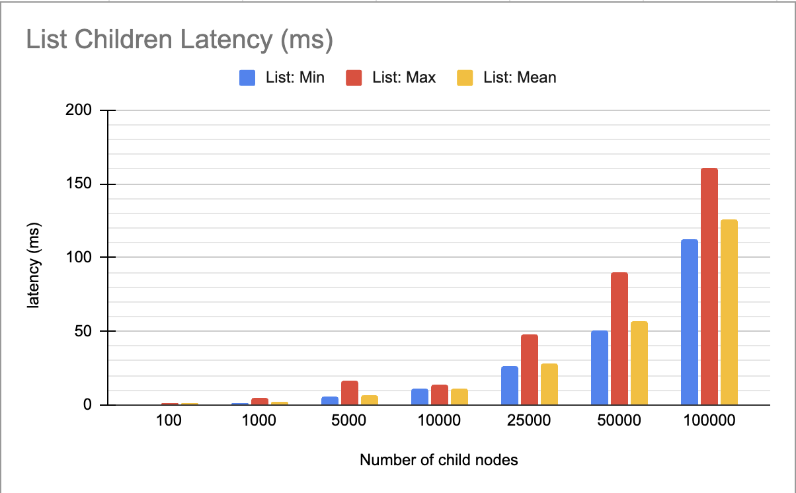
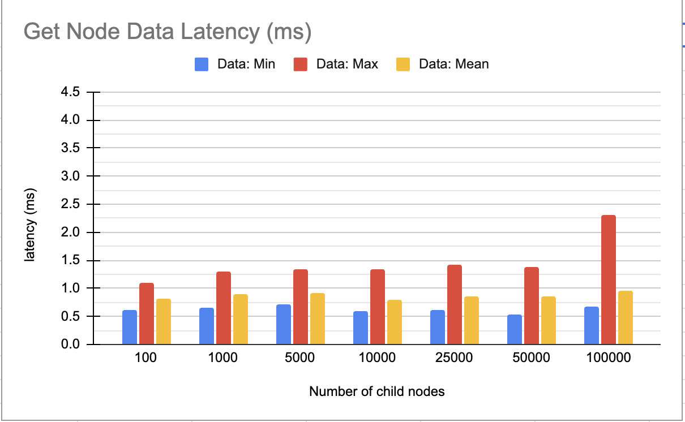
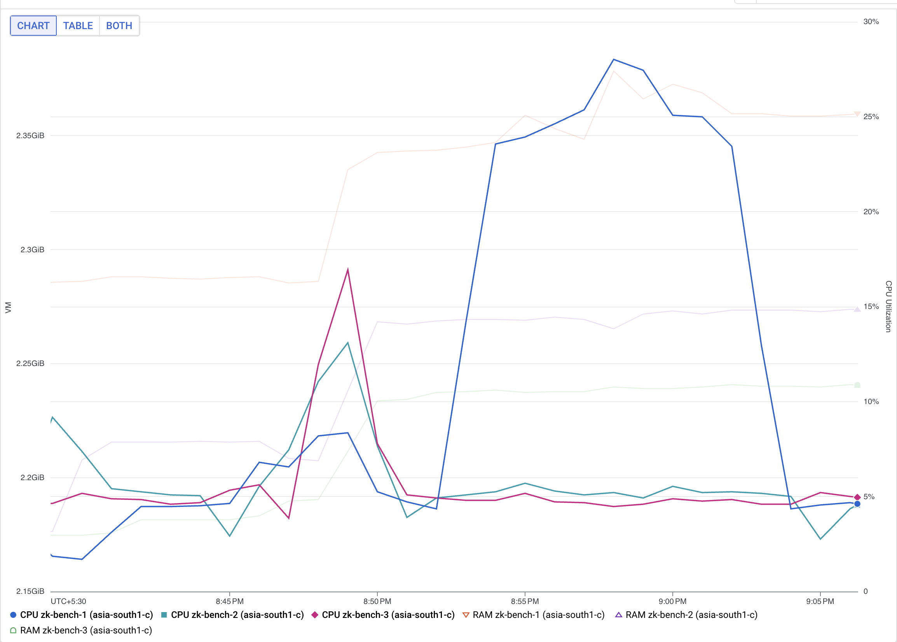
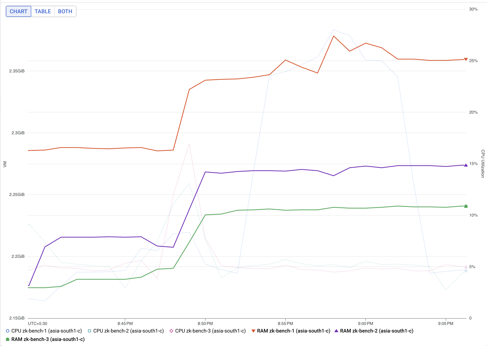
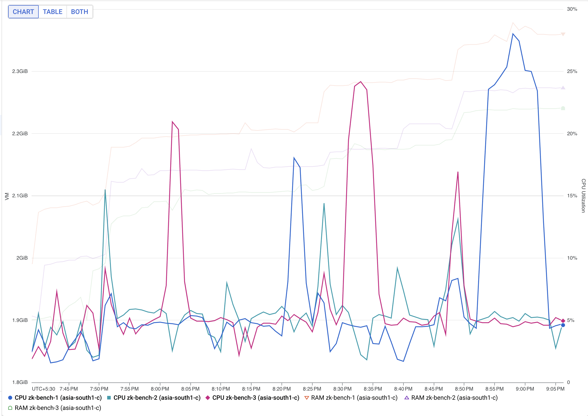
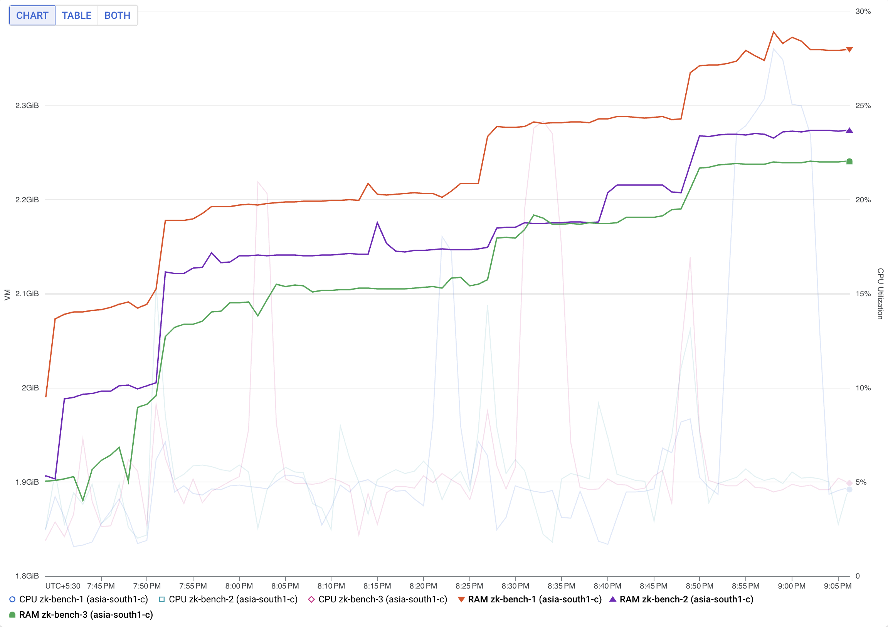
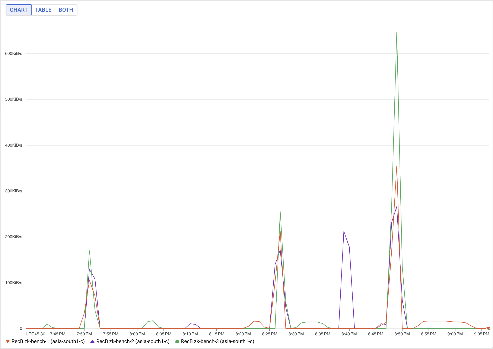
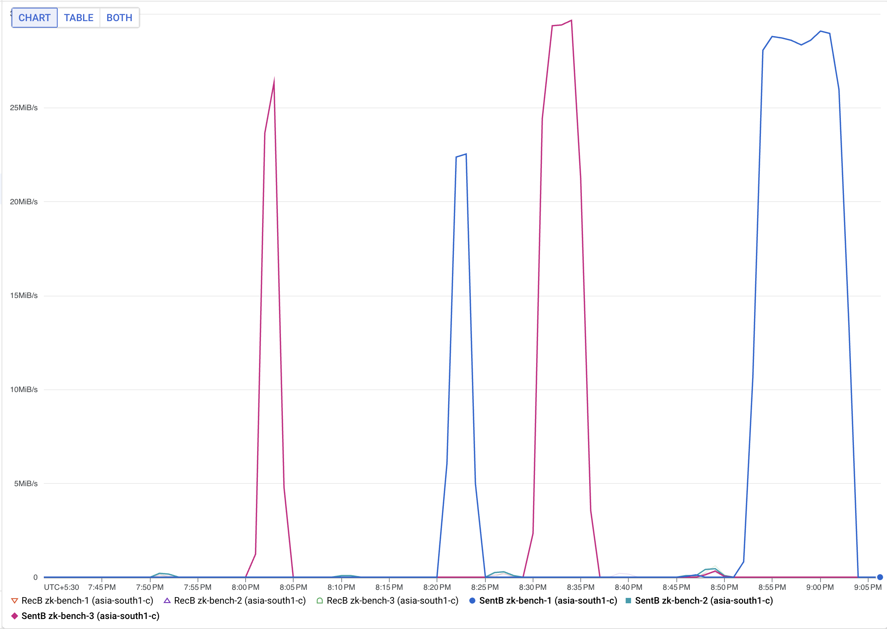

### Setup Info
- Instance Type: e2-standard-2
- CPU: 2
- Memory: 8 GB
- Zookeeper Version: 3.6.2
- Ensemble: 3 Nodes
- Region: GCP asia-south1
- Zone: asia-south1-c

### Features Benchmarked
- List Child Nodes on Path
- Get Data for Node

### Methodology
- Base node path was created on Zookeeper: /benchmark
- Nodes were created under this path with random name length of 30 chars and data size of 1KB
- Nodes were loaded to reach total node count of 100, 1K, 5K, 10K, 25K, 50K and 100K in each step
- After each load, the above-mentioned features were benchmarked for obtaining the latency numbers:
  - List: list operation was run on base path for 100 samples
  - Get Data: for 100 samples, a random node was selected and get operation was run
- For obtaining the CPU/Memory/Network usage, the above operations were run for higher sample size (10K) on a separate setup

### Latency Trends

### Resource usage for 50K nodes

CPU usage

Memory usage

### Detailed Usage Graphs (10K to 50K)
CPU trends

Memory Trends

Network Receive Trends

Network Send Trends

TimeLine (can be used to correlate with the graphs): 
- 7:50pm -> load 10K nodes
- 8:01-8:03 -> list operation (10K)
- 8:10-8:11 -> get operation
- 8:26pm -> load 10K nodes (total: 25K)
- 8:30-8:37 -> list operation (25K)
- 8:45-8:47 -> get operation
- 8:48pm -> load 25K nodes (total: 50K)
- 8:52-9:02 -> list operation (50K)

### Observations
- Memory usage is directly correlated with number of nodes. As more nodes are added, the memory also increases.
- For list operation, latency increase is almost exponential. Where approaching 100K starts having major degradations on the cluster.
- CPU usage sees a slight increase from 20% to 25% which we think might be due to the overhead of transmitting the data over the network.
- For get operation, latency is too low and stable throughout. CPU and Memory usages also show negligible impact.

### Recommendations
For upto 50K nodes, an instance size of 2 CPU and 4 GB memory should suffice. Provided network bandwidth upto 30MB/s is available.
It is expected that at this level CPU usage will be around 30% and Memory usage of upto 2.5GB.
