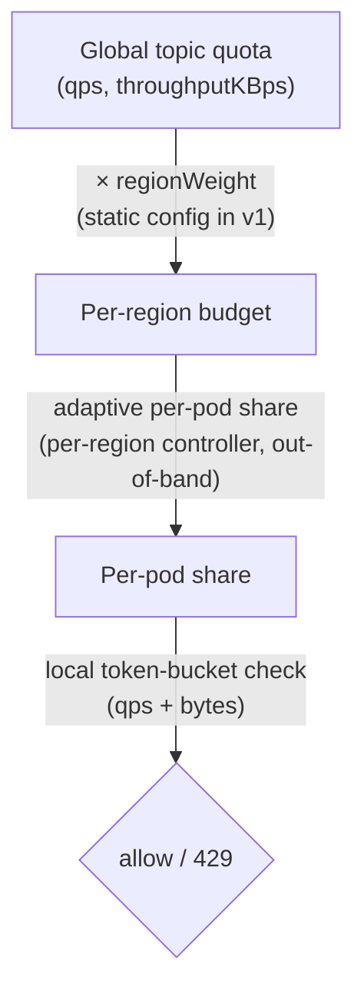
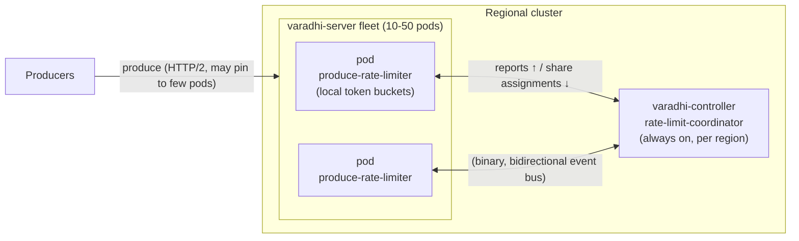
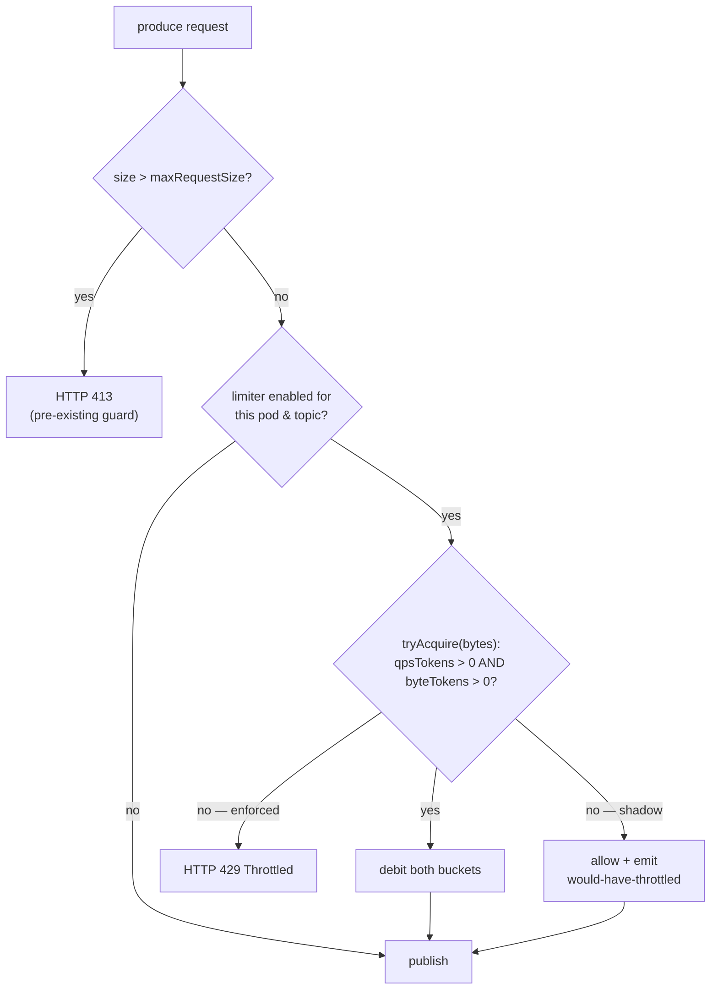
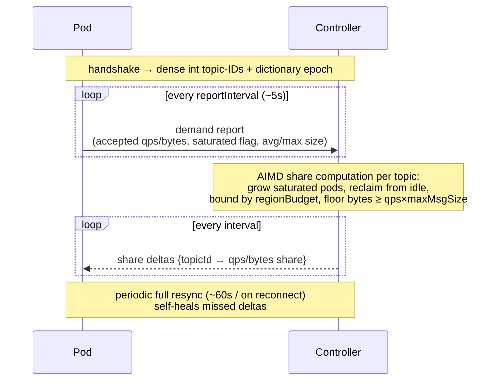
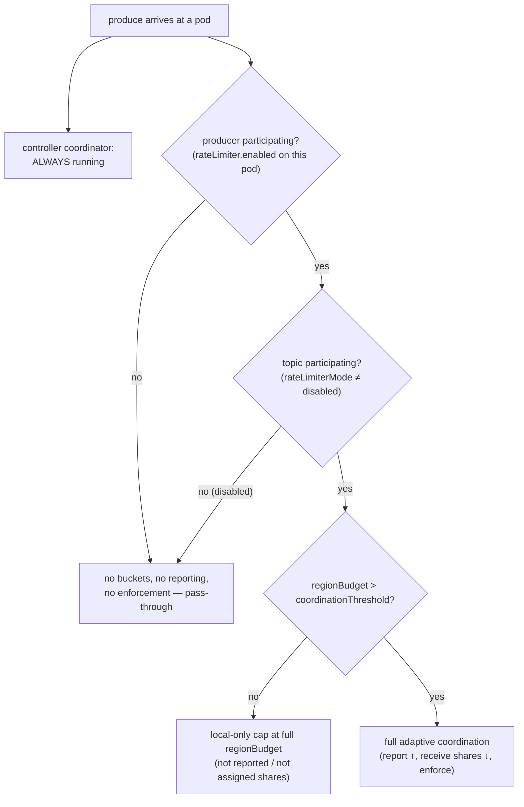

# VIP-0001: Rate Limiting on Message Produce

**Status:** Draft — core design decided. Open items (tunable values, coordination wire
framing, `produceRegionWeights` validation) are tracked in [Open Questions](#open-questions).

---

## 1. Summary

Varadhi must rate-limit message production so a runaway producer cannot overwhelm the
messaging backend (Pulsar) or starve other tenants. Each topic has a capacity policy
(`qps` and `throughputKBps`); when produce traffic exceeds it, the server rejects the
excess with **HTTP 429**.

The hard part is that `varadhi-server` is a **horizontally-scaled fleet** (10–50 pods per
region) but a topic's quota is a **single number shared globally across regions**. So N
pods across M regions must collectively honour one quota, at 100k–1M aggregate QPS, while
adding only a few milliseconds of latency.

**Chosen design (Approach B):** every pod enforces locally with an in-memory token bucket
(no network hop on the hot path); a per-region controller periodically recomputes each
pod's *share* of the quota from observed demand and pushes it back out-of-band. If
coordination is unavailable, pods fall back to a static even split and keep accepting
traffic (**fail-open**). Quota flows through a two-level hierarchy:

This is a **protection guard-rail**, not a billing meter: approximate enforcement is
acceptable, fail-open is deliberate, and the design errs toward *allow* under uncertainty.

---

## 2. Goals & Non-Goals

### Goals

- Stop runaway producers from overwhelming Pulsar or noisy-neighbouring other tenants.
- Enforce **both** capacity dimensions per topic: `qps` and `throughputKBps`.
- Tolerate **uneven traffic distribution** (HTTP/2 connection pinning concentrates a
topic's traffic on a few pods).
- Stay correct for the **many low-QPS topics** (most of the 1k–10k topics) and the **few
hot topics** (10k–100k QPS) alike.
- **Fail open**: a coordination outage must degrade protection, never availability.
- Support **safe, gradual rollout** (per-topic shadow mode, global kill switch).

### Non-Goals (v1)

- **Per-producer fairness.** Quota is enforced per *topic*. A Varadhi topic has a single
owner, so multi-producer topics are rare and an anti-pattern — isolating clients *within*
a topic is out of scope.
- **Billing-grade accuracy.** Brief over-allow during coordination lag or failover is
acceptable for a guard-rail.
- **Atomic multi-message batch** (one request = N messages committed all-or-nothing). High
volume should flow as an HTTP/2 stream and be paced per-message.
- **In-process queuing/delaying.** Breach behaviour is fail-fast (429); we never block the
non-blocking produce hot path.
- **Dynamic global→region weights.** Static weights in v1; the design leaves room for a
dynamic global coordinator later (see [Phasing](#phasing--rollout)).

---

## 3. Background & Current State

Findings from the codebase that shape this proposal:

- **Capacity is per-topic, two dimensions.** `TopicCapacityPolicy` carries `qps` and
`throughputKBps`. (`readFanOut` and `retentionPeriodInDays` are about consumption/storage
sizing, not produce throttling.)
- **A hard max message size is already enforced.** `MessageRequestValidator` rejects any
message above `maxRequestSize` (default 5 MB) with **HTTP 413**, *before* any capacity
check. So a single message is already bounded independently of the limiter.
- **The throttle response is wired, but no limiter exists.** `ProduceStatus.Throttled` maps
to HTTP 429 in `ProduceHandlers`, and `flow.produce.message-to-topic` documents a
"capacity check / 429" step — but `ProducerService.produceToValidTopic` performs **no**
enforcement today. This is a documented-but-unimplemented gap that this VIP fills.
- **A consumer-side throttler exists but is not reusable.** `SlidingWindowThrottler`
throttles *delivery* on error-rate (a different problem) and *delays* tasks via a
background scheduler. Our breach behaviour is fail-fast, so we never queue — we use a
daemonless token bucket instead. It remains a useful reference, not a base.
- **The controller is the natural coordination host, but its existing fan-out is not
reusable.** `varadhi-controller` already manages membership/assignments. However the
entity-event mechanism (`ResourceEventProcessor` / `MessageExchange` /
`ResourceEventDispatcher`) is built for *rare metastore changes* and is unsuitable for RL
(verified in code):
  - `MessageExchange.publish()` is unimplemented; fan-out is a controller→node **unicast
  loop**, **one-directional** (no node→controller path), broadcasting an **identical
  payload** with all-nodes-ack-before-commit + unbounded retry — the opposite of
  per-pod-distinct shares at a 5s cadence.
  - Per-node queues are **unbounded** and processed serially (head-of-line buildup if a node
  stalls); RL needs **bounded, coalescing (latest-wins)** queues.
  - The wire is **JSON, double-serialized** — the binary bandwidth numbers below are not
  achievable on it.
  > **Conclusion:** RL coordination is a **new bidirectional protocol** that *reuses the
  > controller as host and the Vert.x event bus as substrate*, but not
  > `ResourceEventProcessor`. (This is stated once here and assumed throughout.)

---

## 4. Requirements & Constraints

### 4.1 Functional / behavioural (decided)

| #   | Constraint                                                                                                                       | Rationale                                                                    |
| --- | -------------------------------------------------------------------------------------------------------------------------------- | ---------------------------------------------------------------------------- |
| R1  | **Primary intent is protection**, not accounting. Approximate enforcement is fine.                                               | Guard-rail against runaway producers; strict accuracy is a non-goal.         |
| R2  | **Breach = fail-fast 429.** No queuing/delaying on the hot path.                                                                 | Produce path is non-blocking; queuing would add latency and memory pressure. |
| R3  | **Enforce both dimensions.** A message costs 1 `qps` permit + its byte size; throttle if **either** is exceeded.                 | `qps` protects per-op broker throughput; bytes protects bandwidth.           |
| R4  | **Byte size = total message size** (payload + all header keys/values, `Message.getTotalSizeBytes()`).                            | That is what the backend and bandwidth actually carry.                       |
| R5  | **Scope is per-topic.**                                                                                                          | Single-owner topics; per-producer fairness out of scope (see Non-Goals).     |
| R6  | **Fail-open with a static floor.** If coordination is unavailable, keep accepting but enforce a conservative static per-pod cap. | Availability must not depend on the coordinator.                             |
| R7  | **Must not assume even traffic distribution.**                                                                                   | HTTP/2 connection pinning concentrates traffic on a few pods.                |

### 4.2 Scale / NFR (decided)

| Dimension               | Value                     | Design impact                                                                                                                                                  |
| ----------------------- | ------------------------- | -------------------------------------------------------------------------------------------------------------------------------------------------------------- |
| Active topics / region  | 1k – 10k                  | Per-pod and coordinator state must stay small per topic (~10k entries ≈ tens of MB — fine).                                                                    |
| Server pods / region    | 10 – 50 (dynamic)         | Static `quota ÷ N` is coarse; fan-out to 10–50 pods is cheap.                                                                                                  |
| Per-topic QPS           | Most < 1k; a few 10k–100k | Low-QPS topics split across 50 pods round to ~0 per pod under a static split → over-throttle. Adaptive shares fix this.                                        |
| Aggregate QPS / cluster | 100k – 1M                 | A per-message hop to a central limiter is infeasible → enforcement must be **local in-memory**; coordination must be **out-of-band**.                          |
| Added latency budget    | a few ms (p99)            | Local check is sub-µs; rules out synchronous per-produce coordination.                                                                                         |
| Quota scope             | **Global across regions** | One number shared across regions. Cross-region sync on the hot path is infeasible (inter-region latency ≫ ms) → **hierarchical split**: global → region → pod. |

**Key implications:** enforcement is a **local in-memory** decision on every pod;
coordination is **out-of-band and asynchronous**; the global scope forces the two-level
hierarchy (global→region coarse and slow; region→pod adaptive). Static `quota ÷ N` is
unsuitable as the *primary* mechanism but is a valid **fail-open fallback floor**.

### 4.3 Buffers (two independent knobs)

- `**fallbackBuffer`** (default ~0.25): applied to the static even split used in degraded
mode. *Why:* an even split under-serves a skewed/pinned pod, so biasing toward *allow*
keeps the degraded floor catching only egregious overload, not normal skew.
- `**normalBuffer*`* (default 0): optional tolerance in coordinated mode. Coordinated shares
already absorb growth via unused-budget redistribution, so this is off by default; enable
only as a deliberate lean-to-allow / intra-interval growth margin.

---

## 5. Approaches Considered & Decision

| Approach                                                    | Mechanism                                                                                                                                                                        | Verdict                                                                                                                                                                                                                         |
| ----------------------------------------------------------- | -------------------------------------------------------------------------------------------------------------------------------------------------------------------------------- | ------------------------------------------------------------------------------------------------------------------------------------------------------------------------------------------------------------------------------- |
| **A — Local-only static split**                             | Each pod enforces `regionBudget ÷ podCount × (1 + fallbackBuffer)` locally; no coordination.                                                                                     | Simplest, zero RPC — but does not solve skew: a pod that a client is pinned to gets only `1/N` and 429s while the topic is globally under quota. **Kept as the fail-open fallback floor.**                                      |
| **B — Local enforcement + adaptive shares** *(recommended)* | Pods enforce locally; a per-region controller recomputes each pod's share from observed demand and pushes it back out-of-band. Falls back to A when coordination is unavailable. | Adapts to skew, approximate-but-accurate, fail-open built in, reuses the controller as host. Costs: redistribution lag, controller holds per-topic share state, more moving parts. **Chosen.**                                  |
| **C — Shared distributed counter**                          | A global per-topic counter in a fast shared store; every produce decrements it.                                                                                                  | Most globally accurate — but Varadhi has only Pulsar + ZK (ZK can't take per-message writes; no Redis-class store), and it adds a network round-trip on the hot path. Over-engineered for approximate protection. **Rejected.** |

### Decision

**Approach B, as a two-level hierarchy, with Approach A as the fail-open fallback floor.**
It is the only option that satisfies all constraints together: local in-memory enforcement
(for 100k–1M QPS within a few-ms budget), out-of-band coordination, skew tolerance,
correct handling of many low-QPS topics, fail-open behaviour, and global quota scope. It
reuses the per-region controller as **host** but introduces a **new bidirectional
coordination protocol** (see §3).

---

## 6. Architecture Overview

- `**varadhi-server.produce-rate-limiter**` (new): holds per-topic local limiters. Invoked
synchronously inside `ProducerService.produceToValidTopic`, right before producer
resolution/publish — the capacity-check slot already reserved in
`flow.produce.message-to-topic`. The check is an **in-memory `tryAcquire`** (no future, no
network), so it stays off the event-loop critical path.
- `**varadhi-controller.rate-limit-coordinator**` (new, per region): aggregates per-pod
demand reports, computes per-pod shares, and pushes them back over the new bidirectional
channel (§9).
- **The enforcement decision is always local.** The controller only *sizes* each pod's
local budget — it is never on the produce path.

### Produce hot-path decision

---

## 7. Local Limiter (per topic, per pod)

A **daemonless token bucket**, compute-on-read.

- **Compute-on-read, no background thread.** Each `tryAcquire` lazily refills from elapsed
time, then decides immediately. An idle topic is never touched; nothing to schedule or
drain.
- **Monotonic clock only** (`System.nanoTime()`, **never** wall-clock). NTP steps and leap
seconds on wall-clock would produce negative or huge refills on the hot path.
- **Two buckets per topic:**
  - *qps bucket* — refills `qps` tokens/sec.
  - *bytes bucket* — refills `throughputKBps × 1024` bytes/sec.
- **Admission rule — admit on positive credit, not cost-coverage.**
`boolean tryAcquire(long messageBytes)` (qps cost = 1, bytes cost = `messageBytes`).
Admit **iff both buckets currently hold positive credit** (`qpsTokens > 0 && byteTokens > 0`);
on admit, debit both; otherwise consume neither and return `false` →
`ProduceStatus.Throttled` → HTTP 429.
  > The predicate is the **sign** of each bucket, not whether it can cover the cost. This one
  > rule unifies "both-or-neither" admission and the large-message case in a single code path:
  > a message never has to be smaller than the remaining tokens to be admitted.
- **Bounded debt (rare residual).** If a message admitted on positive credit exceeds the
remaining tokens, the bucket simply goes **negative** and subsequent produce is throttled
until it refills (realizing "a large payload spans multiple windows"). This is bounded: the
pre-RL `maxRequestSize` (5 MB) caps any single message, so the floor is `≈ −maxRequestSize`
and recovery is `maxRequestSize / bytesRate`. With the [dimension coupling](#8-dimension-coupling-qps--bytes)
guaranteeing bucket capacity `≥ maxMsgSize`, deep debt is a rare residual, not the steady
state it used to be for low-throughput/large-message topics.
  - *Concurrency caveat:* with lock-free atomics, several event-loop threads can each observe
  positive credit and debit concurrently, so worst-case deficit is
  `(concurrent admits) × maxRequestSize`, not strictly one message. Acceptable for a
  guard-rail (few threads, sub-µs window). If a hard bound is ever needed, gate only the
  rare `cost > capacity` messages through a tiny per-topic lock.
- **Burst control.** Bucket capacity = `rate × burstSeconds` (`burstSeconds` default ~1s,
can be sub-second). Continuous refill means no large discrete window; worst-case micro-burst
is bounded by `burstSeconds`. Capacity stays **coupled to rate** (coupling raises the rate
*floor*, never decouples capacity — avoiding a large stored-burst release).
- **Share updates** are a cheap volatile write of the refill rate (coordinator share or
static fallback floor) — no hot-path allocation.
- **Concurrency / memory.** One thread-safe instance per topic, shared across event-loop
threads via atomics (per-second rates are well within atomic throughput). ~10k topics × 2
small buckets ≈ tens of MB per pod.

---

## 8. Dimension Coupling (qps ↔ bytes)

The two dimensions are **not independent** — they are linked by message size. Using the
tracked per-topic size profile to couple them removes most of the large-message complexity.

- **Both `qps` and `throughputKBps` are floored at 1** — at topic-creation capacity planning
*and* whenever the controller assigns a pod its share (a pod is never given less than the
minimum).
- **A qps floor implies a bytes floor.** For a `1 qps` floor to be *honest* (the one message
it promises actually gets through), the bytes allowance must admit one message's worth of
bytes. So the effective bytes floor is `max(1 KBps, qpsFloor × msgSize)`. Generalized: a
deliverable qps share `q` requires bytes share `≥ q × msgSize`.
- **Two metrics, two uses:**
  - **avg msg size** → the *rate* relationship for capacity planning
  (`throughputKBps ≈ qps × avgMsgSize`). Operators may set qps + size and let bandwidth
  fall out, or set both and have consistency **validated** (warn/reject if
  `throughputKBps < qps × minMsgSize`). Kept independently overridable, not hard-coupled.
  - **max (or p99) msg size** → the *bucket-capacity floor*
  (`bytesShare ≥ qpsShare × maxMsgSize`) so a single large message fits without debt.
- **Effect by regime:**
  - *Low qps, large messages* (the case that forced bounded-debt): the bytes floor makes
  capacity `≥ maxMsgSize`, so admission is a clean credit check. **Bytes is binding**, qps
  is slack — correct.
  - *High qps, small messages:* `bytesRate = qps × smallMsg` is large, so capacity ≫ one
  message and debt never arises. **qps is binding**, bytes is slack; the coupling floor is
  auto-satisfied. No special handling.
- **Both buckets are still enforced at runtime.** The coupling is a *provisioning / share-
sizing* input, not a runtime substitute: within a topic, individual messages vary, so the
bytes bucket must still catch a run of larger-than-avg messages and the qps bucket a flood
of tiny ones.
- **New data dependency (to be built).** Share computation needs `maxMsgSize` (capacity
floor) and `avgMsgSize` (consistency), which the controller does not have today. **Source:**
pods already observe per-message size, so each demand report carries the interval's
observed `avg`/`max`, and the controller derives the profile from the same reports it
aggregates for shares (self-healing, no extra metastore read). The **persisted** profile
(on the topic) is the source for capacity planning and the controller **cold-start seed**
(brand-new topic, or controller rebuilt before any report arrives); until either exists,
fall back to the deployment-default size assumption. This producer→persist→controller
plumbing is **net-new work**.

---

## 9. Coordination Protocol (region budget → per-pod shares)

All coordination runs **out-of-band, never per message.**

### 9.1 Working-set reduction — only high-throughput topics are coordinated

A topic enters adaptive coordination only if its `regionBudget` exceeds a configurable
`coordinationThreshold`. The long tail (the bulk of the 1k–10k topics) is **never reported
and never assigned shares**. This follows from the min-cap rationale (small topics barely
affect cluster health) and shrinks the coordinated set from ~10k to tens–hundreds — which is
what makes the transport affordable.

- **Non-coordinated topic** → each pod independently caps it at the **full `regionBudget`**
locally. The dominant HTTP/2-pinned case (most traffic on 1–2 pods) is then capped
correctly; the only downside is up to `podCount×` over-allow if such a small topic's
traffic is *also* spread wide. Bounded in practice by pinning, but **summed across many
small topics it can matter at the backend** — so `coordinationThreshold` is operator-tunable
and the long-tail per-pod cap can be scaled down with pod count.
- **Coordinated topic** → the adaptive machinery below; its controller-down fallback is the
conservative `regionBudget ÷ podCount` split (full `regionBudget` per pod would over-allow
a large topic massively).

### 9.2 Per-region budget (input)

`regionBudget(topic) = globalQuota(topic) × regionWeight(topic, region)` (× `(1 + normalBuffer)`
only if a non-zero `normalBuffer` is set). This is the ceiling for the **sum** of per-pod
shares in the region.

### 9.3 Pod → controller report (every `reportInterval`, default ~5s)

Reported only for topics that **received traffic** this interval (not a pre-assigned subset —
any produce can hit any pod; worst case is all active topics).

- **Signal = `accepted` rate (qps + bytes) + a `saturated` flag** (did the pod hit its limit
this interval?). Preferred over `attempted = accepted + throttled`: the `throttled` term is
inflated/gameable by 429 retry storms, whereas a boolean "wants-more" is not. The flag is
what tells the controller to grow a pod's share.
- Also carries the topic's **observed `avg`/`max` message size** for the interval (two small
numbers), so the controller can apply the bytes-share floor and feed the persisted profile
(§8).
- Keyed by **interned int topic-ID** (not name) and optionally **quantized** (re-send a topic
only when its demand moves > `demandQuantizationPct`) to cut churn — see [Bandwidth](#10-coordination-bandwidth).

### 9.4 Topic-ID assignment (controller is the authority)

A pod handshakes with the controller, which assigns each topic a **dense, sequential int ID**
(per region). Dense IDs unlock a **positional wire format**: in the common dense case,
usage/shares are a plain array indexed by ID with no per-entry ID (sparse id+value pairs only
when few topics are active). IDs are **soft state** (re-handshake after a controller restart);
the [dictionary epoch guard](#11-coordination-transport-new-dedicated) makes stale IDs safe.

### 9.5 Controller share computation (feedback / AIMD-style, per topic)

- Each pod's share **floors at its reported `accepted` rate**; a `**saturated*`* pod's share
is **grown** each interval (additive increase), and unused share is **reclaimed** from
non-saturated pods (multiplicative-style decrease), bounded by `regionBudget`. *(This
replaces a pure proportional-to-demand split, matching the `accepted + saturated-flag`
signal.)* The increase step and reclaim aggressiveness are tunables (see Open Questions);
they directly shape convergence speed vs. oscillation.
- **When every pod is saturated** (topic legitimately over global quota), there is nothing to
reclaim: shares settle at the `regionBudget` split proportional to `accepted`, and excess
produce is correctly 429'd. This is the intended steady state, not a fault.
- Every actively-producing pod gets a **minimum per-pod cap** (`minPodShare`) so a pod that
just started receiving a coordinated topic isn't starved to zero. `**minPodShare` is
dynamic** (scales down with pod count, API-tweakable). Worst-case allowance for a
coordinated topic = `min(regionBudget × (1 + normalBuffer), podCount × minPodShare)` —
state and bound this explicitly rather than treating it as a negligible edge case.
- **Bytes share floored at `qpsShare × maxMsgSize`** (the dimension coupling, §8), so every
pod's bytes-bucket capacity is `≥ maxMsgSize`, eliminating deep-debt at the pod level
(including under the fallback floor).
  - *Cost:* this floor amplifies `minPodShare` over-allocation in the bytes dimension —
  summed it is `(active pods for topic) × minPodShare × maxMsgSize`. HTTP/2 pinning keeps a
  low-qps topic on 1–2 pods, but include this term when bounding `minPodShare`, and apply
  the floor only to **actively-producing** pods.

### 9.6 Oscillation protection — a toggleable lever, not a baseline assumption

The signal is recomputed from demand that is itself shaped by the share, with a ~5s lag, and
HTTP/2 pinning can swing traffic between pods — so oscillation / false-429 is a *possible*
failure mode, not a certainty. Rather than bake control machinery into the day-one path:

- **Detector metrics ship first (Phase 2):** per-topic **share churn / interval** and the
**429 rate on under-budget topics** (`D < regionBudget`). A false 429 on an under-budget
topic is the smoking gun; if it stays ~0 under representative load, no protection is needed.
- **First lever — EWMA** smoothing of reported demand (controller-side). **Built in Phase 2,
default-off, flipped per topic** (`oscillationProtection`), usable as an A/B lever (enable
on candidate topics, ideally first in shadow mode, and compare against a control).
- **Escalate only if EWMA is insufficient:** deadband/hysteresis (change share only when the
target moves > `shareDeadbandPct`) and capped adjustment
(`share += shareAdjustAlpha · (target − share)` + `maxShareIncreasePerCycle`). Documented,
**default-off**, gated on the detector metrics.

### 9.7 Controller → pod assignment (every interval)

Each pod's `topicId → {qps share, bytes share}` as **deltas** (only changed shares), plus a
periodic **full resync** (~`resyncInterval`, ~60s / on reconnect) to self-heal missed deltas.

> *Why deltas:* once shares converge they change little, so per-interval cost tracks **churn,
> not topic count** — this is what makes 10k topics affordable. Synergy: the high-bandwidth
> case (traffic evenly spread, all pods see all topics) is exactly when shares ≈ static and
> barely change, so deltas are tiny precisely when the topic set is largest.

### 9.8 Lifecycle & staleness (reclaim must not over-throttle a live pod)

- **Reclaim authority is cluster membership (ZK session):** a pod that truly left is removed
and its share fully reclaimed next cycle.
- **A pod alive but with missing/delayed reports** (stressed, network) is **not** instantly
reclaimed — only after `missedReportGraceIntervals` (K), and conservatively. Crucially, a
pod **always keeps enforcing its last-known share locally** regardless of controller state,
so a blind controller can never drive a busy pod to zero.
- If the controller wrongly reallocates a quiet-but-alive pod's slice, worst case is brief
**over-allow** (sum > regionBudget) — which errs safe for a protection guard-rail.
- **New active topic on a pod** (no share yet) → static fallback floor until next redistribution.
- **Topic idle on a pod** → pod stops reporting; controller reclaims; pod LRU/TTL-expires the
local bucket to free memory.
- **Controller down** → pods keep last-known shares (`shareTtl`); on expiry, recompute the
static fallback floor locally. Fail-open throughout.

**Runtime characteristics:** reaction latency ≈ `reportInterval + compute + push` (a few
seconds); the buffer absorbs growth between cycles. Controller state is soft (~10k topics ×
≤50 pods, a few MB), rebuilt from incoming reports after a restart.

---

## 10. Coordination Bandwidth

Worst case = a pod sees **all** active topics (any produce can hit any pod).

| Encoding                                     | per entry   | full report (10k topics) | controller inbound (×50 pods) |
| -------------------------------------------- | ----------- | ------------------------ | ----------------------------- |
| topic name (~32B) + 2 numbers, JSON          | ~60B        | ~600 KB/pod              | ~30 MB/interval               |
| topic name (100B worst)                      | ~120B       | ~1.2 MB/pod              | ~60 MB/interval               |
| **interned int ID (4B) + 2 numbers, binary** | **~12–16B** | **~120–160 KB/pod**      | **~6–8 MB/interval**          |

The table assumes 10k topics, but with **working-set reduction** only high-throughput topics
(tens–hundreds) are coordinated, so real volume is 1–2 orders of magnitude smaller. The
binary row is only achievable on a **dedicated binary codec** (§11) — not on the JSON
`ClusterMessage` path, where entries are 3–5× larger. Name-based at a 1s interval (~30 MB/s
into one controller plus egress) is prohibitive.

**Mitigations, all adopted:**

- **Working-set reduction** (coordinate only high-throughput topics) — the biggest lever.
- **Intern topics to dense int IDs** (positional array in the dense case).
- `**reportInterval` ~5s** — small with the reduced set.
- **Deltas + periodic resync** for controller→pod (steady-state egress ≈ 0).
- **Report only topics with traffic this interval**, optionally **quantized** by demand change.

---

## 11. Coordination Transport (new, dedicated)

A new channel (not `ResourceEventProcessor` — see §3). It must provide:

- **Bidirectional** messaging: node→controller reports **and** controller→node per-pod share
assignments (distinct payload per pod). Neither exists today.
- **Bounded, coalescing queues** with latest-wins semantics (only the newest share/report
matters); never an unbounded-retry queue, which would build up at a 5s cadence.
- **Compact binary encoding** via a Vert.x event-bus `MessageCodec` registered for RL messages
(protobuf / flatbuffers / hand-rolled), bypassing `ClusterMessage`'s JSON-string payload —
keeping the clustered event bus as substrate without the double-JSON cost.
- **Dictionary epoch guard (correctness requirement, not framing detail).** Dense positional
ID arrays are only safe if every framed message carries the **dictionary epoch/generation**
from the handshake; a pod **MUST drop any frame whose epoch ≠ its current handshake epoch**.
Without this, a frame built under an old ID-space (after a controller rebuild) would land
shares on the **wrong topics, silently**. Epoch is mandatory; exact framing is LLD.
- **Frame-size safety:** confirm the Vert.x clustered event-bus max message size and **chunk
the periodic full resync** if needed (working-set reduction makes this unlikely to bite).

> If, after working-set reduction, the coordinated volume is small enough, JSON may be an
> acceptable interim wire format — but the dedicated bidirectional + bounded-coalescing
> channel is required regardless.

---

## 12. Feature Enablement & Participation

Rate limiting is opt-in along **two axes** — *which producers participate* and *which topics
participate*. A topic is rate-limited from the controller **only when both axes select it**.

### 12.1 Controller side — always enabled

The `rate-limit-coordinator` runs **unconditionally** in every region's controller.
**Justification:** the coordinator is *passive* — it only aggregates the reports it receives
and computes/pushes shares for pods that report. If no producer participates, it receives
nothing and does nothing (idle, negligible cost). Keeping it always-on means:

- Producers (and individual topics) can be **enabled/disabled dynamically** without a
controller redeploy or restart.
- There is no enable-ordering hazard (no "turn on controller before producers") — a producer
that opts in starts reporting and immediately gets shares.

So there is no controller-side enable flag; participation is driven entirely from the
producer/topic side below.

### 12.2 Producer side — opt-in (the "participating producers")

A `varadhi-server` pod participates only when rate limiting is enabled in its config:

- `**rateLimiter.enabled` (deployment kill switch).** When `false`, the pod's limiter is a
**no-op pass-through**: no buckets are created, no demand reports are sent, no 429s are
raised. This is the master off-switch for safe rollout and emergencies.
- Because config is per-deployment, "participating producers" is the set of server
deployments/pods where `enabled = true`. This naturally supports **canary participation**:
enable on a subset of pods first, observe the hot-path cost and report/share traffic, then
roll wider. Non-participating pods are invisible to the coordinator and exert no quota
pressure.

> **Why this was added:** the prior draft said the controller is "always enabled" but never
> defined *who participates*. Explicitly: only producers with `rateLimiter.enabled = true`
> send reports and enforce; everyone else is fully transparent.

### 12.3 Topic side — opt-in (the "participating topics")

Among participating producers, only topics with `rateLimiterMode ≠ disabled` take part:

- `**disabled`** → the topic is never reported, never assigned shares, never enforced. It does
not take part in the controller's process at all (even on a participating pod).
- `**shadow**` → the full pipeline runs (buckets, reporting, coordination, share assignment,
would-it-throttle decision) but **never returns 429** — all produce is allowed and
*would-have-throttled* metrics are emitted. Lets quota sizing **and** oscillation be
validated on real traffic before enforcing.
- `**enforced`** → actually returns 429 on breach.

Recommended rollout per topic: `disabled → shadow → enforced`. A deployment-level
`defaultMode` sets the starting mode for topics with no explicit override.

### 12.4 Participation summary

| Producer `enabled` | Topic `rateLimiterMode` | `regionBudget` vs threshold | Result                                                                       |
| ------------------ | ----------------------- | --------------------------- | ---------------------------------------------------------------------------- |
| `false`            | (any)                   | (any)                       | Pass-through. No buckets, no reports, no 429.                                |
| `true`             | `disabled`              | (any)                       | Pass-through for that topic.                                                 |
| `true`             | `shadow`                | > threshold                 | Coordinated; computes decisions; **never 429s**; emits would-have-throttled. |
| `true`             | `shadow`                | ≤ threshold                 | Local-only at full `regionBudget`; never 429s.                               |
| `true`             | `enforced`              | > threshold                 | **Fully coordinated + enforced** (the target steady state).                  |
| `true`             | `enforced`              | ≤ threshold                 | Local-only cap at full `regionBudget`, enforced.                             |

---

## 13. Configuration & Entities

### 13.1 Topic-level (`VaradhiTopic` / `TopicCapacityPolicy`)

- **Global quota** stays in `TopicCapacityPolicy` (`qps`, `throughputKBps`) — **unchanged**.
- **Per-region weight** does **not** go in `TopicCapacityPolicy` (that class is a flat,
region-agnostic value object reused by storage sizing and consumer assignment). Instead add
a region-keyed `Map<String, Double> produceRegionWeights` on `VaradhiTopic`, parallel to its
existing region-keyed `internalTopics` map. **Default = even split across the topic's
produce regions** when unset. (Static config in v1.)
- **Message-size profile (avg / max).** Persisted per topic (producers observe; system
persists eventually) for traffic analysis, capacity planning, and the dimension coupling
(§8). Until a topic has a profile, fall back to the deployment-default size assumption.
- **Minimum capacity capping.** `qps` and `throughputKBps` each floored at **1**, enforced at
topic-creation *and* in every controller share assignment. Effective bytes floor is
`max(1 KBps, qps × msgSize)`; validate at creation that `throughputKBps` is consistent with
`qps × msgSize` rather than an arbitrarily smaller value.
- **Per-topic rollout controls:**
  - `**rateLimiterMode: disabled | shadow | enforced`** — the rollout lever (§12.3).
  - `**oscillationProtection: on | off**` (default `off`) — per-topic EWMA toggle, an A/B
  lever best exercised first in `shadow`.

### 13.2 Deployment-level `RateLimiterOptions`

| Option                           | Default                                   | Meaning                                                                                                                        |
| -------------------------------- | ----------------------------------------- | ------------------------------------------------------------------------------------------------------------------------------ |
| `enabled`                        | `false`                                   | Producer-fleet kill switch (§12.2).                                                                                            |
| `defaultMode`                    | `disabled` / `shadow`                     | Mode for topics with no explicit `rateLimiterMode`.                                                                            |
| `coordinationThreshold`          | —                                         | `regionBudget` above which a topic is adaptively coordinated; below it, local-only at full `regionBudget`.                     |
| `fallbackBuffer`                 | `0.25`                                    | Applied to the static even split in degraded mode.                                                                             |
| `normalBuffer`                   | `0`                                       | Optional tolerance in coordinated mode.                                                                                        |
| `burstSeconds`                   | ~`1`                                      | Token-bucket capacity = `rate × burstSeconds`.                                                                                 |
| `reportInterval`                 | ~`5s`                                     | Pod→controller report cadence.                                                                                                 |
| `resyncInterval`                 | ~`60s`                                    | Full controller→pod resync cadence.                                                                                            |
| `shareTtl`                       | ≥ measured worst-case controller failover | How long a pod holds a stale share before dropping to the static floor. **Size long** (a stale share is safer than the floor). |
| `missedReportGraceIntervals` (K) | —                                         | Intervals before a silent-but-alive pod's share is reclaimed.                                                                  |
| `minPodShare`                    | **dynamic**                               | Per-pod floor; scales down with pod count; API-tweakable.                                                                      |
| `demandQuantizationPct`          | —                                         | Report-churn threshold (re-send a topic only when demand moves > X%).                                                          |
| local-bucket idle-expiry TTL     | —                                         | When to LRU/TTL-evict an idle topic's local bucket.                                                                            |

**Damping knobs** (see §9.6): `demandEwmaIntervals` (EWMA — built Phase 2, default-off, per
topic via `oscillationProtection`); `shareDeadbandPct`, `shareAdjustAlpha`,
`maxShareIncreasePerCycle` — **default-off**, gated on detector metrics, only if EWMA proves
insufficient.

**Kill switch vs per-topic mode:** `enabled=false` disables the whole producer fleet (limiter
allows all) — the coarse safety lever for a new hot-path component. `rateLimiterMode` is the
finer-grained complement (a single topic can be `shadow`/`disabled` without flipping the
global switch).

---

## 14. Batch / Streaming Produce

- **Streaming is the model.** HTTP/2 streaming produce is a sequence of individual messages
on one stream: the limiter does per-message `tryAcquire(bytes)` → **works as-is**.
Throttling mid-stream yields per-message 429 / stream backpressure. This covers what "batch
over HTTP/2" needs with per-message control.
- **Atomic multi-message batch (one request = N messages) is a non-goal for v1.** A large
all-in-one payload can't sensibly be acked within a tight latency budget; such volume should
flow as a stream and be paced across windows.
- **Large single messages** are handled by the dimension coupling (capacity ≥ `maxMsgSize`)
plus the residual bounded-debt rule (§7), not by a batch API.

---

## 15. Failure Handling

| Condition                             | Behaviour                                                                                                                                                                                                                          |
| ------------------------------------- | ---------------------------------------------------------------------------------------------------------------------------------------------------------------------------------------------------------------------------------- |
| Controller / coordinator down         | Pods keep last-known shares; after `shareTtl`, **locally recompute** the static `regionBudget ÷ podCount × (1 + fallbackBuffer)` floor from cached topic quota + cluster membership + config. Fail-open, no controller dependency. |
| Pod just started / topic newly active | Locally-computed static fallback floor until the first coordinated share arrives.                                                                                                                                                  |
| Pod alive but reports missing/delayed | Not reclaimed for K intervals; pod keeps enforcing its last-known share locally; worst case is brief over-allow (errs safe).                                                                                                       |
| Limiter bug / emergency               | `enabled=false` kill switch bypasses all checks; or set a single topic's `rateLimiterMode = shadow / disabled`.                                                                                                                    |
| Over quota, topic in `shadow`         | Allowed (no 429); **would-have-throttled** metric incremented.                                                                                                                                                                     |
| Over quota, topic `enforced`          | 429 `Throttled` (fail-fast).                                                                                                                                                                                                       |

The static fallback floor is **fully computable from data the pod already holds locally**
(cached topic quota + cluster membership + config) — no controller dependency for the floor.

---

## 16. Correctness & Availability Callouts

- **Regional failover strands quota (a known v1 limitation).** Static `regionWeight` means a
surviving region only has its own slice; if a region fails and traffic shifts, the survivor
429s while the dead region's global budget sits **stranded** (global quota has headroom it
can't use until V2 dynamic weights). *v1 mitigation:* weights are **operator-adjustable via
UI**, intended to be driven by the **zone-unavailability feature** (marking a zone
unavailable triggers a weight adjustment). Called out explicitly, not silently accepted.
- `**Σ regionWeight` invariant + validation.** Since `regionBudget = globalQuota × regionWeight`,
weights must sum to 1 (per topic, across its produce regions) or the global quota is silently
over-/under-enforced. Validate on write; define **partial-map semantics** for
`produceRegionWeights` (how unset regions default; how the even split recomputes when a
produce region is added/removed) so the default path can't drift the invariant.
- `**shareTtl` ↔ controller-failover coupling.** On controller-down, coordinated topics hold
their last-known share until `shareTtl`, then drop to the conservative `regionBudget ÷ podCount` floor (which over-throttles a skewed/pinned pod). Since a **stale share is safer
than the floor**, size `shareTtl` **≥ measured worst-case controller downtime/rebuild**; err
long. Reclaim of *departed* pods is membership-driven and independent of `shareTtl`, so a
long TTL does not delay it.

---

## 17. Observability

- **Per-pod, per-topic** (via existing produce telemetry → otel-collector): accepted qps,
accepted bytes-rate, rejected qps, rejected bytes-rate, current assigned share (qps + bytes),
and the topic's current `rateLimiterMode`.
- **Shadow-mode:** **would-have-throttled** qps + bytes-rate per topic — the primary signal
for sizing quotas and gauging oscillation/false-429 before flipping a topic to `enforced`.
- **Controller (coordinator):** redistribution cycle latency, topics/pods tracked,
reclaim/assign events, coordination bandwidth, and — most useful operationally — the
count/list of topics currently **demand-saturated** (`D > regionBudget`) and aggregate
region-budget utilisation.
- **Damping detector metrics (ship in Phase 2, before any damping):** per-topic **share churn
/ interval** and the **429 rate on under-budget topics** (`D < regionBudget`). These drive
the evidence-based decision to enable EWMA (and, only if needed, deadband/capped-adjustment).

**Cardinality is the real risk** (10k topics × ~5 series × 50 pods ≈ millions of series).
Decided strategy:

- **Tiered routing via two otel-collector pipelines** (routing/aggregation lives in collector
config, not RL code):
  - *Self-managed Prometheus, short retention* (hours/days): full-cardinality per-topic,
  per-pod series for drill-down.
  - *Central APM, long retention:* aggregated series with the **pod dimension summed away**,
  rolled up to project/tier/region for dashboards/alerting (~50× reduction).
- **"Interesting topics" detail, two modes:** *dynamic* (auto-emit full detail when a topic is
saturated/near-limit) and *static* (per-topic opt-in flag for known high-value topics).
- **Per-topic emit interval: 60s** (system metrics stay finer-grained).
- **Consistent tags on every metric** — org / project / region / topic / tier — so the
collector can roll up for APM and operators can drill down in Prometheus. This is the only
code-side requirement; the rest is collector/deployment config.

---

## 18. Testing Strategy

**Unit**

- Token-bucket `tryAcquire`: refill math via **monotonic clock**; **credit-based admission**
(admit on `both > 0`, debit both, never cost-coverage); burst bound; share update.
- **Dimension coupling:** bytes share floored at `qpsShare × maxMsgSize` ⇒ a single max-size
message fits without debt; deep bounded-debt only as a residual, bounded by `maxRequestSize`.
- **Coordinator allocation:** AIMD split from `accepted + saturated-flag`; minimum floor;
reclamation on idle/crash; all-pods-saturated settles correctly.
- **EWMA** converges without oscillation under noisy/lagged demand and is a no-op when
`oscillationProtection=off`.
- **Shadow mode** computes a throttle decision but never rejects (allows all, increments
would-have-throttled).
- **Reclaim-safety:** missing reports without membership loss do NOT zero a live pod's share.
- **Local fallback** computed from cached quota + membership + config.
- **Epoch guard:** frames with a stale dictionary epoch are dropped, never misapplied.
- `**produceRegionWeights` validation:** sum-to-1, partial-map defaults.
- **Dynamic `minPodShare`** worst-case bound.

**Integration / E2E**

- Sustained over-quota produce yields 429 and recovers when traffic drops.
- Skewed traffic (most load on one pod) is **not** over-throttled while globally under quota.
- Controller-down recomputes the static floor locally without dropping to zero.
- HTTP/2 streaming produce is throttled per-message correctly.
- Large single message accepted via bounded debt then paced.
- A `shadow`-mode topic over quota is never 429'd but reports would-have-throttled.
- Per-topic `oscillationProtection` toggle changes behaviour for only that topic.
- Kill switch (`enabled=false`) disables enforcement.
- **Participation:** a non-participating producer (`enabled=false`) and a `disabled` topic
send no reports and raise no 429s.

**Load / bandwidth**

- Coordination traffic at 10k topics × 50 pods stays within budget (int-ID + deltas + ~5s).

---

## 19. Phasing / Rollout

1. **Phase 1 — local enforcement only (foundation, not prod-sufficient).** Daemonless
  token-bucket limiter in `produce-rate-limiter`, fed by the **static fallback** share
   (`regionBudget ÷ pods`), behind the `enabled` kill switch. Ships protection immediately
   (Approach A) and validates hot-path cost + 429 wiring — but the static split over-throttles
   skewed/pinned traffic, so it is a stepping stone, **not expected to hold real production
   workloads on its own**.
2. **Phase 2 — adaptive coordination (the prod-grade mechanism).** Add `rate-limit-coordinator`,
  the **new dedicated bidirectional channel** (bounded coalescing queues + binary
   `MessageCodec`), `accepted + saturated-flag` reporting, and adaptive shares for
   high-throughput topics (full Approach B). Region weights static. Ships the **per-topic
   rollout controls** (`rateLimiterMode`, `oscillationProtection`), the **shadow-mode**
   would-have-throttled metrics, and the **damping detector metrics**. **EWMA is built here**
   too (small change) but ships **off**, flipped per topic; shadow mode + selective enablement
   on production-representative traffic decide whether oscillation protection is needed (and,
   only if EWMA is insufficient, escalate to deadband/capped-adjustment).
3. **Phase 3 (future / V2) — scale & global coordination.** Deferred extensions the v1 design
  intentionally leaves room for:
  - **Dynamic global weights:** replace static `regionWeight` with a global coordinator that
  demand-weights region budgets; region/pod machinery unchanged.
  - **Sharded coordinator:** if a single per-region controller becomes the bottleneck, shard
  coordination by **hashing topic → controller shard** (disjoint topic sets). Orthogonal to
  the local enforcement path.

---

## 20. Open Questions

- **Tunable values:** `shareTtl`, `missedReportGraceIntervals` (K), `demandQuantizationPct`,
`resyncInterval`, `minPodShare` scaling function, `burstSeconds`, and the AIMD
increase-step / reclaim-aggressiveness (§9.5).
- `**coordinationThreshold` / `minPodShare` defaults:** what `regionBudget` separates
coordinated from local-only, and how `minPodShare` scales with pod (and topic) count.
- **Coordination transport details:** binary codec choice (protobuf/flatbuffers/custom), exact
wire framing (positional-array vs sparse, handshake, resync chunking), and the confirmed
Vert.x clustered event-bus **max message size**. *(Decided/required: new bidirectional
channel + bounded coalescing queues + binary `MessageCodec` + dictionary epoch guard — not
`ResourceEventProcessor`.)*
- **Message-size profile plumbing (net-new work for the dimension coupling):** (a) persist the
profile on the topic; (b) carry observed `avg`/`max` in the pod→controller report; (c) define
the default size assumption before a profile exists.
- **Oscillation protection enablement:** whether to turn on EWMA (and tune
`demandEwmaIntervals`), decided from shadow-mode + detector metrics on real load.
Deadband/capped-adjustment remain deferred, only if EWMA proves insufficient.
- `**produceRegionWeights` validation + partial-map semantics** (sum-to-1 invariant;
default-even recompute on region add/remove).
- **otel-collector pipeline config** for the two-tier routing (deployment detail, not RL code).

