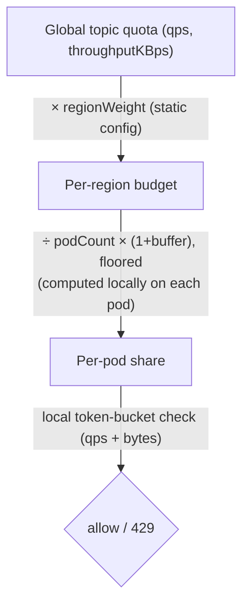
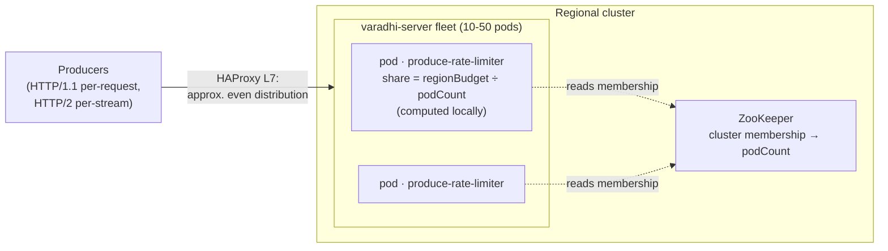
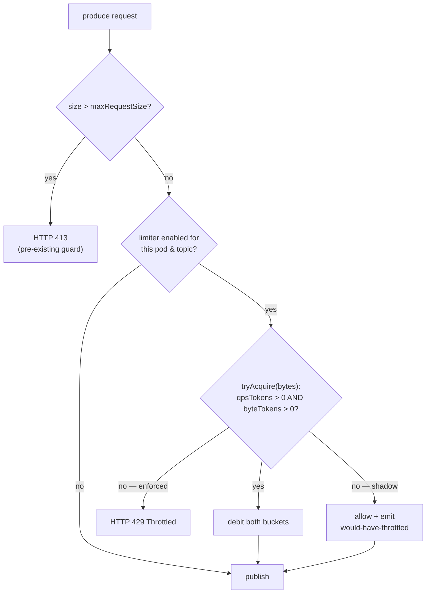
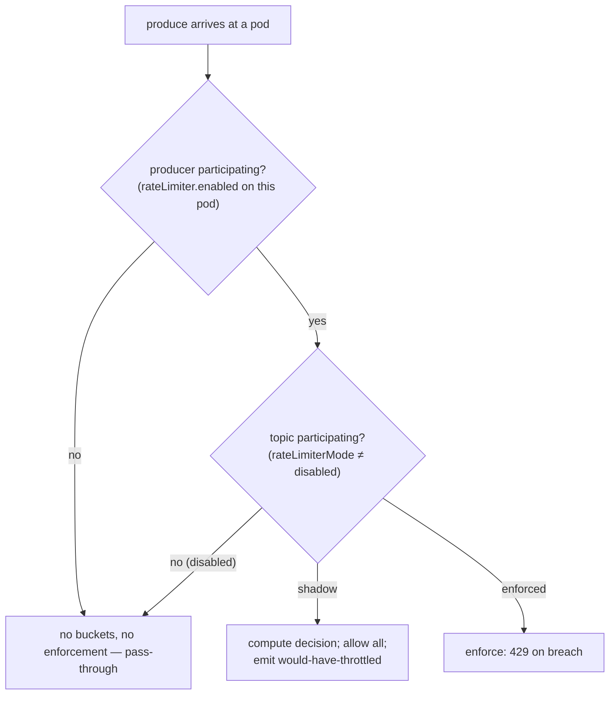
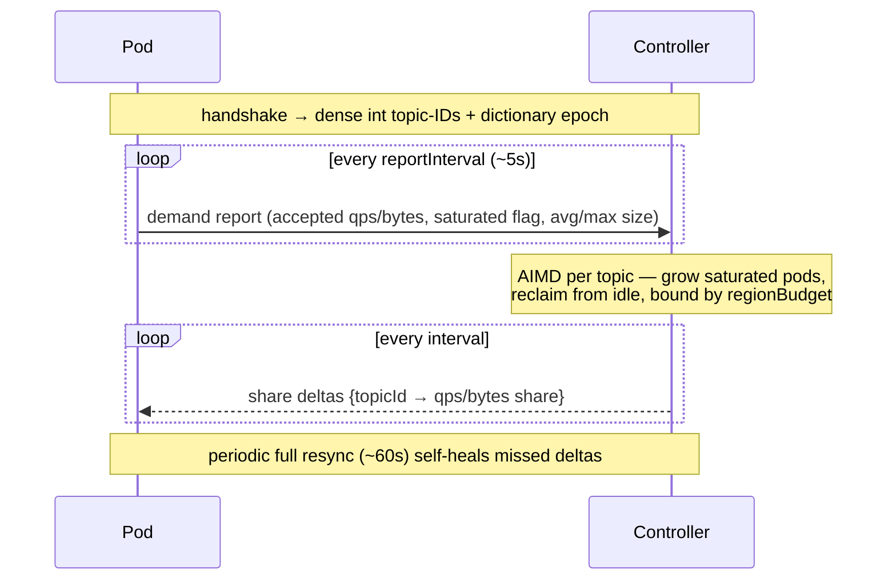

# VIP-0001: Rate Limiting on Message Produce

**Status:** Draft — core design decided. v1 targets the **internal deployment** (HAProxy L7
load balancer); adaptive coordination is deferred to a data-gated future phase. Open items
tracked in [Open Questions](#19-open-questions).

---

## 1. Summary

Varadhi must rate-limit message production so a runaway producer cannot overwhelm the
messaging backend (Pulsar) or starve other tenants. Each topic has a capacity policy
(`qps` and `throughputKBps`); when produce traffic exceeds it, the server rejects the
excess with **HTTP 429**.

`varadhi-server` is a **horizontally-scaled fleet** (10–50 pods per region), but a topic's
quota is a **single number shared globally across regions**. So the fleet must collectively
honour one quota, at 100k–1M aggregate QPS, while adding only a few milliseconds of latency.

**Chosen design (v1):** every pod enforces locally with an in-memory token bucket (no network
hop on the hot path). Each pod sizes its own bucket to a **static even share** of the topic's
regional budget — `regionBudget ÷ podCount` — computed **entirely from data the pod already
holds** (cached topic quota + region-weight config + ZK cluster membership). **No coordinator
is required.**



This works because the **internal load balancer (HAProxy, L7) distributes produce traffic
approximately evenly** across pods — per-request for HTTP/1.1 and per-stream for HTTP/2 —
so a simple even split closely matches each pod's actual load (see §4). A more complex
**adaptive coordinator** that reshapes shares to follow skewed traffic is fully designed but
**deferred to a future phase, gated on production evidence of skew** (§18).

This is a **protection guard-rail**, not a billing meter: approximate enforcement is
acceptable, the design fails open, and it errs toward *allow* under uncertainty.

---

## 2. Goals & Non-Goals

### Goals
- Stop runaway producers from overwhelming Pulsar or noisy-neighbouring other tenants.
- Enforce **both** capacity dimensions per topic: `qps` and `throughputKBps`.
- Keep enforcement **local and in-memory** (no hot-path network hop) at 100k–1M aggregate QPS.
- Stay correct for the **many low-QPS topics** and the **few hot topics** alike.
- **Fail open**: a dependency hiccup must degrade protection, never availability.
- Support **safe, gradual rollout** (per-topic shadow mode, global kill switch).

### Non-Goals (v1)
- **Adaptive per-pod coordination.** v1 relies on even LB distribution and a static split; the
  coordinator is deferred (§18) until metrics prove it is needed.
- **External / L4 load-balancer deployments.** v1 is scoped to the internal HAProxy L7
  deployment. Skew-heavy environments (TCP/L4 LBs, connection-pinning proxies) are a future
  concern that the deferred coordinator addresses.
- **Per-producer fairness.** Quota is per *topic*. A Varadhi topic has a single owner, so
  multi-producer topics are rare and an anti-pattern.
- **Billing-grade accuracy.** Brief over-allow is acceptable for a guard-rail.
- **Atomic multi-message batch.** High volume should flow as an HTTP/2 stream, paced per-message.
- **In-process queuing/delaying.** Breach behaviour is fail-fast (429).
- **`Retry-After` hint header.** HTTP-only; deferred until there is concrete demand.
- **Dynamic global→region weights.** Static weights in v1 (§18 leaves room for a dynamic
  global coordinator).

---

## 3. Background & Current State

Findings from the codebase that shape this proposal:

- **Capacity is per-topic, two dimensions.** `TopicCapacityPolicy` carries `qps` and
  `throughputKBps`. (`readFanOut` and `retentionPeriodInDays` are about consumption/storage
  sizing, not produce throttling.)
- **A hard max message size is already enforced.** `MessageRequestValidator` rejects any
  message above `maxRequestSize` (default 5 MB) with **HTTP 413**, *before* any capacity
  check. So a single message is already bounded independently of the limiter.
- **The throttle response is wired, but no limiter exists.** `ProduceStatus.Throttled` maps
  to HTTP 429 in `ProduceHandlers`, and `flow.produce.message-to-topic` documents a
  "capacity check / 429" step — but `ProducerService.produceToValidTopic` performs **no**
  enforcement today. This is the documented-but-unimplemented gap this VIP fills.
- **Cluster membership is already available to every pod** via ZooKeeper (the controller uses
  it for assignments). This is the only external input the v1 static split needs (to derive
  `podCount`) — and it is already on every node.
- **A consumer-side throttler exists but is not reusable.** `SlidingWindowThrottler` throttles
  *delivery* on error-rate (a different problem) and *delays* tasks via a background scheduler.
  Our breach behaviour is fail-fast, so we never queue — we use a daemonless token bucket
  instead. Useful as a reference, not a base.

> The controller's existing entity-event fan-out (`ResourceEventProcessor` / `MessageExchange`)
> is **not** reused by this design. v1 needs no controller-side RL component at all; the
> deferred coordinator (§18) would need a new protocol, not that fan-out (reasons in §18).

---

## 4. Requirements & Constraints

### 4.1 The distribution assumption (the basis for v1)

The internal load balancer is **HAProxy in L7 (`mode http`)**, which distributes produce
traffic approximately evenly across backend pods:

- **HTTP/2 / gRPC** (future high-throughput tenants): HAProxy balances **per stream**, spreading
  a single client's multiplexed streams across backends. Even a client with vastly uneven load
  is balanced efficiently.
- **HTTP/1.1** (current majority): in `mode http`, HAProxy balances **per request** across the
  backend pool, so a client's requests spread across pods over time.

> **Consequence:** the classic "HTTP/2 connection pinning concentrates a topic on one pod"
> skew does **not** apply to this deployment. A static even split (`regionBudget ÷ podCount`)
> therefore closely matches each pod's actual load, which is why v1 needs no adaptive coordinator.
>
> **Caveat / dependency:** robust per-request HTTP/1.1 balancing requires `mode http` with
> non-pinning connection reuse (`option http-server-close`, or non-aggressive `http-reuse`) —
> **not** `mode tcp`. If the production config pins keep-alive connections, the current-majority
> HTTP/1.1 traffic would be skewed and the deferred coordinator (§18) would be needed sooner.
> The shadow-mode **"429 on under-budget topics"** metric (§15) verifies empirically whether
> skew exists, before any coordinator is built.

### 4.2 Functional / behavioural (decided)

| # | Constraint | Rationale |
|---|---|---|
| R1 | **Primary intent is protection**, not accounting. Approximate enforcement is fine. | Guard-rail against runaway producers. |
| R2 | **Breach = fail-fast 429.** No queuing/delaying on the hot path. | Produce path is non-blocking; queuing adds latency/memory pressure. |
| R3 | **Enforce both dimensions.** A message costs 1 `qps` permit + its byte size; throttle if **either** is exceeded. | `qps` protects per-op broker throughput; bytes protects bandwidth. |
| R4 | **Byte size = total message size** (payload + all headers, `Message.getTotalSizeBytes()`). | That is what the backend and bandwidth actually carry. |
| R5 | **Scope is per-topic.** | Single-owner topics; per-producer fairness out of scope. |
| R6 | **Fail open.** Any missing input (membership, cached quota) → keep accepting using last-known/default values. | Availability must not depend on RL state. |

### 4.3 Scale / NFR (decided)

| Dimension | Value | Design impact |
|---|---|---|
| Active topics / region | 1k – 10k | Per-pod state must stay small per topic (~10k entries ≈ tens of MB — fine). |
| Server pods / region | 10 – 50 (dynamic) | `podCount` from membership; share recomputed on membership change. |
| Per-topic QPS | Most < 1k; a few 10k–100k | Even split works for hot topics; low-QPS topics need the `minPodShare` floor (§9). |
| Aggregate QPS / cluster | 100k – 1M | Enforcement must be **local in-memory** (no central counter, no per-message hop). |
| Added latency budget | a few ms (p99) | Local check is sub-µs; comfortably within budget. |
| Quota scope | **Global across regions** | One number shared across regions → **hierarchical split**: global → region (static weight) → pod (even split). |

### 4.4 Buffer

- **`fallbackBuffer`** (default ~0.25): applied to the even split (`regionBudget ÷ podCount ×
  (1 + fallbackBuffer)`). *Why:* the split is an approximation; even with good LB distribution
  there is short-term variance (Poisson arrivals, membership transients), so biasing slightly
  toward *allow* keeps the limiter catching egregious overload, not normal jitter.

---

## 5. Approaches & Decision

| Approach | Mechanism | Verdict |
|---|---|---|
| **A — Local-only static split** *(chosen for v1)* | Each pod enforces `regionBudget ÷ podCount × (1 + fallbackBuffer)` locally, computed from cached quota + region weight + membership. No coordination. | Simplest; zero RPC; lowest hot-path cost. Its one weakness — skew — does not arise under the internal HAProxy L7 LB (§4.1). **Chosen.** |
| **B — Local enforcement + adaptive shares** | Pods enforce locally; a per-region controller recomputes each pod's share from observed demand and pushes it back out-of-band. | Adapts to skew, but adds a coordinator, a new bidirectional protocol, AIMD control, and oscillation risk. Its main justification (skew) is absent in the v1 deployment. **Deferred to a data-gated future phase (§18).** |
| **C — Shared distributed counter** | A global per-topic counter in a fast shared store; every produce decrements it. | Most accurate, but Varadhi has only Pulsar + ZK (no per-message counter store), and it adds a hot-path round-trip. Over-engineered for approximate protection. **Rejected.** |

### Decision

**Approach A (static even split), scoped to the internal HAProxy L7 deployment.** It is the
simplest mechanism that satisfies every constraint *given even LB distribution*: local
in-memory enforcement, no hot-path network hop, correct for hot and (with the `minPodShare`
floor) low-QPS topics, fail-open by construction, and fully local to compute.

**Adaptive coordination (Approach B) is designed and held in reserve (§18), not built in v1.**
We adopt it only if the shadow-mode skew metric (§15) shows that even distribution does not
hold in practice. This is a deliberate YAGNI choice: build the simple thing, instrument it,
and let data justify the complex thing.

---

## 6. Architecture Overview (v1)



- **`varadhi-server.produce-rate-limiter`** (new, the only new component in v1): holds the
  per-topic local limiters. Invoked synchronously inside `ProducerService.produceToValidTopic`,
  right before producer resolution/publish — the capacity-check slot already reserved in
  `flow.produce.message-to-topic`. The check is an **in-memory `tryAcquire`** (no future, no
  network), so it stays off the event-loop critical path.
- **No controller-side RL component in v1.** Each pod sizes its own share locally; the only
  external input is cluster membership, which ZooKeeper already provides.

### Produce hot-path decision



---

## 7. Local Limiter (per topic, per pod)

A **daemonless token bucket**, compute-on-read. This is the heart of the design and is
identical whether the share comes from the v1 static split or a future coordinator.

- **Compute-on-read, no background thread.** Each `tryAcquire` lazily refills from elapsed
  time, then decides immediately. An idle topic is never touched; nothing to schedule or drain.
- **Monotonic clock only** (`System.nanoTime()`, **never** wall-clock). NTP steps and leap
  seconds on wall-clock would produce negative or huge refills on the hot path.
- **Two buckets per topic:**
  - *qps bucket* — refills `qps` tokens/sec.
  - *bytes bucket* — refills `throughputKBps × 1024` bytes/sec.
- **Admission rule — admit on positive credit, not cost-coverage.**
  `boolean tryAcquire(long messageBytes)` (qps cost = 1, bytes cost = `messageBytes`). Admit
  **iff both buckets currently hold positive credit** (`qpsTokens > 0 && byteTokens > 0`); on
  admit, debit both; otherwise consume neither and return `false` → `ProduceStatus.Throttled`
  → HTTP 429.

  > The predicate is the **sign** of each bucket, not whether it can cover the cost. This one
  > rule unifies "both-or-neither" admission and the large-message case in a single code path:
  > a message never has to be smaller than the remaining tokens to be admitted.

- **Bounded debt (rare residual).** If a message admitted on positive credit exceeds the
  remaining tokens, the bucket goes **negative** and subsequent produce is throttled until it
  refills (realizing "a large payload spans multiple windows"). Bounded: the pre-RL
  `maxRequestSize` (5 MB) caps any single message, so the floor is `≈ −maxRequestSize` and
  recovery is `maxRequestSize / bytesRate`. With the [dimension coupling](#8-dimension-coupling-qps--bytes)
  guaranteeing bucket capacity `≥ maxMsgSize`, deep debt is a rare residual, not a steady state.
  - *Concurrency caveat:* with lock-free atomics, several event-loop threads can each observe
    positive credit and debit concurrently, so worst-case deficit is
    `(concurrent admits) × maxRequestSize`. Acceptable for a guard-rail; if a hard bound is ever
    needed, gate only the rare `cost > capacity` messages through a tiny per-topic lock.
- **Burst control.** Bucket capacity = `rate × burstSeconds` (`burstSeconds` default ~1s).
  Continuous refill means no large discrete window; worst-case micro-burst is bounded by
  `burstSeconds`. Capacity stays **coupled to rate**.
- **Share updates** are a cheap volatile write of the refill rate — no hot-path allocation.
  In v1 the rate is recomputed locally on a membership change; nothing pushes it over a network.
- **Concurrency / memory.** One thread-safe instance per topic, shared across event-loop
  threads via atomics. ~10k topics × 2 small buckets ≈ tens of MB per pod.

---

## 8. Dimension Coupling (qps ↔ bytes)

The two dimensions are **not independent** — they are linked by message size. Using the
per-topic size profile to couple them removes most of the large-message complexity.

- **Both `qps` and `throughputKBps` are floored at 1** — at topic-creation capacity planning
  *and* when a pod computes its per-pod share (a pod is never given less than the minimum).
- **A qps floor implies a bytes floor.** For a `1 qps` floor to be *honest* (the one message
  it promises actually gets through), the bytes allowance must admit one message's worth of
  bytes. So the effective bytes floor is `max(1 KBps, qpsFloor × msgSize)`. Generalized: a
  deliverable qps share `q` requires bytes share `≥ q × msgSize`.
- **Two metrics, two uses:**
  - **avg msg size** → the *rate* relationship for capacity planning
    (`throughputKBps ≈ qps × avgMsgSize`). Operators may set qps + size and let bandwidth fall
    out, or set both and have consistency **validated** (warn/reject if
    `throughputKBps < qps × minMsgSize`). Kept independently overridable.
  - **max (or p99) msg size** → the *bucket-capacity floor* (`bytesShare ≥ qpsShare × maxMsgSize`)
    so a single large message fits without debt.
- **Effect by regime:**
  - *Low qps, large messages:* the bytes floor makes capacity `≥ maxMsgSize`, so admission is a
    clean credit check. **Bytes is binding**, qps is slack — correct.
  - *High qps, small messages:* `bytesRate = qps × smallMsg` is large, so capacity ≫ one message
    and debt never arises. **qps is binding**, bytes is slack; the coupling floor is
    auto-satisfied. No special handling.
- **Both buckets are still enforced at runtime.** The coupling is a *share-sizing* input, not a
  runtime substitute: individual messages vary, so the bytes bucket must still catch a run of
  larger-than-avg messages and the qps bucket a flood of tiny ones.
- **Where the size profile comes from in v1 (all local).** The per-topic `avg`/`max` profile is
  **persisted on the topic** (producers observe size; the system persists it for capacity
  planning). Each pod **caches it with the topic config** and applies the bytes-capacity floor
  locally; topic-creation uses it to validate the `qps ↔ throughputKBps` consistency. Until a
  topic has a profile, fall back to the deployment-default size assumption. *(Carrying live
  `avg`/`max` to a controller is only relevant to the deferred coordinator — §18.)*

---

## 9. Per-Pod Share — Static Even Split (the v1 mechanism)

Every pod computes its own share for every topic, locally, with no coordination:

```
regionBudget(topic) = globalQuota(topic) × regionWeight(topic, region)        # static config
perPodShare(topic)  = regionBudget ÷ podCount × (1 + fallbackBuffer)          # divide by membership
perPodShare(topic)  = max(perPodShare, minPodShare)                           # floor (low-QPS)
bytesShare(topic)   = max(bytesShare, qpsShare × maxMsgSize)                  # dimension coupling
```

- **Inputs are all local:** `globalQuota` and `regionWeight` from cached topic config;
  `podCount` from ZK cluster membership; the rest from `RateLimiterOptions`. Recomputed when
  membership changes (pods join/leave); otherwise stable.
- **Why an even split is sufficient here:** under approximately-even LB distribution (§4.1),
  each pod receives ≈ `1/podCount` of the topic's traffic, so an even share ≈ each pod's actual
  load. Hot topics split cleanly; the only approximation cost is on low-QPS topics (below).
- **Low-QPS topics and the `minPodShare` floor.** Splitting a small quota across many pods makes
  the per-pod rate tiny (e.g. 10 qps ÷ 50 = 0.2 qps/pod), so under bursty (Poisson) arrivals a
  pod would 429 legitimate traffic even while the topic is globally under quota. The
  `minPodShare` floor (e.g. 1 qps) prevents this. **Cost:** the aggregate allowance becomes
  `podCount × minPodShare`, i.e. bounded over-allow for small topics — operationally harmless
  (small absolute numbers; the rationale that "small topics barely affect cluster health") and
  the explicit, bounded price of being coordinator-free. Keep `minPodShare` small.
- **Membership transients.** When a pod joins/leaves, every pod recomputes `podCount` from ZK
  and resizes; brief over-/under-allow during convergence errs safe for a guard-rail. `shareTtl`
  / coordinator failover concerns from earlier drafts do **not** apply — there is no remote
  share to expire.

---

## 10. Feature Enablement & Participation

Rate limiting is opt-in along **two axes** — *which producers participate* and *which topics
participate*. In v1 there is no coordinator, so participation is purely a producer-side and
topic-side concern.



### 10.1 Producer side — opt-in (the "participating producers")

A `varadhi-server` pod participates only when rate limiting is enabled in its config:

- **`rateLimiter.enabled` (deployment kill switch).** When `false`, the pod's limiter is a
  **no-op pass-through**: no buckets, no 429s. This is the master off-switch for safe rollout
  and emergencies.
- Because config is per-deployment, "participating producers" is the set of server
  deployments/pods where `enabled = true`. This supports **canary participation**: enable on a
  subset of pods first, observe hot-path cost, then roll wider. Non-participating pods are fully
  transparent.

### 10.2 Topic side — opt-in (the "participating topics")

Among participating producers, only topics with `rateLimiterMode ≠ disabled` take part:

- **`disabled`** → never enforced; the topic does not take part at all.
- **`shadow`** → the limiter runs (buckets + would-it-throttle decision) but **never returns
  429** — all produce is allowed and *would-have-throttled* metrics are emitted, so quota sizing
  **and the skew check** (§15) can be validated on real traffic before enforcing.
- **`enforced`** → actually returns 429 on breach.

Recommended rollout per topic: `disabled → shadow → enforced`. A deployment-level `defaultMode`
sets the starting mode for topics with no explicit override.

### 10.3 Participation summary

| Producer `enabled` | Topic `rateLimiterMode` | Result |
|---|---|---|
| `false` | (any) | Pass-through. No buckets, no 429. |
| `true` | `disabled` | Pass-through for that topic. |
| `true` | `shadow` | Computes decisions; **never 429s**; emits would-have-throttled (+ skew metric). |
| `true` | `enforced` | Local enforcement; 429 on breach (the target steady state). |

---

## 11. Configuration & Entities

### 11.1 Topic-level (`VaradhiTopic` / `TopicCapacityPolicy`)

- **Global quota** stays in `TopicCapacityPolicy` (`qps`, `throughputKBps`) — **unchanged**.
- **Per-region weight** does **not** go in `TopicCapacityPolicy` (that class is a flat,
  region-agnostic value object reused by storage sizing and consumer assignment). Add a
  region-keyed `Map<String, Double> produceRegionWeights` on `VaradhiTopic`, parallel to its
  existing region-keyed `internalTopics` map. **Default = even split across the topic's produce
  regions** when unset. (Static config in v1.)
- **Message-size profile (avg / max).** Persisted per topic for traffic analysis, capacity
  planning, and the dimension coupling (§8). Until a topic has a profile, fall back to the
  deployment-default size assumption.
- **Minimum capacity capping.** `qps` and `throughputKBps` each floored at **1**, enforced at
  topic-creation *and* in every per-pod share computation. Effective bytes floor is
  `max(1 KBps, qps × msgSize)`; validate at creation that `throughputKBps` is consistent with
  `qps × msgSize`.
- **Per-topic rollout control:** **`rateLimiterMode: disabled | shadow | enforced`** (§10.2).

### 11.2 Deployment-level `RateLimiterOptions`

| Option | Default | Meaning |
|---|---|---|
| `enabled` | `false` | Producer-fleet kill switch (§10.1). |
| `defaultMode` | `disabled` / `shadow` | Mode for topics with no explicit `rateLimiterMode`. |
| `fallbackBuffer` | `0.25` | Applied to the even split (§9). |
| `burstSeconds` | ~`1` | Token-bucket capacity = `rate × burstSeconds`. |
| `minPodShare` | small (e.g. 1) | Per-pod floor so low-QPS topics aren't starved (§9). Bounds over-allow at `podCount × minPodShare`. |
| local-bucket idle-expiry TTL | — | When to LRU/TTL-evict an idle topic's local bucket. |

> The coordinator-specific knobs from earlier drafts (`reportInterval`, `resyncInterval`,
> `shareTtl`, `missedReportGraceIntervals`, `coordinationThreshold`, `demandQuantizationPct`,
> EWMA/damping) belong to the deferred adaptive phase and are documented in §18, not v1.

---

## 12. Batch / Streaming Produce

- **Streaming is the model.** HTTP/2 streaming produce is a sequence of individual messages on
  one stream: the limiter does per-message `tryAcquire(bytes)` → **works as-is**. Throttling
  mid-stream yields per-message 429 / stream backpressure.
- **Atomic multi-message batch is a non-goal for v1.** High volume should flow as a stream and
  be paced across windows.
- **Large single messages** are handled by the dimension coupling (capacity ≥ `maxMsgSize`) plus
  the residual bounded-debt rule (§7), not by a batch API.

---

## 13. Failure Handling

With no coordinator, v1 failure handling is small — the mechanism *is* the local computation.

| Condition | Behaviour |
|---|---|
| Cluster membership (ZK) unavailable / stale | Use **last-known `podCount`**; keep enforcing. Fail-open — a stale podCount only mis-sizes the split slightly. |
| Topic quota / size profile not yet cached | Use deployment-default size assumption and the minimum capacity floor until config loads. |
| Pod just started | Compute the share immediately from cached config + current membership; no warm-up dependency. |
| Limiter bug / emergency | `enabled=false` kill switch bypasses all checks; or set a single topic's `rateLimiterMode = shadow / disabled`. |
| Over quota, topic in `shadow` | Allowed (no 429); **would-have-throttled** metric incremented. |
| Over quota, topic `enforced` | 429 `Throttled` (fail-fast). |

---

## 14. Correctness & Availability Callouts

- **`Σ regionWeight` invariant + validation.** Since `regionBudget = globalQuota × regionWeight`,
  weights must sum to 1 (per topic, across its produce regions) or the global quota is silently
  over-/under-enforced. Validate on write; define **partial-map semantics** for
  `produceRegionWeights` (how unset regions default; how the even split recomputes when a produce
  region is added/removed) so the default path can't drift the invariant.
- **Regional failover strands quota (known v1 limitation).** Static `regionWeight` means a
  surviving region only has its own slice; if a region fails and traffic shifts, the survivor
  429s while the dead region's global budget sits **stranded**. *v1 mitigation:* weights are
  **operator-adjustable via UI**, intended to be driven by the **zone-unavailability feature**
  (marking a zone unavailable triggers a weight adjustment). Called out explicitly. (Dynamic
  weights are §18.)
- **Bounded over-allow is intentional.** `podCount × minPodShare` for small topics, plus brief
  over-/under-allow during membership transients, are accepted approximations for a guard-rail —
  all err toward *allow*.

---

## 15. Observability

- **Per-pod, per-topic** (via existing produce telemetry → otel-collector): accepted qps,
  accepted bytes-rate, rejected qps, rejected bytes-rate, current computed share (qps + bytes),
  and the topic's current `rateLimiterMode`.
- **Shadow-mode would-have-throttled** (qps + bytes per topic): the primary signal for sizing
  quotas before flipping a topic to `enforced`.
- **Skew / coordinator-need metric (the gate for §18): "429 (or would-have-throttled) on
  under-budget topics."** A topic being throttled on some pod while its *regional* demand is
  below `regionBudget` is the signature of uneven distribution. If this stays ~0 under
  production-representative load, the even split is sufficient and the coordinator is never
  needed. If it is material, that is the evidence to build §18. Pair it with **per-pod traffic
  skew** (max-pod vs mean-pod load per topic) to confirm the cause.

**Cardinality is the real risk** (10k topics × ~5 series × 50 pods ≈ millions of series).
Decided strategy (routing/aggregation lives in otel-collector config, not RL code):

- **Tiered routing:** self-managed Prometheus (short retention) for full-cardinality drill-down;
  central APM (long retention) with the **pod dimension summed away**, rolled up to
  project/tier/region (~50× reduction).
- **"Interesting topics" detail:** *dynamic* (auto-emit full detail when a topic is
  saturated/near-limit) and *static* (per-topic opt-in flag for high-value topics).
- **Per-topic emit interval: 60s** (system metrics stay finer-grained).
- **Consistent tags on every metric** — org / project / region / topic / tier — the only
  code-side requirement; the rest is collector/deployment config.

---

## 16. Testing Strategy

**Unit**
- Token-bucket `tryAcquire`: refill via **monotonic clock**; **credit-based admission** (admit
  on `both > 0`, debit both, never cost-coverage); burst bound; share update.
- **Dimension coupling:** bytes share floored at `qpsShare × maxMsgSize` ⇒ a single max-size
  message fits without debt; deep bounded-debt only as a residual, bounded by `maxRequestSize`.
- **Static split:** `regionBudget ÷ podCount × (1+buffer)` floored at `minPodShare`; recompute on
  membership change; worst-case over-allow `= podCount × minPodShare`.
- **`produceRegionWeights` validation:** sum-to-1, partial-map defaults.
- **Shadow mode** computes a decision but never rejects (allows all, increments
  would-have-throttled).
- **Fail-open:** missing membership/quota → last-known/default, never zero.

**Integration / E2E**
- Sustained over-quota produce yields 429 and recovers when traffic drops.
- Evenly-distributed produce at global quota is **not** over-throttled (validates the core
  assumption).
- HTTP/2 streaming produce is throttled per-message correctly.
- Large single message accepted via bounded debt then paced.
- A `shadow`-mode topic over quota is never 429'd but reports would-have-throttled.
- Kill switch (`enabled=false`) and a `disabled` topic raise no 429s.
- **Skew probe:** deliberately skewed traffic surfaces in the "429-on-under-budget" metric (the
  signal that would justify §18) — without breaking availability.

**Load**
- 10k topics × 50 pods: per-pod memory and recompute-on-membership-change cost stay within budget.

---

## 17. Phasing / Rollout

1. **Phase 1 — local enforcement with static split (the v1 product).** Daemonless token-bucket
   limiter in `produce-rate-limiter`, share computed locally as `regionBudget ÷ podCount`, behind
   the `enabled` kill switch and per-topic `rateLimiterMode` (`disabled → shadow → enforced`).
   Ships the shadow-mode would-have-throttled + skew metrics. **For the internal HAProxy L7
   deployment this is expected to be production-sufficient** (subject to the §4.1 HTTP/1.1 config
   verification and the skew metric staying low).
2. **Phase 2 — adaptive coordination, only if data demands it (§18).** Built **only if** the
   skew metric shows the even split over-throttles in production. Adds the per-region coordinator
   and a new bidirectional channel; the local limiter (§7) and hierarchy (§9) are unchanged —
   only the *source* of each pod's share changes from local-compute to controller-assigned.
3. **Phase 3 (future / V2) — global coordination.** Replace static `regionWeight` with a global
   coordinator that demand-weights region budgets; region/pod machinery unchanged. Optionally
   shard the coordinator by hashing topic → shard if a single controller becomes a bottleneck.

---

## 18. Future Work — Adaptive Coordination (data-gated, not in v1)

> **Build this only if the §15 skew metric shows the static split over-throttles in
> production** (e.g. an L4/connection-pinning LB, an external deployment, or a verified-pinning
> HTTP/1.1 config). The local limiter (§7), the global→region→pod hierarchy (§9), and all
> configuration/observability above stay the same; **only the source of each pod's share changes
> from local-compute to controller-assigned.** This section preserves the full design so it can
> be picked up without re-deriving it.

### 18.1 Idea

A per-region **`rate-limit-coordinator`** in `varadhi-controller` aggregates each pod's observed
demand and recomputes per-pod shares periodically, pushing them back **out-of-band** (never per
message). When coordination is unavailable, pods fall back to exactly the v1 static split — so
adaptive mode is strictly a refinement layered on top of the v1 floor.



### 18.2 Why it would help (and when)

Adaptive shares concentrate quota on the pods actually receiving a topic's traffic. This only
matters under **skew** — exactly the regime the v1 deployment avoids. Both classic
justifications (a pinned hot topic 429ing while globally under quota; a low-QPS topic rounded to
~0 on its pinned pod) reduce to skew, so under even distribution there is little to gain — hence
the deferral.

### 18.3 Working-set reduction

Only topics whose `regionBudget` exceeds `coordinationThreshold` would be coordinated; the long
tail stays local-only (capped at full `regionBudget` per pod, or the v1 split). Shrinks the
coordinated set from ~10k to tens–hundreds, which is what makes the transport affordable.

### 18.4 Reports, computation, assignment

- **Pod → controller report** (~5s, only topics with traffic): `accepted` qps+bytes **+ a
  `saturated` flag** (preferred over `attempted`, which 429-retry storms inflate), plus the
  interval's observed `avg`/`max` size (for the bytes-share floor). Keyed by interned int
  topic-ID; optionally quantized by demand change.
- **Controller computation** (AIMD per topic): each pod's share floors at its reported
  `accepted`; a `saturated` pod's share grows (additive), unused share is reclaimed from
  non-saturated pods (multiplicative), bounded by `regionBudget`. When *all* pods are saturated
  (topic legitimately over quota) there is nothing to reclaim — shares settle at the budget split
  and excess is correctly 429'd. Every active pod keeps a dynamic `minPodShare` floor; bytes
  share floored at `qpsShare × maxMsgSize`.
- **Controller → pod** (~5s): `topicId → {qps, bytes}` as **deltas** (only changed shares) + a
  periodic **full resync** (~60s / on reconnect). Per-interval cost tracks **churn, not topic
  count**.
- **Lifecycle:** reclaim authority is ZK membership (a departed pod's share is reclaimed next
  cycle); a pod alive-but-silent is reclaimed only after `missedReportGraceIntervals` (K), and a
  pod **always keeps enforcing its last-known share locally**, so a blind controller can never
  drive a busy pod to zero. On controller-down, pods hold last-known shares until `shareTtl`
  (sized ≥ measured worst-case controller failover; a stale share is safer than the floor), then
  drop to the v1 static split.

### 18.5 Oscillation protection (toggleable, default-off)

Demand is noisy and lagged, so oscillation is a *possible* failure mode. Ship **detector
metrics** first (share churn / interval; 429-on-under-budget). Build **EWMA** smoothing
(controller-side) but ship it **off**, flipped per topic via `oscillationProtection`, as an A/B
lever. Escalate to deadband/hysteresis (`shareDeadbandPct`) and capped adjustment
(`shareAdjustAlpha`, `maxShareIncreasePerCycle`) only if EWMA proves insufficient.

### 18.6 Transport (new, dedicated — not `ResourceEventProcessor`)

The existing entity-event fan-out is unsuitable: it is controller→node unicast,
one-directional, identical-payload, all-ack, unbounded-queue, and JSON double-serialized. The
coordinator needs a **new channel** providing:
- **Bidirectional** messaging (reports up, distinct per-pod shares down).
- **Bounded, coalescing (latest-wins) queues** — never unbounded retry at a 5s cadence.
- **Compact binary encoding** via a Vert.x event-bus `MessageCodec`, bypassing `ClusterMessage`
  JSON. *(Bandwidth: interned int-ID + 2 numbers, binary ≈ 12–16 B/entry, ~6–8 MB/interval
  inbound at 10k topics × 50 pods worst case — and 1–2 orders smaller after working-set
  reduction. Name-based JSON is ~3–5× larger and prohibitive.)*
- **Dictionary epoch guard (mandatory correctness rule):** every frame carries the handshake
  **epoch**; a pod **drops any frame whose epoch ≠ its current epoch**, so a frame built under an
  old ID-space (after a controller rebuild) can never land shares on the wrong topics.
- **Frame-size safety:** confirm the Vert.x clustered event-bus max message size; chunk the full
  resync if needed.

---

## 19. Open Questions

### v1
- **HAProxy HTTP/1.1 config verification (§4.1):** confirm production uses `mode http` with
  per-request balancing (not `mode tcp`, not pinning keep-alive reuse). This underpins the
  even-distribution assumption for the current-majority traffic.
- **`minPodShare` default** and the accepted `podCount × minPodShare` over-allow bound.
- **`fallbackBuffer` / `burstSeconds` defaults** from hot-path and jitter measurements.
- **Message-size profile plumbing (net-new):** persist `avg`/`max` on the topic and define the
  default size assumption before a profile exists.
- **`produceRegionWeights` validation + partial-map semantics** (sum-to-1; default-even recompute
  on region add/remove).
- **otel-collector pipeline config** for the two-tier routing (deployment detail, not RL code).

### Gating the future phase (§18)
- The empirical skew threshold (from the §15 metric) at which adaptive coordination is worth
  building.
- If/when built: coordinator tunables (`reportInterval`, `resyncInterval`, `shareTtl`,
  `missedReportGraceIntervals`, `coordinationThreshold`, `demandQuantizationPct`, dynamic
  `minPodShare`), the binary codec + exact wire framing, and whether `oscillationProtection`
  (EWMA) is needed.


