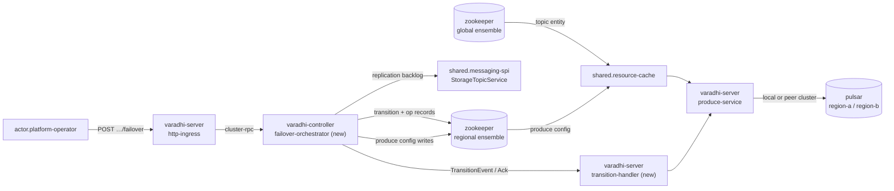
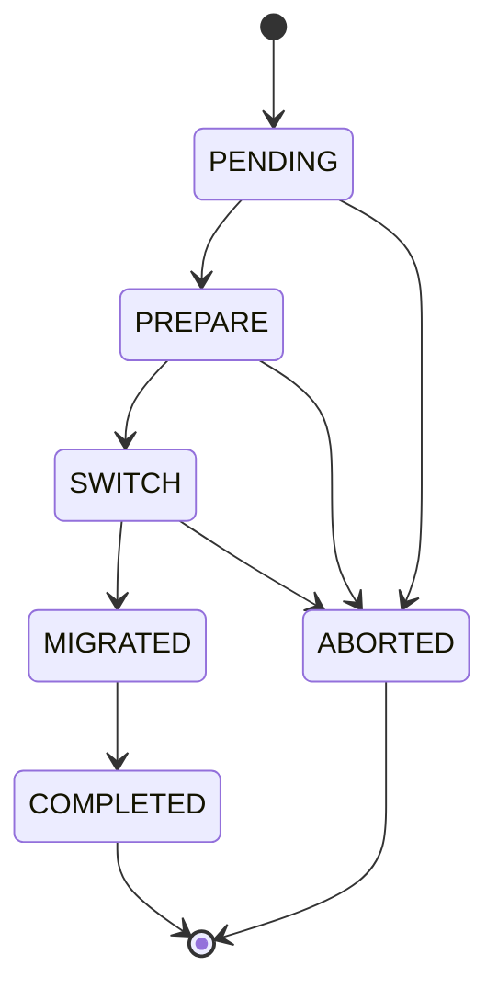

# VIP-0003: Internal Topic Failover (Produce Path)

**Status:** Draft
**Related:** external (DNS) failover — separate VIP, not yet written; subscription / internal-topic
(RQ, DLQ) failover — separate VIP, not yet written.
**Audience:** Varadhi maintainers and contributors.

---

## 1. Summary

A `concept.topic` is backed by `concept.storage-topic`s that the messaging stack geo-replicates
across regions. `varadhi-server` in a region produces to **its own region's** `pulsar` cluster.
When that cluster degrades, the region's Varadhi pods are still healthy and still receiving
produce traffic — they simply have nowhere good to write.

**Internal failover** repoints those pods at a peer region's cluster for the same geo-replicated
storage topic, without moving ingress and without redeploying producers. `actor.producer` keeps
calling the same regional endpoint; only the broker connection behind it changes.

```
before:  producer → varadhi-server (region-a) → pulsar (region-a)
after:   producer → varadhi-server (region-a) → pulsar (region-b)
```

Two things are explicitly *not* this VIP: moving **ingress** (clients reaching a different
region's Varadhi — that is external/DNS failover, and it is what you need when the Varadhi pods
themselves are unreachable), and failing over the **internal** topics a subscription produces to
(retry queues, DLQ).

The storage topic **name is identical in every region** — geo-replication is a namespace-level
property of the messaging stack — so failover changes *which cluster we connect to*, never which
topic or which segment. `produceIdx` does not move.

Routing is metadata-driven: a region-local produce config per topic, holding
`state` / `produceIdx` / `failOverRegion`. `varadhi-controller` in that region drives a state
machine that fences produce, waits for replication to catch up, and then commits the new route.
`actor.platform-operator` triggers it through a region-local REST call.

---

## 2. Motivation

- A degraded regional messaging stack currently means a **prolonged** produce outage for every
  topic in that region. The only recovery is operator action outside Varadhi.
- The replicas already exist. Geo-replication puts the same storage topic in every configured
  region; nothing but the broker connection stops us from using one.
- Producers must not be involved. Any recovery that requires redeploying or reconfiguring
  producer applications is too slow to matter during an incident.
- Trading a **few seconds** of produce unavailability for recovery from a **multi-minute or
  longer** outage is a good trade, and is the core bet of this design.

---

## 3. Goals & Non-Goals

### Goals

- Repoint a topic's produce path in one region to a peer region's cluster, driven purely by
  metadata (`failOverRegion`), with producer applications unchanged.
- Preserve **per-group ordering** for `concept.grouping` topics across the switch, by draining
  replication backlog before the new route goes live.
- Keep the produce outage **short and bounded**, with the bound explicit and partly caller-chosen.
- **Never leave the orchestration stuck**: every state either advances or aborts, and a controller
  restart resumes from durable state.
- Provide a **durable audit trail** per failover attempt.
- Support **failback** through the same mechanism (target = the local region).
- Reuse the existing operation/reconciliation machinery (`varadhi-controller.operation-manager`)
  rather than inventing parallel orchestration.

### Non-Goals

- **External / ingress failover** (DNS, client region selection). Separate VIP. This VIP assumes
  `varadhi-server` in the affected region is healthy and reachable.
- **Subscription and internal-topic failover** (retry queues, DLQ produce from `varadhi-consumer`).
  Separate VIP; see §6.8 for why consumer pods are not participants here.
- **Automatic failover.** `Region.status` is written by an operator or external automation; reacting
  to it automatically is deferred (§8).
- **Region-wide bulk failover** ("move every topic in region-a"). Deferred; per-topic calls are the
  v1 stopgap.
- **In-process health probing of the messaging stack** by Varadhi.
- **Consume-side movement.** Consumers are unaffected by this VIP; a topic failed over for produce
  is still consumed as before, from whichever region a consumer runs in.

---

## 4. Current State

Shipped and reusable:

| Element | Where | Note |
|---|---|---|
| `ProduceConfig` (`state`, `produceIdx`, `failOverRegion`) | `entities` | today a `Map<RegionName, ProduceConfig>` field on `VaradhiTopic`, in the **global** metastore |
| `TopicState` (`Producing` / `Fenced` / `Blocked`) + `ProduceStatus` | `entities` | `Fenced` already carries a retry-oriented message |
| `TopicResolver` | `entities` | resolves `ProduceKey(topicFqn, produceRegion, storageTopicId)`; gated and ungated forms |
| `ProduceKey` as producer cache key | `varadhi-server.produce-service` | `produceRegion` is **currently only a cache-key discriminator** |
| `Region` / `RegionStatus`, `PATCH /v1/regions/:region` | `entities`, `varadhi-server.http-ingress` | operator-set regional availability |
| `TransitionType`, `TransitionEvent`, `TransitionAck` | `entities` | event/ack shapes for pod coordination |
| `ZNodeKind(kind, pathFormat, …)` | `metastore-zk` | `pathFormat` is a format string, so hierarchical paths need no new machinery |
| Operation records + reconciliation | `varadhi-controller.operation-manager` | pattern to copy for failover ops |

Known gaps this VIP must close (all verified against the code, not assumed):

1. **Nothing can produce cross-cluster.** `ProducerService.loadProducerObject` drops
   `key.produceRegion()` entirely, and `PulsarProducerFactory` holds a single `PulsarClient` built
   from a single `PulsarConfig`. There is exactly one broker connection per pod today.
2. **No orchestration.** No state machine, no transition store, no pod-side transition handling.
3. **`TopicResolver` reads the *target* region's `ProduceConfig`** to get `produceIdx`. That is both
   unnecessary (`produceIdx` never changes on failover) and incompatible with a region-local config
   (§6.3).
4. **The producer cache leaks.** `producerCache` is a Caffeine cache with `expireAfterAccess` and
   **no removal listener**, so an evicted `Producer` is never `close()`d (§6.6).
5. **No replication-backlog query** exists in `shared.messaging-spi`.

---

## 5. Decision

Drive failover as a **controller-owned state machine over region-local metadata**, with pod
acknowledgement barriers and a replication drain inside the outage window.

| Approach | Mechanism | Verdict |
|---|---|---|
| **A — Metadata-only flip** | One store write flips the route; pods converge whenever they converge | **Rejected.** No pre-warm (first produce after the flip pays cold connection setup to a remote cluster), and no point at which produce is known to have stopped — so replication backlog can never be shown to be drained, and grouped ordering is lost. |
| **B — Orchestrated transition** | Controller state machine + pod ack barriers + fence + drain + single commit | **Chosen.** Bounded outage, pre-warmed target, ordering preserved, recoverable. |
| **C — Per-pod autonomous flip** | Each pod decides locally on a health signal | **Rejected.** Pods disagree; produce splits across two clusters with no drain — ordering loss with no bound. |
| **D — Distributed lock per topic** | Global lock held across the switch | **Rejected.** Puts a coordination dependency on the produce hot path. |

Supporting decisions, each with the reason it is not the obvious alternative:

- **Produce config moves to a region-local metastore.** It governs one region's produce behaviour
  and is written by that region's controller; a separate per-region ZK ensemble keeps that write
  path independent of the global ensemble's availability. Hidden behind `shared.metadata-spi` — the
  SPI does not expose which ensemble backs a call.
- **One commit, at `MIGRATED`.** `SWITCH` writes only `state=Fenced`; `MIGRATED` writes
  `state=Producing` **and** `failOverRegion=target` together. Single-purpose writes make abort a
  plain revert, and make the route going live atomic with produce reopening.
- **The replication drain sits inside `SWITCH`.** Backlog can only settle *after* produce to the
  source stops, and produce can only reopen *after* it has settled. It is inside the outage window
  by construction, not by choice.
- **Pods stop *using* the source producer; they do not close it.** Abort then costs nothing and the
  connection is still hot. Closing is deferred to a terminal state, and only actually needed when
  `produceIdx` moved (storage migration).
- **Ordering is protected at the target, so the drain is directional** (source → target). §6.5.

---

## 6. Design

### 6.1 Architecture overview



The controller and the regional ensemble are **per region**. A failover in region-a is planned,
committed and observed entirely within region-a; region-b is a produce *destination* only, and
takes no part in the orchestration.

### 6.2 Data model

**Global metastore** (`zookeeper`, global ensemble) — cluster-wide topic identity:

| Change | Element |
|---|---|
| **Remove** | `VaradhiTopic.produceConfigs` — moves to the regional store |
| **Add** | `StorageTopic.regions : Set<RegionName>` — the regions this storage topic is replicated to. Sole source of truth for validating a failover target. On the base class: replication is a stack-agnostic fact. |
| Unchanged | `segmentedStorageTopic`, `grouped`, `autoFailover`, lifecycle status |

**Regional metastore** (`zookeeper`, per-region ensemble) — the region's own produce behaviour.
The region is implicit in *which* ensemble is addressed, so it appears in no path:

```
<ns>/produceConfig/<project>/<topicName>              → TopicProduceConfig   (versioned, CAS)
<ns>/produceConfig/<project>/<topicName>/transition    → TopicTransition
<ns>/failoverOperation/<opId>                          → TopicFailoverOperation
```

- Sharding on `<project>` keeps ZK child counts bounded; the topic FQN already encodes the project,
  and `ZNodeKind.pathFormat` already accepts multiple segments. (The existing global `TOPIC` /
  `SUBSCRIPTION` / `EVENT` kinds are flat and carry the same latent limit — pre-existing, out of
  scope here.)
- **`transition` is a child of the produce config it governs.** Creating it *is* the per-topic
  uniqueness guard (`NodeExists` → 409), and ZK structurally refuses to delete a produce config
  that still has a live transition — the delete-during-failover guard is enforced by the store
  rather than by a check that can race.

| Entity | Fields |
|---|---|
| `TopicProduceConfig` | `state`, `produceIdx`, `failOverRegion` — the shipped `ProduceConfig` promoted to a versioned regional entity keyed by topic FQN |
| `TopicTransition` | `transitionId`, `type`, `topicFqn`, `targetRegion`, `state`, `participants`, `requiredConfigVersion`, `lagDrainTimeoutMs`, `onLagTimeout`, per-state timestamps |
| `TopicFailoverOperation` | audit record: `opId`, requester, state history, error — modelled on `SubscriptionOperation`, with its own `MetaStoreEntityType` and `ZNodeKind` |

The operation path doubles as the **index of in-flight transitions**: a restarted controller
reconciles from it, exactly as `varadhi-controller.operation-manager` already does for subscription
operations, instead of walking every topic to find live transitions.

> Retention on operation paths is an **existing** gap (no purge exists in the current operation
> store); this inherits it rather than introducing it. See §7.

### 6.3 Produce path resolution

Required `TopicResolver` behaviour — the local produce config supplies *everything*:

```
config      = local region's TopicProduceConfig       // region-local; no peer lookup
if gated and not config.state.isProduceAllowed(): reject
targetRegion = config.failOverRegion ?: localRegion   // which cluster
segment      = segmentedStorageTopic.getTopic(config.produceIdx)   // local produceIdx
→ ProduceKey(topicFqn, targetRegion, segment.id)
```

Two consequences:

- The shipped lookup of the **target** region's `ProduceConfig` is **removed**, along with the
  `failOverRegion` invariant "must reference a region present in `produceConfigs`". Target
  validation becomes `target ∈ StorageTopic.regions` ∧ `Region.status.isProduceAvailable()`.
- `ProduceKey.produceRegion` stops being a bare cache discriminator and becomes the **cluster
  selector** that `ProducerFactory` acts on.

Gating still reads only the local region's `state`, which is the correct and only meaningful check:
a pod can only ever be asked to produce by clients that reached *it*.

Response mapping — `Fenced` must become retryable:

| `TopicState` | `ProduceStatus` | HTTP | Meaning |
|---|---|---|---|
| `Producing` | `Success` (from broker) | 200 | steady state |
| `Fenced` | `Fenced` | **503 + `Retry-After`** | transient; a rejected produce provably never reached a broker, so a retry cannot duplicate |
| `Blocked` | `NotAllowed` | 4xx | steady-state standby; a client here is misconfigured, and retrying will not help |

The existing `ProduceStatus` → HTTP mapping in `ProduceHandlers` must be updated accordingly; 4xx
for `Fenced` is wrong, because mainstream HTTP clients treat it as terminal.

### 6.4 State machine



| State | Produce config write | Pod work | Abort? |
|---|---|---|---|
| `PENDING` | — | — | yes, free |
| `PREPARE` | — | open a producer to the **target** cluster for the same storage topic name; ack | yes, free |
| `SWITCH` | `state=Fenced` | stop accepting produce (503), settle in-flight sends to the source, **retain** the source producer, ack with observed config version → then the controller polls source→target backlog | yes: revert to `Producing` |
| `MIGRATED` | `state=Producing`, `failOverRegion=target` | resolve now yields `produceRegion=target`; the pre-warmed producer serves traffic | **no — forward only** |
| `COMPLETED` | — | all acks at ≥ committed version | terminal |
| `ABORTED` | `state=Producing`, `failOverRegion` untouched | resume on the retained source producer | terminal |

Because `failOverRegion` is written only at `MIGRATED`, aborting from `SWITCH` restores the exact
prior state with a single field write.

**Timeouts.** Two, nested, both inside `SWITCH`:

| Timeout | Set by | Typical | On expiry |
|---|---|---|---|
| `prepareAckTimeoutMs` | config | seconds | abort |
| `switchAckTimeoutMs` | config | ~2s | abort — nothing is committed yet |
| `lagDrainTimeoutMs` | **request** | caller's call | `onLagTimeout: FAILOVER` (default) → proceed to `MIGRATED` accepting ordering loss; `ABORT` → revert |
| `migratedAckTimeoutMs` | config | seconds | alert; **cannot** abort — the route is committed |

So the honest bound is:

```
outage ≈ switchAck + lagDrain + convergence
```

The caller sets `lagDrainTimeoutMs`, therefore **the caller sets the outage length**. Ungrouped
topics skip the drain entirely, making their outage `switchAck + convergence` — sub-second in
practice. Use `GET …/failover/preflight` (§6.7) to read current backlog *before* choosing the
budget.

If the source cluster's admin API is unreachable, backlog is **unknown, not zero**; the same
timeout policy applies.

**Sequence:**

```mermaid
sequenceDiagram
    participant Op as actor.platform-operator
    participant Ctrl as failover-orchestrator
    participant RZK as regional zookeeper
    participant Pod as varadhi-server pods
    participant MS as pulsar (source)

    Op->>Ctrl: POST …/failover {targetRegion, lagDrainTimeoutMs}
    Ctrl->>RZK: create transition (uniqueness) + op record
    Ctrl->>Pod: PREPARE (target region)
    Pod->>Pod: open producer to target cluster
    Pod-->>Ctrl: ack
    Ctrl->>RZK: write state=Fenced (v=N+1)
    Ctrl->>Pod: SWITCH (requiredConfigVersion=N+1)
    Pod->>Pod: reject produce (503), settle in-flight, retain source producer
    Pod-->>Ctrl: ack (observed version)
    loop grouped only, until 0 or lagDrainTimeoutMs
        Ctrl->>MS: replication backlog → target
    end
    Ctrl->>RZK: write state=Producing, failOverRegion=target (v=N+2)
    Ctrl->>Pod: MIGRATED (requiredConfigVersion=N+2)
    Pod->>Pod: resolve → target cluster; produce resumes
    Pod-->>Ctrl: ack
    Ctrl->>RZK: delete transition; op COMPLETED
```

**Happens-before.** The produce config is the authority; the event is only a nudge plus a barrier.
Pods **never** take routing from an event payload — routing comes from the cached config, always.
Each event therefore carries `requiredConfigVersion`: a pod waits until its cached config reaches
that version (bounded by the state's timeout), acts, and acks with the version it observed; the
controller counts only acks at ≥ the required version. This makes event ordering relative to global
metastore events irrelevant, because failover reads and writes *only* the regional config. A
`(transitionId, state-ordinal)` pair lets a pod drop a reordered or stale event instead of
applying it.

**Participants** are `varadhi-server` pods holding a producer for that topic. `NOT_INVOLVED` pods
ack to opt out so the barrier stops waiting on them. Strictness is only needed at `SWITCH`:

- a pod **leaving** mid-transition takes its in-flight sends with it — safe to continue;
- a pod **joining** (including a restart) reads `state=Fenced` from the regional store and is
  therefore fenced by data, with no event needed — safe by construction;
- `PREPARE` coverage is best-effort: a pod that misses it merely pays a cold connection at
  `MIGRATED`.

**Failback** is the same call with `targetRegion` = the local region. `MIGRATED` clears
`failOverRegion`, and the drain runs in the reverse direction.

### 6.5 Why the drain is required

In the target region's copy of the topic, **locally produced messages and replicated messages
interleave by arrival**. With backlog outstanding: `m1` was produced to region-a, then we switch,
then `m2` is produced to region-b. If `m1` has not yet replicated, a consumer reading in region-b
sees `m2` before `m1` — per-group ordering broken. Consumers reading in region-a are unaffected
either way (`m1` local, `m2` arrives by replication afterwards).

Hence the drain is **directional** (source → target), scoped to the active segment's storage topic,
summed over its partitions, and required only for `concept.grouping` topics. Ungrouped topics have
no ordering contract to protect and skip it.

`onLagTimeout: FAILOVER` deliberately accepts this loss: the stranded backlog replicates *after*
newer target-region messages once the source recovers, so affected groups are permanently
reordered. It is the right default only because the alternative is a continuing outage — it must be
audited as an explicit operator override.

### 6.6 Producer lifecycle

A broker producer is a long-lived connection, not a value; `expireAfterAccess` is the wrong model
for it, and today eviction silently leaks the underlying producer. Replace the TTL cache with an
**event-driven registry** keyed by `ProduceKey`:

- populated on demand, as now;
- entries removed **only** on: regional produce-config change for that topic, topic
  delete / invalidate, pod shutdown;
- every removal path funnels through a single remover that `close()`s — this fixes the existing
  leak;
- an optional idle reaper may exist on an *hours* timescale, never on a transition timescale.

Invalidation hooks `ResourceReadCache#addOnInvalidate` on the **regional produce-config** cache —
the mechanism `varadhi-server.produce-rate-limiter` already uses for per-topic cleanup.

Nothing time-based can then drop a producer mid-transition, so source and target producers are both
legitimately resident for the whole window and no special pinning is required.

### 6.7 REST API

Region-local, served by the affected region's own `varadhi-server`. Topic-scoped authorization on
topic routes (a new `ResourceAction`, at the same `concept.topic` hierarchy level as
`TOPIC_PRODUCE`); admin scope on the region-wide listing.

| Method | Route | Purpose |
|---|---|---|
| `GET` | `…/topics/:t/failover/preflight?targetRegion=` | Dry run: target ∈ `StorageTopic.regions`, `Region.status`, **current backlog**, participant count. Lets an operator size `lagDrainTimeoutMs` before opening an outage. |
| `POST` | `…/topics/:t/failover` | `{ targetRegion, lagDrainTimeoutMs?, onLagTimeout? }`, `?skipValidation` (admin). → **202** + `{transitionId, opId}`. Failback = `targetRegion` is the local region. |
| `POST` | `…/topics/:t/failover/abort` | Allowed through `SWITCH`; **409** at `MIGRATED` or later. → 202 |
| `GET` | `…/topics/:t/failover` | Live transition: state, entered-at, participants, **which hosts have not acked**, current backlog, remaining budget. 404 if none. |
| `GET` | `…/topics/:t/failover/history?limit=` | Past attempts from the operation store. |
| `GET` | `…/topics/:t/produce-config` | This region's live config: `state`, `produceIdx`, `failOverRegion`, version. Answers "where is this region producing right now" directly rather than by inference. |
| `GET` | `/v1/failovers?state=` | Active and recent transitions in **this** region. |

`202` means *requested and durably recorded*, never *completed*.

`skipValidation` bypasses **topology pre-checks only**. It cannot skip the drain, and its use is
audited.

### 6.8 Component requirements (C4)

**Existing components gaining requirements:**

| Component | Requirement |
|---|---|
| `shared.messaging-spi` | `ProducerFactory.newProducer` takes the target `RegionName`; `MessagingStackProvider` provisions and pools a client **per region** from configured peer-region endpoints and credentials; new `StorageTopicService` replication-backlog query (source → target, per storage topic). Enabling a messaging stack means certifying all of these. |
| `shared.metadata-spi` | New `ProduceConfigStore` (region-parameterized for the control plane, local-region-bound for the produce path) and `TransitionStore`; failover operation records. The implementation routes global vs regional ensembles internally — **the SPI does not expose which ensemble backs a call**. |
| `shared.resource-cache` | Second cache fed from the regional ensemble; version-aware read/await for the ack barrier; invalidation hook drives producer-registry cleanup. |
| `varadhi-server.produce-service` | Resolve from the local produce config (§6.3); select the producer by `ProduceKey.produceRegion`; honour `Fenced`; producer registry (§6.6). |
| `varadhi-server.http-ingress` | Failover routes (§6.7); `Fenced` → 503 + `Retry-After`. |
| `varadhi-controller.event-distributor` | Watch the regional ensemble in addition to the global one; fan out regional `concept.entity-change-event`s to that region's pods. |
| `varadhi-controller.operation-manager` | New operation type; reconcile in-flight failovers on controller restart; reuse existing concurrency and retry configuration. |
| `shared.entity-services` | `flow.admin.create-topic` / delete materialize and remove regional produce configs (§6.9). |
| `shared.cluster-rpc` | Transport for `TransitionEvent` / `TransitionAck`. |

**New components:**

| Component | Container | Responsibility |
|---|---|---|
| `failover-orchestrator` | `varadhi-controller` | The state machine: transition claim, ack barriers, backlog polling, the two config writes, reconciliation after restart |
| `transition-handler` | `varadhi-server` | Pod side: pre-warm, fence, version-fenced state application, acks |

**Deployment:** a per-region `zookeeper` ensemble in addition to the global one. The component
serving topic create must reach **every** region's ensemble — control-plane only, off the hot path
(§6.9).

**Also proposed:** a `flow.failover.internal-topic-failover` flow node, and `concept.produce-config`
as a documented concept, once implemented.

### 6.9 Topic create, delete, region onboarding

Topic create stays in `shared.entity-services` (the server's create flow) and writes every region's
produce config directly. A controller-mediated handoff would need a new readiness protocol and a
new component for no benefit yet; the cost of the simple path is only that the creating server
needs cross-region ensemble connectivity, which the global ensemble already requires.

- The topic remains in its **`CREATING`** lifecycle state until every region's produce config is
  materialized. Produce is already rejected outright for a non-active topic, so an incomplete
  create is never a correctness question — the lifecycle state *is* the completeness gate. A region
  whose ensemble is unreachable delays the topic becoming usable; it does not fail the create call.
- A **materialize-only reconciler** per region backfills: active global topics with no local produce
  config get one, defaulting to `Blocked`. This same job covers three needs you have regardless —
  repairing a partial create, **onboarding a new region**, and **migrating existing topics** off the
  current `produceConfigs` map.
- Delete mirrors it: remove regional configs, with an orphan sweep for local configs whose global
  topic is gone. ZK refuses to delete a config with a live transition child (§6.2).
- Absence of a config also fails closed at the resolver (no config → topic not available in this
  region), giving a second line of defence beneath the lifecycle gate.

### 6.10 Failure handling and guards

| # | Case | Required behaviour |
|---|---|---|
| E1 | Target region not in `StorageTopic.regions` | Reject at the API (400) unless `skipValidation` |
| E2 | Target region not produce-available per `Region.status` | Reject at the API (400) unless `skipValidation` |
| E3 | Target region == source, with no `failOverRegion` set | Reject — nothing to do |
| E4 | Concurrent failover on the same topic | `create` of the transition znode fails `NodeExists` → 409 |
| E5 | Topic update or delete during a transition | Rejected: ZK will not delete a produce config with a live transition child; update guarded at the API |
| E6 | Config CAS conflict on a controller write | Re-read and retry the state; abort if still conflicting. Backstop only — the transition znode is the primary guard |
| E7 | Ack timeout in `PENDING` / `PREPARE` / `SWITCH` | Targeted resend, then abort |
| E8 | Ack timeout at `MIGRATED` | Alert; cannot abort. Route is committed and pods converge from the config regardless |
| E9 | Backlog will not drain (source cluster dead) | `lagDrainTimeoutMs` expires → `onLagTimeout` decides (§6.5) |
| E10 | Backlog **growing** during the drain | Abort — implies produce to the source has not actually stopped |
| E11 | Missing segment for `produceIdx` | Fail loudly at resolve; a config/storage inconsistency, not a failover concern |
| E12 | Controller dies in `PENDING` / `PREPARE` | Nothing written; reconciler aborts |
| E13 | Controller dies in `SWITCH` | **The topic stays fenced in that region until the controller returns.** Reconciler then aborts or advances. See the risk below |
| E14 | Controller dies at/after `MIGRATED` | Route is already committed; pods converge from the config alone. Reconciler only finishes bookkeeping |
| E15 | Pod restarts mid-transition | Comes up non-participating and reads `Fenced` from the store, so it correctly refuses produce; joins normal service on the next terminal state |

**Risk — HA controller is a production prerequisite.** `varadhi-controller` is a singleton with no
leader election today, so E13 means a controller crash between the `SWITCH` write and the
`MIGRATED` write leaves that topic's produce fenced in that region until the controller comes back.
A durable fence deadline was considered as mitigation and **rejected** to keep the model simple
(one authority, no time-dependent divergence between pods); controller HA is the intended fix and
gates production use of this feature.

No multi-node metastore transactions are used anywhere on this path: idempotent states plus a
reconciler provide convergence.

### 6.11 Security and access control

- Failover mutates produce routing for a topic, so it is authorized at the `concept.topic` level —
  a new `ResourceAction` alongside `TOPIC_PRODUCE`, resolved through the existing hierarchy in
  `varadhi-server.authorization`.
- `/v1/failovers` listing is admin-scoped.
- `skipValidation` and a non-default `onLagTimeout` are **audited operator overrides**: recorded on
  the operation record with the requester.
- Cross-region broker credentials become pod configuration; they are peers of the existing local
  messaging-stack credentials and carry the same handling requirements.

### 6.12 Observability

| Signal | Purpose |
|---|---|
| `failover.transition.state` (counter: state, outcome) | Per-state success and failure rates |
| `failover.transition.duration` (histogram per state) | Where the outage time actually goes |
| `failover.outage.duration` (histogram, `SWITCH` → `MIGRATED` acked) | The number the goal in §3 is measured against |
| `failover.active` (gauge) | In-flight transitions |
| `failover.replication_backlog` (gauge during drain) | Drain progress; also the input to sizing `lagDrainTimeoutMs` |
| `failover.lag_timeout.total` (by `onLagTimeout` outcome) | How often ordering loss is being accepted |
| `produce.fenced.total` (topic, region) | Client-visible impact |
| `produce.cross_region.total` (topic, target region) | How much traffic is currently failed over — also detects failbacks never performed |
| Audit log per `opId` | Forensics |

---

## 7. Open Questions

1. **Operation-record retention.** No purge exists in the current operation store. Date-bucket the
   path, add a purge job, or cap children — needs a decision that probably applies to subscription
   operations too, not just failover.
2. **Peer-region broker endpoint configuration.** Static per-pod config listing every peer region's
   endpoints and credentials, or derived from `Region` entities in the global metastore? Static is
   simpler; derived avoids a redeploy when a region is onboarded.
3. **`switchAckTimeoutMs` and default `lagDrainTimeoutMs` values.** Need measurement — pod fan-out
   size and observed steady-state backlog per topic class.
4. **Backlog query granularity.** Per storage topic summed over partitions is assumed. Confirm
   against what the stack's admin API reports for a partitioned topic, and what it reports when a
   replication cluster is unreachable rather than merely behind.
5. **`autoFailover` today.** The field is shipped but automatic failover is deferred (§8). Leave it
   inert, or reject writes that set it until the automatic path exists?
6. **Region-local reconciler placement.** Regional controller or server? Controller is the natural
   owner, but §6.9 keeps create in the server, so the two would split responsibility for the same
   data.

---

## 8. Future Work

- **Automatic failover** driven by `Region.status` plus per-topic `autoFailover`, with per-topic and
  per-region cooldowns, a rate cap, a global freeze kill-switch, and priority ordering. All the
  safety machinery in §6.10 is a prerequisite.
- **Region-wide bulk failover** — the shape an actual incident takes, batched with concurrency
  limits over the per-topic machinery here.
- **Subscription / internal-topic failover** (retry queues, DLQ). `varadhi-consumer` produces to
  those via `FailedMsgProducer`, which bypasses `ProducerService`, `TopicResolver` and the producer
  cache entirely and has **no produce gate at all** today. That is why consumer pods are *not*
  participants in topic failover, and why this needs its own VIP: subscription-scoped produce
  configs, and a fenced consumer must pause its processing loop rather than fail messages.
- **Storage migration** (`TransitionType.STORAGE_MIGRATION`, moving `produceIdx` within a region)
  reuses this state machine with a different target type and an actual producer close at
  `COMPLETED`.
- **External / ingress failover** — the complement to this VIP, for when Varadhi itself is
  unreachable in a region.
- **Controller HA** — see the risk in §6.10.
- **Independent per-pod event progress.** `flow.cache.entity-event-propagation` currently commits
  only after every node acks, so one stuck pod head-of-line-blocks propagation cluster-wide. Not
  required by this VIP, but it directly limits how fast convergence can be relied upon.

---

## 9. References

- `docs/containers.md` — `varadhi-server`, `varadhi-controller`, `zookeeper`, `pulsar`
- `docs/shared-components.md` — `shared.messaging-spi`, `shared.metadata-spi`,
  `shared.resource-cache`
- `docs/flows.md` — `flow.produce.message-to-topic`, `flow.admin.create-topic`,
  `flow.cache.entity-event-propagation`
- `entities` — `TopicResolver`, `ProduceConfig`, `TopicState`, `ProduceStatus`, `StorageTopic`,
  `Region`, `TransitionEvent`, `TransitionAck`, `TransitionType`
- `varadhi-server.produce-service` — `ProducerService`, `ProduceKey`, `ProduceResult`
- `metastore-zk` — `ZKMetaStore`, `ZNodeKind`, `VaradhiMetaStore`, operation store
- Apache Pulsar geo-replication (namespace-level replication clusters; identical topic names across
  clusters)
