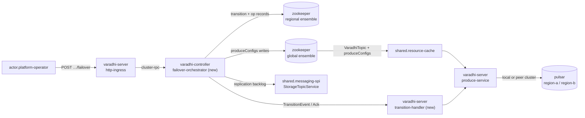
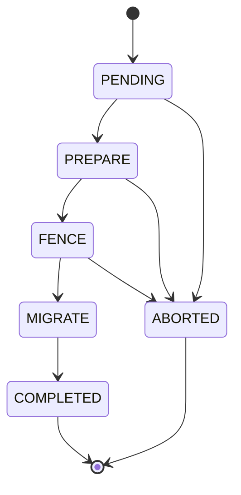

# VIP-0003: Internal Topic Failover (Produce Path)

**Status:** Draft
**Related:** external (DNS) failover — separate VIP, not yet written; subscription / internal-topic
(RQ, DLQ) failover — separate VIP, not yet written.
**Audience:** Varadhi maintainers and contributors.

---

## 1. Summary

A `concept.topic` is backed by `concept.storage-topic`s that the messaging stack geo-replicates
across regions. `varadhi-server` in a region produces to **its own region's** `pulsar` cluster.
When that cluster degrades, the region's Varadhi pods are still healthy and still receiving
produce traffic — they simply have nowhere good to write.

**Internal failover** repoints those pods at a peer region's cluster for the same geo-replicated
storage topic, without moving ingress and without redeploying producers. `actor.producer` keeps
calling the same regional endpoint; only the broker connection behind it changes.

```
before:  producer → varadhi-server (region-a) → pulsar (region-a)
after:   producer → varadhi-server (region-a) → pulsar (region-b)
```

Two things are explicitly *not* this VIP: moving **ingress** (clients reaching a different
region's Varadhi — that is external/DNS failover, and it is what you need when the Varadhi pods
themselves are unreachable), and failing over the **internal** topics a subscription produces to
(retry queues, DLQ).

The storage topic **name is identical in every region** — geo-replication is a namespace-level
property of the messaging stack — so failover changes *which cluster we connect to*, never which
topic or which segment. `produceIdx` does not move.

Routing is metadata-driven: `produceConfigs` on `VaradhiTopic` in **global** ZooKeeper, keyed by
region, holding `state` / `produceIdx` / `failOverRegion`. `varadhi-controller` in the affected
region drives a state machine that fences produce, waits for replication to catch up, and then
commits the new route via tracked topic writes. `actor.platform-operator` triggers it through a
region-local REST call.

---

## 2. Motivation

- A degraded regional messaging stack currently means a **prolonged** produce outage for every
  topic in that region. The only recovery is operator action outside Varadhi.
- The replicas already exist. Geo-replication puts the same storage topic in every configured
  region; nothing but the broker connection stops us from using one.
- Producers must not be involved. Any recovery that requires redeploying or reconfiguring
  producer applications is too slow to matter during an incident.
- Trading a **few seconds** of produce unavailability for recovery from a **multi-minute or
  longer** outage is a good trade, and is the core bet of this design.

---

## 3. Goals & Non-Goals

### Goals

- Repoint a topic's produce path in one region to a peer region's cluster, driven purely by
  metadata (`failOverRegion`), with producer applications unchanged.
- Preserve **per-group ordering** for `concept.grouping` topics across the switch, by draining
  replication backlog before the new route goes live.
- Keep the produce outage **short and bounded**, with the bound explicit and partly caller-chosen.
- **Never leave the orchestration stuck**: every state either advances or aborts, and a controller
  restart resumes from durable state.
- Provide a **durable audit trail** per failover attempt.
- Support **failback** through the same mechanism (target = the local region).
- Reuse the existing operation/reconciliation machinery (`varadhi-controller.operation-manager`)
  rather than inventing parallel orchestration.

### Non-Goals

- **External / ingress failover** (DNS, client region selection). Separate VIP. This VIP assumes
  `varadhi-server` in the affected region is healthy and reachable.
- **Subscription and internal-topic failover** (retry queues, DLQ produce from `varadhi-consumer`).
  Separate VIP; see §6.8 for why consumer pods are not participants here.
- **Automatic failover.** `Region.status` is written by an operator or external automation; reacting
  to it automatically is deferred (§8).
- **Region-wide bulk failover** ("move every topic in region-a"). Deferred; per-topic calls are the
  v1 stopgap.
- **In-process health probing of the messaging stack** by Varadhi.
- **Consume-side movement.** Consumers are unaffected by this VIP; a topic failed over for produce
  is still consumed as before, from whichever region a consumer runs in.

---

## 4. Current State

Shipped and reusable:

| Element | Where | Note |
|---|---|---|
| `ProduceConfig` (`state`, `produceIdx`, `failOverRegion`) | `entities` | `Map<RegionName, ProduceConfig>` on `VaradhiTopic` in the **global** metastore — **stays there**; not moved to region-local ZK |
| `TopicState` (`Producing` / `Fenced` / `Blocked`) + `ProduceStatus` | `entities` | `Fenced` already carries a retry-oriented message |
| `TopicResolver` | `entities` | resolves `ProduceKey(topicFqn, produceRegion, storageTopicId)`; gated and ungated forms |
| `ProduceKey` as producer cache key | `varadhi-server.produce-service` | `produceRegion` is **currently only a cache-key discriminator** |
| `Region` / `RegionStatus`, `PATCH /v1/regions/:region` | `entities`, `varadhi-server.http-ingress` | operator-set regional availability |
| `TransitionType`, `TransitionStage`, `TransitionParticipation`, `TransitionEvent`, `TransitionAck` | `entities` | pod-coordination wire contract. This VIP’s stage names are `PENDING` / `PREPARE` / `FENCE` / `MIGRATE` / `COMPLETED` / `ABORTED` (§6.4). |
| `ZNodeKind(kind, pathFormat, …)` | `metastore-zk` | `pathFormat` is a format string, so hierarchical paths need no new machinery |
| Operation records + reconciliation | `varadhi-controller.operation-manager` | pattern to copy for failover ops |

Known gaps this VIP must close (all verified against the code, not assumed):

1. **Nothing can produce cross-cluster.** `ProducerService.loadProducerObject` drops
   `key.produceRegion()` entirely, and `PulsarProducerFactory` holds a single `PulsarClient` built
   from a single `PulsarConfig`. There is exactly one broker connection per pod today.
2. **No orchestration behind the wire contract.** The stage / participation / event / ack shapes
   ship, but nothing drives them: no controller state machine, no transition store, no pod-side
   transition handling. Two shapes also need changing to carry this design (§6.4):
   `TransitionAck` has no field for the version a pod actually observed, so a barrier failure is
   today indistinguishable from a bare timeout. (`TransitionEvent.topicVersionToAwait` already
   names the **`VaradhiTopic`** version — correct while `produceConfigs` remains on the topic.)
3. **`TopicResolver` reads the *target* region's `ProduceConfig`** to get `produceIdx`. That is
   unnecessary (`produceIdx` never changes on failover); resolve must use the **ingress** region's
   entry in `produceConfigs` (§6.3).
4. **The producer cache leaks.** `producerCache` is a Caffeine cache with `expireAfterAccess` and
   **no removal listener**, so an evicted `Producer` is never `close()`d (§6.6).
5. **No replication-backlog query** exists in `shared.messaging-spi`.

---

## 5. Decision

Drive failover as a **controller-owned state machine** that updates **global** `produceConfigs`
and coordinates pods with region-local transition records, with acknowledgement barriers and a
replication drain inside the outage window.

| Approach | Mechanism | Verdict |
|---|---|---|
| **A — Metadata-only flip** | One store write flips the route; pods converge whenever they converge | **Rejected.** No pre-warm (first produce after the flip pays cold connection setup to a remote cluster), and no point at which produce is known to have stopped — so replication backlog can never be shown to be drained, and grouped ordering is lost. |
| **B — Orchestrated transition** | Controller state machine + pod ack barriers + fence + drain + single commit | **Chosen.** Bounded outage, pre-warmed target, ordering preserved, recoverable. |
| **C — Per-pod autonomous flip** | Each pod decides locally on a health signal | **Rejected.** Pods disagree; produce splits across two clusters with no drain — ordering loss with no bound. |
| **D — Distributed lock per topic** | Global lock held across the switch | **Rejected.** Puts a coordination dependency on the produce hot path. |

Supporting decisions, each with the reason it is not the obvious alternative:

- **`produceConfigs` stays on `VaradhiTopic` in global ZooKeeper.** It is the SSOT for produce
  routing; failover does **not** introduce a region-local produce-config entity. Region-local ZK
  holds only transition / operation records for orchestration.
- **Config-authoritative.** The topic's `produceConfigs` (via `TopicCache`) is the only thing that
  changes pod behaviour; the transition state in region-local ZK is the only thing that advances
  the orchestration. Events are *convergence probes*, not instructions to route. This is what makes
  a restarting pod correct by data alone, and it is the reason no barrier is needed to un-fence
  anyone (§6.4).
- **One commit, at `MIGRATE`.** `FENCE` writes only `state=Fenced`; `MIGRATE` writes
  `state=Producing` **and** `failOverRegion=target` together. Single-purpose writes make abort a
  plain revert, and make the route going live atomic with produce reopening.
- **The replication drain lives inside `MIGRATE`, between fence and the route commit.** Backlog can
  only settle *after* produce to the source stops, and produce can only reopen *after* it has
  settled. It is inside the outage window by construction, not by choice. The lag poll itself has
  no pod participation; the post-commit broadcast does.
- **Pods stop *using* the source producer; they do not close it.** Abort then costs nothing and the
  connection is still hot. Closing is deferred to a terminal state, and only actually needed when
  `produceIdx` moved (storage migration).
- **Ordering is protected at the target, so the drain is directional** (source → target). §6.5.

---

## 6. Design

### 6.1 Architecture overview



The controller is **per region**; produce-config authority lives in the **global** ensemble.
A failover in region-a is planned and observed by region-a's controller; region-b is a produce
*destination* only, and takes no part in the orchestration. Transition / op records stay
region-local so the orchestrator can claim uniqueness without walking the global topic tree.

### 6.2 Data model

**Global metastore** (`zookeeper`, global ensemble) — topic identity **and** produce policy:

| Change | Element |
|---|---|
| **Keep** | `VaradhiTopic.produceConfigs` — `Map<RegionName, ProduceConfig>`; SSOT for produce routing. Failover updates this map with tracked topic writes. **Not** stored in region-local ZK. |
| **Add** | `StorageTopic.regions : Set<RegionName>` — the regions this storage topic is replicated to. Sole source of truth for validating a failover target. On the base class: replication is a stack-agnostic fact. |
| Unchanged | `segmentedStorageTopic`, `grouped`, `autoFailover`, lifecycle status |

Each `ProduceConfig` entry: `state`, `produceIdx`, `failOverRegion` (Java: `failOverRegion`).

**Regional metastore** (`zookeeper`, per-region ensemble) — orchestration only (no produce config):

```
<ns>/topicTransition/<project>/<topicName>             → TopicTransition
<ns>/failoverOperation/<opId>                          → TopicFailoverOperation
```

- Sharding on `<project>` keeps ZK child counts bounded; the topic FQN already encodes the project,
  and `ZNodeKind.pathFormat` already accepts multiple segments. (The existing global `TOPIC` /
  `SUBSCRIPTION` / `EVENT` kinds are flat and carry the same latent limit — pre-existing, out of
  scope here.)
- **Creating the transition znode *is* the per-topic uniqueness guard** (`NodeExists` → 409).
  Topic delete / update during failover is rejected at the API while a transition exists for that
  FQN (E5), not by nesting under a regional produce-config path.

| Entity | Fields |
|---|---|
| `TopicTransition` | `transitionId`, `type`, `topicFqn`, `targetRegion`, `state` (§6.4), `participants`, `awaitTopicVersion`, `lagDrainTimeoutMs`, `onLagTimeout`, per-state timestamps |
| `TopicFailoverOperation` | audit record: `opId`, requester, state history, error — modelled on `SubscriptionOperation`, with its own `MetaStoreEntityType` and `ZNodeKind` |

The operation path doubles as the **index of in-flight transitions**: a restarted controller
reconciles from it, exactly as `varadhi-controller.operation-manager` already does for subscription
operations, instead of walking every topic to find live transitions.

> Retention on operation paths is an **existing** gap (no purge exists in the current operation
> store); this inherits it rather than introducing it. See §7.

### 6.3 Produce path resolution

Required `TopicResolver` behaviour — the **ingress** region's entry in global `produceConfigs`
supplies *everything* (no peer-region map lookup for `produceIdx`):

```
config      = topic.produceConfigs[localRegion]       // global VaradhiTopic; ingress key only
if gated and not config.state.isProduceAllowed(): reject
targetRegion = config.failOverRegion ?: localRegion   // which cluster
segment      = segmentedStorageTopic.getTopic(config.produceIdx)   // ingress produceIdx
→ ProduceKey(topicFqn, targetRegion, segment.id)
```

Two consequences:

- The shipped lookup of the **target** region's `ProduceConfig` for `produceIdx` is **removed**.
  Target validation becomes `target ∈ StorageTopic.regions` ∧ `Region.status.isProduceAvailable()`
  (and `failOverRegion`, when set, should still name a region that exists in `produceConfigs` /
  topology).
- `ProduceKey.produceRegion` stops being a bare cache discriminator and becomes the **cluster
  selector** that `ProducerFactory` acts on.

Gating still reads only the local region's `state`, which is the correct and only meaningful check:
a pod can only ever be asked to produce by clients that reached *it*.

Response mapping — `Fenced` must become retryable:

| `TopicState` | `ProduceStatus` | HTTP | Meaning |
|---|---|---|---|
| `Producing` | `Success` (from broker) | 200 | steady state |
| `Fenced` | `Fenced` | **503 + `Retry-After`** | transient; a rejected produce provably never reached a broker, so a retry cannot duplicate |
| `Blocked` | `NotAllowed` | 4xx | steady-state standby; a client here is misconfigured, and retrying will not help |

The existing `ProduceStatus` → HTTP mapping in `ProduceHandlers` must be updated accordingly; 4xx
for `Fenced` is wrong, because mainstream HTTP clients treat it as terminal.

### 6.4 State machine



**Two invariants govern every state.**

*Config-authoritative.* A pod routes and gates produce from its cached `VaradhiTopic.produceConfigs`,
never from an event payload. The single exception is `PREPARE`'s target region, which the config
does not yet carry and which is used **only to open a connection, never to select a producer for a
message**. Events are convergence probes: they ask a pod whether it has caught up to a given topic
version and, where the pod has work to do, tell it to do it. A pod that never receives an event
still converges, and a pod that restarts mid-transition is correct by data alone.

*State-first.* The transition state is written to the **region-local** store **before** the work for
that state runs, so a restarted controller knows what was in flight instead of inferring it. The
price is that **every state must be idempotently re-executable**: re-entering a state re-writes the
same `produceConfigs` fields under CAS on the global topic, re-broadcasts, and restarts its ack
barrier from zero. Pods must correspondingly treat a repeated event — or an event for a transition
they have already cleaned up — as a no-op and ack success.

| State | Transition write | Then executes | Broadcast | Barrier | Abort |
|---|---|---|---|---|---|
| `PENDING` | state=`PENDING` + op record | validate target, claim uniqueness (E1–E4) | no | — | yes, free |
| `PREPARE` | state=`PREPARE` | pods open a producer to the **target** cluster for the same storage topic name | yes, carries target | yes | yes, free |
| `FENCE` | state=`FENCE` | tracked global topic write: ingress `produceConfigs` → `state=Fenced` (vN+1); pods stop accepting produce (503), settle in-flight sends to the source, **retain** the source producer | yes | yes | yes: revert to `Producing` |
| `MIGRATE` | state=`MIGRATE` | **(1)** poll source→target replication backlog until zero or `lagDrainTimeoutMs` (skipped for ungrouped); **(2)** tracked global topic write: `state=Producing` **and** `failOverRegion=target` (vN+2); pods serve traffic from the pre-warmed producer and release transition state | yes (after commit write) | yes, non-fatal (post-commit) | **yes before commit** (revert to `Producing`); **no after commit — forward only** |
| `COMPLETED` | state=`COMPLETED` | delete the transition znode, finalize the op record | no | — | terminal |
| `ABORTED` | state=`ABORTED` | tracked global topic write: `state=Producing`, `failOverRegion` untouched; pods resume on the retained source producer and release transition state | yes | no | terminal |

Because `failOverRegion` is written only at `MIGRATE`, aborting from `FENCE` or pre-commit `MIGRATE` restores the
exact prior state with a single field write.

Three consequences of the table are worth stating outright:

- **`MIGRATE` is the pods' terminal state**, not `COMPLETED`. Pod-side cleanup — releasing
  transition state and the producer that is no longer the resolved target — happens there, because
  `MIGRATE` is the last state the controller enforces on pods. `COMPLETED` is controller-only
  bookkeeping and is not broadcast at all. `ABORTED` plays the same terminal role on the abort path.
- **`MIGRATE`'s barrier waits but cannot fail.** The route is committed, so expiry can only proceed
  to `COMPLETED` and alert (E8). Its purpose is to bound pod cleanup and yield a fleet-converged
  signal — not to un-fence anyone. An un-acked pod converges from its own config regardless, and
  until it does it stays fenced: the failure mode of slow convergence is continued unavailability
  for that pod's traffic, never produce split across two clusters.
- **Only `MIGRATE` needs an explicit resume rule.** On restart in `MIGRATE`, read the global
  topic: if `failOverRegion` is already the target the commit landed, so go collect acks;
  otherwise write it. That removes any need for a transaction spanning the transition znode and the
  topic znode. Every other state's resume is just its idempotent re-execution.

**Ack semantics.** Every broadcast event carries the **`VaradhiTopic` version** the pod must observe.
A pod waits until its cached topic reaches that version — bounded by `ackTimeout` — does its work,
and acks **with the version it observed**, so a barrier failure is diagnosable rather than a bare
timeout. The controller counts only acks at ≥ the required version. At `FENCE` the ack is compound:
*observed vN+1* **and** *in-flight sends settled*.

This is what makes ordering between the two channels irrelevant. Transition events
(`shared.cluster-rpc`) and topic updates (the global metastore event pipeline) are independent, so
either may lead. Event first: the pod blocks on the version gate. Topic first: the pod is already
fenced or un-fenced by data, and the event only advances its bookkeeping. A `(transitionId, stage)`
pair lets a pod drop a reordered or stale event.

Because the version gate is served by that pipeline, **independent per-pod event progress is a
prerequisite of this design rather than an optimization**:
`flow.cache.entity-event-propagation` today commits an event only after every node acks, so one
stuck pod delays every pod's convergence — and therefore both the `FENCE` abort and the `MIGRATE`
alert (§8).

**Timeouts.** Two, and only two:

| Timeout | Set by | Applies to | On expiry |
|---|---|---|---|
| `ackTimeout` | config | every barrier | `PREPARE`, `FENCE` → **abort** (nothing committed); `MIGRATE` → proceed to `COMPLETED` + alert |
| `lagDrainTimeoutMs` | **request** | lag wait inside `MIGRATE` | `onLagTimeout: FAILOVER` (default) → proceed to `MIGRATE` accepting ordering loss; `ABORT` → revert |

A single generic ack timeout is deliberate: what differs between barriers is the *expiry policy*,
not the duration. A `PREPARE` timeout aborts rather than proceeding on a best-effort warm, because
it almost always means that pod cannot reach the target cluster — which would resurface as produce
failures immediately after the commit. Nothing is written yet, so the abort costs nothing, and the
barrier doubles as a fleet-wide cross-region connectivity pre-check.

So the honest bound is:

```
outage ≈ fenceAck + drain + convergence          worst case: ackTimeout + lagDrainTimeoutMs
```

The caller sets `lagDrainTimeoutMs`, therefore **the caller sets the dominant term**. Ungrouped
topics skip the lag wait inside `MIGRATE` entirely, making their outage `fenceAck + convergence` — sub-second in practice.
Use `GET …/failover/preflight` (§6.7) to read current backlog *before* choosing the budget.

If the source cluster's admin API is unreachable, backlog is **unknown, not zero**; the same
timeout policy applies.

**Sequence:**

```mermaid
sequenceDiagram
    participant Op as actor.platform-operator
    participant Ctrl as failover-orchestrator
    participant RZK as regional zookeeper
    participant GZK as global zookeeper
    participant Pod as varadhi-server pods
    participant MS as pulsar (source)

    Op->>Ctrl: POST …/failover {targetRegion, lagDrainTimeoutMs}
    Ctrl->>RZK: transition PENDING (create = uniqueness) + op record
    Ctrl->>RZK: transition PREPARE
    Ctrl->>Pod: PREPARE (target region)
    Pod->>Pod: open producer to target cluster
    Pod-->>Ctrl: ack
    Ctrl->>RZK: transition FENCE
    Ctrl->>GZK: produceConfigs state=Fenced (v=N+1)
    Ctrl->>Pod: FENCE (await topic v=N+1)
    Pod->>Pod: reject produce (503), settle in-flight, retain source producer
    Pod-->>Ctrl: ack (observed version)
    Ctrl->>RZK: transition MIGRATE
    loop grouped only, until 0 or lagDrainTimeoutMs
        Ctrl->>MS: replication backlog → target
    end
    Ctrl->>GZK: produceConfigs Producing + failOverRegion=target (v=N+2)
    Ctrl->>Pod: MIGRATE (await topic v=N+2)
    Pod->>Pod: resolve → target cluster; produce resumes; release transition state
    Pod-->>Ctrl: ack (observed version)
    Ctrl->>RZK: transition COMPLETED; delete transition; finalize op
```

**Participants.** Under config-authority, `TransitionParticipation` records *whether a pod ran
`PREPARE`'s pre-warm*; it is **not** an exemption from the barrier. Every `varadhi-server` pod in the
region must satisfy the version gate at `FENCE`, including one that holds no producer for the topic:
such a pod can take its first produce request for that topic during the drain, and with a stale
cached config it would write to the source and silently invalidate the drain. Pre-warm is what
`INVOLVED` buys; convergence is owed by everyone.

- a pod **leaving** mid-transition takes its in-flight sends with it — safe to continue;
- a pod **joining** (including a restart) reads `state=Fenced` from global `produceConfigs` (via
  `TopicCache`) and is therefore fenced by data, with no event needed — safe by construction.

**Failback** is the same call with `targetRegion` = the local region. `MIGRATE` clears
`failOverRegion`, and the drain runs in the reverse direction.

### 6.5 Why the drain is required

In the target region's copy of the topic, **locally produced messages and replicated messages
interleave by arrival**. With backlog outstanding: `m1` was produced to region-a, then we switch,
then `m2` is produced to region-b. If `m1` has not yet replicated, a consumer reading in region-b
sees `m2` before `m1` — per-group ordering broken. Consumers reading in region-a are unaffected
either way (`m1` local, `m2` arrives by replication afterwards).

Hence the drain is **directional** (source → target), scoped to the active segment's storage topic,
summed over its partitions, and required only for `concept.grouping` topics. Ungrouped topics have
no ordering contract to protect and skip it.

`onLagTimeout: FAILOVER` deliberately accepts this loss: the stranded backlog replicates *after*
newer target-region messages once the source recovers, so affected groups are permanently
reordered. It is the right default only because the alternative is a continuing outage — it must be
audited as an explicit operator override.

### 6.6 Producer lifecycle

A broker producer is a long-lived connection, not a value; `expireAfterAccess` is the wrong model
for it, and today eviction silently leaks the underlying producer. Replace the TTL cache with an
**event-driven registry** keyed by `ProduceKey`:

- populated on demand, as now;
- entries removed **only** on: topic delete / invalidate; region offboarding that drops a
  `produceConfigs` entry; a `produceIdx` move, applied when the `MIGRATE` event arrives (storage
  migration, §8); pod shutdown;
- **never on an ordinary `produceConfigs` update.** `FENCE` and the `MIGRATE` commit are both topic
  writes; evicting on them would throw away the producer `PREPARE` just pre-warmed and make the
  first post-commit produce pay the cold cross-region connect that Approach A was rejected for;
- a failover commit therefore leaves the source producer resident and simply unselected — which is
  what makes abort and failback cheap;
- every removal path funnels through a single remover that `close()`s — this fixes the existing
  leak;
- an optional idle reaper may exist on an *hours* timescale, never on a transition timescale. It is
  what eventually retires the source producer of a region that stays failed over.

The hook is `ResourceReadCache#addOnInvalidate` — the mechanism
`varadhi-server.produce-rate-limiter` already uses for per-topic cleanup — on the topic cache.
Its semantics are already exactly right: it fires on `INVALIDATE` only and never on upsert, so
subscribing to it cannot evict on a version bump.

Nothing time-based, and nothing routine, can then drop a producer mid-transition: source and target
producers are both legitimately resident for the whole window and no special pinning is required.

### 6.7 REST API

Region-local, served by the affected region's own `varadhi-server`. Topic-scoped authorization on
topic routes (a new `ResourceAction`, at the same `concept.topic` hierarchy level as
`TOPIC_PRODUCE`); admin scope on the region-wide listing.

| Method | Route | Purpose |
|---|---|---|
| `GET` | `…/topics/:t/failover/preflight?targetRegion=` | Dry run: target ∈ `StorageTopic.regions`, `Region.status`, **current backlog**, participant count. Lets an operator size `lagDrainTimeoutMs` before opening an outage. |
| `POST` | `…/topics/:t/failover` | `{ targetRegion, lagDrainTimeoutMs?, onLagTimeout? }`, `?skipValidation` (admin). → **202** + `{transitionId, opId}`. Failback = `targetRegion` is the local region. |
| `POST` | `…/topics/:t/failover/abort` | Allowed through `FENCE` and pre-commit `MIGRATE`; **409** once the route is committed or later. → 202 |
| `GET` | `…/topics/:t/failover` | Live transition: state, entered-at, participants, **which hosts have not acked**, current backlog, remaining budget. 404 if none. |
| `GET` | `…/topics/:t/failover/history?limit=` | Past attempts from the operation store. |
| `GET` | `…/topics/:t/produce-config` | This region's entry in global `produceConfigs`: `state`, `produceIdx`, `failOverRegion`, topic version. Answers "where is this region producing right now" directly rather than by inference. |
| `GET` | `/v1/failovers?state=` | Active and recent transitions in **this** region. |

`202` means *requested and durably recorded*, never *completed*.

`skipValidation` bypasses **topology pre-checks only**. It cannot skip the drain, and its use is
audited.

### 6.8 Component requirements (C4)

**Existing components gaining requirements:**

| Component | Requirement |
|---|---|
| `shared.messaging-spi` | `ProducerFactory.newProducer` takes the target `RegionName`; `MessagingStackProvider` provisions and pools a client **per region** from configured peer-region endpoints and credentials; new `StorageTopicService` replication-backlog query (source → target, per storage topic). Enabling a messaging stack means certifying all of these. |
| `shared.metadata-spi` | Topic store (global `produceConfigs` updates) + new `TransitionStore` (region-local) and failover operation records. **Produce config is not a separate regional entity.** |
| `shared.resource-cache` | Existing topic cache carries `produceConfigs`; version-aware read/await for the ack barrier; invalidation hook drives producer-registry cleanup. |
| `varadhi-server.produce-service` | Resolve from ingress `produceConfigs` (§6.3); select the producer by `ProduceKey.produceRegion`; honour `Fenced`; producer registry (§6.6). |
| `varadhi-server.http-ingress` | Failover routes (§6.7); `Fenced` → 503 + `Retry-After`. |
| `varadhi-controller.event-distributor` | Fan out global topic changes (incl. `produceConfigs`) and region-local transition-related events as needed. |
| `varadhi-controller.operation-manager` | New operation type; reconcile in-flight failovers on controller restart; reuse existing concurrency and retry configuration. |
| `shared.entity-services` | Topic create continues to seed `produceConfigs` on the global `VaradhiTopic` (§6.9). |
| `shared.cluster-rpc` | Transport for `TransitionEvent` / `TransitionAck`. `TransitionAck` gains the topic version the pod observed (§4). |

**New components:**

| Component | Container | Responsibility |
|---|---|---|
| `failover-orchestrator` | `varadhi-controller` | The state machine: transition claim, ack barriers, backlog polling, the two global `produceConfigs` writes, reconciliation after restart |
| `transition-handler` | `varadhi-server` | Pod side: pre-warm, fence, version-fenced state application, acks |

**Deployment:** a per-region `zookeeper` ensemble remains useful for **transition / op** records.
`produceConfigs` does **not** require it — they live on the global topic. Topic create does not
need to write regional produce-config znodes (§6.9).

**Also proposed:** a `flow.failover.internal-topic-failover` flow node once implemented.

### 6.9 Topic create, delete, region onboarding

Topic create stays in `shared.entity-services` and seeds `produceConfigs` on the global
`VaradhiTopic` (one entry per configured region). No region-local produce-config znodes.

- Multi-region create must populate `produceConfigs` for every intended region before the topic
  becomes active; missing a region's entry fails closed at resolve (no entry → not available in
  that region).
- **Onboarding a new region** is a global topic update that adds a `Blocked` (or appropriate)
  `ProduceConfig` entry — not a per-ensemble materialize job for produce policy.
- Delete removes the global topic (and thus its `produceConfigs`). An active transition for that
  FQN blocks delete/update at the API (E5).
- There is **no migration off `produceConfigs` into regional ZK** — that split is out of scope and
  explicitly rejected for this VIP.

### 6.10 Failure handling and guards

| # | Case | Required behaviour |
|---|---|---|
| E1 | Target region not in `StorageTopic.regions` | Reject at the API (400) unless `skipValidation` |
| E2 | Target region not produce-available per `Region.status` | Reject at the API (400) unless `skipValidation` |
| E3 | Target region == source, with no `failOverRegion` set | Reject — nothing to do |
| E4 | Concurrent failover on the same topic | `create` of the transition znode fails `NodeExists` → 409 |
| E5 | Topic update or delete during a transition | Rejected at the API while a transition exists for that FQN |
| E6 | Topic CAS conflict on a controller `produceConfigs` write | Re-read and retry the state; abort if still conflicting. Backstop only — the transition znode is the primary guard |
| E7 | Ack timeout at `PREPARE` or `FENCE` | Targeted resend, then abort. A `PREPARE` timeout usually means that pod cannot reach the target cluster at all |
| E8 | Ack timeout at `MIGRATE` | Proceed to `COMPLETED` and alert; cannot abort. The route is committed and pods converge from `TopicCache` regardless — an un-acked pod stays fenced, so the impact is unavailability, not split produce |
| E9 | Backlog will not drain (source cluster dead) | `lagDrainTimeoutMs` expires → `onLagTimeout` decides (§6.5) |
| E10 | Backlog **growing** during the drain | Abort — implies produce to the source has not actually stopped |
| E11 | Missing segment for `produceIdx` | Fail loudly at resolve; a config/storage inconsistency, not a failover concern |
| E12 | Controller dies in `PENDING` / `PREPARE` | No config written; reconciler aborts |
| E13 | Controller dies in `FENCE` / pre-commit `MIGRATE` | **The topic stays fenced in that region until the controller returns.** Reconciler then re-executes the state idempotently, or aborts. See the risk below |
| E14 | Controller dies in `MIGRATE` | Reconciler reads the global topic: committed → collect acks; not committed → write it. Either way pods converge from `produceConfigs` alone and only bookkeeping remains |
| E15 | Pod restarts mid-transition | Comes up non-participating and reads `Fenced` from global `produceConfigs`, so it correctly refuses produce; joins normal service on the next terminal state |

**Risk — HA controller is a production prerequisite.** `varadhi-controller` is a singleton with no
leader election today, so E13 means a controller crash between the `FENCE` write and the
`MIGRATE` write leaves that topic's produce fenced in that region until the controller comes back.
A durable fence deadline was considered as mitigation and **rejected** to keep the model simple
(one authority, no time-dependent divergence between pods); controller HA is the intended fix and
gates production use of this feature.

No multi-node metastore transactions are used anywhere on this path: idempotent states plus a
reconciler provide convergence.

### 6.11 Security and access control

- Failover mutates produce routing for a topic, so it is authorized at the `concept.topic` level —
  a new `ResourceAction` alongside `TOPIC_PRODUCE`, resolved through the existing hierarchy in
  `varadhi-server.authorization`.
- `/v1/failovers` listing is admin-scoped.
- `skipValidation` and a non-default `onLagTimeout` are **audited operator overrides**: recorded on
  the operation record with the requester.
- Cross-region broker credentials become pod configuration; they are peers of the existing local
  messaging-stack credentials and carry the same handling requirements.

### 6.12 Observability

| Signal | Purpose |
|---|---|
| `failover.transition.state` (counter: state, outcome) | Per-state success and failure rates |
| `failover.transition.duration` (histogram per state) | Where the outage time actually goes |
| `failover.outage.duration` (histogram, `FENCE` config write → `MIGRATE` commit write) | The number the goal in §3 is measured against. Controller-observed, not ack-anchored — the per-pod tail is convergence lag, below |
| `failover.unconverged_pods` (gauge, during and after `MIGRATE`) | Pods not yet at the committed topic version. Replaces the abort that `MIGRATE` cannot perform; sourced from the existing per-node event-completion tracking |
| `failover.active` (gauge) | In-flight transitions |
| `failover.replication_backlog` (gauge during drain) | Drain progress; also the input to sizing `lagDrainTimeoutMs` |
| `failover.lag_timeout.total` (by `onLagTimeout` outcome) | How often ordering loss is being accepted |
| `produce.fenced.total` (topic, region) | Client-visible impact |
| `produce.cross_region.total` (topic, target region) | How much traffic is currently failed over — also detects failbacks never performed |
| Audit log per `opId` | Forensics |

---

## 7. Open Questions

1. **Operation-record retention.** No purge exists in the current operation store. Date-bucket the
   path, add a purge job, or cap children — needs a decision that probably applies to subscription
   operations too, not just failover.
2. **Peer-region broker endpoint configuration.** Static per-pod config listing every peer region's
   endpoints and credentials, or derived from `Region` entities in the global metastore? Static is
   simpler; derived avoids a redeploy when a region is onboarded.
3. **`ackTimeout` and default `lagDrainTimeoutMs` values.** Need measurement — pod fan-out size,
   cross-region connection setup time (which sizes the `PREPARE` barrier and therefore the single
   generic timeout), and observed steady-state backlog per topic class.
4. **Backlog query granularity.** Per storage topic summed over partitions is assumed. Confirm
   against what the stack's admin API reports for a partitioned topic, and what it reports when a
   replication cluster is unreachable rather than merely behind.
5. **`autoFailover` today.** The field is shipped but automatic failover is deferred (§8). Leave it
   inert, or reject writes that set it until the automatic path exists?
6. **Escape hatch for a `PREPARE` abort.** Aborting on a `PREPARE` ack timeout means one slow or
   flapping pod can block a failover during an incident. Proceeding without it is bounded harm — that
   pod fences and then produces to the target on a cold connection. Add a force flag to the request,
   in the same audited-override family as `skipValidation` and a non-default `onLagTimeout`, or rely
   on operator retry?

---

## 8. Future Work

- **Automatic failover** driven by `Region.status` plus per-topic `autoFailover`, with per-topic and
  per-region cooldowns, a rate cap, a global freeze kill-switch, and priority ordering. All the
  safety machinery in §6.10 is a prerequisite.
- **Region-wide bulk failover** — the shape an actual incident takes, batched with concurrency
  limits over the per-topic machinery here.
- **Subscription / internal-topic failover** (retry queues, DLQ). `varadhi-consumer` produces to
  those via `FailedMsgProducer`, which bypasses `ProducerService`, `TopicResolver` and the producer
  cache entirely and has **no produce gate at all** today. That is why consumer pods are *not*
  participants in topic failover, and why this needs its own VIP: subscription-scoped produce
  configs, and a fenced consumer must pause its processing loop rather than fail messages.
- **Storage migration** (`TransitionType.STORAGE_MIGRATION`, moving `produceIdx` within a region)
  reuses this state machine with a different target type and an actual producer close at `MIGRATE`
  — the one case where the old producer is genuinely dead rather than merely unselected (§6.6).
- **External / ingress failover** — the complement to this VIP, for when Varadhi itself is
  unreachable in a region.
- **Controller HA** — see the risk in §6.10.
- **Independent per-pod event progress.** `flow.cache.entity-event-propagation` currently commits
  only after every node acks, so one stuck pod head-of-line-blocks propagation cluster-wide. This is
  a **prerequisite**, not an optional improvement: every ack barrier in §6.4 waits on a pod's cached
  config reaching a version through exactly this pipeline.

---

## 9. References

- `docs/containers.md` — `varadhi-server`, `varadhi-controller`, `zookeeper`, `pulsar`
- `docs/shared-components.md` — `shared.messaging-spi`, `shared.metadata-spi`,
  `shared.resource-cache`
- `docs/flows.md` — `flow.produce.message-to-topic`, `flow.admin.create-topic`,
  `flow.cache.entity-event-propagation`
- `entities` — `TopicResolver`, `ProduceConfig`, `TopicState`, `ProduceStatus`, `StorageTopic`,
  `Region`, `TransitionEvent`, `TransitionAck`, `TransitionType`
- `varadhi-server.produce-service` — `ProducerService`, `ProduceKey`, `ProduceResult`
- `metastore-zk` — `ZKMetaStore`, `ZNodeKind`, `VaradhiMetaStore`, operation store
- Apache Pulsar geo-replication (namespace-level replication clusters; identical topic names across
  clusters)
