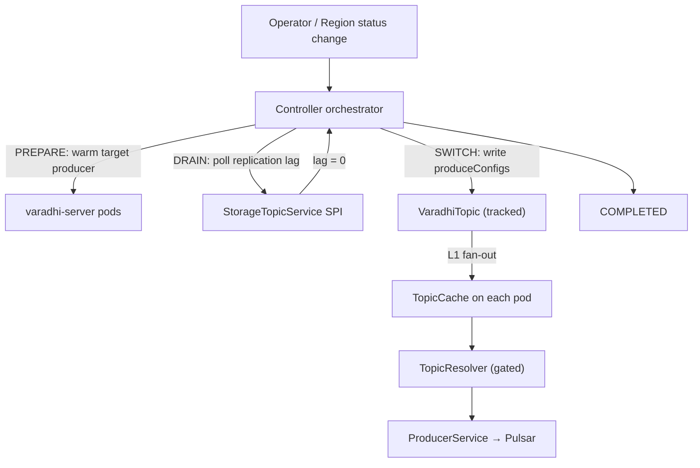
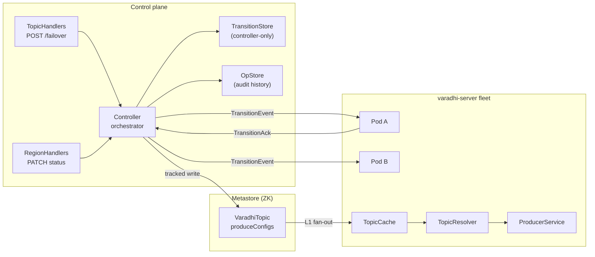
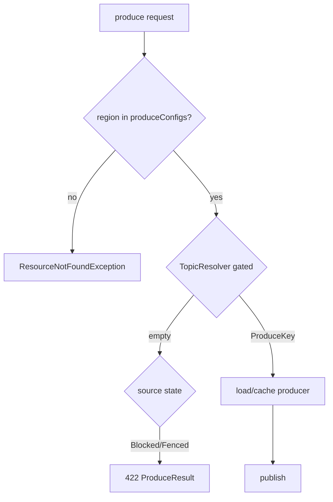

# VIP-0003: Topic Failover (Produce Path)

**Status:** Draft — entity layer and produce routing **shipped**; controller orchestration,
operator REST, and automatic failover are **not implemented**. Open items tracked in
[Open Questions](#20-open-questions).

**Audience:** Varadhi maintainers and contributors.

---

## 1. Summary

Varadhi topics can span multiple regions. When a region or topic becomes unhealthy, produce
authority must move to a surviving region **without redeploying producers** and with a
**bounded** outage window during cutover.

**Chosen model (entity layer — shipped):** per-region produce policy lives in
`Map<RegionName, ProduceConfig>` on `VaradhiTopic`. Each entry carries `TopicState`
(`Producing` / `Blocked` / `Fenced`), `produceIdx` (active storage segment id), and optional
`failOverRegion`. `TopicResolver` maps a pod's deployed region to a `ProduceKey`
`(topicFqn, produceRegion, storageTopicId)`; `ProducerService` gates on source-region state.

**Chosen orchestration (controller — proposed):** a stage machine
`PENDING → PREPARE → DRAIN → SWITCH → COMPLETED` (or `ABORTED`) driven by the controller.
Pods receive self-contained `TransitionEvent` broadcasts, pre-warm at PREPARE, wait for
replication lag at DRAIN (source still producing), fence at SWITCH, and ack via `TransitionAck`.
The **only routing input on pods** is `VaradhiTopic` in `TopicCache` — not the transition
object or operation record.



**Manual failover** (operator REST) is the v1 product. **Automatic failover** (react to
`Region.status` when `autoFailover=true`) is designed but deferred. **Consumer /
subscription follow-the-producer** is explicitly out of scope for this VIP.

---

## 2. Goals & Non-Goals

### Goals

- Move produce authority between regions with **metadata-driven routing** (no producer redeploy).
- Support **planned DR** (operator-initiated) and **reactive** failover (region/topic unhealthy).
- **Bound the produce outage** to the SWITCH window (`Fenced` → HTTP 422, client retries).
- **Pre-warm** target producers at PREPARE so SWITCH is fast.
- **Fleet-wide coordination** via per-stage pod ack barriers.
- **Audit trail** — durable operation history per failover attempt.
- **Fail safe** — refuse transitions that would leave no produce-capable region ("all-dark").
- Work for **grouped and ungrouped** topics; grouped topics require DRAIN (lag clear) before SWITCH.
- Support **storage migration** (same region, new segment) via the same transition machinery
  (`TransitionType.STORAGE_MIGRATION`).

### Non-Goals (this VIP)

- **Consumer / subscription relocation** — producers only; consumers stay on current assignment
  until a follow-up VIP.
- **Message-failure failover** (RQ/DLQ routing) — distinct from topic/region failover.
- **In-process Varadhi health probing of Pulsar** — `Region.status` (operator or external
  automation) is the source of truth for regional unavailability.
- **Billing / SLO metering** of failover events.
- **Global multi-region controller** — v1 is per deployment region; cross-region coordination
  uses replicated topic metadata and operator adjustment of `perRegionQuotaWeights`.
- **V1↔V2 runtime coexistence** — separate grooming; not in scope here.
- **Legacy `internalTopics` JSON migration** — not required for v1 manual failover.

---

## 3. Background & Current State

### 3.1 Codebase findings (shipped)

| Component | Role | Path |
|---|---|---|
| `ProduceConfig` | Per-region `state`, `produceIdx`, `failOverRegion` | `entities/.../ProduceConfig.java` |
| `VaradhiTopic.produceConfigs` | SSOT for region membership + policy | `entities/.../VaradhiTopic.java` |
| `TopicState` | `Producing` / `Blocked` / `Fenced` + `ProduceStatus` mapping | `entities/.../TopicState.java` |
| `TopicResolver` | Gated/ungated resolve → `ProduceKey` | `entities/.../TopicResolver.java` |
| `ProducerService` | Gated resolve; `ResourceNotFoundException` when region missing | `producer/.../ProducerService.java` |
| `SegmentedStorageTopic.getTopic(id)` | Public segment lookup by `StorageTopic.id` | `entities/.../SegmentedStorageTopic.java` |
| Transition wire types | `TransitionEvent`, `TransitionAck`, stages, types | `entities/.../cluster/failover/*` |
| `Region`, `RegionStatus` | Regional availability admin entity | `entities/.../Region.java` |
| `RegionHandlers` | `GET/POST/PATCH/DELETE /v1/regions` | `web/.../RegionHandlers.java` |
| `MemberInfo.region` | Pod region identity for routing | `core/.../MemberInfo.java` |
| `autoFailover` on topic | Controller may auto-failover when true | `VaradhiTopic` (field only; no consumer) |

**Topic creation today:** `VaradhiTopicFactory` seeds one `produceConfigs` entry for
`deploymentRegion` only. Multi-region creation is follow-up.

**Producer cache key:** `ProduceKey(topicFqn, produceRegion, storageTopicId)` — region is
explicit after resolve, not implicit in JVM deployment region alone.

### 3.2 Documented but not in tree

| Item | Status |
|---|---|
| `POST /v1/projects/:p/topics/:t/failover` | Not implemented |
| Controller orchestrator (`TransitionStore`, stage executor) | Not implemented |
| Pod `TransitionEvent` handler / pre-warm | Not implemented |
| `AutomaticFailoverJob` / `TopicFailoverService` | Deferred (Approach 2) |

**Canonical model:** entity shape is `produceConfigs` + shared `segmentedStorageTopic` (see §8);
orchestration is controller stage machine + pod ack barriers (see §9). Older design threads
using `internalTopics`, flat `produceRegions` sets, or `regionConfigs` are superseded.

---

## 4. Failover Case Matrix

Every row is a scenario this VIP must either handle or explicitly exclude.

### 4.1 Trigger taxonomy

| ID | Case | Trigger | Mechanism | In scope |
|---|---|---|---|---|
| T1 | **Planned DR** | Operator REST `POST .../failover` | Orchestrated PREPARE→DRAIN→SWITCH | ✅ v1 |
| T2 | **Region produce outage** | `Region.status` → `PRODUCE_UNAVAILABLE` / `UNAVAILABLE` / `MSP_UNAVAILABLE` | Auto job evicts region from active produce set | ⏳ deferred |
| T3 | **Topic-local outage** | Operator targets one topic in a healthy region | Same orchestration as T1 | ✅ v1 |
| T4 | **Storage migration** | Operator / automation moves Pulsar topic within region | `STORAGE_MIGRATION`; updates `produceIdx` only | ✅ same machinery |
| T5 | **Partition growth** | New segment in `SegmentedStorageTopic` | `produceIdx` change; no region flip | ✅ via `produceConfigs` update |
| T6 | **Message delivery failure** | Consumer nack → RQ/DLQ | Consumer `message-failure-routing` | ❌ out of scope |
| T7 | **Failback** | Recovered region re-enters active set | Optional REST / auto re-add | ⏳ future |

### 4.2 Authority models

| ID | Case | Steady state | Failover action |
|---|---|---|---|
| A1 | **Single-active** | One region `Producing`, others `Blocked` | Flip source→target; set `failOverRegion` on source |
| A2 | **Multi-active** | Multiple regions `Producing` | Evict failed region; others continue without flip |
| A3 | **Failover routing** | Source `Producing` + `failOverRegion=target` | `TopicResolver` routes to target's `produceIdx` |
| A4 | **All-dark guard** | No region can accept produce | **Refuse** SWITCH; alert; no metadata write |

Entity model allows A2 and A3 concurrently (`TopicState` javadoc: multiple `Producing` regions).

### 4.3 Transition stages

| Stage | Broadcast to pods? | Produce behavior (source region) | Topic write |
|---|---|---|---|
| `PENDING` | Optional | Steady | None |
| `PREPARE` | Yes + ack barrier | Source still `Producing`; **pre-warm target** | None |
| `DRAIN` | No (controller-only) | Source still `Producing`; **poll replication lag until zero** | None |
| `SWITCH` | Yes + ack barrier | Source → `Fenced` (422 retry); then `Blocked` | **Tracked write**: flip `produceConfigs` |
| `COMPLETED` | Terminal ack | Normal on target | Cosmetic cleanup |
| `ABORTED` | Terminal | Rollback if partial SWITCH | Tracked rollback if needed |

### 4.4 TopicState → client behavior

| `TopicState` | `isProduceAllowed()` | HTTP | `ProduceStatus` | When |
|---|---|---|---|---|
| `Producing` | yes | 200 path | `Success` (broker) | Steady accept |
| `Fenced` | no | **422** | `Fenced` | SWITCH window; client retries |
| `Blocked` | no | **422** | `NotAllowed` | Drained / standby region |

**Gating rule (shipped):** `TopicResolver.resolve(topic, region, true)` checks **source**
region's `ProduceConfig.state` only — not failover target state. Ungated resolve supports
cache warm during `Fenced`.

### 4.5 Ordering semantics

| Topic | `grouped` | Failover implication |
|---|---|---|
| Ungrouped | `false` | Unordered; simpler cutover |
| Grouped | `true` | Mostly ordered (`X_GROUP_ID`); **replication-lag wait in DRAIN before SWITCH** |

### 4.6 Pod participation

| `TransitionParticipation` | Pod behavior |
|---|---|
| `INVOLVED` | Has producer for topic; runs PREPARE pre-warm; acks all stages |
| `NOT_INVOLVED` | No producer for topic; skips pre-warm; still acks for barrier |

Fan-out includes **Server** (main produce) and **Consumer** pods that produce to IQ/RQ/DLQ.

### 4.7 Cross-region produce connectivity

| Mode | Config | Behavior |
|---|---|---|
| **Local-only (default)** | `crossRegionProduce.enabled=false` | Pod not in active produce set rejects; client hits another region's Varadhi |
| **Cross-region** | `enabled=true` | Pod may produce to active region's broker directly |

### 4.8 Edge cases & guards

| ID | Case | Required behavior |
|---|---|---|
| E1 | Failover target not in `produceConfigs` | `TopicResolver` returns empty → 404 / non-producing |
| E2 | Missing storage segment (`produceIdx`) | `IllegalArgumentException` at resolve (fail loud in tests) |
| E3 | Concurrent failover on same topic | One active transition per topic (`TransitionStore` uniqueness) |
| E4 | Concurrent topic CRUD during SWITCH | Optimistic version conflict → 409 / abort |
| E5 | Controller restart mid-transition | Reconciler resumes or aborts from durable op + transition state |
| E6 | Pod ack timeout | Abort or retry stage; configurable timeout (~5s base case) |
| E7 | PREPARE `ProducerBusy` | Do not open competing producer on target while source live |
| E8 | Replication lag > 0 at DRAIN | Block progression to SWITCH until zero |
| E11 | Auto-failover cooldown | Per-topic / per-region cooldown prevents flap |
| E13 | `autoFailover=false` on topic | Skip in automatic region batch |

---

## 5. Requirements & Constraints

### 5.1 Functional requirements

| # | Requirement |
|---|---|
| F1 | Per-region produce policy in `produceConfigs` is the **only** routing SSOT on pods. |
| F2 | Failover updates `produceConfigs` via immutable `VaradhiTopic.with(region, config)` copies. |
| F3 | `failOverRegion` must reference a region present in `produceConfigs` (validate on write). |
| F4 | Orchestration uses `TransitionEvent` / `TransitionAck` wire contract (entities shipped). |
| F5 | PREPARE carries typed `target` (`Target.Region` or `Target.StorageTopic`). |
| F5a | DRAIN completes (replication lag zero) **before** SWITCH Topic write. |
| F6 | SWITCH performs exactly one **tracked** `VaradhiTopic` write per transition (Topic-first ordering). |
| F7 | Pods converge on SWITCH via `topicVersionToAwait` in `TopicCache`, not op state. |
| F8 | Operator REST: `POST/GET/abort` failover; `GET /v1/admin/failovers/active`. |
| F9 | Region admin: `PATCH /v1/regions/:r` updates `RegionStatus` (shipped). |
| F10 | Auth: `TOPIC_UPDATE` for failover; region admin separate. |
| F11 | Audit: `TopicFailoverOperation` retained in `OpStore` (history). |
| F12 | Optional replication-lag SPI: `StorageTopicService.getReplicationLag(...)`. |
| F13 | Producer cache invalidated on topic version change affecting `ProduceKey`. |
| F14 | Automatic failover (deferred): react to `Region` status + `autoFailover` flag. |

### 5.2 Non-functional requirements

| Area | Requirement |
|---|---|
| **Availability** | Produce outage bounded to SWITCH fence window; DRAIN keeps source `Producing` |
| **Latency** | Base case target ~1s end-to-end (local harness); PREPARE pre-warm avoids cold SWITCH |
| **Consistency** | Pods route only from `TopicCache` version; no split-brain from op/transition reads |
| **Idempotency** | Stage handlers and REST flip re-entrant after controller crash |
| **Scalability** | Parallel failovers across topics; **serialized per topic** |
| **Safety** | All-dark guard; fail closed on unknown region; no silent cross-region loss (local-only default) |
| **Operability** | Per-stage metrics; active transition query; audit per `opId` |
| **Migration** | New wire shape `produceConfigs`; legacy `internalTopics` out of v1 scope |

### 5.3 Correctness invariants

1. **Topic-first write ordering at SWITCH** — tracked `VaradhiTopic` write before op stage flip
   and before pod barrier completes (pods only trust Topic version).
2. **One active transition per topic** — `TransitionStore` create-on-FQN enforces uniqueness.
3. **Self-contained pod events** — pod needs only `TransitionEvent` + local `TopicCache`.
4. **No pod reads `TransitionObject` or `TopicFailoverOperation`** for routing.
5. **Storage migration does not change `failOverRegion`** — only `produceIdx`.
6. **PREPARE warm uses explicit `storageTopicId`** when type is `STORAGE_MIGRATION`; ungated
   resolve alone is insufficient.

---

## 6. Approaches & Decision

| Approach | Mechanism | Verdict |
|---|---|---|
| **A — Metadata-only flip** | Single `topicStore.update` flips `produceConfigs`; no pod coordination | Too risky for fleet pre-warm and fence window; no audit stages |
| **B — Orchestrated transition** *(chosen)* | Controller stage machine + pod ack barriers + Topic-first write | Bounded outage, pre-warm, audit, recoverable |
| **C — Per-pod autonomous flip** | Each pod flips locally on region signal | Split-brain risk; **rejected** |
| **D — Shared distributed lock** | Global lock per topic during failover | Adds hot-path dependency; **rejected** |

### Manual vs automatic

| Mode | v1 | Mechanism |
|---|---|---|
| **Manual** | ✅ Product | Operator REST → orchestrator |
| **Automatic** | ⏳ Deferred | `Region` status watcher + `autoFailover` + cooldowns |

---

## 7. Architecture Overview



### Components (proposed additions)

| Component | Container | Responsibility |
|---|---|---|
| `failover-orchestrator` | varadhi-controller | Stage machine, ack barriers, DRAIN lag poll |
| `transition-store` SPI | metastore-zk | Controller-only `TransitionObject` persistence |
| `topic-failover-handlers` | varadhi-server (web) | REST surface for manual failover |
| `transition-handler` | varadhi-server + varadhi-consumer | Pod-side PREPARE pre-warm + ack |

Entity types (`TransitionEvent`, etc.) are **shipped** in `entities` — not new.

---

## 8. Entity Model (shipped)

### 8.1 VaradhiTopic

```
segmentedStorageTopic     // shared across regions
produceConfigs            // Map<RegionName, ProduceConfig> — SSOT
autoFailover              // controller may auto-failover
```

### 8.2 ProduceConfig (per region)

| Field | Role |
|---|---|
| `state` | `Producing` / `Blocked` / `Fenced` |
| `produceIdx` | Active `StorageTopic.id` for this region's produce path |
| `failOverRegion` | Optional route-to region (must exist in map) |

### 8.3 Example: single-active failover HYD → CH

**Before:**
```java
HYD: ProduceConfig(Producing, 0, null)
CH:  ProduceConfig(Blocked, 0, null)
```

**During DRAIN (source still producing, lag clearing):**
```java
HYD: ProduceConfig(Producing, 0, null)
CH:  ProduceConfig(Blocked, 0, null)
```

**During SWITCH (source fenced):**
```java
HYD: ProduceConfig(Fenced, 0, CH)
CH:  ProduceConfig(Producing, 0, null)
```

**After SWITCH (steady on target):**
```java
HYD: ProduceConfig(Blocked, 0, CH)
CH:  ProduceConfig(Producing, 0, null)
```

### 8.4 Transition wire types (shipped)

| Type | Role |
|---|---|
| `TransitionType` | `TOPIC_FAILOVER`, `STORAGE_MIGRATION` |
| `TransitionStage` | `PENDING`, `PREPARE`, `DRAIN`, `SWITCH`, `COMPLETED`, `ABORTED` (operational order) |
| `TransitionEvent` | Controller → pod broadcast (self-contained) |
| `TransitionAck` | Pod → controller per-stage ack |
| `TransitionParticipation` | `INVOLVED`, `NOT_INVOLVED` |

---

## 9. Orchestration (proposed)

### 9.1 Stage sequence (topic failover)

```mermaid
sequenceDiagram
    participant Op as Operator
    participant Ctrl as Controller
    participant ZK as TopicStore
    participant Pod as Server pod
    participant Pulsar as Messaging stack

    Op->>Ctrl: POST /failover {toRegion}
    Ctrl->>Ctrl: create Op + TransitionObject
    Ctrl->>Pod: TransitionEvent PREPARE (target=Region)
    Pod->>Pod: pre-warm producer
    Pod->>Ctrl: TransitionAck success
    loop DRAIN
        Ctrl->>Pulsar: getReplicationLag
    end
    Note over Ctrl,Pulsar: lag = 0; source still Producing
    Ctrl->>ZK: SWITCH write produceConfigs (version N+1)
    Ctrl->>Pod: TransitionEvent SWITCH (awaitVersion=true)
    Pod->>Pod: observe TopicCache >= N+1
    Pod->>Ctrl: TransitionAck success
    Ctrl->>Ctrl: COMPLETED, delete TransitionObject
```

### 9.2 REST API (proposed)

| Method | Route | Behavior |
|---|---|---|
| `POST` | `/v1/projects/:p/topics/:t/failover` | Body: `{ toRegion, waitForReplicationLagToClear? }` → `200` + `opId` |
| `GET` | `/v1/projects/:p/topics/:t/failover` | Active transition snapshot (404 if none) |
| `POST` | `/v1/projects/:p/topics/:t/failover/abort` | Only while `PENDING`, `PREPARE`, or `DRAIN` (before SWITCH write) |
| `GET` | `/v1/admin/failovers/active` | List active transitions |

`200` means **failover requested and durably recorded**, not "transition completed".

### 9.3 Write ordering (non-negotiable)

| Stage | Order |
|---|---|
| **SWITCH** | 1. Write **tracked** `VaradhiTopic` → 2. Update op stage → 3. Broadcast SWITCH event |
| **ABORT after partial SWITCH** | 1. Write **tracked** Topic rollback → 2. Mark op `ERRORED` → 3. Delete transition pointer |
| **Create** | 1. Write Op → 2. Enqueue → 3. Create transition pointer |

No ZK `multi()` on the failover path — idempotent stages + reconciler provide convergence.

### 9.4 CRUD guards

- Topic delete/update blocked while active transition exists for that FQN.
- Failover request rejected if target region not in `produceConfigs`.
- Failover request rejected if all-dark would result.

---

## 10. Producer Path (shipped + proposed)

### 10.1 Shipped hot path



### 10.2 PREPARE pre-warm (proposed)

- **Topic failover:** warm producer for `Target.Region` using gated resolve on target region.
- **Storage migration:** warm producer for `Target.StorageTopic(storageTopicId)` explicitly —
  do not rely on `TopicResolver` alone (current active `produceIdx`).
- Avoid `ProducerBusy` — do not attach target producer while source producer is still live
  for the same cache key.

### 10.3 Producer cache

- Key: `ProduceKey(topicFqn, produceRegion, storageTopicId)`.
- Invalidate entries when tracked topic version changes fields affecting resolve output.

---

## 11. Automatic Failover (deferred)

Triggered when `Region.status` is not produce-capable and topic has `autoFailover=true`.

| Control | Purpose |
|---|---|
| Per-topic cooldown | Prevent flap |
| Per-region rate limit | Cap flips per minute |
| Global freeze flag | `/varadhi/failover/freeze=true` kill-switch blocks auto (manual may override) |
| `skipValidation` on REST | Operator override to bypass replication-lag wait (emergency; documented risk) |
| Idempotent flip to same state | 200 no-op when target already active |
| `TopicTag.HIGH_PRIORITY` | Order batch processing (enum shipped; field TBD) |

Region eviction in multi-active topology: remove failed region from active set; use
`failOverRegion` when configured; skip topics with `autoFailover=false`.

---

## 12. Feature Enablement

| Gate | Level | Effect |
|---|---|---|
| `autoFailover` on topic | Topic | Allows automatic region-driven failover (Phase 3) |
| Manual REST | Always (with auth) | Operator can failover regardless of `autoFailover` |

---

## 13. Failure Handling

| Condition | Behaviour |
|---|---|
| Pod unreachable at PREPARE | Abort transition; no Topic write |
| Pod ack failure at SWITCH | Abort; rollback tracked Topic if written |
| Replication lag never clears | DRAIN timeout → ABORTED |
| Controller crash mid-stage | Reconciler resumes from Op + TransitionObject |
| Target region missing from map | Fail at request validation (400) |
| Concurrent topic edit | 409 / abort transition |
| Storage segment id missing | Resolve fails loud; transition should not reach SWITCH |

---

## 14. Interaction with Produce Rate Limiting

- **Regional quota stranding:** when traffic shifts regions, static `perRegionQuotaWeights`
  may strand quota in a dead region. Mitigation: operator adjusts weights when marking a
  region unavailable — same operational moment as failover.
- **Rate limiter during Fenced:** fenced produce returns 422 before rate limiter — clients
  retry; rate limiter not the primary signal during transition.
- **`perRegionQuotaWeights`** lives on `VaradhiTopic` alongside `produceConfigs` — failover
  does not remove it; weight adjustment is orthogonal.

---

## 15. Observability

| Metric / signal | Purpose |
|---|---|
| `failover.transition.stage` (counter by stage, outcome) | Stage success/failure rates |
| `failover.transition.duration` (histogram per stage) | Latency SLO |
| `failover.active` (gauge) | Active transitions |
| `failover.abort.total` | Aborted transitions |
| `produce.fenced.total` (per topic, region) | Client retry pressure during SWITCH |
| `failover.replication_lag` (gauge at DRAIN) | Lag wait progress |
| Audit log per `opId` | Operator forensics |

---

## 16. Testing Strategy

### Unit

- `TopicResolver`: unknown region, missing failover target, gated vs ungated, invalid
  `produceIdx`, failover routing to target's segment.
- `TopicState` → `ProduceStatus` mapping.
- `TransitionAck`: blank `errorMsg` = success; `failure()` rejects blank reason.
- `TransitionEvent` polymorphic target serialization.
- Stage guard logic: abort only in `PENDING` / `PREPARE` / `DRAIN` (before SWITCH); all-dark detection.

### Integration

- Manual failover happy path: PREPARE warm → DRAIN lag clear → SWITCH fence → COMPLETED.
- Abort before SWITCH: no Topic version change (includes abort during DRAIN).
- Partial SWITCH rollback: Topic restored, pods converge back.
- Concurrent failover rejected (second request 409).
- Producer cache: new `ProduceKey` after SWITCH.
- Region missing from `produceConfigs` → 404 on produce.

### E2E / harness

- Base case timeline target ~0.8–1s (local harness).
- Multi-pod ack barrier (when fleet available).
- Grouped topic: DRAIN replication-lag gate before SWITCH.
- `autoFailover=false` topic skipped in region batch (deferred).

### Load

- Parallel failovers across N topics; per-topic serialization verified.
- No hot-path regression on produce when no active transition.

---

## 17. Phasing / Rollout

| Phase | Deliverable | Notes |
|---|---|---|
| **0 — Shipped** | Entity model, `TopicResolver`, transition wire types, region admin, Fenced 422 | Current branch |
| **1 — Manual orchestration** | REST + controller stage machine + pod handler + `TransitionStore` | v1 product |
| **2 — Multi-region create** | Factory seeds all `produceConfigs` entries; project replication defaults | Enables real multi-region |
| **3 — Automatic failover** | `Region` status watcher + cooldowns + freeze | Deferred |
| **4 — Consumer follow** | Subscription relocation | Separate VIP |
| **5 — Failback** | Re-add recovered region | Optional, off by default |

Rollout: enable on staging with manual failover only → shadow metrics on fence rate →
production DR drills → automatic last.

---

## 18. Future Work

- `Project.replicationRegions` and explicit produce-region sets at create time.
- `TopicTag` on `VaradhiTopic` for priority batch ordering.
- Convenience queries (`isGlobalTopic()`, `canProduceInRegion()`).
- Legacy `internalTopics` deserializer backfill.
- Cross-region produce mode as deployment default policy.
- Consumer/subscription follow-the-producer.
- Global coordinator for dynamic region weights (future rate-limit coordination phase).

---

## 19. Implementation Work Items

| ID | Work item | Module | Depends |
|---|---|---|---|
| W1 | `TransitionStore` SPI + ZK impl | metastore-zk, spi | — |
| W2 | `TopicFailoverOperation` entity + OpStore wiring | entities, controller | — |
| W3 | Orchestrator stage executor + reconciler | controller | W1, W2 |
| W4 | REST handlers (`POST/GET/abort`) | web | W3 |
| W5 | Pod `TransitionEvent` handler + pre-warm | producer, consumer | W3 |
| W6 | CRUD guards (active transition blocks edit) | core, web | W1 |
| W7 | Replication-lag SPI (optional preflight) | pulsar/spi | W3 |
| W8 | Multi-region topic factory | core | Phase 2 |
| W9 | `AutomaticFailoverJob` | controller | W3, Phase 3 |
| W11 | Metrics + admin list endpoint | controller, producer | W3 |

---

## 20. Open Questions

### Scope

1. **Orchestrated manual failover only for v1**, or ship a metadata-only flip first?
2. **Transport for pod events** — ZK watch, `OperationMgr.publish`, or direct event-bus?
3. External API shape: expose `produceRegions` set or only `produceConfigs` map?

### Entity / API

4. Default topology for new topics: single-active or multi-active?
5. When does `Project.replicationRegions` land relative to orchestration?
6. Is `TopicTag` on `VaradhiTopic` required for v1 manual path?

### Cutover

7. Local-only vs cross-region produce as default?
8. Is replication-lag SPI required for v1 or optional?
9. PREPARE pre-warm: separate cache namespace vs in-place producer swap?
10. Exact HTTP status for concurrent failover (409 proposed)?

### Automation (deferred)

11. Cooldown defaults (per topic, per region)?
12. `HIGH_PRIORITY` tag ordering in region batch?
13. Empirical gate for enabling auto-failover in production?
14. `skipValidation` on REST: per-request vs deployment flag?
15. Global freeze: manual override policy?
16. Legacy `internalTopics` migration: inline deserializer vs offline job?

### Ops

17. Multi-pod ack barrier validation beyond single-pod harness?
18. Consumer IQ/RQ/DLQ pods in same barrier as Server — confirmed?
19. Failback default on region recovery?
