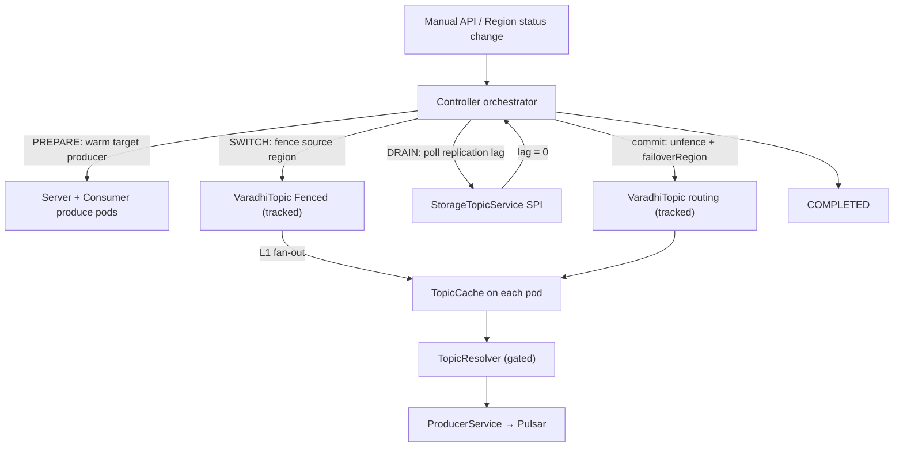
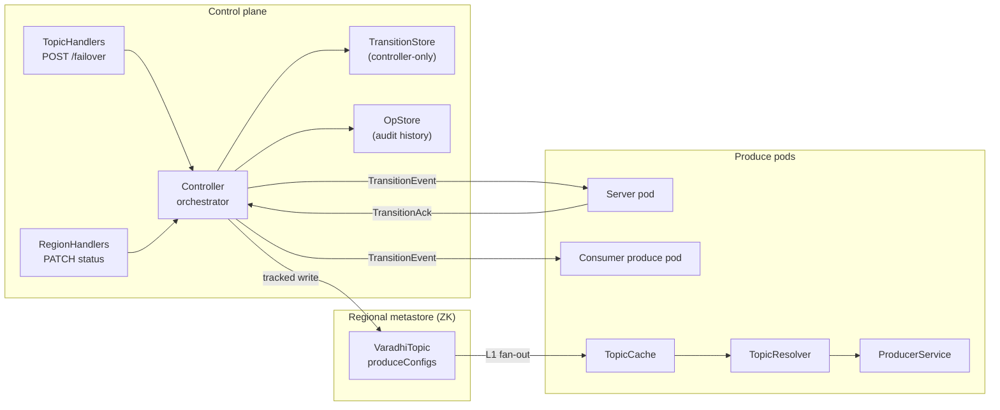
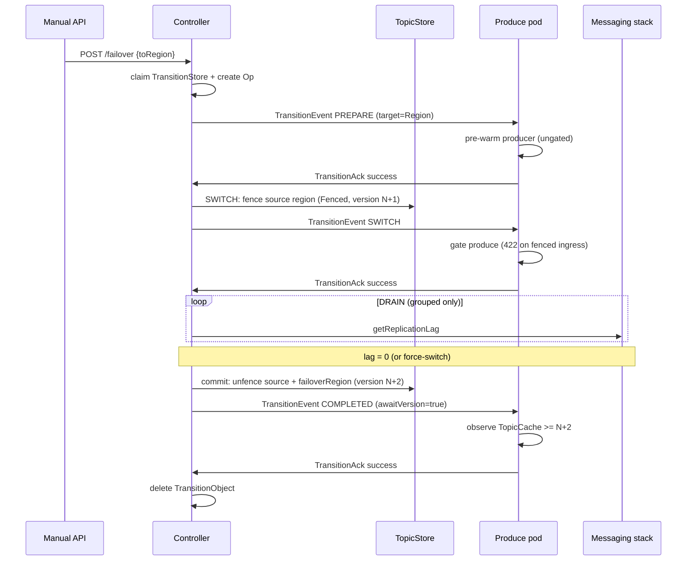
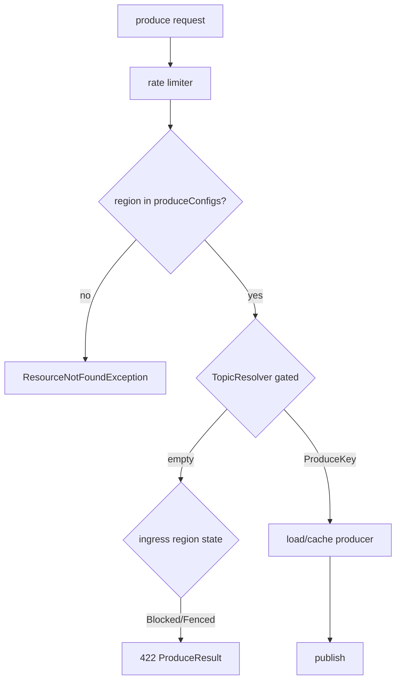

# VIP-0003: Internal Topic Failover (Produce Path)

**Status:** Draft — entity layer and produce routing **shipped**; controller orchestration,
manual failover REST, and automatic failover are **not implemented**.

**Audience:** Varadhi maintainers and contributors.

---

## 1. Summary

Varadhi topics can span multiple regions. When a region or topic becomes unhealthy, produce
authority must move to a surviving region **without redeploying producers** and with a
**bounded** outage window during cutover.

### Produce authority

**Produce authority** is which region is the authorized **write target** for a topic at a
given moment — the region whose Varadhi pods may accept produce requests and publish to that
topic's active storage segment (`produceIdx`).

It lives in topic metadata (`produceConfigs`), not in producer application deployment. The
authoritative region has `TopicState.Producing`; standby regions are `Blocked` (or briefly
`Fenced` during cutover). **Moving produce authority** means updating `produceConfigs` so a
different region becomes `Producing`. Producer apps and client endpoints stay the same; pods
converge via `TopicCache` after a metastore write.

**Today (shipped):** per-region policy is `Map<RegionName, ProduceConfig>` on `VaradhiTopic`.
**Target shape:** a separate produce-policy resource; this VIP documents behaviour against the
shipped field until that split lands.

Each `ProduceConfig` carries `TopicState` (`Producing` / `Blocked` / `Fenced`), `produceIdx`
(active storage segment id), and optional `failoverRegion` (Java field name today:
`failOverRegion`).

**ProduceKey** `(topicFqn, produceRegion, storageTopicId)` is the resolved identity of where a
produce actually goes. `TopicResolver` computes it from `produceConfigs`; `ProducerService`
uses it as the **producer cache key** to load or reuse the broker client for that topic,
region, and segment.

**Ingress region** is the pod's deployed region (`ProducerService.produceRegion`, passed to
`TopicResolver.resolve(topic, region, …)` as `region`). It is not a separate field — there is
no `sourceRegion` on the produce path. Gated resolve (`onlyProduceAllowed=true`) checks
**that** region's `ProduceConfig.state` only. If the client hits a pod whose ingress region is
`Fenced` or `Blocked`, produce returns **422**; the client retries another region (DNS /
routing). Ungated resolve (`onlyProduceAllowed=false`) is used only for PREPARE pre-warm and
does not bypass client-visible gating on the hot path.

**ProduceKey.produceRegion** is different: it is the **target** broker region after routing
(`failoverRegion` if set, else ingress region).

**Chosen orchestration (controller — proposed):** a stage machine
`PENDING → PREPARE → SWITCH → DRAIN → COMPLETED` driven by the controller: block produce
before replication-lag wait, then commit authority. Any non-terminal stage may
transition to `ABORTED`. **varadhi-server** and **varadhi-consumer** pods that produce (main
produce plus IQ/RQ/DLQ) receive self-contained `TransitionEvent` broadcasts, pre-warm at PREPARE
(ungated resolve on the target), fence the failing region at SWITCH, and ack via `TransitionAck`.
Controller polls replication lag during DRAIN (grouped only), then commits the tracked
routing state (source `Producing` + `failoverRegion=target`) before COMPLETED. The **only routing input on pods** is `VaradhiTopic` in
`TopicCache` — not the transition object or operation record.



**Manual failover** via authenticated REST (`POST .../failover`) is v1. **Automatic failover**
(react to `Region.status` when `autoFailover=true`) is designed but deferred.

**Region unhealthy (v1):** an admin triggers failover through the manual API. Automatic
reaction to `Region.status` is deferred (see §9).

---

## 2. Goals & Non-Goals

### Goals

- Reassign per-topic write routing across regions via `produceConfigs` / `failoverRegion` in metastore
  (**metadata-driven routing**; producer apps unchanged).
- Support **planned DR** (manual API) and **reactive** failover when a region or topic is
  unhealthy.
- **Bound the produce outage** to the SWITCH→DRAIN window (`Fenced` → HTTP 422; client retries
  another region).
- **Audit trail** — durable operation history per failover attempt.
- **Fail safe** — refuse transitions that would leave no produce-capable region ("all-dark").
- Work for **grouped and ungrouped** topics; grouped topics require DRAIN (replication lag
  zero via mandatory `StorageTopicService.getReplicationLag` SPI) after SWITCH fencing and
  before the authority commit.
- Support **storage migration** (same region, new segment) via the same transition machinery
  (`TransitionType.STORAGE_MIGRATION`).

### Non-Goals (this VIP)

- **Consumer-failure failover** (RQ/DLQ failovers) — distinct from topic/region failover.
- **In-process Varadhi health probing of Pulsar** — `Region.status` (admin or external
  automation) is the source of truth for regional unavailability.
- **Billing / SLO metering** of failover events.

---

## 3. Failover Case Matrix

Every row is a scenario this VIP must either handle or explicitly exclude.

### 3.1 Trigger taxonomy

| ID | Case | Trigger | Mechanism | In scope |
|---|---|---|---|---|
| T1 | **Planned DR** | Manual API `POST .../failover` | Orchestrated PREPARE→SWITCH→DRAIN | ✅ v1 |
| T2 | **Region produce outage** | `Region.status` → `PRODUCE_UNAVAILABLE` / `UNAVAILABLE` / `MSP_UNAVAILABLE` | Auto job evicts region from active produce set | ⏳ deferred |
| T3 | **Topic-local outage** | Admin targets one topic in a healthy region | Same orchestration as T1 | ✅ v1 |
| T4 | **Storage migration** | Admin / automation moves Pulsar topic within region | `STORAGE_MIGRATION`; updates `produceIdx` only | ✅ same machinery |
| T5 | **Partition growth** | New segment in `SegmentedStorageTopic` | `produceIdx` change; no region flip | ✅ via `produceConfigs` update |
| T6 | **Message delivery failure** | Consumer nack → RQ/DLQ | Consumer `message-failure-routing` | ❌ out of scope |
| T7 | **Failback** | Recovered region re-enters active set | Optional REST / auto re-add | ⏳ future |

### 3.2 Authority models

| ID | Case | Steady state | Failover action |
|---|---|---|---|
| A1 | **Single-active** | One region `Producing`, others `Blocked` | Flip source→target; set `failoverRegion` on source |
| A2 | **Multi-active** | Multiple regions `Producing` | Evict failed region; others continue without flip |
| A3 | **Failover routing** | Source `Producing` + `failoverRegion=target` | `TopicResolver` routes to target's `produceIdx` |
| A4 | **All-dark guard** | No region can accept produce | **Refuse** SWITCH; alert; no metadata write |

Entity model allows A2 and A3 concurrently (`TopicState` javadoc: multiple `Producing` regions).

### 3.3 Transition stages

`ABORTED` is reachable from `PENDING`, `PREPARE`, `SWITCH`, or `DRAIN` (before or after partial
authority commit at end of DRAIN — rollback rules in §7.3).

| Stage | Broadcast to pods?                  | Produce behavior (region losing authority) | Topic write |
|---|-------------------------------------|---|---|
| `PENDING` | Optional                            | Steady | None |
| `PREPARE` | Yes + ack barrier                   | Source still `Producing`; **pre-warm target** (ungated) | None |
| `SWITCH` | Yes + ack barrier                   | Source → `Fenced` (422); **stop new produce** before lag wait | **Tracked write**: fence source (`Fenced`) |
| `DRAIN` | No (controller-only) | Source stays `Fenced`; **poll replication lag until zero** (grouped only; force-switch — see §3.5) | **Tracked write** at lag=0 (or immediately in force-switch): unfence source (`Producing`) with `failoverRegion=target` |
| `COMPLETED` | Yes + ack barrier (`awaitVersion`) | Ingress at source `Producing`; `TopicResolver` routes to target via `failoverRegion` | Cosmetic cleanup |
| `ABORTED` | Terminal                            | Rollback if partial authority commit | Tracked rollback if needed |

Ungrouped topics skip DRAIN (no replication-lag gate); authority commit follows SWITCH directly.

**Replication lag:** two separate request controls — do not conflate them (see §3.5).

### 3.4 TopicState → client behavior

| `TopicState` | `isProduceAllowed()` | HTTP | `ProduceStatus` | When |
|---|---|---|---|---|
| `Producing` | yes | 200 path | `Success` (broker) | Steady accept |
| `Fenced` | no | **422** | `Fenced` | SWITCH / DRAIN window; client retries another region |
| `Blocked` | no | **422** | `NotAllowed` | Drained / standby region |

**Gating rule (shipped):** `TopicResolver.resolve(topic, region, true)` checks the **ingress**
region's `ProduceConfig.state` only (`region` = pod's deployed region) — not failover target
state. Ungated resolve supports PREPARE pre-warm only.

**Hot-path order:** rate limiter runs before `TopicResolver` / fence gate.

### 3.5 Ordering semantics

| Topic | `grouped` | Failover implication |
|---|---|---|
| Ungrouped | `false` | Unordered; skip DRAIN (no lag gate) |
| Grouped | `true` | Mostly ordered per `X_GROUP_ID`. DRAIN waits for replication lag = 0 **by default** so messages fenced at SWITCH have replicated before authority moves. **`waitForReplicationLagToClear=false`** (force-switch) proceeds after SWITCH fence even if lag > 0 — messages not yet replicated can be **lost**, breaking order within a group. |

**Failover request flags** — `POST .../failover`:

| Flag | Where | Default | Effect |
|---|---|---|---|
| **`waitForReplicationLagToClear`** | Request body (`FailoverRequest`) | `true` | **Pre-flight (grouped):** if `true`, API checks replication lag is within limits before starting. **Orchestrator (DRAIN):** if `true`, poll until lag = 0 (abort if lag increases); if `false` (**force-switch**), poll once then commit authority even if lag > 0 (warn; ordering loss). Persisted on the transition / op record. |
| **`skipValidation`** | Query param (admin-only) | `false` | Skips **topology pre-checks** only (`canFailover`: target region in replication topology, topic global, etc.). Does **not** skip DRAIN lag wait. |

Both flags are audited admin overrides when used to bypass safety checks.

### 3.6 Pod participation

| `TransitionParticipation` | Pod behavior |
|---|---|
| `INVOLVED` | Has producer for topic; runs PREPARE pre-warm; acks all stages |
| `NOT_INVOLVED` | No producer for topic; skips pre-warm; **acks to opt out of the stage gate** (controller stops waiting on this host) |

Fan-out: **varadhi-server** pods and **varadhi-consumer** pods that produce to IQ/RQ/DLQ.

### 3.7 Cross-region produce connectivity

| Mode | Config | Behavior |
|---|---|---|
| **Local-only (default)** | `crossRegionProduce.enabled=false` | Pod not in active produce set rejects; client hits another region's Varadhi |
| **Cross-region** | `enabled=true` | Pod may produce to active region's broker directly |

### 3.8 Edge cases & guards

| ID | Case | Required behavior |
|---|---|---|
| E1 | Failover target not in `produceConfigs` | `TopicResolver` returns empty → 404 / non-producing |
| E2 | Missing storage segment (`produceIdx`) | `IllegalArgumentException` at resolve (fail loud in tests) |
| E3 | Concurrent failover on same topic | One active transition per topic (`TransitionStore` uniqueness) |
| E4 | Concurrent topic update/delete during active transition | **Reject** at API when `TransitionStore.exists` (409). Orchestrator topic CAS (`BadVersion`) is a retry/abort backstop only — not the primary guard. |
| E5 | Controller restart mid-transition | Reconciler resumes or aborts from durable op + transition state |
| E6 | Pod ack timeout | **Retry** missing pods (targeted resend within `perStageTimeoutMs`); **abort** transition when timeout or retry budget exhausted |
| E7 | PREPARE `ProducerBusy` | Do not open competing producer on target while source live for same cache key |
| E8 | Replication lag > 0 at DRAIN (grouped, safe mode) | Block authority commit until zero; `waitForReplicationLagToClear=false` → force-switch (ordering loss) |
| E9 | Target not in replication topology | Reject at API unless `skipValidation=true` (admin); does not bypass DRAIN lag wait |
| E11 | Auto-failover cooldown | Per-topic / per-region cooldown prevents flap |
| E13 | `autoFailover=false` on topic | Skip in automatic region batch |

---

## 4. Approaches & Decision

| Approach | Mechanism | Verdict |
|---|---|---|
| **A — Metadata-only flip** | Single `topicStore.update` flips `produceConfigs`; no pod coordination | Too risky for fleet pre-warm and fence window |
| **B — Orchestrated transition** *(chosen)* | Controller stage machine + pod ack barriers + fence at SWITCH + authority commit after DRAIN | Bounded outage, pre-warm, recoverable |
| **C — Per-pod autonomous flip** | Each pod flips locally on region signal | Split-brain risk; **rejected** |
| **D — Shared distributed lock** | Global lock per topic during failover | Adds hot-path dependency; **rejected** |

**Topic writes (two tracked commits):** at **SWITCH**, persist source
`Fenced` (+ `failoverRegion=target`) and broadcast so pods stop new produce; at **DRAIN completion** (lag=0, or force-switch),
unfence source (`Producing`, `failoverRegion` retained) before broadcasting COMPLETED with
`awaitVersion=true`. Pods converge on topic version only; produce routes to the target broker via `TopicResolver`.

### Manual vs automatic

| Mode | v1 | Mechanism |
|---|---|---|
| **Manual** | ✅ | Manual failover REST → orchestrator |
| **Automatic** | ⏳ Deferred | `Region` status watcher + `autoFailover` + cooldowns |

---

## 5. Architecture Overview



### Components (proposed additions)

| Component | Container | Responsibility |
|---|---|---|
| `failover-orchestrator` | varadhi-controller | Stage machine, ack barriers, DRAIN lag poll |
| `transition-store` SPI | regional metastore-zk | Controller-only `TransitionObject` persistence |
| `topic-failover-handlers` | varadhi-server (web) | REST surface for manual failover |
| `transition-handler` | varadhi-server + varadhi-consumer | Pod-side handling of all `TransitionEvent` stages |

Entity types (`TransitionEvent`, etc.) are **shipped** in `entities` — not new.

---

## 6. Entity Model (shipped)

### 6.1 VaradhiTopic

```
segmentedStorageTopic     // shared across regions
produceConfigs            // Map<RegionName, ProduceConfig> — SSOT today
autoFailover              // controller may auto-failover
```

### 6.2 ProduceConfig (per region)

| Field | Role |
|---|---|
| `state` | `Producing` / `Blocked` / `Fenced` |
| `produceIdx` | Active `StorageTopic.id` for this region's produce path |
| `failoverRegion` | Optional route-to region (must exist in map; Java: `failOverRegion`) |

### 6.3 Example: failover routing region-a → region-b (A3)

**Before:**
```java
region-a: ProduceConfig(Producing, 0, null)
region-b: ProduceConfig(Blocked, 0, null)
```

**During SWITCH / DRAIN (source fenced, lag clearing — grouped only):**
```java
region-a: ProduceConfig(Fenced, 0, region-b)
region-b: ProduceConfig(Blocked, 0, null)
```

**After DRAIN commit (steady — route to target broker):**
```java
region-a: ProduceConfig(Producing, 0, region-b)
region-b: ProduceConfig(Blocked, 0, null)
```

Ingress at region-a accepts produce (`Producing`); `TopicResolver` follows `failoverRegion` to
region-b's `produceIdx`. Direct produce to region-b remains `Blocked` (422).

---

## 7. Orchestration (proposed)

### 7.1 Stage sequence (topic failover)



### 7.2 REST API

| Method | Route | Behavior |
|---|---|---|
| `POST` | `/v1/projects/:p/topics/:t/failover` | Body: `{ toRegion, waitForReplicationLagToClear? }` (default `true`). Query: `skipValidation?` (default `false`, admin-only). → `200` + `opId`. See §3.5 for flag semantics. |
| `GET` | `/v1/projects/:p/topics/:t/failover` | Active transition snapshot (404 if none) |
| `POST` | `/v1/projects/:p/topics/:t/failover/abort` | Only while `PENDING`, `PREPARE`, `SWITCH`, or `DRAIN` (before authority commit at end of DRAIN) |
| `GET` | `/v1/admin/failovers/active` | List active transitions |

`200` on `POST` means **failover requested and durably recorded**, not "transition completed".
Past attempts are queryable via `OpStore` audit (`opId`, stage history on
`TopicFailoverOperation`).

### 7.3 Write ordering (non-negotiable)

| Stage | Order |
|---|---|
| **Create** | 1. Claim `TransitionStore` (per-topic FQN uniqueness) → 2. Write Op → 3. Enqueue |
| **SWITCH** | 1. Write **tracked** `VaradhiTopic` (source `Fenced`) → 2. Update op stage → 3. Broadcast SWITCH event |
| **DRAIN commit** | 1. Write **tracked** `VaradhiTopic` (source `Producing`, `failoverRegion=target`) → 2. Update op stage → 3. Broadcast COMPLETED (`awaitVersion`) |
| **ABORT after partial commit** | 1. Write **tracked** Topic rollback → 2. Mark op `ERRORED` → 3. Delete transition pointer |

No ZK `multi()` on the failover path — idempotent stages + reconciler provide convergence.

### 7.4 CRUD guards and topic-write concurrency

**Primary — block admin CRUD during transition:**

- Topic **delete** and **update** rejected (409) while `TransitionStore` has an active entry for that FQN.
- Second failover on the same topic rejected (`TransitionStore.create` → `NodeExists`; see E3).
- Failover request rejected if target region not in `produceConfigs`.
- Failover request rejected if all-dark would result.

**Orchestrator — sequential topic writes (not version conflicts):**

Failover intentionally bumps `VaradhiTopic` version multiple times (e.g. SWITCH fence → v=N+1, DRAIN
commit → v=N+2). The controller owns that sequence; each write is deliberate progression, not
concurrent mutation.

**Pod convergence:** COMPLETED broadcast carries `awaitVersion` so pods wait for the post-commit
version — not generic conflict detection.

**Backstop — optimistic version on tracked writes:**

If a topic write races despite the CRUD guard (TOCTOU or orchestrator retry with a stale read),
`updateTrackedZNodeWithData` CAS fails (`BadVersion`) → orchestrator re-reads the topic and
retries the stage, or aborts the transition. This is metastore safety for any concurrent
`topicStore.update`, not failover-specific coordination.

---

## 8. Producer Path (shipped + proposed)

### 8.1 Shipped hot path



### 8.2 PREPARE pre-warm (proposed)

- **Topic failover:** ungated resolve for `Target.Region`; warm producer for target's
  `produceIdx`. Gated resolve is not used for pre-warm.
- **Storage migration:** warm producer for `Target.StorageTopic(storageTopicId)` explicitly.
- Avoid `ProducerBusy` — do not attach target producer while source producer is still live
  for the same cache key.

### 8.3 Producer cache

Two caches — do not conflate them:

| Cache | What it holds | How it stays fresh |
|---|---|---|
| `TopicCache` | `VaradhiTopic` snapshot (incl. `produceConfigs`) | Tracked TOPIC UPSERT replaces entry by version; produce always re-reads this before resolve |
| `producerCache` | Live broker `Producer` per `ProduceKey` | **Not** auto-updated when topic metadata changes |

- Key: `ProduceKey(topicFqn, produceRegion, storageTopicId)`.
- On TOPIC `UPSERT` / `INVALIDATE` for a FQN (same L1 event that updates `TopicCache`), **evict all
  `producerCache` entries for that FQN** — not a diff of “would resolve output change?”. Routing
  changes already yield a cache miss on the *new* `ProduceKey`; eviction drops *stale* entries for
  old keys (wrong broker, PREPARE pre-warm, in-flight race before `TopicCache` applies).
- Next produce: gated resolve reads the updated `TopicCache` → correct `ProduceKey` → cache miss →
  load fresh `Producer`.

---

## 9. Automatic Failover (deferred)

Triggered when `Region.status` is not produce-capable and topic has `autoFailover=true`.

| Control | Purpose |
|---|---|
| Per-topic cooldown | Prevent flap |
| Per-region rate limit | Cap flips per minute |
| Global freeze flag | `/varadhi/failover/freeze=true` kill-switch blocks auto (manual may override) |
| `skipValidation` on REST | Admin-only: skip replication **topology** pre-check at API time (not DRAIN lag wait) |
| `waitForReplicationLagToClear=false` | Force-switch: skip waiting for lag = 0 at DRAIN (ordering loss risk) |
| Idempotent flip to same state | 200 no-op when target already active |
| `TopicTag.HIGH_PRIORITY` | Order batch processing (enum shipped; field TBD) |

Region eviction in multi-active topology: remove failed region from active set; use
`failoverRegion` when configured; skip topics with `autoFailover=false`.

---

## 10. Observability

| Metric / signal | Purpose |
|---|---|
| `failover.transition.stage` (counter by stage, outcome) | Stage success/failure rates |
| `failover.transition.duration` (histogram per stage) | Latency SLO |
| `failover.active` (gauge) | Active transitions |
| `failover.abort.total` | Aborted transitions |
| `produce.fenced.total` (per topic, region) | Client retry pressure during SWITCH/DRAIN |
| `failover.replication_lag` (gauge at DRAIN) | Lag wait progress |
| Audit log per `opId` | Forensics |
